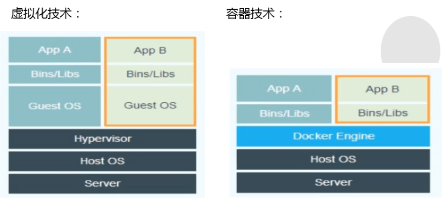
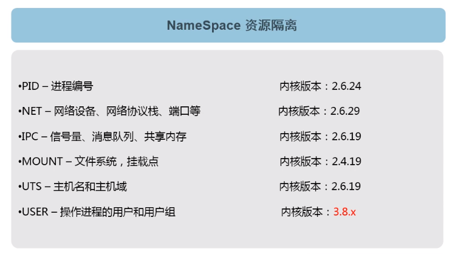
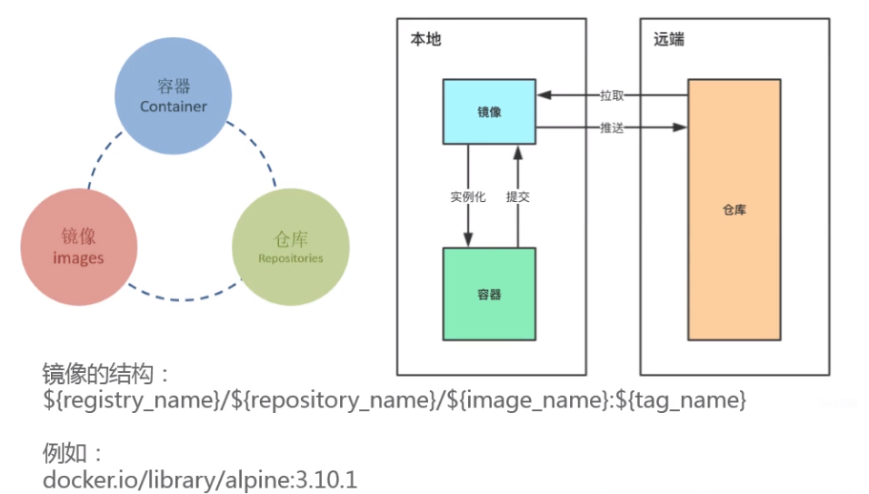

# Docker

## 第 1 章 容器技术的由来

### 1.1 容器概述

容器是一种基础工具。泛指任何可以用于容纳其它物品的工具，可以部分或完全封闭，被用于容纳、储存、运输物品。物体可以被放置在容器中，而容器则可以保护内容物。

容器的类型：瓶、罐、箱、篮、桶、瓮、碗、柜、盆、鞘 ...

### 1.2 容器技术由来


这里我们需要将上面的程序运行在同一个宿主机上，但是有相互隔离。



我们利用虚拟化技术完全可以解决，但是虚拟化技术成本有点大（需要单独安装操作系统），此时就可以使用容器化技术来解决这个问题，对比虚拟化技术极大的节约了系统开销。

那么我们如果想要用到这些容器化技术完成应用A和应用B的隔离，我们应该让它们在哪些层次或纬度上隔离呢？



## 第 2 章 Docker 介绍

### 2.1 Docker 起源


### 2.2 Docker 是什么

- Docker 基于容器技术的**轻量级**虚拟化解决方案。

- Docker 是**容器引擎**，把Linux的 cgroup、namespce 等容器底层技术进行封装抽象为用户提供了创建和管理容器的便捷界面（包括命令行和API）。

- Docker 是一个开源项目，诞生于 2013 年初，基于 Google 公司推出的 Go 语言实现。

- 微软，红帽Linux，IBM，Oracle等主流IT厂商已经在自己的产品里增加对 Docker 的支持。

- 相比其他早期的容器技术，Docker 引入了一整套容器管理的生态系统，包括分层的镜像模型，容器注册库，友好的 Rest API。

  

### 2.3 Docker 技术优势


| 指标         | 容器技术                                              | 虚拟机技术          |
| ------------ | ----------------------------------------------------- | ------------------- |
| 占用磁盘空间 | 小，甚至几十KB（镜像层的情况）                        | 非常大，上GB        |
| 启动速度     | 块，几秒钟                                            | 慢，几分钟          |
| 运行形态     | 直接运行于宿主机的内核上，不同容器共享同一个linux内核 | 运行于Hypervisior上 |
| 并发性       | 一台宿主机可以启动成千上百万个容器                    | 逊于宿主机          |
| 性能         | 接近宿主机本地进程                                    | 低                  |
| 资源利用率   | 高                                                    | 低                  |


## 第 3 章 Docker 容器引擎

### 3.1 介绍

Docker 引擎可以从 Docker 网站下载，也可以基于 GitHub 上的源码进行构建。无论是开源版本还是商业版本，都有 Linux 和 Windows 版本。

Docker 引擎主要有两个版本：企业版（EE）和社区版（CE）

每个季度，企业版和社区版都会发布一个稳定版本。社区版会提供4个月的支持，而企业版会提供12个月的支持。

从 2017 年第一季度开始，Docker 版本号遵循 YY.MM-xx 格式，类似于 Ubuntu等项目。例如，2018 年 6月第一次发布社区版为 18.06.0-ce。

> 注：2017 年第一季度以前，Docker版本号遵循大版本号.小版本号的格式。采用新格式前的最后一个版本是 Docker 1.13。

### 3.2 Docker引擎安装部署配置

1. 安装 epel 源

   ```sh
   yum install epel-release -y
   ```

   > **EPEL的全称叫 Extra Packages for Enterprise Linux** 。EPEL是由 Fedora 社区打造，为 RHEL 及衍生发行版如 CentOS、Scientific Linux 等提供高质量软件包的项目。装上了 EPEL之后，就相当于添加了一个第三方源。

2. 查看 epel 源中是否包括 docker 

   ```shell
   [root@thtf-02 ~]# yum list docker --show-duplicates
   Loaded plugins: fastestmirror, langpacks
   Loading mirror speeds from cached hostfile
   ...
   Available Packages
   docker.x86_64                    2:1.13.1-102.git7f2769b.el7.centos                    extras
   docker.x86_64                    2:1.13.1-103.git7f2769b.el7.centos                    extras
   docker.x86_64                    2:1.13.1-108.git4ef4b30.el7.centos                    extras
   docker.x86_64                    2:1.13.1-109.gitcccb291.el7.centos                    extras
   
   ```

   这里我们会发现 docker 的版本是 1.13.1 是17年之前的版本，如果你想要使用 ce 版，可以按照下面步骤执行。

3. 安装 yum-utils 工具，为了使用 yum-config-manager 去安装一个yum源

   ```shell
   yum install -y yum-utils
   ```

4. 添加 dockerce 的yum 源

   ```shell
   yum-config-manager --add-repo http://mirrors.aliyun.com/docker-ce/linux/centos/docker-ce.repo
   ```

   此时在通过 `yum list docker-ce --show-duplicates`查看，就会有很多 docker-ce版本

   ```shell
   [root@thtf-02 ~]# yum list docker-ce --show-duplicates
   Loaded plugins: fastestmirror, langpacks
   Loading mirror speeds from cached hostfile
    * base: mirror.bit.edu.cn
    * epel: mirrors.tuna.tsinghua.edu.cn
    * extras: mirror.bit.edu.cn
    * updates: mirror.bit.edu.cn
   Available Packages
   docker-ce.x86_64                   17.03.0.ce-1.el7.centos                   docker-
   docker-ce.x86_64                   3:18.09.2-3.el7                           docker-ce-stable
   ...
   docker-ce.x86_64                   3:19.03.3-3.el7                           docker-ce-stable
   docker-ce.x86_64                   3:19.03.4-3.el7                           docker-ce-stable
   docker-ce.x86_64                   3:19.03.5-3.el7                           docker-ce-stable
   docker-ce.x86_64                   3:19.03.6-3.el7                           docker-ce-stable
   docker-ce.x86_64                   3:19.03.7-3.el7                           docker-ce-stable
   docker-ce.x86_64                   3:19.03.8-3.el7                           docker-ce-stable
   ```

5. 安装 docker-ce

   ```shell
   #安装最新版本
   yum install docker-ce
   #安装指定版本
   yum install docker-ce-<VERSION STRING>
   ```

6. 启动 docker 引擎

   ```
   #开机启动
   systemctl enable docker
   #启动 docker
   systemctl start docker
   #查看 docker 版本
   docker version
   ```

7. docker 引擎配置

   ```json
   vi /etc/docker/daemon.json
   
   {
     "graph": "/data/docker",
     "storage-driver": "overlay2",
     "registry-mirrors": ["https://q2gr04ke.mirror.aliyuncs.com"],
     "insecure-registries": [], 
     "exec-opts": ["native.cgroupdriver=systemd"],
     "live-restore": true
   }
   ```

   - graph：镜像与容器的保存位置
   - storage-driver：要使用的存储驱动程序
   - insecure-registries: 设置私有仓库地址可以设为http

   - registry-mirrors： 国内的镜像加速器
   - exec-opts：运行时执行选项
   - live-restore：docker引擎死掉了，用docker 引擎起来的容器还可以运行

8. 重启 docker 

   ```shell
   #确保 /data/docker 存在
   mkdir -p /data/docker
   #重启 docker 
   systemctl restart docker
   ```

   

### 3.3 启动第一个 docker 容器


   运行 hello-world

   ```shell
   [root@thtf-02 ~]# docker run hello-world
   
   Hello from Docker!
   This message shows that your installation appears to be working correctly.
   
   To generate this message, Docker took the following steps:
    1. The Docker client contacted the Docker daemon.
    2. The Docker daemon pulled the "hello-world" image from the Docker Hub.
       (amd64)
    3. The Docker daemon created a new container from that image which runs the
       executable that produces the output you are currently reading.
    4. The Docker daemon streamed that output to the Docker client, which sent it
       to your terminal.
   
   To try something more ambitious, you can run an Ubuntu container with:
    $ docker run -it ubuntu bash
   
   Share images, automate workflows, and more with a free Docker ID:
    https://hub.docker.com/
   
   For more examples and ideas, visit:
    https://docs.docker.com/get-started/
   
   ```

1. Docker客户端联系Docker守护进程。

2. Docker守护进程从Docker中心提取“hello-world”映像。

3. Docker守护进程从运行可执行文件，生成您当前正在读取的输出。

4. Docker守护进程将输出流到发送它的Docker客户机的终端。


## 第 4 章 Docker 镜像的结构详解



