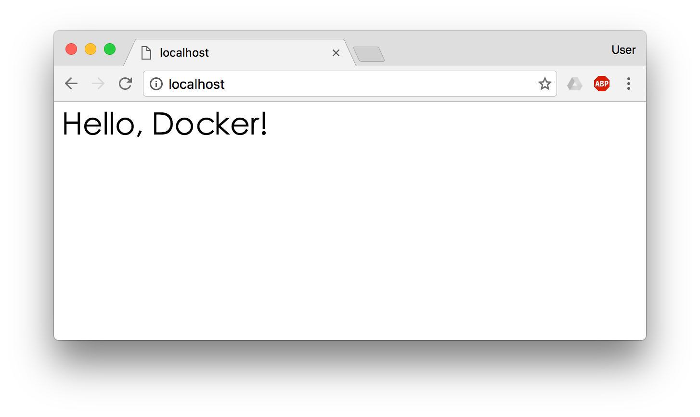

# Docker

## 第 1 章 容器技术的由来

### 1.1 容器概述

容器是一种基础工具。泛指任何可以用于容纳其它物品的工具，可以部分或完全封闭，被用于容纳、储存、运输物品。物体可以被放置在容器中，而容器则可以保护内容物。

容器的类型：瓶、罐、箱、篮、桶、瓮、碗、柜、盆、鞘 ...

### 1.2 容器技术由来


这里我们需要将上面的程序运行在同一个宿主机上，但是有相互隔离。

我们利用虚拟化技术完全可以解决，但是虚拟化技术成本有点大（需要单独安装操作系统），此时就可以使用容器化技术来解决这个问题，对比虚拟化技术极大的节约了系统开销。

下面图片比较了 Docker 和传统虚拟化方式的不同之处。传统虚拟机技术是虚拟出一套硬件后，在其上运行一个完整操作系统，在该系统上再运行所需应用进程；而容器内的应用进程直接运行于宿主的内核，容器内没有自己的内核，而且也没有进行硬件虚拟。因此**容器要比传统虚拟机更为轻便**。


那么我们如果想要用到这些容器化技术完成应用A和应用B的隔离，我们应该让它们在哪些层次或纬度上隔离呢？


## 第 2 章 Docker 简介

### 2.1 Docker 起源

Docker 最初是 dotCloud 公司创始人 Solomon Hykes 在法国期间发起的一个公司内部项目，它是基于 dotCloud 公司多年云服务技术的一次革新，并于 [2013 年 3 月以 Apache 2.0 授权协议开源](https://en.wikipedia.org/wiki/Docker_(software))，主要项目代码在 [GitHub](https://github.com/moby/moby) 上进行维护。Docker 项目后来还加入了 Linux 基金会，并成立推动 [开放容器联盟（OCI）](https://www.opencontainers.org/)。

Docker 自开源后受到广泛的关注和讨论，至今其 GitHub 项目已经超过 4 万 6 千个星标和一万多个 fork。甚至由于 Docker 项目的火爆，在 2013 年底，[dotCloud 公司决定改名为 Docker](https://blog.docker.com/2013/10/dotcloud-is-becoming-docker-inc/)。Docker 最初是在 Ubuntu 12.04 上开发实现的；Red Hat 则从 RHEL 6.5 开始对 Docker 进行支持；Google 也在其 PaaS 产品中广泛应用 Docker。

### 2.2 Docker 是什么

Docker 使用 Google 公司推出的 [Go 语言](https://golang.org/) 进行开发实现，基于 Linux 内核的 [cgroup](https://zh.wikipedia.org/wiki/Cgroups)，[namespace](https://en.wikipedia.org/wiki/Linux_namespaces)，以及 [AUFS](https://en.wikipedia.org/wiki/Aufs) 类的 [Union FS](https://en.wikipedia.org/wiki/Union_mount) 等技术，对进程进行封装隔离，属于 [操作系统层面的虚拟化技术](https://en.wikipedia.org/wiki/Operating-system-level_virtualization)。由于隔离的进程独立于宿主和其它的隔离的进程，因此也称其为容器。最初实现是基于 [LXC](https://linuxcontainers.org/lxc/introduction/)，从 0.7 版本以后开始去除 LXC，转而使用自行开发的 [libcontainer](https://github.com/docker/libcontainer)，从 1.11 开始，则进一步演进为使用 [runC](https://github.com/opencontainers/runc) 和 [containerd](https://github.com/containerd/containerd)。

Docker 在容器的基础上，进行了进一步的封装，从文件系统、网络互联到进程隔离等等，极大的简化了容器的创建和维护。使得 Docker 技术比虚拟机技术更为轻便、快捷。

### 2.3 为什么要使用 Docker

作为一种新兴的虚拟化方式，Docker 跟传统的虚拟化方式相比具有众多的优势。

- **更高效的利用系统资源**

  由于容器不需要进行硬件虚拟以及运行完整操作系统等额外开销，Docker 对系统资源的利用率更高。无论是应用执行速度、内存损耗或者文件存储速度，都要比传统虚拟机技术更高效。因此，相比虚拟机技术，一个相同配置的主机，往往可以运行更多数量的应用。

- **更快速的启动时间**

  传统的虚拟机技术启动应用服务往往需要数分钟，而 Docker 容器应用，由于直接运行于宿主内核，无需启动完整的操作系统，因此可以做到秒级、甚至毫秒级的启动时间。大大的节约了开发、测试、部署的时间。

-  **一致的运行环境**

  开发过程中一个常见的问题是环境一致性问题。由于开发环境、测试环境、生产环境不一致，导致有些 bug 并未在开发过程中被发现。而 Docker 的镜像提供了除内核外完整的运行时环境，确保了应用运行环境一致性，从而不会再出现 *「这段代码在我机器上没问题啊」* 这类问题。

- **持续交付和部署**

  对开发和运维（[DevOps](https://zh.wikipedia.org/wiki/DevOps)）人员来说，最希望的就是一次创建或配置，可以在任意地方正常运行。

  使用 Docker 可以通过定制应用镜像来实现持续集成、持续交付、部署。开发人员可以通过 `Dockerfile` 来进行镜像构建，并结合 [持续集成(Continuous Integration)](https://en.wikipedia.org/wiki/Continuous_integration) 系统进行集成测试，而运维人员则可以直接在生产环境中快速部署该镜像，甚至结合 [持续部署(Continuous Delivery/Deployment)](https://en.wikipedia.org/wiki/Continuous_delivery) 系统进行自动部署。

  而且使用 `Dockerfile` 使镜像构建透明化，不仅仅开发团队可以理解应用运行环境，也方便运维团队理解应用运行所需条件，帮助更好的生产环境中部署该镜像。

- **更轻松的迁移**

  由于 Docker 确保了执行环境的一致性，使得应用的迁移更加容易。Docker 可以在很多平台上运行，无论是物理机、虚拟机、公有云、私有云，甚至是笔记本，其运行结果是一致的。因此用户可以很轻易的将在一个平台上运行的应用，迁移到另一个平台上，而不用担心运行环境的变化导致应用无法正常运行的情况。

- **更轻松的维护和扩展**

  Docker 使用的分层存储以及镜像的技术，使得应用重复部分的复用更为容易，也使得应用的维护更新更加简单，基于基础镜像进一步扩展镜像也变得非常简单。此外，Docker 团队同各个开源项目团队一起维护了一大批高质量的 [官方镜像](https://store.docker.com/search?q=&source=verified&type=image)，既可以直接在生产环境使用，又可以作为基础进一步定制，大大的降低了应用服务的镜像制作成本。

- **对比传统虚拟机总结**

  | 特性       | 容器               | 虚拟机      |
  | :--------- | :----------------- | :---------- |
  | 启动       | 秒级               | 分钟级      |
  | 硬盘使用   | 一般为 `MB`        | 一般为 `GB` |
  | 性能       | 接近原生           | 弱于        |
  | 系统支持量 | 单机支持上千个容器 | 一般几十个  |


## 第 3 章 Docker 概述

Docker 包括三个基本概念

- 镜像（`Image`）
- 容器（`Container`）
- 仓库（`Repository`）

理解了这三个概念，就理解了 Docker 的整个生命周期。

### 3.1 Docker 引擎

Docker 引擎是一个包含以下主要组件的客户端服务器应用程序。

- 一种服务器，它是一种称为守护进程并且长时间运行的程序。
- REST API用于指定程序可以用来与守护进程通信的接口，并指示它做什么。
- 一个有命令行界面 (CLI) 工具的客户端。

Docker 引擎组件的流程如下图所示：


Docker 引擎可以从 Docker 网站下载，也可以基于 GitHub 上的源码进行构建。无论是开源版本还是商业版本，都有 Linux 和 Windows 版本。

Docker 引擎主要有两个版本：企业版（EE）和社区版（CE）

每个季度，企业版和社区版都会发布一个稳定版本。社区版会提供4个月的支持，而企业版会提供12个月的支持。

从 2017 年第一季度开始，Docker 版本号遵循 YY.MM-xx 格式，类似于 Ubuntu等项目。例如，2018 年 6月第一次发布社区版为 18.06.0-ce。

> 注：2017 年第一季度以前，Docker版本号遵循大版本号.小版本号的格式。采用新格式前的最后一个版本是 Docker 1.13。

### 3.2 Docker 架构

Docker 使用客户端-服务器 (C/S) 架构模式，使用远程 API 来管理和创建 Docker 容器。

Docker 容器通过 Docker 镜像来创建。

容器与镜像的关系类似于面向对象编程中的对象与类。

| Docker | 面向对象 |
| :----- | :------- |
| 容器   | 对象     |
| 镜像   | 类       |


| 标题            | 说明                                                         |
| :-------------- | :----------------------------------------------------------- |
| 镜像(Images)    | Docker 镜像是用于创建 Docker 容器的模板。                    |
| 容器(Container) | 容器是独立运行的一个或一组应用。                             |
| 客户端(Client)  | Docker 客户端通过命令行或者其他工具使用 Docker API (https://docs.docker.com/reference/api/docker_remote_api) 与 Docker 的守护进程通信。 |
| 主机(Host)      | 一个物理或者虚拟的机器用于执行 Docker 守护进程和容器。       |
| 仓库(Registry)  | Docker 仓库用来保存镜像，可以理解为代码控制中的代码仓库。Docker Hub([https://hub.docker.com](https://hub.docker.com/)) 提供了庞大的镜像集合供使用。 |
| Docker Machine  | Docker Machine是一个简化Docker安装的命令行工具，通过一个简单的命令行即可在相应的平台上安装Docker，比如VirtualBox、 Digital Ocean、Microsoft Azure。 |


### 3.3 Docker 镜像

#### 概述

我们都知道，操作系统分为内核和用户空间。对于 Linux 而言，内核启动后，会挂载 `root` 文件系统为其提供用户空间支持。而 Docker 镜像（Image），就相当于是一个 `root` 文件系统。比如官方镜像 `ubuntu:16.04` 就包含了完整的一套 Ubuntu 16.04 最小系统的 `root` 文件系统。

Docker 镜像是一个特殊的文件系统，除了提供容器运行时所需的程序、库、资源、配置等文件外，还包含了一些为运行时准备的一些配置参数（如匿名卷、环境变量、用户等）。镜像不包含任何动态数据，其内容在构建之后也不会被改变。

容器创建是需要指定使用的镜像，每个镜像都由唯一的标识Image ID，默认是128位，可以使用前16位作为缩略形式，也可以使用镜像镜像名和版本号两个部分组合成唯一表示，例如nginx:latest，如果省略版本号，默认使用的是最新版本标签，也就是latest，所以如果默认直接写nginx，其实系统执行的实际命令就是nginx:latest。

#### 分层存储

因为镜像包含操作系统完整的 `root` 文件系统，其体积往往是庞大的，因此在 Docker 设计时，就充分利用 [Union FS](https://en.wikipedia.org/wiki/Union_mount) 的技术，将其设计为分层存储的架构。所以严格来说，镜像并非是像一个 ISO 那样的打包文件，镜像只是一个虚拟的概念，其实际体现并非由一个文件组成，而是由一组文件系统组成，或者说，由多层文件系统联合组成。

镜像构建时，会一层层构建，前一层是后一层的基础。每一层构建完就不会再发生改变，后一层上的任何改变只发生在自己这一层。比如，删除前一层文件的操作，实际不是真的删除前一层的文件，而是仅在当前层标记为该文件已删除。在最终容器运行的时候，虽然不会看到这个文件，但是实际上该文件会一直跟随镜像。因此，在构建镜像的时候，需要额外小心，每一层尽量只包含该层需要添加的东西，任何额外的东西应该在该层构建结束前清理掉。

分层存储的特征还使得镜像的复用、定制变的更为容易。甚至可以用之前构建好的镜像作为基础层，然后进一步添加新的层，以定制自己所需的内容，构建新的镜像。

关于镜像构建，将会在后续相关章节中做进一步的讲解。


### 3.4 Docker 容器

镜像（`Image`）和容器（`Container`）的关系，就像是面向对象程序设计中的 `类` 和 `实例` 一样，镜像是静态的定义，容器是镜像运行时的实体。容器可以被创建、启动、停止、删除、暂停等。

容器的实质是进程，但与直接在宿主执行的进程不同，容器进程运行于属于自己的独立的 [命名空间](https://en.wikipedia.org/wiki/Linux_namespaces)。因此容器可以拥有自己的 `root` 文件系统、自己的网络配置、自己的进程空间，甚至自己的用户 ID 空间。容器内的进程是运行在一个隔离的环境里，使用起来，就好像是在一个独立于宿主的系统下操作一样。这种特性使得容器封装的应用比直接在宿主运行更加安全。也因为这种隔离的特性，很多人初学 Docker 时常常会混淆容器和虚拟机。

前面讲过镜像使用的是分层存储，容器也是如此。每一个容器运行时，是以镜像为基础层，在其上创建一个当前容器的存储层，我们可以称这个为容器运行时读写而准备的存储层为**容器存储层**。

容器存储层的生存周期和容器一样，容器消亡时，容器存储层也随之消亡。因此，任何保存于容器存储层的信息都会随容器删除而丢失。

按照 Docker 最佳实践的要求，容器不应该向其存储层内写入任何数据，容器存储层要保持无状态化。所有的文件写入操作，都应该使用 `数据卷（Volume）`、或者绑定宿主目录，在这些位置的读写会跳过容器存储层，直接对宿主（或网络存储）发生读写，其性能和稳定性更高。

数据卷的生存周期独立于容器，容器消亡，数据卷不会消亡。因此，使用数据卷后，容器删除或者重新运行之后，数据却不会丢失。


### 3.5 Docker 仓库

#### 概述

镜像构建完成后，可以很容易的在当前宿主机上运行，但是，如果需要在其它服务器上使用这个镜像，我们就需要一个集中的存储、分发镜像的服务，`Docker Registry` 就是这样的服务。

一个 **Docker Registry** 中可以包含多个**仓库**（`Repository`）；每个仓库可以包含多个**标签**（`Tag`）；每个标签对应一个镜像。

通常，一个仓库会包含同一个软件不同版本的镜像，而标签就常用于对应该软件的各个版本。我们可以通过 `<仓库名>:<标签>` 的格式来指定具体是这个软件哪个版本的镜像。如果不给出标签，将以 `latest` 作为默认标签。

以 [Ubuntu 镜像](https://store.docker.com/images/ubuntu) 为例，`ubuntu` 是仓库的名字，其内包含有不同的版本标签，如，`14.04`, `16.04`。我们可以通过 `ubuntu:14.04`，或者 `ubuntu:16.04` 来具体指定所需哪个版本的镜像。如果忽略了标签，比如 `ubuntu`，那将视为 `ubuntu:latest`。

仓库名经常以 *两段式路径* 形式出现，比如 `jwilder/nginx-proxy`，前者往往意味着 Docker Registry 多用户环境下的用户名，后者则往往是对应的软件名。但这并非绝对，取决于所使用的具体 Docker Registry 的软件或服务。


#### 公有 Docker Registry

Docker Registry 公开服务是开放给用户使用、允许用户管理镜像的 Registry 服务。一般这类公开服务允许用户免费上传、下载公开的镜像，并可能提供收费服务供用户管理私有镜像。

最常使用的 Registry 公开服务是官方的 [Docker Hub](https://hub.docker.com/)，这也是默认的 Registry，并拥有大量的高质量的官方镜像。除此以外，还有 [CoreOS](https://coreos.com/) 的 [Quay.io](https://quay.io/repository/)，CoreOS 相关的镜像存储在这里；Google 的 [Google Container Registry](https://cloud.google.com/container-registry/)，[Kubernetes](http://kubernetes.io/) 的镜像使用的就是这个服务。

由于某些原因，在国内访问这些服务可能会比较慢。国内的一些云服务商提供了针对 Docker Hub 的镜像服务（`Registry Mirror`），这些镜像服务被称为**加速器**。常见的有 [阿里云加速器](https://cr.console.aliyun.com/#/accelerator)、[DaoCloud 加速器](https://www.daocloud.io/mirror#accelerator-doc) 等。使用加速器会直接从国内的地址下载 Docker Hub 的镜像，比直接从 Docker Hub 下载速度会提高很多。

国内也有一些云服务商提供类似于 Docker Hub 的公开服务。比如 [时速云镜像仓库](https://hub.tenxcloud.com/)、[网易云镜像服务](https://c.163.com/hub#/m/library/)、[DaoCloud 镜像市场](https://hub.daocloud.io/)、[阿里云镜像库](https://cr.console.aliyun.com/) 等。


#### 私有 Docker Registry

除了使用公开服务外，用户还可以在本地搭建私有 Docker Registry。Docker 官方提供了 [Docker Registry](https://store.docker.com/images/registry/) 镜像，可以直接使用做为私有 Registry 服务。

开源的 Docker Registry 镜像只提供了 [Docker Registry API](https://docs.docker.com/registry/spec/api/) 的服务端实现，足以支持 `docker` 命令，不影响使用。但不包含图形界面，以及镜像维护、用户管理、访问控制等高级功能。在官方的商业化版本 [Docker Trusted Registry](https://docs.docker.com/datacenter/dtr/2.0/) 中，提供了这些高级功能。

除了官方的 Docker Registry 外，还有第三方软件实现了 Docker Registry API，甚至提供了用户界面以及一些高级功能。比如，[VMWare Harbor](https://github.com/vmware/harbor) 和 [Sonatype Nexus](https://www.sonatype.com/docker)。


## 第 4 章 Docker 安装

Docker 在 1.13 版本之后，从 2017 年的 3 月 1 日开始，版本命名规则变为如下：

| 项目        | 说明         |
| :---------- | :----------- |
| 版本格式    | YY.MM        |
| Stable 版本 | 每个季度发行 |
| Edge 版本   | 每个月发行   |

同时 Docker 划分为 CE 和 EE。CE 即社区版（免费，支持周期三个月），EE 即企业版，强调安全，付费使用。

Docker CE 每月发布一个 Edge 版本 (17.03, 17.04, 17.05...)，每三个月发布一个 Stable 版本 (17.03, 17.06, 17.09...)，Docker EE 和 Stable 版本号保持一致，但每个版本提供一年维护。

官方网站上有各种环境下的 [安装指南](https://docs.docker.com/engine/installation/)，这里主要介绍 Docker CE 在 Linux 上的安装。

### 4.1 Ubuntu 安装 Docker

#### 准备工作

Docker CE 支持以下版本的 [Ubuntu](https://www.ubuntu.com/server) 操作系统：

- Artful 17.10 (Docker CE 17.11 Edge +)
- Xenial 16.04 (LTS)
- Trusty 14.04 (LTS)

Docker CE 可以安装在 64 位的 x86 平台或 ARM 平台上。Ubuntu 发行版中，LTS（Long-Term-Support）长期支持版本，会获得 5 年的升级维护支持，这样的版本会更稳定，因此在生产环境中推荐使用 LTS 版本,当前最新的 LTS 版本为 Ubuntu 16.04。

#### 卸载旧版本

```shell
# apt-get remove docker docker-engine docker.io containerd runc
```

#### 使用 Apt 安装

```shell
# 更新数据源
apt-get update
# 安装所需依赖
apt-get -y install apt-transport-https ca-certificates curl software-properties-common
# 安装 GPG 证书
curl -fsSL http://mirrors.aliyun.com/docker-ce/linux/ubuntu/gpg | sudo apt-key add -
# 新增数据源
add-apt-repository "deb [arch=amd64] http://mirrors.aliyun.com/docker-ce/linux/ubuntu $(lsb_release -cs) stable"
# 更新并安装 Docker CE
apt-get -y update && apt-get -y install docker-ce
```

#### 使用脚本自动安装

在测试或开发环境中 Docker 官方为了简化安装流程，提供了一套便捷的安装脚本，Ubuntu 系统上可以使用这套脚本安装：

```shell
curl -fsSL get.docker.com -o get-docker.sh
```

执行这个命令后，脚本就会自动的将一切准备工作做好，并且把 Docker CE 的 Edge 版本安装在系统中。

#### 启动 Docker CE

```shell
# systemctl enable docker
# systemctl start docker
```

Ubuntu 14.04 请使用以下命令启动：

```shell
service docker start
```

#### 测试 Docker 是否安装正确

```shell
root@pyy:~# docker --version
Docker version 19.03.8, build afacb8b7f0
root@pyy:~# docker run hello-world
Unable to find image 'hello-world:latest' locally
latest: Pulling from library/hello-world
0e03bdcc26d7: Pull complete 
Digest: sha256:8e3114318a995a1ee497790535e7b88365222a21771ae7e53687ad76563e8e76
Status: Downloaded newer image for hello-world:latest

Hello from Docker!
This message shows that your installation appears to be working correctly.

To generate this message, Docker took the following steps:
 1. The Docker client contacted the Docker daemon.
 2. The Docker daemon pulled the "hello-world" image from the Docker Hub.
    (amd64)
 3. The Docker daemon created a new container from that image which runs the
    executable that produces the output you are currently reading.
 4. The Docker daemon streamed that output to the Docker client, which sent it
    to your terminal.

To try something more ambitious, you can run an Ubuntu container with:
 $ docker run -it ubuntu bash

Share images, automate workflows, and more with a free Docker ID:
 https://hub.docker.com/

For more examples and ideas, visit:
 https://docs.docker.com/get-started/

```

若能正常输出以上信息，则说明安装成功。

#### 镜像加速

国内从 Docker Hub 拉取镜像有时会遇到困难，此时可以配置镜像加速器。Docker 官方和国内很多云服务商都提供了国内加速器服务，例如：

- [Docker 官方提供的中国 registry mirror](https://docs.docker.com/registry/recipes/mirror/#use-case-the-china-registry-mirror)
- [阿里云加速器](https://cr.console.aliyun.com/#/accelerator)
- [DaoCloud 加速器](https://www.daocloud.io/mirror#accelerator-doc)

我们以 Docker 官方加速器为例进行介绍。

**Ubuntu 16.04+、Debian 8+、CentOS 7**

对于使用 [systemd](https://www.freedesktop.org/wiki/Software/systemd/) 的系统，请在 `/etc/docker/daemon.json` 中写入如下内容（如果文件不存在请新建该文件）

```shell
{
  "registry-mirrors": [
    "https://registry.docker-cn.com"
  ]
}
```

> 注意，一定要保证该文件符合 json 规范，否则 Docker 将不能启动。

重新启动服务。

```shell
systemctl daemon-reload
systemctl restart docker
```

#### 检查加速器是否生效

配置加速器之后，如果拉取镜像仍然十分缓慢，请手动检查加速器配置是否生效，在命令行执行 `docker info`，如果从结果中看到了如下内容，说明配置成功。

```shell
Registry Mirrors:
 https://registry.docker-cn.com/
```

当然, 也可以选择使用阿里云的镜像加速, 具体如何配置可自行 google。

### 4.2 CentOS 安装 Docker

#### 准备工作

Docker CE 支持 64 位版本 CentOS 7，并且要求内核版本不低于 3.10。 CentOS 7 满足最低内核的要求，但由于内核版本比较低，部分功能（如 `overlay2` 存储层驱动）无法使用，并且部分功能可能不太稳定。

#### 卸载旧版本

旧版本的 Docker 称为 `docker` 或者 `docker-engine`，使用以下命令卸载旧版本：

```shell
# yum remove docker \
                  docker-client \
                  docker-client-latest \
                  docker-common \
                  docker-latest \
                  docker-latest-logrotate \
                  docker-logrotate \
                  docker-selinux \
                  docker-engine-selinux \
                  docker-engine
```

#### 使用 yum 安装

执行以下命令安装依赖包：

```shell
# yum install -y yum-utils \
           device-mapper-persistent-data \
           lvm2
```

鉴于国内网络问题，强烈建议使用国内源，官方源请在注释中查看。

执行下面的命令添加 `yum` 软件源：

```shell
# yum-config-manager \
    --add-repo \
    https://mirrors.ustc.edu.cn/docker-ce/linux/centos/docker-ce.repo


# 官方源
# # yum-config-manager \
#     --add-repo \
#     https://download.docker.com/linux/centos/docker-ce.repo 
```

如果需要最新版本的 Docker CE 请使用以下命令：

```shell
# yum-config-manager --enable docker-ce-edge
```

如果需要测试版本的 Docker CE 请使用以下命令：

```shell
# yum-config-manager --enable docker-ce-test
```

#### 安装 Docker CE

```shell
# yum makecache fast
# yum install docker-ce
```

#### 使用脚本自动安装

在测试或开发环境中 Docker 官方为了简化安装流程，提供了一套便捷的安装脚本，CentOS 系统上可以使用这套脚本安装：

```shell
# curl -fsSL get.docker.com -o get-docker.sh
# sh get-docker.sh --mirror Aliyun
```

执行这个命令后，脚本就会自动的将一切准备工作做好，并且把 Docker CE 的 Edge 版本安装在系统中。

#### 启动 Docker CE

```shell
# systemctl enable docker
# systemctl start docker
```


## 第 5 章 Docker 镜像操作


### 5.1 搜索一个镜像

```shell
# docker search alpine
NAME                                   DESCRIPTION                                     STARS               OFFICIAL            AUTOMATED
alpine                                 A minimal Docker image based on Alpine Linux…   6313                [OK]
mhart/alpine-node                      Minimal Node.js built on Alpine Linux           462
anapsix/alpine-java                    Oracle Java 8 (and 7) with GLIBC 2.28 over A…   440                                     [OK]
frolvlad/alpine-glibc                  Alpine Docker image with glibc (~12MB)          237                                     [OK]
gliderlabs/alpine                      Image based on Alpine Linux will help you wi…   181
alpine/git                             A  simple git container running in alpine li…   122                                     [OK]
mvertes/alpine-mongo                   light MongoDB container                         110                                     [OK]
yobasystems/alpine-mariadb             MariaDB running on Alpine Linux [docker] [am…   62                                      [OK]
alpine/socat                           Run socat command in alpine container           50                                      [OK]
kiasaki/alpine-postgres                PostgreSQL docker image based on Alpine Linux   45                                      [OK]
davidcaste/alpine-tomcat               Apache Tomcat 7/8 using Oracle Java 7/8 with…   42                                      [OK]
zzrot/alpine-caddy                     Caddy Server Docker Container running on Alp…   36                                      [OK]
jfloff/alpine-python                   A small, more complete, Python Docker image …   35                                      [OK]
hermsi/alpine-sshd                     Dockerize your OpenSSH-server with rsync and…   30                                      [OK]
byrnedo/alpine-curl                    Alpine linux with curl installed and set as …   30                                      [OK]
etopian/alpine-php-wordpress           Alpine WordPress Nginx PHP-FPM WP-CLI           24                                      [OK]
hermsi/alpine-fpm-php                  Dockerize your FPM PHP 7.4 upon a lightweigh…   24                                      [OK]
zenika/alpine-chrome                   Chrome running in headless mode in a tiny Al…   19                                      [OK]
bashell/alpine-bash                    Alpine Linux with /bin/bash as a default she…   16                                      [OK]
davidcaste/alpine-java-unlimited-jce   Oracle Java 8 (and 7) with GLIBC 2.21 over A…   13                                      [OK]
spotify/alpine                         Alpine image with `bash` and `curl`.            11                                      [OK]
roribio16/alpine-sqs                   Dockerized ElasticMQ server + web UI over Al…   8                                       [OK]
cfmanteiga/alpine-bash-curl-jq         Docker Alpine image with Bash, curl and jq p…   5                                       [OK]
hermsi/alpine-varnish                  Dockerize Varnish upon a lightweight alpine-…   3                                       [OK]
goodguykoi/alpine-curl-internal        simple alpine image with curl installed no C…   0                                       [OK]

```

### 5.2 拉取一个镜像

之前提到过，[Docker Hub](https://hub.docker.com/explore/) 上有大量的高质量的镜像可以用，这里我们就说一下怎么获取这些镜像。

从 Docker 镜像仓库获取镜像的命令是 `docker pull`。其命令格式为：

```bash
docker pull [选项] [Docker Registry 地址[:端口号]/]仓库名[:标签]
```

具体的选项可以通过 `docker pull --help` 命令看到，这里我们说一下镜像名称的格式。

- Docker 镜像仓库地址：地址的格式一般是 `<域名/IP>[:端口号]`。默认地址是 Docker Hub。
- 仓库名：如之前所说，这里的仓库名是两段式名称，即 `<用户名>/<软件名>`。对于 Docker Hub，如果不给出用户名，则默认为 `library`，也就是官方镜像。

> 镜像结构：registry_name/repository_name/image_name:tag_name
>
> 例如：docker.io/library/ubuntu:16.04

比如：

```bash
# docker pull ubuntu:16.04
16.04: Pulling from library/ubuntu
fe703b657a32: Pull complete 
f9df1fafd224: Pull complete 
a645a4b887f9: Pull complete 
57db7fe0b522: Pull complete 
Digest: sha256:e9938f45e51d9ff46e2b05a62e0546d0f07489b7f22fbc5288defe760599e38a
Status: Downloaded newer image for ubuntu:16.04
docker.io/library/ubuntu:16.04
```

上面的命令中没有给出 Docker 镜像仓库地址，因此将会从 Docker Hub 获取镜像。而镜像名称是 `ubuntu:16.04`，因此将会获取官方镜像 `library/ubuntu` 仓库中标签为 `16.04` 的镜像。

从下载过程中可以看到我们之前提及的分层存储的概念，镜像是由多层存储所构成。下载也是一层层的去下载，并非单一文件。下载过程中给出了每一层的 ID 的前 12 位。并且下载结束后，给出该镜像完整的 `sha256` 的摘要，以确保下载一致性。

在使用上面命令的时候，你可能会发现，你所看到的层 ID 以及 `sha256` 的摘要和这里的不一样。这是因为官方镜像是一直在维护的，有任何新的 bug，或者版本更新，都会进行修复再以原来的标签发布，这样可以确保任何使用这个标签的用户可以获得更安全、更稳定的镜像。


### 5.3 查看本地镜像

要想列出已经下载下来的镜像，可以使用 `docker image ls` 命令。

```shell
# docker image ls
REPOSITORY           TAG                 IMAGE ID            CREATED             SIZE
redis                latest              5f515359c7f8        5 days ago          183 MB
nginx                latest              05a60462f8ba        5 days ago          181 MB
mongo                3.2                 fe9198c04d62        5 days ago          342 MB
<none>               <none>              00285df0df87        5 days ago          342 MB
ubuntu               16.04               f753707788c5        4 weeks ago         127 MB
ubuntu               latest              f753707788c5        4 weeks ago         127 MB
ubuntu               14.04               1e0c3dd64ccd        4 weeks ago         188 MB
```

列表包含了 `仓库名`、`标签`、`镜像 ID`、`创建时间` 以及 `所占用的空间`。

其中仓库名、标签在之前的基础概念章节已经介绍过了。**镜像 ID** 则是镜像的唯一标识，一个镜像可以对应多个**标签**。因此，在上面的例子中，我们可以看到 `ubuntu:16.04` 和 `ubuntu:latest` 拥有相同的 ID，因为它们对应的是同一个镜像。

#### 镜像体积

如果仔细观察，会注意到，这里标识的所占用空间和在 Docker Hub 上看到的镜像大小不同。比如，`ubuntu:16.04` 镜像大小，在这里是 `127 MB`，但是在 [Docker Hub](https://hub.docker.com/r/library/ubuntu/tags/) 显示的却是 `50 MB`。这是因为 Docker Hub 中显示的体积是压缩后的体积。在镜像下载和上传过程中镜像是保持着压缩状态的，因此 Docker Hub 所显示的大小是网络传输中更关心的流量大小。而 `docker image ls` 显示的是镜像下载到本地后，展开的大小，准确说，是展开后的各层所占空间的总和，因为镜像到本地后，查看空间的时候，更关心的是本地磁盘空间占用的大小。

另外一个需要注意的问题是，`docker image ls` 列表中的镜像体积总和并非是所有镜像实际硬盘消耗。由于 Docker 镜像是多层存储结构，并且可以继承、复用，因此不同镜像可能会因为使用相同的基础镜像，从而拥有共同的层。由于 Docker 使用 Union FS，相同的层只需要保存一份即可，因此实际镜像硬盘占用空间很可能要比这个列表镜像大小的总和要小的多。

你可以通过以下命令来便捷的查看镜像、容器、数据卷所占用的空间。

```shell
# docker system df

TYPE                TOTAL               ACTIVE              SIZE                RECLAIMABLE
Images              24                  0                   1.992GB             1.992GB (100%)
Containers          1                   0                   62.82MB             62.82MB (100%)
Local Volumes       9                   0                   652.2MB             652.2MB (100%)
Build Cache                                                 0B                  0B
```


#### 虚悬镜像

上面的镜像列表中，还可以看到一个特殊的镜像，这个镜像既没有仓库名，也没有标签，均为 ``。：

```bash
<none>               <none>              00285df0df87        5 days ago          342 MB
```

这个镜像原本是有镜像名和标签的，原来为 `mongo:3.2`，随着官方镜像维护，发布了新版本后，重新 `docker pull mongo:3.2` 时，`mongo:3.2` 这个镜像名被转移到了新下载的镜像身上，而旧的镜像上的这个名称则被取消，从而成为了 `<none>`。除了 `docker pull` 可能导致这种情况，`docker build` 也同样可以导致这种现象。由于新旧镜像同名，旧镜像名称被取消，从而出现仓库名、标签均为 `<none>` 的镜像。这类无标签镜像也被称为 **虚悬镜像(dangling image)** ，可以用下面的命令专门显示这类镜像：

```bash
# docker image ls -f dangling=true
REPOSITORY          TAG                 IMAGE ID            CREATED             SIZE
<none>              <none>              00285df0df87        5 days ago          342 MB
```

一般来说，虚悬镜像已经失去了存在的价值，是可以随意删除的，可以用下面的命令删除。

```bash
# docker image prune
```


#### 中间层镜像

为了加速镜像构建、重复利用资源，Docker 会利用 **中间层镜像**。所以在使用一段时间后，可能会看到一些依赖的中间层镜像。默认的 `docker image ls` 列表中只会显示顶层镜像，如果希望显示包括中间层镜像在内的所有镜像的话，需要加 `-a` 参数。

```bash
$ docker image ls -a
```

这样会看到很多无标签的镜像，与之前的虚悬镜像不同，这些无标签的镜像很多都是中间层镜像，是其它镜像所依赖的镜像。这些无标签镜像不应该删除，否则会导致上层镜像因为依赖丢失而出错。实际上，这些镜像也没必要删除，因为之前说过，相同的层只会存一遍，而这些镜像是别的镜像的依赖，因此并不会因为它们被列出来而多存了一份，无论如何你也会需要它们。只要删除那些依赖它们的镜像后，这些依赖的中间层镜像也会被连带删除。


#### 列出部分镜像

不加任何参数的情况下，`docker image ls` 会列出所有顶级镜像，但是有时候我们只希望列出部分镜像。`docker image ls` 有好几个参数可以帮助做到这个事情。

根据仓库名列出镜像

```bash
# docker image ls ubuntu
REPOSITORY          TAG                 IMAGE ID            CREATED             SIZE
ubuntu              16.04               f753707788c5        4 weeks ago         127 MB
ubuntu              latest              f753707788c5        4 weeks ago         127 MB
ubuntu              14.04               1e0c3dd64ccd        4 weeks ago         188 MB
```

列出特定的某个镜像，也就是说指定仓库名和标签

```bash
# docker image ls ubuntu:16.04
REPOSITORY          TAG                 IMAGE ID            CREATED             SIZE
ubuntu              16.04               f753707788c5        4 weeks ago         127 MB
```

除此以外，`docker image ls` 还支持强大的过滤器参数 `--filter`，或者简写 `-f`。之前我们已经看到了使用过滤器来列出虚悬镜像的用法，它还有更多的用法。比如，我们希望看到在 `mongo:3.2` 之后建立的镜像，可以用下面的命令：

```bash
# docker image ls -f since=mongo:3.2
REPOSITORY          TAG                 IMAGE ID            CREATED             SIZE
redis               latest              5f515359c7f8        5 days ago          183 MB
nginx               latest              05a60462f8ba        5 days ago          181 MB
```

想查看某个位置之前的镜像也可以，只需要把 `since` 换成 `before` 即可。

此外，如果镜像构建时，定义了 `LABEL`，还可以通过 `LABEL` 来过滤。

```bash
# docker image ls -f label=com.example.version=0.1
...
```

#### 以特定格式显示

默认情况下，`docker image ls` 会输出一个完整的表格，但是我们并非所有时候都会需要这些内容。比如，刚才删除虚悬镜像的时候，我们需要利用 `docker image ls` 把所有的虚悬镜像的 ID 列出来，然后才可以交给 `docker image rm` 命令作为参数来删除指定的这些镜像，这个时候就用到了 `-q` 参数。

```bash
# docker image ls -q
5f515359c7f8
05a60462f8ba
fe9198c04d62
00285df0df87
f753707788c5
f753707788c5
1e0c3dd64ccd
```

`--filter` 配合 `-q` 产生出指定范围的 ID 列表，然后送给另一个 `docker` 命令作为参数，从而针对这组实体成批的进行某种操作的做法在 Docker 命令行使用过程中非常常见，不仅仅是镜像，将来我们会在各个命令中看到这类搭配以完成很强大的功能。因此每次在文档看到过滤器后，可以多注意一下它们的用法。

另外一些时候，我们可能只是对表格的结构不满意，希望自己组织列；或者不希望有标题，这样方便其它程序解析结果等，这就用到了 [Go 的模板语法](https://gohugo.io/templates/go-templates/)。

比如，下面的命令会直接列出镜像结果，并且只包含镜像ID和仓库名：

```bash
# docker image ls --format "{{.ID}}: {{.Repository}}"
5f515359c7f8: redis
05a60462f8ba: nginx
fe9198c04d62: mongo
00285df0df87: <none>
f753707788c5: ubuntu
f753707788c5: ubuntu
1e0c3dd64ccd: ubuntu
```

或者打算以表格等距显示，并且有标题行，和默认一样，不过自己定义列：

```bash
# docker image ls --format "table {{.ID}}\t{{.Repository}}\t{{.Tag}}"
IMAGE ID            REPOSITORY          TAG
5f515359c7f8        redis               latest
05a60462f8ba        nginx               latest
fe9198c04d62        mongo               3.2
00285df0df87        <none>              <none>
f753707788c5        ubuntu              16.04
f753707788c5        ubuntu              latest
1e0c3dd64ccd        ubuntu              14.04
```


### 5.4 给镜像打标签（tag）

```shell
# docker tag a187dde48cd2 docker.io/panyangyang/alpine:v3.11.5
# docker images
REPOSITORY           TAG                 IMAGE ID            CREATED             SIZE
panyangyang/alpine   v3.11.5             a187dde48cd2        2 weeks ago         5.6MB
alpine               3.10.1              b7b28af77ffe        9 months ago        5.58MB
hello-world          latest              fce289e99eb9        15 months ago       1.84kB
```


### 5.5 删除本地镜像

如果要删除本地的镜像，可以使用 `docker image rm` 命令，其格式为：

```bash
# docker image rm [选项] <镜像1> [<镜像2> ...]
```

用 ID、镜像名、摘要删除镜像

其中，`<镜像>` 可以是 `镜像短 ID`、`镜像长 ID`、`镜像名` 或者 `镜像摘要`。

比如我们有这么一些镜像：

```bash
# docker image ls
REPOSITORY                  TAG                 IMAGE ID            CREATED             SIZE
centos                      latest              0584b3d2cf6d        3 weeks ago         196.5 MB
redis                       alpine              501ad78535f0        3 weeks ago         21.03 MB
docker                      latest              cf693ec9b5c7        3 weeks ago         105.1 MB
nginx                       latest              e43d811ce2f4        5 weeks ago         181.5 MB
```

我们可以用镜像的完整 ID，也称为 `长 ID`，来删除镜像。使用脚本的时候可能会用长 ID，但是人工输入就太累了，所以更多的时候是用 `短 ID` 来删除镜像。`docker image ls` 默认列出的就已经是短 ID 了，一般取前3个字符以上，只要足够区分于别的镜像就可以了。

比如这里，如果我们要删除 `redis:alpine` 镜像，可以执行：

```bash
# docker image rm 501
Untagged: redis:alpine
Untagged: redis@sha256:f1ed3708f538b537eb9c2a7dd50dc90a706f7debd7e1196c9264edeea521a86d
Deleted: sha256:501ad78535f015d88872e13fa87a828425117e3d28075d0c117932b05bf189b7
Deleted: sha256:96167737e29ca8e9d74982ef2a0dda76ed7b430da55e321c071f0dbff8c2899b
Deleted: sha256:32770d1dcf835f192cafd6b9263b7b597a1778a403a109e2cc2ee866f74adf23
Deleted: sha256:127227698ad74a5846ff5153475e03439d96d4b1c7f2a449c7a826ef74a2d2fa
Deleted: sha256:1333ecc582459bac54e1437335c0816bc17634e131ea0cc48daa27d32c75eab3
Deleted: sha256:4fc455b921edf9c4aea207c51ab39b10b06540c8b4825ba57b3feed1668fa7c7
```

我们也可以用`镜像名`，也就是 `<仓库名>:<标签>`，来删除镜像。

```bash
# docker image rm centos
Untagged: centos:latest
Untagged: centos@sha256:b2f9d1c0ff5f87a4743104d099a3d561002ac500db1b9bfa02a783a46e0d366c
Deleted: sha256:0584b3d2cf6d235ee310cf14b54667d889887b838d3f3d3033acd70fc3c48b8a
Deleted: sha256:97ca462ad9eeae25941546209454496e1d66749d53dfa2ee32bf1faabd239d38
```


当然，更精确的是使用 `镜像摘要` 删除镜像。

```bash
# docker image ls --digests
REPOSITORY                  TAG                 DIGEST                                                                    IMAGE ID            CREATED             SIZE
node                        slim                sha256:b4f0e0bdeb578043c1ea6862f0d40cc4afe32a4a582f3be235a3b164422be228   6e0c4c8e3913        3 weeks ago         214 MB

# docker image rm node@sha256:b4f0e0bdeb578043c1ea6862f0d40cc4afe32a4a582f3be235a3b164422be228
Untagged: node@sha256:b4f0e0bdeb578043c1ea6862f0d40cc4afe32a4a582f3be235a3b164422be228
```


**Untagged 和 Deleted**

如果观察上面这几个命令的运行输出信息的话，你会注意到删除行为分为两类，一类是 `Untagged`，另一类是 `Deleted`。我们之前介绍过，镜像的唯一标识是其 ID 和摘要，而一个镜像可以有多个标签。

因此当我们使用上面命令删除镜像的时候，实际上是在要求删除某个标签的镜像。所以首先需要做的是将满足我们要求的所有镜像标签都取消，这就是我们看到的 `Untagged` 的信息。因为一个镜像可以对应多个标签，因此当我们删除了所指定的标签后，可能还有别的标签指向了这个镜像，如果是这种情况，那么 `Delete` 行为就不会发生。所以并非所有的 `docker image rm` 都会产生删除镜像的行为，有可能仅仅是取消了某个标签而已。

当该镜像所有的标签都被取消了，该镜像很可能会失去了存在的意义，因此会触发删除行为。镜像是多层存储结构，因此在删除的时候也是从上层向基础层方向依次进行判断删除。镜像的多层结构让镜像复用变动非常容易，因此很有可能某个其它镜像正依赖于当前镜像的某一层。这种情况，依旧不会触发删除该层的行为。直到没有任何层依赖当前层时，才会真实的删除当前层。这就是为什么，有时候会奇怪，为什么明明没有别的标签指向这个镜像，但是它还是存在的原因，也是为什么有时候会发现所删除的层数和自己 `docker pull` 看到的层数不一样的源。

除了镜像依赖以外，还需要注意的是容器对镜像的依赖。如果有用这个镜像启动的容器存在（即使容器没有运行），那么同样不可以删除这个镜像。之前讲过，容器是以镜像为基础，再加一层容器存储层，组成这样的多层存储结构去运行的。因此该镜像如果被这个容器所依赖的，那么删除必然会导致故障。如果这些容器是不需要的，应该先将它们删除，然后再来删除镜像。


**用 docker image ls 命令来配合**

像其它可以承接多个实体的命令一样，可以使用 `docker image ls -q` 来配合使用 `docker image rm`，这样可以成批的删除希望删除的镜像。我们在“镜像列表”章节介绍过很多过滤镜像列表的方式都可以拿过来使用。

比如，我们需要删除所有仓库名为 `redis` 的镜像：

```bash
# docker image rm $(docker image ls -q redis)
```

或者删除所有在 `mongo:3.2` 之前的镜像：

```bash
# docker image rm $(docker image ls -q -f before=mongo:3.2)
```

充分利用你的想象力和 Linux 命令行的强大，你可以完成很多非常赞的功能


## 第 6 章 Docker 镜像特性

### 6.1 概述


容器创建是需要指定使用的镜像，每个镜像都由唯一的标识Image ID，默认是128位，可以使用前16位作为缩略形式，也可以使用镜像镜像名和版本号两个部分组合成唯一表示，例如nginx:latest，如果省略版本号，默认使用的是最新版本标签，也就是latest，所以如果默认直接写nginx，其实系统执行的实际命令就是nginx:latest。

### 6.2 Docker 文件系统

Linux系统包含内核空间`kernal`和用户空间`rootfs`两部分，Docker容器只使用各自的`rootfs`但共用主机`host`的内核`kernal`，这样就产生了镜像结构分层。

`rootfs`是Docker容器在启动时内部进程可见的文件系统，也就是Docker容器的根目录。`rootfs`包含一个操作系统运行所需的文件系统。例如：可能包含典型类UNIX系统中的目录系统`/dev/`、`/proc`、`/bin`、`/etc`、`/usr`、`/tmp`...及运行Docker容器所需的配置文件、工具等。


rootfs

在传统Linux内核启动时，首先会挂载一个只读的`rootfs`，当系统检测其完整性之后，再将其切换为读写模式。而在Docker架构中，当`docker daemon`为Docker容器改在`rootfs`时，会沿用Linux内核启动时的做法，也就是将`rootfs`设置为只读模式。当挂载完毕后，利用联合挂载`union mount`技术在已有的只读`rootfs`上再挂载一个读写层。这样，可读写的层处于Docker容器文件系统的最顶层，其下可能联合挂载了多个只读的层，只有在Docker容器运行过程中文件系统发生变化时，才会把变化的文件内容写到可读写层，并隐藏只读层中的旧版本文件。

由于所有Docker容器都共用`host`主机的`kernal`内核，所以在容器中是不能对Linux内核`kernal`进行升级的。

 

所有Docker容器都共用host主机的kernal内核

Docker支持通过扩展现有镜像来创建新的镜像，实际上Docker Hub中99%的镜像都是通过在Base镜像中安装和配置需要的软件构建出来的。


Docker支持通过扩展现有镜像来创建新的镜像

一个Docker镜像`Images`由多个可读的镜像层`Read Layer`，然后运行的容器会在这个Docker的镜像上多加一层可写的容器层`Read-Write Layer`，任何对文件的更改都只存在于此容器层，因此任何对容器的操作均不会影响到镜像。


Docker分层结构

容器是如何获取镜像层文件而又不影响镜像层的呢？

Docker中如果需要获取某个文件，容器层会从上到下去下一层的镜像层中去获取文件，如果该层文件不存在，那么就会去下一层镜像中寻找，直到最后一层。对于用户而言，用户面对的是一个叠加后的文件系统。

任何对于文件的操作都会记录在容器层，例如：修改文件时容器层会把在镜像层找到的文件拷贝到容器层然后进行修改，删除文件时则会在容器层内记录删除文件的条目。


容器层会从上到下去下一层的镜像层中去获取文件

当容器启动时，一个新的可写层`writable`被加载到镜像的顶部，这一层通常被称为容器层`container`，容器层之下的都叫做镜像层。

典型的Linux在启动后，会将`rootfs`置为只读`readonly`并进行一些列检查，然后将其切换为可读写`readwrite`供用户使用。在Docker中起初也是将`rootfs`以只读的`readonly`的方式加载并检查，然后接下来利用`union mount`联合挂载将一个`readwrite`文件系统挂载在`readonly`的`rootfs`之上，并且允许再次将下层的文件系统设定为只读`readonly`，并向上叠加。这样一组只读`readonly`和一个可写`writeable`的结果就构成了一个容器`container`的运行目录，每个镜像被称为一层`layer`。


Docker镜像为什么要采用分层结果呢？

- 每个软件都是基于某个镜像去运行的，因此一旦某个底层环境出现问题，就不需要去修改全部基于该镜像的软件的镜像，只需要修改底层环境的镜像。
- 共享资源，其它相同环境的软件镜像都共同去享用同一个环境镜像，而不需要每个软件镜像要去创建一个底层环境。

## 第 7 章 Docker 容器操作


### 7.1 启动容器（运行镜像）

启动容器有两种方式，一种是基于镜像新建一个容器并启动，另外一个是将在终止状态（`stopped`）的容器重新启动。

因为 Docker 的容器实在太轻量级了，很多时候用户都是随时删除和新创建容器。

> docker run 是日常用的最频繁的命令之一，同样也是较为复杂的命令之一
>
> 命令格式：docker run [OPTIONS] IMAGE [COMMAND] [ARG...]
>
> OPTIONS: 选项
>
> -i：表示启动一个可交互的容器，并持续打开标准输入
>
> -t：表示使用终端关联到容器的标准输入输出上
>
> -d：表示将容器放置在后台运行
>
> --rm：退出后即删除容器
>
> --name：表示定义容器的唯一名称
>
> IMAGE：表示要运行的镜像
>
> COMMAD：表示启动容器时要运行的命令
>
> ARG: 参数

#### 7.1.1 交互式新建并启动一个容器

```shell
# docker images | grep alpine
alpine              3.10.1              b7b28af77ffe        9 months ago        5.58MB
# docker run -it alpine:3.10.1 /bin/sh
/ # ip addr
1: lo: <LOOPBACK,UP,LOWER_UP> mtu 65536 qdisc noqueue state UNKNOWN qlen 1000
    link/loopback 00:00:00:00:00:00 brd 00:00:00:00:00:00
    inet 127.0.0.1/8 scope host lo
       valid_lft forever preferred_lft forever
10: eth0@if11: <BROADCAST,MULTICAST,UP,LOWER_UP,M-DOWN> mtu 1500 qdisc noqueue state UP
    link/ether 02:42:ac:11:00:02 brd ff:ff:ff:ff:ff:ff
    inet 172.17.0.2/16 brd 172.17.255.255 scope global eth0
       valid_lft forever preferred_lft forever
/ # cat /etc/issue
Welcome to Alpine Linux 3.10
Kernel \r on an \m (\l)

/ # exit
```

#### 7.1.2 非交互式启动一个容器（退出即删除）

```sh
# docker run --rm alpine:3.10.1 /bin/echo helloword
helloword
```

#### 7.1.3 非交互式启动一个后台运行容器

```sh
# docker run -d --name myalpine alpine:3.10.1 /bin/sleep 300
5b9ef79b22e0b341c60db85ee443cb14deff85a41c2fb9e0abd00405e6c445bd
```
> 300秒后自动结束

```shell
# docker ps -a
CONTAINER ID        IMAGE               COMMAND             CREATED             STATUS                     PORTS               NAMES
5b9ef79b22e0        alpine:3.10.1       "/bin/sleep 300"    52 seconds ago      Up 51 seconds                                  myalpine
3f656d915af5        alpine:3.10.1       "/bin/sh"           10 minutes ago      Exited (0) 8 minutes ago                       sad_sutherland
d6cea5dc8306        hello-world         "/hello"            2 days ago          Exited (0) 2 days ago                          upbeat_gagarin
5f481479f560        hello-world         "/hello"            2 days ago          Exited (0) 2 days ago                          vibrant_jang
```

### 7.2 查看容器

#### 7.2.1 查看运行中的容器

```sh
# docker ps
# docker container ls
CONTAINER ID        IMAGE               COMMAND             CREATED             STATUS              PORTS               NAMES
8fa336f37fce        alpine:3.10.1       "/bin/sleep 300"    3 seconds ago       Up 2 seconds                            myalpine1
```

#### 7.2.2 查看所有容器

```shell
# docker ps -a
# docker container ls -a
CONTAINER ID        IMAGE               COMMAND             CREATED              STATUS                      PORTS               NAMES
8fa336f37fce        alpine:3.10.1       "/bin/sleep 300"    About a minute ago   Up About a minute                               myalpine1
5b9ef79b22e0        alpine:3.10.1       "/bin/sleep 300"    20 minutes ago       Exited (0) 15 minutes ago                       myalpine
3f656d915af5        alpine:3.10.1       "/bin/sh"           30 minutes ago       Exited (0) 28 minutes ago                       sad_sutherland
d6cea5dc8306        hello-world         "/hello"            2 days ago           Exited (0) 2 days ago                           upbeat_gagarin
5f481479f560        hello-world         "/hello"            2 days ago           Exited (0) 2 days ago                           vibrant_jang
```

#### 7.2.3 查看docker在宿主机上的进程

```sh
# ps aux | grep sleep | grep -v grep
root      8204  0.0  0.0   1540   248 ?        Ss   22:37   0:00 /bin/sleep 300
```

### 7.3 进入容器

```shell
# docker exec -it c41274eb760f /bin/sh
/ # ps aux
PID   USER     TIME  COMMAND
    1 root      0:00 /bin/sleep 300
    6 root      0:00 /bin/sh
   11 root      0:00 ps aux
/ #

```

### 7.4 停止/启动/重启容器

```shell
# 停止容器
# docker stop myalpine2
# docker container stop myalpine2

# 启动容器
# docker start myalpine2
# docker container start myalpine2

# 重启容器
# docker restart myalpine2
# docker container restart myalpine2

```

> 上面操作可以使用 容器名称（NAMES) 或 容器ID（CONTAINER ID)

### 7.5 删除容器

```shell
# docker rm myalpine1
# docker container rm myalpine1

# 如果要删除一个运行中的容器，可以添加 -f 参数。Docker 会发送 SIGKILL 信号给容器。
# docker rm -f myalpine2
# docker container rm -f myalpine1
```

用 `docker container ls -a` 命令可以查看所有已经创建的包括终止状态的容器，如果数量太多要一个个删除可能会很麻烦，用下面的命令可以清理掉所有处于终止状态的容器。

#### 常用清除 docker 中容器状态为 `Exited` 的容器脚本

```shell
# for i in `docker ps -a|grep -i exit|awk '{print $1}'`;do docker rm -f $i;done
3f656d915af5
d6cea5dc8306
5f481479f560
```

#### 清理所有处于终止状态的容器

```shell
# docker container prune
```


### 7.6 修改/提交容器

#### 7.5.1 修改容器

```shell
# docker exec -it 5b9ef79b22e0 /bin/sh
/ # pwd
/
/ # ls
bin    dev    etc    home   lib    media  mnt    opt    proc   root   run    sbin   srv    sys    tmp    usr    var
/ # echo hello > a.txt
/ # ls
a.txt  bin    dev    etc    home   lib    media  mnt    opt    proc   root   run    sbin   srv    sys    tmp    usr    var
```

> a.txt 被写入到容器的 writable 层，它会保存一直都容器结束，再重启容器就会被清除

#### 7.6.2 提交容器

> **docker commit :**从容器创建一个新的镜像。
>
> 语法：
>
> docker commit [OPTIONS] CONTAINER [REPOSITORY[:TAG]]
>
> OPTIONS说明：
>
> - **-a :**提交的镜像作者；啊
> - **-c :**使用Dockerfile指令来创建镜像；
> - **-m :**提交时的说明文字；
> - **-p :**在commit时，将容器暂停。

```shell
# docker commit -p myalpine myalpine:v3.10.2_with_a.txt
sha256:4cbb40d64f7242278f816063e64b4d650a59d32cdcc98b734b18090ef5668a6e
```

```shell
# docker images
REPOSITORY          TAG                  IMAGE ID            CREATED             SIZE
myalpine            v3.10.2_with_a.txt   4cbb40d64f72        8 seconds ago       5.58MB
alpine              3.10.1               b7b28af77ffe        9 months ago        5.58MB
hello-world         latest               fce289e99eb9        15 months ago       1.84kB
```

### 7.7 导出/导入镜像

#### 7.7.1 导出镜像

> 打包本地镜像
>
> docker save [ 镜像名 or 镜像 id ] > [ 文件路径 ]

```shell
# docker images
REPOSITORY          TAG                  IMAGE ID            CREATED             SIZE
myalpine            v3.10.2_with_a.txt   4cbb40d64f72        3 minutes ago       5.58MB
alpine              3.10.1               b7b28af77ffe        9 months ago        5.58MB
hello-world         latest               fce289e99eb9        15 months ago       1.84kB
# docker save 4cbb40d64f72 > myalipine:v3.10.2_with_a.txt.tar
```

#### 7.7.2 导入镜像

> 导入镜像
>
> docker load < [ 文件路径 ]
>
> 修改镜像tag
>
> docker tag [ 镜像名 or 镜像 id ] [ 新镜像名 ]:[ 新 tag ]

```shell
# docker load < alpine\:v3.10.1_back.tar
Loaded image ID: sha256:b7b28af77ffec6054d13378df4fdf02725830086c7444d9c278af25312aa39b9
# docker images
REPOSITORY          TAG                 IMAGE ID            CREATED             SIZE
<none>              <none>              b7b28af77ffe        9 months ago        5.58MB
hello-world         latest              fce289e99eb9        15 months ago       1.84kB
# docker tag b7b28af77ffe alipine:v3.10.1
# docker images
REPOSITORY          TAG                 IMAGE ID            CREATED             SIZE
alipine             v3.10.1             b7b28af77ffe        9 months ago        5.58MB
hello-world         latest              fce289e99eb9        15 months ago       1.84kB
```

### 7.8 查看容器日志

```shell
# docker run hello-world 2>&1 >>/dev/null
# docker ps -a|grep hello
14ea2fcb0e98        hello-world         "/hello"            12 seconds ago      Exited (0) 11 seconds ago                       youthful_brahmagupta
34674d3c7f92        hello-world         "/hello"            57 seconds ago      Exited (0) 56 seconds ago                       gallant_carson
# docker logs -f 14ea2fcb0e98

Hello from Docker!
This message shows that your installation appears to be working correctly.

To generate this message, Docker took the following steps:
 1. The Docker client contacted the Docker daemon.
 2. The Docker daemon pulled the "hello-world" image from the Docker Hub.
    (amd64)
 3. The Docker daemon created a new container from that image which runs the
    executable that produces the output you are currently reading.
 4. The Docker daemon streamed that output to the Docker client, which sent it
    to your terminal.

To try something more ambitious, you can run an Ubuntu container with:
 $ docker run -it ubuntu bash

Share images, automate workflows, and more with a free Docker ID:
 https://hub.docker.com/

For more examples and ideas, visit:
 https://docs.docker.com/get-started/

```

>**1、文件描述符**
>Linux系统预留可三个文件描述符：0、1和2，他们的意义如下所示：
>0——标准输入（stdin）
>1——标准输出（stdout）
>2——标准错误（stderr）
>
>**2、区别**
>
>2>/dev/null
>意思就是把错误输出到“黑洞”
>
>/dev/null 2>&1
>默认情况是1，也就是等同于1>/dev/null 2>&1。意思就是把标准输出重定向到“黑洞”，还把错误输出2重定向到标准输出1，也就是标准输出和错误输出都进了“黑洞”
>
>2>&1 >/dev/null
>意思就是把错误输出2重定向到标准出书1，也就是屏幕，标准输出进了“黑洞”，也就是标准输出进了黑洞，错误输出打印到屏幕


## 第 8 章 Docker 容器的高级操作

### 8.1 映射端口

> 映射端口
>
> docker run -p 容器外端口(hostPort):容器内端口(containerPort) 可指定多个

```shell
# docker run --name mynginx -d -p81:80 panyangyang/nginx:v1.12.2
089698e2901c289dcbf9fd925c7ba4b941b98ba8ae590104c94c35e7d1020970
```

### 8.2 挂载数据卷

> 挂载数据卷
>
> docker run -v 容器外目录:容器内目录

```shell
# mkdir html
# cd html/
# wget www.baidu.com -O index.html
--2020-04-10 14:53:32--  http://www.baidu.com/
正在解析主机 www.baidu.com (www.baidu.com)... 61.135.169.121, 61.135.169.125, 2408:80f0:410c:1d:0:ff:b07a:39af, ...
正在连接 www.baidu.com (www.baidu.com)|61.135.169.121|:80... 已连接。
已发出 HTTP 请求，正在等待回应... 200 OK
长度：2381 (2.3K) [text/html]
正在保存至: “index.html”

100%[=================================================================>] 2,381       --.-K/s 用时 0s      

2020-04-10 14:53:32 (179 MB/s) - 已保存 “index.html” [2381/2381])
# docker run -d --name nginx_with_baidu -d -p8100:8100 -v/root/html:/usr/share/nginx/html panyangyang/nginx:v1.12.2
40564e2f9b37f870df785ff78fa16ef9e6bbcf6016b68a0be62ba545e0e463ff
```

### 8.3 传递环境变量

> 传递环境变量
>
>docker run -e 环境变量名=环境变量值

```shell
# docker run --rm -e E_OPTS=abc alipine:v3.10.1 printenv
PATH=/usr/local/sbin:/usr/local/bin:/usr/sbin:/usr/bin:/sbin:/bin
HOSTNAME=f61a865a517c
E_OPTS=abc
HOME=/root
```


## 第 9 章 容器的生命周期

- 检查本地是否存在镜像，如果不存在即从远端仓库检索
- 利用镜像启动容器
- 分配一个文件系统，并在只读的镜像层外挂一层可读写层
- 从宿主机配置的网桥接口中桥接一个虚拟接口到容器
- 从地址池配置一个 ip 地址给容器
- 执行用户指定的指令
- 执行完毕后容器终止


## 第 10 章 Docker commit 定制镜像

### 10.1 利用 docker commit 理解镜像构成

注意： `docker commit` 命令除了学习之外，还有一些特殊的应用场合，比如被入侵后保存现场等。但是，不要使用 `docker commit` 定制镜像，定制镜像应该使用 `Dockerfile` 来完成。如果你想要定制镜像请查看下一小节。

镜像是容器的基础，每次执行 `docker run` 的时候都会指定哪个镜像作为容器运行的基础。在之前的例子中，我们所使用的都是来自于 Docker Hub 的镜像。直接使用这些镜像是可以满足一定的需求，而当这些镜像无法直接满足需求时，我们就需要定制这些镜像。接下来的几节就将讲解如何定制镜像。

回顾一下之前我们学到的知识，镜像是多层存储，每一层是在前一层的基础上进行的修改；而容器同样也是多层存储，是在以镜像为基础层，在其基础上加一层作为容器运行时的存储层。

现在让我们以定制一个 Web 服务器为例子，来讲解镜像是如何构建的。

```sh
# docker run --name webserver -d -p 80:80 nginx
```

这条命令会用 `nginx` 镜像启动一个容器，命名为 `webserver`，并且映射了 80 端口，这样我们可以用浏览器去访问这个 `nginx` 服务器。

直接用浏览器访问的话，我们会看到默认的 Nginx 欢迎页面。


现在，假设我们非常不喜欢这个欢迎页面，我们希望改成欢迎 Docker 的文字，我们可以使用 `docker exec` 命令进入容器，修改其内容。

```sh
# docker exec -it webserver bash
root@3729b97e8226:/# echo '<h1>Hello, Docker!</h1>' > /usr/share/nginx/html/index.html
root@3729b97e8226:/# exit
exit
```

我们以交互式终端方式进入 `webserver` 容器，并执行了 `bash` 命令，也就是获得一个可操作的 Shell。

然后，我们用 `Hello, Docker!` 覆盖了 `/usr/share/nginx/html/index.html` 的内容。

现在我们再刷新浏览器的话，会发现内容被改变了。



我们修改了容器的文件，也就是改动了容器的存储层。我们可以通过 `docker diff` 命令看到具体的改动。

```sh
# docker diff webserver
C /root
A /root/.bash_history
C /run
C /usr
C /usr/share
C /usr/share/nginx
C /usr/share/nginx/html
C /usr/share/nginx/html/index.html
C /var
C /var/cache
C /var/cache/nginx
A /var/cache/nginx/client_temp
A /var/cache/nginx/fastcgi_temp
A /var/cache/nginx/proxy_temp
A /var/cache/nginx/scgi_temp
A /var/cache/nginx/uwsgi_temp
```

现在我们定制好了变化，我们希望能将其保存下来形成镜像。

要知道，当我们运行一个容器的时候（如果不使用卷的话），我们做的任何文件修改都会被记录于容器存储层里。而 Docker 提供了一个 `docker commit` 命令，可以将容器的存储层保存下来成为镜像。换句话说，就是在原有镜像的基础上，再叠加上容器的存储层，并构成新的镜像。以后我们运行这个新镜像的时候，就会拥有原有容器最后的文件变化。

`docker commit` 的语法格式为：

```sh
docker commit [选项] <容器ID或容器名> [<仓库名>[:<标签>]]
```

我们可以用下面的命令将容器保存为镜像：

```sh
# docker commit \
    --author "xxxxx@gmail.com>" \
    --message "修改了默认网页" \
    webserver \
    nginx:v2
sha256:07e33465974800ce65751acc279adc6ed2dc5ed4e0838f8b86f0c87aa1795214
```

其中 `--author` 是指定修改的作者，而 `--message` 则是记录本次修改的内容。这点和 `git` 版本控制相似，不过这里这些信息可以省略留空。

我们可以在 `docker image ls` 中看到这个新定制的镜像：

```sh
# docker image ls nginx
REPOSITORY          TAG                 IMAGE ID            CREATED             SIZE
nginx               v2                  07e334659748        9 seconds ago       181.5 MB
nginx               1.11                05a60462f8ba        12 days ago         181.5 MB
nginx               latest              e43d811ce2f4        4 weeks ago         181.5 MB
```

我们还可以用 `docker history` 具体查看镜像内的历史记录，如果比较 `nginx:latest` 的历史记录，我们会发现新增了我们刚刚提交的这一层。
```sh
# docker history nginx:v2
IMAGE               CREATED             CREATED BY                                      SIZE                COMMENT
07e334659748        54 seconds ago      nginx -g daemon off;                            95 B                修改了默认网页
e43d811ce2f4        4 weeks ago         /bin/sh -c #(nop)  CMD ["nginx" "-g" "daemon    0 B
<missing>           4 weeks ago         /bin/sh -c #(nop)  EXPOSE 443/tcp 80/tcp        0 B
<missing>           4 weeks ago         /bin/sh -c ln -sf /dev/stdout /var/log/nginx/   22 B
<missing>           4 weeks ago         /bin/sh -c apt-key adv --keyserver hkp://pgp.   58.46 MB
<missing>           4 weeks ago         /bin/sh -c #(nop)  ENV NGINX_VERSION=1.11.5-1   0 B
<missing>           4 weeks ago         /bin/sh -c #(nop)  MAINTAINER NGINX Docker Ma   0 B
<missing>           4 weeks ago         /bin/sh -c #(nop)  CMD ["/bin/bash"]            0 B
<missing>           4 weeks ago         /bin/sh -c #(nop) ADD file:23aa4f893e3288698c   123 MB
```

新的镜像定制好后，我们可以来运行这个镜像。

```bash
docker run --name web2 -d -p 81:80 nginx:v2
```

这里我们命名为新的服务为 `web2`，并且映射到 `81` 端口。如果是 Docker for Mac/Windows 或 Linux 桌面的话，我们就可以直接访问 [http://localhost:81](http://localhost:81/) 看到结果，其内容应该和之前修改后的 `webserver` 一样。

至此，我们第一次完成了定制镜像，使用的是 `docker commit` 命令，手动操作给旧的镜像添加了新的一层，形成新的镜像，对镜像多层存储应该有了更直观的感觉。


### 10.2 慎用 `docker commit`

使用 `docker commit` 命令虽然可以比较直观的帮助理解镜像分层存储的概念，但是实际环境中并不会这样使用。

首先，如果仔细观察之前的 `docker diff webserver` 的结果，你会发现除了真正想要修改的 `/usr/share/nginx/html/index.html` 文件外，由于命令的执行，还有很多文件被改动或添加了。这还仅仅是最简单的操作，如果是安装软件包、编译构建，那会有大量的无关内容被添加进来，如果不小心清理，将会导致镜像极为臃肿。

此外，使用 `docker commit` 意味着所有对镜像的操作都是黑箱操作，生成的镜像也被称为**黑箱镜像**，换句话说，就是除了制作镜像的人知道执行过什么命令、怎么生成的镜像，别人根本无从得知。而且，即使是这个制作镜像的人，过一段时间后也无法记清具体在操作的。虽然 `docker diff` 或许可以告诉得到一些线索，但是远远不到可以确保生成一致镜像的地步。这种黑箱镜像的维护工作是非常痛苦的。

而且，回顾之前提及的镜像所使用的分层存储的概念，除当前层外，之前的每一层都是不会发生改变的，换句话说，任何修改的结果仅仅是在当前层进行标记、添加、修改，而不会改动上一层。如果使用 `docker commit` 制作镜像，以及后期修改的话，每一次修改都会让镜像更加臃肿一次，所删除的上一层的东西并不会丢失，会一直如影随形的跟着这个镜像，即使根本无法访问到。这会让镜像更加臃肿。


## 第 11 章 Dockerfile 定制镜像

### 11.1 概述


从刚才的 `docker commit` 的学习中，我们可以了解到，镜像的定制实际上就是定制每一层所添加的配置、文件。如果我们可以把每一层修改、安装、构建、操作的命令都写入一个脚本，用这个脚本来构建、定制镜像，那么之前提及的无法重复的问题、镜像构建透明性的问题、体积的问题就都会解决。这个脚本就是 Dockerfile。

Dockerfile 是一个文本文件，其内包含了一条条的**指令(Instruction)**，每一条指令构建一层，因此每一条指令的内容，就是描述该层应当如何构建。

### 11.2 Dockerfile 的规则

- 格式
  - #为注释
  - 指令（大写）内容（小写）
  - 尽管指令是大小写不敏感的, 但是我们强烈建议指令大写, 内容用小写表示
- Docker 是按顺序执行 Dockerfile 里的指令集合的 (从上到下依次执行)
- 每一个 Dockerfile 的第一个非注释指令, 必须是 "FROM" 指令, 用于为镜像文件构建过程中, 指定基准镜像, 后续的指令运行与此基准镜像所提供的运行环境中
  - 实践中, 基准镜像可以是任何可用的镜像文件, 默认情况下, docker build 会在 docker 主机 (本地) 上查找指定的镜像文件, 当其在本地不存在时, 则会从 Docker registry (远端) 上拉取所需镜像文件。

### 11.3 示例

还以之前定制 `nginx` 镜像为例，这次我们使用 Dockerfile 来定制。

在一个空白目录中，建立一个文本文件，并命名为 `Dockerfile`：

```sh
# mkdir mynginx
# cd mynginx
# touch Dockerfile
```

其内容为：

```dockerfile
FROM nginx
RUN echo '<h1>Hello, Docker!</h1>' > /usr/share/nginx/html/index.html
```

这个 Dockerfile 很简单，一共就两行。涉及到了两条指令，`FROM` 和 `RUN`。


### 11.4 FROM 指定基础镜像

所谓定制镜像，那一定是以一个镜像为基础，在其上进行定制。就像我们之前运行了一个 `nginx` 镜像的容器，再进行修改一样，基础镜像是必须指定的。而 `FROM` 就是指定**基础镜像**，因此一个 `Dockerfile` 中 `FROM` 是必备的指令，并且必须是第一条指令。

在 [Docker Store](https://store.docker.com/) 上有非常多的高质量的官方镜像，有可以直接拿来使用的服务类的镜像，如 [`nginx`](https://store.docker.com/images/nginx/)、[`redis`](https://store.docker.com/images/redis/)、[`mongo`](https://store.docker.com/images/mongo/)、[`mysql`](https://store.docker.com/images/mysql/)、[`httpd`](https://store.docker.com/images/httpd/)、[`php`](https://store.docker.com/images/php/)、[`tomcat`](https://store.docker.com/images/tomcat/) 等；也有一些方便开发、构建、运行各种语言应用的镜像，如 [`node`](https://store.docker.com/images/node)、[`openjdk`](https://store.docker.com/images/openjdk/)、[`python`](https://store.docker.com/images/python/)、[`ruby`](https://store.docker.com/images/ruby/)、[`golang`](https://store.docker.com/images/golang/) 等。可以在其中寻找一个最符合我们最终目标的镜像为基础镜像进行定制。

如果没有找到对应服务的镜像，官方镜像中还提供了一些更为基础的操作系统镜像，如 [`ubuntu`](https://store.docker.com/images/ubuntu/)、[`debian`](https://store.docker.com/images/debian/)、[`centos`](https://store.docker.com/images/centos/)、[`fedora`](https://store.docker.com/images/fedora/)、[`alpine`](https://store.docker.com/images/alpine/) 等，这些操作系统的软件库为我们提供了更广阔的扩展空间。

除了选择现有镜像为基础镜像外，Docker 还存在一个特殊的镜像，名为 `scratch`。这个镜像是虚拟的概念，并不实际存在，它表示一个空白的镜像。

```dockerfile
FROM scratch
...
```

如果你以 `scratch` 为基础镜像的话，意味着你不以任何镜像为基础，接下来所写的指令将作为镜像第一层开始存在。

不以任何系统为基础，直接将可执行文件复制进镜像的做法并不罕见，比如 [`swarm`](https://hub.docker.com/_/swarm/)、[`coreos/etcd`](https://quay.io/repository/coreos/etcd)。对于 Linux 下静态编译的程序来说，并不需要有操作系统提供运行时支持，所需的一切库都已经在可执行文件里了，因此直接 `FROM scratch` 会让镜像体积更加小巧。使用 [Go 语言](https://golang.org/) 开发的应用很多会使用这种方式来制作镜像，这也是为什么有人认为 Go 是特别适合容器微服务架构的语言的原因之一。


### 11.5 RUN 执行命令

`RUN` 指令是用来执行命令行命令的。由于命令行的强大能力，`RUN` 指令在定制镜像时是最常用的指令之一。其格式有两种：

- *shell* 格式：`RUN <命令>`，就像直接在命令行中输入的命令一样。刚才写的 Dockerfile 中的 `RUN` 指令就是这种格式。

  ```sh
  RUN echo '<h1>Hello, Docker!</h1>' > /usr/share/nginx/html/index.html
  ```

- *exec* 格式：`RUN ["可执行文件", "参数1", "参数2"]`，这更像是函数调用中的格式。

既然 `RUN` 就像 Shell 脚本一样可以执行命令，那么我们是否就可以像 Shell 脚本一样把每个命令对应一个 RUN 呢？比如这样：

```dockerfile
FROM debian:jessie

RUN apt-get update
RUN apt-get install -y gcc libc6-dev make
RUN wget -O redis.tar.gz "http://download.redis.io/releases/redis-3.2.5.tar.gz"
RUN mkdir -p /usr/src/redis
RUN tar -xzf redis.tar.gz -C /usr/src/redis --strip-components=1
RUN make -C /usr/src/redis
RUN make -C /usr/src/redis install
```

之前说过，Dockerfile 中每一个指令都会建立一层，`RUN` 也不例外。每一个 `RUN` 的行为，就和刚才我们手工建立镜像的过程一样：新建立一层，在其上执行这些命令，执行结束后，`commit` 这一层的修改，构成新的镜像。

而上面的这种写法，创建了 7 层镜像。这是完全没有意义的，而且很多运行时不需要的东西，都被装进了镜像里，比如编译环境、更新的软件包等等。结果就是产生非常臃肿、非常多层的镜像，不仅仅增加了构建部署的时间，也很容易出错。 这是很多初学 Docker 的人常犯的一个错误。

*Union FS 是有最大层数限制的，比如 AUFS，曾经是最大不得超过 42 层，现在是不得超过 127 层。*

上面的 `Dockerfile` 正确的写法应该是这样：

```dockerfile
FROM debian:jessie

RUN buildDeps='gcc libc6-dev make' \
    && apt-get update \
    && apt-get install -y $buildDeps \
    && wget -O redis.tar.gz "http://download.redis.io/releases/redis-3.2.5.tar.gz" \
    && mkdir -p /usr/src/redis \
    && tar -xzf redis.tar.gz -C /usr/src/redis --strip-components=1 \
    && make -C /usr/src/redis \
    && make -C /usr/src/redis install \
    && rm -rf /var/lib/apt/lists/* \
    && rm redis.tar.gz \
    && rm -r /usr/src/redis \
    && apt-get purge -y --auto-remove $buildDeps
```

首先，之前所有的命令只有一个目的，就是编译、安装 redis 可执行文件。因此没有必要建立很多层，这只是一层的事情。因此，这里没有使用很多个 `RUN` 对一一对应不同的命令，而是仅仅使用一个 `RUN` 指令，并使用 `&&` 将各个所需命令串联起来。将之前的 7 层，简化为了 1 层。在撰写 Dockerfile 的时候，要经常提醒自己，这并不是在写 Shell 脚本，而是在定义每一层该如何构建。

并且，这里为了格式化还进行了换行。Dockerfile 支持 Shell 类的行尾添加 `\` 的命令换行方式，以及行首 `#` 进行注释的格式。良好的格式，比如换行、缩进、注释等，会让维护、排障更为容易，这是一个比较好的习惯。

此外，还可以看到这一组命令的最后添加了清理工作的命令，删除了为了编译构建所需要的软件，清理了所有下载、展开的文件，并且还清理了 `apt` 缓存文件。这是很重要的一步，我们之前说过，镜像是多层存储，每一层的东西并不会在下一层被删除，会一直跟随着镜像。因此镜像构建时，一定要确保每一层只添加真正需要添加的东西，任何无关的东西都应该清理掉。

很多人初学 Docker 制作出了很臃肿的镜像的原因之一，就是忘记了每一层构建的最后一定要清理掉无关文件。

### 11.6 构建镜像

好了，让我们再回到之前定制的 nginx 镜像的 Dockerfile 来。现在我们明白了这个 Dockerfile 的内容，那么让我们来构建这个镜像吧。

在 `Dockerfile` 文件所在目录执行：

```sh
# docker build -t nginx:v3 .
Sending build context to Docker daemon 2.048 kB
Step 1 : FROM nginx
 ---> e43d811ce2f4
Step 2 : RUN echo '<h1>Hello, Docker!</h1>' > /usr/share/nginx/html/index.html
 ---> Running in 9cdc27646c7b
 ---> 44aa4490ce2c
Removing intermediate container 9cdc27646c7b
Successfully built 44aa4490ce2c
```

从命令的输出结果中，我们可以清晰的看到镜像的构建过程。在 `Step 2` 中，如同我们之前所说的那样，`RUN` 指令启动了一个容器 `9cdc27646c7b`，执行了所要求的命令，并最后提交了这一层 `44aa4490ce2c`，随后删除了所用到的这个容器 `9cdc27646c7b`。

这里我们使用了 `docker build` 命令进行镜像构建。其格式为：

```sh
docker build [选项] <上下文路径/URL/->
```

在这里我们指定了最终镜像的名称 `-t nginx:v3`，构建成功后，我们可以像之前运行 `nginx:v2` 那样来运行这个镜像，其结果会和 `nginx:v2` 一样。

### 11.7 镜像构建上下文（Context）

如果注意，会看到 `docker build` 命令最后有一个 `.`。`.` 表示当前目录，而 `Dockerfile` 就在当前目录，因此不少初学者以为这个路径是在指定 `Dockerfile` 所在路径，这么理解其实是不准确的。如果对应上面的命令格式，你可能会发现，这是在指定**上下文路径**。那么什么是上下文呢？

首先我们要理解 `docker build` 的工作原理。Docker 在运行时分为 Docker 引擎（也就是服务端守护进程）和客户端工具。Docker 的引擎提供了一组 REST API，被称为 [Docker Remote API](https://docs.docker.com/engine/reference/api/docker_remote_api/)，而如 `docker` 命令这样的客户端工具，则是通过这组 API 与 Docker 引擎交互，从而完成各种功能。因此，虽然表面上我们好像是在本机执行各种 `docker` 功能，但实际上，一切都是使用的远程调用形式在服务端（Docker 引擎）完成。也因为这种 C/S 设计，让我们操作远程服务器的 Docker 引擎变得轻而易举。

当我们进行镜像构建的时候，并非所有定制都会通过 `RUN` 指令完成，经常会需要将一些本地文件复制进镜像，比如通过 `COPY` 指令、`ADD` 指令等。而 `docker build` 命令构建镜像，其实并非在本地构建，而是在服务端，也就是 Docker 引擎中构建的。那么在这种客户端/服务端的架构中，如何才能让服务端获得本地文件呢？

这就引入了上下文的概念。当构建的时候，用户会指定构建镜像上下文的路径，`docker build` 命令得知这个路径后，会将路径下的所有内容打包，然后上传给 Docker 引擎。这样 Docker 引擎收到这个上下文包后，展开就会获得构建镜像所需的一切文件。

如果在 `Dockerfile` 中这么写：

```dockerfile
COPY ./package.json /app/
```

这并不是要复制执行 `docker build` 命令所在的目录下的 `package.json`，也不是复制 `Dockerfile` 所在目录下的 `package.json`，而是复制 **上下文（context）** 目录下的 `package.json`。

因此，`COPY` 这类指令中的源文件的路径都是*相对路径*。这也是初学者经常会问的为什么 `COPY ../package.json /app` 或者 `COPY /opt/xxxx /app` 无法工作的原因，因为这些路径已经超出了上下文的范围，Docker 引擎无法获得这些位置的文件。如果真的需要那些文件，应该将它们复制到上下文目录中去。

现在就可以理解刚才的命令 `docker build -t nginx:v3 .` 中的这个 `.`，实际上是在指定上下文的目录，`docker build` 命令会将该目录下的内容打包交给 Docker 引擎以帮助构建镜像。

如果观察 `docker build` 输出，我们其实已经看到了这个发送上下文的过程：

```bash
# docker build -t nginx:v3 .
Sending build context to Docker daemon 2.048 kB
...
```

理解构建上下文对于镜像构建是很重要的，避免犯一些不应该的错误。比如有些初学者在发现 `COPY /opt/xxxx /app` 不工作后，于是干脆将 `Dockerfile` 放到了硬盘根目录去构建，结果发现 `docker build` 执行后，在发送一个几十 GB 的东西，极为缓慢而且很容易构建失败。那是因为这种做法是在让 `docker build` 打包整个硬盘，这显然是使用错误。

一般来说，应该会将 `Dockerfile` 置于一个空目录下，或者项目根目录下。如果该目录下没有所需文件，那么应该把所需文件复制一份过来。如果目录下有些东西确实不希望构建时传给 Docker 引擎，那么可以用 `.gitignore` 一样的语法写一个 `.dockerignore`，该文件是用于剔除不需要作为上下文传递给 Docker 引擎的。

那么为什么会有人误以为 `.` 是指定 `Dockerfile` 所在目录呢？这是因为在默认情况下，如果不额外指定 `Dockerfile` 的话，会将上下文目录下的名为 `Dockerfile` 的文件作为 Dockerfile。

这只是默认行为，实际上 `Dockerfile` 的文件名并不要求必须为 `Dockerfile`，而且并不要求必须位于上下文目录中，比如可以用 `-f ../Dockerfile.php` 参数指定某个文件作为 `Dockerfile`。

当然，一般大家习惯性的会使用默认的文件名 `Dockerfile`，以及会将其置于镜像构建上下文目录中。


### 11.8 其他 docker build 的用法

#### 直接用 Git repo 进行构建

或许你已经注意到了，`docker build` 还支持从 URL 构建，比如可以直接从 Git repo 中构建：

```bash
# docker build https://github.com/twang2218/gitlab-ce-zh.git#:8.14

docker build https://github.com/twang2218/gitlab-ce-zh.git\#:8.14
Sending build context to Docker daemon 2.048 kB
Step 1 : FROM gitlab/gitlab-ce:8.14.0-ce.0
8.14.0-ce.0: Pulling from gitlab/gitlab-ce
aed15891ba52: Already exists
773ae8583d14: Already exists
...
```

这行命令指定了构建所需的 Git repo，并且指定默认的 `master` 分支，构建目录为 `/8.14/`，然后 Docker 就会自己去 `git clone` 这个项目、切换到指定分支、并进入到指定目录后开始构建。


#### 用给定的 tar 压缩包构建

```sh
# docker build http://server/context.tar.gz
```

如果所给出的 URL 不是个 Git repo，而是个 `tar` 压缩包，那么 Docker 引擎会下载这个包，并自动解压缩，以其作为上下文，开始构建。


## 第 12 章 Dockerfile 指令详解

我们已经介绍了 `FROM`，`RUN`，还提及了 `COPY`, `ADD`，其实 `Dockerfile` 功能很强大，它提供了十多个指令。下面我们继续讲解其他的指令。

### 12.1 COPY 复制文件

格式：

- `COPY <源路径>... <目标路径>`
- `COPY ["<源路径1>",... "<目标路径>"]`

和 `RUN` 指令一样，也有两种格式，一种类似于命令行，一种类似于函数调用。

`COPY` 指令将从构建上下文目录中 `<源路径>` 的文件/目录复制到新的一层的镜像内的 `<目标路径>` 位置。比如：

```dockerfile
COPY package.json /usr/src/app/
```

`<源路径>` 可以是多个，甚至可以是通配符，其通配符规则要满足 Go 的 [`filepath.Match`](https://golang.org/pkg/path/filepath/#Match) 规则，如：

```dockerfile
COPY hom* /mydir/
COPY hom?.txt /mydir/
```

`<目标路径>` 可以是容器内的绝对路径，也可以是相对于工作目录的相对路径（工作目录可以用 `WORKDIR` 指令来指定）。目标路径不需要事先创建，如果目录不存在会在复制文件前先行创建缺失目录。

此外，还需要注意一点，使用 `COPY` 指令，源文件的各种元数据都会保留。比如读、写、执行权限、文件变更时间等。这个特性对于镜像定制很有用。特别是构建相关文件都在使用 Git 进行管理的时候。


### 12.2 ADD 更高级的复制文件

`ADD` 指令和 `COPY` 的格式和性质基本一致。但是在 `COPY` 基础上增加了一些功能。

比如 `<源路径>` 可以是一个 `URL`，这种情况下，Docker 引擎会试图去下载这个链接的文件放到 `<目标路径>` 去。下载后的文件权限自动设置为 `600`，如果这并不是想要的权限，那么还需要增加额外的一层 `RUN` 进行权限调整，另外，如果下载的是个压缩包，需要解压缩，也一样还需要额外的一层 `RUN` 指令进行解压缩。所以不如直接使用 `RUN` 指令，然后使用 `wget` 或者 `curl` 工具下载，处理权限、解压缩、然后清理无用文件更合理。因此，这个功能其实并不实用，而且不推荐使用。

如果 `<源路径>` 为一个 `tar` 压缩文件的话，压缩格式为 `gzip`, `bzip2` 以及 `xz` 的情况下，`ADD` 指令将会自动解压缩这个压缩文件到 `<目标路径>` 去。

在某些情况下，这个自动解压缩的功能非常有用，比如官方镜像 `ubuntu` 中：

```dockerfile
FROM scratch
ADD ubuntu-xenial-core-cloudimg-amd64-root.tar.gz /
...
```

但在某些情况下，如果我们真的是希望复制个压缩文件进去，而不解压缩，这时就不可以使用 `ADD` 命令了。

在 Docker 官方的 `Dockerfile 最佳实践文档` 中要求，尽可能的使用 `COPY`，因为 `COPY` 的语义很明确，就是复制文件而已，而 `ADD` 则包含了更复杂的功能，其行为也不一定很清晰。最适合使用 `ADD` 的场合，就是所提及的需要自动解压缩的场合。

另外需要注意的是，`ADD` 指令会令镜像构建缓存失效，从而可能会令镜像构建变得比较缓慢。

因此在 `COPY` 和 `ADD` 指令中选择的时候，可以遵循这样的原则，所有的文件复制均使用 `COPY` 指令，仅在需要自动解压缩的场合使用 `ADD`。

### 12.3 CMD 容器启动命令

`CMD` 指令的格式和 `RUN` 相似，也是两种格式：

- `shell` 格式：`CMD <命令>`
- `exec` 格式：`CMD ["可执行文件", "参数1", "参数2"...]`
- 参数列表格式：`CMD ["参数1", "参数2"...]`。在指定了 `ENTRYPOINT` 指令后，用 `CMD` 指定具体的参数。

之前介绍容器的时候曾经说过，Docker 不是虚拟机，容器就是进程。既然是进程，那么在启动容器的时候，需要指定所运行的程序及参数。`CMD` 指令就是用于指定默认的容器主进程的启动命令的。

在运行时可以指定新的命令来替代镜像设置中的这个默认命令，比如，`ubuntu` 镜像默认的 `CMD` 是 `/bin/bash`，如果我们直接 `docker run -it ubuntu` 的话，会直接进入 `bash`。我们也可以在运行时指定运行别的命令，如 `docker run -it ubuntu cat /etc/os-release`。这就是用 `cat /etc/os-release` 命令替换了默认的 `/bin/bash` 命令了，输出了系统版本信息。

在指令格式上，一般推荐使用 `exec` 格式，这类格式在解析时会被解析为 JSON 数组，因此一定要使用双引号 `"`，而不要使用单引号。

如果使用 `shell` 格式的话，实际的命令会被包装为 `sh -c` 的参数的形式进行执行。比如：

```dockerfile
CMD echo $HOME
```

在实际执行中，会将其变更为：

```dockerfile
CMD [ "sh", "-c", "echo $HOME" ]
```

这就是为什么我们可以使用环境变量的原因，因为这些环境变量会被 shell 进行解析处理。

提到 `CMD` 就不得不提容器中应用在前台执行和后台执行的问题。这是初学者常出现的一个混淆。

Docker 不是虚拟机，容器中的应用都应该以前台执行，而不是像虚拟机、物理机里面那样，用 upstart/systemd 去启动后台服务，容器内没有后台服务的概念。

一些初学者将 `CMD` 写为：

```dockerfile
CMD service nginx start
```

然后发现容器执行后就立即退出了。甚至在容器内去使用 `systemctl` 命令结果却发现根本执行不了。这就是因为没有搞明白前台、后台的概念，没有区分容器和虚拟机的差异，依旧在以传统虚拟机的角度去理解容器。

对于容器而言，其启动程序就是容器应用进程，容器就是为了主进程而存在的，主进程退出，容器就失去了存在的意义，从而退出，其它辅助进程不是它需要关心的东西。

而使用 `service nginx start` 命令，则是希望 upstart 来以后台守护进程形式启动 `nginx` 服务。而刚才说了 `CMD service nginx start` 会被理解为 `CMD [ "sh", "-c", "service nginx start"]`，因此主进程实际上是 `sh`。那么当 `service nginx start` 命令结束后，`sh` 也就结束了，`sh` 作为主进程退出了，自然就会令容器退出。

正确的做法是直接执行 `nginx` 可执行文件，并且要求以前台形式运行。比如：

```dockerfile
CMD ["nginx", "-g", "daemon off;"]
```


### 12.4 ENTRYPOINT 入口点

`ENTRYPOINT` 的格式和 `RUN` 指令格式一样，分为 `exec` 格式和 `shell` 格式。

`ENTRYPOINT` 的目的和 `CMD` 一样，都是在指定容器启动程序及参数。`ENTRYPOINT` 在运行时也可以替代，不过比 `CMD` 要略显繁琐，需要通过 `docker run` 的参数 `--entrypoint` 来指定。

当指定了 `ENTRYPOINT` 后，`CMD` 的含义就发生了改变，不再是直接的运行其命令，而是将 `CMD` 的内容作为参数传给 `ENTRYPOINT` 指令，换句话说实际执行时，将变为：

```bash
<ENTRYPOINT> "<CMD>"
```

那么有了 `CMD` 后，为什么还要有 `ENTRYPOINT` 呢？这种 <ENTRYPOINT> "<CMD>" 有什么好处么？让我们来看几个场景。

#### 场景一：让镜像变成像命令一样使用

假设我们需要一个得知自己当前公网 IP 的镜像，那么可以先用 `CMD` 来实现：

```dockerfile
FROM ubuntu:16.04
RUN apt-get update \
    && apt-get install -y curl \
    && rm -rf /var/lib/apt/lists/*
CMD [ "curl", "-s", "http://ip.cn" ]
```

假如我们使用 `docker build -t myip .` 来构建镜像的话，如果我们需要查询当前公网 IP，只需要执行：

```bash
# docker run myip
当前 IP：61.148.226.66 来自：北京市 联通
```

嗯，这么看起来好像可以直接把镜像当做命令使用了，不过命令总有参数，如果我们希望加参数呢？比如从上面的 `CMD` 中可以看到实质的命令是 `curl`，那么如果我们希望显示 HTTP 头信息，就需要加上 `-i` 参数。那么我们可以直接加 `-i` 参数给 `docker run myip` 么？

```bash
# docker run myip -i
docker: Error response from daemon: invalid header field value "oci runtime error: container_linux.go:247: starting container process caused \"exec: \\\"-i\\\": executable file not found in $PATH\"\n".
```

我们可以看到可执行文件找不到的报错，`executable file not found`。之前我们说过，跟在镜像名后面的是 `command`，运行时会替换 `CMD` 的默认值。因此这里的 `-i` 替换了原来的 `CMD`，而不是添加在原来的 `curl -s http://ip.cn` 后面。而 `-i` 根本不是命令，所以自然找不到。

那么如果我们希望加入 `-i` 这参数，我们就必须重新完整的输入这个命令：

```bash
# docker run myip curl -s http://ip.cn -i
```

这显然不是很好的解决方案，而使用 `ENTRYPOINT` 就可以解决这个问题。现在我们重新用 `ENTRYPOINT` 来实现这个镜像：

```dockerfile
FROM ubuntu:16.04
RUN apt-get update \
    && apt-get install -y curl \
    && rm -rf /var/lib/apt/lists/*
ENTRYPOINT [ "curl", "-s", "http://ip.cn" ]
```

这次我们再来尝试直接使用 `docker run myip -i`：

```bash
# docker run myip
当前 IP：61.148.226.66 来自：北京市 联通

# docker run myip -i
HTTP/1.1 200 OK
Server: nginx/1.8.0
Date: Tue, 22 Nov 2016 05:12:40 GMT
Content-Type: text/html; charset=UTF-8
Vary: Accept-Encoding
X-Powered-By: PHP/5.6.24-1~dotdeb+7.1
X-Cache: MISS from cache-2
X-Cache-Lookup: MISS from cache-2:80
X-Cache: MISS from proxy-2_6
Transfer-Encoding: chunked
Via: 1.1 cache-2:80, 1.1 proxy-2_6:8006
Connection: keep-alive

当前 IP：61.148.226.66 来自：北京市 联通
```

可以看到，这次成功了。这是因为当存在 `ENTRYPOINT` 后，`CMD` 的内容将会作为参数传给 `ENTRYPOINT`，而这里 `-i` 就是新的 `CMD`，因此会作为参数传给 `curl`，从而达到了我们预期的效果。

#### 场景二：应用运行前的准备工作

启动容器就是启动主进程，但有些时候，启动主进程前，需要一些准备工作。

比如 `mysql` 类的数据库，可能需要一些数据库配置、初始化的工作，这些工作要在最终的 mysql 服务器运行之前解决。

此外，可能希望避免使用 `root` 用户去启动服务，从而提高安全性，而在启动服务前还需要以 `root` 身份执行一些必要的准备工作，最后切换到服务用户身份启动服务。或者除了服务外，其它命令依旧可以使用 `root` 身份执行，方便调试等。

这些准备工作是和容器 `CMD` 无关的，无论 `CMD` 为什么，都需要事先进行一个预处理的工作。这种情况下，可以写一个脚本，然后放入 `ENTRYPOINT` 中去执行，而这个脚本会将接到的参数（也就是 <CMD>）作为命令，在脚本最后执行。比如官方镜像 `redis` 中就是这么做的：

```dockerfile
FROM alpine:3.4
...
RUN addgroup -S redis && adduser -S -G redis redis
...
ENTRYPOINT ["docker-entrypoint.sh"]

EXPOSE 6379
CMD [ "redis-server" ]
```

可以看到其中为了 redis 服务创建了 redis 用户，并在最后指定了 `ENTRYPOINT` 为 `docker-entrypoint.sh` 脚本。

```bash
#!/bin/sh
...
# allow the container to be started with `--user`
if [ "$1" = 'redis-server' -a "$(id -u)" = '0' ]; then
	chown -R redis .
	exec su-exec redis "$0" "$@"
fi

exec "$@"
```

该脚本的内容就是根据 `CMD` 的内容来判断，如果是 `redis-server` 的话，则切换到 `redis` 用户身份启动服务器，否则依旧使用 `root` 身份执行。比如：

```bash
# docker run -it redis id
uid=0(root) gid=0(root) groups=0(root)
```


### 12.5 ENV 设置环境变量

格式有两种：

- `ENV  `
- `ENV = =...`

这个指令很简单，就是设置环境变量而已，无论是后面的其它指令，如 `RUN`，还是运行时的应用，都可以直接使用这里定义的环境变量。

```dockerfile
ENV VERSION=1.0 DEBUG=on \
    NAME="Happy Feet"
```

这个例子中演示了如何换行，以及对含有空格的值用双引号括起来的办法，这和 Shell 下的行为是一致的。

定义了环境变量，那么在后续的指令中，就可以使用这个环境变量。比如在官方 `node` 镜像 `Dockerfile` 中，就有类似这样的代码：

```dockerfile
ENV NODE_VERSION 7.2.0

RUN curl -SLO "https://nodejs.org/dist/v$NODE_VERSION/node-v$NODE_VERSION-linux-x64.tar.xz" \
  && curl -SLO "https://nodejs.org/dist/v$NODE_VERSION/SHASUMS256.txt.asc" \
  && gpg --batch --decrypt --output SHASUMS256.txt SHASUMS256.txt.asc \
  && grep " node-v$NODE_VERSION-linux-x64.tar.xz\$" SHASUMS256.txt | sha256sum -c - \
  && tar -xJf "node-v$NODE_VERSION-linux-x64.tar.xz" -C /usr/local --strip-components=1 \
  && rm "node-v$NODE_VERSION-linux-x64.tar.xz" SHASUMS256.txt.asc SHASUMS256.txt \
  && ln -s /usr/local/bin/node /usr/local/bin/nodejs
```

在这里先定义了环境变量 `NODE_VERSION`，其后的 `RUN` 这层里，多次使用 `$NODE_VERSION` 来进行操作定制。可以看到，将来升级镜像构建版本的时候，只需要更新 `7.2.0` 即可，`Dockerfile` 构建维护变得更轻松了。

下列指令可以支持环境变量展开： `ADD`、`COPY`、`ENV`、`EXPOSE`、`LABEL`、`USER`、`WORKDIR`、`VOLUME`、`STOPSIGNAL`、`ONBUILD`。

可以从这个指令列表里感觉到，环境变量可以使用的地方很多，很强大。通过环境变量，我们可以让一份 `Dockerfile` 制作更多的镜像，只需使用不同的环境变量即可。

### 12.6 ARG 构建参数

格式：`ARG <参数名>[=<默认值>]`

构建参数和 `ENV` 的效果一样，都是设置环境变量。所不同的是，`ARG` 所设置的构建环境的环境变量，在将来容器运行时是不会存在这些环境变量的。但是不要因此就使用 `ARG` 保存密码之类的信息，因为 `docker history` 还是可以看到所有值的。

`Dockerfile` 中的 `ARG` 指令是定义参数名称，以及定义其默认值。该默认值可以在构建命令 `docker build` 中用 `--build-arg <参数名>=<值>` 来覆盖。

在 1.13 之前的版本，要求 `--build-arg` 中的参数名，必须在 `Dockerfile` 中用 `ARG` 定义过了，换句话说，就是 `--build-arg` 指定的参数，必须在 `Dockerfile` 中使用了。如果对应参数没有被使用，则会报错退出构建。从 1.13 开始，这种严格的限制被放开，不再报错退出，而是显示警告信息，并继续构建。这对于使用 CI 系统，用同样的构建流程构建不同的 `Dockerfile` 的时候比较有帮助，避免构建命令必须根据每个 Dockerfile 的内容修改。


### 12.7 VOLUME 定义匿名卷

格式为：

- `VOLUME ["<路径1>", "<路径2>"...]`
- `VOLUME <路径>`

之前我们说过，容器运行时应该尽量保持容器存储层不发生写操作，对于数据库类需要保存动态数据的应用，其数据库文件应该保存于卷(volume)中，后面的章节我们会进一步介绍 Docker 卷的概念。为了防止运行时用户忘记将动态文件所保存目录挂载为卷，在 `Dockerfile` 中，我们可以事先指定某些目录挂载为匿名卷，这样在运行时如果用户不指定挂载，其应用也可以正常运行，不会向容器存储层写入大量数据。

```dockerfile
VOLUME /data
```

这里的 `/data` 目录就会在运行时自动挂载为匿名卷，任何向 `/data` 中写入的信息都不会记录进容器存储层，从而保证了容器存储层的无状态化。当然，运行时可以覆盖这个挂载设置。比如：

```bash
docker run -d -v mydata:/data xxxx
```

在这行命令中，就使用了 `mydata` 这个命名卷挂载到了 `/data` 这个位置，替代了 `Dockerfile` 中定义的匿名卷的挂载配置。


### 12.8 EXPOSE 暴露端口

格式为 `EXPOSE <端口1> [<端口2>...]`。

`EXPOSE` 指令是声明运行时容器提供服务端口，这只是一个声明，在运行时并不会因为这个声明应用就会开启这个端口的服务。在 Dockerfile 中写入这样的声明有两个好处，一个是帮助镜像使用者理解这个镜像服务的守护端口，以方便配置映射；另一个用处则是在运行时使用随机端口映射时，也就是 `docker run -P` 时，会自动随机映射 `EXPOSE` 的端口。

此外，在早期 Docker 版本中还有一个特殊的用处。以前所有容器都运行于默认桥接网络中，因此所有容器互相之间都可以直接访问，这样存在一定的安全性问题。于是有了一个 Docker 引擎参数 `--icc=false`，当指定该参数后，容器间将默认无法互访，除非互相间使用了 `--links` 参数的容器才可以互通，并且只有镜像中 `EXPOSE` 所声明的端口才可以被访问。这个 `--icc=false` 的用法，在引入了 `docker network` 后已经基本不用了，通过自定义网络可以很轻松的实现容器间的互联与隔离。

要将 `EXPOSE` 和在运行时使用 `-p <宿主端口>:<容器端口>` 区分开来。`-p`，是映射宿主端口和容器端口，换句话说，就是将容器的对应端口服务公开给外界访问，而 `EXPOSE` 仅仅是声明容器打算使用什么端口而已，并不会自动在宿主进行端口映射。


#### 12.9 WORKDIR 指定工作目录

格式为 `WORKDIR <工作目录路径>`。

使用 `WORKDIR` 指令可以来指定工作目录（或者称为当前目录），以后各层的当前目录就被改为指定的目录，如该目录不存在，`WORKDIR` 会帮你建立目录。

之前提到一些初学者常犯的错误是把 `Dockerfile` 等同于 Shell 脚本来书写，这种错误的理解还可能会导致出现下面这样的错误：

```dockerfile
RUN cd /app
RUN echo "hello" > world.txt
```

如果将这个 `Dockerfile` 进行构建镜像运行后，会发现找不到 `/app/world.txt` 文件，或者其内容不是 `hello`。原因其实很简单，在 Shell 中，连续两行是同一个进程执行环境，因此前一个命令修改的内存状态，会直接影响后一个命令；而在 `Dockerfile` 中，这两行 `RUN` 命令的执行环境根本不同，是两个完全不同的容器。这就是对 `Dockerfile` 构建分层存储的概念不了解所导致的错误。

之前说过每一个 `RUN` 都是启动一个容器、执行命令、然后提交存储层文件变更。第一层 `RUN cd /app` 的执行仅仅是当前进程的工作目录变更，一个内存上的变化而已，其结果不会造成任何文件变更。而到第二层的时候，启动的是一个全新的容器，跟第一层的容器更完全没关系，自然不可能继承前一层构建过程中的内存变化。

因此如果需要改变以后各层的工作目录的位置，那么应该使用 `WORKDIR` 指令。


### 12.9 USER 指定当前用户

格式：`USER <用户名>`

`USER` 指令和 `WORKDIR` 相似，都是改变环境状态并影响以后的层。`WORKDIR` 是改变工作目录，`USER` 则是改变之后层的执行 `RUN`, `CMD` 以及 `ENTRYPOINT` 这类命令的身份。

当然，和 `WORKDIR` 一样，`USER` 只是帮助你切换到指定用户而已，这个用户必须是事先建立好的，否则无法切换。

```dockerfile
RUN groupadd -r redis && useradd -r -g redis redis
USER redis
RUN [ "redis-server" ]
```

如果以 `root` 执行的脚本，在执行期间希望改变身份，比如希望以某个已经建立好的用户来运行某个服务进程，不要使用 `su` 或者 `sudo`，这些都需要比较麻烦的配置，而且在 TTY 缺失的环境下经常出错。建议使用 [`gosu`](https://github.com/tianon/gosu)。

```dockerfile
# 建立 redis 用户，并使用 gosu 换另一个用户执行命令
RUN groupadd -r redis && useradd -r -g redis redis
# 下载 gosu
RUN wget -O /usr/local/bin/gosu "https://github.com/tianon/gosu/releases/download/1.7/gosu-amd64" \
    && chmod +x /usr/local/bin/gosu \
    && gosu nobody true
# 设置 CMD，并以另外的用户执行
CMD [ "exec", "gosu", "redis", "redis-server" ]
```


### 12.10 HEALTHCHECK 健康检查

格式：

- `HEALTHCHECK [选项] CMD <命令>`：设置检查容器健康状况的命令
- `HEALTHCHECK NONE`：如果基础镜像有健康检查指令，使用这行可以屏蔽掉其健康检查指令

`HEALTHCHECK` 指令是告诉 Docker 应该如何进行判断容器的状态是否正常，这是 Docker 1.12 引入的新指令。

在没有 `HEALTHCHECK` 指令前，Docker 引擎只可以通过容器内主进程是否退出来判断容器是否状态异常。很多情况下这没问题，但是如果程序进入死锁状态，或者死循环状态，应用进程并不退出，但是该容器已经无法提供服务了。在 1.12 以前，Docker 不会检测到容器的这种状态，从而不会重新调度，导致可能会有部分容器已经无法提供服务了却还在接受用户请求。

而自 1.12 之后，Docker 提供了 `HEALTHCHECK` 指令，通过该指令指定一行命令，用这行命令来判断容器主进程的服务状态是否还正常，从而比较真实的反应容器实际状态。

当在一个镜像指定了 `HEALTHCHECK` 指令后，用其启动容器，初始状态会为 `starting`，在 `HEALTHCHECK` 指令检查成功后变为 `healthy`，如果连续一定次数失败，则会变为 `unhealthy`。

`HEALTHCHECK` 支持下列选项：

- `--interval=<间隔>`：两次健康检查的间隔，默认为 30 秒；
- `--timeout=<时长>`：健康检查命令运行超时时间，如果超过这个时间，本次健康检查就被视为失败，默认 30 秒；
- `--retries=<次数>`：当连续失败指定次数后，则将容器状态视为 `unhealthy`，默认 3 次。

和 `CMD`, `ENTRYPOINT` 一样，`HEALTHCHECK` 只可以出现一次，如果写了多个，只有最后一个生效。

在 `HEALTHCHECK [选项] CMD` 后面的命令，格式和 `ENTRYPOINT` 一样，分为 `shell` 格式，和 `exec` 格式。命令的返回值决定了该次健康检查的成功与否：`0`：成功；`1`：失败；`2`：保留，不要使用这个值。

假设我们有个镜像是个最简单的 Web 服务，我们希望增加健康检查来判断其 Web 服务是否在正常工作，我们可以用 `curl` 来帮助判断，其 `Dockerfile` 的 `HEALTHCHECK` 可以这么写：

```dockerfile
FROM nginx
RUN apt-get update && apt-get install -y curl && rm -rf /var/lib/apt/lists/*
HEALTHCHECK --interval=5s --timeout=3s \
  CMD curl -fs http://localhost/ || exit 1
```

这里我们设置了每 5 秒检查一次（这里为了试验所以间隔非常短，实际应该相对较长），如果健康检查命令超过 3 秒没响应就视为失败，并且使用 `curl -fs http://localhost/ || exit 1` 作为健康检查命令。

使用 `docker build` 来构建这个镜像：

```bash
# docker build -t myweb:v1 .
```

构建好了后，我们启动一个容器：

```bash
# docker run -d --name web -p 80:80 myweb:v1
```

当运行该镜像后，可以通过 `docker container ls` 看到最初的状态为 `(health: starting)`：

```bash
# docker container ls
CONTAINER ID        IMAGE               COMMAND                  CREATED             STATUS                            PORTS               NAMES
03e28eb00bd0        myweb:v1            "nginx -g 'daemon off"   3 seconds ago       Up 2 seconds (health: starting)   80/tcp, 443/tcp     web
```

在等待几秒钟后，再次 `docker container ls`，就会看到健康状态变化为了 `(healthy)`：

```bash
# docker container ls
CONTAINER ID        IMAGE               COMMAND                  CREATED             STATUS                    PORTS               NAMES
03e28eb00bd0        myweb:v1            "nginx -g 'daemon off"   18 seconds ago      Up 16 seconds (healthy)   80/tcp, 443/tcp     web
```

如果健康检查连续失败超过了重试次数，状态就会变为 `(unhealthy)`。

为了帮助排障，健康检查命令的输出（包括 `stdout` 以及 `stderr`）都会被存储于健康状态里，可以用 `docker inspect` 来查看。

```bash
# docker inspect --format '{{json .State.Health}}' web | python -m json.tool
{
    "FailingStreak": 0,
    "Log": [
        {
            "End": "2016-11-25T14:35:37.940957051Z",
            "ExitCode": 0,
            "Output": "<!DOCTYPE html>\n<html>\n<head>\n<title>Welcome to nginx!</title>\n<style>\n    body {\n        width: 35em;\n        margin: 0 auto;\n        font-family: Tahoma, Verdana, Arial, sans-serif;\n    }\n</style>\n</head>\n<body>\n<h1>Welcome to nginx!</h1>\n<p>If you see this page, the nginx web server is successfully installed and\nworking. Further configuration is required.</p>\n\n<p>For online documentation and support please refer to\n<a href=\"http://nginx.org/\">nginx.org</a>.<br/>\nCommercial support is available at\n<a href=\"http://nginx.com/\">nginx.com</a>.</p>\n\n<p><em>Thank you for using nginx.</em></p>\n</body>\n</html>\n",
            "Start": "2016-11-25T14:35:37.780192565Z"
        }
    ],
    "Status": "healthy"
}
```


### 12.11 ONBUILD 为他人作嫁衣

格式：`ONBUILD <其它指令>`。

`ONBUILD` 是一个特殊的指令，它后面跟的是其它指令，比如 `RUN`, `COPY` 等，而这些指令，在当前镜像构建时并不会被执行。只有当以当前镜像为基础镜像，去构建下一级镜像的时候才会被执行。

`Dockerfile` 中的其它指令都是为了定制当前镜像而准备的，唯有 `ONBUILD` 是为了帮助别人定制自己而准备的。

假设我们要制作 Node.js 所写的应用的镜像。我们都知道 Node.js 使用 `npm` 进行包管理，所有依赖、配置、启动信息等会放到 `package.json` 文件里。在拿到程序代码后，需要先进行 `npm install` 才可以获得所有需要的依赖。然后就可以通过 `npm start` 来启动应用。因此，一般来说会这样写 `Dockerfile`：

```dockerfile
FROM node:slim
RUN mkdir /app
WORKDIR /app
COPY ./package.json /app
RUN [ "npm", "install" ]
COPY . /app/
CMD [ "npm", "start" ]
```

把这个 `Dockerfile` 放到 Node.js 项目的根目录，构建好镜像后，就可以直接拿来启动容器运行。但是如果我们还有第二个 Node.js 项目也差不多呢？好吧，那就再把这个 `Dockerfile` 复制到第二个项目里。那如果有第三个项目呢？再复制么？文件的副本越多，版本控制就越困难，让我们继续看这样的场景维护的问题。

如果第一个 Node.js 项目在开发过程中，发现这个 `Dockerfile` 里存在问题，比如敲错字了、或者需要安装额外的包，然后开发人员修复了这个 `Dockerfile`，再次构建，问题解决。第一个项目没问题了，但是第二个项目呢？虽然最初 `Dockerfile` 是复制、粘贴自第一个项目的，但是并不会因为第一个项目修复了他们的 `Dockerfile`，而第二个项目的 `Dockerfile` 就会被自动修复。

那么我们可不可以做一个基础镜像，然后各个项目使用这个基础镜像呢？这样基础镜像更新，各个项目不用同步 `Dockerfile` 的变化，重新构建后就继承了基础镜像的更新？好吧，可以，让我们看看这样的结果。那么上面的这个 `Dockerfile` 就会变为：

```dockerfile
FROM node:slim
RUN mkdir /app
WORKDIR /app
CMD [ "npm", "start" ]
```

这里我们把项目相关的构建指令拿出来，放到子项目里去。假设这个基础镜像的名字为 `my-node` 的话，各个项目内的自己的 `Dockerfile` 就变为：

```dockerfile
FROM my-node
COPY ./package.json /app
RUN [ "npm", "install" ]
COPY . /app/
```

基础镜像变化后，各个项目都用这个 `Dockerfile` 重新构建镜像，会继承基础镜像的更新。

那么，问题解决了么？没有。准确说，只解决了一半。如果这个 `Dockerfile` 里面有些东西需要调整呢？比如 `npm install` 都需要加一些参数，那怎么办？这一行 `RUN` 是不可能放入基础镜像的，因为涉及到了当前项目的 `./package.json`，难道又要一个个修改么？所以说，这样制作基础镜像，只解决了原来的 `Dockerfile` 的前4条指令的变化问题，而后面三条指令的变化则完全没办法处理。

`ONBUILD` 可以解决这个问题。让我们用 `ONBUILD` 重新写一下基础镜像的 `Dockerfile`:

```dockerfile
FROM node:slim
RUN mkdir /app
WORKDIR /app
ONBUILD COPY ./package.json /app
ONBUILD RUN [ "npm", "install" ]
ONBUILD COPY . /app/
CMD [ "npm", "start" ]
```

这次我们回到原始的 `Dockerfile`，但是这次将项目相关的指令加上 `ONBUILD`，这样在构建基础镜像的时候，这三行并不会被执行。然后各个项目的 `Dockerfile` 就变成了简单地：

```dockerfile
FROM my-node
```

是的，只有这么一行。当在各个项目目录中，用这个只有一行的 `Dockerfile` 构建镜像时，之前基础镜像的那三行 `ONBUILD` 就会开始执行，成功的将当前项目的代码复制进镜像、并且针对本项目执行 `npm install`，生成应用镜像。


