# Docker

## 第 1 章 容器技术的由来

### 1.1 容器概述

容器是一种基础工具。泛指任何可以用于容纳其它物品的工具，可以部分或完全封闭，被用于容纳、储存、运输物品。物体可以被放置在容器中，而容器则可以保护内容物。

容器的类型：瓶、罐、箱、篮、桶、瓮、碗、柜、盆、鞘 ...

### 1.2 容器技术由来

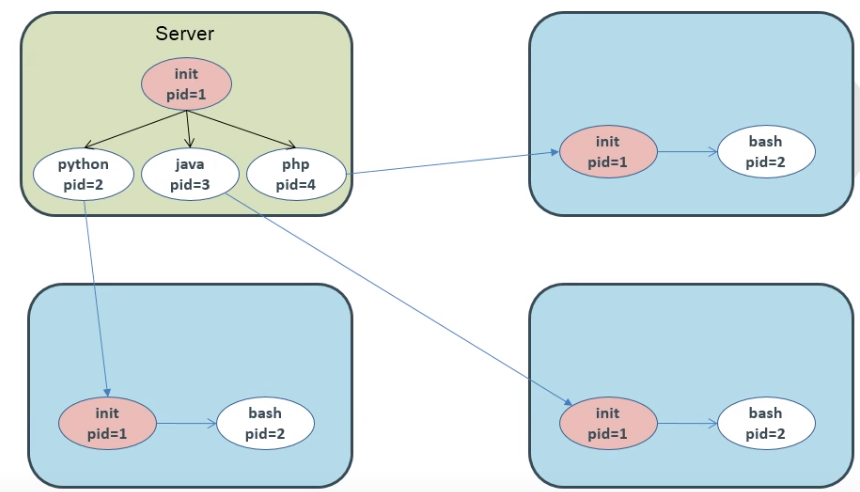

这里我们需要将上面的程序运行在同一个宿主机上，但是有相互隔离。

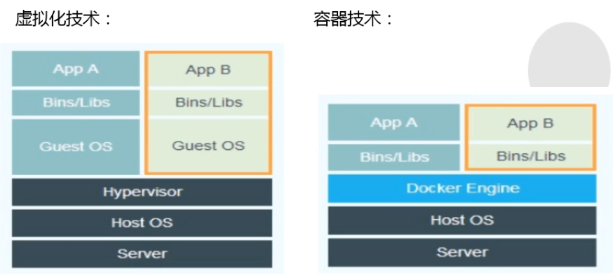

我们利用虚拟化技术完全可以解决，但是虚拟化技术成本有点大（需要单独安装操作系统），此时就可以使用容器化技术来解决这个问题，对比虚拟化技术极大的节约了系统开销。

那么我们如果想要用到这些容器化技术完成应用A和应用B的隔离，我们应该让它们在哪些层次或纬度上隔离呢？

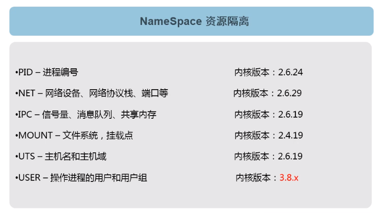

## 第 2 章 Docker 介绍

### 2.1 Docker 起源


### 2.2 Docker 是什么

- Docker 基于容器技术的**轻量级**虚拟化解决方案。

- Docker 是**容器引擎**，把Linux的 cgroup、namespce 等容器底层技术进行封装抽象为用户提供了创建和管理容器的便捷界面（包括命令行和API）。

- Docker 是一个开源项目，诞生于 2013 年初，基于 Google 公司推出的 Go 语言实现。

- 微软，红帽Linux，IBM，Oracle等主流IT厂商已经在自己的产品里增加对 Docker 的支持。

- 相比其他早期的容器技术，Docker 引入了一整套容器管理的生态系统，包括分层的镜像模型，容器注册库，友好的 Rest API。

  

### 2.3 Docker 技术优势

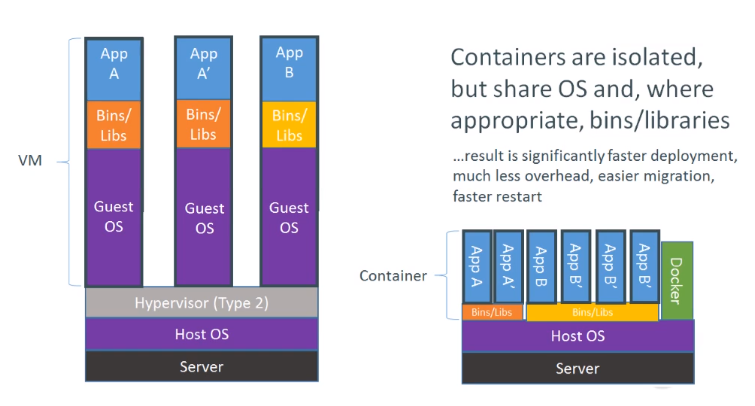

| 指标         | 容器技术                                              | 虚拟机技术          |
| ------------ | ----------------------------------------------------- | ------------------- |
| 占用磁盘空间 | 小，甚至几十KB（镜像层的情况）                        | 非常大，上GB        |
| 启动速度     | 块，几秒钟                                            | 慢，几分钟          |
| 运行形态     | 直接运行于宿主机的内核上，不同容器共享同一个linux内核 | 运行于Hypervisior上 |
| 并发性       | 一台宿主机可以启动成千上百万个容器                    | 逊于宿主机          |
| 性能         | 接近宿主机本地进程                                    | 低                  |
| 资源利用率   | 高                                                    | 低                  |


## 第 3 章 Docker 容器引擎

### 3.1 介绍

Docker 引擎可以从 Docker 网站下载，也可以基于 GitHub 上的源码进行构建。无论是开源版本还是商业版本，都有 Linux 和 Windows 版本。

Docker 引擎主要有两个版本：企业版（EE）和社区版（CE）

每个季度，企业版和社区版都会发布一个稳定版本。社区版会提供4个月的支持，而企业版会提供12个月的支持。

从 2017 年第一季度开始，Docker 版本号遵循 YY.MM-xx 格式，类似于 Ubuntu等项目。例如，2018 年 6月第一次发布社区版为 18.06.0-ce。

> 注：2017 年第一季度以前，Docker版本号遵循大版本号.小版本号的格式。采用新格式前的最后一个版本是 Docker 1.13。

### 3.2 Docker引擎安装部署配置

1. 安装 epel 源

   ```sh
   yum install epel-release -y
   ```

   > **EPEL的全称叫 Extra Packages for Enterprise Linux** 。EPEL是由 Fedora 社区打造，为 RHEL 及衍生发行版如 CentOS、Scientific Linux 等提供高质量软件包的项目。装上了 EPEL之后，就相当于添加了一个第三方源。

2. 查看 epel 源中是否包括 docker 

   ```shell
   [root@thtf-02 ~]# yum list docker --show-duplicates
   Loaded plugins: fastestmirror, langpacks
   Loading mirror speeds from cached hostfile
   ...
   Available Packages
   docker.x86_64                    2:1.13.1-102.git7f2769b.el7.centos                    extras
   docker.x86_64                    2:1.13.1-103.git7f2769b.el7.centos                    extras
   docker.x86_64                    2:1.13.1-108.git4ef4b30.el7.centos                    extras
   docker.x86_64                    2:1.13.1-109.gitcccb291.el7.centos                    extras
   
   ```

   这里我们会发现 docker 的版本是 1.13.1 是17年之前的版本，如果你想要使用 ce 版，可以按照下面步骤执行。

3. 安装 yum-utils 工具，为了使用 yum-config-manager 去安装一个yum源

   ```shell
   yum install -y yum-utils
   ```

4. 添加 dockerce 的yum 源

   ```shell
   yum-config-manager --add-repo http://mirrors.aliyun.com/docker-ce/linux/centos/docker-ce.repo
   ```

   此时在通过 `yum list docker-ce --show-duplicates`查看，就会有很多 docker-ce版本

   ```shell
   [root@thtf-02 ~]# yum list docker-ce --show-duplicates
   Loaded plugins: fastestmirror, langpacks
   Loading mirror speeds from cached hostfile
    * base: mirror.bit.edu.cn
    * epel: mirrors.tuna.tsinghua.edu.cn
    * extras: mirror.bit.edu.cn
    * updates: mirror.bit.edu.cn
   Available Packages
   docker-ce.x86_64                   17.03.0.ce-1.el7.centos                   docker-
   docker-ce.x86_64                   3:18.09.2-3.el7                           docker-ce-stable
   ...
   docker-ce.x86_64                   3:19.03.3-3.el7                           docker-ce-stable
   docker-ce.x86_64                   3:19.03.4-3.el7                           docker-ce-stable
   docker-ce.x86_64                   3:19.03.5-3.el7                           docker-ce-stable
   docker-ce.x86_64                   3:19.03.6-3.el7                           docker-ce-stable
   docker-ce.x86_64                   3:19.03.7-3.el7                           docker-ce-stable
   docker-ce.x86_64                   3:19.03.8-3.el7                           docker-ce-stable
   ```

5. 安装 docker-ce

   ```shell
   #安装最新版本
   yum install docker-ce
   #安装指定版本
   yum install docker-ce-<VERSION STRING>
   ```

6. 启动 docker 引擎

   ```
   #开机启动
   systemctl enable docker
   #启动 docker
   systemctl start docker
   #查看 docker 版本
   docker version
   ```

7. docker 引擎配置

   ```json
   vi /etc/docker/daemon.json
   
   {
     "graph": "/data/docker",
     "storage-driver": "overlay2",
     "registry-mirrors": ["https://q2gr04ke.mirror.aliyuncs.com"],
     "insecure-registries": [], 
     "exec-opts": ["native.cgroupdriver=systemd"],
     "live-restore": true
   }
   ```

   - graph：镜像与容器的保存位置
   - storage-driver：要使用的存储驱动程序
   - insecure-registries: 设置私有仓库地址可以设为http

   - registry-mirrors： 国内的镜像加速器
   - exec-opts：运行时执行选项
   - live-restore：docker引擎死掉了，用docker 引擎起来的容器还可以运行

8. 重启 docker 

   ```shell
   #确保 /data/docker 存在
   mkdir -p /data/docker
   #重启 docker 
   systemctl restart docker
   ```

   

### 3.3 启动第一个 docker 容器


   运行 hello-world

   ```shell
   [root@thtf-02 ~]# docker run hello-world
   
   Hello from Docker!
   This message shows that your installation appears to be working correctly.
   
   To generate this message, Docker took the following steps:
    1. The Docker client contacted the Docker daemon.
    2. The Docker daemon pulled the "hello-world" image from the Docker Hub.
       (amd64)
    3. The Docker daemon created a new container from that image which runs the
       executable that produces the output you are currently reading.
    4. The Docker daemon streamed that output to the Docker client, which sent it
       to your terminal.
   
   To try something more ambitious, you can run an Ubuntu container with:
    $ docker run -it ubuntu bash
   
   Share images, automate workflows, and more with a free Docker ID:
    https://hub.docker.com/
   
   For more examples and ideas, visit:
    https://docs.docker.com/get-started/
   
   ```

1. Docker客户端联系Docker守护进程。

2. Docker守护进程从Docker中心提取“hello-world”映像。

3. Docker守护进程从运行可执行文件，生成您当前正在读取的输出。

4. Docker守护进程将输出流到发送它的Docker客户机的终端。


## 第 4 章 Docker 镜像的结构详解

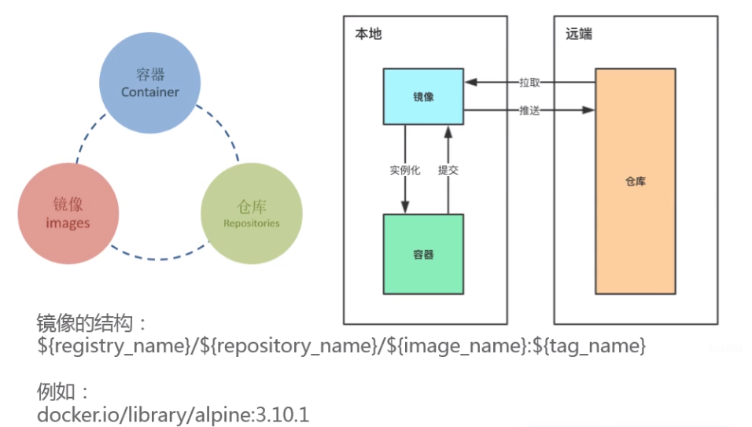

## 第 5 章 Docker 镜像管理

### 5.1 Docker Hub 官网


### 5.2 注册一个 dockerhub 账号

```shell
[root@thtf-02 ~]# docker login docker.io
Login with your Docker ID to push and pull images from Docker Hub. If you don't have a Docker ID, head over to https://hub.docker.com to create one.
Username: panyangyang
Password:
WARNING! Your password will be stored unencrypted in /root/.docker/config.json.
Configure a credential helper to remove this warning. See
https://docs.docker.com/engine/reference/commandline/login/#credentials-store

Login Succeeded
```

### 5.3 搜索一个镜像

- 命令行搜索

  ```shell
  [root@thtf-02 ~]# docker serch alpine
  docker: 'serch' is not a docker command.
  See 'docker --help'
  [root@thtf-02 ~]# docker search alpine
  NAME                                   DESCRIPTION                                     STARS               OFFICIAL            AUTOMATED
  alpine                                 A minimal Docker image based on Alpine Linux…   6313                [OK]
  mhart/alpine-node                      Minimal Node.js built on Alpine Linux           462
  anapsix/alpine-java                    Oracle Java 8 (and 7) with GLIBC 2.28 over A…   440                                     [OK]
  frolvlad/alpine-glibc                  Alpine Docker image with glibc (~12MB)          237                                     [OK]
  gliderlabs/alpine                      Image based on Alpine Linux will help you wi…   181
  alpine/git                             A  simple git container running in alpine li…   122                                     [OK]
  mvertes/alpine-mongo                   light MongoDB container                         110                                     [OK]
  yobasystems/alpine-mariadb             MariaDB running on Alpine Linux [docker] [am…   62                                      [OK]
  alpine/socat                           Run socat command in alpine container           50                                      [OK]
  kiasaki/alpine-postgres                PostgreSQL docker image based on Alpine Linux   45                                      [OK]
  davidcaste/alpine-tomcat               Apache Tomcat 7/8 using Oracle Java 7/8 with…   42                                      [OK]
  zzrot/alpine-caddy                     Caddy Server Docker Container running on Alp…   36                                      [OK]
  jfloff/alpine-python                   A small, more complete, Python Docker image …   35                                      [OK]
  hermsi/alpine-sshd                     Dockerize your OpenSSH-server with rsync and…   30                                      [OK]
  byrnedo/alpine-curl                    Alpine linux with curl installed and set as …   30                                      [OK]
  etopian/alpine-php-wordpress           Alpine WordPress Nginx PHP-FPM WP-CLI           24                                      [OK]
  hermsi/alpine-fpm-php                  Dockerize your FPM PHP 7.4 upon a lightweigh…   24                                      [OK]
  zenika/alpine-chrome                   Chrome running in headless mode in a tiny Al…   19                                      [OK]
  bashell/alpine-bash                    Alpine Linux with /bin/bash as a default she…   16                                      [OK]
  davidcaste/alpine-java-unlimited-jce   Oracle Java 8 (and 7) with GLIBC 2.21 over A…   13                                      [OK]
  spotify/alpine                         Alpine image with `bash` and `curl`.            11                                      [OK]
  roribio16/alpine-sqs                   Dockerized ElasticMQ server + web UI over Al…   8                                       [OK]
  cfmanteiga/alpine-bash-curl-jq         Docker Alpine image with Bash, curl and jq p…   5                                       [OK]
  hermsi/alpine-varnish                  Dockerize Varnish upon a lightweight alpine-…   3                                       [OK]
  goodguykoi/alpine-curl-internal        simple alpine image with curl installed no C…   0                                       [OK]
  
  ```

- dockerhub 网页搜索

  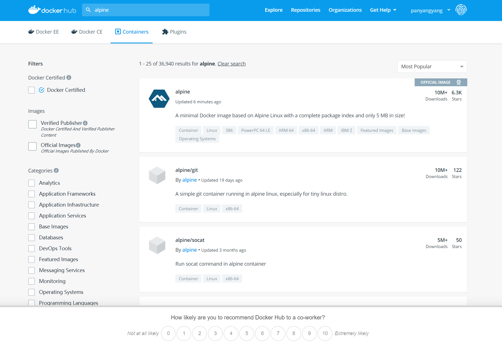

### 5.4 拉取一个镜像

- 直接下载

  ```shell
  [root@thtf-02 ~]# docker pull alpine
  Using default tag: latest
  latest: Pulling from library/alpine
  aad63a933944: Pull complete
  Digest: sha256:b276d875eeed9c7d3f1cfa7edb06b22ed22b14219a7d67c52c56612330348239
  Status: Downloaded newer image for alpine:latest
  docker.io/library/alpine:latest
  ```

  

- 下载指定 tag

  ```shell
  [root@thtf-02 ~]# docker pull alpine:3.10.1
  3.10.1: Pulling from library/alpine
  050382585609: Pull complete
  Digest: sha256:6a92cd1fcdc8d8cdec60f33dda4db2cb1fcdcacf3410a8e05b3741f44a9b5998
  Status: Downloaded newer image for alpine:3.10.1
  docker.io/library/alpine:3.10.1
  ```

  > 镜像结构：registry_name/repository_name/image_name:tag_name
  >
  > 例如：docker.io/library/alpine:3.10.1

### 5.5 查看本地镜像

```shell
[root@thtf-02 ~]# docker images
REPOSITORY          TAG                 IMAGE ID            CREATED             SIZE
alpine              3.11.5              a187dde48cd2        2 weeks ago         5.6MB
alpine              latest              a187dde48cd2        2 weeks ago         5.6MB
alpine              3.10.1              b7b28af77ffe        9 months ago        5.58MB
hello-world         latest              fce289e99eb9        15 months ago       1.84kB

```

```shell
[root@thtf-02 ~]# docker image ls
REPOSITORY          TAG                 IMAGE ID            CREATED             SIZE
alpine              3.11.5              a187dde48cd2        2 weeks ago         5.6MB
alpine              latest              a187dde48cd2        2 weeks ago         5.6MB
alpine              3.10.1              b7b28af77ffe        9 months ago        5.58MB
hello-world         latest              fce289e99eb9        15 months ago       1.84kB
```

### 5.6 给镜像打标签（tag）

```shell

[root@thtf-02 ~]# docker tag a187dde48cd2 docker.io/panyangyang/alpine:v3.11.5
[root@thtf-02 ~]# docker images
REPOSITORY           TAG                 IMAGE ID            CREATED             SIZE
alpine               3.11.5              a187dde48cd2        2 weeks ago         5.6MB
alpine               latest              a187dde48cd2        2 weeks ago         5.6MB
panyangyang/alpine   v3.11.5             a187dde48cd2        2 weeks ago         5.6MB
alpine               3.10.1              b7b28af77ffe        9 months ago        5.58MB
hello-world          latest              fce289e99eb9        15 months ago       1.84kB
```

### 5.7 推送镜像

```shell
[root@thtf-02 ~]# docker push docker.io/panyangyang/alpine:v3.11.5
The push refers to repository [docker.io/panyangyang/alpine]
beee9f30bc1f: Mounted from library/alpine
v3.11.5: digest: sha256:cb8a924afdf0229ef7515d9e5b3024e23b3eb03ddbba287f4a19c6ac90b8d221 size: 528
```

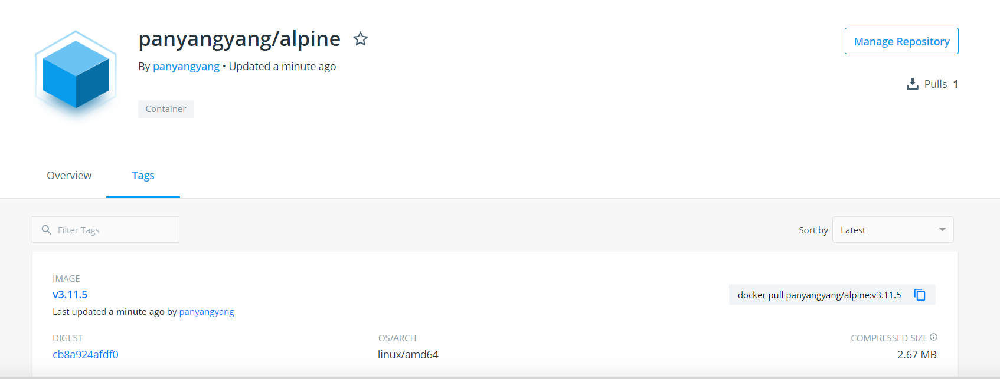


### 5.8 再给镜像打一个标签（tag）

```shell
[root@thtf-02 ~]# docker images | grep alpine
alpine               3.11.5              a187dde48cd2        2 weeks ago         5.6MB
alpine               latest              a187dde48cd2        2 weeks ago         5.6MB
panyangyang/alpine   v3.11.5             a187dde48cd2        2 weeks ago         5.6MB
alpine               3.10.1              b7b28af77ffe        9 months ago        5.58MB
[root@thtf-02 ~]# docker tag a187dde48cd2 panyangyang/alpine:latest
[root@thtf-02 ~]# docker images | grep alpine
alpine               3.11.5              a187dde48cd2        2 weeks ago         5.6MB
alpine               latest              a187dde48cd2        2 weeks ago         5.6MB
panyangyang/alpine   latest              a187dde48cd2        2 weeks ago         5.6MB
panyangyang/alpine   v3.11.5             a187dde48cd2        2 weeks ago         5.6MB
alpine               3.10.1              b7b28af77ffe        9 months ago        5.58MB
```

### 5.9 再次推送镜像

```shell
[root@thtf-02 ~]# docker push docker.io/panyangyang/alpine:latest
The push refers to repository [docker.io/panyangyang/alpine]
beee9f30bc1f: Layer already exists
latest: digest: sha256:cb8a924afdf0229ef7515d9e5b3024e23b3eb03ddbba287f4a19c6ac90b8d221 size: 528
```

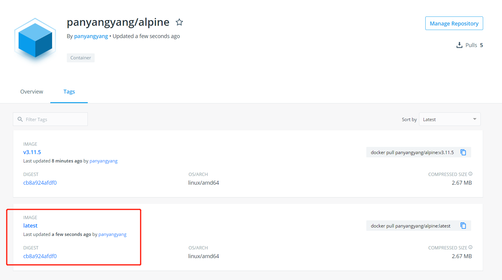


### 5.10 删除镜像

- 删除镜像标签

  > 删除镜像
  >
  > docker rmi [ 镜像名 or 镜像 id ]

  ```shell
  [root@thtf-02 ~]# docker images
  REPOSITORY           TAG                 IMAGE ID            CREATED             SIZE
  alpine               3.11.5              a187dde48cd2        2 weeks ago         5.6MB
  alpine               latest              a187dde48cd2        2 weeks ago         5.6MB
  panyangyang/alpine   latest              a187dde48cd2        2 weeks ago         5.6MB
  panyangyang/alpine   v3.11.5             a187dde48cd2        2 weeks ago         5.6MB
  alpine               3.10.1              b7b28af77ffe        9 months ago        5.58MB
  hello-world          latest              fce289e99eb9        15 months ago       1.84kB
  [root@thtf-02 ~]# docker rmi docker.io/panyangyang/alpine:latest
  Untagged: panyangyang/alpine:latest
  [root@thtf-02 ~]# docker images | grep alpine
  alpine               3.11.5              a187dde48cd2        2 weeks ago         5.6MB
  alpine               latest              a187dde48cd2        2 weeks ago         5.6MB
  panyangyang/alpine   v3.11.5             a187dde48cd2        2 weeks ago         5.6MB
  alpine               3.10.1              b7b28af77ffe        9 months ago        5.58MB
  
  ```

  

- 删除镜像

  ```shell
  [root@thtf-02 ~]# docker rmi a187dde48cd2
  Error response from daemon: conflict: unable to delete a187dde48cd2 (must be forced) - image is referenced in multiple repositories
  [root@thtf-02 ~]# docker rmi -f a187dde48cd2
  Untagged: alpine:3.11.5
  Untagged: alpine:latest
  Untagged: alpine@sha256:b276d875eeed9c7d3f1cfa7edb06b22ed22b14219a7d67c52c56612330348239
  Untagged: panyangyang/alpine:v3.11.5
  Untagged: panyangyang/alpine@sha256:cb8a924afdf0229ef7515d9e5b3024e23b3eb03ddbba287f4a19c6ac90b8d221
  Deleted: sha256:a187dde48cd289ac374ad8539930628314bc581a481cdb41409c9289419ddb72
  Deleted: sha256:beee9f30bc1f711043e78d4a2be0668955d4b761d587d6f60c2c8dc081efb203
  [root@thtf-02 ~]# docker images | grep alpine
  alpine              3.10.1              b7b28af77ffe        9 months ago        5.58MB
  ```

  上面这两种方式都是针对本地 docker 镜像的操作。dockerhub仓库中依然存在，可以使用 `docker pull` 命令拉取。

## 第 6 章 Docker 镜像特性

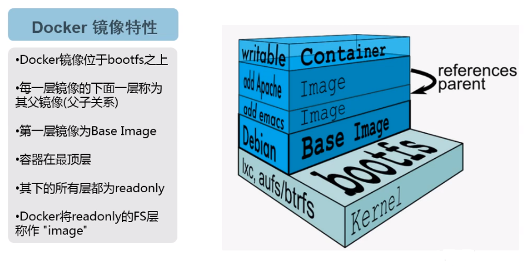

### 6.1 镜像特性

容器创建是需要指定使用的镜像，每个镜像都由唯一的标识Image ID，默认是128位，可以使用前16位作为缩略形式，也可以使用镜像镜像名和版本号两个部分组合成唯一表示，例如nginx:latest，如果省略版本号，默认使用的是最新版本标签，也就是latest，所以如果默认直接写nginx，其实系统执行的实际命令就是nginx:latest。

### 6.2 Docker 文件系统

Linux系统包含内核空间`kernal`和用户空间`rootfs`两部分，Docker容器只使用各自的`rootfs`但共用主机`host`的内核`kernal`，这样就产生了镜像结构分层。

`rootfs`是Docker容器在启动时内部进程可见的文件系统，也就是Docker容器的根目录。`rootfs`包含一个操作系统运行所需的文件系统。例如：可能包含典型类UNIX系统中的目录系统`/dev/`、`/proc`、`/bin`、`/etc`、`/usr`、`/tmp`...及运行Docker容器所需的配置文件、工具等。

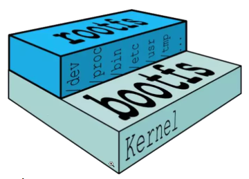

rootfs

在传统Linux内核启动时，首先会挂载一个只读的`rootfs`，当系统检测其完整性之后，再将其切换为读写模式。而在Docker架构中，当`docker daemon`为Docker容器改在`rootfs`时，会沿用Linux内核启动时的做法，也就是将`rootfs`设置为只读模式。当挂载完毕后，利用联合挂载`union mount`技术在已有的只读`rootfs`上再挂载一个读写层。这样，可读写的层处于Docker容器文件系统的最顶层，其下可能联合挂载了多个只读的层，只有在Docker容器运行过程中文件系统发生变化时，才会把变化的文件内容写到可读写层，并隐藏只读层中的旧版本文件。

由于所有Docker容器都共用`host`主机的`kernal`内核，所以在容器中是不能对Linux内核`kernal`进行升级的。

 

所有Docker容器都共用host主机的kernal内核

Docker支持通过扩展现有镜像来创建新的镜像，实际上Docker Hub中99%的镜像都是通过在Base镜像中安装和配置需要的软件构建出来的。

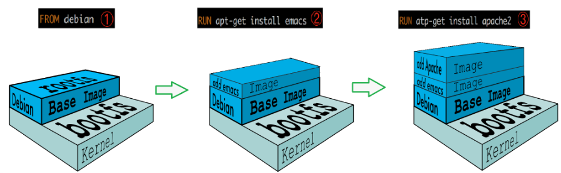

Docker支持通过扩展现有镜像来创建新的镜像

一个Docker镜像`Images`由多个可读的镜像层`Read Layer`，然后运行的容器会在这个Docker的镜像上多加一层可写的容器层`Read-Write Layer`，任何对文件的更改都只存在于此容器层，因此任何对容器的操作均不会影响到镜像。

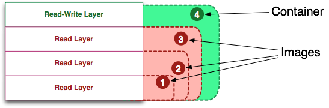

Docker分层结构

容器是如何获取镜像层文件而又不影响镜像层的呢？

Docker中如果需要获取某个文件，容器层会从上到下去下一层的镜像层中去获取文件，如果该层文件不存在，那么就会去下一层镜像中寻找，直到最后一层。对于用户而言，用户面对的是一个叠加后的文件系统。

任何对于文件的操作都会记录在容器层，例如：修改文件时容器层会把在镜像层找到的文件拷贝到容器层然后进行修改，删除文件时则会在容器层内记录删除文件的条目。

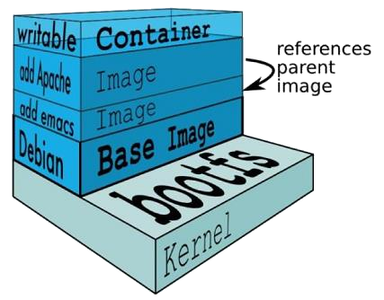

容器层会从上到下去下一层的镜像层中去获取文件

当容器启动时，一个新的可写层`writable`被加载到镜像的顶部，这一层通常被称为容器层`container`，容器层之下的都叫做镜像层。

典型的Linux在启动后，会将`rootfs`置为只读`readonly`并进行一些列检查，然后将其切换为可读写`readwrite`供用户使用。在Docker中起初也是将`rootfs`以只读的`readonly`的方式加载并检查，然后接下来利用`union mount`联合挂载将一个`readwrite`文件系统挂载在`readonly`的`rootfs`之上，并且允许再次将下层的文件系统设定为只读`readonly`，并向上叠加。这样一组只读`readonly`和一个可写`writeable`的结果就构成了一个容器`container`的运行目录，每个镜像被称为一层`layer`。

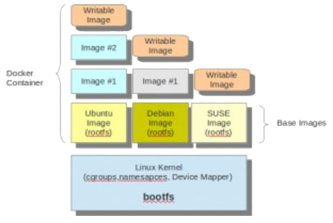

Docker镜像为什么要采用分层结果呢？

- 每个软件都是基于某个镜像去运行的，因此一旦某个底层环境出现问题，就不需要去修改全部基于该镜像的软件的镜像，只需要修改底层环境的镜像。
- 共享资源，其它相同环境的软件镜像都共同去享用同一个环境镜像，而不需要每个软件镜像要去创建一个底层环境。

## 第 7 章 Docker 容器的基本操作

### 7.1 启动容器（运行镜像）

> docker run 是日常用的最频繁的命令之一，同样也是较为复杂的命令之一
>
> 命令格式：docker run [OPTIONS] IMAGE [COMMAND] [ARG...]
>
> OPTIONS: 选项
>
> -i：表示启动一个可交互的容器，并持续打开标准输入
>
> -t：表示使用终端关联到容器的标准输入输出上
>
> -d：表示将容器放置在后台运行
>
> --rm：退出后即删除容器
>
> --name：表示定义容器的唯一名称
>
> IMAGE：表示要运行的镜像
>
> COMMAD：表示启动容器时要运行的命令
>
> ARG: 参数

#### 7.1.1 交互式启动一个容器

```shell
[root@thtf-02 ~]# docker images | grep alpine
alpine              3.10.1              b7b28af77ffe        9 months ago        5.58MB
[root@thtf-02 ~]# docker run -it alpine:3.10.1 /bin/sh
/ # ip addr
1: lo: <LOOPBACK,UP,LOWER_UP> mtu 65536 qdisc noqueue state UNKNOWN qlen 1000
    link/loopback 00:00:00:00:00:00 brd 00:00:00:00:00:00
    inet 127.0.0.1/8 scope host lo
       valid_lft forever preferred_lft forever
10: eth0@if11: <BROADCAST,MULTICAST,UP,LOWER_UP,M-DOWN> mtu 1500 qdisc noqueue state UP
    link/ether 02:42:ac:11:00:02 brd ff:ff:ff:ff:ff:ff
    inet 172.17.0.2/16 brd 172.17.255.255 scope global eth0
       valid_lft forever preferred_lft forever
/ # cat /etc/issue
Welcome to Alpine Linux 3.10
Kernel \r on an \m (\l)

/ # exit
```

#### 7.1.2 非交互式启动一个容器（退出即删除）

```sh
[root@thtf-02 ~]# docker run --rm alpine:3.10.1 /bin/echo helloword
helloword
```

#### 7.1.3 非交互式启动一个后台运行容器

```sh
[root@thtf-02 ~]# docker run -d --name myalpine alpine:3.10.1 /bin/sleep 300
5b9ef79b22e0b341c60db85ee443cb14deff85a41c2fb9e0abd00405e6c445bd
```
> 300秒后自动结束

```shell
[root@thtf-02 ~]# docker ps -a
CONTAINER ID        IMAGE               COMMAND             CREATED             STATUS                     PORTS               NAMES
5b9ef79b22e0        alpine:3.10.1       "/bin/sleep 300"    52 seconds ago      Up 51 seconds                                  myalpine
3f656d915af5        alpine:3.10.1       "/bin/sh"           10 minutes ago      Exited (0) 8 minutes ago                       sad_sutherland
d6cea5dc8306        hello-world         "/hello"            2 days ago          Exited (0) 2 days ago                          upbeat_gagarin
5f481479f560        hello-world         "/hello"            2 days ago          Exited (0) 2 days ago                          vibrant_jang
```

### 7.2 查看容器

#### 7.2.1 查看运行中的容器

```sh
[root@thtf-02 ~]# docker ps
CONTAINER ID        IMAGE               COMMAND             CREATED             STATUS              PORTS               NAMES
8fa336f37fce        alpine:3.10.1       "/bin/sleep 300"    3 seconds ago       Up 2 seconds                            myalpine1
```

#### 7.2.2 查看所有容器

```shell
[root@thtf-02 ~]# docker ps -a
CONTAINER ID        IMAGE               COMMAND             CREATED              STATUS                      PORTS               NAMES
8fa336f37fce        alpine:3.10.1       "/bin/sleep 300"    About a minute ago   Up About a minute                               myalpine1
5b9ef79b22e0        alpine:3.10.1       "/bin/sleep 300"    20 minutes ago       Exited (0) 15 minutes ago                       myalpine
3f656d915af5        alpine:3.10.1       "/bin/sh"           30 minutes ago       Exited (0) 28 minutes ago                       sad_sutherland
d6cea5dc8306        hello-world         "/hello"            2 days ago           Exited (0) 2 days ago                           upbeat_gagarin
5f481479f560        hello-world         "/hello"            2 days ago           Exited (0) 2 days ago                           vibrant_jang
```

#### 7.2.3 查看docker在宿主机上的进程

```sh
[root@thtf-02 ~]# ps aux | grep sleep | grep -v grep
root      8204  0.0  0.0   1540   248 ?        Ss   22:37   0:00 /bin/sleep 300
```

### 7.3 进入容器

```shell
[root@thtf-02 ~]# docker exec -it c41274eb760f /bin/sh
/ # ps aux
PID   USER     TIME  COMMAND
    1 root      0:00 /bin/sleep 300
    6 root      0:00 /bin/sh
   11 root      0:00 ps aux
/ #

```

### 7.4 停止/启动/重启容器

```shell
# 停止容器
[root@thtf-02 ~]# docker stop c41274eb760f
c41274eb760f
[root@thtf-02 ~]# docker ps -a
CONTAINER ID        IMAGE               COMMAND             CREATED             STATUS                       PORTS               NAMES
c41274eb760f        alpine:3.10.1       "/bin/sleep 300"    2 minutes ago       Exited (137) 6 seconds ago                       myalpine2
8fa336f37fce        alpine:3.10.1       "/bin/sleep 300"    11 minutes ago      Exited (0) 6 minutes ago                         myalpine1
5b9ef79b22e0        alpine:3.10.1       "/bin/sleep 300"    30 minutes ago      Exited (0) 25 minutes ago                        myalpine
3f656d915af5        alpine:3.10.1       "/bin/sh"           40 minutes ago      Exited (0) 38 minutes ago                        sad_sutherland
d6cea5dc8306        hello-world         "/hello"            2 days ago          Exited (0) 2 days ago                            upbeat_gagarin
5f481479f560        hello-world         "/hello"            2 days ago          Exited (0) 2 days ago                            vibrant_jang

# 启动容器
[root@thtf-02 ~]# docker start c41274eb760f
c41274eb760f
[root@thtf-02 ~]# docker ps -aa
CONTAINER ID        IMAGE               COMMAND             CREATED             STATUS                      PORTS               NAMES
c41274eb760f        alpine:3.10.1       "/bin/sleep 300"    3 minutes ago       Up 15 seconds                                   myalpine2
8fa336f37fce        alpine:3.10.1       "/bin/sleep 300"    12 minutes ago      Exited (0) 7 minutes ago                        myalpine1
5b9ef79b22e0        alpine:3.10.1       "/bin/sleep 300"    31 minutes ago      Exited (0) 26 minutes ago                       myalpine
3f656d915af5        alpine:3.10.1       "/bin/sh"           40 minutes ago      Exited (0) 39 minutes ago                       sad_sutherland
d6cea5dc8306        hello-world         "/hello"            2 days ago          Exited (0) 2 days ago                           upbeat_gagarin
5f481479f560        hello-world         "/hello"            2 days ago          Exited (0) 2 days ago                           vibrant_jang

# 重启容器
[root@thtf-02 ~]# docker restart c41274eb760f
c41274eb760f
[root@thtf-02 ~]# docker ps -a
CONTAINER ID        IMAGE               COMMAND             CREATED             STATUS                      PORTS               NAMES
c41274eb760f        alpine:3.10.1       "/bin/sleep 300"    3 minutes ago       Up 3 seconds                                    myalpine2
8fa336f37fce        alpine:3.10.1       "/bin/sleep 300"    12 minutes ago      Exited (0) 7 minutes ago                        myalpine1
5b9ef79b22e0        alpine:3.10.1       "/bin/sleep 300"    31 minutes ago      Exited (0) 26 minutes ago                       myalpine
3f656d915af5        alpine:3.10.1       "/bin/sh"           41 minutes ago      Exited (0) 39 minutes ago                       sad_sutherland
d6cea5dc8306        hello-world         "/hello"            2 days ago          Exited (0) 2 days ago                           upbeat_gagarin
5f481479f560        hello-world         "/hello"            2 days ago          Exited (0) 2 days ago                           vibrant_jang

```

> 上面操作也可以使用 容器名称（NAMES) 替换 容器ID（CONTAINER ID)

### 7.5 删除容器

```shell
[root@thtf-02 ~]# docker rm myalpine2
Error response from daemon: You cannot remove a running container c41274eb760fabd08daff92a6f35ba84ba06b9212a4fbd3c9ea6bb638f7d272b. Stop the container before attempting removal or force remove
[root@thtf-02 ~]# docker rm myalpine1
myalpine1
[root@thtf-02 ~]# docker rm -f myalpine2
myalpine2
```

#### 7.5.1  常用清除 docker 中容器状态为 `Exited` 的容器脚本

```shell
[root@thtf-02 ~]# for i in `docker ps -a|grep -i exit|awk '{print $1}'`;do docker rm -f $i;done
3f656d915af5
d6cea5dc8306
5f481479f560
```

### 7.6 修改/提交容器

#### 7.5.1 修改容器

```shell
[root@thtf-02 ~]# docker exec -it 5b9ef79b22e0 /bin/sh
/ # pwd
/
/ # ls
bin    dev    etc    home   lib    media  mnt    opt    proc   root   run    sbin   srv    sys    tmp    usr    var
/ # echo hello > a.txt
/ # ls
a.txt  bin    dev    etc    home   lib    media  mnt    opt    proc   root   run    sbin   srv    sys    tmp    usr    var
```

> a.txt 被写入到容器的 writable 层，它会保存一直都容器结束，再重启容器就会被清除

#### 7.6.2 提交容器

> **docker commit :**从容器创建一个新的镜像。
>
> 语法：
>
> docker commit [OPTIONS] CONTAINER [REPOSITORY[:TAG]]
>
> OPTIONS说明：
>
> - **-a :**提交的镜像作者；啊
> - **-c :**使用Dockerfile指令来创建镜像；
> - **-m :**提交时的说明文字；
> - **-p :**在commit时，将容器暂停。

```shell
[root@thtf-02 ~]# docker commit -p myalpine myalpine:v3.10.2_with_a.txt
sha256:4cbb40d64f7242278f816063e64b4d650a59d32cdcc98b734b18090ef5668a6e
```

```shell
[root@thtf-02 ~]# docker images
REPOSITORY          TAG                  IMAGE ID            CREATED             SIZE
myalpine            v3.10.2_with_a.txt   4cbb40d64f72        8 seconds ago       5.58MB
alpine              3.10.1               b7b28af77ffe        9 months ago        5.58MB
hello-world         latest               fce289e99eb9        15 months ago       1.84kB
```

### 7.7 导出/导入镜像

#### 7.7.1 导出镜像

> 打包本地镜像
>
> docker save [ 镜像名 or 镜像 id ] > [ 文件路径 ]

```shell
[root@thtf-02 ~]# docker images
REPOSITORY          TAG                  IMAGE ID            CREATED             SIZE
myalpine            v3.10.2_with_a.txt   4cbb40d64f72        3 minutes ago       5.58MB
alpine              3.10.1               b7b28af77ffe        9 months ago        5.58MB
hello-world         latest               fce289e99eb9        15 months ago       1.84kB
[root@thtf-02 ~]# docker save 4cbb40d64f72 > myalipine:v3.10.2_with_a.txt.tar
```

#### 7.7.2 导入镜像

> 导入镜像
>
> docker load < [ 文件路径 ]
>
> 修改镜像tag
>
> docker tag [ 镜像名 or 镜像 id ] [ 新镜像名 ]:[ 新 tag ]

```shell
[root@thtf-02 ~]# docker load < alpine\:v3.10.1_back.tar
Loaded image ID: sha256:b7b28af77ffec6054d13378df4fdf02725830086c7444d9c278af25312aa39b9
[root@thtf-02 ~]# docker images
REPOSITORY          TAG                 IMAGE ID            CREATED             SIZE
<none>              <none>              b7b28af77ffe        9 months ago        5.58MB
hello-world         latest              fce289e99eb9        15 months ago       1.84kB
[root@thtf-02 ~]# docker tag b7b28af77ffe alipine:v3.10.1
[root@thtf-02 ~]# docker images
REPOSITORY          TAG                 IMAGE ID            CREATED             SIZE
alipine             v3.10.1             b7b28af77ffe        9 months ago        5.58MB
hello-world         latest              fce289e99eb9        15 months ago       1.84kB
```

### 7.8 查看容器日志

```shell
[root@thtf-02 ~]# docker run hello-world 2>&1 >>/dev/null
[root@thtf-02 ~]# docker ps -a|grep hello
14ea2fcb0e98        hello-world         "/hello"            12 seconds ago      Exited (0) 11 seconds ago                       youthful_brahmagupta
34674d3c7f92        hello-world         "/hello"            57 seconds ago      Exited (0) 56 seconds ago                       gallant_carson
[root@thtf-02 ~]# docker logs -f 14ea2fcb0e98

Hello from Docker!
This message shows that your installation appears to be working correctly.

To generate this message, Docker took the following steps:
 1. The Docker client contacted the Docker daemon.
 2. The Docker daemon pulled the "hello-world" image from the Docker Hub.
    (amd64)
 3. The Docker daemon created a new container from that image which runs the
    executable that produces the output you are currently reading.
 4. The Docker daemon streamed that output to the Docker client, which sent it
    to your terminal.

To try something more ambitious, you can run an Ubuntu container with:
 $ docker run -it ubuntu bash

Share images, automate workflows, and more with a free Docker ID:
 https://hub.docker.com/

For more examples and ideas, visit:
 https://docs.docker.com/get-started/

```

>**1、文件描述符**
>Linux系统预留可三个文件描述符：0、1和2，他们的意义如下所示：
>0——标准输入（stdin）
>1——标准输出（stdout）
>2——标准错误（stderr）
>
>**2、区别**
>
>2>/dev/null
>意思就是把错误输出到“黑洞”
>
>/dev/null 2>&1
>默认情况是1，也就是等同于1>/dev/null 2>&1。意思就是把标准输出重定向到“黑洞”，还把错误输出2重定向到标准输出1，也就是标准输出和错误输出都进了“黑洞”
>
>2>&1 >/dev/null
>意思就是把错误输出2重定向到标准出书1，也就是屏幕，标准输出进了“黑洞”，也就是标准输出进了黑洞，错误输出打印到屏幕


## 第 8 章 Docker 容器的高级操作

### 8.1 下载 Nginx 镜像

```shell
[root@thtf-02 ~]# docker pull nginx:1.12.2
1.12.2: Pulling from library/nginx
f2aa67a397c4: Pull complete 
e3eaf3d87fe0: Pull complete 
38cb13c1e4c9: Pull complete 
Digest: sha256:72daaf46f11cc753c4eab981cbf869919bd1fee3d2170a2adeac12400f494728
Status: Downloaded newer image for nginx:1.12.2
docker.io/library/nginx:1.12.2
[root@thtf-02 ~]# docker images|grep nginx
nginx               1.12.2              4037a5562b03        23 months ago       108MB
[root@thtf-02 ~]# docker tag 4037a5562b03 panyangyang/nginx:v1.12.2
[root@thtf-02 ~]# docker images|grep nginx
panyangyang/nginx   v1.12.2             4037a5562b03        23 months ago       108MB
nginx               1.12.2              4037a5562b03        23 months ago       108MB
```

### 8.2 映射端口

> 映射端口
>
> docker run -p 容器外端口(hostPort):容器内端口(containerPort) 可指定多个

```shell
[root@thtf-02 ~]# docker run --name mynginx -d -p81:80 panyangyang/nginx:v1.12.2
089698e2901c289dcbf9fd925c7ba4b941b98ba8ae590104c94c35e7d1020970
```

### 8.3 挂载数据卷

> 挂载数据卷
>
> docker run -v 容器外目录:容器内目录

```shell
[root@thtf-02 ~]# mkdir html
[root@thtf-02 ~]# cd html/
[root@thtf-02 html]# wget www.baidu.com -O index.html
--2020-04-10 14:53:32--  http://www.baidu.com/
正在解析主机 www.baidu.com (www.baidu.com)... 61.135.169.121, 61.135.169.125, 2408:80f0:410c:1d:0:ff:b07a:39af, ...
正在连接 www.baidu.com (www.baidu.com)|61.135.169.121|:80... 已连接。
已发出 HTTP 请求，正在等待回应... 200 OK
长度：2381 (2.3K) [text/html]
正在保存至: “index.html”

100%[=================================================================>] 2,381       --.-K/s 用时 0s      

2020-04-10 14:53:32 (179 MB/s) - 已保存 “index.html” [2381/2381])
[root@thtf-02 html]# docker run -d --name nginx_with_baidu -d -p8100:8100 -v/root/html:/usr/share/nginx/html panyangyang/nginx:v1.12.2
40564e2f9b37f870df785ff78fa16ef9e6bbcf6016b68a0be62ba545e0e463ff
```

### 8.4 传递环境变量

> 传递环境变量
>
>docker run -e 环境变量名=环境变量值

```shell
[root@thtf-02 html]# docker run --rm -e E_OPTS=abc alipine:v3.10.1 printenv
PATH=/usr/local/sbin:/usr/local/bin:/usr/sbin:/usr/bin:/sbin:/bin
HOSTNAME=f61a865a517c
E_OPTS=abc
HOME=/root
```

### 8.5 容器内安装软件

> 容器内安装软件
>
> yum/apt-get/apt等

```shell
[root@thtf-02 html]# docker exec -it nginx_with_baidu /bin/bash
root@40564e2f9b37:/# apt-get install vim
...
root@40564e2f9b37:/# apt-get install curl
```

```shell
[root@thtf-02 html]# docker commit -p 40564e2f9b37 panyangyang/nginx:curl
sha256:a0fda12de6e676b1cd8d92f9cf08b21ec41eddef24bfe25fb7a6341e07cd894e
[root@thtf-02 html]# docker images
REPOSITORY          TAG                 IMAGE ID            CREATED             SIZE
panyangyang/nginx   curl                a0fda12de6e6        4 seconds ago       179MB
alipine             v3.10.1             b7b28af77ffe        9 months ago        5.58MB
hello-world         latest              fce289e99eb9        15 months ago       1.84kB
nginx               1.12.2              4037a5562b03        23 months ago       108MB
panyangyang/nginx   v1.12.2             4037a5562b03        23 months ago       108MB
[root@thtf-02 html]# docker push panyangyang/nginx:curl
The push refers to repository [docker.io/panyangyang/nginx]
c26ae4ec4c41: Pushed 
4258832b2570: Mounted from library/nginx 
683a28d1d7fd: Mounted from library/nginx 
d626a8ad97a1: Mounted from library/nginx 
curl: digest: sha256:e5ce5fe7ceef8b60414fe602c202da67dfa48515a37a43f357f110fda4c327d7 size: 1160
```

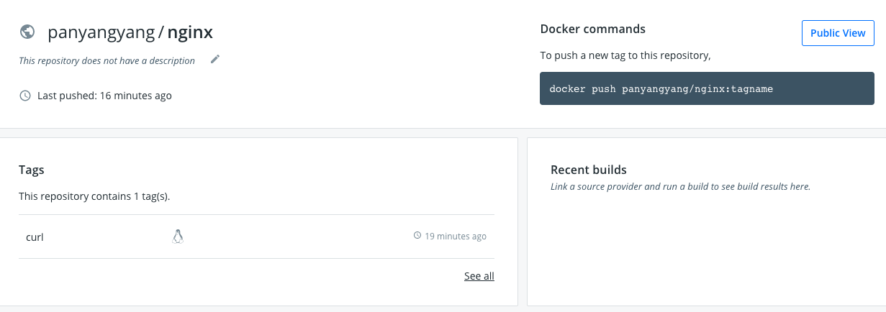


## 第 9 章 容器的生命周期

- 检查本地是否存在镜像，如果不存在即从远端仓库检索
- 利用镜像启动容器
- 分配一个文件系统，并在只读的镜像层外挂一层可读写层
- 从宿主机配置的网桥接口中桥接一个虚拟接口到容器
- 从地址池配置一个 ip 地址给容器
- 执行用户指定的指令
- 执行完毕后容器终止

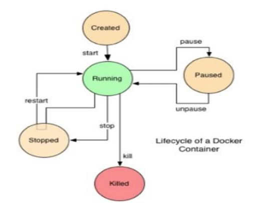


## 第 10 章 Dockerfile 

### 10.1 Dockerfile 概述


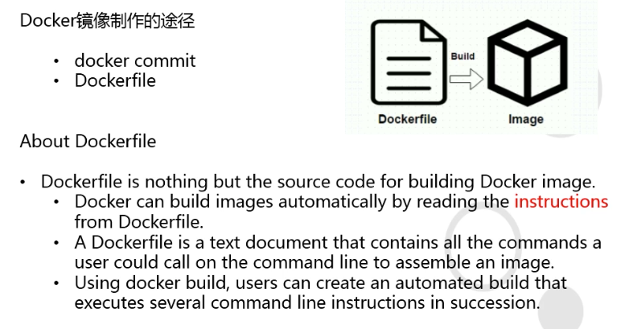

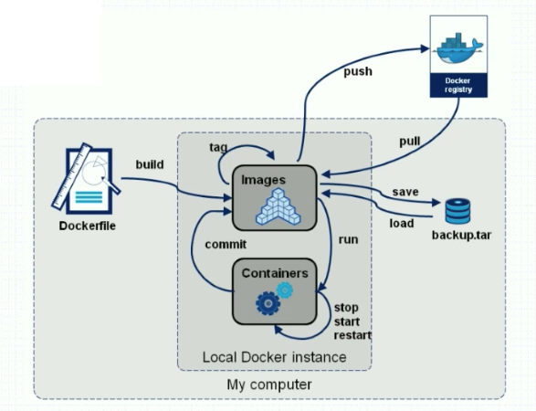

### 10.2 Dockerfile 的规则

- 格式
  - #为注释
  - 指令（大写）内容（小写）
  - 尽管指令是大小写不敏感的, 但是我们强烈建议指令大写, 内容用小写表示
- Docker 是按顺序执行 Dockerfile 里的指令集合的 (从上到下依次执行)
- 每一个 Dockerfile 的第一个非注释指令, 必须是 "FROM" 指令, 用于为镜像文件构建过程中, 指定基准镜像, 后续的指令运行与此基准镜像所提供的运行环境中
  - 实践中, 基准镜像可以是任何可用的镜像文件, 默认情况下, docker build 会在 docker 主机 (本地) 上查找指定的镜像文件, 当其在本地不存在时, 则会从 Docker registry (远端) 上拉取所需镜像文件。

### 10.3 Dockerfile 核心指令

- USER/WORKDIR指令
- ADD/EXPOSE 指令
- RUN/ENV 指令
- CMD/ENTRYPOINT 指令

#### 10.3.1 USER/WORKDIR指令

> **docker build** 命令用于使用 Dockerfile 创建镜像。
>
> 语法
>
> ```
> docker build [OPTIONS] PATH | URL | -
> ```
>
> OPTIONS说明：
>
> - **-f :**指定要使用的Dockerfile路径；
> - **--tag, -t:** 镜像的名字及标签，通常 name:tag 或者 name 格式；可以在一次构建中为一个镜像设置多个标签。

```shell
[root@thtf-02 ~]# cd /data/
[root@thtf-02 data]# mkdir dockerfile
[root@thtf-02 data]# cd dockerfile/
[root@thtf-02 dockerfile]# vi Dockerfile
```
- **Dockerfile**

```
FROM docker.io/panyangyang/nginx:v1.12.2
USER nginx
WORKDIR /usr/share/nginx/html
```
- **构建镜像**

```
[root@thtf-02 dockerfile]# docker build . -t docker.io/panyangyang/nginx:v1.12.2_with_user_workdir
Sending build context to Docker daemon  2.048kB
Step 1/3 : FROM docker.io/panyangyang/nginx:v1.12.2
 ---> 4037a5562b03
Step 2/3 : USER nginx
 ---> Running in 36545d309472
Removing intermediate container 36545d309472
 ---> 05d6de7f42ad
Step 3/3 : WORKDIR /usr/share/nginx/html
 ---> Running in a4a948a31b66
Removing intermediate container a4a948a31b66
 ---> cab1c7a07238
Successfully built cab1c7a07238
Successfully tagged panyangyang/nginx:v1.12.2_with_user_workdir

```

- **运行容器**

```shell
[root@thtf-02 dockerfile]# docker run --rm -it --name mynginx panyangyang/nginx:v1.12.2_with_user_workdir /bin/bash
nginx@9db9958c5d75:/usr/share/nginx/html$ whoami
nginx
nginx@9db9958c5d75:/usr/share/nginx/html$ pwd
/usr/share/nginx/html
nginx@9db9958c5d75:/usr/share/nginx/html$ 
```


#### 10.3.21 ADD/EXPOSE 指令

- **Dockerfile**

```
FROM docker.io/panyangyang/nginx:v1.12.2
ADD index.html /usr/share/nginx/html/index.html
EXPOSE 89
```

- **编译镜像**

```shell
[root@thtf-02 dockerfile]# docker build . -t panyangyang/nginx:v1.12.2_with_index_expose
Sending build context to Docker daemon   5.12kB
Step 1/3 : FROM docker.io/panyangyang/nginx:v1.12.2
 ---> 4037a5562b03
Step 2/3 : ADD index.html /usr/share/nginx/html/index.html
 ---> a0224035af78
Step 3/3 : EXPOSE 89
 ---> Running in 074f42b67331
Removing intermediate container 074f42b67331
 ---> 9afed29a7ef2
Successfully built 9afed29a7ef2
Successfully tagged panyangyang/nginx:v1.12.2_with_index_expose
```

> EXPOSE <端口1> [<端口2>...]
> 大家都知道以上代码是Dockerfile中来声明端口的命令，但是你真的了解过它吗？现在我带大家来深入了解我们的EXPOSE命令。
>
> 首先，我们最应该明确的一点就是，EXPOSE命令只是声明了容器应该打开的端口并没有实际上将它打开!也就是说，如果你不用-p或者-P中指定要映射的端口，你的容器是不会映射端口出去的，从而我们知道我们是没有办法在Dockerfile里面进行端口映射的，我们只能在容器启动的时候或者在docker-compose文件中使用ports来指定将要映射的端口。
>
> 那我们的EXPOSE能用来干什么呢?第一点就是写在Dockerfile中进行声明，能让运维人员或者后来者知道我们开启了容器的哪些端口。还有一点就是，当我们声明了EXPOSE端口之后，我们使用-P命令进行随机映射的时候，是会对这个端口进行映射的。比如说我们现在对一个tomcat容器进行EXPOSE 9999声明，那么我们进行-P随机映射的时候是会对9999端口进行映射的。

```shell
[root@thtf-02 dockerfile]# docker run -d -P --name mynginx1 panyangyang/nginx:v1.12.2_with_index_expose 
182da13ed968f1a39b60904a5d61a879d576659e3b77128f9d0d594ed05d7068
[root@thtf-02 dockerfile]# netstat -luntp
```

```shell
tcp6       0      0 :::32769                :::*                    LISTEN      4484/docker-proxy 
```


#### 10.3.3 RUN/ENV 指令

- **Dockerfile**
```
FROM centos:7
ENV VER 9.11.4
RUN yum install bind-$VER -y
```

- **编译镜像**
```shell
[root@thtf-02 dockerfile]# docker build . -t panyangyang/bind:v9.9.4_with_env_run
````

- **运行验证**

```shell
[root@thtf-02 dockerfile]# docker run -it --rm  panyangyang/bind:v9.9.4_with_env_run /bin/bash
[root@e9c560ca0f6c /]# cat /etc/issue
\S
Kernel \r on an \m

[root@e9c560ca0f6c /]# cat /etc/redhat-release 
CentOS Linux release 7.7.1908 (Core)
[root@e9c560ca0f6c /]# printenv
HOSTNAME=e9c560ca0f6c
TERM=xterm
LS_COLORS=rs=0:di=01;34:ln=01;36:mh=00:pi=40;33:so=01;35:do=01;35:bd=40;33;01:cd=40;33;01:or=40;31;01:mi=01;05;37;41:su=37;41:sg=30;43:ca=30;41:tw=30;42:ow=34;42:st=37;44:ex=01;32:*.tar=01;31:*.tgz=01;31:*.arc=01;31:*.arj=01;31:*.taz=01;31:*.lha=01;31:*.lz4=01;31:*.lzh=01;31:*.lzma=01;31:*.tlz=01;31:*.txz=01;31:*.tzo=01;31:*.t7z=01;31:*.zip=01;31:*.z=01;31:*.Z=01;31:*.dz=01;31:*.gz=01;31:*.lrz=01;31:*.lz=01;31:*.lzo=01;31:*.xz=01;31:*.bz2=01;31:*.bz=01;31:*.tbz=01;31:*.tbz2=01;31:*.tz=01;31:*.deb=01;31:*.rpm=01;31:*.jar=01;31:*.war=01;31:*.ear=01;31:*.sar=01;31:*.rar=01;31:*.alz=01;31:*.ace=01;31:*.zoo=01;31:*.cpio=01;31:*.7z=01;31:*.rz=01;31:*.cab=01;31:*.jpg=01;35:*.jpeg=01;35:*.gif=01;35:*.bmp=01;35:*.pbm=01;35:*.pgm=01;35:*.ppm=01;35:*.tga=01;35:*.xbm=01;35:*.xpm=01;35:*.tif=01;35:*.tiff=01;35:*.png=01;35:*.svg=01;35:*.svgz=01;35:*.mng=01;35:*.pcx=01;35:*.mov=01;35:*.mpg=01;35:*.mpeg=01;35:*.m2v=01;35:*.mkv=01;35:*.webm=01;35:*.ogm=01;35:*.mp4=01;35:*.m4v=01;35:*.mp4v=01;35:*.vob=01;35:*.qt=01;35:*.nuv=01;35:*.wmv=01;35:*.asf=01;35:*.rm=01;35:*.rmvb=01;35:*.flc=01;35:*.avi=01;35:*.fli=01;35:*.flv=01;35:*.gl=01;35:*.dl=01;35:*.xcf=01;35:*.xwd=01;35:*.yuv=01;35:*.cgm=01;35:*.emf=01;35:*.axv=01;35:*.anx=01;35:*.ogv=01;35:*.ogx=01;35:*.aac=01;36:*.au=01;36:*.flac=01;36:*.mid=01;36:*.midi=01;36:*.mka=01;36:*.mp3=01;36:*.mpc=01;36:*.ogg=01;36:*.ra=01;36:*.wav=01;36:*.axa=01;36:*.oga=01;36:*.spx=01;36:*.xspf=01;36:
PATH=/usr/local/sbin:/usr/local/bin:/usr/sbin:/usr/bin:/sbin:/bin
PWD=/
SHLVL=1
HOME=/root
VER=9.11.4
_=/usr/bin/printenv
[root@e9c560ca0f6c /]# rpm -qa bind    
bind-9.11.4-9.P2.el7.x86_64
[root@e9c560ca0f6c /]# 

```


#### 10.3.4 CMD/ENTRYPOINT 指令

> CMD在容器运行的时候提供一些命令及参数

- **Dockerfile**

```
FROM centos:7
RUN yum install httpd -y
CMD ["httpd", "-D", "FOREGROUND"]
```

- **编译镜像**

```shell
[root@thtf-02 dockerfile]# docker build . -t panyangyang/bind:v9.9.4_with_cmd
```


**ENTRYPOINT**

ENTRYPOINT 的格式和 RUN 指令格式一样，分为 exec 格式和 shell 格式。

ENTRYPOINT 的目的和 CMD 一样，都是在指定容器启动程序及参数。

ENTRYPOINT 在运行时也可以替代，不过比 CMD 要略显繁琐，需要通过docker run 的参数 --entrypoint 来指定。

当指定了 ENTRYPOINT 后， CMD 的含义就发生了改变，不再是直接的运行其命令，而是将 CMD 的内容作为参数传给 ENTRYPOINT 指令，换句话说实际执行时，将变为：

```
<ENTRYPOINT> "<CMD>"
```

那么有了 CMD 后，为什么还要有 ENTRYPOINT 呢？这种

```
<ENTRYPOINT> "<CMD>"
```

详细参考：https://www.cnblogs.com/reachos/p/8609025.html


## 第 11 章 Docker 网络模型

### 11.1 NAT (默认)

```shell
[root@thtf-02 ~]#  docker run -it --rm alipine:v3.10.1 /bin/sh
/ # ip addr
1: lo: <LOOPBACK,UP,LOWER_UP> mtu 65536 qdisc noqueue state UNKNOWN qlen 1000
    link/loopback 00:00:00:00:00:00 brd 00:00:00:00:00:00
    inet 127.0.0.1/8 scope host lo
       valid_lft forever preferred_lft forever
64: eth0@if65: <BROADCAST,MULTICAST,UP,LOWER_UP,M-DOWN> mtu 1500 qdisc noqueue state UP 
    link/ether 02:42:ac:11:00:05 brd ff:ff:ff:ff:ff:ff
    inet 172.17.0.5/16 brd 172.17.255.255 scope global eth0
       valid_lft forever preferred_lft forever
/ # 
```


### 11.2 None

```shell
[root@thtf-02 ~]#  docker run -it --rm --net=none alipine:v3.10.1 /bin/sh
/ # ip addr
1: lo: <LOOPBACK,UP,LOWER_UP> mtu 65536 qdisc noqueue state UNKNOWN qlen 1000
    link/loopback 00:00:00:00:00:00 brd 00:00:00:00:00:00
    inet 127.0.0.1/8 scope host lo
       valid_lft forever preferred_lft forever
/ # 
```


### 11.3 Host

docker 和 宿主机是同一个网络

```shell
[root@thtf-02 ~]#  docker run -it --rm --net=host alipine:v3.10.1 /bin/sh
/ # ip addr
1: lo: <LOOPBACK,UP,LOWER_UP> mtu 65536 qdisc noqueue state UNKNOWN qlen 1000
    link/loopback 00:00:00:00:00:00 brd 00:00:00:00:00:00
    inet 127.0.0.1/8 scope host lo
       valid_lft forever preferred_lft forever
    inet6 ::1/128 scope host 
       valid_lft forever preferred_lft forever
2: ens32: <BROADCAST,MULTICAST,UP,LOWER_UP> mtu 1500 qdisc pfifo_fast state UP qlen 1000
    link/ether 00:50:56:a0:26:80 brd ff:ff:ff:ff:ff:ff
    inet 10.10.50.249/24 brd 10.10.50.255 scope global ens32
       valid_lft forever preferred_lft forever
    inet 10.10.50.249/8 brd 10.255.255.255 scope global ens32
       valid_lft forever preferred_lft forever
    inet6 fe80::b5ce:75f0:e261:55ef/64 scope link 
       valid_lft forever preferred_lft forever
    inet6 fe80::7681:2b3b:cf23:5071/64 scope link tentative dadfailed 
       valid_lft forever preferred_lft forever
3: virbr0: <NO-CARRIER,BROADCAST,MULTICAST,UP> mtu 1500 qdisc noqueue state DOWN qlen 1000
    link/ether 52:54:00:cd:1a:36 brd ff:ff:ff:ff:ff:ff
    inet 192.168.122.1/24 brd 192.168.122.255 scope global virbr0
       valid_lft forever preferred_lft forever
4: virbr0-nic: <BROADCAST,MULTICAST> mtu 1500 qdisc pfifo_fast master virbr0 state DOWN qlen 1000
    link/ether 52:54:00:cd:1a:36 brd ff:ff:ff:ff:ff:ff
5: docker0: <BROADCAST,MULTICAST,UP,LOWER_UP> mtu 1500 qdisc noqueue state UP 
    link/ether 02:42:e5:43:75:66 brd ff:ff:ff:ff:ff:ff
    inet 172.17.0.1/16 brd 172.17.255.255 scope global docker0
       valid_lft forever preferred_lft forever
    inet6 fe80::42:e5ff:fe43:7566/64 scope link 
       valid_lft forever preferred_lft forever
41: veth1549e7b@if40: <BROADCAST,MULTICAST,UP,LOWER_UP,M-DOWN> mtu 1500 qdisc noqueue master docker0 state UP 
    link/ether 96:3b:68:21:cc:d9 brd ff:ff:ff:ff:ff:ff
    inet6 fe80::943b:68ff:fe21:ccd9/64 scope link 
       valid_lft forever preferred_lft forever
51: veth481fe6e@if50: <BROADCAST,MULTICAST,UP,LOWER_UP,M-DOWN> mtu 1500 qdisc noqueue master docker0 state UP 
    link/ether 32:0b:4b:c6:17:71 brd ff:ff:ff:ff:ff:ff
    inet6 fe80::300b:4bff:fec6:1771/64 scope link 
       valid_lft forever preferred_lft forever
53: vethde451bf@if52: <BROADCAST,MULTICAST,UP,LOWER_UP,M-DOWN> mtu 1500 qdisc noqueue master docker0 state UP 
    link/ether b6:83:89:ee:25:d9 brd ff:ff:ff:ff:ff:ff
    inet6 fe80::b483:89ff:feee:25d9/64 scope link 
       valid_lft forever preferred_lft forever
/ # 

```


### 11.4 联合网络

