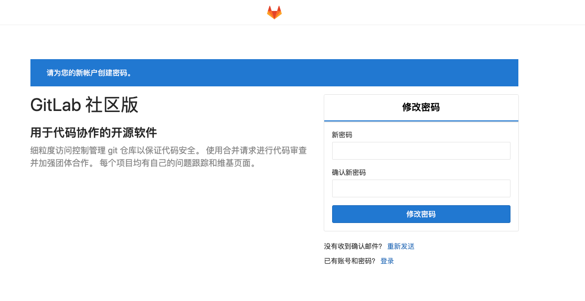
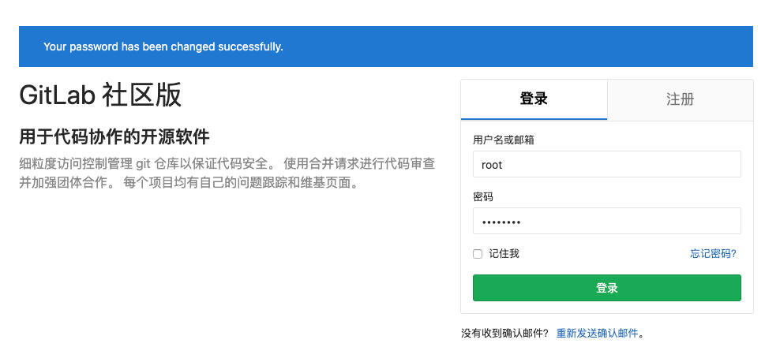
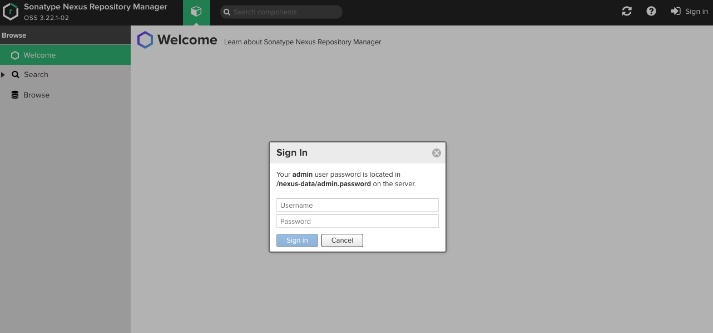
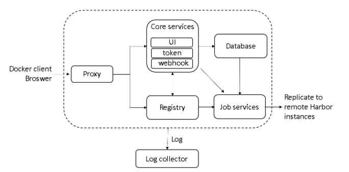
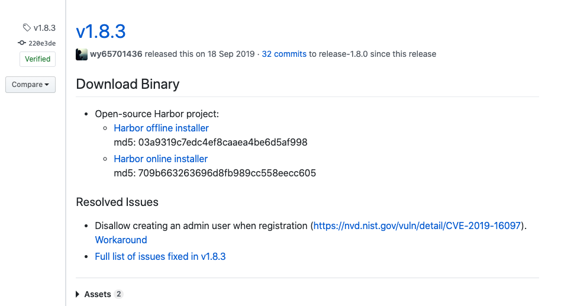
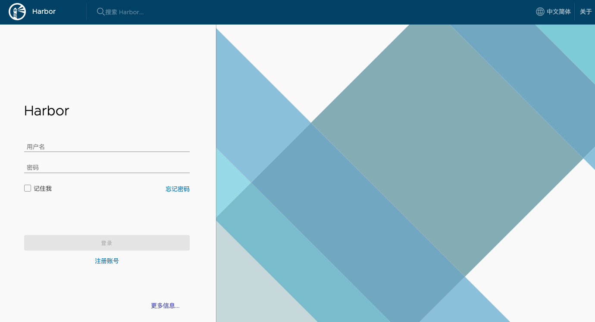
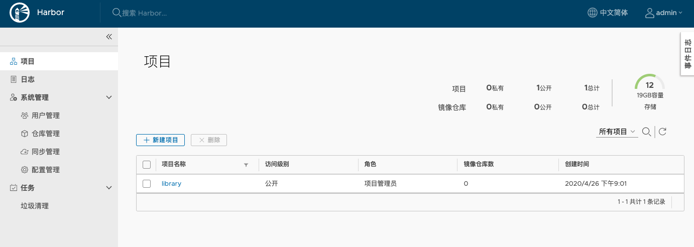
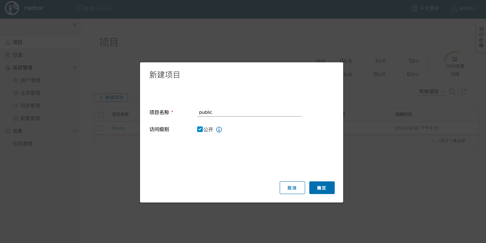
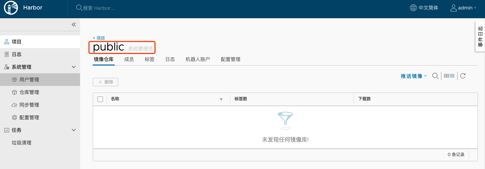

# Docker Compose

## 第 1 章 Docker Compose 简介

### 1.1 什么是 Docker Compose

Docker Compose 是 Docker 官方编排（Orchestration）项目之一，负责快速的部署分布式应用。

### 1.2 Docker Compose 简介

`Compose` 项目是 Docker 官方的开源项目，负责实现对 **Docker 容器集群的快速编排**。从功能上看，跟 `OpenStack` 中的 `Heat` 十分类似。

其代码目前在 https://github.com/docker/compose 上开源。

`Compose` 定位是 「定义和运行多个 Docker 容器的应用（Defining and running multi-container Docker applications）」，其前身是开源项目 Fig。

通过第一部分中的介绍，我们知道使用一个 `Dockerfile` 模板文件，可以让用户很方便的定义一个单独的应用容器。然而，在日常工作中，经常会碰到需要多个容器相互配合来完成某项任务的情况。例如要实现一个 Web 项目，除了 Web 服务容器本身，往往还需要再加上后端的数据库服务容器，甚至还包括负载均衡容器等。

`Compose` 恰好满足了这样的需求。它允许用户通过一个单独的 `docker-compose.yml` 模板文件（YAML 格式）来定义一组相关联的应用容器为一个项目（project）。

`Compose` 中有两个重要的概念：

- 服务 (`service`)：一个应用的容器，实际上可以包括若干运行相同镜像的容器实例。
- 项目 (`project`)：由一组关联的应用容器组成的一个完整业务单元，在 `docker-compose.yml` 文件中定义。

`Compose` 的默认管理对象是项目，通过子命令对项目中的一组容器进行便捷地生命周期管理。

`Compose` 项目由 Python 编写，实现上调用了 Docker 服务提供的 API 来对容器进行管理。因此，只要所操作的平台支持 Docker API，就可以在其上利用 `Compose` 来进行编排管理。


## 第 2 章 Docker Compose 安装与卸载

### 2.1 安装 Docker Compose

`Compose` 支持 Linux、macOS、Windows 10 三大平台。在 Linux 上的也安装十分简单，从 [官方 GitHub Release](https://github.com/docker/compose/releases) 处直接下载编译好的二进制文件即可。

例如，在 Linux 64 位系统上直接下载对应的二进制包。

```sh
# curl -L https://github.com/docker/compose/releases/download/1.25.4/docker-compose-`uname -s`-`uname -m` -o /usr/local/bin/docker-compose
# chmod +x /usr/local/bin/docker-compose
```

验证是否安装成功

```sh
# docker-compose version
docker-compose version 1.25.4, build 8d51620a
docker-py version: 4.1.0
CPython version: 3.7.5
OpenSSL version: OpenSSL 1.1.0l  10 Sep 2019
```


### 2.2 卸载 Docker Compose

如果是二进制包方式安装的，删除二进制文件即可。

```sh
# rm /usr/local/bin/docker-compose
```


## 第 3 章 Docker Compose 使用

### 3.1 术语

首先介绍几个术语。

- 服务 (`service`)：一个应用容器，实际上可以运行多个相同镜像的实例。
- 项目 (`project`)：由一组关联的应用容器组成的一个完整业务单元。

可见，一个项目可以由多个服务（容器）关联而成，`Compose` 面向项目进行管理。


### 3.2 场景

最常见的项目是 web 网站，该项目应该包含 web 应用和缓存。

下面我们用 `Python` 来建立一个能够记录页面访问次数的 web 网站。

#### Web 应用

新建文件夹，在该目录中编写 `app.py` 文件

```python
from flask import Flask
from redis import Redis

app = Flask(__name__)
redis = Redis(host='redis', port=6379)

@app.route('/')
def hello():
    count = redis.incr('hits')
    return 'Hello World! 该页面已被访问 {} 次。\n'.format(count)

if __name__ == "__main__":
    app.run(host="0.0.0.0", debug=True)
```

#### Dockerfile

编写 `Dockerfile` 文件，内容为

```shell
FROM python:3.6-alpine
ADD . /code
WORKDIR /code
RUN pip install redis flask
CMD ["python", "app.py"]
```

#### docker-compose.yml

编写 `docker-compose.yml` 文件，这个是 Compose 使用的主模板文件。

```shell
version: '3'
services:

  web:
    build: .
    ports:
     - "5000:5000"
     
  redis:
    image: "redis:alpine"
```

#### 运行 compose 项目

```sh
# docker-compose up -d
```

此时访问本地 `5000` 端口，每次刷新页面，计数就会加 1。

#### 结束 compose 项目

```sh
# docker-compose down
```


### 3.3 扩展阅读（yaml）

YAML 是专门用来写配置文件的语言, 非常简洁和强大, 远比 JSON 格式方便, YAML 语言的设计目标, 就是方便读写。它的本质是一种通用的数据串行化格式。它的基本语法规则如下：

- 大小写敏感
- 使用缩进表示层级关系
- 缩进时不允许使用 TAB 键, 只允许使用空格。
- 缩进的空格数目不重要, 只要相同层级的元素左侧对齐即可。

`#`表示注释, 从这个字符一直到行尾, 都会被解析器忽略。

YAML 支持的数据结构有三种：

- 对象： 键值对的集合, 又称映射（mapping）/ 哈希（hashes）/ 字典（dictionary）
- 数组：一组按次排列的值, 又称为序列（sequence）/ 列表（list）
- 纯量（scalars）：单个的、不可分割的值。

#### YAML 对象

对象的一组键值对, 使用冒号结构表示

```yaml
animal: pets
```

#### YAML 数组

一组连词先开头的行, 构成一个数组

```yaml
- Cat
- Dog
- Goldfish
```

数组结构的子成员是一个数组, 则可以在该项下面缩进一个空格

```yaml
-Array
 - Cat
 - Dog
 - Goldfish
```

#### YAML 复合结构

对象和数组可以结合使用, 形成符合结构

```yaml
languages:
	- Ruby
	- Perl
	- Python
websites:
 Yaml: yaml.org
 Ruby: ruby-lang.org
 Python: python.org
```

#### YAML 纯量

纯量是最基础的、不可分割的值。

- 字符串
- 布尔值
- 整数
- 浮点数
- Null
- 时间
- 日期


### 3.4 Docker Compose 命令说明

#### 命令对象与格式

对于 Compose 来说，大部分命令的对象既可以是项目本身，也可以指定为项目中的服务或者容器。如果没有特别的说明，命令对象将是项目，这意味着项目中所有的服务都会受到命令影响。

执行 `docker-compose [COMMAND] --help` 或者 `docker-compose help [COMMAND]` 可以查看具体某个命令的使用格式。

`docker-compose` 命令的基本的使用格式是

```sh
docker-compose [-f=<arg>...] [options] [COMMAND] [ARGS...]
```

#### 命令选项

- `-f, --file FILE` 指定使用的 Compose 模板文件，默认为 `docker-compose.yml`，可以多次指定。

- `-p, --project-name NAME` 指定项目名称，默认将使用所在目录名称作为项目名。

- `--x-networking` 使用 Docker 的可拔插网络后端特性

- `--x-network-driver DRIVER` 指定网络后端的驱动，默认为 `bridge`

- `--verbose` 输出更多调试信息。

- `-v, --version` 打印版本并退出。

  

#### 命令使用说明

 **`build`**

格式为 `docker-compose build [options] [SERVICE...]`。

构建（重新构建）项目中的服务容器。

服务容器一旦构建后，将会带上一个标记名，例如对于 web 项目中的一个 db 容器，可能是 web_db。

可以随时在项目目录下运行 `docker-compose build` 来重新构建服务。

选项包括：

- `--force-rm` 删除构建过程中的临时容器。
- `--no-cache` 构建镜像过程中不使用 cache（这将加长构建过程）。
- `--pull` 始终尝试通过 pull 来获取更新版本的镜像。

**`config`**

验证 Compose 文件格式是否正确，若正确则显示配置，若格式错误显示错误原因。

**`down`**

此命令将会停止 `up` 命令所启动的容器，并移除网络

**`exec`**

进入指定的容器。

**`help`**

获得一个命令的帮助。

**`images`**

列出 Compose 文件中包含的镜像。

**`kill`**

格式为 `docker-compose kill [options] [SERVICE...]`。

通过发送 `SIGKILL` 信号来强制停止服务容器。

支持通过 `-s` 参数来指定发送的信号，例如通过如下指令发送 `SIGINT` 信号。

```bash
# docker-compose kill -s SIGINT
```

**`logs`**

格式为 `docker-compose logs [options] [SERVICE...]`。

查看服务容器的输出。默认情况下，docker-compose 将对不同的服务输出使用不同的颜色来区分。可以通过 `--no-color` 来关闭颜色。

该命令在调试问题的时候十分有用。

**`pause`**

格式为 `docker-compose pause [SERVICE...]`。

暂停一个服务容器。

**`port`**

格式为 `docker-compose port [options] SERVICE PRIVATE_PORT`。

打印某个容器端口所映射的公共端口。

选项：

- `--protocol=proto` 指定端口协议，tcp（默认值）或者 udp。
- `--index=index` 如果同一服务存在多个容器，指定命令对象容器的序号（默认为 1）。

**`ps`**

格式为 `docker-compose ps [options] [SERVICE...]`。

列出项目中目前的所有容器。

选项：

- `-q` 只打印容器的 ID 信息。

**`pull`**

格式为 `docker-compose pull [options] [SERVICE...]`。

拉取服务依赖的镜像。

选项：

- `--ignore-pull-failures` 忽略拉取镜像过程中的错误。

**`push`**

推送服务依赖的镜像到 Docker 镜像仓库。

**`restart`**

格式为 `docker-compose restart [options] [SERVICE...]`。

重启项目中的服务。

选项：

- `-t, --timeout TIMEOUT` 指定重启前停止容器的超时（默认为 10 秒）。

**`rm`**

格式为 `docker-compose rm [options] [SERVICE...]`。

删除所有（停止状态的）服务容器。推荐先执行 `docker-compose stop` 命令来停止容器。

选项：

- `-f, --force` 强制直接删除，包括非停止状态的容器。一般尽量不要使用该选项。
- `-v` 删除容器所挂载的数据卷。

**`run`**

格式为 `docker-compose run [options] [-p PORT...] [-e KEY=VAL...] SERVICE [COMMAND] [ARGS...]`。

在指定服务上执行一个命令。

例如：

```bash
# docker-compose run ubuntu ping docker.com
```

将会启动一个 ubuntu 服务容器，并执行 `ping docker.com` 命令。

默认情况下，如果存在关联，则所有关联的服务将会自动被启动，除非这些服务已经在运行中。

该命令类似启动容器后运行指定的命令，相关卷、链接等等都将会按照配置自动创建。

两个不同点：

- 给定命令将会覆盖原有的自动运行命令；
- 不会自动创建端口，以避免冲突。

如果不希望自动启动关联的容器，可以使用 `--no-deps` 选项，例如

```bash
# docker-compose run --no-deps web python manage.py shell
```

将不会启动 web 容器所关联的其它容器。

选项：

- `-d` 后台运行容器。
- `--name NAME` 为容器指定一个名字。
- `--entrypoint CMD` 覆盖默认的容器启动指令。
- `-e KEY=VAL` 设置环境变量值，可多次使用选项来设置多个环境变量。
- `-u, --user=""` 指定运行容器的用户名或者 uid。
- `--no-deps` 不自动启动关联的服务容器。
- `--rm` 运行命令后自动删除容器，`d` 模式下将忽略。
- `-p, --publish=[]` 映射容器端口到本地主机。
- `--service-ports` 配置服务端口并映射到本地主机。
- `-T` 不分配伪 tty，意味着依赖 tty 的指令将无法运行。

**`scale`**

格式为 `docker-compose scale [options] [SERVICE=NUM...]`。

设置指定服务运行的容器个数。

通过 `service=num` 的参数来设置数量。例如：

```bash
# docker-compose scale web=3 db=2
```

将启动 3 个容器运行 web 服务，2 个容器运行 db 服务。

一般的，当指定数目多于该服务当前实际运行容器，将新创建并启动容器；反之，将停止容器。

选项：

- `-t, --timeout TIMEOUT` 停止容器时候的超时（默认为 10 秒）。

**`start`**

格式为 `docker-compose start [SERVICE...]`。

启动已经存在的服务容器。

**`stop`**

格式为 `docker-compose stop [options] [SERVICE...]`。

停止已经处于运行状态的容器，但不删除它。通过 `docker-compose start` 可以再次启动这些容器。

选项：

- `-t, --timeout TIMEOUT` 停止容器时候的超时（默认为 10 秒）。

**`top`**

查看各个服务容器内运行的进程。

**`unpause`**

格式为 `docker-compose unpause [SERVICE...]`。

恢复处于暂停状态中的服务。

**`up`**

格式为 `docker-compose up [options] [SERVICE...]`。

该命令十分强大，它将尝试自动完成包括构建镜像，（重新）创建服务，启动服务，并关联服务相关容器的一系列操作。

链接的服务都将会被自动启动，除非已经处于运行状态。

可以说，大部分时候都可以直接通过该命令来启动一个项目。

默认情况，`docker-compose up` 启动的容器都在前台，控制台将会同时打印所有容器的输出信息，可以很方便进行调试。

当通过 `Ctrl-C` 停止命令时，所有容器将会停止。

如果使用 `docker-compose up -d`，将会在后台启动并运行所有的容器。一般推荐生产环境下使用该选项。

默认情况，如果服务容器已经存在，`docker-compose up` 将会尝试停止容器，然后重新创建（保持使用 `volumes-from` 挂载的卷），以保证新启动的服务匹配 `docker-compose.yml` 文件的最新内容。如果用户不希望容器被停止并重新创建，可以使用 `docker-compose up --no-recreate`。这样将只会启动处于停止状态的容器，而忽略已经运行的服务。如果用户只想重新部署某个服务，可以使用 `docker-compose up --no-deps -d ` 来重新创建服务并后台停止旧服务，启动新服务，并不会影响到其所依赖的服务。

选项：

- `-d` 在后台运行服务容器。

- `--no-color` 不使用颜色来区分不同的服务的控制台输出。

- `--no-deps` 不启动服务所链接的容器。

- `--force-recreate` 强制重新创建容器，不能与 `--no-recreate` 同时使用。

- `--no-recreate` 如果容器已经存在了，则不重新创建，不能与 `--force-recreate` 同时使用。

- `--no-build` 不自动构建缺失的服务镜像。

- `-t, --timeout TIMEOUT` 停止容器时候的超时（默认为 10 秒）。

**`version`**

格式为 `docker-compose version`。

打印版本信息。


### 3.5 Docker Compose 部署应用程序

#### 部署 Tomcat

```yaml
version: '3.1'
services:
   tomcat:
     restart: always
     image: tomcat
     container_name: tomcat
     ports:
      - 8080:8080
     volumes:
   	  - ./webapps:/usr/local/tomcat/webapps
     environment:
      TZ: Asia/Shanghai
```

#### 部署 MySQL

```yaml
version: '3.1'
services:
   db:
     # 目前 latest 版本为 MySQL8.x
     image: mysql
     restart: always
     environment:
       MYSQL_ROOT_PASSWORD: 123456
     command:
       --default-authentication-plugin=mysql_native_password
       --character-set-server=utf8mb4
       --explicit_defaults_for_timestamp=true
       --lower_case_table_names=1
     ports:
       - 3306:3306
     volumes:
       - ./data:/var/lib/mysql

    # MySQL 的 web 客户
   adminer:
     image: adminer
     restart: always
     ports:
       - 8080:8080   
```


### 3.6 Docker Compose 部署 GitLab

#### 什么是 GitLab

GitLab 是利用 Ruby on Rails 一个开源的版本管理系统，实现一个自托管的 Git 项目仓库，可通过 Web 界面进行访问公开的或者私人项目。它拥有与 Github 类似的功能，能够浏览源代码，管理缺陷和注释。可以管理团队对仓库的访问，它非常易于浏览提交过的版本并提供一个文件历史库。团队成员可以利用内置的简单聊天程序 (Wall) 进行交流。它还提供一个代码片段收集功能可以轻松实现代码复用，便于日后有需要的时候进行查找。

#### 部署 GitLab


- 配置docker-compose.yml

  这里用到了一个中文版的docker镜像。https://hub.docker.com/r/twang2218/gitlab-ce-zh/

```yaml
version: '3.1'
services:
    gitlab:
      image: 'twang2218/gitlab-ce-zh'
      restart: always
      hostname: 'pyy.gitlab.top'
      environment:
        TZ: 'Asia/Shanghai'
        GITLAB_OMNIBUS_CONFIG: |
          external_url 'http://pyy.gitlab.top:9999'
          gitlab_rails['time_zone'] = 'Asia/Shanghai'
          # 需要配置到 gitlab.rb 中的配置可以在这里配置，每个配置一行，注意缩进。
          # 比如下面的电子邮件的配置：
          # gitlab_rails['smtp_enable'] = true
          # gitlab_rails['smtp_address'] = "smtp.exmail.qq.com"
          # gitlab_rails['smtp_port'] = 465
          # gitlab_rails['smtp_user_name'] = "xxxx@xx.com"
          # gitlab_rails['smtp_password'] = "password"
          # gitlab_rails['smtp_authentication'] = "login"
          # gitlab_rails['smtp_enable_starttls_auto'] = true
          # gitlab_rails['smtp_tls'] = true
          # gitlab_rails['gitlab_email_from'] = 'xxxx@xx.com'
      ports:
        - '9999:9999'
          #- '443:443'
          #- '22:22'
      volumes:
        - /home/pyy/app/docker/compose/gitlab/config:/etc/gitlab
        - /home/pyy/app/docker/compose/gitlab/data:/var/opt/gitlab
        - /home/pyy/app/docker/compose/gitlab/logs:/var/log/gitlab
```


- 配置hosts

```shell
# cat /etc/hosts
127.0.0.1   localhost localhost.localdomain localhost4 localhost4.localdomain4
::1         localhost localhost.localdomain localhost6 localhost6.localdomain6

127.0.0.1   pyy.gitlab.top
```

- 创建目录

  ```sh
  # pwd
  /home/pyy/app/docker/compose/gitlab
  # ll
  总用量 16
  drwxrwxr-x  3 root    root  4096 9月  4 11:37 config
  drwxr-xr-x 18 root    root  4096 9月  4 11:42 data
  -rw-rw-r--  1 fantj   fantj 1286 9月  4 11:42 docker-compose.yml
  drwxr-xr-x 19 polkitd fantj 4096 9月  4 11:38 logs
  ```

- 启动

  ```sh
  # docker-compose up -d
  ```

- 访问`http://pyy.github:9999`

  

- 设置密码并登陆

  设置完密码后, 超级用户账号默认：root

  

- 设置和使用

  ```
  设置->设置
      设置ssh和http服务
      设置注册服务开关
      设置项目限制
      设置头像来源等等
  ```


### 3.7 Docker Compose 部署 Nexus

#### 什么是 Nexus

Nexus 是一个强大的仓库管理器，极大地简化了内部仓库的维护和外部仓库的访问。

Nexus 3.0 版本发布，相较 2.x 版本有了很大的改变：

- 对低层代码进行了大规模重构，提升性能，增加可扩展性以及改善用户体验。
- 升级界面，极大的简化了用户界面的操作和管理。
- 提供新的安装包，让部署更加简单。
- 增加对 Docker, NeGet, npm, Bower 的支持。
- 提供新的管理接口，以及增强对自动任务的管理。


#### 部署 Nexus

docker-compose.yml 配置：

```yaml
version: '3.1'
services:
  nexus:
    image: sonatype/nexus
    restart: always
    container_name: nexus
    ports:
    - 8081:8081
    volumes:
    - ./data:/nexus-data
```

> 注意：启动时如果出现权限问题可以使用 chmod 777 修改 data 目录读写权限

#### 验证安装是否成功

地址：http://ip+port/

默认用户名：admin 

密码：在 `/nexus-data` 目录下 `admin.password` 文件中



登录后, 重置密码。


#### 在项目中使用 maven 私服

- **配置认证信息**

  在 Maven `settings.xml` 中添加 Nexus 认证信息(`servers` 节点下)：

  ```xml
  <server>
    <id>nexus-releases</id>
    <username>admin</username>
    <password>xxxx</password>
  </server>
  
  <server>
    <id>nexus-snapshots</id>
    <username>admin</username>
    <password>xxxxx</password>
  </server>
  ```

  Snapshots 与 Releases 的区别

  - nexus-releases: 用于发布 Release 版本
  - nexus-snapshots: 用于发布 Snapshot 版本（快照版）

  Release 版本与 Snapshot 定义如下：

  ```text
  Release: 1.0.0/1.0.0-RELEASE
  Snapshot: 1.0.0-SNAPSHOT
  ```
  - 在项目 `pom.xml` 中设置的版本号添加 `SNAPSHOT` 标识的都会发布为 `SNAPSHOT` 版本，没有 `SNAPSHOT` 标识的都会发布为 `RELEASE` 版本。
  - `SNAPSHOT` 版本会自动加一个时间作为标识，如：`1.0.0-SNAPSHOT` 发布后为变成 `1.0.0-SNAPSHOT-20180522.123456-1.jar`

- **配置自动化部署**

  在 `pom.xml` 中添加如下代码：

  ```xml
  <distributionManagement>  
    <repository>  
      <id>nexus-releases</id>  
      <name>Nexus Release Repository</name>  
      <url>http://127.0.0.1:8081/repository/maven-releases/</url>  
    </repository>  
    <snapshotRepository>  
      <id>nexus-snapshots</id>  
      <name>Nexus Snapshot Repository</name>  
      <url>http://127.0.0.1:8081/repository/maven-snapshots/</url>  
    </snapshotRepository>  
  </distributionManagement>
  ```

  注意事项：

  - ID 名称必须要与 `settings.xml` 中 Servers 配置的 ID 名称保持一致。
  - 项目版本号中有 `SNAPSHOT` 标识的，会发布到 Nexus Snapshots Repository, 否则发布到 Nexus Release Repository，并根据 ID 去匹配授权账号。

  部署到仓库:

  ```
  mvn deploy
  ```

- **上传第三方 JAR 包**

  Nexus 3.0 不支持页面上传，可使用 maven 命令：

  ```
  # 如第三方JAR包：aliyun-sdk-oss-2.2.3.jar
  mvn deploy:deploy-file 
    -DgroupId=com.aliyun.oss 
    -DartifactId=aliyun-sdk-oss 
    -Dversion=2.2.3 
    -Dpackaging=jar 
    -Dfile=D:\aliyun-sdk-oss-2.2.3.jar 
    -Durl=http://127.0.0.1:8081/repository/maven-3rd/ 
    -DrepositoryId=nexus-releases
  ```

  注意事项：

  - 建议在上传第三方 JAR 包时，创建单独的第三方 JAR 包管理仓库，便于管理有维护。（maven-3rd）
  - `-DrepositoryId=nexus-releases` 对应的是 `settings.xml` 中 Servers 配置的 ID 名称。（授权）

- **配置代理仓库**

  ```xml
  <repositories>
      <repository>
          <id>nexus</id>
          <name>Nexus Repository</name>
          <url>http://127.0.0.1:8081/repository/maven-public/</url>
          <snapshots>
              <enabled>true</enabled>
          </snapshots>
          <releases>
              <enabled>true</enabled>
          </releases>
      </repository>
  </repositories>
  
  <pluginRepositories>
      <pluginRepository>
          <id>nexus</id>
          <name>Nexus Plugin Repository</name>
          <url>http://127.0.0.1:8081/repository/maven-public/</url>
          <snapshots>
              <enabled>true</enabled>
          </snapshots>
          <releases>
              <enabled>true</enabled>
          </releases>
      </pluginRepository>
  </pluginRepositories>
  ```

### 3.8 Docker Compose 部署 Harbor

#### 什么是 Harbor

Harbor 是一个用于存储和分发 Docker 镜像的企业级 Registry 服务器，通过添加一些企业必需的功能特性，例如安全、标识和管理等，扩展了开源 Docker Distribution。作为一个企业级私有 Registry 服务器，Harbor 提供了更好的性能和安全。提升用户使用 Registry 构建和运行环境传输镜像的效率。Harbor 支持安装在多个 Registry 节点的镜像资源复制，镜像全部保存在私有 Registry 中， 确保数据和知识产权在公司内部网络中管控。另外，Harbor 也提供了高级的安全特性，诸如用户管理，访问控制和活动审计等。

#### Harbor 特性

- **基于角色的访问控制 ：** 用户与 Docker 镜像仓库通过 “项目” 进行组织管理，一个用户可以对多个镜像仓库在同一命名空间（project）里有不同的权限。

- **镜像复制 ：** 镜像可以在多个 Registry 实例中复制（同步）。尤其适合于负载均衡，高可用，混合云和多云的场景。

- **图形化用户界面 ： **用户可以通过浏览器来浏览，检索当前 Docker 镜像仓库，管理项目和命名空间。

- **AD/LDAP 支持 ：** Harbor 可以集成企业内部已有的 AD/LDAP，用于鉴权认证管理。

- **审计管理 ：** 所有针对镜像仓库的操作都可以被记录追溯，用于审计管理。

- **国际化 ：** 已拥有英文、中文、德文、日文和俄文的本地化版本。更多的语言将会添加进来。

- **RESTful API ：** RESTful API 提供给管理员对于 Harbor 更多的操控，使得与其它管理软件集成变得更容易。

- **部署简单 ：** 提供在线和离线两种安装工具， 也可以安装到 vSphere 平台 (OVA 方式) 虚拟设备。


#### Harbor 组件

- **Proxy：** Harbor 的 registry, UI, token 等服务，通过一个前置的反向代理统一接收浏览器、Docker 客户端的请求，并将请求转发给后端不同的服务。

- **Registry：** 负责储存 Docker 镜像，并处理 docker push/pull 命令。由于我们要对用户进行访问控制，即不同用户对 Docker image 有不同的读写权限，Registry 会指向一个 token 服务，强制用户的每次 docker pull/push 请求都要携带一个合法的 token, Registry 会通过公钥对 token 进行解密验证。

- **Core services：** 这是 Harbor 的核心功能，主要提供以下服务：
  - **UI：** 提供图形化界面，帮助用户管理 registry 上的镜像（image）, 并对用户进行授权。
  - **WebHook：** 为了及时获取 registry 上 image 状态变化的情况， 在 Registry 上配置 webhook，把状态变化传递给 UI 模块。
  - **Token：** 负责根据用户权限给每个 docker push/pull 命令签发 token. Docker 客户端向 - Registry 服务发起的请求，如果不包含 token，会被重定向到这里，获得 token 后再重新向 Registry 进行请求。

- **Database：** 为 core services 提供数据库服务，负责储存用户权限、审计日志、Docker image 分组信息等数据。

- **Job Services：** 提供镜像远程复制功能，可以把本地镜像同步到其他 Harbor 实例中。

- **Log Collector：** 为了帮助监控 Harbor 运行，负责收集其他组件的 log，供日后进行分析。



#### Harbor 安装

- **进入GitHub官网进行下载**
  地址：https://github.com/goharbor/harbor/releases

  

- **下载成功后并上传至服务器, 并解压**

  ```sh
  root@pyy:/home/pyy/app/docker/compose/harbor# ll
  # 目录结构
  -rw-r--r-- 1 root root 583269670 Sep 16  2019 harbor.v1.8.3.tar.gz
  -rw-r--r-- 1 root root      4519 Sep 16  2019 harbor.yml
  -rwxr-xr-x 1 root root      5088 Sep 16  2019 install.sh*
  -rw-r--r-- 1 root root     11347 Sep 16  2019 LICENSE
  -rwxr-xr-x 1 root root      1654 Sep 16  2019 prepare*
  ```

  

- **修改配置文件**

  ```sh
  vi harbor.yml
  ```

  ```yaml
  # Configuration file of Harbor
  
  # The IP address or hostname to access admin UI and registry service.
  # DO NOT use localhost or 127.0.0.1, because Harbor needs to be accessed by external clients.
  # 修改为域名或你服务器 IP
  hostname: 192.168.0.203  
  
  # http related config
  http:
    # port for http, default is 80. If https enabled, this port will redirect to https port
    port: 80
  ```

- **执行安装脚本**

  ```sh
  ./install.sh 
  ```

  ```sh
  # 安装输出信息
  [Step 0]: checking installation environment ...
  
  Note: docker version: 19.03.8
  
  Note: docker-compose version: 1.25.4
  
  [Step 1]: loading Harbor images ...
  b80136ee24a4: Loading layer [==================================================>]  34.25MB/34.25MB
  88c6d2bb8c65: Loading layer [==================================================>]  63.49MB/63.49MB
  2d2b1a3edc7d: Loading layer [==================================================>]  53.06MB/53.06MB
  8f9195383bd6: Loading layer [==================================================>]  6.656kB/6.656kB
  5ca164c40e26: Loading layer [==================================================>]  2.048kB/2.048kB
  7bb465660a7f: Loading layer [==================================================>]   7.68kB/7.68kB
  01dbbe931cd2: Loading layer [==================================================>]   2.56kB/2.56kB
  d3f864467c00: Loading layer [==================================================>]   2.56kB/2.56kB
  7127932e50b4: Loading layer [==================================================>]   2.56kB/2.56kB
  Loaded image: goharbor/harbor-db:v1.8.3
  95d29642f385: Loading layer [==================================================>]  76.86MB/76.86MB
  6c5c14da0eb6: Loading layer [==================================================>]  3.072kB/3.072kB
  0ae2f6f75c2d: Loading layer [==================================================>]   59.9kB/59.9kB
  c05fa142a5f0: Loading layer [==================================================>]  61.95kB/61.95kB
  Loaded image: goharbor/redis-photon:v1.8.3
  0a0f9f6b0d73: Loading layer [==================================================>]  8.979MB/8.979MB
  4ff59ce76df8: Loading layer [==================================================>]  5.143MB/5.143MB
  595e28a6d5dd: Loading layer [==================================================>]  13.72MB/13.72MB
  08ecdfede76e: Loading layer [==================================================>]  26.47MB/26.47MB
  cec929bcb1ce: Loading layer [==================================================>]  22.02kB/22.02kB
  6b8df09d36cd: Loading layer [==================================================>]  3.072kB/3.072kB
  cb3dc5d6a05f: Loading layer [==================================================>]  45.33MB/45.33MB
  Loaded image: goharbor/notary-signer-photon:v0.6.1-v1.8.3
  1725b0c1a9a8: Loading layer [==================================================>]  8.985MB/8.985MB
  e7d8ded7fdc4: Loading layer [==================================================>]  44.39MB/44.39MB
  4e7b23fb9f82: Loading layer [==================================================>]  2.048kB/2.048kB
  66c0e65d70f6: Loading layer [==================================================>]  3.072kB/3.072kB
  9544c2e379f9: Loading layer [==================================================>]   44.4MB/44.4MB
  Loaded image: goharbor/chartmuseum-photon:v0.9.0-v1.8.3
  d32f29d72d88: Loading layer [==================================================>]  8.979MB/8.979MB
  c0506e3ca763: Loading layer [==================================================>]  46.92MB/46.92MB
  f64cde554714: Loading layer [==================================================>]  5.632kB/5.632kB
  db04f8e0162d: Loading layer [==================================================>]  29.18kB/29.18kB
  b631ee787727: Loading layer [==================================================>]  46.92MB/46.92MB
  Loaded image: goharbor/harbor-core:v1.8.3
  f576d64ee0ba: Loading layer [==================================================>]  50.61MB/50.61MB
  290c9b6289d5: Loading layer [==================================================>]  3.584kB/3.584kB
  5d61584d2956: Loading layer [==================================================>]  3.072kB/3.072kB
  67ef984d4b8a: Loading layer [==================================================>]   2.56kB/2.56kB
  0dc33d9e6bd9: Loading layer [==================================================>]  3.072kB/3.072kB
  d8c16c3b7ac3: Loading layer [==================================================>]  3.584kB/3.584kB
  be69664d356a: Loading layer [==================================================>]  12.29kB/12.29kB
  Loaded image: goharbor/harbor-log:v1.8.3
  96afca216a34: Loading layer [==================================================>]   8.98MB/8.98MB
  cf2507154eef: Loading layer [==================================================>]  3.072kB/3.072kB
  4a2c6388ed0f: Loading layer [==================================================>]   20.1MB/20.1MB
  32036e8a07e3: Loading layer [==================================================>]  3.072kB/3.072kB
  7454fe51a038: Loading layer [==================================================>]  7.465MB/7.465MB
  198ef4779172: Loading layer [==================================================>]  27.56MB/27.56MB
  Loaded image: goharbor/harbor-registryctl:v1.8.3
  bb54e139bca3: Loading layer [==================================================>]  15.13MB/15.13MB
  4941410aed1b: Loading layer [==================================================>]  26.47MB/26.47MB
  1449fb6cde1c: Loading layer [==================================================>]  22.02kB/22.02kB
  fd78de699481: Loading layer [==================================================>]  3.072kB/3.072kB
  3791b26acaa3: Loading layer [==================================================>]  46.74MB/46.74MB
  Loaded image: goharbor/notary-server-photon:v0.6.1-v1.8.3
  3839997fbf5d: Loading layer [==================================================>]    113MB/113MB
  0b471d0667f2: Loading layer [==================================================>]  10.94MB/10.94MB
  354943756514: Loading layer [==================================================>]  2.048kB/2.048kB
  2a59d04b8c15: Loading layer [==================================================>]  48.13kB/48.13kB
  075a225c2421: Loading layer [==================================================>]  3.072kB/3.072kB
  5a3c08a102df: Loading layer [==================================================>]  10.99MB/10.99MB
  Loaded image: goharbor/clair-photon:v2.0.8-v1.8.3
  86a1b291bcc8: Loading layer [==================================================>]  337.6MB/337.6MB
  1abd6cfbee84: Loading layer [==================================================>]    107kB/107kB
  Loaded image: goharbor/harbor-migrator:v1.8.3
  f43d0ed4d1b5: Loading layer [==================================================>]   2.56kB/2.56kB
  cdf4be494423: Loading layer [==================================================>]  1.536kB/1.536kB
  1da4caf48243: Loading layer [==================================================>]  71.98MB/71.98MB
  e4959b489cdc: Loading layer [==================================================>]  42.56MB/42.56MB
  7d02cb057768: Loading layer [==================================================>]  144.4kB/144.4kB
  dc328ed7230a: Loading layer [==================================================>]  3.006MB/3.006MB
  Loaded image: goharbor/prepare:v1.8.3
  d240fe19eee2: Loading layer [==================================================>]  3.565MB/3.565MB
  95109f705255: Loading layer [==================================================>]   6.59MB/6.59MB
  4d1442f2fd56: Loading layer [==================================================>]  161.3kB/161.3kB
  c08c13f64b16: Loading layer [==================================================>]    215kB/215kB
  5d50a9be80ef: Loading layer [==================================================>]  3.584kB/3.584kB
  Loaded image: goharbor/harbor-portal:v1.8.3
  cebbfd271c14: Loading layer [==================================================>]  3.565MB/3.565MB
  Loaded image: goharbor/nginx-photon:v1.8.3
  947d02006ad8: Loading layer [==================================================>]  8.979MB/8.979MB
  1b8f6ef98cc1: Loading layer [==================================================>]  38.83MB/38.83MB
  48afdc6a3f19: Loading layer [==================================================>]  38.83MB/38.83MB
  Loaded image: goharbor/harbor-jobservice:v1.8.3
  dd073e952ef4: Loading layer [==================================================>]   8.98MB/8.98MB
  14a5970524bb: Loading layer [==================================================>]  3.072kB/3.072kB
  8d6eade07896: Loading layer [==================================================>]   2.56kB/2.56kB
  0c4f17cf375a: Loading layer [==================================================>]   20.1MB/20.1MB
  d18322acb4ac: Loading layer [==================================================>]   20.1MB/20.1MB
  Loaded image: goharbor/registry-photon:v2.7.1-patch-2819-v1.8.3
  
  
  [Step 2]: preparing environment ...
  prepare base dir is set to /home/pyy/app/docker/compose/harbor
  Generated configuration file: /config/log/logrotate.conf
  Generated configuration file: /config/nginx/nginx.conf
  Generated configuration file: /config/core/env
  Generated configuration file: /config/core/app.conf
  Generated configuration file: /config/registry/config.yml
  Generated configuration file: /config/registryctl/env
  Generated configuration file: /config/db/env
  Generated configuration file: /config/jobservice/env
  Generated configuration file: /config/jobservice/config.yml
  Generated and saved secret to file: /secret/keys/secretkey
  Generated certificate, key file: /secret/core/private_key.pem, cert file: /secret/registry/root.crt
  Generated configuration file: /compose_location/docker-compose.yml
  Clean up the input dir
  
  
  
  [Step 3]: starting Harbor ...
  Creating network "harbor_harbor" with the default driver
  Creating harbor-log ... done
  Creating harbor-db   ... done
  Creating registryctl       ... done
  Creating redis         ... done
  Creating registry    ... done
  Creating harbor-core ... done
  Creating harbor-portal     ... done
  Creating harbor-jobservice ... done
  Creating nginx             ... done
  
  ----Harbor has been installed and started successfully.----
  
  Now you should be able to visit the admin portal at http://pyy.harbor. 
  For more details, please visit https://github.com/goharbor/harbor .
  ```

  

- **验证是否成功**

  访问地址：http://ip+port

  

- **登录**

  默认账号密码：admin Harbor12345, 登录成功后：

  

- **Harbor 启动和停止**

  Harbor 的日常运维管理是通过 docker-compose 来完成的，Harbor 本身有多个服务进程，都放在 docker 容器之中运行，我们可以通过 docker ps 命令查看。

  ```sh
  # docker ps | grep harbor
  e71dd2e59d09        goharbor/nginx-photon:v1.8.3                        "nginx -g 'daemon of…"   5 minutes ago       Up 5 minutes (healthy)   0.0.0.0:180->80/tcp                               nginx
  05f364054840        goharbor/harbor-jobservice:v1.8.3                   "/harbor/start.sh"       5 minutes ago       Up 5 minutes                                                               harbor-jobservice
  9e749ab555f4        goharbor/harbor-portal:v1.8.3                       "nginx -g 'daemon of…"   5 minutes ago       Up 5 minutes (healthy)   80/tcp                                            harbor-portal
  f9b648d39410        goharbor/harbor-core:v1.8.3                         "/harbor/start.sh"       5 minutes ago       Up 5 minutes (healthy)                                                     harbor-core
  8c3333ea6488        goharbor/registry-photon:v2.7.1-patch-2819-v1.8.3   "/entrypoint.sh /etc…"   5 minutes ago       Up 5 minutes (healthy)   5000/tcp                                          registry
  8a814e628b8b        goharbor/redis-photon:v1.8.3                        "docker-entrypoint.s…"   5 minutes ago       Up 5 minutes             6379/tcp                                          redis
  163aa226f109        goharbor/harbor-db:v1.8.3                           "/entrypoint.sh post…"   5 minutes ago       Up 5 minutes (healthy)   5432/tcp                                          harbor-db
  cf6a404a65ac        goharbor/harbor-registryctl:v1.8.3                  "/harbor/start.sh"       5 minutes ago       Up 5 minutes (healthy)                                                     registryctl
  750605f3024a        goharbor/harbor-log:v1.8.3                          "/bin/sh -c /usr/loc…"   5 minutes ago       Up 5 minutes (healthy)   127.0.0.1:1514->10514/tcp                         harbor-log
  
  ```

  启动

  ```sh
  docker-compose start
  ```

  停止

  ```sh
  docker-compose stop
  ```

  重启

  ```sh
  docker-compose reatart
  ```

  

**说明：**

- **nginx：** nginx 负责流量转发和安全验证，对外提供的流量都是从 nginx 中转，所以开放 https 的 443 端口，它将流量分发到后端的 ui 和正在 docker 镜像存储的 docker registry。
- **harbor-jobservice：** harbor-jobservice 是 harbor 的 job 管理模块，job 在 harbor 里面主要是为了镜像仓库之前同步使用的；
- **harbor-ui：** harbor-ui 是 web 管理页面，主要是前端的页面和后端 CURD 的接口；
- **registry：** registry 就是 docker 原生的仓库，负责保存镜像。
- **harbor-adminserver：** harbor-adminserver 是 harbor 系统管理接口，可以修改系统配置以及获取系统信息。
- **harbor-db：** harbor-db 是 harbor 的数据库，这里保存了系统的 job 以及项目、人员权限管理。由于本 harbor 的认证也是通过数据，在生产环节大多对接到企业的 ldap 中；
- **harbor-log：** harbor-log 是 harbor 的日志服务，统一管理 harbor 的日志。通过 inspect 可以看出容器统一将日志输出的 syslog。

这几个容器通过 Docker link 的形式连接在一起，这样，在容器之间可以通过容器名字互相访问。对终端用户而言，只需要暴露 proxy （即 Nginx）的服务端口。


#### 配置客户端

在 `/etc/docker/daemon.json` 中增加如下内容（如果文件不存在请新建该文件）

```json
{
  "registry-mirrors": [
    "https://registry.docker-cn.com"
  ],
  "insecure-registries": [
    "192.168.0.203"
  ]
}
```

> **注意：** 该文件必须符合 JSON 规范，否则 Docker 将不能启动。

重启docker服务

```sh
systemctl daemon-reload
systemctl restart docker
```

#### 检查配置是否生效

使用 `docker info` 命令手动检查，如果从配置中看到如下内容，说明配置成功

```shell
Insecure Registries:
 192.168.0.203
 127.0.0.0/8
```

#### Harbor 上传镜像

- 新建项目

  我们以推送 Nginx 为例，首先需要在 Harbor 上创建一个 **公开/私有** 的项目

  

- 推送镜像

  

  ```sh
  # 镜像打 tag
  docker tag nginx 192.168.141.150/public/nginx:latest
  # 登录 Harbor
  docker login 192.168.141.150 -u admin -p Harbor12345
  # 推送镜像到项目
  docker push 192.168.141.150/public/nginx:latest
  ```

- 下载镜像

  在其它机器下载镜像只需要配置好客户端即可

  ```sh
  docker pull 192.168.141.150/public/nginx:latest
  ```

  

## 第 4 章 Docker Compose 网络配置

### 4.1 概述

默认情况下，Compose会为我们的应用创建一个网络，服务的每个容器都会加入该网络中。这样，容器就可被该网络中的其他容器访问，不仅如此，该容器还能以**服务名称作为 hostname **被其他容器访问。

默认情况下，应用程序的网络名称基于 Compose 的工程名称，而项目名称基于 `docker-compose.yml` 所在目录的名称。如需修改工程名称，可使用`--project-name`标识或`COMPOSE_PORJECT_NAME`环境变量。

查看网络

```sh
# docker network ls
NETWORK ID          NAME                DRIVER              SCOPE
3e9d35901f52        bridge              bridge              local
495b3215471f        host                host                local
e95662b36479        nexus_default       bridge              local
2690d65c2b19        none                null                local
72d26d437f09        root_default        bridge              local
1c2c236b8c72        tomcat_default      bridge              local
```

举个例子，假如一个应用程序在名为 myapp 的目录中，并且 docker-compose.yml 如下所示：

```yaml
version: '2'
services:
  web:
    build: .
    ports:
      - "8000:8000"
  db:
    image: postgres
```

当我们运行docker-compose up时，将会执行以下几步：

- 创建一个名为 `myapp_default` 的网络；
- 使用web服务的配置创建容器，它以 “web” 这个名称加入网络 `myapp_default`；
- 使用db服务的配置创建容器， “db” 这个名称加入网络 `myapp_default`。

容器间可使用服务名称（web或db）作为hostname相互访问。例如，web这个服务可使用`postgres://db:5432` 访问db容器。


### 4.2 更新容器

当服务的配置发生更改时，可使用 `docker-compose up` 命令更新配置。

此时，Compose会删除旧容器并创建新容器。新容器会以不同的IP地址加入网络，名称保持不变。任何指向旧容器的连接都会被关闭，容器会重新找到新容器并连接上去。

#### links

前文讲过，默认情况下，服务之间可使用服务名称相互访问。links允许我们定义一个别名，从而使用该别名访问其他服务。举个例子：

```yaml
version: '2'
services:
  web:
    build: .
    links:
      - "db:database"
  db:
    image: postgres
```

这样 web 服务就可使用 db 或 database 作为 hostname 访问db服务了。

### 4.3 指定自定义网络

一些场景下，默认的网络配置满足不了我们的需求，此时我们可使用 networks 命令自定义网络。 networks 命令允许我们创建更加复杂的网络拓扑并指定自定义网络驱动和选项。不仅如此，我们还可使用 networks 将服务连接到不是由 Compose 管理的、外部创建的网络。

如下，我们在其中定义了两个自定义网络。

```yaml
version: '2'
services:
  proxy:
    build: ./proxy
    networks:
      - front
  app:
    build: ./app
    networks:
      - front
      - back
  db:
    image: postgres
    networks:
      - back

networks:
  front:
    # Use a custom driver
    driver: custom-driver-1
  back:
    # Use a custom driver which takes special options
    driver: custom-driver-2
    driver_opts:
      foo: "1"
      bar: "2"
```

其中，proxy服务与db服务隔离，两者分别使用自己的网络；app服务可与两者通信。

由本例不难发现，使用networks命令，即可方便实现服务间的网络隔离与连接。

### 4.4 配置默认网络

除自定义网络外，我们也可为默认网络自定义配置。

```yaml
version: '2'
services:
  web:
    build: .
    ports:
      - "8000:8000"
  db:
    image: postgres

networks:
  default:
    # Use a custom driver
    driver: custom-driver-1
```

这样，就可为该应用指定自定义的网络驱动。

### 4.5 使用已存在的网络

我们可以预先新建一个名为 my-pre-existing-network 的网络，让 compose 加入已存在的网络，此时可使用external选项。示例：

```sh
# 创建网络
docker network create <NetWork Name>

# 查看已存在网络
docker network list
```

```yaml
networks:
  default:
    external:
      name: my-pre-existing-network
```

