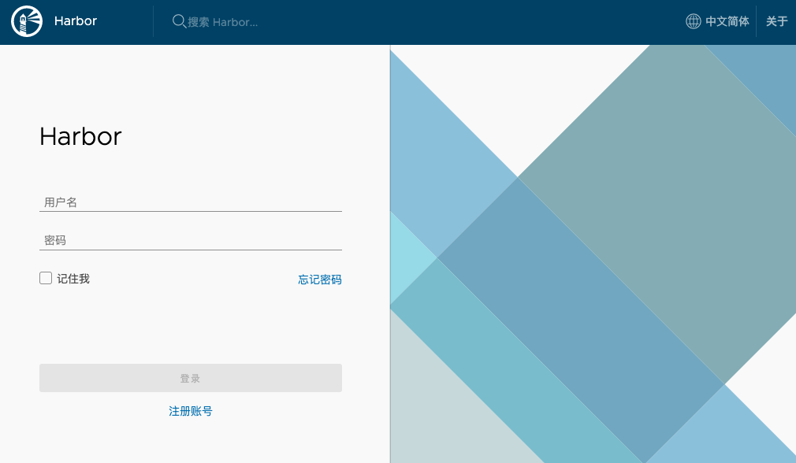

# Kubernetes 环境搭建

## 第 6 章 环境搭建（二进制）

### 6.1 准备环境

| 主机    | 服务 | 备注 |
| ------- | ---- | ---- |
| node-01 |      |      |
| node-02 |      |      |
| node-03 |      |      |
| node-04 |      |      |
| node-05 |      |      |

1. 关闭 SELinux 和 firewalld

   ```shell
   systemctl stop firewalld               #临时关闭
   
   systemctl disable firewalld            #永久关闭,即设置开机的时候不自动启动
   ```

   ```
   永久关闭selinux可以使用vi命令打开/etc/sysconfig/selinux 文件将SELINUXTYPE=(disable或permissive）
   ```

   永久关闭selinux可以使用vi命令打开/etc/sysconfig/selinux 文件将SELINUXTYPE=(disable或permissive）

2. 为全部服务器安装 epel-release 源

   ```shell
   yum install epel-release -y
   ```

3. 为全部服务器安装常用工具

   ```shell
   yum install wget telnet net-tools tree nmap sysstat lrzsz dos2unix bind-utils -y
   ```


### 6.2 DNS 服务初始化

#### 6.2.1 安装 bind9 软件

在 node-01 上执行命令

```shell
yum install bind -y
```

```shell
[root@node-01 ~]# rpm -qa bind
bind-9.11.4-9.P2.el7.x86_64
```


#### 6.2.2 配置 bind9

- 主配置文件

	```shell
	vi /etc/named.conf
	```

	```shell
	listen-on port 53 { 10.10.50.50; };
	allow-query     { any; };
	forwarders      { 10.10.50.1; };
	dnssec-enable no;
	dnssec-validation no;
	```

	​	检查配置, 没有保存就是 OK

	```shell
	name-checkconf
	```

- 区域配置文件

  ```shell
  vi /etc/named.rfc1912.zones 
  ```

  ```
  zone "host.com" IN {
          type master;
          file "host.com.zone";
          allow-update { 10.10.50.50; };
  };
  
  zone "thtf.com" IN {
          type master;
          file "thtf.com.zone";
          allow-update { 10.10.50.50; };
  };
  ```

- 区域数据文件

  ```shell
  vi  /var/named/host.com.zone
  ```

  ```
  $ORIGIN host.com.
  $TTL 600    ; 10 minutes
  @       IN SOA  dns.host.com. dnsadmin.host.com. (
                  2020032001 ; serial
                  10800      ; refresh (3 hours)
                  900        ; retry (15 minutes)
                  604800     ; expire (1 week)
                  86400      ; minimum (1 day)
                  )
              NS   dns.host.com.
  $TTL 60 ; 1 minute
  dns                A    10.10.50.50
  node-01            A    10.10.50.50           
  node-02            A    10.10.50.20
  node-03            A    10.10.50.233
  node-04            A    10.10.50.99
  node-05            A    10.10.50.40
  ```

  ```shell
  vi  /var/named/thtf.com.zone
  ```

  ```
  $ORIGIN thtf.com.
  $TTL 600    ; 10 minutes
  @           IN SOA  dns.thtf.com. dnsadmin.thtf.com. (
                  2020032001 ; serial
                  10800      ; refresh (3 hours)
                  900        ; retry (15 minutes)
                  604800     ; expire (1 week)
                  86400      ; minimum (1 day)
                  )
                  NS   dns.thtf.com.
  $TTL 60 ; 1 minute
  dns                A    10.10.50.50
  ```

  检查配置, 没有保存就是 OK

  ```shell
  named-checkconf
  ```

#### 6.2.3 启动 bind9

```shell
[root@node-01 ~]# systemctl start named
[root@node-01 ~]# netstat -lntup|grep 53
tcp        0      0 10.10.50.50:53          0.0.0.0:*               LISTEN      26226/named         
tcp        0      0 127.0.0.1:953           0.0.0.0:*               LISTEN      26226/named         
tcp6       0      0 :::53                   :::*                    LISTEN      26226/named         
tcp6       0      0 ::1:953                 :::*                    LISTEN      26226/named         
udp        0      0 10.10.50.50:53          0.0.0.0:*                           26226/named         
udp6       0      0 :::53                   :::*                                26226/named 
```


#### 6.2.4 检查 DNS 服务

```shell
[root@node-01 ~]# dig -t A node-01.host.com @10.10.50.50 +short
10.10.50.50
[root@node-01 ~]# dig -t A node-02.host.com @10.10.50.50 +short
10.10.50.20
[root@node-01 ~]# dig -t A node-03.host.com @10.10.50.50 +short
10.10.50.233
[root@node-01 ~]# dig -t A node-04.host.com @10.10.50.50 +short
10.10.50.99
[root@node-01 ~]# dig -t A node-05.host.com @10.10.50.50 +short
10.10.50.40
```


#### 6.2.5 配置 DNS 客户端

全部主机执行下面操作

```shell
vi /etc/sysconfig/network-scripts/ifcfg-eth0
DNS1=10.10.50.50
```
```shell
vi /etc/resolv.conf
search host.com
nameserver 10.10.50.50
```
```
systemctl restart network
```


### 6.3 准备签发证书环境

在 node-05 上

#### 6.3.1 安装 cfssl

```shell
wget https://pkg.cfssl.org/R1.2/cfssl_linux-amd64 -O /usr/bin/cfssl
wget https://pkg.cfssl.org/R1.2/cfssljson_linux-amd64 -O /usr/bin/cfssl-json
wget https://pkg.cfssl.org/R1.2/cfssl-certinfo_linux-amd64 -O /usr/bin/cfssl-certinfo
chmod +x /usr/bin/cfssl*
```

#### 6.3.2 创建生成ca证书csr的json配置文件

```shell
mkdir /opt/certs
vi  /opt/certs/ca-csr.json
```

```json
{
    "CN": "thtf",
    "hosts": [
    ],
    "key": {
        "algo": "rsa",
        "size": 2048
    },
    "names": [
        {
            "C": "CN",
            "ST": "beijing",
            "L": "beijing",
            "O": "thtf",
            "OU": "ops"
        }
    ],
    "ca": {
        "expiry": "175200h"
    }
}
```

> CN：Common Name, 浏览器使用该字段验证网站是否合法, 一般写的是域名。非常重要。
>
> C：Country, 国家
>
> ST：State, 州, 省
>
> L：Locality 地区 城市
>
> O： Organization Name 组织名称 公司名称
>
> OU：Organization Unit Name 组织单位名称 公司部门


#### 6.3.3 生成ca证书文件

```shell
[root@node-02 ~]# cd /opt/certs

[root@node-02 certs]# cfssl gencert -initca ca-csr.json | cfssl-json -bare ca
2020/04/14 10:53:46 [INFO] generating a new CA key and certificate from CSR
2020/04/14 10:53:46 [INFO] generate received request
2020/04/14 10:53:46 [INFO] received CSR
2020/04/14 10:53:46 [INFO] generating key: rsa-2048
2020/04/14 10:53:46 [INFO] encoded CSR
2020/04/14 10:53:46 [INFO] signed certificate with serial number 35390055852589240424773939585539235500209661940
[root@node-02 certs]# ll
总用量 16
-rw-r--r-- 1 root root  989 4月  14 10:53 ca.csr
-rw-r--r-- 1 root root  325 4月  14 10:53 ca-csr.json
-rw------- 1 root root 1675 4月  14 10:53 ca-key.pem
-rw-r--r-- 1 root root 1338 4月  14 10:53 ca.pem
```


### 6.4 部署 docker

node-03 node-04 node-05上

#### 6.4.1 安装

```shell
curl -fsSL https://get.docker.com | bash -s docker --mirror Aliyun
```

#### 6.4.2 配置

```shell
mkdir  /etc/docker
vi  /etc/docker/daemon.json
```

```json
{
  "graph": "/data/docker",
  "storage-driver": "overlay2",
  "insecure-registries": ["registry.access.redhat.com","quay.io","harbor.thtf.com"],
  "registry-mirrors": ["https://q2gr04ke.mirror.aliyuncs.com"],
  "bip": "172.7.21.1/24",
  "exec-opts": ["native.cgroupdriver=systemd"],
  "live-restore": true
}
##########
bip要根据宿主机ip变化 
```

#### 6.4.3 启动

```shell
mkdir -p /data/docker
systemctl start docker
systemctl enable docker
l
```


### 6.5 部署私有仓库 harbor

在 node-05 上

#### 6.5.1 下载软件并解压


harbor官网github地址 https://github.com/goharbor/harbor

```shell
tar xf harbor-offline-installer-v1.8.3.tgz -C /opt/
mv harbor/ harbor-v1.8.3
ln -s /opt/harbor-v1.8.3/ /opt/harbor
```

```
lrwxrwxrwx 1 root root  19 4月  14 12:13 harbor -> /opt/harbor-v1.8.3/
drwxr-xr-x 2 root root 100 4月  14 12:12 harbor-v1.8.3
drwxr-xr-x 2 root root  49 4月  14 12:13 install_package
```


#### 6.5.2 配置

```shell
mkdir -p /data/harbor/logs
vi /opt/harbor/harbor.yml
```

修改配置：

```yml
hostname: harbor.thtf.com
http:
  port: 180
 harbor_admin_password:Harbor12345
data_volume: /data/harbor
log:
    level:  info
    rotate_count:  50
    rotate_size:200M
    location: /data/harbor/logs
```

#### 6.5.3 安装 docker-compose

```shell
yum install docker-compose -y
```

#### 6.5.4 安装 harbor

```shell
# 进入 harbor 根目录
[root@node-05 harbor]# ll
总用量 569632
-rw-r--r-- 1 root root 583269670 9月  16 2019 harbor.v1.8.3.tar.gz
-rw-r--r-- 1 root root      4528 4月  14 12:19 harbor.yml
-rwxr-xr-x 1 root root      5088 9月  16 2019 install.sh
-rw-r--r-- 1 root root     11347 9月  16 2019 LICENSE
-rwxr-xr-x 1 root root      1654 9月  16 2019 prepare
[root@node-05 harbor]# ./install.sh 
```

#### 6.5.5 检查 harbor 启动情况

```shell
[root@node-05 harbor]# docker-compose ps
      Name                     Command               State             Ports          
--------------------------------------------------------------------------------------
harbor-core         /harbor/start.sh                 Up                               
harbor-db           /entrypoint.sh postgres          Up      5432/tcp                 
harbor-jobservice   /harbor/start.sh                 Up                               
harbor-log          /bin/sh -c /usr/local/bin/ ...   Up      127.0.0.1:1514->10514/tcp
harbor-portal       nginx -g daemon off;             Up      80/tcp                   
nginx               nginx -g daemon off;             Up      0.0.0.0:180->80/tcp      
redis               docker-entrypoint.sh redis ...   Up      6379/tcp                 
registry            /entrypoint.sh /etc/regist ...   Up      5000/tcp                 
registryctl         /harbor/start.sh                 Up                               
[root@node-05 harbor]# docker ps -a
CONTAINER ID        IMAGE                                               COMMAND                  CREATED             STATUS                             PORTS                       NAMES
118479faae3c        goharbor/nginx-photon:v1.8.3                        "nginx -g 'daemon of…"   27 seconds ago      Up 25 seconds (health: starting)   0.0.0.0:180->80/tcp         nginx
a01be83050a8        goharbor/harbor-portal:v1.8.3                       "nginx -g 'daemon of…"   28 seconds ago      Up 26 seconds (health: starting)   80/tcp                      harbor-portal
bd00d3fa85cc        goharbor/harbor-jobservice:v1.8.3                   "/harbor/start.sh"       28 seconds ago      Up 26 seconds                                                  harbor-jobservice
30e39e116f97        goharbor/harbor-core:v1.8.3                         "/harbor/start.sh"       29 seconds ago      Up 27 seconds (health: starting)                               harbor-core
3ecf74bd9a7b        goharbor/redis-photon:v1.8.3                        "docker-entrypoint.s…"   30 seconds ago      Up 28 seconds                      6379/tcp                    redis
9acf04233a0d        goharbor/harbor-db:v1.8.3                           "/entrypoint.sh post…"   30 seconds ago      Up 28 seconds (health: starting)   5432/tcp                    harbor-db
0795ebef5a5d        goharbor/harbor-registryctl:v1.8.3                  "/harbor/start.sh"       30 seconds ago      Up 28 seconds (health: starting)                               registryctl
e36367cf43e8        goharbor/registry-photon:v2.7.1-patch-2819-v1.8.3   "/entrypoint.sh /etc…"   30 seconds ago      Up 28 seconds (health: starting)   5000/tcp                    registry
33d5234e3edf        goharbor/harbor-log:v1.8.3                          "/bin/sh -c /usr/loc…"   31 seconds ago      Up 29 seconds (health: starting)   127.0.0.1:1514->10514/tcp   harbor-log

```


#### 6.5.6 配置 harbor 的 dns 内网解析

在 node-01 上

```shell
vi /var/named/thtf.com.zone
```

```
$ORIGIN thtf.com.
$TTL 600    ; 10 minutes
@           IN SOA  dns.thtf.com. dnsadmin.thtf.com. (
                2020032002 ; serial
                10800      ; refresh (3 hours)
                900        ; retry (15 minutes)
                604800     ; expire (1 week)
                86400      ; minimum (1 day)
                )
                NS   dns.thtf.com.
$TTL 60 ; 1 minute
dns                A    10.10.50.50
harbor             A    10.10.50.40
```

> 2020032002 ; serial 前滚一个序号
>
> harbor             A    10.10.50.40

重启 named

```shell
systemctl restart named
```

检查

```shell
[root@node-01 ~]# dig -t A harbor.thtf.com +short
10.10.50.40
```

#### 6.5.6 安装 Nginx 并配置

在 node-05 上

```shell
yum install nginx -y
```

修改配置文件

 ```shell
vi /etc/nginx/conf.d/harbor.thtf.com.conf
 ```

```
server {
    listen       80;
    server_name  harbor.thtf.com;

    client_max_body_size 1000m;

    location / {
        proxy_pass http://127.0.0.1:180;
    }
}
```

```shell
[root@node-05 harbor]# nginx -t
nginx: the configuration file /etc/nginx/nginx.conf syntax is ok
nginx: configuration file /etc/nginx/nginx.conf test is successful
[root@node-05 harbor]# systemctl start nginx
[root@node-05 harbor]# systemctl enable nginx
Created symlink from /etc/systemd/system/multi-user.target.wants/nginx.service to /usr/lib/systemd/system/nginx.service.
```


#### 6.5.7 测试


1. 浏览器输入：harbor.thtf.com 




2. 输入用户名：admin 密码：Harbor12345

   

   

3. 新建项目：public 访问级别：公开

   

   

   

4. 下载镜像并给镜像打 tag

   ```shell
   [root@node-05 harbor]# docker pull nginx:1.7.9
   1.7.9: Pulling from library/nginx
   Image docker.io/library/nginx:1.7.9 uses outdated schema1 manifest format. Please upgrade to a schema2 image for better future compatibility. More information at https://docs.docker.com/registry/spec/deprecated-schema-v1/
   a3ed95caeb02: Pull complete 
   6f5424ebd796: Pull complete 
   d15444df170a: Pull complete 
   e83f073daa67: Pull complete 
   a4d93e421023: Pull complete 
   084adbca2647: Pull complete 
   c9cec474c523: Pull complete 
   Digest: sha256:e3456c851a152494c3e4ff5fcc26f240206abac0c9d794affb40e0714846c451
   Status: Downloaded newer image for nginx:1.7.9
   docker.io/library/nginx:1.7.9
   [root@node-05 harbor]# docker images|grep nginx
   goharbor/nginx-photon           v1.8.3                     3a016e0dc7de        7 months ago        37MB
   nginx                           1.7.9                      84581e99d807        5 years ago         91.7MB
   [root@node-05 harbor]# docker tag 84581e99d807 harbor.thtf.com/public/nginx:v1.7.9
   [root@node-05 harbor]# docker images|grep nginx
   goharbor/nginx-photon           v1.8.3           vi vi           3a016e0dc7de        7 months ago        37MB
   nginx                           1.7.9                      84581e99d807        5 years ago         91.7MB
   harbor.thtf.com/public/nginx     v1.7.9                     84581e99d807        5 years ago         91.7MB
   
   ```

   

5. 登录 harbor 并上传仓库

   ```shell
   [root@node-05 harbor]# docker login harbor.thtf.com
   Authenticating with existing credentials...
   WARNING! Your password will be stored unencrypted in /root/.docker/config.json.
   Configure a credential helper to remove this warning. See
   https://docs.docker.com/engine/reference/commandline/login/#credentials-store
   
   Login Succeeded
   
   [root@node-05 harbor]# docker push harbor.thtf.com/public/nginx:v1.7.9
   The push refers to repository [harbor.thtf.com/public/nginx]
   5f70bf18a086: Pushed 
   4b26ab29a475: Pushed 
   ccb1d68e3fb7: Pushed 
   e387107e2065: Pushed 
   63bf84221cce: Pushed 
   e02dce553481: Pushed 
   dea2e4984e29: Pushed 
   v1.7.9: digest: sha256:b1f5935eb2e9e2ae89c0b3e2e148c19068d91ca502e857052f14db230443e4c2 size: 3012
   
   ```

   可以看到NGINX镜像已经上传到public下

   


### 6.6 部署 master 节点

#### 6.6.1 部署 etch 集群

##### 1）集群架构

| 主机名  | 角色   | IP           |
| ------- | ------ | ------------ |
| node-02 | lead   | 10.10.50.20  |
| node-03 | follow | 10.10.50.233 |
| node-04 | follow | 10.10.50.99  |

##### 2）创建基于根证书的config配置文件

在 node-05 上

```shell
vi /opt/certs/ca-config.json
```

```
{
    "signing": {
        "default": {
            "expiry": "175200h"
        },
        "profiles": {
            "server": {
                "expiry": "175200h",
                "usages": [
                    "signing",
                    "key encipherment",
                    "server auth"
                ]
            },
            "client": {
                "expiry": "175200h",
                "usages": [
                    "signing",
                    "key encipherment",
                    "client auth"
                ]
            },
            "peer": {
                "expiry": "175200h",
                "usages": [
                    "signing",
                    "key encipherment",
                    "server auth",
                    "client auth"
                ]
            }
        }
    }
} 
```

##### 3）创建生成自签发证书的csr的json配置文件

```shell
vi /opt/certs/etcd-peer-csr.json
```

```
{
    "CN": "k8s-etcd",
    "hosts": [
        "10.10.50.50",
        "10.10.50.20",
        "10.10.50.233",
        "10.10.50.99"
    ],
    "key": {
        "algo": "rsa",
        "size": 2048
    },
    "names": [
        {
            "C": "CN",
            "ST": "beijing",
            "L": "beijing",
            "O": "thtf",
            "OU": "ops"
        }
    ]
}
```

##### 4）生成 etch 证书文件

```shell
[root@node-05 ~]# cd /opt/certs/
[root@node-05 certs]# cfssl gencert -ca=ca.pem -ca-key=ca-key.pem -config=ca-config.json -profile=peer etcd-peer-csr.json |cfssl-json -bare etcd-pee
```
##### 5）检查生成的证书

```shell
[root@node-05 certs]# ll
总用量 36
-rw-r--r-- 1 root root  837 4月  14 15:56 ca-config.json
-rw-r--r-- 1 root root  989 4月  14 15:54 ca.csr
-rw-r--r-- 1 root root  325 4月  14 15:54 ca-csr.json
-rw------- 1 root root 1679 4月  14 15:54 ca-key.pem
-rw-r--r-- 1 root root 1338 4月  14 15:54 ca.pem
-rw-r--r-- 1 root root 1066 4月  14 16:02 etcd-peer.csr
-rw-r--r-- 1 root root  374 4月  14 16:01 etcd-peer-csr.json
-rw------- 1 root root 1675 4月  14 16:02 etcd-peer-key.pem
-rw-r--r-- 1 root root 1428 4月  14 16:02 etcd-peer.pem
```

##### 6）创建 etch 用户

在 node-02 上

```shell
[root@node-02 opt]# useradd -s /sbin/nologin -M etcd
```

##### 7）下载 etcd 软件, 解压, 做软连接

下载地址：https://github.com/etcd-io/etcd/tags 这里选择 3.1.20 版本

```shell
[root@node-02 opt]# tar -zxvf etcd-v3.1.20-linux-amd64.tar.gz -C /opt
[root@node-02 opt]# mv etcd-v3.1.20-linux-amd64/ etcd-v3.1.20
[root@node-02 opt]# ln -s /opt/etcd-v3.1.20/ /opt/etcd
[root@node-02 opt]# ll
总用量 0
drwxr-xr-x 2 root   root   71 4月  14 10:53 certs
lrwxrwxrwx 1 root   root   18 4月  14 17:05 etcd -> /opt/etcd-v3.1.20/
drwxr-xr-x 3 478493 89939 123 10月 11 2018 etcd-v3.1.20
drwxr-xr-x 2 root   root    6 4月  14 10:32 soft
```

##### 8）创建目录, 拷贝证书文件

```shell
[root@node-02 opt]# mkdir -p /opt/etcd/certs /data/etcd /data/logs/etcd-server
```

```shell
[root@node-02 opt]# cd etcd/certs/
[root@node-02 certs]# scp node-05:/opt/certs/ca.pem .
[root@node-02 certs]# scp node-05:/opt/certs/etcd-peer.pem .
[root@node-02 certs]# scp node-05:/opt/certs/etcd-peer-key.pem .
```

##### 9）创建 etcd 服务启动脚本

```shell
vi /opt/etcd/etcd-server-startup.sh
```

```sh
#!/bin/sh
./etcd --name etcd-server-node-02 \
       --data-dir /data/etcd/etcd-server \
       --listen-peer-urls https://10.10.50.20:2380 \
       --listen-client-urls https://10.10.50.20:2379,http://127.0.0.1:2379 \
       --quota-backend-bytes 8000000000 \
       --initial-advertise-peer-urls https://10.10.50.20:2380 \
       --advertise-client-urls https://10.10.50.20:2379,http://127.0.0.1:2379 \
       --initial-cluster  etcd-server-node-02=https://10.10.50.20:2380,etcd-server-node-03=https://10.10.50.233:2380,etcd-server-node-04=https://10.10.50.99:2380 \
       --ca-file ./certs/ca.pem \
       --cert-file ./certs/etcd-peer.pem \
       --key-file ./certs/etcd-peer-key.pem \
       --client-cert-auth  \
       --trusted-ca-file ./certs/ca.pem \
       --peer-ca-file ./certs/ca.pem \
       --peer-cert-file ./certs/etcd-peer.pem \
       --peer-key-file ./certs/etcd-peer-key.pem \
       --peer-client-cert-auth \
       --peer-trusted-ca-file ./certs/ca.pem \
       --log-output stdout

```

```shell
[root@node-02 ~]# chmod +x /opt/etcd/etcd-server-startup.sh
```

##### 10）授权目录权限

```shell
[root@node-02 ~]# chown -R etcd.etcd /opt/etcd-v3.1.20/ /data/etcd/ /data/logs/etcd-server/
```

##### 11）安装 supervisor 软件

```shell
[root@node-02 ~]# yum install supervisor -y
[root@node-02 ~]# systemctl start supervisord
[root@node-02 ~]# systemctl enable supervisord
```

##### 12）创建 supervisor 配置

```shell
[root@node-02 ~]# vi /etc/supervisord.d/etcd-server.ini
```

```ini
[program:etcd-server-node-02]
command=/opt/etcd/etcd-server-startup.sh                        ; the program (relative uses PATH, can take args)
numprocs=1                                                      ; number of processes copies to start (def 1)
directory=/opt/etcd                                             ; directory to cwd to before exec (def no cwd)
autostart=true                                                  ; start at supervisord start (default: true)
autorestart=true                                                ; retstart at unexpected quit (default: true)
startsecs=30                                                    ; number of secs prog must stay running (def. 1)
startretries=3                                                  ; max # of serial start failures (default 3)
exitcodes=0,2                                                   ; 'expected' exit codes for process (default 0,2)
stopsignal=QUIT                                                 ; signal used to kill process (default TERM)
stopwaitsecs=10                                                 ; max num secs to wait b4 SIGKILL (default 10)
user=etcd                                                       ; setuid to this UNIX account to run the program
redirect_stderr=true                                            ; redirect proc stderr to stdout (default false)
stdout_logfile=/data/logs/etcd-server/etcd.stdout.log           ; stdout log path, NONE for none; default AUTO
stdout_logfile_maxbytes=64MB                                    ; max # logfile bytes b4 rotation (default 50MB)
stdout_logfile_backups=4                                        ; # of stdout logfile backups (default 10)
stdout_capture_maxbytes=1MB                                     ; number of bytes in 'capturemode' (default 0)
stdout_events_enabled=false                                     ; emit events on stdout writes (default false)
```

##### 13）启动 etcd 服务

```shell
[root@node-02 certs]# supervisorctl update
[root@node-02 certs]# supervisorctl status
etcd-server-node-02              RUNNING   pid 5488, uptime 0:01:03
```

```shell
[root@node-02 certs]# netstat -lntup|grep etcd
tcp        0      0 10.10.50.99:2379        0.0.0.0:*               LISTEN      27058/./etcd        
tcp        0      0 127.0.0.1:2379          0.0.0.0:*               LISTEN      27058/./etcd        
tcp        0      0 10.10.50.99:2380        0.0.0.0:*               LISTEN      27058/./etcd
```


##### 同理：在 node-03 node-04 上安装 etcd

重复 6~ 13 步骤。

不同的地方：

```shell
opt/etcd/etcd-server-startup.sh
##########
--name
--listen-peer-urls
--listen-client-urls
--initial-advertise-peer-urls
--advertise-client-urls
##########
/etc/supervisord.d/etcd-server.ini
[program:etcd-server-node-xx]
```


##### 检查集群状态

```shell
[root@node-03 etcd]# ./etcdctl  cluster-health
member 7d027ad4e297952d is healthy: got healthy result from http://127.0.0.1:2379
member 804d7a56c0ba452b is healthy: got healthy result from http://127.0.0.1:2379
member a9bfb00ec3d05a41 is healthy: got healthy result from http://127.0.0.1:2379
cluster is healthy
[root@node-03 etcd]# ./etcdctl member list
7d027ad4e297952d: name=etcd-server-node-02 peerURLs=https://10.10.50.20:2380 clientURLs=http://127.0.0.1:2379,https://10.10.50.20:2379 isLeader=false
804d7a56c0ba452b: name=etcd-server-node-03 peerURLs=https://10.10.50.233:2380 clientURLs=http://127.0.0.1:2379,https://10.10.50.233:2379 isLeader=false
a9bfb00ec3d05a41: name=etcd-server-node-04 peerURLs=https://10.10.50.99:2380 clientURLs=http://127.0.0.1:2379,https://10.10.50.99:2379 isLeader=true
```


#### 6.6.2 部署 kube-apiserver 集群

##### 1）集群架构

| 主机名  | 角色           | IP           |
| ------- | -------------- | ------------ |
| node-03 | kube-apiserver | 10.10.50.233 |
| node-04 | kube-apiserver | 10.10.50.99  |

##### 2）下载 kube-apiserver 软件, 解压, 做软连接

下载地址：https://github.com/kubernetes/kubernetes/releases/tag/v1.15.2

备用地址：https://storage.googleapis.com/kubernetes-release/release/v1.15.2/kubernetes-server-linux-amd64.tar.gzclear

```shell
[root@node-03 ~]# tar -zxvf kubernetes-server-linux-amd64.tar.gz -C /opt
[root@node-03 ~]# cd /opt/
[root@node-03 opt]# mv kubernetes/ kubernetes-v1.15.2
[root@node-03 opt]# ln -s /opt/kubernetes-v1.15.2/ /opt/kubernetes
[root@node-03 opt]# cd kubernetes
[root@node-03 kubernetes]# rm -rf kubernetes-src.tar.gz 
[root@node-03 kubernetes]# cd server/bin/
[root@node-03 bin]# rm -rf *.tar
[root@node-03 bin]# rm -rf *_tag
```

##### 3）签发 client 证书

在 node-05 上

1. 创建生成证书 csr 的 json 配置文件

```shell
vi /opt/certs/client-csr.json
```

```json
{
    "CN": "k8s-node",
    "hosts": [
    ],
    "key": {
        "algo": "rsa",
        "size": 2048
    },
    "names": [
        {
            "C": "CN",
            "ST": "beijing",
            "L": "beijing",
            "O": "thtf",
            "OU": "ops"
        }
    ]
}
```

2. 生成 client 证书文件

   ```shell
   [root@node-05 certs]# cfssl gencert -ca=ca.pem -ca-key=ca-key.pem -config=ca-config.json -profile=client client-csr.json |cfssl-json -bare client
   ```

3. 检查生成的证书文件

   ```shell
   [root@node-05 certs]# ll
   -rw-r--r-- 1 root root  997 4月  14 19:00 client.csr
   -rw-r--r-- 1 root root  282 4月  14 18:59 client-csr.json
   -rw------- 1 root root 1679 4月  14 19:00 client-key.pem
   -rw-r--r-- 1 root root 1363 4月  14 19:00 client.pem
   ```

##### 4）签发 kube-apiserver 证书

在 node-05 上

1. 创建生成证书 csr 的 json 配置文件

   ```shell
   vi /opt/certs/apiserver-csr.json
   ```

   ```json
   {
       "CN": "k8s-apiserver",
       "hosts": [
           "127.0.0.1",
           "192.168.0.1",
           "kubernetes.default",
           "kubernetes.default.svc",
           "kubernetes.default.svc.cluster",
           "kubernetes.default.svc.cluster.local",
           "10.10.50.50",
           "10.10.50.233",
           "10.10.50.99",
           "10.10.50.10"
       ],
       "key": {
           "algo": "rsa",
           "size": 2048
       },
       "names": [
           {
               "C": "CN",
               "ST": "beijing",
               "L": "beijing",
               "O": "thtf",
               "OU": "ops"
           }
       ]
   }
   ```
```
   
2. 生成 kube-apiserver 证书文件
   
      ```shell
      [root@node-05 certs]# cfssl gencert -ca=ca.pem -ca-key=ca-key.pem -config=ca-config.json -profile=server apiserver-csr.json |cfssl-json -bare apiserver
```

3. 检查证书文件
   
      ```shell
      [root@node-05 certs]# ll
      总用量 68
      -rw-r--r-- 1 root root 1245 4月  14 19:13 apiserver.csr
      -rw-r--r-- 1 root root  554 4月  14 19:12 apiserver-csr.json
      -rw------- 1 root root 1675 4月  14 19:13 apiserver-key.pem
      -rw-r--r-- 1 root root 1590 4月  14 19:13 apiserver.pem
      ```


##### 5）拷贝证书文件到各个节点, 并创建配置

   1. 拷贝证书文件到 /opt/kubernetes/server/bin/certs 目录下

      ```shell
      [root@node-04 bin]# mkdir certs
      [root@node-04 certs]# scp node-05:/opt/certs/ca.pem .
      [root@node-04 certs]# scp node-05:/opt/certs/ca-key.pem .
      [root@node-04 certs]# scp node-05:/opt/certs/client.pem .
      [root@node-04 certs]# scp node-05:/opt/certs/client-key.pem .
      [root@node-04 certs]# scp node-05:/opt/certs/apiserver.pem .
      [root@node-04 certs]# scp node-05:/opt/certs/apiserver-key.pem .
      
      ```

   2. 创建配置

      ```shell
      [root@node-04 bin]# mkdir conf
      [root@node-04 bin]# cd conf/
      [root@node-04 conf]# vi audit.yaml
      ```

      ```yaml
      apiVersion: audit.k8s.io/v1beta1 # This is required.
      kind: Policy
      # Don't generate audit events for all requests in RequestReceived stage.
      omitStages:
        - "RequestReceived"
      rules:
        # Log pod changes at RequestResponse level
        - level: RequestResponse
          resources:
          - group: ""
            # Resource "pods" doesn't match requests to any subresource of pods,
            # which is consistent with the RBAC policy.
            resources: ["pods"]
        # Log "pods/log", "pods/status" at Metadata level
        - level: Metadata
          resources:
          - group: ""
            resources: ["pods/log", "pods/status"]
      
        # Don't log requests to a configmap called "controller-leader"
        - level: None
          resources:
          - group: ""
            resources: ["configmaps"]
            resourceNames: ["controller-leader"]
      
        # Don't log watch requests by the "system:kube-proxy" on endpoints or services
        - level: None
          users: ["system:kube-proxy"]
          verbs: ["watch"]
          resources:
          - group: "" # core API group
            resources: ["endpoints", "services"]
      
        # Don't log authenticated requests to certain non-resource URL paths.
        - level: None
          userGroups: ["system:authenticated"]
          nonResourceURLs:
          - "/api*" # Wildcard matching.
          - "/version"
      
        # Log the request body of configmap changes in kube-system.
        - level: Request
          resources:
          - group: "" # core API group
            resources: ["configmaps"]
          # This rule only applies to resources in the "kube-system" namespace.
          # The empty string "" can be used to select non-namespaced resources.
          namespaces: ["kube-system"]
      
        # Log configmap and secret changes in all other namespaces at the Metadata level.
        - level: Metadata
          resources:
          - group: "" # core API group
            resources: ["secrets", "configmaps"]
      
        # Log all other resources in core and extensions at the Request level.
        - level: Request
          resources:
          - group: "" # core API group
          - group: "extensions" # Version of group should NOT be included.
      
        # A catch-all rule to log all other requests at the Metadata level.
        - level: Metadata
          # Long-running requests like watches that fall under this rule will not
          # generate an audit event in RequestReceived.
          omitStages:
            - "RequestReceived"
      ```

      ##### 5）创建 apiserver 启动脚本

      ```shell
      [root@node-04 bin]# vi /opt/kubernetes/server/bin/kube-apiserver.sh
      ```

      ```shell
      #!/bin/bash
      ./kube-apiserver \
        --apiserver-count 2 \
        --audit-log-path /data/logs/kubernetes/kube-apiserver/audit-log \
        --audit-policy-file ./conf/audit.yaml \
        --authorization-mode RBAC \
        --client-ca-file ./certs/ca.pem \
        --requestheader-client-ca-file ./cert/ca.pem \
        --enable-admission-plugins NamespaceLifecycle,LimitRanger,ServiceAccount,DefaultStorageClass,DefaultTolerationSeconds,MutatingAdmissionWebhook,ValidatingAdmissionWebhook,ResourceQuota \
        --etcd-cafile ./certs/ca.pem \
        --etcd-certfile ./certs/client.pem \
        --etcd-keyfile ./certs/client-key.pem \
        --etcd-servers https://10.10.50.20:2379,https://10.10.50.233:2379,https://10.10.50.99:2379 \
        --service-account-key-file ./certs/ca-key.pem \
        --service-cluster-ip-range 192.168.0.0/16 \
        --service-node-port-range 3000-29999 \
        --target-ram-mb=1024 \
        --kubelet-client-certificate ./certs/client.pem \
        --kubelet-client-key ./certs/client-key.pem \
        --log-dir  /data/logs/kubernetes/kube-apiserver \
        --tls-cert-file ./certs/apiserver.pem \
        --tls-private-key-file ./certs/apiserver-key.pem \
        --v 2
      ```

##### 6）授权和创建目录

      ```shell
      [root@node-04 bin]# chmod +x kube-apiserver.sh
      [root@node-04 bin]# mkdir -p /data/logs/kubernetes/kube-apiserver
      ```

##### 7）创建 supervisor 配置

      ```shell
vi /etc/supervisord.d/kube-apiserver.ini
      ```

```ini
[program:kube-apiserver-7-21]
command=/opt/kubernetes/server/bin/kube-apiserver.sh            ; the program (relative uses PATH, can take args)
numprocs=1                                                      ; number of processes copies to start (def 1)
directory=/opt/kubernetes/server/bin                            ; directory to cwd to before exec (def no cwd)
autostart=true                                                  ; start at supervisord start (default: true)
autorestart=true                                                ; retstart at unexpected quit (default: true)
startsecs=30                                                    ; number of secs prog must stay running (def. 1)
startretries=3                                                  ; max # of serial start failures (default 3)
exitcodes=0,2                                                   ; 'expected' exit codes for process (default 0,2)
stopsignal=QUIT                                                 ; signal used to kill process (default TERM)
stopwaitsecs=10                                                 ; max num secs to wait b4 SIGKILL (default 10)
user=root                                                       ; setuid to this UNIX account to run the program
redirect_stderr=true                                            ; redirect proc stderr to stdout (default false)
stdout_logfile=/data/logs/kubernetes/kube-apiserver/apiserver.stdout.log        ; stderr log path, NONE for none; default AUTO
stdout_logfile_maxbytes=64MB                                    ; max # logfile bytes b4 rotation (default 50MB)
stdout_logfile_backups=4                                        ; # of stdout logfile backups (default 10)
stdout_capture_maxbytes=1MB                                     ; number of bytes in 'capturemode' (default 0)
stdout_events_enabled=false                                     ; emit events on stdout writes (default false)
```

##### 8）启动服务并检测

```shell
[root@node-04 bin]# supervisorctl update
kube-apiserver-node-04: added process group
[root@node-04 bin]# supervisorctl status
etcd-server-node-04              RUNNING   pid 27057, uptime 1:34:08
kube-apiserver-node-04           STARTING  
[root@node-04 bin]# netstat -nltup|grep kube-api
tcp        0      0 127.0.0.1:8080          0.0.0.0:*               LISTEN      32456/./kube-apiser 
tcp6       0      0 :::6443                 :::*                    LISTEN      32456/./kube-apiser 

```

##### 同理, 在 node-03 上完成 2~8 步骤

不同的地方：

```shell
vi /etc/supervisord.d/kube-apiserver.ini
[program:kube-apiserver-node-03]
```


#### 6.6.3 部署四层反向代理

##### 1）集群架构

| 主机名  | 角色 | IP 地址     | VIP 地址    |
| ------- | ---- | ----------- | ----------- |
| node-01 | L4   | 10.10.50.50 | 10.50.50.xx |
| node-02 | L4   | 10.10.50.20 | 10.10.50.xx |

##### 2）安装 Nginx 和 Keepalived

在 node-01 和 node-02 上都安装 Nginx 和 Keepalived

```shell
yum install nginx keepalived -y
```

在 node-01 和 node-02 上配置 Nginx 

```shell
vi /etc/nginx/nginx.conf
```

```
# 加在配置文件末尾
stream {
    upstream kube-apiserver {
        server 10.10.50.233:6443     max_fails=3 fail_timeout=30s;
        server 10.10.50.99:6443     max_fails=3 fail_timeout=30s;
    }
    server {
        listen 7443;
        proxy_connect_timeout 2s;
        proxy_timeout 900s;
        proxy_pass kube-apiserver;
    }
}
```

在 node-01 和 node-02 上配置 keepalived

```shell
# 检测脚本
vi /etc/keepalived/check_port.sh
```

```shell
#!/bin/bash
#keepalived 监控端口脚本
#使用方法：
#在keepalived的配置文件中
#vrrp_script check_port {#创建一个vrrp_script脚本,检查配置
#    script "/etc/keepalived/check_port.sh 6379" #配置监听的端口
#    interval 2 #检查脚本的频率,单位（秒）
#}
CHK_PORT=$1
if [ -n "$CHK_PORT" ];then
        PORT_PROCESS=`ss -lnt|grep $CHK_PORT|wc -l`
        if [ $PORT_PROCESS -eq 0 ];then
                echo "Port $CHK_PORT Is Not Used,End."
                exit 1
        fi
else
        echo "Check Port Cant Be Empty!"
fi
```

修改执行权限

```shell
chmod +x /etc/keepalived/check_port.sh
```

keepalived 主配置 node-01

```shell
[root@node-01 ~]# vi /etc/keepalived/keepalived.conf
```

```
! Configuration File for keepalived

global_defs {
   router_id 10.10.50.50

}

vrrp_script chk_nginx {
    script "/etc/keepalived/check_port.sh 7443"
    interval 2
    weight -20
}

vrrp_instance VI_1 {
    state MASTER
    interface eth0
    virtual_router_id 251
    priority 100
    advert_int 1
    mcast_src_ip 10.10.50.50
    nopreempt

    authentication {
        auth_type PASS
        auth_pass 11111111
    }
    track_script {
         chk_nginx
    }
    virtual_ipaddress {
        10.10.50.10
    }
}
```

keepalived 从配置 node-02

```shell
[root@node-02 ~]# vi /etc/keepalived/keepalived.conf 
```

```
! Configuration File for keepalived
global_defs {
    router_id 10.10.50.20
}
vrrp_script chk_nginx {
    script "/etc/keepalived/check_port.sh 7443"
    interval 2
    weight -20
}
vrrp_instance VI_1 {
    state BACKUP
    interface eth0 #### 这里的网卡名称需要和主机保持一致
    virtual_router_id 251
    mcast_src_ip 10.10.50.20
    priority 90
    advert_int 1
    authentication {
        auth_type PASS
        auth_pass 11111111
    }
    track_script {
        chk_nginx
    }
    virtual_ipaddress {
        10.10.50.10
    }
}
```

##### 3）启动代理并检查

```shell
systemctl start nginx keepalived
systemctl enable nginx keepalived
netstat -lntup|grep nginx
```

```shell
[root@node-01 ~]# ip addr
1: lo: <LOOPBACK,UP,LOWER_UP> mtu 65536 qdisc noqueue state UNKNOWN group default qlen 1000
    link/loopback 00:00:00:00:00:00 brd 00:00:00:00:00:00
    inet 127.0.0.1/8 scope host lo
       valid_lft forever preferred_lft forever
    inet6 ::1/128 scope host 
       valid_lft forever preferred_lft forever
2: enp0s3: <BROADCAST,MULTICAST,UP,LOWER_UP> mtu 1500 qdisc pfifo_fast state UP group default qlen 1000
    link/ether 08:00:27:1c:87:23 brd ff:ff:ff:ff:ff:ff
    inet 10.10.50.50/24 brd 10.10.50.255 scope global noprefixroute dynamic enp0s3
       valid_lft 83981sec preferred_lft 83981sec
    inet 10.10.50.10/32 scope global enp0s3
       valid_lft forever preferred_lft forever
    inet6 fe80::311e:9caf:bb5:e825/64 scope link noprefixroute 
       valid_lft forever preferred_lft forever
```


#### 6.6.4 部署 controller-manager 集群

##### 1）集群架构

| 主机名  | 角色               | IP地址       |
| ------- | ------------------ | ------------ |
| node-03 | controller-manager | 10.10.50.233 |
| node-04 | controller-manager | 10.10.50.99  |

接下来, 以 node-03 为例

##### 2）创建启动脚本

```shell
[root@node-03 ~]# vi /opt/kubernetes/server/bin/kube-controller-manager.sh
```

```shell
#!/bin/sh
./kube-controller-manager \
  --cluster-cidr 172.7.0.0/16 \
  --leader-elect true \
  --log-dir /data/logs/kubernetes/kube-controller-manager \
  --master http://127.0.0.1:8080 \
  --service-account-private-key-file ./certs/ca-key.pem \
  --service-cluster-ip-range 192.168.0.0/16 \
  --root-ca-file ./certs/ca.pem \
  --v 2 
```

##### 3）授权文件权限, 创建目录

```shell
[root@node-03 ~]# chmod +x /opt/kubernetes/server/bin/kube-controller-manager.sh 
[root@node-03 ~]# mkdir -p /data/logs/kubernetes/kube-controller-manager
```

##### 4）创建 supervisor 配置

```shell
[root@node-03 ~]# vi /etc/supervisord.d/kube-conntroller-manager.ini
```

```shell
[program:kube-controller-manager-node-03]
command=/opt/kubernetes/server/bin/kube-controller-manager.sh                     ; the program (relative uses PATH, can take args)
numprocs=1                                                                        ; number of processes copies to start (def 1)
directory=/opt/kubernetes/server/bin                                              ; directory to cwd to before exec (def no cwd)
autostart=true                                                                    ; start at supervisord start (default: true)
autorestart=true                                                                  ; retstart at unexpected quit (default: true)
startsecs=30                                                                      ; number of secs prog must stay running (def. 1)
startretries=3                                                                    ; max # of serial start failures (default 3)
exitcodes=0,2                                                                     ; 'expected' exit codes for process (default 0,2)
stopsignal=QUIT                                                                   ; signal used to kill process (default TERM)
stopwaitsecs=10                                                                   ; max num secs to wait b4 SIGKILL (default 10)
user=root                                                                         ; setuid to this UNIX account to run the program
redirect_stderr=true                                                              ; redirect proc stderr to stdout (default false)
stdout_logfile=/data/logs/kubernetes/kube-controller-manager/controller.stdout.log  ; stderr log path, NONE for none; default AUTO
stdout_logfile_maxbytes=64MB                                                      ; max # logfile bytes b4 rotation (default 50MB)
stdout_logfile_backups=4                                                          ; # of stdout logfile backups (default 10)
stdout_capture_maxbytes=1MB                                                       ; number of bytes in 'capturemode' (default 0)
stdout_events_enabled=false                                                       ; emit events on stdout writes (default false)
```

##### 5）启动服务并检查

```shell
[root@node-03 ~]# supervisorctl update
kube-controller-manager-node-03: added process group
[root@node-03 ~]# supervisorctl status
etcd-server-node-03               RUNNING   pid 4912, uptime 2:33:03
kube-apiserver-node-03            RUNNING   pid 4913, uptime 2:33:03
kube-controller-manager-node-03   STARTING 
```

##### 同理, 另一台按照 2~5 步骤执行

不同的地方

```shell
vi /etc/supervisord.d/kube-conntroller-manager.ini
[program:kube-controller-manager-node-04]
```


#### 6.6.5 部署 kube-scheduler 集群

##### 1）集群架构

| 主机名  | 角色           | IP地址       |
| ------- | -------------- | ------------ |
| node-03 | kube-scheduler | 10.10.50.233 |
| node-04 | kube-scheduler | 10.10.50.99  |

接下来, 以 node-03 为例

##### 2）创建启动脚本

```shell
[root@node-03 ~]#vi /opt/kubernetes/server/bin/kube-scheduler.sh
```

```shell
#!/bin/sh
./kube-scheduler \
  --leader-elect  \
  --log-dir /data/logs/kubernetes/kube-scheduler \
  --master http://127.0.0.1:8080 \
  --v 2
```

##### 3）授权文件权限, 创建目录

```shell
[root@node-03 ~]# chmod +x  /opt/kubernetes/server/bin/kube-scheduler.sh
[root@node-03 ~]# mkdir -p /data/logs/kubernetes/kube-scheduler
```

##### 4）创建 supervisor 配置

```shell
[root@node-03 ~]# vi /etc/supervisord.d/kube-scheduler.ini
```

```ini
[program:kube-scheduler-node-03]
command=/opt/kubernetes/server/bin/kube-scheduler.sh                     ; the program (relative uses PATH, can take args)
numprocs=1                                                               ; number of processes copies to start (def 1)
directory=/opt/kubernetes/server/bin                                     ; directory to cwd to before exec (def no cwd)
autostart=true                                                           ; start at supervisord start (default: true)
autorestart=true                                                         ; retstart at unexpected quit (default: true)
startsecs=30                                                             ; number of secs prog must stay running (def. 1)
startretries=3                                                           ; max # of serial start failures (default 3)
exitcodes=0,2                                                            ; 'expected' exit codes for process (default 0,2)
stopsignal=QUIT                                                          ; signal used to kill process (default TERM)
stopwaitsecs=10                                                          ; max num secs to wait b4 SIGKILL (default 10)
user=root                                                                ; setuid to this UNIX account to run the program
redirect_stderr=true                                                     ; redirect proc stderr to stdout (default false)
stdout_logfile=/data/logs/kubernetes/kube-scheduler/scheduler.stdout.log ; stderr log path, NONE for none; default AUTO
stdout_logfile_maxbytes=64MB                                             ; max # logfile bytes b4 rotation (default 50MB)
stdout_logfile_backups=4                                                 ; # of stdout logfile backups (default 10)
stdout_capture_maxbytes=1MB                                              ; number of bytes in 'capturemode' (default 0)
stdout_events_enabled=false                                              ; emit events on stdout writes (default false)
```

##### 5）启动服务并检查

```shell
[root@node-03 ~]# supervisorctl update
kube-scheduler-node-03: added process group
[root@node-03 ~]# supervisorctl status
etcd-server-node-03               RUNNING   pid 4912, uptime 2:43:36
kube-apiserver-node-03            RUNNING   pid 4913, uptime 2:43:36
kube-controller-manager-node-03   STARTING  
kube-scheduler-node-03            STARTING 
```

##### 同理, 另一台按照 2~5 步骤执行

不同的地方

```shell
/etc/supervisord.d/kube-scheduler.ini
[program:kube-scheduler-node-04]
```

#### 6.6.6 检查 master节点

##### 建立 kubectl 软连接

```shell
[root@node-03 ~]# ln -s /opt/kubernetes/server/bin/kubectl /usr/bin/kubectl
```

##### 检查 master 节点

```shell
[root@node-03 ~]# kubectl get cs
NAME                 STATUS    MESSAGE              ERROR
scheduler            Healthy   ok                   
controller-manager   Healthy   ok                   
etcd-0               Healthy   {"health": "true"}   
etcd-2               Healthy   {"health": "true"}   
etcd-1               Healthy   {"health": "true"} 
```


### 6.7 部署 node 节点

#### 6.7.1 部署 kubelet

##### 1）集群架构

| 主机名  | 角色    | IP地址       |
| ------- | ------- | ------------ |
| node-03 | kubelet | 10.10.50.233 |
| node-04 | kubelet | 10.10.50.99  |

以 node-03 为例

##### 2）签发 kubelet 证书

在 node-05 上

1. 创建生成证书 crs 的 json 配置文件

   ```shell
   [root@node-05 ~]# vi /opt/certs/kubelet-csr.json
   ```

   ```json
   {
       "CN": "k8s-kubelet",
       "hosts": [
       "127.0.0.1",
       "10.10.50.50",
       "10.10.50.20",
       "10.10.50.40",
       "10.10.50.233",
       "10.10.50.99"
       ],
       "key": {
           "algo": "rsa",
           "size": 2048
       },
       "names": [
           {
               "C": "CN",
               "ST": "beijing",
               "L": "beijing",
               "O": "thtf",
               "OU": "ops"
           }
       ]
   }
   ```

   2. 生成 kubelet 证书

   ```shell
   [root@node-05 certs]# cfssl gencert -ca=ca.pem -ca-key=ca-key.pem -config=ca-config.json -profile=server kubelet-csr.json | cfssl-json -bare kubelet
   2020/04/15 09:38:02 [INFO] generate received request
   2020/04/15 09:38:02 [INFO] received CSR
   2020/04/15 09:38:02 [INFO] generating key: rsa-2048
   2020/04/15 09:38:02 [INFO] encoded CSR
   2020/04/15 09:38:02 [INFO] signed certificate with serial number 602300016453030103556289231370796933909552612578
   2020/04/15 09:38:02 [WARNING] This certificate lacks a "hosts" field. This makes it unsuitable for
   websites. For more information see the Baseline Requirements for the Issuance and Management
   of Publicly-Trusted Certificates, v.1.1.6, from the CA/Browser Forum (https://cabforum.org);
   specifically, section 10.2.3 ("Information Requirements").
   ```

   3. 检查生成的证书文件

   ```shell
   [root@node-05 certs]# ll
   -rw-r--r-- 1 root root 1086 4月  15 09:38 kubelet.csr
   -rw-r--r-- 1 root root  397 4月  15 09:33 kubelet-csr.json
   -rw------- 1 root root 1679 4月  15 09:38 kubelet-key.pem
   -rw-r--r-- 1 root root 1432 4月  15 09:38 kubelet.pem
   ```

##### 3）拷贝证书文件到各个节点, 并创建配置

在 node-03 上

1. 拷贝文件

	```shell
	[root@node-03 ~ ]# cd /opt/kubernetes/server/bin/certs/
	[root@node-03 certs]# scp node-05:/opt/certs/kubelet.pem .
	[root@node-03 certs]# scp node-05:/opt/certs/kubelet-key.pem .
	```

2. 创建配置

   注意：在 conf 目录下, 没有就创建

   ```shell
   mkdir /opt/kubernetes/server/bin/conf
   ```

   **set-cluster**

   ```shell
   [root@node-03 conf]# kubectl config set-cluster myk8s \
   --certificate-authority=/opt/kubernetes/server/bin/certs/ca.pem \
   --embed-certs=true \
   --server=https://10.10.50.10:7443 \
   --kubeconfig=kubelet.kubeconfig
   ```

   **set-credentials**

   ```shell
   [root@node-03 conf]# kubectl config set-credentials k8s-node \
   --client-certificate=/opt/kubernetes/server/bin/certs/client.pem \
   --client-key=/opt/kubernetes/server/bin/certs/client-key.pem \
   --embed-certs=true \
   --kubeconfig=kubelet.kubeconfig
   ```

   **set-context**

   ```shell
   [root@node-03 conf]# kubectl config set-context myk8s-context \
   --cluster=myk8s \
   --user=k8s-node \
   --kubeconfig=kubelet.kubeconfig
   ```

   **use-context**

   ```shell
   [root@node-03 conf]# kubectl config use-context myk8s-context --kubeconfig=kubelet.kubeconfig
   ```

   **查看生成的kubelet.kubeconfig**

   ```shell
   [root@node-03 conf]# ll
   总用量 8
   -rw------- 1 root root 6189 4月  15 15:17 kubelet.kubeconfig
   ```

   **k8s-node.yaml**

   a. 创建配置文件

   ```shell
   [root@node-03 conf]# vi k8s-node.yaml
   ```

   ```yaml
   apiVersion: rbac.authorization.k8s.io/v1
   kind: ClusterRoleBinding
   metadata:
     name: k8s-node
   roleRef:
     apiGroup: rbac.authorization.k8s.io
     kind: ClusterRole
     name: system:node
   subjects:
   - apiGroup: rbac.authorization.k8s.io
     kind: User
     name: k8s-node
   ```

   b. 应用资源配置

   ```shell
   [root@node-03 conf]# kubectl create -f k8s-node.yaml
   ```

   c. 查看集群角色和角色属性

   ```shell
   [root@node-03 conf]# kubectl get clusterrolebinding k8s-node
   NAME       AGE
   k8s-node   32s
   [root@node-03 conf]# kubectl get clusterrolebinding k8s-node -o yaml
   apiVersion: rbac.authorization.k8s.io/v1
   kind: ClusterRoleBinding
   metadata:
     creationTimestamp: "2020-04-15T07:22:34Z"
     name: k8s-node
     resourceVersion: "55622"
     selfLink: /apis/rbac.authorization.k8s.io/v1/clusterrolebindings/k8s-node
     uid: f98c058b-e544-43e2-b926-6bda476a39fb
   roleRef:
     apiGroup: rbac.authorization.k8s.io
     kind: ClusterRole
     name: system:node
   subjects:
   - apiGroup: rbac.authorization.k8s.io
     kind: User
     name: k8s-node
   ```

   **将 node-03 上生成的 kubelet.kubeconfig 拷贝到 node-04 的 conf 中**

   在 node-04 上创建 conf 目录, 把 node-03 生成的kubelet.kubeconfig直接拷贝到目标服务器

   ```shell
   [root@node-04 ~]# mkdir /opt/kubernetes/server/bin/conf
   [root@node-04 ~]# cd /opt/kubernetes/server/bin/conf/
   [root@node-04 conf]# scp node-03:/opt/kubernetes/server/bin/conf/kubelet.kubeconfig .
   ```

   同时, 将从 node-05 上 kubelet 对应的证书文件拷贝到目标服务器 /opt/kubernetes/server/bin/certs 目录下

   ```shell
   [root@node-04 certs]# scp node-05:/opt/certs/kubelet.pem .
   [root@node-04 certs]# scp node-05:/opt/certs/kubelet-key.pem .
   ```

   

   查看集群角色和角色属性

   ```shell
   [root@node-04 conf]# kubectl get clusterrolebinding k8s-node
   NAME       AGE
   k8s-node   35m
   [root@node-04 conf]# kubectl get clusterrolebinding k8s-node -o yaml
   apiVersion: rbac.authorization.k8s.io/v1
   kind: ClusterRoleBinding
   metadata:
     creationTimestamp: "2020-04-15T07:22:34Z"
     name: k8s-node
     resourceVersion: "55622"
     selfLink: /apis/rbac.authorization.k8s.io/v1/clusterrolebindings/k8s-node
     uid: f98c058b-e544-43e2-b926-6bda476a39fb
   roleRef:
     apiGroup: rbac.authorization.k8s.io
     kind: ClusterRole
     name: system:node
   subjects:
   - apiGroup: rbac.authorization.k8s.io
     kind: User
     name: k8s-node
   ```

   

##### 4）准备 pause 基础镜像

在 node-05 上

a. 下载 pause 镜像

```shell
[root@node-05 ~]# docker pull kubernetes/pause
```

b. 上传到 docker 私有仓库 harbor 中

```shell
[root@node-05 ~]# docker images -a | grep pause
kubernetes/pause                latest                     f9d5de079539        5 years ago         240kB
[root@node-05 ~]# docker tag f9d5de079539 harbor.thtf.com/public/pause:latest
[root@node-05 ~]# docker images -a | grep pause
kubernetes/pause                latest                     f9d5de079539        5 years ago         240kB
harbor.thtf.com/public/pause    latest                     f9d5de079539        5 years ago         240kB
[root@node-05 ~]# docker push harbor.thtf.com/public/pause:latest
```


##### 5）创建 kubelet 启动脚本

在 node-03 上

```shell
[root@node-03 ~]# vi /opt/kubernetes/server/bin/kubelet.sh
```

```shell
#!/bin/sh
./kubelet \
  --anonymous-auth=false \
  --cgroup-driver systemd \
  --cluster-dns 192.168.0.2 \
  --cluster-domain cluster.local \
  --runtime-cgroups=/systemd/system.slice \
  --kubelet-cgroups=/systemd/system.slice \
  --fail-swap-on="false" \
  --client-ca-file ./certs/ca.pem \
  --tls-cert-file ./certs/kubelet.pem \
  --tls-private-key-file ./certs/kubelet-key.pem \
  --hostname-override node-03 \
  --image-gc-high-threshold 20 \
  --image-gc-low-threshold 10 \
  --kubeconfig ./conf/kubelet.kubeconfig \
  --log-dir /data/logs/kubernetes/kube-kubelet \
  --pod-infra-container-image harbor.thtf.com/public/pause:latest \
  --root-dir /data/kubelet
```

授权, 创建目录

```shell
[root@node-03 ~]# chmod +x /opt/kubernetes/server/bin/kubelet.sh 
[root@node-03 ~]# mkdir -p /data/logs/kubernetes/kube-kubelet   /data/kubelet
```

##### 6）创建 supervisor 配置

```shell
[root@node-03 ~]# vi /etc/supervisord.d/kube-kubelet.ini
```

```ini
[program:kube-kubelet-node-03]
command=/opt/kubernetes/server/bin/kubelet.sh     ; the program (relative uses PATH, can take args)
numprocs=1                                        ; number of processes copies to start (def 1)
directory=/opt/kubernetes/server/bin              ; directory to cwd to before exec (def no cwd)
autostart=true                                    ; start at supervisord start (default: true)
autorestart=true                                  ; retstart at unexpected quit (default: true)
startsecs=30                                      ; number of secs prog must stay running (def. 1)
startretries=3                                    ; max # of serial start failures (default 3)
exitcodes=0,2                                     ; 'expected' exit codes for process (default 0,2)
stopsignal=QUIT                                   ; signal used to kill process (default TERM)
stopwaitsecs=10                                   ; max num secs to wait b4 SIGKILL (default 10)
user=root                                         ; setuid to this UNIX account to run the program
redirect_stderr=true                              ; redirect proc stderr to stdout (default false)
stdout_logfile=/data/logs/kubernetes/kube-kubelet/kubelet.stdout.log   ; stderr log path, NONE for none; default AUTO
stdout_logfile_maxbytes=64MB                      ; max # logfile bytes b4 rotation (default 50MB)
stdout_logfile_backups=4                          ; # of stdout logfile backups (default 10)
stdout_capture_maxbytes=1MB                       ; number of bytes in 'capturemode' (default 0)
stdout_events_enabled=false                       ; emit events on stdout writes (default false)
```

##### 7）启动服务并检查

```shell
[root@node-03 ~]# supervisorctl  update
[root@node-03 ~]# supervisorctl  status
```

##### 同理, node-04 上按 5~7 步骤执行

不同的地方

```shell
/opt/kubernetes/server/bin/kubelet.sh
--hostname-override node-04
##########
/etc/supervisord.d/kube-kubelet.ini
[program:kube-kubelet-node-04]
```


#### 6.7.2 部署 kube-proxy

##### 1）集群架构

| 主机名  | 角色    | IP地址       |
| ------- | ------- | ------------ |
| node-03 | kubelet | 10.10.50.233 |
| node-04 | kubelet | 10.10.50.99  |

以 node-03 为例

##### 2）签发 kube-proxy 证书

在 node-05 上

a. 创建生成证书 csr 的 json 配置文件

```shell
[root@node-05 certs]# vi kube-proxy-csr.json
```

```json
{
    "CN": "system:kube-proxy",
    "key": {
        "algo": "rsa",
        "size": 2048
    },
    "names": [
        {
            "C": "CN",
            "ST": "beijing",
            "L": "beijing",
            "O": "thtf",
            "OU": "ops"
        }
    ]
}
```

b. 生成 kube-proxy 证书文件

```shell
[root@node-05 certs]# cfssl gencert -ca=ca.pem -ca-key=ca-key.pem -config=ca-config.json -profile=client kube-proxy-csr.json |cfssl-json -bare kube-proxy-client
```

c. 检查生成的证书文件

```shell
-rw-r--r-- 1 root root 1009 4月  17 15:35 kube-proxy-client.csr
-rw------- 1 root root 1679 4月  17 15:35 kube-proxy-client-key.pem
-rw-r--r-- 1 root root 1375 4月  17 15:35 kube-proxy-client.pem
-rw-r--r-- 1 root root  269 4月  17 15:35 kube-proxy-csr.json
```


##### 3）拷贝证书文件到各个节点, 并创建配置

在 node-03 上

1. 拷贝证书文件

   ```shell
   [root@node-03 ~]# cd /opt/kubernetes/server/bin/certs/
   [root@node-03 certs]# scp node-05:/opt/certs/kube-proxy-client.pem .
   [root@node-03 certs]# scp node-05:/opt/certs/kube-proxy-client-key.pem .
   ```

2. 创建配置

   进入：/opt/kubernetes/server/bin/conf

   **set-cluster**

   ```shell
   [root@node-03 conf]# kubectl config set-cluster myk8s \
   --certificate-authority=/opt/kubernetes/server/bin/certs/ca.pem \
   --embed-certs=true \
   --server=https://10.10.50.10:7443 \
   --kubeconfig=kube-proxy.kubeconfig
   ```

   **set-credentials**

   ```shell
   [root@node-03 certs]# kubectl config set-credentials kube-proxy \
   --client-certificate=/opt/kubernetes/server/bin/certs/kube-proxy-client.pem \
   --client-key=/opt/kubernetes/server/bin/certs/kube-proxy-client-key.pem \
   --embed-certs=true \
   --kubeconfig=kube-proxy.kubeconfig
   ```

   **set-context**

   ```shell
   [root@node-03 certs]# kubectl config set-context myk8s-context \
   --cluster=myk8s \
   --user=kube-proxy \
   --kubeconfig=kube-proxy.kubeconfig
   ```

   **use-context**

   ```shell
   [root@node-03 certs]# kubectl config use-context myk8s-context --kubeconfig=kube-proxy.kubeconfig
   ```

   

   **将 node-03 上生成的 kube-proxy.kubeconfig 到 node-04 的conf目录下**

   ```shell
   [root@node-04 ~]# cd /opt/kubernetes/server/bin/conf/
   [root@node-04 conf]# scp node-03:/opt/kubernetes/server/bin/conf/kube-proxy.kubeconfig .
   ```

   同时, 将从 node-05 上 kubelet 对应的证书文件拷贝到目标服务器 /opt/kubernetes/server/bin/certs 目录下

   ```shell
   [root@node-04 ~]# cd /opt/kubernetes/server/bin/certs/
   [root@node-04 certs]# scp node-05:/opt/certs/kube-proxy-client.pem .
   [root@node-04 certs]# scp node-05:/opt/certs/kube-proxy-client-key.pem .
   ```


##### 4）创建 kube-proxy 启动脚本

   在 node-03 上

   a. 加载 ipvs 模块

   ```shell
   [root@node-03 ~]# lsmod | grep ip_vs
   [root@node-03 ~]# vi /root/ipvs.sh
   ```

   ```shell
   #!/bin/bash
   ipvs_mods_dir="/usr/lib/modules/$(uname -r)/kernel/net/netfilter/ipvs"
   for i in $(ls $ipvs_mods_dir|grep -o "^[^.]*")
   do
     /sbin/modinfo -F filename $i &>/dev/null
     if [ $? -eq 0 ];then
       /sbin/modprobe $i
     fi
   done    
   ```

   ```shell
   [root@node-03 ~]# chmod +x /root/ipvs.sh 
   [root@node-03 ~]# sh /root/ipvs.sh 
   [root@node-03 ~]# lsmod | grep ip_vs
   ```

   b. 创建启动脚本

   ```shell
   [root@node-03 ~]# vi /opt/kubernetes/server/bin/kube-proxy.sh
   ```

   ```shell
#!/bin/sh
./kube-proxy \
--cluster-cidr 172.7.0.0/16 \
--hostname-override node-03\
--proxy-mode=ipvs \
--ipvs-scheduler=nq \
--kubeconfig ./conf/kube-proxy.kubeconfig	
   ```

   c. 授权, 创建目录

```shell
[root@node-03 ~]# ls -l /opt/kubernetes/server/bin/conf/|grep kube-proxy
[root@node-03 ~]# chmod +x /opt/kubernetes/server/bin/kube-proxy.sh 
[root@node-03 ~]# mkdir -p /data/logs/kubernetes/kube-proxy
```


##### 5）创建 supervisor 配置

```shell
[root@node-03 ~]# vi /etc/supervisord.d/kube-proxy.ini
```

```ini
[program:kube-proxy-node-03]
command=/opt/kubernetes/server/bin/kube-proxy.sh                     ; the program (relative uses PATH, can take args)
numprocs=1                                                           ; number of processes copies to start (def 1)
directory=/opt/kubernetes/server/bin                                 ; directory to cwd to before exec (def no cwd)
autostart=true                                                       ; start at supervisord start (default: true)
autorestart=true                                                     ; retstart at unexpected quit (default: true)
startsecs=30                                                         ; number of secs prog must stay running (def. 1)
startretries=3                                                       ; max # of serial start failures (default 3)
exitcodes=0,2                                                        ; 'expected' exit codes for process (default 0,2)
stopsignal=QUIT                                                      ; signal used to kill process (default TERM)
stopwaitsecs=10                                                      ; max num secs to wait b4 SIGKILL (default 10)
user=root                                                            ; setuid to this UNIX account to run the program
redirect_stderr=true                                                 ; redirect proc stderr to stdout (default false)
stdout_logfile=/data/logs/kubernetes/kube-proxy/proxy.stdout.log     ; stderr log path, NONE for none; default AUTO
stdout_logfile_maxbytes=64MB                                         ; max # logfile bytes b4 rotation (default 50MB)
stdout_logfile_backups=4                                             ; # of stdout logfile backups (default 10)
stdout_capture_maxbytes=1MB                                          ; number of bytes in 'capturemode' (default 0)
stdout_events_enabled=false                                          ; emit events on stdout writes (default false)
```


##### 6）启动服务并检查

```shell
[root@node-03 ~]# supervisorctl update
[root@node-03 ~]# supervisorctl status
[root@node-03 ~]# yum install ipvsadm -y
[root@node-03 ~]# ipvsadm -Ln
[root@node-03 ~]# kubectl get svc
```

##### 同理, 在 node-04 上按照 4~5 步骤执行

不同的地方

```shell
/opt/kubernetes/server/bin/kube-proxy.sh
--hostname-override node-04
##########
/etc/supervisord.d/kube-proxy.ini
[program:kube-proxy-node-04]
```

### 6.8 验证 kubernetes 集群

#### 6.8.1 **在任意一个节点上创建一个资源配置清单**

```shell
vi /root/nginx-ds.yaml
```

```shell
apiVersion: extensions/v1beta1
kind: DaemonSet
metadata:
  name: nginx-ds
spec:
  template:
    metadata:
      labels:
        app: nginx-ds
    spec:
      containers:
      - name: my-nginx
        image: harbor.thtf.com/public/nginx:v1.7.9
        ports:
        - containerPort: 80
```

#### 6.8.2 **应用资源配置，并检查**

```shell
kubectl create -f /root/nginx-ds.yaml
kubectl get pods
kubectl get pods -o wide
curl 172.7.21.2
```

## 第 7 章 环境搭建（kubeadm）

### 7.1 环境要求

在开始之前，部署Kubernetes集群机器需要满足以下几个条件：

- 一台或多台机器，操作系统 CentOS7.x-86_x64

- 硬件配置：2GB或更多RAM，2个CPU或更多CPU，硬盘30GB或更多

- 集群中所有机器之间网络互通

- 可以访问外网，需要拉取镜像

- 禁止swap分区


### 7.2 环境准备

- 关闭 SELinux 和 firewalld

```shell
# systemctl stop firewalld               #临时关闭
# systemctl disable firewalld            #永久关闭,即设置开机的时候不自动启动
```

```
永久关闭selinux可以使用vi命令打开/etc/sysconfig/selinux 文件将SELINUXTYPE=(disable或permissive）
```

永久关闭selinux可以使用vi命令打开/etc/sysconfig/selinux 文件将SELINUXTYPE=(disable或permissive）

- 关闭 swap

```shell
# swapoff -a												# 临时关闭
# vi /etc/fstab 										# 永久
```

- 添加主机名与IP对应关系（记得设置主机名）

```shell
# cat /etc/hosts
192.168.31.61 k8s-master
192.168.31.62 k8s-node1
192.168.31.63 k8s-node2
```

- 将桥接的IPv4流量传递到iptables的链

```shell
cat > /etc/sysctl.d/k8s.conf << EOF
net.bridge.bridge-nf-call-ip6tables = 1
net.bridge.bridge-nf-call-iptables = 1
EOF
```


### 7.3 所有节点安装 Docker/kubeadm/kubelet

Kubernetes默认CRI（容器运行时）为Docker，因此先安装Docker。

#### 7.3.1 安装 docker

```shell
# wget https://mirrors.aliyun.com/docker-ce/linux/centos/docker-ce.repo -O /etc/yum.repos.d/docker-ce.repo
# yum -y install docker-ce-18.06.1.ce-3.el7
# systemctl enable docker && systemctl start docker
# docker --version
```


#### 7.3.2 添加阿里云 YUN 软件源

```shell
# cat > /etc/yum.repos.d/kubernetes.repo << EOF
[kubernetes]
name=Kubernetes
baseurl=https://mirrors.aliyun.com/kubernetes/yum/repos/kubernetes-el7-x86_64
enabled=1
gpgcheck=0
repo_gpgcheck=0
gpgkey=https://mirrors.aliyun.com/kubernetes/yum/doc/yum-key.gpg https://mirrors.aliyun.com/kubernetes/yum/doc/rpm-package-key.gpg
EOF
```


#### 7.3.3 安装 kubeadm, kubelet 和 kubectl

由于版本更新频繁，这里指定版本号部署：

```shell
# yum install -y kubelet-1.15.0 kubeadm-1.15.0 kubectl-1.15.0
# systemctl enable kubelet
```


### 7.4 部署 Kubernetes Master

在192.168.31.61（Master）执行。

```shell
#kubeadm init \
--apiserver-advertise-address=192.168.31.61 \
--image-repository registry.aliyuncs.com/google_containers \
--kubernetes-version v1.15.0 \
--service-cidr=10.1.0.0/16 \
--pod-network-cidr=10.244.0.0/16
```

由于默认拉取镜像地址k8s.gcr.io国内无法访问，这里指定阿里云镜像仓库地址。

使用kubectl工具：

```shell
# mkdir -p $HOME/.kube
# sudo cp -i /etc/kubernetes/admin.conf $HOME/.kube/config
# sudo chown $(id -u):$(id -g) $HOME/.kube/config
```

```shell
# kubectl get nodes
NAME     STATUS     ROLES    AGE     VERSION
master   NotReady   master   3m40s   v1.15.0
```


### 7.5 安装 Pod 网络插件（CNI）

```shell
#kubectl apply -f https://raw.githubusercontent.com/coreos/flannel/a70459be0084506e4ec919aa1c114638878db11b/Documentation/kube-flannel.yml
```

如果不能访问，就使用下面文件

```shell
# vi kube-flannel.yml
```

```yaml
---
kind: ClusterRole
apiVersion: rbac.authorization.k8s.io/v1beta1
metadata:
  name: flannel
rules:
  - apiGroups:
      - ""
    resources:
      - pods
    verbs:
      - get
  - apiGroups:
      - ""
    resources:
      - nodes
    verbs:
      - list
      - watch
  - apiGroups:
      - ""
    resources:
      - nodes/status
    verbs:
      - patch
---
kind: ClusterRoleBinding
apiVersion: rbac.authorization.k8s.io/v1beta1
metadata:
  name: flannel
roleRef:
  apiGroup: rbac.authorization.k8s.io
  kind: ClusterRole
  name: flannel
subjects:
- kind: ServiceAccount
  name: flannel
  namespace: kube-system
---
apiVersion: v1
kind: ServiceAccount
metadata:
  name: flannel
  namespace: kube-system
---
kind: ConfigMap
apiVersion: v1
metadata:
  name: kube-flannel-cfg
  namespace: kube-system
  labels:
    tier: node
    app: flannel
data:
  cni-conf.json: |
    {
      "name": "cbr0",
      "plugins": [
        {
          "type": "flannel",
          "delegate": {
            "hairpinMode": true,
            "isDefaultGateway": true
          }
        },
        {
          "type": "portmap",
          "capabilities": {
            "portMappings": true
          }
        }
      ]
    }
  net-conf.json: |
    {
      "Network": "10.244.0.0/16",
      "Backend": {
        "Type": "vxlan"
      }
    }
---
apiVersion: extensions/v1beta1
kind: DaemonSet
metadata:
  name: kube-flannel-ds-amd64
  namespace: kube-system
  labels:
    tier: node
    app: flannel
spec:
  template:
    metadata:
      labels:
        tier: node
        app: flannel
    spec:
      hostNetwork: true
      nodeSelector:
        beta.kubernetes.io/arch: amd64
      tolerations:
      - operator: Exists
        effect: NoSchedule
      serviceAccountName: flannel
      initContainers:
      - name: install-cni
        image: quay.io/coreos/flannel:v0.11.0-amd64
        command:
        - cp
        args:
        - -f
        - /etc/kube-flannel/cni-conf.json
        - /etc/cni/net.d/10-flannel.conflist
        volumeMounts:
        - name: cni
          mountPath: /etc/cni/net.d
        - name: flannel-cfg
          mountPath: /etc/kube-flannel/
      containers:
      - name: kube-flannel
        image: quay.io/coreos/flannel:v0.11.0-amd64
        command:
        - /opt/bin/flanneld
        args:
        - --ip-masq
        - --kube-subnet-mgr
        resources:
          requests:
            cpu: "100m"
            memory: "50Mi"
          limits:
            cpu: "100m"
            memory: "50Mi"
        securityContext:
          privileged: true
        env:
        - name: POD_NAME
          valueFrom:
            fieldRef:
              fieldPath: metadata.name
        - name: POD_NAMESPACE
          valueFrom:
            fieldRef:
              fieldPath: metadata.namespace
        volumeMounts:
        - name: run
          mountPath: /run
        - name: flannel-cfg
          mountPath: /etc/kube-flannel/
      volumes:
        - name: run
          hostPath:
            path: /run
        - name: cni
          hostPath:
            path: /etc/cni/net.d
        - name: flannel-cfg
          configMap:
            name: kube-flannel-cfg
---
apiVersion: extensions/v1beta1
kind: DaemonSet
metadata:
  name: kube-flannel-ds-arm64
  namespace: kube-system
  labels:
    tier: node
    app: flannel
spec:
  template:
    metadata:
      labels:
        tier: node
        app: flannel
    spec:
      hostNetwork: true
      nodeSelector:
        beta.kubernetes.io/arch: arm64
      tolerations:
      - operator: Exists
        effect: NoSchedule
      serviceAccountName: flannel
      initContainers:
      - name: install-cni
        image: quay.io/coreos/flannel:v0.11.0-arm64
        command:
        - cp
        args:
        - -f
        - /etc/kube-flannel/cni-conf.json
        - /etc/cni/net.d/10-flannel.conflist
        volumeMounts:
        - name: cni
          mountPath: /etc/cni/net.d
        - name: flannel-cfg
          mountPath: /etc/kube-flannel/
      containers:
      - name: kube-flannel
        image: quay.io/coreos/flannel:v0.11.0-arm64
        command:
        - /opt/bin/flanneld
        args:
        - --ip-masq
        - --kube-subnet-mgr
        resources:
          requests:
            cpu: "100m"
            memory: "50Mi"
          limits:
            cpu: "100m"
            memory: "50Mi"
        securityContext:
          privileged: true
        env:
        - name: POD_NAME
          valueFrom:
            fieldRef:
              fieldPath: metadata.name
        - name: POD_NAMESPACE
          valueFrom:
            fieldRef:
              fieldPath: metadata.namespace
        volumeMounts:
        - name: run
          mountPath: /run
        - name: flannel-cfg
          mountPath: /etc/kube-flannel/
      volumes:
        - name: run
          hostPath:
            path: /run
        - name: cni
          hostPath:
            path: /etc/cni/net.d
        - name: flannel-cfg
          configMap:
            name: kube-flannel-cfg
---
apiVersion: extensions/v1beta1
kind: DaemonSet
metadata:
  name: kube-flannel-ds-arm
  namespace: kube-system
  labels:
    tier: node
    app: flannel
spec:
  template:
    metadata:
      labels:
        tier: node
        app: flannel
    spec:
      hostNetwork: true
      nodeSelector:
        beta.kubernetes.io/arch: arm
      tolerations:
      - operator: Exists
        effect: NoSchedule
      serviceAccountName: flannel
      initContainers:
      - name: install-cni
        image: quay.io/coreos/flannel:v0.11.0-arm
        command:
        - cp
        args:
        - -f
        - /etc/kube-flannel/cni-conf.json
        - /etc/cni/net.d/10-flannel.conflist
        volumeMounts:
        - name: cni
          mountPath: /etc/cni/net.d
        - name: flannel-cfg
          mountPath: /etc/kube-flannel/
      containers:
      - name: kube-flannel
        image: quay.io/coreos/flannel:v0.11.0-arm
        command:
        - /opt/bin/flanneld
        args:
        - --ip-masq
        - --kube-subnet-mgr
        resources:
          requests:
            cpu: "100m"
            memory: "50Mi"
          limits:
            cpu: "100m"
            memory: "50Mi"
        securityContext:
          privileged: true
        env:
        - name: POD_NAME
          valueFrom:
            fieldRef:
              fieldPath: metadata.name
        - name: POD_NAMESPACE
          valueFrom:
            fieldRef:
              fieldPath: metadata.namespace
        volumeMounts:
        - name: run
          mountPath: /run
        - name: flannel-cfg
          mountPath: /etc/kube-flannel/
      volumes:
        - name: run
          hostPath:
            path: /run
        - name: cni
          hostPath:
            path: /etc/cni/net.d
        - name: flannel-cfg
          configMap:
            name: kube-flannel-cfg
---
apiVersion: extensions/v1beta1
kind: DaemonSet
metadata:
  name: kube-flannel-ds-ppc64le
  namespace: kube-system
  labels:
    tier: node
    app: flannel
spec:
  template:
    metadata:
      labels:
        tier: node
        app: flannel
    spec:
      hostNetwork: true
      nodeSelector:
        beta.kubernetes.io/arch: ppc64le
      tolerations:
      - operator: Exists
        effect: NoSchedule
      serviceAccountName: flannel
      initContainers:
      - name: install-cni
        image: quay.io/coreos/flannel:v0.11.0-ppc64le
        command:
        - cp
        args:
        - -f
        - /etc/kube-flannel/cni-conf.json
        - /etc/cni/net.d/10-flannel.conflist
        volumeMounts:
        - name: cni
          mountPath: /etc/cni/net.d
        - name: flannel-cfg
          mountPath: /etc/kube-flannel/
      containers:
      - name: kube-flannel
        image: quay.io/coreos/flannel:v0.11.0-ppc64le
        command:
        - /opt/bin/flanneld
        args:
        - --ip-masq
        - --kube-subnet-mgr
        resources:
          requests:
            cpu: "100m"
            memory: "50Mi"
          limits:
            cpu: "100m"
            memory: "50Mi"
        securityContext:
          privileged: true
        env:
        - name: POD_NAME
          valueFrom:
            fieldRef:
              fieldPath: metadata.name
        - name: POD_NAMESPACE
          valueFrom:
            fieldRef:
              fieldPath: metadata.namespace
        volumeMounts:
        - name: run
          mountPath: /run
        - name: flannel-cfg
          mountPath: /etc/kube-flannel/
      volumes:
        - name: run
          hostPath:
            path: /run
        - name: cni
          hostPath:
            path: /etc/cni/net.d
        - name: flannel-cfg
          configMap:
            name: kube-flannel-cfg
---
apiVersion: extensions/v1beta1
kind: DaemonSet
metadata:
  name: kube-flannel-ds-s390x
  namespace: kube-system
  labels:
    tier: node
    app: flannel
spec:
  template:
    metadata:
      labels:
        tier: node
        app: flannel
    spec:
      hostNetwork: true
      nodeSelector:
        beta.kubernetes.io/arch: s390x
      tolerations:
      - operator: Exists
        effect: NoSchedule
      serviceAccountName: flannel
      initContainers:
      - name: install-cni
        image: quay.io/coreos/flannel:v0.11.0-s390x
        command:
        - cp
        args:
        - -f
        - /etc/kube-flannel/cni-conf.json
        - /etc/cni/net.d/10-flannel.conflist
        volumeMounts:
        - name: cni
          mountPath: /etc/cni/net.d
        - name: flannel-cfg
          mountPath: /etc/kube-flannel/
      containers:
      - name: kube-flannel
        image: quay.io/coreos/flannel:v0.11.0-s390x
        command:
        - /opt/bin/flanneld
        args:
        - --ip-masq
        - --kube-subnet-mgr
        resources:
          requests:
            cpu: "100m"
            memory: "50Mi"
          limits:
            cpu: "100m"
            memory: "50Mi"
        securityContext:
          privileged: true
        env:
        - name: POD_NAME
          valueFrom:
            fieldRef:
              fieldPath: metadata.name
        - name: POD_NAMESPACE
          valueFrom:
            fieldRef:
              fieldPath: metadata.namespace
        volumeMounts:
        - name: run
          mountPath: /run
        - name: flannel-cfg
          mountPath: /etc/kube-flannel/
      volumes:
        - name: run
          hostPath:
            path: /run
        - name: cni
          hostPath:
            path: /etc/cni/net.d
        - name: flannel-cfg
          configMap:
            name: kube-flannel-cfg
```

```shell
[root@master ~]# kubectl apply -f kube-flannel.yml
clusterrole.rbac.authorization.k8s.io/flannel created
clusterrolebinding.rbac.authorization.k8s.io/flannel created
serviceaccount/flannel created
configmap/kube-flannel-cfg created
daemonset.extensions/kube-flannel-ds-amd64 created
daemonset.extensions/kube-flannel-ds-arm64 created
daemonset.extensions/kube-flannel-ds-arm created
daemonset.extensions/kube-flannel-ds-ppc64le created
daemonset.extensions/kube-flannel-ds-s390x created
```

检查是否成功

```shell
[root@master ~]# kubectl get pods -n kube-system
NAME                             READY   STATUS    RESTARTS   AGE
coredns-bccdc95cf-2wbsm          1/1     Running   0          17m
coredns-bccdc95cf-qth9j          1/1     Running   0          17m
etcd-master                      1/1     Running   0          16m
kube-apiserver-master            1/1     Running   0          16m
kube-controller-manager-master   1/1     Running   0          16m
kube-flannel-ds-amd64-5t8vx      1/1     Running   0          74s
kube-proxy-drghg                 1/1     Running   0          17m
kube-scheduler-master            1/1     Running   0          16m
```


### 7.6 加入 Kubernetes Node

在192.168.31.62/63（所有Node节点）执行。

向集群添加新节点，执行在kubeadm init输出的kubeadm join命令：

```shell
#kubeadm join 192.168.31:6443 --token g19l60.r4ai7kxwmtqthjh7 \
    --discovery-token-ca-cert-hash sha256:3aed74d544f0b37428949a0f0c99f534bb9633e38f971a7af8b3bb9805f838f8 
```


### 7.7 测试kubernetes集群

在Kubernetes集群中创建一个pod，验证是否正常运行：

```shell
# kubectl get nodes
NAME      STATUS   ROLES    AGE     VERSION
master    Ready    master   27m     v1.15.0
node-01   Ready    <none>   3m27s   v1.15.0
node-02   Ready    <none>   3m21s   v1.15.0
# kubectl get pods -n kube-system
NAME                             READY   STATUS    RESTARTS   AGE
coredns-bccdc95cf-2wbsm          1/1     Running   0          27m
coredns-bccdc95cf-qth9j          1/1     Running   0          27m
etcd-master                      1/1     Running   0          26m
kube-apiserver-master            1/1     Running   0          26m
kube-controller-manager-master   1/1     Running   0          26m
kube-flannel-ds-amd64-4f25j      1/1     Running   1          4m17s
kube-flannel-ds-amd64-5t8vx      1/1     Running   0          11m
kube-flannel-ds-amd64-826hw      1/1     Running   0          4m23s
kube-proxy-8n76h                 1/1     Running   0          4m17s
kube-proxy-9xcrv                 1/1     Running   0          4m23s
kube-proxy-drghg                 1/1     Running   0          27m
kube-scheduler-master            1/1     Running   0          26m

```

```shell
# kubectl create deployment nginx --image=nginx
# kubectl expose deployment nginx --port=80 --type=NodePort
# kubectl get pod,svc
```

访问地址：http://NodeIP:Port 


### 7.8 部署 Dashboard

```shell
# kubectl apply -f https://raw.githubusercontent.com/kubernetes/dashboard/v1.10.1/src/deploy/recommended/kubernetes-dashboard.yaml
```

不能访问

```shell
# vi kubernetes-dashboard.yaml
```

```yaml
# Copyright 2017 The Kubernetes Authors.
#
# Licensed under the Apache License, Version 2.0 (the "License");
# you may not use this file except in compliance with the License.
# You may obtain a copy of the License at
#
#     http://www.apache.org/licenses/LICENSE-2.0
#
# Unless required by applicable law or agreed to in writing, software
# distributed under the License is distributed on an "AS IS" BASIS,
# WITHOUT WARRANTIES OR CONDITIONS OF ANY KIND, either express or implied.
# See the License for the specific language governing permissions and
# limitations under the License.

# ------------------- Dashboard Secret ------------------- #

apiVersion: v1
kind: Secret
metadata:
  labels:
    k8s-app: kubernetes-dashboard
  name: kubernetes-dashboard-certs
  namespace: kube-system
type: Opaque

---
# ------------------- Dashboard Service Account ------------------- #

apiVersion: v1
kind: ServiceAccount
metadata:
  labels:
    k8s-app: kubernetes-dashboard
  name: kubernetes-dashboard
  namespace: kube-system

---
# ------------------- Dashboard Role & Role Binding ------------------- #

kind: Role
apiVersion: rbac.authorization.k8s.io/v1
metadata:
  name: kubernetes-dashboard-minimal
  namespace: kube-system
rules:
  # Allow Dashboard to create 'kubernetes-dashboard-key-holder' secret.
- apiGroups: [""]
  resources: ["secrets"]
  verbs: ["create"]
  # Allow Dashboard to create 'kubernetes-dashboard-settings' config map.
- apiGroups: [""]
  resources: ["configmaps"]
  verbs: ["create"]
  # Allow Dashboard to get, update and delete Dashboard exclusive secrets.
- apiGroups: [""]
  resources: ["secrets"]
  resourceNames: ["kubernetes-dashboard-key-holder", "kubernetes-dashboard-certs"]
  verbs: ["get", "update", "delete"]
  # Allow Dashboard to get and update 'kubernetes-dashboard-settings' config map.
- apiGroups: [""]
  resources: ["configmaps"]
  resourceNames: ["kubernetes-dashboard-settings"]
  verbs: ["get", "update"]
  # Allow Dashboard to get metrics from heapster.
- apiGroups: [""]
  resources: ["services"]
  resourceNames: ["heapster"]
  verbs: ["proxy"]
- apiGroups: [""]
  resources: ["services/proxy"]
  resourceNames: ["heapster", "http:heapster:", "https:heapster:"]
  verbs: ["get"]

---
apiVersion: rbac.authorization.k8s.io/v1
kind: RoleBinding
metadata:
  name: kubernetes-dashboard-minimal
  namespace: kube-system
roleRef:
  apiGroup: rbac.authorization.k8s.io
  kind: Role
  name: kubernetes-dashboard-minimal
subjects:
- kind: ServiceAccount
  name: kubernetes-dashboard
  namespace: kube-system

---
# ------------------- Dashboard Deployment ------------------- #

kind: Deployment
apiVersion: apps/v1
metadata:
  labels:
    k8s-app: kubernetes-dashboard
  name: kubernetes-dashboard
  namespace: kube-system
spec:
  replicas: 1
  revisionHistoryLimit: 10
  selector:
    matchLabels:
      k8s-app: kubernetes-dashboard
  template:
    metadata:
      labels:
        k8s-app: kubernetes-dashboard
    spec:
      containers:
      - name: kubernetes-dashboard
        image: k8s.gcr.io/kubernetes-dashboard-amd64:v1.10.1
        ports:
        - containerPort: 8443
          protocol: TCP
        args:
          - --auto-generate-certificates
          # Uncomment the following line to manually specify Kubernetes API server Host
          # If not specified, Dashboard will attempt to auto discover the API server and connect
          # to it. Uncomment only if the default does not work.
          # - --apiserver-host=http://my-address:port
        volumeMounts:
        - name: kubernetes-dashboard-certs
          mountPath: /certs
          # Create on-disk volume to store exec logs
        - mountPath: /tmp
          name: tmp-volume
        livenessProbe:
          httpGet:
            scheme: HTTPS
            path: /
            port: 8443
          initialDelaySeconds: 30
          timeoutSeconds: 30
      volumes:
      - name: kubernetes-dashboard-certs
        secret:
          secretName: kubernetes-dashboard-certs
      - name: tmp-volume
        emptyDir: {}
      serviceAccountName: kubernetes-dashboard
      # Comment the following tolerations if Dashboard must not be deployed on master
      tolerations:
      - key: node-role.kubernetes.io/master
        effect: NoSchedule

---
# ------------------- Dashboard Service ------------------- #

kind: Service
apiVersion: v1
metadata:
  labels:
    k8s-app: kubernetes-dashboard
  name: kubernetes-dashboard
  namespace: kube-system
spec:
  ports:
    - port: 443
      targetPort: 8443
  selector:
    k8s-app: kubernetes-dashboard
```

默认镜像国内无法访问，修改镜像地址为： lizhenliang/kubernetes-dashboard-amd64:v1.10.1

```yaml
 spec:
      containers:
      - name: kubernetes-dashboard
        image: lizhenliang/kubernetes-dashboard-amd64:v1.10.1
        ports:
```


默认Dashboard只能集群内部访问，修改Service为NodePort类型，暴露到外部：

```yaml
# ------------------- Dashboard Service ------------------- #

kind: Service
apiVersion: v1
metadata:
  labels:
    k8s-app: kubernetes-dashboard
  name: kubernetes-dashboard
  namespace: kube-system
spec:
  type: NodePort
  ports:
    - port: 443
      targetPort: 30001
  selector:

```

重新apply

```shell
[root@master ~]# kubectl apply -f kubernetes-dashboard.yaml
secret/kubernetes-dashboard-certs created
serviceaccount/kubernetes-dashboard created
role.rbac.authorization.k8s.io/kubernetes-dashboard-minimal created
rolebinding.rbac.authorization.k8s.io/kubernetes-dashboard-minimal created
deployment.apps/kubernetes-dashboard created
service/kubernetes-dashboard created

```

检查

```shell
[root@master ~]# kubectl get pods -n kube-system
NAME                                    READY   STATUS             RESTARTS   AGE
coredns-bccdc95cf-2wbsm                 1/1     Running            0          39m
coredns-bccdc95cf-qth9j                 1/1     Running            0          39m
etcd-master                             1/1     Running            0          38m
kube-apiserver-master                   1/1     Running            0          38m
kube-controller-manager-master          1/1     Running            0          38m
kube-flannel-ds-amd64-4f25j             1/1     Running            1          16m
kube-flannel-ds-amd64-5t8vx             1/1     Running            0          23m
kube-flannel-ds-amd64-826hw             1/1     Running            0          16m
kube-proxy-8n76h                        1/1     Running            0          16m
kube-proxy-9xcrv                        1/1     Running            0          16m
kube-proxy-drghg                        1/1     Running            0          39m
kube-scheduler-master                   1/1     Running            0          38m
kubernetes-dashboard-7d75c474bb-h24l9   0/1     ImagePullBackOff   0          5m4s

```

访问地址：http://NodeIP:30001

创建service account并绑定默认cluster-admin管理员集群角色：

```shell
[root@master ~]# kubectl create serviceaccount dashboard-admin -n kube-system
serviceaccount/dashboard-admin created
[root@master ~]# kubectl create clusterrolebinding dashboard-admin --clusterrole=cluster-admin --serviceaccount=kube-system:dashboard-admin
clusterrolebinding.rbac.authorization.k8s.io/dashboard-admin created
[root@master ~]# kubectl describe secrets -n kube-system $(kubectl -n kube-system get secret | awk '/dashboard-admin/{print $1}')
Name:         dashboard-admin-token-2xfsf
Namespace:    kube-system
Labels:       <none>
Annotations:  kubernetes.io/service-account.name: dashboard-admin
              kubernetes.io/service-account.uid: c8e442b3-6076-4757-aff9-c6965cd719ab

Type:  kubernetes.io/service-account-token

Data
====
ca.crt:     1025 bytes
namespace:  11 bytes
token:      eyJhbGciOiJSUzI1NiIsImtpZCI6IiJ9.eyJpc3MiOiJrdWJlcm5ldGVzL3NlcnZpY2VhY2NvdW50Iiwia3ViZXJuZXRlcy5pby9zZXJ2aWNlYWNjb3VudC9uYW1lc3BhY2UiOiJrdWJlLXN5c3RlbSIsImt1YmVybmV0ZXMuaW8vc2VydmljZWFjY291bnQvc2VjcmV0Lm5hbWUiOiJkYXNoYm9hcmQtYWRtaW4tdG9rZW4tMnhmc2YiLCJrdWJlcm5ldGVzLmlvL3NlcnZpY2VhY2NvdW50L3NlcnZpY2UtYWNjb3VudC5uYW1lIjoiZGFzaGJvYXJkLWFkbWluIiwia3ViZXJuZXRlcy5pby9zZXJ2aWNlYWNjb3VudC9zZXJ2aWNlLWFjY291bnQudWlkIjoiYzhlNDQyYjMtNjA3Ni00NzU3LWFmZjktYzY5NjVjZDcxOWFiIiwic3ViIjoic3lzdGVtOnNlcnZpY2VhY2NvdW50Omt1YmUtc3lzdGVtOmRhc2hib2FyZC1hZG1pbiJ9.pCpWvb3h5lSB7wOEScQuVo3UbjadGbOim3ues5nEruGb2TFzfHAWX3fb5x7kU8pzpFzRXUG55SCmHstWxdHmG17L54OCByklyHRv-VIaqr-ZgEneHEaqJMLjsPLkWMqRYqmhPT4XE4pwr6pkcm7-bKLHOHjOCenIF-0cXiaE04-3Am6swqMN63h8iOpCz-77k9KxNzcn0hehv-OwsCexNF-CzzSBao4ZWRYNqVzi0IXDoL9XdgcMx63RcW896jqj4qxN5Rja5X8P9DNP9qXutSuVPZLQWU_AQJdlbMMFaGj82WV2Bh0X3__zqTjI6uI5fPQm6iFRK06tfEgCkFKHQg

```

选择 token 登录输入上面生成 token


## 第 8 章 K8S 的核心资源管理方法

管理 K8S 核心资源的三种基本方法：

- 陈述式管理方法 - 主要依赖命令行 CLI 工具进行管理

- 声明式管理方法 - 主要依赖统一资源配置清单（mainifest）进行管理

- GUI 式管理方法 - 主要依赖图形化操作界面（web 页面）进行管理

  

### 8.1 陈述式资源管理方法

#### 8.1.1 管理名称空间资源

##### 查看名称空间

```shell
[root@master ~]# kubectl get namespaces
NAME              STATUS   AGE
default           Active   24h
kube-node-lease   Active   24h
kube-public       Active   24h
kube-system       Active   24h
```

##### 查看名称空间内的资源

```shell
[root@master ~]# kubectl get all -n default
```

##### 创建名称空间

```shell
[root@master ~]# kubectl create namespace app
```

##### 删除名称空间

```shell
[root@master ~]# kubectl delete namespace app
```


#### 8.1.2 管理 Deployment 资源

##### 创建 deployment

```shell
[root@master ~]# kubectl create deployment nginx-dp --image=docker.io/panyangyang/nginx:v1.12.2 -n kube-public
```


##### 查看 deployment

- 简单查看

  ```shell
  [root@master ~]# kubectl get deploy -n kube-public
  NAME       READY   UP-TO-DATE   AVAILABLE   AGE
  nginx-dp   1/1     1            1           9m19s
  ```

- 扩展查看

  ```shell
  [root@master ~]# kubectl get deploy -o wide -n kube-public
  NAME       READY   UP-TO-DATE   AVAILABLE   AGE   CONTAINERS   IMAGES                                SELECTOR
  nginx-dp   1/1     1            1           11m   nginx        docker.io/panyangyang/nginx:v1.12.2   app=nginx-dp
  ```

- 详细查看

  ```shell
  [root@master ~]# kubectl describe deployment nginx-dp -n kube-public
  Name:                   nginx-dp
  Namespace:              kube-public
  CreationTimestamp:      Sun, 19 Apr 2020 12:53:10 +0800
  Labels:                 app=nginx-dp
  Annotations:            deployment.kubernetes.io/revision: 1
  Selector:               app=nginx-dp
  Replicas:               1 desired | 1 updated | 1 total | 1 available | 0 unavailable
  StrategyType:           RollingUpdate
  MinReadySeconds:        0
  RollingUpdateStrategy:  25% max unavailable, 25% max surge
  Pod Template:
    Labels:  app=nginx-dp
    Containers:
     nginx:
      Image:        docker.io/panyangyang/nginx:v1.12.2
      Port:         <none>
      Host Port:    <none>
      Environment:  <none>
      Mounts:       <none>
    Volumes:        <none>
  Conditions:
    Type           Status  Reason
    ----           ------  ------
    Available      True    MinimumReplicasAvailable
    Progressing    True    NewReplicaSetAvailable
  OldReplicaSets:  <none>
  NewReplicaSet:   nginx-dp-58774b9c55 (1/1 replicas created)
  Events:
    Type    Reason             Age   From                   Message
    ----    ------             ----  ----                   -------
    Normal  ScalingReplicaSet  12m   deployment-controller  Scaled up replica set nginx-dp-58774b9c55 to 
  ```


##### 查看 pod 资源

```shell
[root@master ~]# kubectl get pods -n kube-public
NAME                        READY   STATUS    RESTARTS   AGE
nginx-dp-58774b9c55-cx76j   1/1     Running   0          24m
```

##### 进入 pod 资源

```shell
[root@master ~]# kubectl exec -it nginx-dp-58774b9c55-cx76j bash -n kube-public
root@nginx-dp-58774b9c55-cx76j:/# ls
bin  boot  dev  etc  home  lib  lib64  media  mnt  opt  proc  root  run  sbin  srv  sys  tmp  usr  var
root@nginx-dp-58774b9c55-cx76j:/# 
```

当然也可以用 docker exec 进入容器

##### 删除 pod 资源（重启）

```shell
[root@master ~]# kubectl delete pod nginx-dp-58774b9c55-cx76j -n kube-public
pod "nginx-dp-58774b9c55-cx76j" deleted
[root@master ~]# kubectl get pods -n kube-public
NAME                        READY   STATUS    RESTARTS   AGE
nginx-dp-58774b9c55-7974f   1/1     Running   0          19s
```

> 强制删除参数：--force --grace-period=0

##### 删除 deployment

```shell
[root@master ~]# kubectl delete deployment nginx-dp -n kube-public
deployment.extensions "nginx-dp" deleted
[root@master ~]# kubectl get deployment -n kube-public
No resources found.
[root@master ~]# kubectl get pods -n kube-public
No resources found.
```


#### 8.1.3 管理 Service 资源

##### 创建service

```shell
[root@master ~]# kubectl create deployment nginx-dp --image=docker.io/panyangyang/nginx:v1.12.2 -n kube-public
deployment.apps/nginx-dp created
[root@master ~]# kubectl get pods
NAME                     READY   STATUS    RESTARTS   AGE
nginx-554b9c67f9-pjd5p   1/1     Running   0          24h
[root@master ~]# kubectl expose deployment nginx-dp --port=80 -n kube-public
service/nginx-dp exposed
[root@master ~]# kubectl get all -n kube-public
NAME                            READY   STATUS    RESTARTS   AGE
pod/nginx-dp-58774b9c55-lgv6r   1/1     Running   0          108s


NAME               TYPE        CLUSTER-IP     EXTERNAL-IP   PORT(S)   AGE
service/nginx-dp   ClusterIP   10.1.133.189   <none>        80/TCP    17s


NAME                       READY   UP-TO-DATE   AVAILABLE   AGE
deployment.apps/nginx-dp   1/1     1            1           108s

NAME                                  DESIRED   CURRENT   READY   AGE
replicaset.apps/nginx-dp-58774b9c55   1         1         1       108s
```

##### 查看 service

```shell
[root@master ~]# kubectl describe svc nginx-dp -n kube-public
Name:              nginx-dp
Namespace:         kube-public
Labels:            app=nginx-dp
Annotations:       <none>
Selector:          app=nginx-dp
Type:              ClusterIP
IP:                10.1.133.189
Port:              <unset>  80/TCP
TargetPort:        80/TCP
Endpoints:         10.244.2.5:80
Session Affinity:  None
Events:            <none>
```


#### 8.1.4 总结




### 8.2 声明式资源管理方法

声明式资源管理方法依赖于 - 资源配置清单（yaml/json)

#### 8.2.1 查看资源配置清单的方法

```shell
[root@master ~]# kubectl get svc nginx-dp -o yaml -n kube-public
apiVersion: v1
kind: Service
metadata:
  creationTimestamp: "2020-04-19T05:31:44Z"
  labels:
    app: nginx-dp
  name: nginx-dp
  namespace: kube-public
  resourceVersion: "131556"
  selfLink: /api/v1/namespaces/kube-public/services/nginx-dp
  uid: 9ec83521-f04a-4cb5-9a0e-22915f9fe046
spec:
  clusterIP: 10.1.133.189
  ports:
  - port: 80
    protocol: TCP
    targetPort: 80
  selector:
    app: nginx-dp
  sessionAffinity: None
  type: ClusterIP
status:
  loadBalancer: {}
```

#### 8.2.2 解释资源配置清单

```shell
[root@master ~]# kubectl explain service.metadata
```

#### 8.2.3 创建资源配置清单

```yaml
apiVersion: v1
kind: Service
metadata:
  labels:
    app: nginx-ds
  name: nginx-ds
  namespace: kube-public
spec:
  ports:
  - port: 80
    protocol: TCP
    targetPort: 80
  selector:
    app: nginx-ds
  sessionAffinity: None
  type: ClusterIP
```

#### 8.2.4 应用资源配置清单

```shell
[root@master ~]# kubectl apply -f nginx-ds-svc.yaml 
service/nginx-ds created
```

#### 8.2.5 修改资源配置清单并应用

- 离线修改

  > 修改 nginx-ds-svc.yaml 文件，并用 kubectl apply -f nginx-ds-svc.yaml 使之生效。

- 在线修改

  > 直接使用 kubectl edit service nginx-ds 在线编辑资源配置清单并保持生效。

#### 8.2.6 删除资源配置清单

- 陈述式删除

  > kubectl delete service nginx-ds -n tube-public

- 声明式删除

  > kubectl delete -f nginx-df-svc.yaml

#### 8.2.7 查看并使用 service 资源

```shell
[root@master ~]# kubectl get svc -o wide
NAME         TYPE        CLUSTER-IP     EXTERNAL-IP   PORT(S)        AGE     SELECTOR
kubernetes   ClusterIP   10.1.0.1       <none>        443/TCP        27h     <none>
nginx        NodePort    10.1.189.125   <none>        80:31068/TCP   26h     app=nginx
nginx-ds     ClusterIP   10.1.39.17     <none>        80/TCP         4m32s   app=nginx-ds
```

#### 8.2.8 总结


