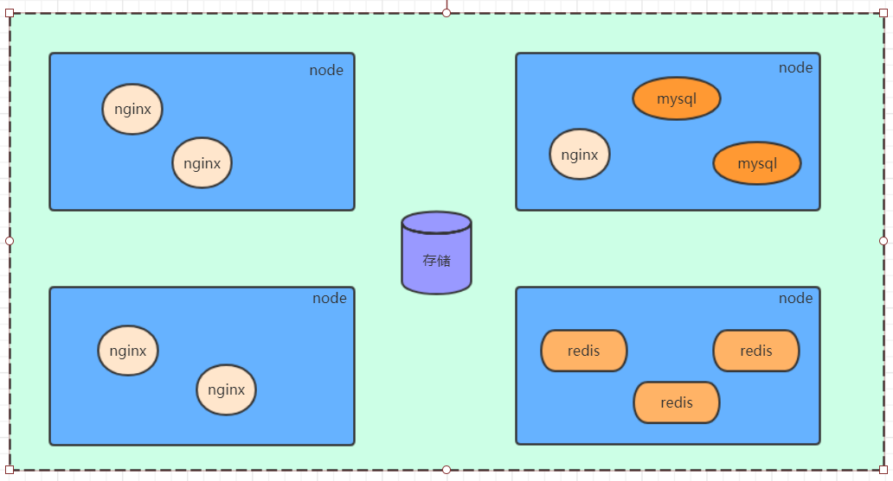
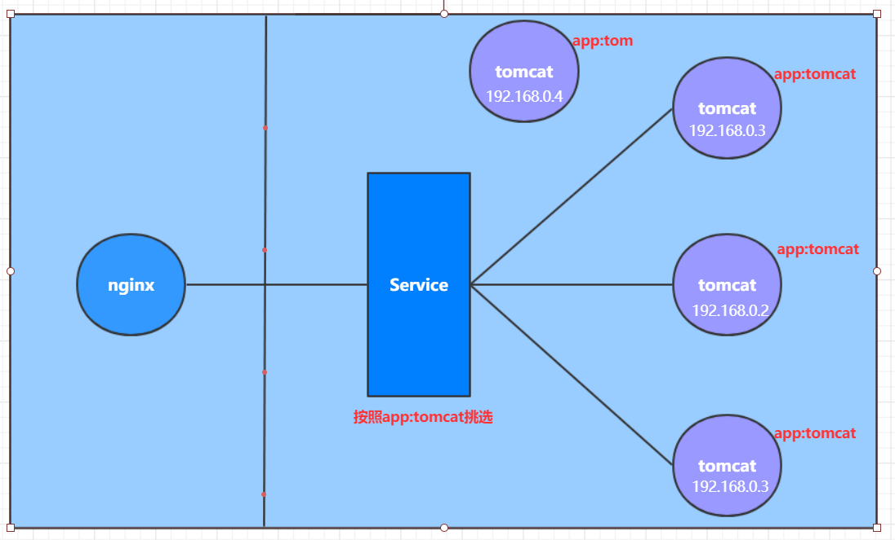
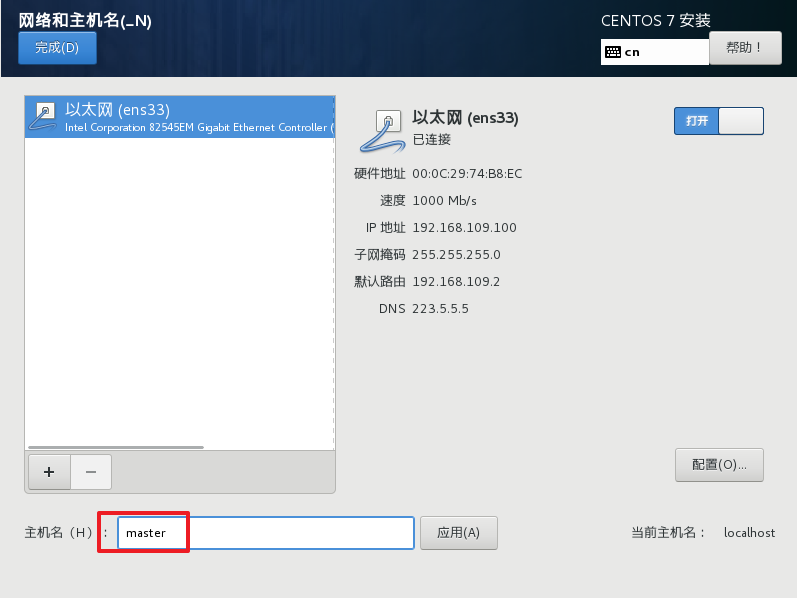
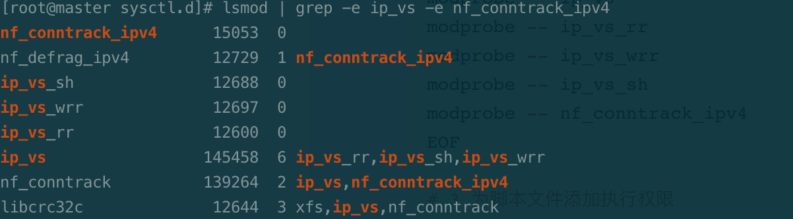
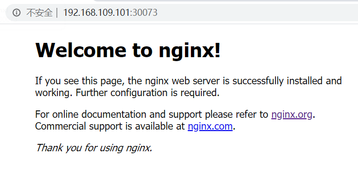
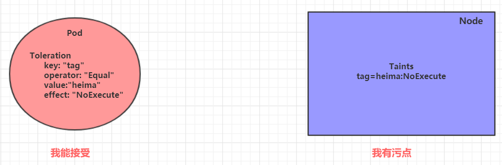

# 第一章 kubernetes介绍

本章节主要介绍应用程序在服务器上部署方式演变以及kubernetes的概念、组件和工作原理。

## 应用部署方式演变

在部署应用程序的方式上，主要经历了三个时代：

- **传统部署**：互联网早期，会直接将应用程序部署在物理机上

  > 优点：简单，不需要其它技术的参与
  >
  > 缺点：不能为应用程序定义资源使用边界，很难合理地分配计算资源，而且程序之间容易产生影响
  
- **虚拟化部署**：可以在一台物理机上运行多个虚拟机，每个虚拟机都是独立的一个环境

  > 优点：程序环境不会相互产生影响，提供了一定程度的安全性
  >
  > 缺点：增加了操作系统，浪费了部分资源

- **容器化部署**：与虚拟化类似，但是共享了操作系统

  > 优点：
  >
  > ​    可以保证每个容器拥有自己的文件系统、CPU、内存、进程空间等
  >
  > ​    运行应用程序所需要的资源都被容器包装，并和底层基础架构解耦
  >
  > ​    容器化的应用程序可以跨云服务商、跨Linux操作系统发行版进行部署


容器化部署方式给带来很多的便利，但是也会出现一些问题，比如说：

- 一个容器故障停机了，怎么样让另外一个容器立刻启动去替补停机的容器
- 当并发访问量变大的时候，怎么样做到横向扩展容器数量

这些容器管理的问题统称为**容器编排**问题，为了解决这些容器编排问题，就产生了一些容器编排的软件：

- **Swarm**：Docker自己的容器编排工具
- **Mesos**：Apache的一个资源统一管控的工具，需要和Marathon结合使用
- **Kubernetes**：Google开源的的容器编排工具


## kubernetes简介


  

**kubernetes**，是一个全新的基于容器技术的分布式架构领先方案，是**谷歌**严格保密十几年的秘密武器----Borg系统的一个开源版本，于2014年9月发布第一个版本，2015年7月发布第一个正式版本。

**kubernetes**的本质是**一组服务器集群**，它可以在集群的每个节点上运行特定的程序，来对**节点中的容器进行管理**。目的是实现**资源管理的自动化**，主要提供了如下的主要功能：

- **自我修复**：一旦某一个容器崩溃，能够在1秒中左右迅速启动新的容器
- **弹性伸缩**：可以根据需要，自动对集群中正在运行的容器数量进行调整
- **服务发现**：服务可以通过自动发现的形式找到它所依赖的服务
- **负载均衡**：如果一个服务起动了多个容器，能够自动实现请求的负载均衡
- **版本回退**：如果发现新发布的程序版本有问题，可以立即回退到原来的版本
- **存储编排**：可以根据容器自身的需求自动创建存储卷



## kubernetes组件

一个kubernetes集群主要是由**控制节点(master)**、**工作节点(node)**构成，每个节点上都会安装不同的组件。

**master：集群的控制平面，负责集群的决策  (  管理  )**

> **ApiServer** : 资源操作的唯一入口，接收用户输入的命令，提供认证、授权、API注册和发现等机制
>
> **Scheduler** : 负责集群资源调度，按照预定的调度策略将Pod调度到相应的node节点上
>
> **ControllerManager** : 负责维护集群的状态，比如程序部署安排、故障检测、自动扩展、滚动更新等
>
> **Etcd **：负责存储集群中各种资源对象的信息

**node：集群的数据平面，负责为容器提供运行环境 ( 干活 ) **

> **Kubelet** : 负责维护容器的生命周期，即通过控制docker，来创建、更新、销毁容器
>
> **KubeProxy** : 负责提供集群内部的服务发现和负载均衡
>
> **Docker** : 负责节点上容器的各种操作


下面，以部署一个nginx服务来说明kubernetes系统各个组件调用关系：

1. 首先要明确，一旦kubernetes环境启动之后，master和node都会将自身的信息存储到etcd数据库中

2. 一个nginx服务的安装请求会首先被发送到master节点的apiServer组件

3. ApiServer组件会调用scheduler组件来决定到底应该把这个服务安装到哪个node节点上

   在此时，它会从etcd中读取各个node节点的信息，然后按照一定的算法进行选择，并将结果告知apiServer

4. ApiServer调用Controller-manager去调度Node节点安装nginx服务

5. kubelet接收到指令后，会通知docker，然后由docker来启动一个nginx的pod

   pod是kubernetes的最小操作单元，容器必须跑在pod中至此，

6. 一个nginx服务就运行了，如果需要访问nginx，就需要通过kube-proxy来对pod产生访问的代理

​        这样，外界用户就可以访问集群中的nginx服务了

## kubernetes概念

**Master**：集群控制节点，每个集群需要至少一个master节点负责集群的管控

**Node**：工作负载节点，由master分配容器到这些node工作节点上，然后node节点上的docker负责容器的运行

**Pod**：kubernetes的最小控制单元，容器都是运行在pod中的，一个pod中可以有1个或者多个容器

**Controller**：控制器，通过它来实现对pod的管理，比如启动pod、停止pod、伸缩pod的数量等等

**Service**：pod对外服务的统一入口，下面可以维护者同一类的多个pod

**Label**：标签，用于对pod进行分类，同一类pod会拥有相同的标签

**NameSpace**：命名空间，用来隔离pod的运行环境




# 第二章 集群环境搭建

本章节主要介绍如何搭建kubernetes的集群环境

## 环境规划

### 集群类型

kubernetes集群大体上分为两类：**一主多从**和**多主多从**。

- 一主多从：一台Master节点和多台Node节点，搭建简单，但是有单机故障风险，适合用于测试环境
- 多主多从：多台Master节点和多台Node节点，搭建麻烦，安全性高，适合用于生产环境


> `说明：为了测试简单，本次搭建的是  一主两从   类型的集群`

### 安装方式

kubernetes有多种部署方式，目前主流的方式有kubeadm、minikube、二进制包

- minikube：一个用于快速搭建单节点kubernetes的工具
- kubeadm：一个用于快速搭建kubernetes集群的工具
- 二进制包 ：从官网下载每个组件的二进制包，依次去安装，此方式对于理解kubernetes组件更加有效

> `说明：现在需要安装kubernetes的集群环境，但是又不想过于麻烦，所以选择使用kubeadm方式`

### 主机规划

| 作用   | IP地址          | 操作系统                    | 配置                     |
| ------ | --------------- | --------------------------- | ------------------------ |
| Master | 192.168.109.100 | Centos7.5    基础设施服务器 | 2颗CPU  2G内存   50G硬盘 |
| Node1  | 192.168.109.101 | Centos7.5    基础设施服务器 | 2颗CPU  2G内存   50G硬盘 |
| Node2  | 192.168.109.102 | Centos7.5    基础设施服务器 | 2颗CPU  2G内存   50G硬盘 |

## 环境搭建

本次环境搭建需要安装三台Centos服务器（一主二从），然后在每台服务器中分别安装docker（18.06.3），kubeadm（1.17.4）、kubelet（1.17.4）、kubectl（1.17.4）程序。

### 主机安装

安装虚拟机过程中注意下面选项的设置：

- 操作系统环境：CPU（2C）    内存（2G）   硬盘（50G）    

- 语言选择：中文简体

- 软件选择：基础设施服务器

- 分区选择：自动分区

- 网络配置：按照下面配置网路地址信息

  ~~~md
  网络地址：192.168.109.100  （每台主机都不一样  分别为100、101、102）
  子网掩码：255.255.255.0
  默认网关：192.168.109.2
  DNS：    223.5.5.5
  ~~~

  

- 主机名设置：按照下面信息设置主机名

  ~~~md
  master节点： master
  node节点：   node1
  node节点：   node2
  ~~~

  

### 环境初始化

1)    检查操作系统的版本

~~~powershell
# 此方式下安装kubernetes集群要求Centos版本要在7.5或之上
[root@master ~]# cat /etc/redhat-release
CentOS Linux release 7.5.1804 (Core)
~~~

2） 主机名解析

为了方便后面集群节点间的直接调用，在这配置一下主机名解析，企业中推荐使用内部DNS服务器

```powershell
# 主机名成解析 编辑三台服务器的/etc/hosts文件，添加下面内容
192.168.109.100  master
192.168.109.101  node1
192.168.109.102  node2
```
3） 时间同步

kubernetes要求集群中的节点时间必须精确一致，这里直接使用chronyd服务从网络同步时间。

企业中建议配置内部的时间同步服务器

~~~powershell
# 启动chronyd服务
[root@master ~]# systemctl start chronyd
# 设置chronyd服务开机自启
[root@master ~]# systemctl enable chronyd
# chronyd服务启动稍等几秒钟，就可以使用date命令验证时间了
[root@master ~]# date
~~~

4） 禁用iptables和firewalld服务

kubernetes和docker在运行中会产生大量的iptables规则，为了不让系统规则跟它们混淆，直接关闭系统的规则

~~~powershell
# 1 关闭firewalld服务
[root@master ~]# systemctl stop firewalld
[root@master ~]# systemctl disable firewalld
# 2 关闭iptables服务
[root@master ~]# systemctl stop iptables
[root@master ~]# systemctl disable iptables
~~~

5） 禁用selinux

 selinux是linux系统下的一个安全服务，如果不关闭它，在安装集群中会产生各种各样的奇葩问题

~~~powershell
# 编辑 /etc/selinux/config 文件，修改SELINUX的值为disabled
# 注意修改完毕之后需要重启linux服务
SELINUX=disabled
~~~

6） 禁用swap分区

swap分区指的是虚拟内存分区，它的作用是在物理内存使用完之后，将磁盘空间虚拟成内存来使用

启用swap设备会对系统的性能产生非常负面的影响，因此kubernetes要求每个节点都要禁用swap设备

但是如果因为某些原因确实不能关闭swap分区，就需要在集群安装过程中通过明确的参数进行配置说明

~~~powershell
# 编辑分区配置文件/etc/fstab，注释掉swap分区一行
# 注意修改完毕之后需要重启linux服务
 UUID=455cc753-7a60-4c17-a424-7741728c44a1 /boot    xfs     defaults        0 0
 /dev/mapper/centos-home /home                      xfs     defaults        0 0
# /dev/mapper/centos-swap swap                      swap    defaults        0 0
~~~

7）修改linux的内核参数

~~~powershell
# 修改linux的内核参数，添加网桥过滤和地址转发功能
# 编辑/etc/sysctl.d/kubernetes.conf文件，添加如下配置:
net.bridge.bridge-nf-call-ip6tables = 1
net.bridge.bridge-nf-call-iptables = 1
net.ipv4.ip_forward = 1

# 重新加载配置
[root@master ~]# sysctl -p

# 加载网桥过滤模块
[root@master ~]# modprobe br_netfilter

# 查看网桥过滤模块是否加载成功
[root@master ~]# lsmod | grep br_netfilter
~~~

8）配置ipvs功能

在kubernetes中service有两种代理模型，一种是基于iptables的，一种是基于ipvs的

两者比较的话，ipvs的性能明显要高一些，但是如果要使用它，需要手动载入ipvs模块

~~~powershell
# 1 安装ipset和ipvsadm
[root@master ~]# yum install ipset ipvsadmin -y

# 2 添加需要加载的模块写入脚本文件
[root@master ~]# cat <<EOF >  /etc/sysconfig/modules/ipvs.modules
#!/bin/bash
modprobe -- ip_vs
modprobe -- ip_vs_rr
modprobe -- ip_vs_wrr
modprobe -- ip_vs_sh
modprobe -- nf_conntrack_ipv4
EOF

# 3 为脚本文件添加执行权限
[root@master ~]# chmod +x /etc/sysconfig/modules/ipvs.modules

# 4 执行脚本文件
[root@master ~]# /bin/bash /etc/sysconfig/modules/ipvs.modules

# 5 查看对应的模块是否加载成功
[root@master ~]# lsmod | grep -e ip_vs -e nf_conntrack_ipv4
~~~



9） 重启服务器

上面步骤完成之后，需要重新启动linux系统

~~~powershell
[root@master ~]# reboot
~~~

### 安装docker

~~~powershell
# 1 切换镜像源
[root@master ~]# wget https://mirrors.aliyun.com/docker-ce/linux/centos/docker-ce.repo -O /etc/yum.repos.d/docker-ce.repo

# 2 查看当前镜像源中支持的docker版本
[root@master ~]# yum list docker-ce --showduplicates

# 3 安装特定版本的docker-ce
# 必须指定--setopt=obsoletes=0，否则yum会自动安装更高版本
[root@master ~]# yum install --setopt=obsoletes=0 docker-ce-18.06.3.ce-3.el7 -y

# 4 添加一个配置文件
# Docker在默认情况下使用的Cgroup Driver为cgroupfs，而kubernetes推荐使用systemd来代替cgroupfs
[root@master ~]# mkdir /etc/docker
[root@master ~]# cat <<EOF >  /etc/docker/daemon.json
{
  "exec-opts": ["native.cgroupdriver=systemd"],
  "registry-mirrors": ["https://kn0t2bca.mirror.aliyuncs.com"]
}
EOF

# 5 启动docker
[root@master ~]# systemctl restart docker
[root@master ~]# systemctl enable docker

# 6 检查docker状态和版本
[root@master ~]# docker version
~~~

### 安装kubernetes组件

~~~powershell
# 由于kubernetes的镜像源在国外，速度比较慢，这里切换成国内的镜像源
# 编辑/etc/yum.repos.d/kubernetes.repo，添加下面的配置 
[kubernetes]
name=Kubernetes
baseurl=http://mirrors.aliyun.com/kubernetes/yum/repos/kubernetes-el7-x86_64
enabled=1
gpgcheck=0
repo_gpgcheck=0
gpgkey=http://mirrors.aliyun.com/kubernetes/yum/doc/yum-key.gpg
       http://mirrors.aliyun.com/kubernetes/yum/doc/rpm-package-key.gpg

# 安装kubeadm、kubelet和kubectl
[root@master ~]# yum install --setopt=obsoletes=0 kubeadm-1.17.4-0 kubelet-1.17.4-0 kubectl-1.17.4-0 -y

# 配置kubelet的cgroup
# 编辑/etc/sysconfig/kubelet，添加下面的配置
KUBELET_CGROUP_ARGS="--cgroup-driver=systemd"
KUBE_PROXY_MODE="ipvs"

# 4 设置kubelet开机自启
[root@master ~]# systemctl enable kubelet
~~~

### 准备集群镜像

~~~powershell
# 在安装kubernetes集群之前，必须要提前准备好集群需要的镜像，所需镜像可以通过下面命令查看
[root@master ~]# kubeadm config images list

# 下载镜像
# 此镜像在kubernetes的仓库中,由于网络原因,无法连接，下面提供了一种替代方案
images=(
    kube-apiserver:v1.17.4
    kube-controller-manager:v1.17.4
    kube-scheduler:v1.17.4
    kube-proxy:v1.17.4
    pause:3.1
    etcd:3.4.3-0
    coredns:1.6.5
)

for imageName in ${images[@]} ; do
	docker pull registry.cn-hangzhou.aliyuncs.com/google_containers/$imageName
	docker tag registry.cn-hangzhou.aliyuncs.com/google_containers/$imageName 		k8s.gcr.io/$imageName
	docker rmi registry.cn-hangzhou.aliyuncs.com/google_containers/$imageName
done
~~~

### 集群初始化

下面开始对集群进行初始化，并将node节点加入到集群中

> 下面的操作只需要在`master`节点上执行即可

~~~powershell
# 创建集群
[root@master ~]# kubeadm init \
	--kubernetes-version=v1.17.4 \
    --pod-network-cidr=10.244.0.0/16 \
    --service-cidr=10.96.0.0/12 \
    --apiserver-advertise-address=192.168.109.100

# 创建必要文件
[root@master ~]# mkdir -p $HOME/.kube
[root@master ~]# sudo cp -i /etc/kubernetes/admin.conf $HOME/.kube/config
[root@master ~]# sudo chown $(id -u):$(id -g) $HOME/.kube/config
~~~

> 下面的操作只需要在`node`节点上执行即可

~~~powershell
# 将node节点加入集群
[root@master ~]# kubeadm join 192.168.109.100:6443 \ 
	--token 8507uc.o0knircuri8etnw2 \
	--discovery-token-ca-cert-hash \
	sha256:acc37967fb5b0acf39d7598f8a439cc7dc88f439a3f4d0c9cae88e7901b9d3f
	
# 查看集群状态 此时的集群状态为NotReady，这是因为还没有配置网络插件
[root@master ~]# kubectl get nodes
NAME     STATUS     ROLES    AGE     VERSION
master   NotReady   master   6m43s   v1.17.4
node1    NotReady   <none>   22s     v1.17.4
node2    NotReady   <none>   19s     v1.17.4
~~~

### 安装网络插件

kubernetes支持多种网络插件，比如flannel、calico、canal等等，任选一种使用即可，本次选择flannel

> 下面操作依旧只在`master`节点执行即可，插件使用的是DaemonSet的控制器，它会在每个节点上都运行

~~~powershell
# 获取fannel的配置文件
[root@master ~]# wget https://raw.githubusercontent.com/coreos/flannel/master/Documentation/kube-flannel.yml

# 修改文件中quay.io仓库为quay-mirror.qiniu.com

# 使用配置文件启动fannel
[root@master ~]# kubectl apply -f kube-flannel.yml

# 稍等片刻，再次查看集群节点的状态
[root@master ~]# kubectl get nodes
NAME     STATUS   ROLES    AGE     VERSION
master   Ready    master   15m     v1.17.4
node1    Ready    <none>   8m53s   v1.17.4
node2    Ready    <none>   8m50s   v1.17.4
~~~

至此，kubernetes的集群环境搭建完成

如果执行完毕，NoReady 可以重启服务

```shell
systemctl daemon-reload 
systemctl restart kubelet
```

## 服务部署

接下来在kubernetes集群中部署一个nginx程序，测试下集群是否在正常工作。

~~~powershell
# 部署nginx
[root@master ~]# kubectl create deployment nginx --image=nginx:1.14-alpine

# 暴露端口
[root@master ~]# kubectl expose deployment nginx --port=80 --type=NodePort

# 查看服务状态
[root@master ~]# kubectl get pods,service
NAME                         READY   STATUS    RESTARTS   AGE
pod/nginx-86c57db685-fdc2k   1/1     Running   0          18m

NAME                 TYPE        CLUSTER-IP      EXTERNAL-IP   PORT(S)        AGE
service/kubernetes   ClusterIP   10.96.0.1       <none>        443/TCP        82m
service/nginx        NodePort    10.104.121.45   <none>        80:30073/TCP   17m

# 4 最后在电脑上访问下部署的nginx服务
~~~




# 第三章 资源管理

本章节主要介绍yaml语法和kubernetes的资源管理方式

## 资源管理介绍

在kubernetes中，所有的内容都抽象为资源，用户需要通过操作资源来管理kubernetes。

>kubernetes的本质上就是一个集群系统，用户可以在集群中部署各种服务，所谓的部署服务，其实就是在kubernetes集群中运行一个个的容器，并将指定的程序跑在容器中。
>
>kubernetes的最小管理单元是pod而不是容器，所以只能将容器放在`Pod`中，而kubernetes一般也不会直接管理Pod，而是通过`Pod控制器`来管理Pod的。
>
>Pod可以提供服务之后，就要考虑如何访问Pod中服务，kubernetes提供了`Service`资源实现这个功能。
>
>当然，如果Pod中程序的数据需要持久化，kubernetes还提供了各种`存储`系统。


>  学习kubernetes的核心，就是学习如何对集群上的`Pod、Pod控制器、Service、存储`等各种资源进行操作

## YAML语言介绍

YAML是一个类似 XML、JSON 的标记性语言。它强调以**数据**为中心，并不是以标识语言为重点。因而YAML本身的定义比较简单，号称"一种人性化的数据格式语言"。

~~~xml
<user>
	<age>15</age>
  <address>Beijing</address>
</user>
~~~

~~~yaml
user:
  age: 15
  address: Beijing
~~~

YAML的语法比较简单，主要有下面几个：

- 大小写敏感
- 使用缩进表示层级关系
- 缩进不允许使用tab，只允许空格( 低版本限制 )
- 缩进的空格数不重要，只要相同层级的元素左对齐即可
- '#'表示注释

YAML支持以下几种数据类型：

- 纯量：单个的、不可再分的值
- 对象：键值对的集合，又称为映射（mapping）/ 哈希（hash） / 字典（dictionary）
- 数组：一组按次序排列的值，又称为序列（sequence） / 列表（list）

~~~yaml
# 纯量, 就是指的一个简单的值，字符串、布尔值、整数、浮点数、Null、时间、日期
# 1 布尔类型
c1: true (或者True)
# 2 整型
c2: 234
# 3 浮点型
c3: 3.14
# 4 null类型 
c4: ~  # 使用~表示null
# 5 日期类型
c5: 2018-02-17    # 日期必须使用ISO 8601格式，即yyyy-MM-dd
# 6 时间类型
c6: 2018-02-17T15:02:31+08:00  # 时间使用ISO 8601格式，时间和日期之间使用T连接，最后使用+代表时区
# 7 字符串类型
c7: pyy     # 简单写法，直接写值 , 如果字符串中间有特殊字符，必须使用双引号或者单引号包裹 
c8: line1
    line2     # 字符串过多的情况可以拆成多行，每一行会被转化成一个空格
~~~

~~~yaml
# 对象
# 形式一(推荐):
pyy:
  age: 15
  address: Beijing
# 形式二(了解):
pyy: {age: 15,address: Beijing}
~~~

~~~yaml
# 数组
# 形式一(推荐):
address:
  - 顺义
  - 昌平	
# 形式二(了解):
address: [顺义,昌平]
~~~

> 小提示：
>
> ​	1  书写yaml切记`:` 后面要加一个空格
>
> ​	2  如果需要将多段yaml配置放在一个文件中，中间要使用`---`分隔
>
> ​    3 下面是一个yaml转json的网站，可以通过它验证yaml是否书写正确
>
> ​       https://www.json2yaml.com/convert-yaml-to-json

## 资源管理方式

- 命令式对象管理：直接使用命令去操作kubernetes资源

  `kubectl run nginx-pod --image=nginx:1.17.1 --port=80`

- 命令式对象配置：通过命令配置和配置文件去操作kubernetes资源

  `kubectl create/patch -f nginx-pod.yaml`

- 声明式对象配置：通过apply命令和配置文件去操作kubernetes资源

  `kubectl apply -f nginx-pod.yaml`

| 类型           | 操作对象 | 适用环境 | 优点           | 缺点                             |
| -------------- | -------- | -------- | -------------- | -------------------------------- |
| 命令式对象管理 | 对象     | 测试     | 简单           | 只能操作活动对象，无法审计、跟踪 |
| 命令式对象配置 | 文件     | 开发     | 可以审计、跟踪 | 项目大时，配置文件多，操作麻烦   |
| 声明式对象配置 | 目录     | 开发     | 支持目录操作   | 意外情况下难以调试               |

### 命令式对象管理

**kubectl命令**

kubectl是kubernetes集群的命令行工具，通过它能够对集群本身进行管理，并能够在集群上进行容器化应用的安装部署。kubectl命令的语法如下：

~~~md
kubectl [command] [type] [name] [flags]
~~~

**comand**：指定要对资源执行的操作，例如create、get、delete

**type**：指定资源类型，比如deployment、pod、service

**name**：指定资源的名称，名称大小写敏感

**flags**：指定额外的可选参数

~~~powershell
# 查看所有pod
kubectl get pod 

# 查看某个pod
kubectl get pod pod_name

# 查看某个pod,以yaml格式展示结果
kubectl get pod pod_name -o yaml
~~~

**资源类型**

kubernetes中所有的内容都抽象为资源，可以通过下面的命令进行查看:

~~~powershell
kubectl api-resources
~~~

经常使用的资源有下面这些：

<table>
	<tr>
	    <th>资源分类</th>
	    <th>资源名称</th>
		<th>缩写</th>
		<th>资源作用</th>
	</tr>
	<tr>
	    <td rowspan="2">集群级别资源</td>
        <td>nodes</td>
	    <td>no</td>
		<td>集群组成部分</td>
	</tr>
	<tr>
		<td>namespaces</td>
	    <td>ns</td>
		<td>隔离Pod</td>
	</tr>
	<tr>
		<td>pod资源</td>
	    <td>pods</td>
	    <td>po</td>
		<td>装载容器</td>
	</tr>
	<tr>
		<td rowspan="8">pod资源控制器</td>
	    <td>replicationcontrollers</td>
	    <td>rc</td>
		<td>控制pod资源</td>
	</tr>
	<tr>
	    <td>replicasets</td>
	    <td>rs</td>
		<td>控制pod资源</td>
	</tr>
	<tr>
	    <td>deployments</td>
	    <td>deploy</td>
		<td>控制pod资源</td>
	</tr>
	<tr>
	    <td>daemonsets</td>
	    <td>ds</td>
		<td>控制pod资源</td>
	</tr>
	<tr>
	    <td>jobs</td>
	    <td></td>
		<td>控制pod资源</td>
	</tr>	
	<tr>
	    <td>cronjobs</td>
	    <td>cj</td>
		<td>控制pod资源</td>
	</tr>	
	<tr>
	    <td>horizontalpodautoscalers</td>
	    <td>hpa</td>
		<td>控制pod资源</td>
	</tr>	
	<tr>
	    <td>statefulsets</td>
	    <td>sts</td>
		<td>控制pod资源</td>
	</tr>
	<tr>
		<td rowspan="2">服务发现资源</td>
	    <td>services</td>
	    <td>svc</td>
		<td>统一pod对外接口</td>
	</tr>
    <tr>
	    <td>ingress</td>
	    <td>ing</td>
		<td>统一pod对外接口</td>
	</tr>
	<tr>
		<td rowspan="3">存储资源</td>
	    <td>volumeattachments</td>
	    <td></td>
		<td>存储</td>
	</tr>
	<tr>
	    <td>persistentvolumes</td>
	    <td>pv</td>
		<td>存储</td>
	</tr>
	<tr>
	    <td>persistentvolumeclaims</td>
	    <td>pvc</td>
		<td>存储</td>
	</tr>
	<tr>
		<td rowspan="2">配置资源</td>
	    <td>configmaps</td>
	    <td>cm</td>
		<td>配置</td>
	</tr>
	<tr>
	    <td>secrets</td>
	    <td></td>
		<td>配置</td>
	</tr>
</table>

**操作**

kubernetes允许对资源进行多种操作，可以通过--help查看详细的操作命令

~~~powershell
kubectl --help
~~~

经常使用的操作有下面这些：

<table>
	<tr>
	    <th>命令分类</th>
	    <th>命令</th>
		<th>翻译</th>
		<th>命令作用</th>
	</tr>
	<tr>
	    <td rowspan="6">基本命令</td>
	    <td>create</td>
	    <td>创建</td>
		<td>创建一个资源</td>
	</tr>
	<tr>
		<td>edit</td>
	    <td>编辑</td>
		<td>编辑一个资源</td>
	</tr>
	<tr>
		<td>get</td>
	    <td>获取</td>
	    <td>获取一个资源</td>
	</tr>
   <tr>
		<td>patch</td>
	    <td>更新</td>
	    <td>更新一个资源</td>
	</tr>
	<tr>
	    <td>delete</td>
	    <td>删除</td>
		<td>删除一个资源</td>
	</tr>
	<tr>
	    <td>explain</td>
	    <td>解释</td>
		<td>展示资源文档</td>
	</tr>
	<tr>
	    <td rowspan="10">运行和调试</td>
	    <td>run</td>
	    <td>运行</td>
		<td>在集群中运行一个指定的镜像</td>
	</tr>
	<tr>
	    <td>expose</td>
	    <td>暴露</td>
		<td>暴露资源为Service</td>
	</tr>
	<tr>
	    <td>describe</td>
	    <td>描述</td>
		<td>显示资源内部信息</td>
	</tr>
	<tr>
	    <td>logs</td>
	    <td>日志</td>
		<td>输出容器在 pod 中的日志</td>
	</tr>	
	<tr>
	    <td>attach</td>
	    <td>缠绕</td>
		<td>进入运行中的容器</td>
	</tr>	
	<tr>
	    <td>exec</td>
	    <td>执行</td>
		<td>执行容器中的一个命令</td>
	</tr>	
	<tr>
	    <td>cp</td>
	    <td>复制</td>
		<td>在Pod内外复制文件</td>
	</tr>
		<tr>
		<td>rollout</td>
	    <td>首次展示</td>
		<td>管理资源的发布</td>
	</tr>
	<tr>
		<td>scale</td>
	    <td>规模</td>
		<td>扩(缩)容Pod的数量</td>
	</tr>
	<tr>
		<td>autoscale</td>
	    <td>自动调整</td>
		<td>自动调整Pod的数量</td>
	</tr>
	<tr>
		<td rowspan="2">高级命令</td>
	    <td>apply</td>
	    <td>rc</td>
		<td>通过文件对资源进行配置</td>
	</tr>
	<tr>
	    <td>label</td>
	    <td>标签</td>
		<td>更新资源上的标签</td>
	</tr>
	<tr>
		<td rowspan="2">其他命令</td>
	    <td>cluster-info</td>
	    <td>集群信息</td>
		<td>显示集群信息</td>
	</tr>
	<tr>
	    <td>version</td>
	    <td>版本</td>
		<td>显示当前Server和Client的版本</td>
	</tr>
</table>

下面以一个namespace / pod的创建和删除简单演示下命令的使用：

~~~powershell
# 创建一个namespace
[root@master ~]# kubectl create namespace dev
namespace/dev created

# 获取namespace
[root@master ~]# kubectl get ns
NAME              STATUS   AGE
default           Active   21h 
dev               Active   21s
kube-node-lease   Active   21h
kube-public       Active   21h
kube-system       Active   21h

# 在此namespace下创建并运行一个nginx的Pod
[root@master ~]# kubectl run pod --image=nginx -n dev
kubectl run --generator=deployment/apps.v1 is DEPRECATED and will be removed in a future version. Use kubectl run --generator=run-pod/v1 or kubectl create instead.
deployment.apps/pod created

# 查看新创建的pod
[root@master ~]# kubectl get pod -n dev
NAME                   READY   STATUS    RESTARTS   AGE
pod-864f9875b9-pcw7x   1/1     Running   0          21s

# 删除指定的pod
[root@master ~]# kubectl delete pod pod-864f9875b9-pcw7x -n dev
pod "pod-864f9875b9-pcw7x" deleted

# 删除指定的namespace
[root@master ~]# kubectl delete ns dev
namespace "dev" deleted
~~~

###  命令式对象配置

命令式对象配置就是使用命令配合配置文件一起来操作kubernetes资源。

1） 创建一个nginxpod.yaml，内容如下：

~~~yaml
apiVersion: v1
kind: Namespace
metadata:
  name: dev

---

apiVersion: v1
kind: Pod
metadata:
  name: nginxpod
  namespace: dev
spec:
  containers:
  - name: nginx-containers
    image: nginx:1.17.1
~~~

2）执行create命令，创建资源：

~~~powershell
[root@master ~]# kubectl create -f nginxpod.yaml
namespace/dev created
pod/nginxpod created
~~~

此时发现创建了两个资源对象，分别是namespace和pod

3）执行get命令，查看资源：

~~~powershell
[root@master ~]#  kubectl get -f nginxpod.yaml
NAME            STATUS   AGE
namespace/dev   Active   18s

NAME            READY   STATUS    RESTARTS   AGE
pod/nginxpod    1/1     Running   0          17s
~~~

这样就显示了两个资源对象的信息

4）执行delete命令，删除资源：

~~~powershell
[root@master ~]# kubectl delete -f nginxpod.yaml
namespace "dev" deleted
pod "nginxpod" deleted
~~~

此时发现两个资源对象被删除了

~~~
总结:
命令式对象配置的方式操作资源，可以简单的认为：命令  +  yaml配置文件（里面是命令需要的各种参数）
~~~

###  声明式对象配置

声明式对象配置跟命令式对象配置很相似，但是它只有一个命令apply。

~~~powershell
# 首先执行一次kubectl apply -f yaml文件，发现创建了资源
[root@master ~]#  kubectl apply -f nginxpod.yaml
namespace/dev created
pod/nginxpod created

# 再次执行一次kubectl apply -f yaml文件，发现说资源没有变动
[root@master ~]#  kubectl apply -f nginxpod.yaml
namespace/dev unchanged
pod/nginxpod unchanged
~~~

~~~md
总结:
其实声明式对象配置就是使用apply描述一个资源最终的状态（在yaml中定义状态）
使用apply操作资源：
    如果资源不存在，就创建，相当于 kubectl create
		如果资源已存在，就更新，相当于 kubectl patch
~~~

> 扩展：kubectl可以在node节点上运行吗 ?

kubectl的运行是需要进行配置的，它的配置文件是\$HOME/.kube，如果想要在node节点运行此命令，需要将master上的.kube文件复制到node节点上，即在master节点上执行下面操作：

~~~powershell
scp  -r  HOME/.kube   node1: HOME/
~~~

> 使用推荐:  三种方式应该怎么用 ?

 创建/更新资源      使用声明式对象配置 kubectl apply -f  XXX.yaml

 删除资源              使用命令式对象配置 kubectl delete -f  XXX.yaml

 查询资源              使用命令式对象管理 kubectl get(describe) 资源名称


# 第四章 实战入门

本章节将介绍如何在kubernetes集群中部署一个nginx服务，并且能够对其进行访问。

## Namespace

Namespace是kubernetes系统中的一种非常重要资源，它的主要作用是用来实现**多套环境的资源隔离**或者**多租户的资源隔离**。

默认情况下，kubernetes集群中的所有的Pod都是可以相互访问的。但是在实际中，可能不想让两个Pod之间进行互相的访问，那此时就可以将两个Pod划分到不同的namespace下。kubernetes通过将集群内部的资源分配到不同的Namespace中，可以形成逻辑上的"组"，以方便不同的组的资源进行隔离使用和管理。

可以通过kubernetes的授权机制，将不同的namespace交给不同租户进行管理，这样就实现了多租户的资源隔离。此时还能结合kubernetes的资源配额机制，限定不同租户能占用的资源，例如CPU使用量、内存使用量等等，来实现租户可用资源的管理。


kubernetes在集群启动之后，会默认创建几个namespace

```
[root@master ~]# kubectl  get namespace
NAME              STATUS   AGE
default           Active   45h     #  所有未指定Namespace的对象都会被分配在default命名空间
kube-node-lease   Active   45h     #  集群节点之间的心跳维护，v1.13开始引入
kube-public       Active   45h     #  此命名空间下的资源可以被所有人访问（包括未认证用户）
kube-system       Active   45h     #  所有由Kubernetes系统创建的资源都处于这个命名空间
```

下面来看namespace资源的具体操作：

**查看**

```shell
# 1 查看所有的ns  命令：kubectl get ns
[root@master ~]# kubectl get ns
NAME              STATUS   AGE
default           Active   45h
kube-node-lease   Active   45h
kube-public       Active   45h     
kube-system       Active   45h     

# 2 查看指定的ns   命令：kubectl get ns ns名称
[root@master ~]# kubectl get ns default
NAME      STATUS   AGE
default   Active   45h

# 3 指定输出格式  命令：kubectl get ns ns名称  -o 格式参数
# kubernetes支持的格式有很多，比较常见的是wide、json、yaml
[root@master ~]# kubectl get ns default -o yaml
apiVersion: v1
kind: Namespace
metadata:
  creationTimestamp: "2020-04-05T04:44:16Z"
  name: default
  resourceVersion: "151"
  selfLink: /api/v1/namespaces/default
  uid: 7405f73a-e486-43d4-9db6-145f1409f090
spec:
  finalizers:
  - kubernetes
status:
  phase: Active
  
# 4 查看ns详情  命令：kubectl describe ns ns名称
[root@master ~]# kubectl describe ns default
Name:         default
Labels:       <none>
Annotations:  <none>
Status:       Active  # Active 命名空间正在使用中  Terminating 正在删除命名空间

# ResourceQuota 针对namespace做的资源限制
# LimitRange针对namespace中的每个组件做的资源限制
No resource quota.
No LimitRange resource.
```

**创建**

```shell
# 创建namespace
[root@master ~]# kubectl create ns dev
namespace/dev created
```

**删除**

```
# 删除namespace
[root@master ~]# kubectl delete ns dev
namespace "dev" deleted
```

**配置方式**

首先准备一个yaml文件：ns-dev.yaml

```
apiVersion: v1
kind: Namespace
metadata:
  name: dev
```

然后就可以执行对应的创建和删除命令了：

​    创建：kubectl  create  -f  ns-dev.yaml

​    删除：kubectl  delete  -f  ns-dev.yaml

## Pod

Pod是kubernetes集群进行管理的最小单元，程序要运行必须部署在容器中，而容器必须存在于Pod中。

Pod可以认为是容器的封装，一个Pod中可以存在一个或者多个容器。


kubernetes在集群启动之后，集群中的各个组件也都是以Pod方式运行的。可以通过下面命令查看：

```shell
[root@master ~]# kubectl get pod -n kube-system
NAMESPACE     NAME                             READY   STATUS    RESTARTS   AGE
kube-system   coredns-6955765f44-68g6v         1/1     Running   0          2d1h
kube-system   coredns-6955765f44-cs5r8         1/1     Running   0          2d1h
kube-system   etcd-master                      1/1     Running   0          2d1h
kube-system   kube-apiserver-master            1/1     Running   0          2d1h
kube-system   kube-controller-manager-master   1/1     Running   0          2d1h
kube-system   kube-flannel-ds-amd64-47r25      1/1     Running   0          2d1h
kube-system   kube-flannel-ds-amd64-ls5lh      1/1     Running   0          2d1h
kube-system   kube-proxy-685tk                 1/1     Running   0          2d1h
kube-system   kube-proxy-87spt                 1/1     Running   0          2d1h
kube-system   kube-scheduler-master            1/1     Running   0          2d1h
```

**创建并运行**

kubernetes没有提供单独运行Pod的命令，都是通过Pod控制器来实现的

```shell
# 命令格式： kubectl run (pod控制器名称) [参数] 
# --image  指定Pod的镜像
# --port   指定端口
# --namespace  指定namespace
[root@master ~]# kubectl run nginx --image=nginx:1.17.1 --port=80 --namespace dev 
deployment.apps/nginx created
```

**查看pod信息**

```shell
# 查看Pod基本信息
[root@master ~]# kubectl get pods -n dev
NAME                     READY   STATUS    RESTARTS   AGE
nginx-5ff7956ff6-fg2db   1/1     Running   0          43s

# 查看Pod的详细信息
[root@master ~]# kubectl describe pod nginx-5ff7956ff6-fg2db -n dev
Name:         nginx-5ff7956ff6-fg2db
Namespace:    dev
Priority:     0
Node:         node1/192.1ku68.109.101
Start Time:   Wed, 08 Apr 2020 09:29:24 +0800
Labels:       pod-template-hash=5ff7956ff6
              run=nginx
Annotations:  <none>
Status:       Running
IP:           10.244.1.23
IPs:
  IP:           10.244.1.23
Controlled By:  ReplicaSet/nginx-5ff7956ff6
Containers:
  nginx:
    Container ID:   docker://4c62b8c0648d2512380f4ffa5da2c99d16e05634979973449c98e9b829f6253c
    Image:          nginx:1.17.1
    Image ID:       docker-pullable://nginx@sha256:485b610fefec7ff6c463ced9623314a04ed67e3945b9c08d7e53a47f6d108dc7
    Port:           80/TCP
    Host Port:      0/TCP
    State:          Running
      Started:      Wed, 08 Apr 2020 09:30:01 +0800
    Ready:          True
    Restart Count:  0
    Environment:    <none>
    Mounts:
      /var/run/secrets/kubernetes.io/serviceaccount from default-token-hwvvw (ro)
Conditions:
  Type              Status
  Initialized       True
  Ready             True
  ContainersReady   True
  PodScheduled      True
Volumes:
  default-token-hwvvw:
    Type:        Secret (a volume populated by a Secret)
    SecretName:  default-token-hwvvw
    Optional:    false
QoS Class:       BestEffort
Node-Selectors:  <none>
Tolerations:     node.kubernetes.io/not-ready:NoExecute for 300s
                 node.kubernetes.io/unreachable:NoExecute for 300s
Events:
  Type    Reason     Age        From               Message
  ----    ------     ----       ----               -------
  Normal  Scheduled  <unknown>  default-scheduler  Successfully assigned dev/nginx-5ff7956ff6-fg2db to node1
  Normal  Pulling    4m11s      kubelet, node1     Pulling image "nginx:1.17.1"
  Normal  Pulled     3m36s      kubelet, node1     Successfully pulled image "nginx:1.17.1"
  Normal  Created    3m36s      kubelet, node1     Created container nginx
  Normal  Started    3m36s      kubelet, node1     Started container nginx
```

**访问Pod**

```shell
# 获取podIP
[root@master ~]# kubectl get pods -n dev -o wide
NAME                     READY   STATUS    RESTARTS   AGE    IP             NODE    ... 
nginx-5ff7956ff6-fg2db   1/1     Running   0          190s   10.244.1.23   node1   ...

#访问POD
[root@master ~]# curl http://10.244.1.23:80
<!DOCTYPE html>
<html>
<head>
	<title>Welcome to nginx!</title>
</head>
<body>
	<p><em>Thank you for using nginx.</em></p>
</body>
</html>
```

**删除指定Pod**

```shell
# 删除指定Pod
[root@master ~]# kubectl delete pod nginx-5ff7956ff6-fg2db -n dev
pod "nginx-5ff7956ff6-fg2db" deleted

# 此时，显示删除Pod成功，但是再查询，发现又新产生了一个 
[root@master ~]# kubectl get pods -n dev
NAME                     READY   STATUS    RESTARTS   AGE
nginx-5ff7956ff6-jj4ng   1/1     Running   0          21s

# 这是因为当前Pod是由Pod控制器创建的，控制器会监控Pod状况，一旦发现Pod死亡，会立即重建
# 此时要想删除Pod，必须删除Pod控制器

# 先来查询一下当前namespace下的Pod控制器
[root@master ~]# kubectl get deployment -n  dev
NAME    READY   UP-TO-DATE   AVAILABLE   AGE
nginx   1/1     1            1           9m7s

# 接下来，删除此PodPod控制器
[root@master ~]# kubectl delete deploy nginx -n dev
deployment.apps "nginx" deleted

# 稍等片刻，再查询Pod，发现Pod被删除了
[root@master ~]# kubectl get pods -n dev
No resources found in dev namespace.
```

**配置操作**

创建一个pod-nginx.yaml，内容如下：

```yaml
apiVersion: v1
kind: Pod
metadata:
  name: nginx-pod
  namespace: dev
spec:
  containers:
  - image: nginx:1.17.1
    name: pod
    ports:
    - name: nginx-port
      containerPort: 80
      protocol: TCP
```

然后就可以执行对应的创建和删除命令了：

​    创建：kubectl  create  -f  pod-nginx.yaml

​    删除：kubectl  delete  -f  pod-nginx.yaml

## Label

Label是kubernetes系统中的一个重要概念。它的作用就是在资源上添加标识，用来对它们进行区分和选择。

**Label的特点：**

- 一个Label会以key/value键值对的形式附加到各种对象上，如Node、Pod、Service等等
- 一个资源对象可以定义任意数量的Label ，同一个Label也可以被添加到任意数量的资源对象上去
- Label通常在资源对象定义时确定，当然也可以在对象创建后动态添加或者删除

可以通过Label实现资源的多维度分组，以便灵活、方便地进行资源分配、调度、配置、部署等管理工作。

> 一些常用的Label 示例如下：
>
> - 版本标签："version":"release", "version":"stable"......
> - 环境标签："environment":"dev"，"environment":"test"，"environment":"pro"
> - 架构标签："tier":"frontend"，"tier":"backend"

标签定义完毕之后，还要考虑到标签的选择，这就要使用到Label Selector，即：

​    Label用于给某个资源对象定义标识

​    Label Selector用于查询和筛选拥有某些标签的资源对象

**当前有两种Label Selector：**

- 基于等式的Label Selector

  name = slave: 选择所有包含Label中key="name"且value="slave"的对象

  env != production: 选择所有包括Label中的key="env"且value不等于"production"的对象

- 基于集合的Label Selector

  name in (master, slave): 选择所有包含Label中的key="name"且value="master"或"slave"的对象

  name not in (frontend): 选择所有包含Label中的key="name"且value不等于"frontend"的对象

标签的选择条件可以使用多个，此时将多个Label Selector进行组合，使用逗号","进行分隔即可。例如：

​		name=slave，env!=production

​		name not in (frontend)，env!=production

**命令方式**

```shell
# 为pod资源打标签
[root@master ~]# kubectl label pod nginx-pod version=1.0 -n dev
pod/nginx-pod labeled

# 为pod资源更新标签
[root@master ~]# kubectl label pod nginx-pod version=2.0 -n dev --overwrite
pod/nginx-pod labeled

# 查看标签
[root@master ~]# kubectl get pod nginx-pod  -n dev --show-labels
NAME        READY   STATUS    RESTARTS   AGE   LABELS
nginx-pod   1/1     Running   0          10m   version=2.0

# 筛选标签
[root@master ~]# kubectl get pod -n dev -l version=2.0  --show-labels
NAME        READY   STATUS    RESTARTS   AGE   LABELS
nginx-pod   1/1     Running   0          17m   version=2.0
[root@master ~]# kubectl get pod -n dev -l version!=2.0 --show-labels
No resources found in dev namespace.

#删除标签
[root@master ~]# kubectl label pod nginx-pod version- -n dev
pod/nginx-pod labeled
```

**配置方式**

```yaml
apiVersion: v1
kind: Pod
metadata:
  name: nginx
  namespace: dev
  labels:
    version: "3.0" 
    env: "test"
spec:
  containers:
  - image: nginx:1.17.1
    name: pod
    ports:
    - name: nginx-port
      containerPort: 80
      protocol: TCP
```

然后就可以执行对应的更新命令了：kubectl  apply  -f  pod-nginx.yaml

## Deployment

在kubernetes中，Pod是最小的控制单元，但是kubernetes很少直接控制Pod，一般都是通过Pod控制器来完成的。Pod控制器用于pod的管理，确保pod资源符合预期的状态，当pod的资源出现故障时，会尝试进行重启或重建pod。

在kubernetes中Pod控制器的种类有很多，本章节只介绍一种：Deployment。


**命令操作**

```shell
# 命令格式: kubectl run deployment名称  [参数] 
# --image  指定pod的镜像
# --port   指定端口
# --replicas  指定创建pod数量
# --namespace  指定namespace
[root@master ~]# kubectl run nginx --image=nginx:1.17.1 --port=80 --replicas=3 -n dev
deployment.apps/nginx created

# 查看创建的Pod
[root@master ~]# kubectl get pods -n dev
NAME                     READY   STATUS    RESTARTS   AGE
nginx-5ff7956ff6-6k8cb   1/1     Running   0          19s
nginx-5ff7956ff6-jxfjt   1/1     Running   0          19s
nginx-5ff7956ff6-v6jqw   1/1     Running   0          19s

# 查看deployment的信息
[root@master ~]# kubectl get deploy -n dev
NAME    READY   UP-TO-DATE   AVAILABLE   AGE
nginx   3/3     3            3           2m42s

# UP-TO-DATE：成功升级的副本数量
# AVAILABLE：可用副本的数量
[root@master ~]# kubectl get deploy -n dev -o wide
NAME    READY UP-TO-DATE  AVAILABLE   AGE     CONTAINERS   IMAGES              SELECTOR
nginx   3/3     3         3           2m51s   nginx        nginx:1.17.1        run=nginx

# 查看deployment的详细信息
[root@master ~]# kubectl describe deploy nginx -n dev
Name:                   nginx
Namespace:              dev
CreationTimestamp:      Wed, 08 Apr 2020 11:14:14 +0800
Labels:                 run=nginx
Annotations:            deployment.kubernetes.io/revision: 1
Selector:               run=nginx
Replicas:               3 desired | 3 updated | 3 total | 3 available | 0 unavailable
StrategyType:           RollingUpdate
MinReadySeconds:        0
RollingUpdateStrategy:  25% max unavailable, 25% max surge
Pod Template:
  Labels:  run=nginx
  Containers:
   nginx:
    Image:        nginx:1.17.1
    Port:         80/TCP
    Host Port:    0/TCP
    Environment:  <none>
    Mounts:       <none>
  Volumes:        <none>
Conditions:
  Type           Status  Reason
  ----           ------  ------
  Available      True    MinimumReplicasAvailable
  Progressing    True    NewReplicaSetAvailable
OldReplicaSets:  <none>
NewReplicaSet:   nginx-5ff7956ff6 (3/3 replicas created)
Events:
  Type    Reason             Age    From                   Message
  ----    ------             ----   ----                   -------
  Normal  ScalingReplicaSet  5m43s  deployment-controller  Scaled up replicaset nginx-5ff7956ff6 to 3
  
# 删除 
[root@master ~]# kubectl delete deploy nginx -n dev
deployment.apps "nginx" deleted
```

**配置操作**

创建一个deploy-nginx.yaml，内容如下：

```shell
apiVersion: apps/v1
kind: Deployment
metadata:
  name: nginx
  namespace: dev
spec:
  replicas: 3
  selector:
    matchLabels:
      run: nginx
  template:
    metadata:
      labels:
        run: nginx
    spec:
      containers:
      - image: nginx:1.17.1
        name: nginx
        ports:
        - containerPort: 80
          protocol: TCP
```

然后就可以执行对应的创建和删除命令了：

​    创建：kubectl  create  -f  deploy-nginx.yaml

​    删除：kubectl  delete  -f  deploy-nginx.yaml

## Service

通过上节课的学习，已经能够利用Deployment来创建一组Pod来提供具有高可用性的服务。

虽然每个Pod都会分配一个单独的Pod IP，然而却存在如下两问题：

- Pod IP 会随着Pod的重建产生变化
- Pod IP 仅仅是集群内可见的虚拟IP，外部无法访问

这样对于访问这个服务带来了难度。因此，kubernetes设计了Service来解决这个问题。

Service可以看作是一组同类Pod**对外的访问接口**。借助Service，应用可以方便地实现服务发现和负载均衡。


**操作一：创建集群内部可访问的Service**

```shell
# 暴露Service
[root@master ~]# kubectl expose deploy nginx --name=svc-nginx1 --type=ClusterIP --port=80 --target-port=80 -n dev
service/svc-nginx1 exposed

# 查看service
[root@master ~]# kubectl get svc svc-nginx1 -n dev -o wide
NAME         TYPE        CLUSTER-IP       EXTERNAL-IP   PORT(S)   AGE     SELECTOR
svc-nginx1   ClusterIP   10.109.179.231   <none>        80/TCP    3m51s   run=nginx

# 这里产生了一个CLUSTER-IP，这就是service的IP，在Service的生命周期中，这个地址是不会变动的
# 可以通过这个IP访问当前service对应的POD
[root@master ~]# curl 10.109.179.231:80
<!DOCTYPE html>
<html>
<head>
<title>Welcome to nginx!</title>
</head>
<body>
<h1>Welcome to nginx!</h1>
.......
</body>
</html>
```

**操作二：创建集群外部也可访问的Service**

```shell
# 上面创建的Service的type类型为ClusterIP，这个ip地址只用集群内部可访问
# 如果需要创建外部也可以访问的Service，需要修改type为NodePort
[root@master ~]# kubectl expose deploy nginx --name=svc-nginx2 --type=NodePort --port=80 --target-port=80 -n dev
service/svc-nginx2 exposed

# 此时查看，会发现出现了NodePort类型的Service，而且有一对Port（80:31928/TC）
[root@master ~]# kubectl get svc  svc-nginx2  -n dev -o wide
NAME          TYPE        CLUSTER-IP       EXTERNAL-IP   PORT(S)        AGE    SELECTOR
svc-nginx2    NodePort    10.100.94.0      <none>        80:31928/TCP   9s     run=nginx

# 接下来就可以通过集群外的主机访问 节点   IP:31928  访问服务了
# 例如在的电脑主机上通过浏览器访问下面的地址
http://192.168.109.100:31928/
```

**删除Service**

```shell
[root@master ~]# kubectl delete svc svc-nginx1 -n dev                                   service "svc-nginx-1" deleted
```

**配置方式**

创建一个svc-nginx.yaml，内容如下：

```yaml
apiVersion: v1
kind: Service
metadata:
  name: svc-nginx
  namespace: dev
spec:
  clusterIP: 10.109.179.231 # 不指定随机分配
  ports:
  - port: 80
    protocol: TCP
    targetPort: 80
  selector:
    run: nginx
  type: ClusterIP
```

然后就可以执行对应的创建和删除命令了：

​    创建：kubectl  create  -f  svc-nginx.yaml

​    删除：kubectl  delete  -f  svc-nginx.yaml

> **小结**
>
> 至此，已经掌握了Namespace、Pod、Label、Deployment、Service资源的基本操作，有了这些操作，就可以在kubernetes集群中实现一个服务的简单部署和访问了，但是如果想要更好的使用kubernetes，就需要深入学习这几种资源的细节和原理。


# 第五章 Pod详解

本章节将详细介绍Pod资源的各种配置（yaml）和原理。

## Pod介绍

### Pod结构


每个Pod中都可以包含一个或者多个容器，这些容器可以分为两类：

- 用户程序所在的容器，数量可多可少

- Pause容器，这是每个Pod都会有的一个**根容器**，它的作用有两个：

  - 可以以它为依据，评估整个Pod的健康状态

  - 可以在根容器上设置Ip地址，其它容器都此Ip（Pod IP），以实现Pod内部的网路通信

    ```
    这里是Pod内部的通讯，Pod的之间的通讯采用虚拟二层网络技术来实现，我们当前环境用的是Flannel
    ```

### Pod定义

下面是Pod的资源清单：

```yaml
apiVersion: v1     #必选，版本号，例如v1
kind: Pod       　 #必选，资源类型，例如 Pod
metadata:       　 #必选，元数据
  name: string     #必选，Pod名称
  namespace: string  #Pod所属的命名空间,默认为"default"
  labels:       　　  #自定义标签列表
    - name: string      　          
spec:  #必选，Pod中容器的详细定义
  containers:  #必选，Pod中容器列表
  - name: string   #必选，容器名称
    image: string  #必选，容器的镜像名称
    imagePullPolicy: [ Always|Never|IfNotPresent ]  #获取镜像的策略 
    command: [string]   #容器的启动命令列表，如不指定，使用打包时使用的启动命令
    args: [string]      #容器的启动命令参数列表
    workingDir: string  #容器的工作目录
    volumeMounts:       #挂载到容器内部的存储卷配置
    - name: string      #引用pod定义的共享存储卷的名称，需用volumes[]部分定义的的卷名
      mountPath: string #存储卷在容器内mount的绝对路径，应少于512字符
      readOnly: boolean #是否为只读模式
    ports: #需要暴露的端口库号列表
    - name: string        #端口的名称
      containerPort: int  #容器需要监听的端口号
      hostPort: int       #容器所在主机需要监听的端口号，默认与Container相同
      protocol: string    #端口协议，支持TCP和UDP，默认TCP
    env:   #容器运行前需设置的环境变量列表
    - name: string  #环境变量名称
      value: string #环境变量的值
    resources: #资源限制和请求的设置
      limits:  #资源限制的设置
        cpu: string     #Cpu的限制，单位为core数，将用于docker run --cpu-shares参数
        memory: string  #内存限制，单位可以为Mib/Gib，将用于docker run --memory参数
      requests: #资源请求的设置
        cpu: string    #Cpu请求，容器启动的初始可用数量
        memory: string #内存请求,容器启动的初始可用数量
    lifecycle: #生命周期钩子
		postStart: #容器启动后立即执行此钩子,如果执行失败,会根据重启策略进行重启
		preStop: #容器终止前执行此钩子,无论结果如何,容器都会终止
    livenessProbe:  #对Pod内各容器健康检查的设置，当探测无响应几次后将自动重启该容器
      exec:       　 #对Pod容器内检查方式设置为exec方式
        command: [string]  #exec方式需要制定的命令或脚本
      httpGet:       #对Pod内个容器健康检查方法设置为HttpGet，需要制定Path、port
        path: string
        port: number
        host: string
        scheme: string
        HttpHeaders:
        - name: string
          value: string
      tcpSocket:     #对Pod内个容器健康检查方式设置为tcpSocket方式
         port: number
       initialDelaySeconds: 0       #容器启动完成后首次探测的时间，单位为秒
       timeoutSeconds: 0    　　    #对容器健康检查探测等待响应的超时时间，单位秒，默认1秒
       periodSeconds: 0     　　    #对容器监控检查的定期探测时间设置，单位秒，默认10秒一次
       successThreshold: 0
       failureThreshold: 0
       securityContext:
         privileged: false
  restartPolicy: [Always | Never | OnFailure]  #Pod的重启策略
  nodeName: <string> #设置NodeName表示将该Pod调度到指定到名称的node节点上
  nodeSelector: obeject #设置NodeSelector表示将该Pod调度到包含这个label的node上
  imagePullSecrets: #Pull镜像时使用的secret名称，以key：secretkey格式指定
  - name: string
  hostNetwork: false   #是否使用主机网络模式，默认为false，如果设置为true，表示使用宿主机网络
  volumes:   #在该pod上定义共享存储卷列表
  - name: string    #共享存储卷名称 （volumes类型有很多种）
    emptyDir: {}       #类型为emtyDir的存储卷，与Pod同生命周期的一个临时目录。为空值
    hostPath: string   #类型为hostPath的存储卷，表示挂载Pod所在宿主机的目录
      path: string      　　        #Pod所在宿主机的目录，将被用于同期中mount的目录
    secret:       　　　#类型为secret的存储卷，挂载集群与定义的secret对象到容器内部
      scretname: string  
      items:     
      - key: string
        path: string
    configMap:         #类型为configMap的存储卷，挂载预定义的configMap对象到容器内部
      name: string
      items:
      - key: string
        path: string
```


```shell
#小提示：
#	在这里，可通过一个命令来查看每种资源的可配置项
#   kubectl explain 资源类型         查看某种资源可以配置的一级属性
#	kubectl explain 资源类型.属性     查看属性的子属性
[root@master ~]# kubectl explain pod
KIND:     Pod
VERSION:  v1
FIELDS:
   apiVersion   <string>
   kind <string>
   metadata     <Object>
   spec <Object>
   status       <Object>

[root@master ~]# kubectl explain pod.metadata
KIND:     Pod
VERSION:  v1
RESOURCE: metadata <Object>
FIELDS:
   annotations  <map[string]string>
   clusterName  <string>
   creationTimestamp    <string>
   deletionGracePeriodSeconds   <integer>
   deletionTimestamp    <string>
   finalizers   <[]string>
   generateName <string>
   generation   <integer>
   labels       <map[string]string>
   managedFields        <[]Object>
   name <string>
   namespace    <string>
   ownerReferences      <[]Object>
   resourceVersion      <string>
   selfLink     <string>
   uid  <string>
```

在kubernetes中基本所有资源的一级属性都是一样的，主要包含5部分：

- apiVersion   <string>     版本，由kubernetes内部定义，版本号必须可以用 kubectl api-versions 查询到
- kind <string>                类型，由kubernetes内部定义，版本号必须可以用 kubectl api-resources 查询到
- metadata   <Object>     元数据，主要是资源标识和说明，常用的有name、namespace、labels等
- spec <Object>               描述，这是配置中最重要的一部分，里面是对各种资源配置的详细描述                
- status  <Object>            状态信息，里面的内容不需要定义，由kubernetes自动生成

在上面的属性中，spec是接下来研究的重点，继续看下它的常见子属性:

- containers   <[]Object>       容器列表，用于定义容器的详细信息 
- nodeName <String>           根据nodeName的值将pod调度到指定的Node节点上
- nodeSelector   <map[]>      根据NodeSelector中定义的信息选择将该Pod调度到包含这些label的Node 上
- hostNetwork  <boolean>    是否使用主机网络模式，默认为false，如果设置为true，表示使用宿主机网络
- volumes      <[]Object>       存储卷，用于定义Pod上面挂在的存储信息 
- restartPolicy	<string>       重启策略，表示Pod在遇到故障的时候的处理策略

## Pod配置

本小节主要来研究`pod.spec.containers`属性，这也是pod配置中最为关键的一项配置。

```shell
[root@master ~]# kubectl explain pod.spec.containers
KIND:     Pod
VERSION:  v1
RESOURCE: containers <[]Object>   # 数组，代表可以有多个容器
FIELDS:
   name  <string>     # 容器名称
   image <string>     # 容器需要的镜像地址
   imagePullPolicy  <string> # 镜像拉取策略 
   command  <[]string> # 容器的启动命令列表，如不指定，使用打包时使用的启动命令
   args     <[]string> # 容器的启动命令需要的参数列表
   env      <[]Object> # 容器环境变量的配置
   ports    <[]Object>     # 容器需要暴露的端口号列表
   resources <Object>      # 资源限制和资源请求的设置
```

### 基本配置

创建pod-base.yaml文件，内容如下：

```yaml
apiVersion: v1
kind: Pod
metadata:
  name: pod-base
  namespace: dev
  labels:
    user: pyy
spec:
  containers:
  - name: nginx
    image: nginx:1.17.1
  - name: busybox
    image: busybox:1.30
```

上面定义了一个比较简单Pod的配置，里面有两个容器：

- nginx：用1.17.1版本的nginx镜像创建，（nginx是一个轻量级web容器）
- busybox：用1.30版本的busybox镜像创建，（busybox是一个小巧的linux命令集合）

```shell
# 创建Pod
[root@master pod]# kubectl apply -f pod-base.yaml
pod/pod-base created

# 查看Pod状况
# READY 1/2 : 表示当前Pod中有2个容器，其中1个准备就绪，1个未就绪
# RESTARTS  : 重启次数，因为有1个容器故障了，Pod一直在重启试图恢复它
[root@master pod]# kubectl get pod -n dev
NAME       READY   STATUS    RESTARTS   AGE
pod-base   1/2     Running   4          95s

# 可以通过describe查看内部的详情
# 此时已经运行起来了一个基本的Pod，虽然它暂时有问题
[root@master pod]# kubectl describe pod pod-base -n dev
```

### 镜像拉取

创建pod-imagepullpolicy.yaml文件，内容如下：

```yaml
apiVersion: v1
kind: Pod
metadata:
  name: pod-imagepullpolicy
  namespace: dev
spec:
  containers:
  - name: nginx
    image: nginx:1.17.2
    imagePullPolicy: Always # 用于设置镜像拉取策略
  - name: busybox
    image: busybox:1.30
```

imagePullPolicy，用于设置镜像拉取策略，kubernetes支持配置三种拉取策略：

- Always：总是从远程仓库拉取镜像（一直远程下载）
- IfNotPresent：本地有则使用本地镜像，本地没有则从远程仓库拉取镜像（本地有就本地  本地没远程下载）
- Never：只使用本地镜像，从不去远程仓库拉取，本地没有就报错 （一直使用本地）

> 默认值说明：
>
> ​    如果镜像tag为具体版本号， 默认策略是：IfNotPresent
>
> ​	如果镜像tag为：latest（最终版本） ，默认策略是always

```shell
# 创建Pod
[root@master pod]# kubectl create -f pod-imagepullpolicy.yaml
pod/pod-imagepullpolicy created

# 查看Pod详情
# 此时明显可以看到nginx镜像有一步Pulling image "nginx:1.17.1"的过程
[root@master pod]# kubectl describe pod pod-imagepullpolicy -n dev
......
Events:
  Type     Reason     Age               From               Message
  ----     ------     ----              ----               -------
  Normal   Scheduled  <unknown>         default-scheduler  Successfully assigned dev/pod-imagePullPolicy to node1
  Normal   Pulling    32s               kubelet, node1     Pulling image "nginx:1.17.1"
  Normal   Pulled     26s               kubelet, node1     Successfully pulled image "nginx:1.17.1"
  Normal   Created    26s               kubelet, node1     Created container nginx
  Normal   Started    25s               kubelet, node1     Started container nginx
  Normal   Pulled     7s (x3 over 25s)  kubelet, node1     Container image "busybox:1.30" already present on machine
  Normal   Created    7s (x3 over 25s)  kubelet, node1     Created container busybox
  Normal   Started    7s (x3 over 25s)  kubelet, node1     Started container busybox
```

### 启动命令

在前面的案例中，一直有一个问题没有解决，就是的busybox容器一直没有成功运行，那么到底是什么原因导致这个容器的故障呢？

原来busybox并不是一个程序，而是类似于一个工具类的集合，kubernetes集群启动管理后，它会自动关闭。解决方法就是让其一直在运行，这就用到了command配置。

创建pod-command.yaml文件，内容如下：

```yaml
apiVersion: v1
kind: Pod
metadata:
  name: pod-command
  namespace: dev
spec:
  containers:
  - name: nginx
    image: nginx:1.17.1
  - name: busybox
    image: busybox:1.30
    command: ["/bin/sh","-c","touch /tmp/hello.txt;while true;do /bin/echo $(date +%T) >> /tmp/hello.txt; sleep 3; done;"]
```

command，用于在pod中的容器初始化完毕之后运行一个命令。

> 稍微解释下上面命令的意思：
>
> ​    "/bin/sh","-c",  使用sh执行命令
>
> ​    touch /tmp/hello.txt;   创建一个/tmp/hello.txt 文件
>
> ​    while true;do /bin/echo $(date +%T) >> /tmp/hello.txt; sleep 3; done;  每隔3秒向文件中写入当前时间

```shell
# 创建Pod
[root@master pod]# kubectl create  -f pod-command.yaml
pod/pod-command created

# 查看Pod状态
# 此时发现两个pod都正常运行了
[root@master pod]# kubectl get pods pod-command -n dev
NAME          READY   STATUS   RESTARTS   AGE
pod-command   2/2     Runing   0          2s

# 进入pod中的busybox容器，查看文件内容
# 补充一个命令: kubectl exec  pod名称 -n 命名空间 -it -c 容器名称 /bin/sh  在容器内部执行命令
# 使用这个命令就可以进入某个容器的内部，然后进行相关操作了
# 比如，可以查看txt文件的内容
[root@master pod]# kubectl exec pod-command -n dev -it -c busybox /bin/sh
/ # tail -f /tmp/hello.txt
13:35:35
13:35:38
13:35:41
特别说明：
    通过上面发现command已经可以完成启动命令和传递参数的功能，为什么这里还要提供一个args选项，用于传递参数呢?这其实跟docker有点关系，kubernetes中的command、args两项其实是实现覆盖Dockerfile中ENTRYPOINT的功能。
 1 如果command和args均没有写，那么用Dockerfile的配置。
 2 如果command写了，但args没有写，那么Dockerfile默认的配置会被忽略，执行输入的command
 3 如果command没写，但args写了，那么Dockerfile中配置的ENTRYPOINT的命令会被执行，使用当前args的参数
 4 如果command和args都写了，那么Dockerfile的配置被忽略，执行command并追加上args参数
```

### 环境变量

 创建pod-env.yaml文件，内容如下：

```yaml
apiVersion: v1
kind: Pod
metadata:
  name: pod-env
  namespace: dev
spec:
  containers:
  - name: busybox
    image: busybox:1.30
    command: ["/bin/sh","-c","while true;do /bin/echo $(date +%T);sleep 60; done;"]
    env: # 设置环境变量列表
    - name: "username"
      value: "admin"
    - name: "password"
      value: "123456"
```

env，环境变量，用于在pod中的容器设置环境变量。

```
# 创建Pod
[root@master ~]# kubectl create -f pod-env.yaml
pod/pod-env created

# 进入容器，输出环境变量
[root@master ~]# kubectl exec pod-env -n dev -c busybox -it /bin/sh
/ # echo $username
admin
/ # echo $password
123456
```

这种方式不是很推荐，推荐将这些配置单独存储在配置文件中，这种方式将在后面介绍。

### 端口设置

本小节来介绍容器的端口设置，也就是containers的ports选项。

首先看下ports支持的子选项：

```shell
[root@master ~]# kubectl explain pod.spec.containers.ports
KIND:     Pod
VERSION:  v1
RESOURCE: ports <[]Object>
FIELDS:
   name         <string>  # 端口名称，如果指定，必须保证name在pod中是唯一的		
   containerPort<integer> # 容器要监听的端口(0<x<65536)
   hostPort     <integer> # 容器要在主机上公开的端口，如果设置，主机上只能运行容器的一个副本(一般省略) 
   hostIP       <string>  # 要将外部端口绑定到的主机IP(一般省略)
   protocol     <string>  # 端口协议。必须是UDP、TCP或SCTP。默认为“TCP”。
```

接下来，编写一个测试案例，创建pod-ports.yaml 

```yaml
apiVersion: v1
kind: Pod
metadata:
  name: pod-ports
  namespace: dev
spec:
  containers:
  - name: nginx
    image: nginx:1.17.1
    ports: # 设置容器暴露的端口列表
    - name: nginx-port
      containerPort: 80
      protocol: TCP
```

```shell
# 创建Pod
[root@master ~]# kubectl create -f pod-ports.yaml
pod/pod-ports created

# 查看pod
# 在下面可以明显看到配置信息
[root@master ~]# kubectl get pod pod-ports -n dev -o yaml
......
spec:
  containers:
  - image: nginx:1.17.1
    imagePullPolicy: IfNotPresent
    name: nginx
    ports:
    - containerPort: 80
      name: nginx-port
      protocol: TCP
......
```

访问容器中的程序需要使用的是`podIp:containerPort`

### 资源配额

容器中的程序要运行，肯定是要占用一定资源的，比如cpu和内存等，如果不对某个容器的资源做限制，那么它就可能吃掉大量资源，导致其它容器无法运行。针对这种情况，kubernetes提供了对内存和cpu的资源进行配额的机制，这种机制主要通过resources选项实现，他有两个子选项：

- limits：用于限制运行时容器的最大占用资源，当容器占用资源超过limits时会被终止，并进行重启
- requests ：用于设置容器需要的最小资源，如果环境资源不够，容器将无法启动

可以通过上面两个选项设置资源的上下限。

接下来，编写一个测试案例，创建pod-resources.yaml

```yaml
apiVersion: v1
kind: Pod
metadata:
  name: pod-resources
  namespace: dev
spec:
  containers:
  - name: nginx
    image: nginx:1.17.1
    resources: # 资源配额
      limits:  # 限制资源（上限）
        cpu: "2" # CPU限制，单位是core数
        memory: "10Gi" # 内存限制
      requests: # 请求资源（下限）
        cpu: "1"  # CPU限制，单位是core数
        memory: "10Mi"  # 内存限制
```

在这对cpu和memory的单位做一个说明：

- cpu：core数，可以为整数或小数
- memory： 内存大小，可以使用Gi、Mi、G、M等形式

```shell
# 运行Pod
[root@master ~]# kubectl create  -f pod-resources.yaml
pod/pod-resources created

# 查看发现pod运行正常
[root@master ~]# kubectl get pod pod-resources -n dev
NAME            READY   STATUS    RESTARTS   AGE  
pod-resources   1/1     Running   0          39s   

# 接下来，停止Pod
[root@master ~]# kubectl delete  -f pod-resources.yaml
pod "pod-resources" deleted

# 编辑pod，修改resources.requests.memory的值为10Gi
[root@master ~]# vim pod-resources.yaml

# 再次启动pod
[root@master ~]# kubectl create  -f pod-resources.yaml
pod/pod-resources created

# 查看Pod状态，发现Pod启动失败
[root@master ~]# kubectl get pod pod-resources -n dev -o wide
NAME            READY   STATUS    RESTARTS   AGE          
pod-resources   0/2     Pending   0          20s    

# 查看pod详情会发现，如下提示
[root@master ~]# kubectl describe pod pod-resources -n dev
......
Warning  FailedScheduling  <unknown>  default-scheduler  0/2 nodes are available: 2 Insufficient memory.(内存不足)
```

## Pod生命周期

我们一般将pod对象从创建至终的这段时间范围称为pod的生命周期，它主要包含下面的过程：

- pod创建过程
- 运行初始化容器（init container）过程
- 运行主容器（main container）
  - 容器启动后钩子（post start）、容器终止前钩子（pre stop）
  - 容器的存活性探测（liveness probe）、就绪性探测（readiness probe）
- pod终止过程


在整个生命周期中，Pod会出现5种**状态**（**相位**），分别如下：

- 挂起（Pending）：apiserver已经创建了pod资源对象，但它尚未被调度完成或者仍处于下载镜像的过程中
- 运行中（Running）：pod已经被调度至某节点，并且所有容器都已经被kubelet创建完成
- 成功（Succeeded）：pod中的所有容器都已经成功终止并且不会被重启
- 失败（Failed）：所有容器都已经终止，但至少有一个容器终止失败，即容器返回了非0值的退出状态
- 未知（Unknown）：apiserver无法正常获取到pod对象的状态信息，通常由网络通信失败所导致

### 创建和终止

**pod的创建过程**

1. 用户通过kubectl或其他api客户端提交需要创建的pod信息给apiServer

2. apiServer开始生成pod对象的信息，并将信息存入etcd，然后返回确认信息至客户端

3. apiServer开始反映etcd中的pod对象的变化，其它组件使用watch机制来跟踪检查apiServer上的变动

4. scheduler发现有新的pod对象要创建，开始为Pod分配主机并将结果信息更新至apiServer

5. node节点上的kubelet发现有pod调度过来，尝试调用docker启动容器，并将结果回送至apiServer

6. apiServer将接收到的pod状态信息存入etcd中

   

**pod的终止过程**

1. 用户向apiServer发送删除pod对象的命令
2. apiServcer中的pod对象信息会随着时间的推移而更新，在宽限期内（默认30s），pod被视为dead
3. 将pod标记为terminating状态
4. kubelet在监控到pod对象转为terminating状态的同时启动pod关闭过程
5. 端点控制器监控到pod对象的关闭行为时将其从所有匹配到此端点的service资源的端点列表中移除
6. 如果当前pod对象定义了preStop钩子处理器，则在其标记为terminating后即会以同步的方式启动执行
7. pod对象中的容器进程收到停止信号
8. 宽限期结束后，若pod中还存在仍在运行的进程，那么pod对象会收到立即终止的信号
9. kubelet请求apiServer将此pod资源的宽限期设置为0从而完成删除操作，此时pod对于用户已不可见

### 初始化容器

初始化容器是在pod的主容器启动之前要运行的容器，主要是做一些主容器的前置工作，它具有两大特征：

1. 初始化容器必须运行完成直至结束，若某初始化容器运行失败，那么kubernetes需要重启它直到成功完成
2. 初始化容器必须按照定义的顺序执行，当且仅当前一个成功之后，后面的一个才能运行

初始化容器有很多的应用场景，下面列出的是最常见的几个：

- 提供主容器镜像中不具备的工具程序或自定义代码
- 初始化容器要先于应用容器串行启动并运行完成，因此可用于延后应用容器的启动直至其依赖的条件得到满足

接下来做一个案例，模拟下面这个需求：

​    假设要以主容器来运行nginx，但是要求在运行nginx之前先要能够连接上mysql和redis所在服务器

​    为了简化测试，事先规定好mysql`(192.168.109.201)`和redis`(192.168.109.202)`服务器的地址

创建pod-initcontainer.yaml，内容如下：

```yaml
apiVersion: v1
kind: Pod
metadata:
  name: pod-initcontainer
  namespace: dev
spec:
  containers:
  - name: main-container
    image: nginx:1.17.1
    ports: 
    - name: nginx-port
      containerPort: 80
  initContainers:
  - name: test-mysql
    image: busybox:1.30
    command: ['sh', '-c', 'until ping 192.168.109.201 -c 1 ; do echo waiting for mysql...; sleep 2; done;']
  - name: test-redis
    image: busybox:1.30
    command: ['sh', '-c', 'until ping 192.168.109.202 -c 1 ; do echo waiting for reids...; sleep 2; done;']
```

```shell

# 创建pod
[root@master ~]# kubectl create -f pod-initcontainer.yaml
pod/pod-initcontainer created

# 查看pod状态
# 发现pod卡在启动第一个初始化容器过程中，后面的容器不会运行
root@master ~]# kubectl describe pod  pod-initcontainer -n dev
........
Events:
  Type    Reason     Age   From               Message
  ----    ------     ----  ----               -------
  Normal  Scheduled  49s   default-scheduler  Successfully assigned dev/pod-initcontainer to node1
  Normal  Pulled     48s   kubelet, node1     Container image "busybox:1.30" already present on machine
  Normal  Created    48s   kubelet, node1     Created container test-mysql
  Normal  Started    48s   kubelet, node1     Started container test-mysql

# 动态查看pod
[root@master ~]# kubectl get pods pod-initcontainer -n dev -w
NAME                             READY   STATUS     RESTARTS   AGE
pod-initcontainer                0/1     Init:0/2   0          15s
pod-initcontainer                0/1     Init:1/2   0          52s
pod-initcontainer                0/1     Init:1/2   0          53s
pod-initcontainer                0/1     PodInitializing   0          89s
pod-initcontainer                1/1     Running           0          90s

# 接下来新开一个shell，为当前服务器新增两个ip，观察pod的变化
[root@master ~]# ifconfig ens33:1 192.168.109.201 netmask 255.255.255.0 up
[root@master ~]# ifconfig ens33:2 192.168.109.202 netmask 255.255.255.0 up
```

### 钩子函数

钩子函数能够感知自身生命周期中的事件，并在相应的时刻到来时运行用户指定的程序代码。

kubernetes在主容器的启动之后和停止之前提供了两个钩子函数：

- post start：容器创建之后执行，如果失败了会重启容器
- pre stop  ：容器终止之前执行，执行完成之后容器将成功终止，在其完成之前会阻塞删除容器的操作

钩子处理器支持使用下面三种方式定义动作：

- Exec命令：在容器内执行一次命令

  ```yaml
  ……
    lifecycle:
      postStart: 
        exec:
          command:
          - cat
          - /tmp/healthy
  ……
  ```

- TCPSocket：在当前容器尝试访问指定的socket

  ```yaml
  ……      
    lifecycle:
      postStart:
        tcpSocket:
          port: 8080
  ……
  ```

- HTTPGet：在当前容器中向某url发起http请求

  ```yaml
  ……
    lifecycle:
      postStart:
        httpGet:
          path: / #URI地址
          port: 80 #端口号
          host: 192.168.109.100 #主机地址
          scheme: HTTP #支持的协议，http或者https
  ……
  ```

接下来，以exec方式为例，演示下钩子函数的使用，创建pod-hook-exec.yaml文件，内容如下：

```yaml
apiVersion: v1
kind: Pod
metadata:
  name: pod-hook-exec
  namespace: dev
spec:
  containers:
  - name: main-container
    image: nginx:1.17.1
    ports:
    - name: nginx-port
      containerPort: 80
    lifecycle:
      postStart: 
        exec: # 在容器启动的时候执行一个命令，修改掉nginx的默认首页内容
          command: ["/bin/sh", "-c", "echo postStart... > /usr/share/nginx/html/index.html"]
      preStop:
        exec: # 在容器停止之前停止nginx服务
          command: ["/usr/sbin/nginx","-s","quit"]
```

```shell

# 创建pod
[root@master ~]# kubectl create -f pod-hook-exec.yaml
pod/pod-hook-exec created

# 查看pod
[root@master ~]# kubectl get pods  pod-hook-exec -n dev -o wide
NAME           READY   STATUS     RESTARTS   AGE    IP            NODE    
pod-hook-exec  1/1     Running    0          29s    10.244.2.48   node2   

# 访问pod
[root@master ~]# curl 10.244.2.48
postStart...
```

### 容器探测

容器探测用于检测容器中的应用实例是否正常工作，是保障业务可用性的一种传统机制。如果经过探测，实例的状态不符合预期，那么kubernetes就会把该问题实例" 摘除 "，不承担业务流量。kubernetes提供了两种探针来实现容器探测，分别是：

- liveness probes：存活性探针，用于检测应用实例当前是否处于正常运行状态，如果不是，k8s会重启容器
- readiness probes：就绪性探针，用于检测应用实例当前是否可以接收请求，如果不能，k8s不会转发流量

> livenessProbe 决定是否重启容器，readinessProbe 决定是否将请求转发给容器。

上面两种探针目前均支持三种探测方式：

- Exec命令：在容器内执行一次命令，如果命令执行的退出码为0，则认为程序正常，否则不正常

  ```yaml
  ……
    livenessProbe:
      exec:
        command:
        - cat
        - /tmp/healthy
  ……
  ```

- TCPSocket：将会尝试访问一个用户容器的端口，如果能够建立这条连接，则认为程序正常，否则不正常

  ```yaml
  ……      
    livenessProbe:
      tcpSocket:
        port: 8080
  ……
  ```

- HTTPGet：调用容器内Web应用的URL，如果返回的状态码在200和399之间，则认为程序正常，否则不正常

  ```yaml
  ……
    livenessProbe:
      httpGet:
        path: / #URI地址
        port: 80 #端口号
        host: 127.0.0.1 #主机地址
        scheme: HTTP #支持的协议，http或者https
  ……
  ```

下面以liveness probes为例，做几个演示：

**方式一：Exec**

创建pod-liveness-exec.yaml

```yaml
apiVersion: v1
kind: Pod
metadata:
  name: pod-liveness-exec
  namespace: dev
spec:
  containers:
  - name: nginx
    image: nginx:1.17.1
    ports: 
    - name: nginx-port
      containerPort: 80
    livenessProbe:
      exec:
        command: ["/bin/cat","/tmp/hello.txt"] # 执行一个查看文件的命令
```

 创建pod，观察效果

```shell
# 创建Pod
[root@master ~]# kubectl create -f pod-liveness-exec.yaml
pod/pod-liveness-exec created

# 查看Pod详情
[root@master ~]# kubectl describe pods pod-liveness-exec -n dev
......
  Normal   Created    20s (x2 over 50s)  kubelet, node1     Created container nginx
  Normal   Started    20s (x2 over 50s)  kubelet, node1     Started container nginx
  Normal   Killing    20s                kubelet, node1     Container nginx failed liveness probe, will be restarted
  Warning  Unhealthy  0s (x5 over 40s)   kubelet, node1     Liveness probe failed: cat: can't open '/tmp/hello11.txt': No such file or directory
  
# 观察上面的信息就会发现nginx容器启动之后就进行了健康检查
# 检查失败之后，容器被kill掉，然后尝试进行重启（这是重启策略的作用，后面讲解）
# 稍等一会之后，再观察pod信息，就可以看到RESTARTS不再是0，而是一直增长
[root@master ~]# kubectl get pods pod-liveness-exec -n dev
NAME                READY   STATUS             RESTARTS   AGE
pod-liveness-exec   0/1     CrashLoopBackOff   2          3m19s

# 当然接下来，可以修改成一个存在的文件，比如/tmp/hello.txt，再试，结果就正常了......
```

**方式二：TCPSocket**

创建pod-liveness-tcpsocket.yaml

```yaml
apiVersion: v1
kind: Pod
metadata:
  name: pod-liveness-tcpsocket
  namespace: dev
spec:
  containers:
  - name: nginx
    image: nginx:1.17.1
    ports: 
    - name: nginx-port
      containerPort: 80
    livenessProbe:
      tcpSocket:
        port: 8080 # 尝试访问8080端口
```

 创建pod，观察效果

```yaml
# 创建Pod
[root@master ~]# kubectl create -f pod-liveness-tcpsocket.yaml
pod/pod-liveness-tcpsocket created

# 查看Pod详情
[root@master ~]# kubectl describe pods pod-liveness-tcpsocket -n dev
......
  Normal   Scheduled  31s                            default-scheduler  Successfully assigned dev/pod-liveness-tcpsocket to node2
  Normal   Pulled     <invalid>                      kubelet, node2     Container image "nginx:1.17.1" already present on machine
  Normal   Created    <invalid>                      kubelet, node2     Created container nginx
  Normal   Started    <invalid>                      kubelet, node2     Started container nginx
  Warning  Unhealthy  <invalid> (x2 over <invalid>)  kubelet, node2     Liveness probe failed: dial tcp 10.244.2.44:8080: connect: connection refused
  
# 观察上面的信息，发现尝试访问8080端口,但是失败了
# 稍等一会之后，再观察pod信息，就可以看到RESTARTS不再是0，而是一直增长
[root@master ~]# kubectl get pods pod-liveness-tcpsocket  -n dev
NAME                     READY   STATUS             RESTARTS   AGE
pod-liveness-tcpsocket   0/1     CrashLoopBackOff   2          3m19s

# 当然接下来，可以修改成一个可以访问的端口，比如80，再试，结果就正常了......
```

**方式三：HTTPGet**

创建pod-liveness-httpget.yaml

```yaml
apiVersion: v1
kind: Pod
metadata:
  name: pod-liveness-httpget
  namespace: dev
spec:
  containers:
  - name: nginx
    image: nginx:1.17.1
    ports:
    - name: nginx-port
      containerPort: 80
    livenessProbe:
      httpGet:  # 其实就是访问http://127.0.0.1:80/hello  
        scheme: HTTP #支持的协议，http或者https
        port: 80 #端口号
        path: /hello #URI地址
```

 创建pod，观察效果

```shell
# 创建Pod
[root@master ~]# kubectl create -f pod-liveness-httpget.yaml
pod/pod-liveness-httpget created

# 查看Pod详情
[root@master ~]# kubectl describe pod pod-liveness-httpget -n dev
.......
  Normal   Pulled     6s (x3 over 64s)  kubelet, node1     Container image "nginx:1.17.1" already present on machine
  Normal   Created    6s (x3 over 64s)  kubelet, node1     Created container nginx
  Normal   Started    6s (x3 over 63s)  kubelet, node1     Started container nginx
  Warning  Unhealthy  6s (x6 over 56s)  kubelet, node1     Liveness probe failed: HTTP probe failed with statuscode: 404
  Normal   Killing    6s (x2 over 36s)  kubelet, node1     Container nginx failed liveness probe, will be restarted
  
# 观察上面信息，尝试访问路径，但是未找到,出现404错误
# 稍等一会之后，再观察pod信息，就可以看到RESTARTS不再是0，而是一直增长
[root@master ~]# kubectl get pod pod-liveness-httpget -n dev
NAME                   READY   STATUS    RESTARTS   AGE
pod-liveness-httpget   1/1     Running   5          3m17s

# 当然接下来，可以修改成一个可以访问的路径path，比如/，再试，结果就正常了......
```

至此，已经使用liveness Probe演示了三种探测方式，但是查看livenessProbe的子属性，会发现除了这三种方式，还有一些其他的配置，在这里一并解释下：

```shell
[root@master ~]# kubectl explain pod.spec.containers.livenessProbe
FIELDS:
   exec <Object>  
   tcpSocket    <Object>
   httpGet      <Object>
   initialDelaySeconds  <integer>  # 容器启动后等待多少秒执行第一次探测
   timeoutSeconds       <integer>  # 探测超时时间。默认1秒，最小1秒
   periodSeconds        <integer>  # 执行探测的频率。默认是10秒，最小1秒
   failureThreshold     <integer>  # 连续探测失败多少次才被认定为失败。默认是3。最小值是1
   successThreshold     <integer>  # 连续探测成功多少次才被认定为成功。默认是1
```

下面稍微配置两个，演示下效果即可：

```shell
[root@master ~]# more pod-liveness-httpget.yaml
apiVersion: v1
kind: Pod
metadata:
  name: pod-liveness-httpget
  namespace: dev
spec:
  containers:
  - name: nginx
    image: nginx:1.17.1
    ports:
    - name: nginx-port
      containerPort: 80
    livenessProbe:
      httpGet:
        scheme: HTTP
        port: 80 
        path: /
      initialDelaySeconds: 30 # 容器启动后30s开始探测
      timeoutSeconds: 5 # 探测超时时间为5s
```

### 重启策略

在上一节中，一旦容器探测出现了问题，kubernetes就会对容器所在的Pod进行重启，其实这是由pod的重启策略决定的，pod的重启策略有 3 种，分别如下：

- Always ：容器失效时，自动重启该容器，这也是默认值。
- OnFailure ： 容器终止运行且退出码不为0时重启
- Never ： 不论状态为何，都不重启该容器

重启策略适用于pod对象中的所有容器，首次需要重启的容器，将在其需要时立即进行重启，随后再次需要重启的操作将由kubelet延迟一段时间后进行，且反复的重启操作的延迟时长以此为10s、20s、40s、80s、160s和300s，300s是最大延迟时长。

创建pod-restartpolicy.yaml：

```yaml
apiVersion: v1
kind: Pod
metadata:
  name: pod-restartpolicy
  namespace: dev
spec:
  containers:
  - name: nginx
    image: nginx:1.17.1
    ports:
    - name: nginx-port
      containerPort: 80
    livenessProbe:
      httpGet:
        scheme: HTTP
        port: 80
        path: /hello
  restartPolicy: Never # 设置重启策略为Never
```

运行Pod测试

```shell
# 创建Pod
[root@master ~]# kubectl create -f pod-restartpolicy.yaml
pod/pod-restartpolicy created

# 查看Pod详情，发现nginx容器失败
[root@master ~]# kubectl  describe pods pod-restartpolicy  -n dev
......
  Warning  Unhealthy  15s (x3 over 35s)  kubelet, node1     Liveness probe failed: HTTP probe failed with statuscode: 404
  Normal   Killing    15s                kubelet, node1     Container nginx failed liveness probe
  
# 多等一会，再观察pod的重启次数，发现一直是0，并未重启   
[root@master ~]# kubectl  get pods pod-restartpolicy -n dev
NAME                   READY   STATUS    RESTARTS   AGE
pod-restartpolicy      0/1     Running   0          5min42s
```

## Pod调度

在默认情况下，一个Pod在哪个Node节点上运行，是由Scheduler组件采用相应的算法计算出来的，这个过程是不受人工控制的。但是在实际使用中，这并不满足的需求，因为很多情况下，我们想控制某些Pod到达某些节点上，那么应该怎么做呢？这就要求了解kubernetes对Pod的调度规则，kubernetes提供了四大类调度方式：

- 自动调度：运行在哪个节点上完全由Scheduler经过一系列的算法计算得出
- 定向调度：NodeName、NodeSelector
- 亲和性调度：NodeAffinity、PodAffinity、PodAntiAffinity
- 污点（容忍）调度：Taints、Toleration

### 定向调度

定向调度，指的是利用在pod上声明nodeName或者nodeSelector，以此将Pod调度到期望的node节点上。注意，这里的调度是强制的，这就意味着即使要调度的目标Node不存在，也会向上面进行调度，只不过pod运行失败而已。

**NodeName**

NodeName用于强制约束将Pod调度到指定的Name的Node节点上。这种方式，其实是直接跳过Scheduler的调度逻辑，直接将Pod调度到指定名称的节点。

接下来，实验一下：创建一个pod-nodename.yaml文件

```yaml
apiVersion: v1
kind: Pod
metadata:
  name: pod-nodename
  namespace: dev
spec:
  containers:
  - name: nginx
    image: nginx:1.17.1
  nodeName: node1 # 指定调度到node1节点上
```

```shell

#创建Pod
[root@master ~]# kubectl create -f pod-nodename.yaml
pod/pod-nodename created

#查看Pod调度到NODE属性，确实是调度到了node1节点上
[root@master ~]# kubectl get pods pod-nodename -n dev -o wide
NAME           READY   STATUS    RESTARTS   AGE   IP            NODE      ......
pod-nodename   1/1     Running   0          56s   10.244.1.87   node1     ......   

# 接下来，删除pod，修改nodeName的值为node3（并没有node3节点）
[root@master ~]# kubectl delete -f pod-nodename.yaml
pod "pod-nodename" deleted
[root@master ~]# vim pod-nodename.yaml
[root@master ~]# kubectl create -f pod-nodename.yaml
pod/pod-nodename created

#再次查看，发现已经向Node3节点调度，但是由于不存在node3节点，所以pod无法正常运行
[root@master ~]# kubectl get pods pod-nodename -n dev -o wide
NAME           READY   STATUS    RESTARTS   AGE   IP       NODE    ......
pod-nodename   0/1     Pending   0          6s    <none>   node3   ......           
```

**NodeSelector**

NodeSelector用于将pod调度到添加了指定标签的node节点上。它是通过kubernetes的label-selector机制实现的，也就是说，在pod创建之前，会由scheduler使用MatchNodeSelector调度策略进行label匹配，找出目标node，然后将pod调度到目标节点，该匹配规则是强制约束。

接下来，实验一下：

1 首先分别为node节点添加标签

```shell
[root@master ~]# kubectl label nodes node1 nodeenv=pro
node/node2 labeled
[root@master ~]# kubectl label nodes node2 nodeenv=test
node/node2 labeled
```

2 创建一个pod-nodeselector.yaml文件，并使用它创建Pod

```yaml
apiVersion: v1
kind: Pod
metadata:
  name: pod-nodeselector
  namespace: dev
spec:
  containers:
  - name: nginx
    image: nginx:1.17.1
  nodeSelector: 
    nodeenv: pro # 指定调度到具有nodeenv=pro标签的节点上
```

```shell

#创建Pod
[root@master ~]# kubectl create -f pod-nodeselector.yaml
pod/pod-nodeselector created

#查看Pod调度到NODE属性，确实是调度到了node1节点上
[root@master ~]# kubectl get pods pod-nodeselector -n dev -o wide
NAME               READY   STATUS    RESTARTS   AGE     IP          NODE    ......
pod-nodeselector   1/1     Running   0          47s   10.244.1.87   node1   ......

# 接下来，删除pod，修改nodeSelector的值为nodeenv: xxxx（不存在打有此标签的节点）
[root@master ~]# kubectl delete -f pod-nodeselector.yaml
pod "pod-nodeselector" deleted
[root@master ~]# vim pod-nodeselector.yaml
[root@master ~]# kubectl create -f pod-nodeselector.yaml
pod/pod-nodeselector created

#再次查看，发现pod无法正常运行,Node的值为none
[root@master ~]# kubectl get pods -n dev -o wide
NAME               READY   STATUS    RESTARTS   AGE     IP       NODE    
pod-nodeselector   0/1     Pending   0          2m20s   <none>   <none>

# 查看详情,发现node selector匹配失败的提示
[root@master ~]# kubectl describe pods pod-nodeselector -n dev
.......
Events:
  Type     Reason            Age        From               Message
  ----     ------            ----       ----               -------
  Warning  FailedScheduling  <unknown>  default-scheduler  0/3 nodes are available: 3 node(s) didn't match node selector.
  Warning  FailedScheduling  <unknown>  default-scheduler  0/3 nodes are available: 3 node(s) didn't match node selector.
```

### 亲和性调度

上一节，介绍了两种定向调度的方式，使用起来非常方便，但是也有一定的问题，那就是如果没有满足条件的Node，那么Pod将不会被运行，即使在集群中还有可用Node列表也不行，这就限制了它的使用场景。

基于上面的问题，kubernetes还提供了一种亲和性调度（Affinity）。它在NodeSelector的基础之上的进行了扩展，可以通过配置的形式，实现优先选择满足条件的Node进行调度，如果没有，也可以调度到不满足条件的节点上，使调度更加灵活。

Affinity主要分为三类：

- nodeAffinity(node亲和性）: 以node为目标，解决pod可以调度到哪些node的问题
- podAffinity(pod亲和性) :  以pod为目标，解决pod可以和哪些已存在的pod部署在同一个拓扑域中的问题
- podAntiAffinity(pod反亲和性) :  以pod为目标，解决pod不能和哪些已存在pod部署在同一个拓扑域中的问题

> 关于亲和性(反亲和性)使用场景的说明：
>
> **亲和性**：如果两个应用频繁交互，那就有必要利用亲和性让两个应用的尽可能的靠近，这样可以减少因网络通信而带来的性能损耗。
>
> **反亲和性**：当应用的采用多副本部署时，有必要采用反亲和性让各个应用实例打散分布在各个node上，这样可以提高服务的高可用性。

**NodeAffinity**

首先来看一下`NodeAffinity`的可配置项：

```
pod.spec.affinity.nodeAffinity
  requiredDuringSchedulingIgnoredDuringExecution  Node节点必须满足指定的所有规则才可以，相当于硬限制
    nodeSelectorTerms  节点选择列表
      matchFields   按节点字段列出的节点选择器要求列表
      matchExpressions   按节点标签列出的节点选择器要求列表(推荐)
        key    键
        values 值
        operator 关系符 支持Exists, DoesNotExist, In, NotIn, Gt, Lt
  preferredDuringSchedulingIgnoredDuringExecution 优先调度到满足指定的规则的Node，相当于软限制 (倾向)
    preference   一个节点选择器项，与相应的权重相关联
      matchFields   按节点字段列出的节点选择器要求列表
      matchExpressions   按节点标签列出的节点选择器要求列表(推荐)
        key    键
        values 值
        operator 关系符 支持In, NotIn, Exists, DoesNotExist, Gt, Lt
	weight 倾向权重，在范围1-100。
	
关系符的使用说明:

- matchExpressions:
  - key: nodeenv              # 匹配存在标签的key为nodeenv的节点
    operator: Exists
  - key: nodeenv              # 匹配标签的key为nodeenv,且value是"xxx"或"yyy"的节点
    operator: In
    values: ["xxx","yyy"]
  - key: nodeenv              # 匹配标签的key为nodeenv,且value大于"xxx"的节点
    operator: Gt
    values: "xxx"
```

接下来首先演示一下`requiredDuringSchedulingIgnoredDuringExecution` ,

创建pod-nodeaffinity-required.yaml

```yaml
apiVersion: v1
kind: Pod
metadata:
  name: pod-nodeaffinity-required
  namespace: dev
spec:
  containers:
  - name: nginx
    image: nginx:1.17.1
  affinity:  #亲和性设置
    nodeAffinity: #设置node亲和性
      requiredDuringSchedulingIgnoredDuringExecution: # 硬限制
        nodeSelectorTerms:
        - matchExpressions: # 匹配env的值在["xxx","yyy"]中的标签
          - key: nodeenv
            operator: In
            values: ["xxx","yyy"]
```

```shell

# 创建pod
[root@master ~]# kubectl create -f pod-nodeaffinity-required.yaml
pod/pod-nodeaffinity-required created

# 查看pod状态 （运行失败）
[root@master ~]# kubectl get pods pod-nodeaffinity-required -n dev -o wide
NAME                        READY   STATUS    RESTARTS   AGE   IP       NODE    ...... 
pod-nodeaffinity-required   0/1     Pending   0          16s   <none>   <none>  ......

# 查看Pod的详情
# 发现调度失败，提示node选择失败
[root@master ~]# kubectl describe pod pod-nodeaffinity-required -n dev
......
  Warning  FailedScheduling  <unknown>  default-scheduler  0/3 nodes are available: 3 node(s) didn't match node selector.
  Warning  FailedScheduling  <unknown>  default-scheduler  0/3 nodes are available: 3 node(s) didn't match node selector.

#接下来，停止pod
[root@master ~]# kubectl delete -f pod-nodeaffinity-required.yaml
pod "pod-nodeaffinity-required" deleted

# 修改文件，将values: ["xxx","yyy"]------> ["pro","yyy"]
[root@master ~]# vim pod-nodeaffinity-required.yaml

# 再次启动
[root@master ~]# kubectl create -f pod-nodeaffinity-required.yaml
pod/pod-nodeaffinity-required created

# 此时查看，发现调度成功，已经将pod调度到了node1上
[root@master ~]# kubectl get pods pod-nodeaffinity-required -n dev -o wide
NAME                        READY   STATUS    RESTARTS   AGE   IP            NODE  ...... 
pod-nodeaffinity-required   1/1     Running   0          11s   10.244.1.89   node1 ......
```

接下来再演示一下`requiredDuringSchedulingIgnoredDuringExecution` ,

创建pod-nodeaffinity-preferred.yaml

```yaml
apiVersion: v1
kind: Pod
metadata:
  name: pod-nodeaffinity-preferred
  namespace: dev
spec:
  containers:
  - name: nginx
    image: nginx:1.17.1
  affinity:  #亲和性设置
    nodeAffinity: #设置node亲和性
      preferredDuringSchedulingIgnoredDuringExecution: # 软限制
      - weight: 1
        preference:
          matchExpressions: # 匹配env的值在["xxx","yyy"]中的标签(当前环境没有)
          - key: nodeenv
            operator: In
            values: ["xxx","yyy"]
```

```shell

# 创建pod
[root@master ~]# kubectl create -f pod-nodeaffinity-preferred.yaml
pod/pod-nodeaffinity-preferred created

# 查看pod状态 （运行成功）
[root@master ~]# kubectl get pod pod-nodeaffinity-preferred -n dev
NAME                         READY   STATUS    RESTARTS   AGE
pod-nodeaffinity-preferred   1/1     Running   0          40s
NodeAffinity规则设置的注意事项：
    1 如果同时定义了nodeSelector和nodeAffinity，那么必须两个条件都得到满足，Pod才能运行在指定的Node上
    2 如果nodeAffinity指定了多个nodeSelectorTerms，那么只需要其中一个能够匹配成功即可
    3 如果一个nodeSelectorTerms中有多个matchExpressions ，则一个节点必须满足所有的才能匹配成功
    4 如果一个pod所在的Node在Pod运行期间其标签发生了改变，不再符合该Pod的节点亲和性需求，则系统将忽略此变化
```

**PodAffinity**

PodAffinity主要实现以运行的Pod为参照，实现让新创建的Pod跟参照pod在一个区域的功能。

首先来看一下`PodAffinity`的可配置项：

```
pod.spec.affinity.podAffinity
  requiredDuringSchedulingIgnoredDuringExecution  硬限制
    namespaces       指定参照pod的namespace
    topologyKey      指定调度作用域
    labelSelector    标签选择器
      matchExpressions  按节点标签列出的节点选择器要求列表(推荐)
        key    键
        values 值
        operator 关系符 支持In, NotIn, Exists, DoesNotExist.
      matchLabels    指多个matchExpressions映射的内容
  preferredDuringSchedulingIgnoredDuringExecution 软限制
    podAffinityTerm  选项
      namespaces      
      topologyKey
      labelSelector
        matchExpressions  
          key    键
          values 值
          operator
        matchLabels 
    weight 倾向权重，在范围1-100
topologyKey用于指定调度时作用域,例如:
    如果指定为kubernetes.io/hostname，那就是以Node节点为区分范围
	如果指定为beta.kubernetes.io/os,则以Node节点的操作系统类型来区分
```

接下来，演示下`requiredDuringSchedulingIgnoredDuringExecution`,

1）首先创建一个参照Pod，pod-podaffinity-target.yaml：

```yaml
apiVersion: v1
kind: Pod
metadata:
  name: pod-podaffinity-target
  namespace: dev
  labels:
    podenv: pro #设置标签
spec:
  containers:
  - name: nginx
    image: nginx:1.17.1
  nodeName: node1 # 将目标pod名确指定到node1上
```

```shell
# 启动目标pod
[root@master ~]# kubectl create -f pod-podaffinity-target.yaml
pod/pod-podaffinity-target created

# 查看pod状况
[root@master ~]# kubectl get pods  pod-podaffinity-target -n dev
NAME                     READY   STATUS    RESTARTS   AGE
pod-podaffinity-target   1/1     Running   0          4s
```

2）创建pod-podaffinity-required.yaml，内容如下：

```yaml
apiVersion: v1
kind: Pod
metadata:
  name: pod-podaffinity-required
  namespace: dev
spec:
  containers:
  - name: nginx
    image: nginx:1.17.1
  affinity:  #亲和性设置
    podAffinity: #设置pod亲和性
      requiredDuringSchedulingIgnoredDuringExecution: # 硬限制
      - labelSelector:
          matchExpressions: # 匹配env的值在["xxx","yyy"]中的标签
          - key: podenv
            operator: In
            values: ["xxx","yyy"]
        topologyKey: kubernetes.io/hostname
```

上面配置表达的意思是：新Pod必须要与拥有标签nodeenv=xxx或者nodeenv=yyy的pod在同一Node上，显然现在没有这样pod，接下来，运行测试一下。

```shell
# 启动pod
[root@master ~]# kubectl create -f pod-podaffinity-required.yaml
pod/pod-podaffinity-required created

# 查看pod状态，发现未运行
[root@master ~]# kubectl get pods pod-podaffinity-required -n dev
NAME                       READY   STATUS    RESTARTS   AGE
pod-podaffinity-required   0/1     Pending   0          9s

# 查看详细信息
[root@master ~]# kubectl describe pods pod-podaffinity-required  -n dev
......
Events:
  Type     Reason            Age        From               Message
  ----     ------            ----       ----               -------
  Warning  FailedScheduling  <unknown>  default-scheduler  0/3 nodes are available: 2 node(s) didn't match pod affinity rules, 1 node(s) had taints that the pod didn't tolerate.

# 接下来修改  values: ["xxx","yyy"]----->values:["pro","yyy"]
# 意思是：新Pod必须要与拥有标签nodeenv=xxx或者nodeenv=yyy的pod在同一Node上
[root@master ~]# vim pod-podaffinity-required.yaml

# 然后重新创建pod，查看效果
[root@master ~]# kubectl delete -f  pod-podaffinity-required.yaml
pod "pod-podaffinity-required" deleted
[root@master ~]# kubectl create -f pod-podaffinity-required.yaml
pod/pod-podaffinity-required created

# 发现此时Pod运行正常
[root@master ~]# kubectl get pods pod-podaffinity-required -n dev
NAME                       READY   STATUS    RESTARTS   AGE   LABELS
pod-podaffinity-required   1/1     Running   0          6s    <none>
```

关于`PodAffinity`的 `preferredDuringSchedulingIgnoredDuringExecution`，这里不再演示。

**PodAntiAffinity**

PodAntiAffinity主要实现以运行的Pod为参照，让新创建的Pod跟参照pod不在一个区域中的功能。

它的配置方式和选项跟PodAffinty是一样的，这里不再做详细解释，直接做一个测试案例。

1）继续使用上个案例中目标pod

```shell
[root@master ~]# kubectl get pods -n dev -o wide --show-labels
NAME                     READY   STATUS    RESTARTS   AGE     IP            NODE    LABELS
pod-podaffinity-required 1/1     Running   0          3m29s   10.244.1.38   node1   <none>     
pod-podaffinity-target   1/1     Running   0          9m25s   10.244.1.37   node1   podenv=pro
```

2）创建pod-podantiaffinity-required.yaml，内容如下：

```yaml
apiVersion: v1
kind: Pod
metadata:
  name: pod-podantiaffinity-required
  namespace: dev
spec:
  containers:
  - name: nginx
    image: nginx:1.17.1
  affinity:  #亲和性设置
    podAntiAffinity: #设置pod亲和性
      requiredDuringSchedulingIgnoredDuringExecution: # 硬限制
      - labelSelector:
          matchExpressions: # 匹配podenv的值在["pro"]中的标签
          - key: podenv
            operator: In
            values: ["pro"]
        topologyKey: kubernetes.io/hostname
```

上面配置表达的意思是：新Pod必须要与拥有标签nodeenv=pro的pod不在同一Node上，运行测试一下。

```shell
# 创建pod
[root@master ~]# kubectl create -f pod-podantiaffinity-required.yaml
pod/pod-podantiaffinity-required created

# 查看pod
# 发现调度到了node2上
[root@master ~]# kubectl get pods pod-podantiaffinity-required -n dev -o wide
NAME                           READY   STATUS    RESTARTS   AGE   IP            NODE   .. 
pod-podantiaffinity-required   1/1     Running   0          30s   10.244.1.96   node2  ..
```

### 污点和容忍

**污点（Taints）**

前面的调度方式都是站在Pod的角度上，通过在Pod上添加属性，来确定Pod是否要调度到指定的Node上，其实我们也可以站在Node的角度上，通过在Node上添加**污点**属性，来决定是否允许Pod调度过来。

Node被设置上污点之后就和Pod之间存在了一种相斥的关系，进而拒绝Pod调度进来，甚至可以将已经存在的Pod驱逐出去。

污点的格式为：`key=value:effect`, key和value是污点的标签，effect描述污点的作用，支持如下三个选项：

- PreferNoSchedule：kubernetes将尽量避免把Pod调度到具有该污点的Node上，除非没有其他节点可调度
- NoSchedule：kubernetes将不会把Pod调度到具有该污点的Node上，但不会影响当前Node上已存在的Pod
- NoExecute：kubernetes将不会把Pod调度到具有该污点的Node上，同时也会将Node上已存在的Pod驱离


使用kubectl设置和去除污点的命令示例如下：

```shell
# 设置污点
kubectl taint nodes node1 key=value:effect

# 去除污点
kubectl taint nodes node1 key:effect-

# 去除所有污点
kubectl taint nodes node1 key-
```

接下来，演示下污点的效果：

1. 准备节点node1（为了演示效果更加明显，暂时停止node2节点）
2. 为node1节点设置一个污点: `tag=pyy:PreferNoSchedule`；然后创建pod1( pod1 可以 )
3. 修改为node1节点设置一个污点: `tag=pyy:NoSchedule`；然后创建pod2( pod1 正常  pod2 失败 )
4. 修改为node1节点设置一个污点: `tag=pyy:NoExecute`；然后创建pod3 ( 3个pod都失败 )

```shell
# 为node1设置污点(PreferNoSchedule)
[root@master ~]# kubectl taint nodes node1 tag=pyy:PreferNoSchedule

# 创建pod1
[root@master ~]# kubectl run taint1 --image=nginx:1.17.1 -n dev
[root@master ~]# kubectl get pods -n dev -o wide
NAME                      READY   STATUS    RESTARTS   AGE     IP           NODE   
taint1-7665f7fd85-574h4   1/1     Running   0          2m24s   10.244.1.59   node1    

# 为node1设置污点(取消PreferNoSchedule，设置NoSchedule)
[root@master ~]# kubectl taint nodes node1 tag:PreferNoSchedule-
[root@master ~]# kubectl taint nodes node1 tag=pyy:NoSchedule

# 创建pod2
[root@master ~]# kubectl run taint2 --image=nginx:1.17.1 -n dev
[root@master ~]# kubectl get pods taint2 -n dev -o wide
NAME                      READY   STATUS    RESTARTS   AGE     IP            NODE
taint1-7665f7fd85-574h4   1/1     Running   0          2m24s   10.244.1.59   node1 
taint2-544694789-6zmlf    0/1     Pending   0          21s     <none>        <none>   

# 为node1设置污点(取消NoSchedule，设置NoExecute)
[root@master ~]# kubectl taint nodes node1 tag:NoSchedule-
[root@master ~]# kubectl taint nodes node1 tag=pyy:NoExecute

# 创建pod3
[root@master ~]# kubectl run taint3 --image=nginx:1.17.1 -n dev
[root@master ~]# kubectl get pods -n dev -o wide
NAME                      READY   STATUS    RESTARTS   AGE   IP       NODE     NOMINATED 
taint1-7665f7fd85-htkmp   0/1     Pending   0          35s   <none>   <none>   <none>    
taint2-544694789-bn7wb    0/1     Pending   0          35s   <none>   <none>   <none>     
taint3-6d78dbd749-tktkq   0/1     Pending   0          6s    <none>   <none>   <none>     
小提示：
    使用kubeadm搭建的集群，默认就会给master节点添加一个污点标记,所以pod就不会调度到master节点上.
```

**容忍（Toleration）**

上面介绍了污点的作用，我们可以在node上添加污点用于拒绝pod调度上来，但是如果就是想将一个pod调度到一个有污点的node上去，这时候应该怎么做呢？这就要使用到**容忍**。



> 污点就是拒绝，容忍就是忽略，Node通过污点拒绝pod调度上去，Pod通过容忍忽略拒绝

下面先通过一个案例看下效果：

1. 上一小节，已经在node1节点上打上了`NoExecute`的污点，此时pod是调度不上去的
2. 本小节，可以通过给pod添加容忍，然后将其调度上去

创建pod-toleration.yaml,内容如下 

```yaml
apiVersion: v1
kind: Pod
metadata:
  name: pod-toleration
  namespace: dev
spec:
  containers:
  - name: nginx
    image: nginx:1.17.1
  tolerations:      # 添加容忍
  - key: "tag"        # 要容忍的污点的key
    operator: "Equal" # 操作符
    value: "pyy"    # 容忍的污点的value
    effect: "NoExecute"   # 添加容忍的规则，这里必须和标记的污点规则相同
```

```shell

# 添加容忍之前的pod
[root@master ~]# kubectl get pods -n dev -o wide
NAME             READY   STATUS    RESTARTS   AGE   IP       NODE     NOMINATED 
pod-toleration   0/1     Pending   0          3s    <none>   <none>   <none>           

# 添加容忍之后的pod
[root@master ~]# kubectl get pods -n dev -o wide
NAME             READY   STATUS    RESTARTS   AGE   IP            NODE    NOMINATED
pod-toleration   1/1     Running   0          3s    10.244.1.62   node1   <none>        
```

下面看一下容忍的详细配置:

```shell
[root@master ~]# kubectl explain pod.spec.tolerations
......
FIELDS:
   key       # 对应着要容忍的污点的键，空意味着匹配所有的键
   value     # 对应着要容忍的污点的值
   operator  # key-value的运算符，支持Equal和Exists（默认）
   effect    # 对应污点的effect，空意味着匹配所有影响
   tolerationSeconds   # 容忍时间, 当effect为NoExecute时生效，表示pod在Node上的停留时间
```

