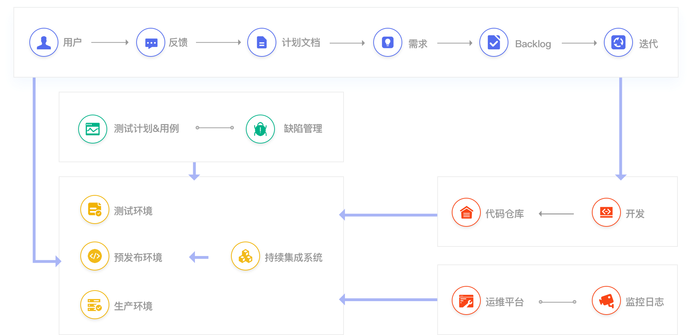
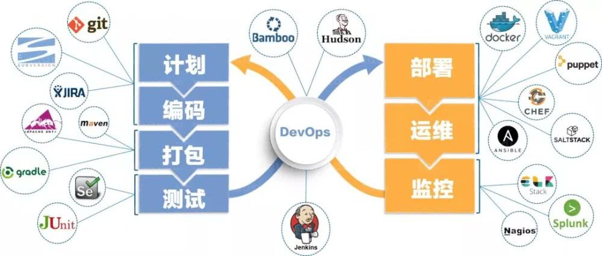
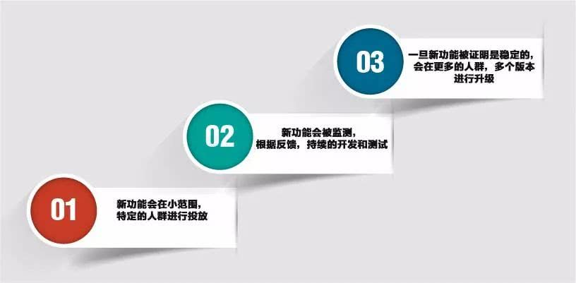

# 介绍

## 为什么大公司一定要使用 DevOps? 

究竟什么是DevOps? 要想回答这个问题，首先要明确DevOps这个过程参与的人员是谁？即开发团队和IT运维团队！那么，DevOps的意图是什么呢？即在两个团队之间，建立良好的沟通和协作，更快更可靠的创建高质量软件！

事实上，并不是这两个团队之间的协作帮助交付了更好的软件，而是“开发”和“运维”团队之间的统一导致了软件的改进，并以更快的速度交付。我们不要忘记DevOps工具在实现自动化方面所扮演的角色。

开发和运维“一体”的感觉是由开发人员和操作工程师之间的技能组合和实践的桥接以及自动化（DevOps）工具的实现引起的。 世界各地的大型互联网公司已采用DevOps方法来彻底改进其性能，安全性和团队动态。 

在本篇文章中，让我们看看什么是DevOps，为什么它如此重要！ 我们将首先跟踪导致DevOps的软件开发方法的演变，然后探索什么是DevOps及其生命周期，并通过评估世界顶级公司，来看看如何使用DevOps来获得益处。

## 软件开发的演变

多年来，DevOps从现有的软件开发策略/方法发展而来，以响应业务需求。让我们简要地看一下这些模型是如何演变的，以及它们最适合的场景。

缓慢而繁琐的瀑布模型演变成敏捷，开发团队在短时间内完成软件开发，持续时间甚至不超过两周。如此短的发布周期帮助开发团队处理客户反馈，并将其与bug修复一起合并到下一个版本中。

虽然这种敏捷的SCRUM方法为开发带来了敏捷性，但它在运维方面却失去了敏捷实践的速度。开发人员和运维工程师之间缺乏协作仍然会减慢开发过程和发布。

DevOps方法就是基于对更好的协作和更快的交付的需求而产生的。DevOps允许用较少复杂问题的持续软件交付来修复和更快地解决问题。

现在我们已经了解了DevOps的发展，让我们来详细看看DevOps是什么。

## 什么是DevOps?

DevOps是一种软件开发方法，涉及软件在整个开发生命周期中的持续开发，持续测试，持续集成，持续部署和持续监控。 这些活动只能在DevOps中实现，而不是敏捷或瀑布，这就是为什么顶级互联网公司选择DevOps作为其业务目标的前进方向。 DevOps是在较短的开发周期内开发高质量软件的首选方法，可以提高客户满意度。 

在不了解DevOps生命周期的情况下，对DevOps的理解也会片面化。现在让我们看看DevOps生命周期，并探讨它们如何与下图所示的软件开发阶段相关联。

**持续开发：**

这是DevOps生命周期中软件不断开发的阶段。与瀑布模型不同的是，软件可交付成果被分解为短开发周期的多个任务节点，在很短的时间内开发并交付。

这个阶段包括编码和构建阶段，并使用Git和SVN等工具来维护不同版本的代码，以及Ant、Maven、Gradle等工具来构建/打包代码到可执行文件中，这些文件可以转发给自动化测试系统进行测试。

**持续测试：**

在这个阶段，开发的软件将被持续地测试bug。对于持续测试，使用自动化测试工具，如Selenium、TestNG、JUnit等。这些工具允许质量管理系统完全并行地测试多个代码库，以确保功能中没有缺陷。

在这个阶段，使用Docker容器实时模拟“测试环境”也是首选。一旦代码测试通过，它就会不断地与现有代码集成。

**持续集成：**

这是支持新功能的代码与现有代码集成的阶段。由于软件在不断地开发，更新后的代码需要不断地集成，并顺利地与系统集成，以反映对最终用户的需求更改。更改后的代码，还应该确保运行时环境中没有错误，允许我们测试更改并检查它如何与其他更改发生反应。

Jenkins是一个非常流行的用于持续集成的工具。使用Jenkins，可以从git存储库提取最新的代码修订，并生成一个构建，最终可以部署到测试或生产服务器。可以将其设置为在Git存储库中发生更改时自动触发新构建，也可以在单击按钮时手动触发。

**持续部署：**

它是将代码部署到生产环境的阶段。在这里，我们确保在所有服务器上正确部署代码。如果添加了任何功能或引入了新功能，那么应该准备好迎接更多的网站流量。因此，系统运维人员还有责任扩展服务器以容纳更多用户。

由于新代码是连续部署的，因此配置管理工具可以快速，频繁地执行任务。 Puppet、Chef、SaltStack和Ansible是这个阶段使用的一些流行工具。

容器化工具在部署阶段也发挥着重要作用。Docker和Vagrant是流行的工具，有助于在开发、测试、登台和生产环境中实现一致性。除此之外，它们还有助于轻松扩展和缩小实例。

**持续监控：**

这是DevOps生命周期中非常关键的阶段，旨在通过监控软件的性能来提高软件的质量。这种做法涉及运营团队的参与，他们将监视用户活动中的错误/系统的任何不正当行为。这也可以通过使用专用监控工具来实现，该工具将持续监控应用程序性能并突出问题。

使用的一些流行工具是Splunk，ELK Stack，Nagios，NewRelic和Sensu。这些工具可帮助密切监视应用程序和服务器，以主动检查系统的运行状况。它们还可以提高生产率并提高系统的可靠性，从而降低IT支持成本。发现的任何重大问题都可以向开发团队报告，以便可以在持续开发阶段进行修复。

这些DevOps阶段连续循环进行，直到达到所需的产品质量。下面的图表将显示可以在DevOps生命周期的哪个阶段使用哪些工具。

既然我们已经确定了DevOps的重要性，并且了解了它的不同阶段以及所涉及的DevOps工具，现在让我们看看Facebook的一个案例研究，并理解为什么他们从敏捷转向DevOps。我们将采用Facebook曾推出的新特性的用例，这些新特性导致Facebook重新评估其产品交付并采用DevOps方法。

## **DevOps案例研究**

曾经，Facebook向遍布全球的若干亿用户推出了一系列新功能——时间轴，推荐和音乐功能。发布后Facebook上产生的巨大流量导致服务器崩溃， 推出的功能获得了用户的大规模超常规响应，这导致了新功能产生了不可控的结果，使他们没有预料到。

这导致了Facebook重新评估和战略调整，从而使Facebook推出了暗启动技术。使用DevOps原则，Facebook为其新版本的发布创建了以下方法。

**Facebook暗启动技术**

暗启动是在新功能完全发布给所有用户之前，逐步将新功能，推广到选定的一组用户的过程。这允许开发团队尽早获得用户反馈，测试错误，并且还可以测试基础架构性能。

这种发布方法是持续交付的直接结果，有助于实现更快，更迭代的版本，确保应用程序性能不会受到影响，并且用户可以很好地更新该版本。

在暗启动技术中，新功能通过专用的部署管道发布给小型用户群。在上面给出的Facebook暗启动图表中，可以看到只打开了一个部署管道，将新功能部署到一组选定用户。此时剩余的数百条管道全部关闭。

持续监视部署功能的特定用户群，以收集反馈并识别错误。这些错误和反馈将被纳入开发，测试和部署在同一用户群中，直到功能变得稳定。一旦实现稳定性，通过启用其他部署管道，将逐步在其他用户群上部署这些功能。

Facebook通过将代码包装在功能标记或功能切换中来实现此目的，该切换用于控制谁可以看到新功能以及何时查看。与此同时，模拟向用户启动代码的全部效果，在向用户开放全部功能之前，可以及早的暴露应用程序基础架构的痛点和区域，功能稳定后，将通过多个版本将其部署到其余用户。

通过这种方式，Facebook拥有一个受控或稳定的机制，可以为其庞大的用户群开发新功能。相反，如果功能没有得到很好的响应，他们可以选择完全回滚部署。这也帮助他们为部署准备服务器，因为他们可以预测网站上的用户活动，并相应地扩展服务器。

## **总结**

微信，淘宝，以及许多领先的科技巨头，在向所有人发布之前，都使用暗发布逐渐向一小部分用户发布和测试新功能。

DevOps的目的是更快速、更可靠地创建质量更好的软件，同时开发、运维团队之间进行更多的沟通和协作。它是一个自动化过程，允许快速、安全和高质量的软件开发和发布，同时保持所有利益相关者在一个循环中。这就是DevOps获得越来越多的大型互联网公司青睐的真正原因。

