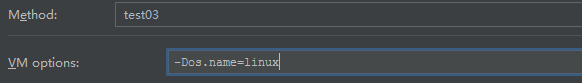

# Spring注解开发

## 一、为什么要使用Spring注解开发？

因为由于分布式、微服务的兴起以前的巨型单体项目由于配置繁琐，团队协作能力不好，修改后的需要进行大量的测试，等等暴露出了很多的问题，这是Spring团队又发布了Spring Boot产品，它用几乎零配置的方式，开箱即用，使用超级方便，在几秒内搭建一个简单的web服务已经成为现实，这也就表示以前用xml配置web服务的年代已经成为了历史，注解配置的方式成为主流，所以要想学好微服务，首先要学好Spring Boot，要学好Spring Boot，就要学好Spring注解的使用方式，所以从现在开始，要把Spring注解学到家。

### 1.1 xml方式配置Spring

在以前使用Spring时一直使用的时xml配置文件的方式使用Spring，例如如下这样：
首先在工程的类路径下新建一个xml配置文件，命名为applicationContext.xml，配置文件上方的是配置文件检查。

```xml
<?xml version="1.0" encoding="UTF-8"?>
<beans xmlns="http://www.springframework.org/schema/beans"
       xmlns:xsi="http://www.w3.org/2001/XMLSchema-instance"
       xsi:schemaLocation="http://www.springframework.org/schema/beans http://www.springframework.org/schema/beans/spring-beans.xsd">


    <bean id="person" class="com.meng.Person">
        <property name="name" value="张无忌" />
        <property name="age" value="20"/>
    </bean>
</beans>
```

稍微用过Spring的人都知道通过如上配置就可以吧Person类注入到Spring容器中，并初始化了相应的数据。然后就是pojo类：

```java
public class Person {
  private String name;
	private String age;
  // ...
}
```

最后就是main主函数初始化Spring容器，并加载配置文件，最后获取Spring容器中的bean。

```java
 public static void main(String[] args){
        ApplicationContext context = new ClassPathXmlApplicationContext("applicationContext.xml");
        Person person = (Person) context.getBean("person");
        System.out.println(person);
    }
```

*结果：*

```bash
信息: Loading XML bean definitions from class path resource [applicationContext.xml]
Person{name='孟兆坤', age='23'}
Process finished with exit code 0
```

从结果可以看出，我们的Person类已经成功注入到Spring容器中，在syso时，调用了Person类的toString方法，打印了Person类中的内容，上面只是一开始使用Spring最原始的使用方法，下面就要开始使用注解的方式配置使用Spring

### 1.2 注解的方式配置Spring

首先要配置一个配置类，这个配置类与刚才用到的配置文件的作用一致，都是起到的配置作用

```java
@Configuration
public class MainConfig {
    @Bean
    public Person person(){
        return  new Person("张无忌","23");
    }
}
```

上面的事例中在类上有一个注解@Configuration注解，只要在这个类上标注此注解，就表示这个类等同于applicationContext.xml，而方法上的@Bean就表示xml文件中的标签，返回值表示配置文件中class的类路径,**方法名**表示注入**类的id**。

```java
ApplicationContext context = new AnnotationConfigApplicationContext(MainConfig.class);
Person person = context.getBean(Person.class);
System.out.println(person);
```

这段代码表示使用注解的方式加载配置类，并获取注入类的信息。可以看出加载配置类放入的是注解类型，获取注入类时传入的也是注解类型。

要获取person类型的bean在容器中的id名称，可以用如下的方式

```java
ApplicationContext context = new AnnotationConfigApplicationContext(MainConfig.class);
Person person = context.getBean(Person.class);
System.out.println(person);
String[] names = context.getBeanNamesForType(Person.class);
 for(String name : names){
     System.out.println(name);
 }
```

可以看出getBeanNamesType()根据组件的类型获取组件在Spring容器中的id名称，打印结果：

```
...
Person{name='张无忌', age='23'}
person

Process finished with exit code 0
```

可以看出，容器中组件id名称就是person，如果更改方法的名称，id结果是否会变化。

```
...
Person{name='张无忌', age='23'}
person01

Process finished with exit code 0
```

可以看出，修改配置类的方法名称后，组件id发生了变化。如果我不想让方法名称与容器中的组件名称一致怎么办？

```java
@Configuration
public class MainConfig {
    @Bean("person")
    public Person person01(){
        return  new Person("张无忌","23");
    }
}
```

在注解bean中里加入字符串，因为默认是value，所以组件名称就不受方法名称的干扰了。打印结果：

```
...
Person{name='张无忌', age='23'}
person

```


## 二、组件添加

### 2.1 @Configuration

```java
@Configuration
public class MainConfig {
    @Bean
    public Person person(){
        return  new Person("张三","23");
    }
}
```

上面的事例中在类上有一个注解@Configuration注解，只要在这个类上标注此注解，就表示这个类等同于applicationContext.xml

```java
ApplicationContext context = new AnnotationConfigApplicationContext(MainConfig.class);
Person person = context.getBean(Person.class);
System.out.println(person);
```

这段代码表示使用注解的方式加载配置类，并获取注入类的信息。可以看出加载配置类放入的是注解类型，获取注入类时传入的也是注解类型。

### 2.2 @Bean

```java
@Configuration
public class MainConfig {
    @Bean
    public Person person(){
        return  new Person("张三","23");
    }
}
```

方法上的@Bean就表示xml文件中的标签，返回值表示配置文件中class的类路径,**方法名**表示注入**类的id**。

也可以通过自己指定组件ID

```java
@Configuration
public class MainConfig {
    @Bean("person")
    public Person person01(){
        return  new Person("张三","23");
    }
}
```

### 2.3 @ComponentScan

在配置类中写入如下注解就可以把指定包下的类注入到Spring。

```java
@Configuration
@ComponentScan("com.meng")
public class MainConfig {
    @Bean("person")
    public Person person(){
        return  new Person("张三","23");
    }
}
```

@Configuration注解上一节中说明了，表示这是一个注解类，@ComponentScan注解就表示将com.meng包下的所有标注@Controller,@Service,@Repository,@Component注解的类全部注入到Spring容器中。

**排除哪些类注入到spring容器中**

```java
@ComponentScan(value = "com.meng",excludeFilters = {
    @ComponentScan.Filter(
                   type = FilterType.ANNOTATION,classes = {
                            Controller.class,Service.class
                    }
    )
```

上边这段代码在配置类中，表示扫描的包范围在com.meng中，排除过滤器指定的类型是注解类型，整理一下，Filter下type指定过滤类型为注解类型，classes属性可以传入数组，它表示要过滤组件的具体类型，上面过滤的是控制器类型与服务类型。

```java
@Retention(RetentionPolicy.RUNTIME)
@Target({})
public @interface Filter {
  FilterType type() default FilterType.ANNOTATION;

  @AliasFor("classes")
  Class<?>[] value() default {};

  @AliasFor("value")
  Class<?>[] classes() default {};

  String[] pattern() default {};
}
```

从源码中可以看出classes属性时可以传入数组的。上面就是排除哪些类注入到Spring容器。同时也可以用只包含哪些类注入spring容器。

**只包含哪些类注入spring容器的方式**

```java
@Configuration
@ComponentScan(value = "com.meng",//excludeFilters = {
//    @ComponentScan.Filter(
//                    type = FilterType.ANNOTATION,classes = {
//                            Controller.class,Service.class
//                    }
//    )
      includeFilters = {
        @ComponentScan.Filter(
                type = FilterType.ANNOTATION,classes={Controller.class}
        )
      },useDefaultFilters = false
)
public class MainConfig {
    @Bean("person")
    public Person person(){
        return  new Person("张三","23");
    }
}
```

从上面可以看出，excludeFilters是排除，而includeFilters是只包含的意思。所以上面的意思是过滤类型是注解类型，具体的注解是只包含控制器的类型，但需要特别注意的是（**注意！注意！注意！**）重要的事情说三遍，一定要加useDefaultFilters，他表示spring容器注入的默认规则，spring容器注入的默认规则是true，要改成false，刚才的只包含过滤器才能生效。

**配置多个@ComponentScan**

如果配置多个的话就要用到ComponentScans，它可以配置多个ComponentScan

```java
@Configuration
@ComponentScan(value = "com.meng",//excludeFilters = {
//    @ComponentScan.Filter(
//                    type = FilterType.ANNOTATION,classes = {
//                            Controller.class,Service.class
//                    }
//    )
      includeFilters = {
        @ComponentScan.Filter(
                type = FilterType.ANNOTATION,classes={Controller.class}
        )
      },useDefaultFilters = false
)
@ComponentScans(
        value={
                @ComponentScan(value = "com.meng",
                        excludeFilters = {
                                @ComponentScan.Filter(
                                        type = FilterType.ANNOTATION,classes={Controller.class}
                                )
                        },useDefaultFilters = false
                ),
                @ComponentScan(value = "com.meng",
                        excludeFilters = {
                                @ComponentScan.Filter(
                                        type = FilterType.ANNOTATION,classes={Controller.class}
                                )
                        },useDefaultFilters = false
                )
        }
)
public class MainConfig {
    @Bean("person")
    public Person person(){
        return  new Person("张三","23");
    }
}
```

其中，@ComponentScans有一个value属性，可以接收一个数组，这个数组中就可以有多个@CompanentScan注解。

### 2.4 @Controller/@Service...

这几个注解作用都是将对象注入SpringBean容器，原则上使用哪个都行，但从规范来说还是推荐在不同层级使用对应的注解,如果按常用mvc结构划分：

| 层级      | 注解        |
| --------- | ----------- |
| WEB层     | @Controller |
| Service层 | @Service    |
| DAO层     | @Respsitory |
| 其它      | @Component  |

### 2.5 @Scope

@Scope注解是springIoc容器中的一个作用域，在 Spring IoC 容器中具有以下几种作用域：基本作用域**singleton（单例）**、**prototype(多例)**，Web 作用域（reqeust、session、globalsession），自定义作用域

| 模式              | 说明                                                         | 默认 |
| ----------------- | ------------------------------------------------------------ | ---- |
| singleton单例模式 | 全局有且仅有一个实例                                         | 默认 |
| prototype原型模式 | 每次获取Bean的时候会有一个新的实例                           |      |
| request           | request表示该针对每一次HTTP请求都会产生一个新的bean，同时该bean仅在当前HTTP request内有效 |      |
| session           | session作用域表示该针对每一次HTTP请求都会产生一个新的bean，同时该bean仅在当前HTTP session内有效 |      |
| globalsession     | global session作用域类似于标准的HTTP Session作用域，不过它仅仅在基于portlet的web应用中才有意义 |      |

这里我们只需要掌握 **singleton（单例）**、**prototype(多例)**两种即可，剩下的开发中基本用不到。

### 2.6 @Lazy

Spring IoC （ApplicationContext） 容器一般都会在启动的时候实例化所有单实例 bean 。如果我们想要 Spring 在启动的时候延迟加载 bean，即在调用某个 bean 的时候再去初始化，那么就可以使用 @Lazy 注解。

value 取值有 true 和 false 两个 默认值为 true

true 表示使用 延迟加载， false 表示不使用，false 纯属多余，如果不使用，不标注该注解就可以了。
Person 类

```java
public class Person {
    private String name;
    private Integer age;
 
    public Person() {
    }
 
    public Person(String name, Integer age) {
        System.out.println("对象被创建了.............");
        this.name = name;
        this.age = age;
    }
 
  // 省略 getter setter 和 toString 方法
}
```

配置类 不标注 @Lazy 注解

```java
public class LazyConfig {
    @Bean
    public Person person() {
        return new Person("李四", 55);
    }
}
```

测试

```java
@Test
public void test5() {
  ApplicationContext ctx = new AnnotationConfigApplicationContext(LazyConfig.class);
}
```

不获取 bean ， 看控制台是否会打印。如果有打印，代表调用了构造器。

结果

```
对象被创建了.............
Process finished with exit code 0
```

在配置类打上 @Lazy 注解

```java
public class LazyConfig {
    @Lazy
    @Bean
    public Person person() {
        return new Person("李四", 55);
    }
}
```

再来看输出结果

```

Process finished with exit code 0
```


没有打印语句，对象没有调用构造器，那么方法也就没有被创建。
@Lazy(value = false) 或者 @Lazy(false) 那么对象会在初始化的时候被创建

>**@Lazy注解注解的作用主要是减少springIOC容器启动的加载时间**
>
>**当出现循环依赖时，也可以添加@Lazy**


### 2.7 @Conditional

```java
@Configuration
public class MainConfig2 {
    /**
     * @see
     *     ConfigurableBeanFactory#SCOPE_PROTOTYPE
     * 	@see ConfigurableBeanFactory#SCOPE_SINGLETON
     * 	@see org.springframework.web.context.WebApplicationContext#SCOPE_REQUEST
     * 	@see org.springframework.web.context.WebApplicationContext#SCOPE_SESSION
     */
    //@Scope("prototype")
    //@Lazy
    @Bean
    public Person person(){
        System.out.println("person类被初始化了...");
        return new Person("张三","27");
    }

    /**
     * Conditional：按照一定的条件进行判断，满足条件给容器中注册bean
     * 如果系统是linux就给容器注册林纳斯，
     * 如果系统是windows就给容器注册比尔盖茨.
     * @return
     */
    @Conditional({WindowsCondition.class})
    @Bean
    public Person bill(){
        return new Person("比尔盖茨","60");
    }
    @Conditional({LinuxCondtition.class})
    @Bean
    public Person linus(){
        return new Person("林纳斯","50");
    }
}
```

首先先在配置类中注入两个bean，一个windows，一个linux。

```java
/**
 * 判断操作系统是否windows
 */
public class WindowsCondition implements Condition {
    //ConditionContext 判断条件能使用的上下文环境
    //AnnotatedTypeMetadata 获取当前标注了Conditional注解的注释信息
    public boolean matches(ConditionContext context, AnnotatedTypeMetadata metadata) {
        //可以获取当前ioc使用的beanFactory
        ConfigurableListableBeanFactory beanFactory = context.getBeanFactory();
        //获取类加载器
        ClassLoader classLoader = context.getClassLoader();
        //获取上下文环境变量
        Environment environment = context.getEnvironment();
        //获取bean定义系统，可以用它注册bean，移除bean
        BeanDefinitionRegistry registry = context.getRegistry();
        String systemName = environment.getProperty("os.name");
        if (systemName.contains("Windows")) {
            return true;
        }
        return false;
    }
}
```

```java
/**
 * 判断操作系统是否linux
 */
public class LinuxCondtition implements Condition {
    public boolean matches(ConditionContext context, AnnotatedTypeMetadata metadata) {
        //获取上下文环境变量
        Environment environment = context.getEnvironment();
        if(environment.getProperty("os.name").contains("linux")){
            return true;
        }
        return false;
    }
}
```

上面的两个是根据当前环境的上下文判断向spring容器注入哪个bean，代码片段中有详细注释各个方法的作用。

```java
@Test
public void test03(){
  ApplicationContext context = new AnnotationConfigApplicationContext(MainConfig2.class);
  String[] names = context.getBeanNamesForType(Person.class);
  for(String name : names){
    System.out.println(name);
  }
  Map<String,Person> map = context.getBeansOfType(Person.class);
  System.out.println(map);
}
```

获取当前spring容器中类型为person的所有id名称，并获取当前spring容器中person类型的所有详细数据信息。

运行打印结果：

```
person类被初始化了...
person
bill
{person=Person{name='张三', age='27'}, bill=Person{name='比尔盖茨', age='60'}}

Process finished with exit code 0

```

可以看出由于当前系统是windows，所以比尔盖茨被注册到spring容器中

然后我们修改java虚拟机参数，将其设置为linux。



然后再次运行，打印结果：

```
person类被初始化了...
person
linus
{person=Person{name='张三', age='27'}, linus=Person{name='林纳斯', age='50'}}

Process finished with exit code 0

```

可以看出林纳斯被注册到spring容器中。
如果@Conditional被注册在类上，就表示复核当前条件的话，person，linux，windows都被注册到spring容器中。

### 2.7 @Import

spring注册bean的方式有许多种，我们尝试了许多种方式，现在要实验一下新的注册方式，使用@Import注解注册一个bean到spring容器中。

```java
public class Color {
}
```

首先创建一个空类，我们的任务就是要把这个Color类注册到Spring容器中。

```java
@Configuration
@Import(Color.class)
public class MainConfig {

}
```

这个是主配置类，我们用了@Import注解注入了一个Color对象

```java
@Test
public void test001(){
  ApplicationContext context = new AnnotationConfigApplicationContext(MainConfig.class);
  String[] names = context.getBeanDefinitionNames();
  for(String name : names){
    System.out.println(name);
  }
}

```

运行测试类打印结果：

```java
org.springframework.context.annotation.internalConfigurationAnnotationProcessor
org.springframework.context.annotation.internalAutowiredAnnotationProcessor
org.springframework.context.annotation.internalRequiredAnnotationProcessor
org.springframework.context.annotation.internalCommonAnnotationProcessor
org.springframework.context.event.internalEventListenerProcessor
org.springframework.context.event.internalEventListenerFactory
mainConfig
com.meng.Color

Process finished with exit code 0

```

由此可以看出，Color类被注册到spring容器中，所以@Import也是可以实现bean的注入的，但是需要注意Import注解也是可以接收一个数组参数的，所以在import里可以传入一个数组集合。

### 2.8 FactoryBean

在这之前，如果一个类要注入到spring容器，是spring在启动时调用类的空构造方法，加载类并注入到spring容器，但是现在的FactoryBean是在容器启动时，调用FactoryBean的getObject方法加载这个类，所以它和以前的注入spring容器的方式还是有区别的。

FactoryBean是一个接口，子类需实现其三个方法：

- getObject()：获取对象，必须重写
- getObjectType()：获取对象类型，必须重写
- isSingleton()：是否单例，可以重写

```java
public class MyPersonFactoryBean implements FactoryBean<Person> {
 
	public Person getObject() throws Exception {
		return new Person("小吴",23);
	}
 
	public Class<?> getObjectType() {
		return Person.class;
	}
 
	/**
	 * true:单例
	 * false:每次获取都重新创建新实例
	 */
	public boolean isSingleton() {
		return true;
	}
 
}
```

 容器中注册工厂Bean:

```java
@Configuration
public class MainConfig {
	
	@Bean
	public MyPersonFactoryBean myPersonFactoryBean(){
		return new MyPersonFactoryBean();
	}
}
```

测试会发现在容器中获取id为myPersonFactoryBean的Bean的实例的类型是Person：说明将工厂Bean注册后获取的对象其实是工厂Bean的getObject()方法返回的实例，那如果想获取MyPersonFactoryBean类型的实例呢？在id的前面加个**&**即可

### 2.9 Bean初始化和销毁方法

Spring提供了三种方式来指定Bean的初始化和销毁方法：

**采用initMethod与destoryMethod的方式**

```java
public class Blue {

    public Blue(){
        System.out.println("Blue被加载到spring容器中了...");
    }

    public void init(){
        System.out.println("Blue init方法启动了...");
    }

    public void destory(){
        System.out.println("Blue xiaohui方法启动了...");
    }
}
```

在Blue类中写入默认构造器，初始化方法和销毁方法。

```java
@Configuration
public class MainConfig4 {
//    @Bean
//    public MyBeanFactory beanFactory(){
//        return new MyBeanFactory();
//    }
    @Bean(initMethod = "init",destroyMethod = "destory")
    public Blue blue(){
        return new Blue();
    }

}
```

然后我们在配置类中将Blue类注入到spring容器，在@Bean注解中有一个initMethod和destoryMethod属性，这两个属性控制着Blue类在注入容器后初始化调用我们上面定义的方法，销毁调用我们上面定义的销毁方法。 查看打印结果：

```

Blue被加载到spring容器中了...
Blue init...


mainConfig4
blue
Blue destory...

Process finished with exit code 0

```


**实现InitializingBean与DisposableBean 两个接口，重写destroy与afterPropertiesSet方式**

```java
@Component
public class Black implements InitializingBean,DisposableBean {

    public Black(){
        System.out.println("black构造器被调用了....");
    }


    public void destroy() throws Exception {
        System.out.println("black destroy ...");
    }

    public void afterPropertiesSet() throws Exception {
        System.out.println("black afterPropertiesSet ...");
    }
}
```

创建一个black类实现了InitializingBean与DisposableBean 两个接口，重写destroy与afterPropertiesSet两个方法，外加一个空构造。

**使用@PostConstruct和@PreDestory注解方式**（推荐使用）

```java
@Component
public class Dog {
    public Dog(){
        System.out.println("Dog 默认构造器加载了...");
    }
    @PostConstruct
    public void init(){
        System.out.println("Dog @PostConstruct ...");
    }
    @PreDestroy
    public void destory(){
        System.out.println("Dog destory ...");
    }
}
```

- @PostConstruct注解表示bean被创建，**属性被赋值后**进行调用初始化操作

- @PreDestroy注释表示spring容器关闭前对bean的逻辑操作。


**注意：**我们可以自定义bean初始化以及销毁时的额外逻辑，但是在多实例情况下，spring不会调用销毁方法。

### 2.10 Bean的后置处理器

后置处理器粒度要比之前的初始化和销毁方法小，它是在bean**初始化方法调用前后**做相关的操作。

```java
/**
 * Bean后置处理器
 */
@Component
public class MyBeanPostProessor implements BeanPostProcessor{

    /**
     * 参数bean就是我们注册的实例，beanName就是实例的名称。
     * 返回值可以返回参数bean，也可以把参数bean包装后进行返回。
     * 后置处理器是在初始化方法调用时的前后添加相关操作的。
     * postProcessBeforeInitialization在我们以前学过的JSR250、initMethod方法之前调用。
     * 而postProcessAfterInitialization是在之后调用。
     */
    public Object postProcessBeforeInitialization(Object bean, String beanName) throws BeansException {
        System.out.println("postProcessBeforeInitialization  ....."+beanName);
        return bean;
    }

    public Object postProcessAfterInitialization(Object bean, String beanName) throws BeansException {
        System.out.println("postProcessAfterInitialization  ....."+beanName);
        return bean;
    }
}
```

其中postProcessBeforeInitialization是在初始化之前调用，postProcessAfterInitialization在初始化之后调用。


## 三、组件赋值

### 3.1 @Autowired&@Qualifier

@AutoWired自动装配默认是按类型匹配的，**当且仅有一个**匹配的Bean时，spring将其注入到@AutoWired标注的变量中

如果有多个实现，需要使用@Qualifier指定具体bean名称

```java
//在UserDaoImpl类中
@Component("userDao1")
public class UserDaoImpl implements UserDao {

    public void addUser() {
        System.out.println("添加用户");
    }
}

//在UserDaoImpl2类中
@Component("userDao2")
public class UserDaoImpl2 implements UserDao {
    public void addUser() {
        System.out.println("添加新的学生");
    }
}

//这样配置没指定bean名称是会出错的
@Autowired
private UserDao userDao;

//所以要@Qualifier指定bean名称
@Autowired
@Qualifier("userDao1")
private UserDao userDao;
```

### 3.2 @Resource

@Resource和@Autowired注解都是用来实现依赖注入的。只是@AutoWried按by type自动注入，而@Resource默认按byName自动注入。

**@Resource有两个重要属性，分别是name和type**

- 既不指定name属性，也不指定type属性，则自动按byName方式进行查找。如果没有找到符合的bean，则回退为一个原始类型进行查找，如果找到就注入。**此时的name值是配置bean里的name属性指定的值，而不是id的值**
- 只是指定了@Resource注解的name，则按name后的名字去bean元素里查找有与之相等的name属性的bean，找不到抛出异常
- 只指定@Resource注解的type属性，则从上下文中找到类型匹配的唯一bean进行装配，找不到或者找到多个，都会抛出异常
- 既指定了@Resource的name属性又指定了type，则从Spring上下文中找到唯一匹配的bean进行装配，找不到则抛出异常

### 3.3 @ImportResource

指示包含要导入的bean定义的一个或多个资源。它的功能比较像`@Import`注解，就是向容器内导入Bean。只是`@ImportResource`它导入的是一个xml配置文件，然后通过解析xml文件的方式再把解析好的Bean信息导入到Spring容器内。

`我个人认为`：这个注解它是Spring拿出来的一个过渡性产品，因为Spring3.0推荐使用全注解驱动后，所有的`Bean`都完全可以用注解来代替了。**而Spring提供这个注解主要是为了向下兼容，便于老项目进行迁移。**

### 3.4 @PropertySource

`Spring`框架提供了`PropertySource`注解，目的是加载指定的`属性`文件。这个注解是非常具有实际意义的，特别是在SpringBoot环境下，意义重大

由于SpringBoot默认情况下它会去加载classpath下的application.properties文件，所以我看大绝大多数开发者是这么干的：把所有的配置项都写在这一个配置文件里
这是非常不好的习惯，非常容易造成配置文件的臃肿，不好维护到最后的不能维护。

比如我们常见的一些配置：jdbc的、redis的、feign的、elasticsearch的等等他们的边界都是十分清晰的，因此Spring提供给我们这个注解，能让我们很好的实现隔离性。

> 备注：此注解是Spring3.1后提供的，并不属于Spring Boot


我有一个数据库的配置文件：`jdbc.properties`

```properties
## 配置db数据库相关信息
datasource.drivername=com.mysql.jdbc.Driver
datasource.username=vipkid_xb
datasource.password=jmdneyh4m2UT
datasource.url=jdbc:mysql://localhost:3316/test?zeroDateTimeBehavior=convertToNull

#### 连接池相关
datasource.maximum-pool-size=10
datasource.auto-commit=true
datasource.connection-test-query=SELECT 1
datasource.connectionTimeout=20000
datasource.maxLifetime=180000

```


我们可以这么使用它：采用Spring支持的`@Value`获取值

```java
@Configuration
@PropertySource(value = "classpath:jdbc.properties", name = "jdbc-config", ignoreResourceNotFound = false, encoding = "UTF-8")
public class JdbcConfig implements TransactionManagementConfigurer {

    @Value("${datasource.username}")
    private String userName;
    @Value("${datasource.password}")
    private String password;
    @Value("${datasource.url}")
    private String url;


    // 此处只是为了演示 所以不用连接池了===========生产环境禁止这么使用==========
    @Bean
    public DataSource dataSource() {
        MysqlDataSource dataSource = new MysqlDataSource();
        dataSource.setUser(userName);
        dataSource.setPassword(password);
        dataSource.setURL(url);
        return dataSource;
    }
}
```

其实大多数时候如果你是`SpringBoot环境`，我建议采用下面这种更优雅的方式，来处理`某一类`（请保证这一类拥有共同的前缀）属性值：`@ConfigurationProperties`

```java
@Configuration
@PropertySource(value = "classpath:jdbc.properties", name = "jdbc-config", ignoreResourceNotFound = false, encoding = "UTF-8")
@ConfigurationProperties(prefix = "datasource")
public class JdbcConfig implements TransactionManagementConfigurer {

    private String username;
    private String password;
    private String url;


    public void setUsername(String username) {
        this.username = username;
    }
    public void setPassword(String password) {
        this.password = password;
    }
    public void setUrl(String url) {
        this.url = url;
    }

    // 此处只是为了演示 所以不用连接池了===========生产环境禁止这么使用==========
    @Bean
    public DataSource dataSource() {
        MysqlDataSource dataSource = new MysqlDataSource();
        dataSource.setUser(username);
        dataSource.setPassword(password);
        dataSource.setURL(url);
        return dataSource;
    }
}
```

另外，直接把`@ConfigurationProperties`注解放在@Bean上，赋值极其方便

```java
@Configuration
@PropertySource(value = "classpath:jdbc.properties", name = "jdbc-config", ignoreResourceNotFound = false, encoding = "UTF-8")
public class JdbcConfig implements TransactionManagementConfigurer {

    @ConfigurationProperties(prefix = "datasource")
    @Bean
    public DataSource dataSource() {
        //dataSource.setUser(username);
        //dataSource.setPassword(password);
        //dataSource.setURL(url);
        return new MysqlDataSource();
    }
}
```

>备注：SpringBoot下此种写法不区分大小写，驼峰，-，_等书写形式都是兼容的。但是你的字母必须对应上啊，比如上面的user你不能写成username了。比如我这样写：datasource.u-r-l=xxx也是能够被正常识别的

### 3.5 @Profile

 Spring为我们提供的可以根据当前环境，动态的激活和切换一系列组件的功能；

开发环境develop、测试环境test、生产环境master
数据源：(/dev) (/test) (/master)

@Profile:指定组件在哪个环境的情况下才能被注册到容器中，不指定，任何环境下都能注册这个组件

 1) 加了环境标识的bean，只有这个环境被激活的时候才能注册到容器中。默认是default环境
 2) 写在配置类上，只有是指定的环境的时候，整个配置类里面的所有配置才能开始生效

```java
package com.spring.config;
 
import java.beans.PropertyVetoException;
 
import javax.sql.DataSource;
 
import org.springframework.beans.factory.annotation.Value;
import org.springframework.context.EmbeddedValueResolverAware;
import org.springframework.context.annotation.Bean;
import org.springframework.context.annotation.Configuration;
import org.springframework.context.annotation.Profile;
import org.springframework.context.annotation.PropertySource;
import org.springframework.util.StringValueResolver;
 
import com.mchange.v2.c3p0.ComboPooledDataSource;
 
/**
 * Profile:
 * 		Spring为我们提供的可以根据当前环境，动态的激活和切换一系列组件的功能；
 * 
 * 开发环境develop、测试环境test、生产环境master
 * 数据源：(/dev) (/test) (/master)
 *
 * @Profile:指定组件在哪个环境的情况下才能被注册到容器中，不指定，任何环境下都能注册这个组件
 * 
 * 1) 加了环境标识的bean，只有这个环境被激活的时候才能注册到容器中。默认是default环境
 * 2) 写在配置类上，只有是指定的环境的时候，整个配置类里面的所有配置才能开始生效
 * 
 */
@PropertySource("classpath:/dbconfig.properties")
@Configuration
public class MainConfigOfProfile implements EmbeddedValueResolverAware{
	
	@Value("${db.user}")
	private String user;
	
	private String driverClass;
	
	@Profile("default")
	@Bean("test")
	public DataSource testDataSource(@Value("${db.password}")String password) throws PropertyVetoException {
		ComboPooledDataSource dataSource = new ComboPooledDataSource();
		dataSource.setUser(user);
		dataSource.setPassword(password);
		dataSource.setDriverClass(driverClass);
		return dataSource;
	}
	
	@Profile("dev")
	@Bean("dev")
	public DataSource devDataSource(@Value("${db.password}")String password) throws PropertyVetoException {
		ComboPooledDataSource dataSource = new ComboPooledDataSource();
		dataSource.setUser(user);
		dataSource.setPassword(password);
		dataSource.setDriverClass(driverClass);
		return dataSource;
	}
	
	@Profile("master")
	@Bean("master")
	public DataSource masterDataSource(@Value("${db.password}")String password) throws PropertyVetoException {
		ComboPooledDataSource dataSource = new ComboPooledDataSource();
		dataSource.setUser(user);
		dataSource.setPassword(password);
		dataSource.setDriverClass(driverClass);
		return dataSource;
	}
 
	public void setEmbeddedValueResolver(StringValueResolver resolver) {
		String driverClass = resolver.resolveStringValue("${db.driverClass}");
		this.driverClass = driverClass;
	}
 
}
```

测试

```java
package com.spring.test;
 
import java.util.Arrays;
 
import javax.sql.DataSource;
 
import org.junit.Test;
import org.springframework.context.annotation.AnnotationConfigApplicationContext;
 
import com.spring.config.MainConfigOfProfile;
 
 
public class IOCTestProfile {
	//1. 使用命令行动态参数：在虚拟机参数位置加载 -Dspring.profiles.active=test
	//2. 使用代码的方式激活某种环境；
	@Test
	public void test01() {
		AnnotationConfigApplicationContext applicationContext = new AnnotationConfigApplicationContext(MainConfigOfProfile.class);
		//1. 创建一个applicationContext
		//2. 设置需要激活的环境
		applicationContext.getEnvironment().setActiveProfiles("dev","master");
		//3. 注册主配置类
		applicationContext.register(MainConfigOfProfile.class);
		//4. 启动刷新容器
		applicationContext.refresh();
		
		String[] beanNamesForType = applicationContext.getBeanNamesForType(DataSource.class);
		System.out.println(Arrays.toString(beanNamesForType));
		
		applicationContext.close();
	}
 
 
        @Test
	public void test02() {
		AnnotationConfigApplicationContext applicationContext = new AnnotationConfigApplicationContext(MainConfigOfProfile.class);
		
		String[] beanNamesForType = applicationContext.getBeanNamesForType(DataSource.class);
		System.out.println(Arrays.toString(beanNamesForType));
		
		applicationContext.close();
	}
}
```

