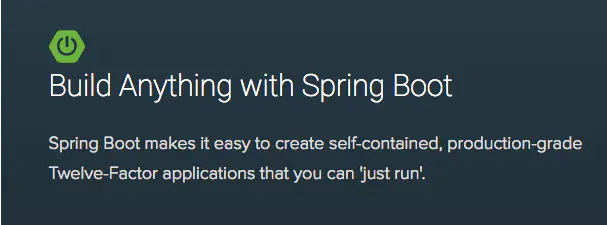

# Spring Boot简介

[Spring Boot 参考文档](https://docs.spring.io/spring-boot/docs/2.4.0/reference/html/index.html)

SpringBoot让创建独立的，生产环境的基于Spring的应用更加快捷简易。 大部分Spring Boot Application只要一些极简的配置，即可“一键运行”。

Spring Boot，简单讲就是牺牲项目的自由度来减少配置的复杂度（“契约式编程”思想，SpringBoot自动配置方案的指导思想）。约定一套规则，把这些框架都自动配置集成好，从而达到“开箱即用”。同时，也支持自由配置。这就是一个非常好的方案了。

**SpringBoot的特性**

- 创建独立的Spring applications
- 能够使用内嵌的Tomcat, Jetty or Undertow，不需要部署war
- 提供定制化的starter poms来简化maven配置（gradle相同）
- 追求极致的自动配置Spring
- 提供一些生产环境的特性，比如特征指标，健康检查和外部配置。
- 零代码生成和零XML配置

Spring由于其繁琐的配置，一度被人认为“配置地狱”，各种XML、Annotation配置，让人眼花缭乱，而且如果出错了也很难找出原因。而Spring Boot更多的是采用Java Config的方式，对Spring进行配置。

我们企业级软件的目标是提供稳定健壮的服务，以实现其商业价值。为了满足这些需求，服务开发者需要能够快速构建和迭代新的应用，同时应用的架构是可扩展的，便携式的，富弹性的，可以进行频繁的更新。SpringBoot正式为此而诞生。