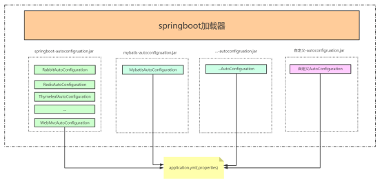

# SpringBoot 基础篇


## 一、环境准备

jdk1.8：Spring Boot 推荐jdk1.8及以上；

maven3.x：maven 3.3以上版本；

IntelliJIDEA2019；

SpringBoot 2.3.0.RELEASE；

### 1.1 MAVEN 设置

1. 配置阿里云镜像

   ```xml
   <mirror>  
       <id>nexus-aliyun</id>  
       <mirrorOf>central</mirrorOf>    
       <name>Nexus aliyun</name>  
       <url>http://maven.aliyun.com/nexus/content/groups/public</url>  
   </mirror>
   ```

2. 给maven 的settings.xml配置文件的profiles标签添加

   ```xml
   <profile>
       <id>jdk-1.8</id>
       <activation>
           <activeByDefault>true</activeByDefault>
           <jdk>1.8</jdk>
       </activation>
       <properties>
           <maven.compiler.source>1.8</maven.compiler.source>
           <maven.compiler.target>1.8</maven.compiler.target>
           <maven.compiler.compilerVersion>1.8</maven.compiler.compilerVersion>
       </properties>
   </profile>
   ```

### 1.2 IDEA 设置

1. 指定 JDK 环境

   

2. 指定MAVEN环境

   


## 二、自动装配

### 2.1 默认扫描器 basepackage

springboot的主启动类所在的package就是扫描器的basepackage

如图所示com.example.myapplication就是我们的扫描器中basepackge


### 2.2 源码解析

@AutoConfigurationPackage 自动配置包负责basepackge的注册


让我们进入AutoConfigurationPackages.Registrar，通过register的调用来注册basepackage的bean定义的


进入到PackageImports，获得basepackge设置给packageNames


回到上一层进入到register，创建bean的定义并且把packageNames设置给bean定义,然后把bean定义的做注册。


### 2.3 自动配置

springboot扫描当前classpath下所有的jar包，筛选出来EnableAutoConfiguration下的所有自动配置类注入到spring容器中，完成自动的bean的配置。




## 三、热部署

在实际开发过程中，每次修改代码就得将项目重启，重新部署，对于一些大型应用来说，重启时间需要花费大量的时间成本。对于一个后端开发者来说，重启过程确实很难受啊。在 Java 开发领域，热部署一直是一个难以解决的问题，目前的 Java 虚拟机只能实现方法体的修改热部署，对于整个类的结构修改，仍然需要重启虚拟机，对类重新加载才能完成更新操作。下面我们就看看对于简单的类修改的热部署怎么实现。

### 3.1 原理

深层原理是使用了两个ClassLoader，一个Classloader加载那些不会改变的类（第三方Jar包），另一个ClassLoader加载会更改的类，称为restart ClassLoader,这样在有代码更改的时候，原来的restart ClassLoader 被丢弃，重新创建一个restart ClassLoader，由于需要加载的类相比较少，所以实现了较快的重启时间。

### 3.2 devtools 工具包

**devtools**：是boot的一个热部署工具，当我们修改了classpath下的文件（包括类文件、属性文件、页面等）时，会重新启动应用（由于其采用的双类加载器机制，这个启动会非常快，如果发现这个启动比较慢，可以选择使用jrebel）

- 双类加载器机制：boot使用了两个类加载器来实现重启（restart）机制：**base类加载器**（简称bc）、**restart类加载器**（简称rc）
  - bc：用于加载不会改变的jar（第三方依赖的jar）
  - rc：用于加载我们正在开发的jar（整个项目里我们自己编写的类）。当应用重启后，原先的rc被丢掉、重新new一个rc来加载这些修改过的东西，而bc却不需要动一下。这就是devtools重启速度快的原因。


**POM集成**


*下面这一步，我自己测试发现是不需要设置的。但是有网友说需要设置才生效，这个看个人情况，酌情设置。*


**IDEA工具启动自动编译功能**


**IDEA 设置为在程序运行过程中，依然允许自动编译**

操作： ctrl + shift + alt + /，选择Registry，勾选勾上 Compiler autoMake allow when app running


执行完上述的操作步骤后，我们的devtools热部署集成就完成了。

**补充说明**：

- *默认情况下，/META-INF/maven，/META-INF/resources，/resources，/static，/templates，/public这些文件夹下的文件修改不会使应用重启，但是会重新加载（devtools内嵌了一个LiveReload server，当资源发生改变时，浏览器刷新）。*
- *如果想改变默认的设置，可以自己设置不重启的目录：spring.devtools.restart.exclude=static/**,public/**，这样的话，就只有这两个目录下的文件修改不会导致restart操作了。*
- *如果要在保留默认设置的基础上还要添加其他的排除目录：spring.devtools.restart.additional-exclude*
- *如果想要使得当非classpath下的文件发生变化时应用得以重启，使用：spring.devtools.restart.additional-paths，这样devtools就会将该目录列入了监听范围*。

## 四、配置文件

### 4.1 配置文件位置

springboot 启动会扫描以下位置的application.properties或者application.yml文件作为Spring boot的默认配置文件

- –file:./config/

- –file:./ 项目的跟路径，如果当前的项目有父工程，配置文件要放在父工程 的根路径

- –classpath:/config/

- –classpath:/

优先级由高到底，高优先级的配置会覆盖低优先级的配置；

SpringBoot会从这四个位置全部加载主配置文件；互补配置；

如果我们的配置文件名字不叫application.properties或者application.yml，可以通过以下参数来指定配置文件的名字，myproject是配置文件名

```shell
$ java -jar myproject.jar --spring.config.name=myproject
```

我们同时也可以指定其他位置的配置文件来生效

```shell
$ java -jar myproject.jar --spring.config.location=classpath:/default.properties,classpath:/override.properties
```

### 4.2 yaml

 yml是YAML（YAML Ain't Markup Language）语言的文件，以数据为中心，比properties、xml等更适合做配置文件

- yml和xml相比，少了一些结构化的代码，使数据更直接，一目了然。

- 相比properties文件更简洁

#### 4.2.1 yaml 语法

以空格的缩进程度来控制层级关系。空格的个数并不重要，只要左边空格对齐则视为同一个层级。且大小写敏感。支持字面值，对象，数组三种数据结构，也支持复合结构。

- 字面值：字符串，布尔类型，数值，日期。字符串默认不加引号，单引号会转义特殊字符。日期格式支持yyyy/MM/dd HH:mm:ss

- 对象：由键值对组成，形如 key:(空格)value 的数据组成。冒号后面的空格是必须要有的，每组键值对占用一行，且缩进的程度要一致，也可以使用行内写法：{k1: v1, ....kn: vn}

- 数组：由形如 -(空格)value 的数据组成。短横线后面的空格是必须要有的，每组数据占用一行，且缩进的程度要一致，也可以使用行内写法： [1,2,...n]

- 复合结构：上面三种数据结构任意组合

#### 4.2.2 yaml 的使用

创建一个Spring Boot 的全局配置文件 application.yml，配置属性参数。主要有字符串，带特殊字符的字符串，布尔类型，数值，集合，行内集合，行内对象，集合对象这几种常用的数据格式。

```yaml
yaml:
  str: 字符串可以不加引号
  specialStr: "双引号直接输出\n特殊字符"
  specialStr2: '单引号可以转义\n特殊字符'
  flag: false
  num: 666
  Dnum: 88.88
  list:
    - one
    - two
    - three
  set: [1,2,2,3]
  map: {k1: v1, k2: v2}
  positions:
    - name: txjava
      salary: 15000.00
    - name: liangge
      salary: 18888.88
```

创建实体类YamlEntity.java 获取配置文件中的属性值，通过注解@ConfigurationProperties获取配置文件中的指定值并注入到实体类中。

```java
@Component
@ConfigurationProperties(prefix = "yaml")
public class YamlEntity {

    // 字面值，字符串，布尔，数值
    private String str; // 普通字符串
    private String specialStr; // 转义特殊字符串
    private String specialStr2;// 输出特殊字符串
    private Boolean flag;   // 布尔类型
    private Integer num;    // 整数
    private Double dNum;    // 小数

    // 数组，List和Set，两种写法： 第一种：-空格value，每个值占一行，需缩进对齐；第二种：[1,2,...n] 行内写法
    private List<Object> list;  // list可重复集合
    private Set<Object> set;    // set不可重复集合

    // Map和实体类，两种写法：第一种：key空格value，每个值占一行，需缩进对齐；第二种：{key: value,....} 行内写法
    private Map<String, Object> map; // Map K-V
    private List<Position> positions;  // 复合结构，集合对象

    // 省略getter，setter，toString方法
```

#### 4.2.3 总结

- 字符串可以不加引号，若加双引号则输出特殊字符，若不加或加单引号则转义特殊字符；

- 数组类型，短横线后面要有空格；对象类型，冒号后面要有空格；

- YAML是以空格缩进的程度来控制层级关系，但不能用tab键代替空格，大小写敏感；

- yaml的缺点是可读性比较差


### 4.3 属性绑定

前面给大家讲了yaml的语法和绑定注入给实体类，那我们平时在工作中多数是在通过实体类来写yaml的配置。属性的绑定我们必须要提供set方法

提供一段来自官网的代码：

```java
@Component
@ConfigurationProperties("acme")
public class AcmeProperties {

    private boolean enabled;

    private InetAddress remoteAddress;

    private final Security security = new Security();

    public boolean isEnabled() {
        return enabled;
    }
    
    public void setEnabled(boolean enabled) {
        this.enabled = enabled;
    }

    public InetAddress getRemoteAddress() {
        return remoteAddress;
    }

    public void setRemoteAddress(InetAddress remoteAddress) {
        this.remoteAddress = remoteAddress;
    }

    public Security getSecurity() {
        return security;
    }

    public static class Security {

        private String username;

        private String password;

        private List<String> roles = new ArrayList<>(Collections.singleton("USER"));

        public String getUsername() {
            return username;
        }

        public void setUsername(String username) {
            this.username = username;
        }

        public String getPassword() {
            return password;
        }

        public void setPassword(String password) {
            this.password = password;
        }

        public List<String> getRoles() {
            return roles;
        }
     	public void setRoles(List<String> roles) {
            this.roles = roles;
        }
    }
}
```

为了让当前的实体类能在配置文件中有对应的提示，我们需要引入如下的依赖， 

```xml
<dependency>
    <groupId>org.springframework.boot</groupId>
    <artifactId>spring-boot-configuration-processor</artifactId>
    <optional>true</optional>
</dependency>
```

加完依赖后通过Ctrl+F9来使之生效。


在配置文件中加入


然后我们测试绑定的情况。

在属性绑定的方式里，我们是通过set方法来完成的，我们可以借助Lombok来给我们带来方便。

我们在父工程中引入Lombok的依赖：

```xml
<dependency>
    <groupId>org.projectlombok</groupId>
    <artifactId>lombok</artifactId>
    <version>1.16.20</version>
</dependency>
```

修改属性类：加上@Data注解，然后测试结果相同。

```java
@Data
@Component
@ConfigurationProperties("acme")
public class AcmeProperties {

    private boolean enabled;

    private InetAddress remoteAddress;

    private final Security security = new Security();

    
    @Data
    public static class Security {

        private String username;

        private String password;

        private List<String> roles = new ArrayList<>(Collections.singleton("USER"));

        
    }
}
```

### 4.4 构造器绑定

让我们采用构造器的方式来定义

```java
@ConfigurationProperties("acme")
@ConstructorBinding
public class AcmeProperties {

    private boolean enabled;

    private InetAddress remoteAddress;

    private final Security security ;

    public AcmeProperties(boolean enabled, InetAddress remoteAddress, Security security) {
        this.enabled = enabled;
        this.remoteAddress = remoteAddress; 
        this.security = security;
    }

    public boolean isEnabled() {
        return enabled;
    }

    public InetAddress getRemoteAddress() {
        return remoteAddress;
    }

    public Security getSecurity() {
        return security;
    }

    public static class Security {

        private String username;

        private String password;

        private List<String> roles;

        public Security(String username, String password,
                        @DefaultValue("USER") List<String> roles) {
            this.username = username;
            this.password = password;
            this.roles = roles;
        }

        public String getUsername() {
            return username;
        }

        public String getPassword() {
            return password;
        }

        public List<String> getRoles() {
            return roles;
        }
    }
}
```

要使用构造函数绑定，必须使用 @EnableConfigurationProperties 或配置属性扫描启用类。不能对由常规Spring机制创建的Bean使用构造函数绑定（例如@Component）

测试的Controller

```java
@RestController
@EnableConfigurationProperties(AcmeProperties.class)
public class YamlController {

    @Autowired
    private AcmeProperties acmeProperties;

    @RequestMapping("yaml")
    public AcmeProperties yaml(){
        System.out.println(acmeProperties);
        return acmeProperties;
    }
}
```

测试成功。在属性绑定的案例中我们同样也可以使用@EnableConfigurationProperties，此时不需要提供@Component

如果一个配置类只配置@ConfigurationProperties注解，而没有使用@Component，那么在IOC容器中是获取不到properties 配置文件转化的bean。说白了 @EnableConfigurationProperties 相当于把使用 @ConfigurationProperties 的类进行了启用注入。

在之前的版本我们都是使用@Configuration来进行作为配置类，[从SpringBoot2.2.1.RELEASE版本开始我们不再需要添加@Configuration](mailto:从SpringBoot2.2.1.RELEASE版本开始我们不再需要添加@Configuration)。

我们可以在扫描范围的bean的内部之间定义bean如：

```java
@RestController
public class YamlController {
    @Bean
    public Dep getDep(){
        return new Dep();
    }

    @Autowired
    private AcmeProperties acmeProperties;
}
```


### 4.5 第三方组件注入

除了使用@ConfigurationProperties注释类之外，还可以在public@Bean方法上使用它。如果要将属性绑定到不在您控制范围内的第三方组件

依然采用之前的案例的yaml配置

创建一个其他组件类

```java
@Data
public class AnotherComponent {

    private boolean enabled;

    private InetAddress remoteAddress;
}
```

创建MyService

```java
@Component
public class MyService {

    @ConfigurationProperties("acme")
    @Bean
    public AnotherComponent anotherComponent(){
        return new AnotherComponent();
    }
}
```

我们通过测试可以获得AnotherComponent组件的实例对象。

### 4.6 松散绑定

Spring Boot使用一些宽松的规则将环境属性绑定到@ConfigurationProperties bean，因此环境属性名和bean属性名之间不需要完全匹配。

例如属性类：

```java
@Data
@Component
@ConfigurationProperties("acme.my-person.person")
public class OwnerProperties {
    private String firstName;
}
```

配置文件：

```yaml
acme:
  my-person:
    person:
      first-name: 泰森
```

| 属性文件中配置                    | 说明                                     |
| --------------------------------- | ---------------------------------------- |
| acme.my-project.person.first-name | 羊肉串模式case, 推荐使用                 |
| acme.myProject.person.firstName   | 标准驼峰模式                             |
| acme.my_project.person.first_name | 下划线模式                               |
| ACME_MYPROJECT_PERSON_FIRSTNAME   | 大写下划线，如果使用系统环境时候推荐使用 |

### 4.7 @ConfigurationProperties 校验

每当使用Spring的@Validated注释对@ConfigurationProperties类进行注释时，Spring Boot就会尝试验证它们。你可以用JSR-303 javax.validation直接在配置类上的约束注释。为此，请确保类路径上有一个兼容的JSR-303实现，此处我们用的是hibernate的实现，然后将约束注释添加到字段中

1. 引入依赖

   ```xml
   <dependency>
       <groupId>org.hibernate</groupId>
       <artifactId>hibernate-validator</artifactId>
       <version>5.2.0.Final</version>
   </dependency>
   ```

2. 在属性类上加入注解

   ```java
   @Data
   @Component
   @ConfigurationProperties("acme.my-person.person")
   @Validated //spring提供的注解
   public class OwnerProperties {
       
   	@NotNull   //javax.validation.constraints提供
       private String firstName;
   
       @Max(35)
       private int age;
   
       @Email
       private String email;
   
   }
   ```

3. 配置文件

   ```yaml
   acme:
     my-person:
       person:
         FIRST_name: 泰森
         age: 34
         email: aaa
   ```

   启动主启动类的时候，会自动发生校验。

### 4.8 @ConfigurationProperties vs. @Value

| Feature      | @ConfigurationProperties | @Value         |
| ------------ | ------------------------ | -------------- |
| 松散绑定     | Yes                      | Limit          |
| 元数据支持   | Yes                      | No             |
| SpEL 表达式  | No                       | Yes            |
| 复杂类型绑定 | Yes                      | No             |
| 校验         | Yes                      | No             |
| 应用场景     | Boot里面属性多个绑定     | 单个属性的绑定 |

1. [松散绑定在@value](mailto:1.松散绑定在@value)是被限制的

   如果您确实想使用@Value，建议引用属性名（kebab case只使用小写字母，既是羊肉串模式）。这允许Spring Boot使用与放松binding@ConfigurationProperties时相同的逻辑。例如，@Value（“${demo.item-price}）将匹配demo.item-price和demo.itemPrice， 其他模式不能匹配。

2. 元数据支持

   我们在@ConfigurationProperties方式可以生成元数据，目的是给我们提供提示和属性的描述。但是在@value里面是没有的。@Value适合单个的属性注入

3. spEL在@ConfigurationProperties中是不能支持的。在@Value中可以支持

    

4. @Value复杂类型不可注入，会有启动报错。

### 4.9 Profile

Profile是Spring对不同环境提供不同配置功能的支持,可以通过激活,指定参数等方式快速切换环境;

```yaml
spring:
  profiles: default
acme:
  enabled: true
  remote-address: 192.168.0.108
---
spring:
  profiles: development
acme:
  enabled: true
  remote-address: 192.168.0.109
---
spring:
  profiles: production
acme:
  enabled: true
  remote-address: 192.168.0.110
```

在启动的时候我们通过`spring.profiles.active: development`来指定开启哪个profile

我们也可以采用多个文件来做。

- 主配置文件的文件名,可以是`application-{profile}.properties`;
- 默认使用`application.properties`的配置;
- 在配置文件中,使用`spring.profiles.active:dev`激活使用;

 

属性类：

```java
@Data
@Component
@ConfigurationProperties("acme")
public class AcmeProperties {

    private boolean enabled;

    private InetAddress remoteAddress;

    private String host;

}
```

我们可以通过profile的指定来启用指定的文件。

application-dev.yml

```yaml
acme:
  enabled: true
  remote-address: 192.168.0.109
  host: ${acme.remote-address}:8080
```

application-pro.yml

```yaml
acme:
  enabled: true
  remote-address: 192.168.0.110
  host: ${acme.remote-address}:8080
```

我们依然在启动的时候我们通过`--pring.profiles.active=dev来指定。

## 五、Java 中的 SPI

### 5.1 什么是java的SPI

SPI全称Service Provider Interface，是Java提供的一套用来被第三方实现或者扩展的API，它可以用来启用框架扩展和替换组件。


Java SPI 实际上是“**基于接口的编程＋策略模式＋配置文件**”组合实现的动态加载机制。

系统设计的各个抽象，往往有很多不同的实现方案，在面向的对象的设计里，一般推荐模块之间基于接口编程，模块之间不对实现类进行硬编码。一旦代码里涉及具体的实现类，就违反了可拔插的原则，如果需要替换一种实现，就需要修改代码。为了实现在模块装配的时候能不在程序里动态指明，这就需要一种服务发现机制。
Java SPI就是提供这样的一个机制：为某个接口寻找服务实现的机制。有点类似IOC的思想，就是将装配的控制权移到程序之外，在模块化设计中这个机制尤其重要。所以SPI的核心思想就是解耦。

### 5.2 SPI 应用场景

比较常见的例子：

- JDBC加载不同类型数据库的驱动
- SLF4J加载不同提供商的日志实现类
- Spring中大量使用了SPI,比如：对servlet3.0规范对ServletContainerInitializer的实现、自动类型转换Type Conversion SPI(Converter SPI、Formatter SPI)等

### 5.3 Java SPI 规范

要使用Java SPI，需要遵循如下约定：

1. 当服务提供者提供了接口的一种具体实现后，在jar包的META-INF/services目录下创建一个以“接口全限定名”为命名的文件，内容为实现类的全限定名；
2. 接口实现类所在的jar包放在主程序的classpath中；
3. 主程序通过java.util.ServiceLoder动态装载实现模块，它通过扫描META-INF/services目录下的配置文件找到实现类的全限定名，把类加载到JVM；
4. SPI的实现类必须携带一个不带参数的构造方法；

### 5.4 案例代码

1. 创建父工程

   

2. 创建service-common工程

   

   此工程模块为其他工程的公共的依赖模块，在其中定义PayService接口

   ```java
   public interface PayService {
       public void pay();
   }
   ```

3. 创建ali-pay工程

   

   在pom.xml文件中引入依赖

   ```xml
   <dependencies>
       <dependency>
           <groupId>cn.tx.spi</groupId>
           <artifactId>service-common</artifactId>
           <version>1.0-SNAPSHOT</version>
       </dependency>
   </dependencies>
   ```

   创建PayService的实现类AliPayService

   ```java
   public class AliPayService implements PayService {
       public void pay() {
           System.out.println("支付宝支付");
       }
   }
   ```

   在resources下创建META-INF.services包

   创建cn.tx.service.PayService文件内容如下：指定文件名所示的接口的实现类

   ```java
   cn.tx.impl.AliPayService
   ```

4. 创建wx-pay工程

   

   在pom.xml文件中引入依赖

   ```xml
   <dependencies>
       <dependency>
           <groupId>cn.tx.spi</groupId>
           <artifactId>service-common</artifactId>
           <version>1.0-SNAPSHOT</version>
       </dependency>
   </dependencies>
   ```

   创建PayService的实现类WxPayService

   ```java
   public class WxPayService implements PayService {
       public void pay() {
           System.out.println("微信支付");
       }
   }
   ```

   在resources下创建META-INF.services包
   创建cn.tx.service.PayService文件内容如下：指定文件名所示的接口的实现类

   ```java
   cn.tx.impl.WxPayService
   ```

5. 创建main-pay工程(测试工程)

   引入依赖

   ```xml
   <dependencies>
       <dependency>
           <groupId>cn.tx.spi</groupId>
           <artifactId>service-common</artifactId>
           <version>1.0-SNAPSHOT</version>
       </dependency>
       <dependency>
           <groupId>cn.tx.spi</groupId>
           <artifactId>ali-pay</artifactId>
           <version>1.0-SNAPSHOT</version>
       </dependency>
       <!--<dependency>
               <groupId>cn.tx.spi</groupId>
               <artifactId>wx-pay</artifactId>
               <version>1.0-SNAPSHOT</version>
           </dependency>-->
   </dependencies>
   ```

   创建测试类

   ```java
   public class Test {
   
       public static void main(String[] args) {
           ServiceLoader<PayService> services = ServiceLoader.load(PayService.class);
           for (PayService service : services) {
               service.pay();
           }
       }
   }
   ```

   执行测试：我们可以看到我们引入的Ali-pay就能得到AlipayService的实现类实例

   

   如果我在pom中切换依赖

   ```xml
   <dependencies>
       <dependency>
           <groupId>cn.tx.spi</groupId>
           <artifactId>service-common</artifactId>
           <version>1.0-SNAPSHOT</version>
       </dependency>
       <!--<dependency>
               <groupId>cn.tx.spi</groupId>
               <artifactId>ali-pay</artifactId>
               <version>1.0-SNAPSHOT</version>
           </dependency>-->
       <dependency>
           <groupId>cn.tx.spi</groupId>
           <artifactId>wx-pay</artifactId>
           <version>1.0-SNAPSHOT</version>
       </dependency>
   </dependencies>
   ```

   再次执行测试：我们可以看到我们引入的wx-pay就能得到WxpayService的实现类实例

   

   如果两种支付的依赖都引入

   ```xml
   <dependencies>
       <dependency>
           <groupId>cn.tx.spi</groupId>
           <artifactId>service-common</artifactId>
           <version>1.0-SNAPSHOT</version>
       </dependency>
       <dependency>
           <groupId>cn.tx.spi</groupId>
           <artifactId>ali-pay</artifactId>
           <version>1.0-SNAPSHOT</version>
       </dependency>
       <dependency>
           <groupId>cn.tx.spi</groupId>
           <artifactId>wx-pay</artifactId>
           <version>1.0-SNAPSHOT</version>
       </dependency>
   </dependencies>
   ```

   测试结果

   

### 5.5 总结

使用Java SPI机制的优势是实现解耦，使得第三方服务模块的装配控制的逻辑与调用者的业务代码分离，而不是耦合在一起。应用程序可以根据实际业务情况启用框架扩展或替换框架组件。
Springboot的原理即是使用期原理来做的自动配置。


## 六、Spring Boot 中的 SPI 机制

在Spring中也有一种类似与Java SPI的加载机制。它在META-INF/spring.factories文件中配置接口的实现类名称，然后在程序中读取这些配置文件并实例化。
这种自定义的SPI机制是Spring Boot Starter实现的基础。


### 5.1 Spring Factories 实现原理

spring-core包里定义了SpringFactoriesLoader类，这个类实现了检索META-INF/spring.factories文件，并获取指定接口的配置的功能。在这个类中定义了两个对外的方法：

```java
public static List<String> loadFactoryNames(Class<?> factoryClass, @Nullable ClassLoader classLoader) {
//获得接口名字
   String factoryClassName = factoryClass.getName();
//获得所有配置类，并且根据接口名字来获得
   return loadSpringFactories(classLoader).getOrDefault(factoryClassName, Collections.emptyList());
}
```

```java
private static Map<String, List<String>> loadSpringFactories(@Nullable ClassLoader classLoader) {
//从缓存中获得spring.factories的全量信息
    MultiValueMap<String, String> result = (MultiValueMap)cache.get(classLoader);
    if (result != null) {
        return result;
    } else {
        try {
//在classpath下的所有jar包中查找META-INF/spring.factories文件
            Enumeration<URL> urls = classLoader != null ? classLoader.getResources("META-INF/spring.factories") : ClassLoader.getSystemResources("META-INF/spring.factories");
//定义存储全量工厂类的map
            LinkedMultiValueMap result = new LinkedMultiValueMap();
            //遍历urls
            while(urls.hasMoreElements()) {
                URL url = (URL)urls.nextElement();
                UrlResource resource = new UrlResource(url);
//加载属性集和
                Properties properties = PropertiesLoaderUtils.loadProperties(resource);
                Iterator var6 = properties.entrySet().iterator();
                //遍历属性键值对的键
                while(var6.hasNext()) {
                    Entry<?, ?> entry = (Entry)var6.next();
//获得key接口
                    String factoryClassName = ((String)entry.getKey()).trim();
                    String[] var9 = StringUtils.commaDelimitedListToStringArray((String)entry.getValue());
                    int var10 = var9.length;
                     //切分并且遍历接口实现类，加入结果集
                    for(int var11 = 0; var11 < var10; ++var11) {
                        String factoryName = var9[var11];
                        result.add(factoryClassName, factoryName.trim());
                    }
                }
            }

            cache.put(classLoader, result);
            return result;
              } catch (IOException var13) {
            throw new IllegalArgumentException("Unable to load factories from location [META-INF/spring.factories]", var13);
        }
    }
}
```

从代码中我们可以知道，在这个方法中会遍历整个ClassLoader中所有jar包下的spring.factories文件。也就是说我们可以在自己的jar中配置spring.factories文件，不会影响到其它地方的配置，也不会被别人的配置覆盖。

spring.factories的是通过Properties解析得到的，所以我们在写文件中的内容都是安装下面这种方式配置的：

```properties
com.xxx.interface=com.xxx.classname
```

如果一个接口希望配置多个实现类，可以使用’,’进行分割。

在Spring Boot的很多包中都能够找到spring.factories文件，下面就是spring-boot包中的spring.factories文件

在Spring Boot中，使用的最多的就是starter。starter可以理解为一个可拔插式的插件，例如，你想使用JDBC插件，那么可以使用spring-boot-starter-jdbc；如果想使用MongoDB，可以使用spring-boot-starter-data-mongodb。

初学的同学可能会说：如果我要使用MongoDB，我直接引入驱动jar包就行了，何必要引入starter包？starter和普通jar包的区别在于，它能够实现自动配置，和Spring Boot无缝衔接，从而节省我们大量开发时间。

### 5.2 自动配置类原理

我们可以发现在spring-boot-autoconfigure中的spring.factories里面保存着springboot的默认提供的自动配置类。


让我们看在哪里去创建这些类的。我们可以关注@springbootApplication注解，在boot启动类的bean定义被加载的会执行当前的注解。


进入到@EnableAutoConfiguration注解


@AutoConfigurationImportSelector是引入自动配置类的位置。

```java
protected AutoConfigurationEntry getAutoConfigurationEntry(
      AutoConfigurationMetadata autoConfigurationMetadata,
      AnnotationMetadata annotationMetadata) {
   if (!isEnabled(annotationMetadata)) {
      return EMPTY_ENTRY;
   }
    AnnotationAttributes attributes = getAttributes(annotationMetadata);
   //获得所有的自动配置类
   List<String> configurations = getCandidateConfigurations(annotationMetadata,
         attributes);
   //排除重复
   configurations = removeDuplicates(configurations);
   //排除手动设置的重复
   Set<String> exclusions = getExclusions(annotationMetadata, attributes);
   checkExcludedClasses(configurations, exclusions);
   //移除排除的自动配置类
   configurations.removeAll(exclusions);
   //过滤掉没有引入的自动配置类
   configurations = filter(configurations, autoConfigurationMetadata);
   fireAutoConfigurationImportEvents(configurations, exclusions);
   return new AutoConfigurationEntry(configurations, exclusions);
}
```

### 5.3 条件判断@Conditional

@Conditional表示仅当所有指定条件都匹配时，组件才有资格注册 。
该@Conditional注释可以在以下任一方式使用：

- 作为任何@Bean方法的方法级注释
- 作为任何类的直接或间接注释的类型级别注释 @Component，包括@Configuration类

改注解主要源码之一，通过match匹配，符合条件才装载到Spring容器

**作用：总而言之，只有@Conditional指定的条件成立，才给容器添加组件**

@Conditional派生注解：@Conditional派生了很多注解，下面给个表格列举一下派生注解的用法

| @Conditional派生注解            | 作用(都是判断是否符合指定的条件)               |
| ------------------------------- | ---------------------------------------------- |
| @ConditionalOnJava              | 系统的java版本是否符合要求                     |
| @ConditionalOnBean              | 有指定的Bean类                                 |
| @ConditionalOnMissingBean       | 没有指定的bean类                               |
| @ConditionalOnExpression        | 符合指定的SpEL表达式                           |
| @ConditionalOnClass             | 有指定的类                                     |
| @ConditionalOnMissingClass      | 没有指定的类                                   |
| @ConditionalOnSingleCandidate   | 容器只有一个指定的bean，或者这个bean是首选bean |
| @ConditionalOnProperty          | 指定的property属性有指定的值                   |
| @ConditionalOnResource          | 路径下存在指定的资源                           |
| @ConditionalOnWebApplication    | 系统环境是web环境                              |
| @ConditionalOnNotWebApplication | 系统环境不是web环境                            |
| @ConditionalOnjndi              | JNDI存在指定的项                               |

## 七、Spring Boot 数据源自动配置

### 7.1 数据源自动管理

引入jdbc的依赖和springboot的应用场景

```xml
<dependency>
   <groupId>org.springframework.boot</groupId>
   <artifactId>spring-boot-starter-jdbc</artifactId>
</dependency>

<dependency>
   <groupId>mysql</groupId>
   <artifactId>mysql-connector-java</artifactId>
   <scope>runtime</scope>
</dependency>
```

让我们使用yaml方式配置，创建application.yaml

在默认情况下， 数据库连接可以使用DataSource池进行自动配置

- 默认Hikari可用， Springboot将使用它。

我们可以自己指定数据源配置，通过type来选取使用哪种数据源

```yaml
spring:
  datasource:
    username: root
    password: root
    url: jdbc:mysql://localhost:3306/boot_demo
    driver-class-name: com.mysql.jdbc.Driver
    type: com.zaxxer.hikari.HikariDataSource
   # type: org.apache.commons.dbcp2.BasicDataSource
```

### 7.2 数据源自动配置原理

在数据源自动配置类里面我们可以看到默认支持的数据源类型


我们可以看到三种数据源的配置


点开starter-jdbc我们可以看到Hikari是默认的数据源


### 7.3 配置 Druid 数据源

引入druid的依赖

```xml
<dependency>
   <groupId>com.alibaba</groupId>
   <artifactId>druid</artifactId>
   <version>1.0.9</version>
</dependency>
```

修改spring.datasource.type=com.alibaba.druid.pool.DruidDataSource

 

在application.yaml中加入

```yaml
spring:
  datasource:
    username: root
    password: root
    url: jdbc:mysql://localhost:3306/boot_demo
    driver-class-name: com.mysql.jdbc.Driver
    type: com.alibaba.druid.pool.DruidDataSource
    initialSize: 5
    minIdle: 5
    maxActive: 20
    maxWait: 60000
    timeBetweenEvictionRunsMillis: 60000
    minEvictableIdleTimeMillis: 300000
    validationQuery: SELECT 1 FROM DUAL
    testWhileIdle: true
    testOnBorrow: false
    testOnReturn: false
    poolPreparedStatements: true
    filters: stat,wall,log4j
    maxPoolPreparedStatementPerConnectionSize: 20
    useGlobalDataSourceStat: true
    connectionProperties: druid.stat.mergeSql=true;druid.stat.slowSqlMillis=500
```

创建数据源注册类

```java
@Configuration
public class DruidConfig {

    @ConfigurationProperties(prefix = "spring.datasource")
    @Bean
    public DataSource dataSource(){
        return new DruidDataSource();
    }
}
```


## 八、内嵌Tomcat启动流程

