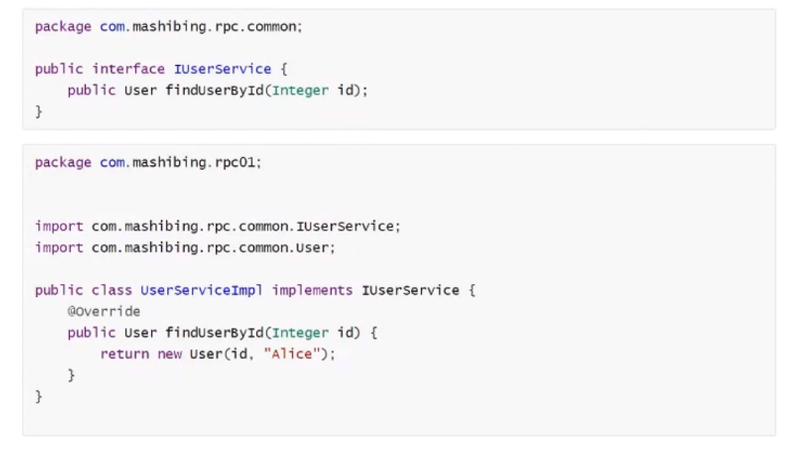

#  远程过程调用协议RPC(Remote Procedure Call)

## RPC 和 Http 区别

https://www.cnblogs.com/helloworldmybokeyuan/p/11626833.html

- Remote Produce Call远程过程调用， 自定义数据格式，基于原生TCP通信，速度快，效率高 底层 基于JDK 动态 代理socket封装

- 可以让用户像调用本地服务接口一样调用远程服务，对用户屏蔽实现细节

- 要求服务提供方和消费方使用相同技术（dubbo）

  RPC调用流程图：

  

## RPC 演化过程

从单机到分布式 -> 分布式通信 - > 最基本：二进制数据传输 TCP/IP

​		

改进：创建一个代理，来帮我们完成连接网络 写ID 查询数据

改进 client 使用动态代理模式

改进 invoke 方法

服务器端代码改造

