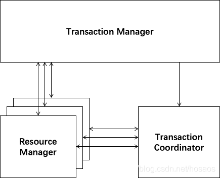
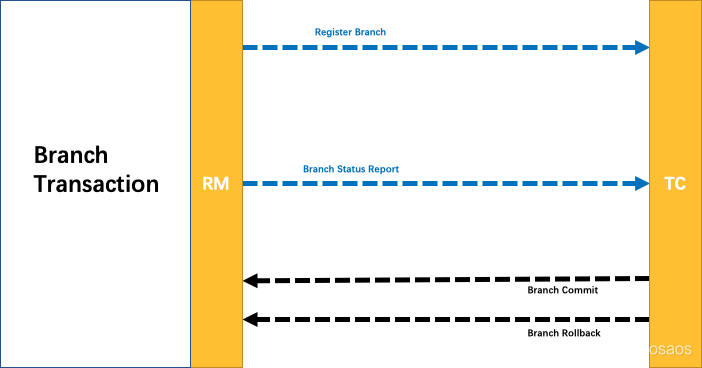
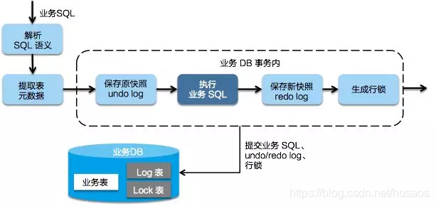
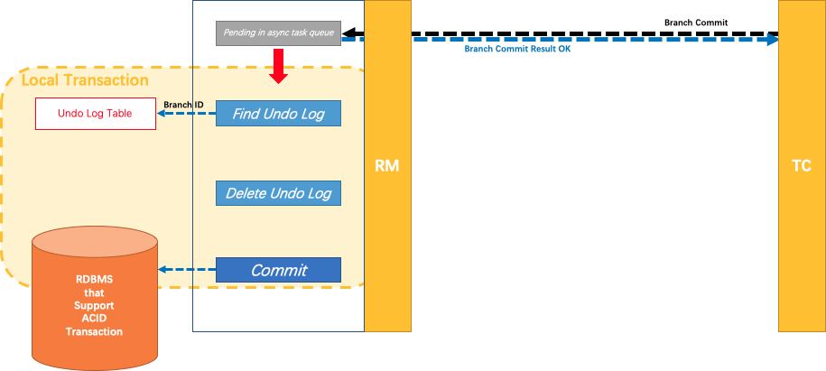
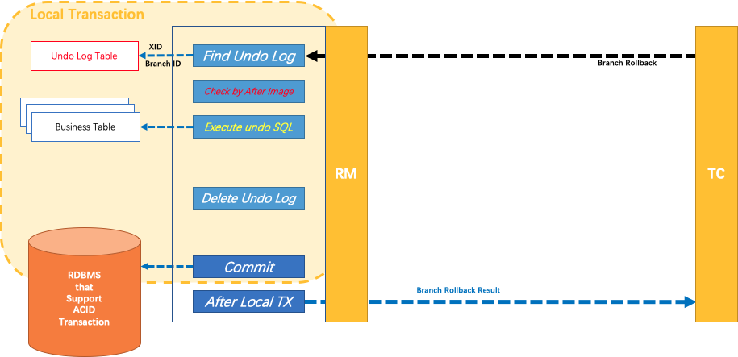
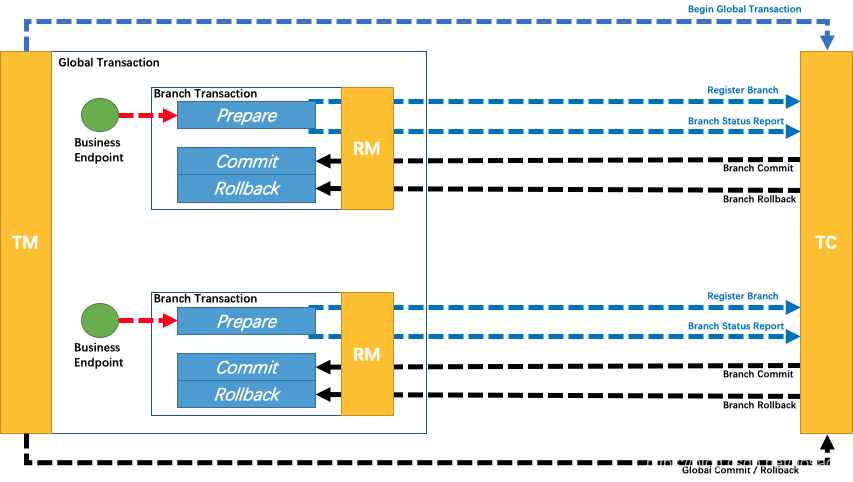

 # 分布式事务

分布式事务的实现并不是很难，比如下 文要展开的两阶段提交（2PC：Two-Phrase Commit）和三阶段提交（3PC：Three-Phrase Commit）都给我们提供了思路，但是如果要保证数据的强一致性，并要求对外提供可用的服务，那么就变成了一个几乎不可能的任务（至少目前是），因此很 多分布式系统对于数据强一致性都敬而远之，本人在之前项目的架构设计中也花费不少时间在系统的**一致性**和**可用性**之间寻找平衡。 

## 二阶段提交

两阶段提交协议的目标在于在分布式系统中保证数据的一致性，许多分布式系统采用该协议提供对分布式事务的支持。 顾名思义，该协议将一个分布式的事务过程拆分成两个阶段：**投票阶段**和**事务提交**阶段。

为了让整个数据库集群能够正常的运行，该协议指定了一个“协调者”单点，用于协调整个数据库集群的运行，为了简化描述，我们将数据库里面的各个节点称为“参与者”，三阶段提交协议中同样包含“协调者”和“参与者”这两个定 义。 

##### 第一阶段：投票阶段

 该阶段的主要目的在于打探数据库集群中的各个参与者是否能够正常的执行事务，具体步骤如下： 

1. 协调者向所有的参与者发送**事务执行请求**，并等待参与者反馈事务执行结果。
2. 事务参与者收到请求之后，**执行**事务，但**不提交**，并**记录事务日志**。
3. 参与者将自己事务执行情况**反馈给协调者**，同时**阻塞等待协调者**的后续指令。 

##### 第二阶段：事务提交阶段

 在第一阶段协调者的询盘之后，各个参与者会回复自己事务的执行情况，这时候存在三种可能： 

1. 所有的参与者回复能够正常执行事务
2. 一个或多个参与者回复事务执行失败
3. 协调者等待超时。 

 对于第一种情况，协调者将向所有的参与者发出提交事务的通知，具体步骤如下： 

 

 对于第二、三种情况，协调者均认为参与者无法正常成功执行事务，为了整个集群数据的一致性，所以要向各个参与者发送事务回滚通知，具体步骤如下： 

1. 协调者向各个参与者发送事务rollback通知，请求回滚事务。

2. 参与者收到事务回滚通知之后，执行rollback操作，然后释放占有的资源。

3. 参与者向协调者返回事务rollback结果信息。 

   

    

两阶段提交协议解决的是**分布式数据库数据强一致性问题**，其原理简单，易于实现，但是缺点也是显而易见的，主要缺点如下： 

- 单点问题
  协调者在整个两阶段提交过程中扮演着举足轻重的作用，一旦协调者所在服务器宕机，那么就会影响整个数据库集群的正常运行，比如在第二阶段中，如果协调者因为故障不能正常发送事务提交或回滚通知，那么参与者们将一直处于阻塞状态，整个数据库集群将无法提供服务。
- 同步阻塞
  两阶段提交执行过程中，所有的参与者都需要听从协调者的统一调度，期间处于阻塞状态而不能从事其他操作，这样效率及其低下。
- 数据不一致性
  两阶段提交协议虽然为分布式数据强一致性所设计，但仍然存在数据不一致性的可能，比如在第二阶段中，假设协调者发出了 事务commit的通知，但是因为网络问题该通知仅被一部分参与者所收到并执行了commit操作，其余的参与者则因为没有收到通知一直处于阻塞状态，这时候就产生了数据的不一致性。

## 三阶段提交

针对两阶段提交存在的问题，三阶段提交协议通过引入一个**“预询盘”**阶段，以及**超时策略**来减少整个集群的阻塞时间，提升系统性能。三阶段提交的三个阶段分别为：can_commit，pre_commit，do_commit。 

##### 第一阶段：can_commit

该阶段协调者会去询问各个参与者是否能够正常执行事务，参与者根据自身情况回复一个预估值，相对于真正的执行事务，这个过程是轻量的，具体步骤如下：

1. 协调者向各个参与者发送事务询问通知，询问是否可以执行事务操作，并等待回复
2. 各个参与者依据自身状况回复一个预估值，如果预估自己能够正常执行事务就返回确定信息，并进入预备状态，否则返回否定信息

##### 第二阶段：pre_commit

本阶段协调者会根据第一阶段的询盘结果采取相应操作，询盘结果主要有三种：

1. 所有的参与者都返回确定信息
2. 一个或多个参与者返回否定信息
3. 协调者等待超时

针对第一种情况，协调者会向所有参与者发送事务执行请求，具体步骤如下：

1. 协调者向所有的事务参与者发送事务执行通知
2. 参与者收到通知后，执行事务，但不提交
3. 参与者将事务执行情况返回给客户端

针对第二、三种情况，协调者认为事务无法正常执行，于是向各个参与者发出abort通知，请求退出预备状态，具体步骤如下： 

1. 协调者向所有事务参与者发送abort通知
2. 参与者收到通知后，中断事务 

 

##### 第三阶段：do_commit

如果第二阶段事务未中断，那么本阶段协调者将会依据事务执行返回的结果来决定提交或回滚事务，分为三种情况： 

1. 所有的参与者都能正常执行事务
2. 一个或多个参与者执行事务失败
3. 协调者等待超时 

针对第一种情况，协调者向各个参与者发起事务提交请求，具体步骤如下： 

针对第二、三种情况，协调者认为事务无法正常执行，于是向各个参与者发送事务回滚请求，具体步骤如下： 

1. 协调者向所有参与者发送事务rollback通知

2. 所有参与者在收到通知之后执行rollback操作，并释放占有的资源

3. 参与者向协调者反馈事务提交结果 

   

在本阶段如果因为协调者或网络问题，导致参与者迟迟不能收到来自协调者的commit或rollback请求，那么参与者将**不会**如两阶段提交中那样陷入**阻塞**，而是**等待超时后继续commit**。相对于两阶段提交虽然降低了同步阻塞，但仍然无法避免数据的不一致性。

在分布式数据库中，如果期望达到数据的强一致性，那么服务基本没有可用性可言，这也是为什么许多分布式数据库提供了跨库事务，但也只是个摆设的原因，在实际应用中我们更多追求的是数据的弱一致性或最终一致性，为了强一致性而丢弃可用性是不可取的。

## TCC

TCC 其实就是采用的补偿机制，其核心思想是：针对每个操作，都要注册一个与其对应的确认和补偿（撤销）操作。它分为三个阶段：

- Try 阶段主要是对**业务系统做检测及资源预留**
- Confirm 阶段主要是对业务系统做确认提交，Try阶段执行成功并开始执行 Confirm阶段时，默认 Confirm阶段是不会出错的。即：只要Try成功，Confirm一定成功。
- Cancel 阶段主要是在业务执行错误，需要回滚的状态下**执行的业务取消，预留资源释放**。

举个例子，假入 Bob 要向 Smith 转账，思路大概是：

我们有一个本地方法，里面依次调用
1、首先在 Try 阶段，要先调用远程接口把 Smith 和 Bob 的钱给冻结起来。
2、在 Confirm 阶段，执行远程调用的转账的操作，转账成功进行解冻。
3、如果第2步执行成功，那么转账成功，如果第二步执行失败，则调用远程冻结接口对应的解冻方法 (Cancel)。

**优点**： 跟2PC比起来，实现以及流程相对简单了一些，但数据的一致性比2PC也要差一些
**缺点**： 缺点还是比较明显的，在2,3步中都有可能失败。TCC属于应用层的一种补偿方式，所以需要程序员在实现的时候多写很多补偿的代码，在一些场景中，一些业务流程可能用TCC不太好定义及处理。

## Seata解决方案

解决分布式事务问题，有两个设计初衷

- 对业务无侵入：即减少技术架构上的微服务化所带来的分布式事务问题对业务的侵入
- 高性能：减少分布式事务解决方案所带来的性能消耗

seata中有两种分布式事务实现方案，AT及TCC

- AT模式主要关注多 DB 访问的数据一致性，当然也包括多服务下的多 DB 数据访问一致性问题
- TCC 模式主要关注业务拆分，在按照业务横向扩展资源时，解决微服务间调用的一致性问题

### AT模式(业务侵入小)

Seata AT模式是基于XA事务演进而来的一个分布式事务中间件，XA是一个基于数据库实现的分布式事务协议，本质上和两阶段提交一样，需要数据库支持，Mysql5.6以上版本支持XA协议，其他数据库如Oracle，DB2也实现了XA接口

角色如下

 

1. Transaction Coordinator (TC)： 事务协调器，维护全局事务的运行状态，负责协调并驱动全局事务的提交或回滚
2. Transaction Manager ™： 控制全局事务的边界，负责开启一个全局事务，并最终发起全局提交或全局回滚的决议
3. Resource Manager (RM)： 控制分支事务，负责分支注册、状态汇报，并接收事务协调器的指令，驱动分支（本地）事务的提交和回滚

基本处理逻辑如下

Branch就是指的分布式事务中每个独立的本地局部事务

**第一阶段**

Seata 的 JDBC 数据源代理通过对业务 SQL 的解析，把业务数据在更新前后的数据镜像组织成回滚日志，利用 本地事务 的 ACID 特性，将业务数据的更新和回滚日志的写入在同一个 本地事务 中提交。

这样，可以保证：任何提交的业务数据的更新一定有相应的回滚日志存在

基于这样的机制，分支的本地事务便可以在全局事务的第一阶段提交，并马上释放本地事务锁定的资源

这也是Seata和XA事务的不同之处，两阶段提交往往对资源的锁定需要持续到第二阶段实际的提交或者回滚操作，而有了回滚日志之后，可以在第一阶段释放对资源的锁定，降低了锁范围，提高效率，即使第二阶段发生异常需要回滚，只需找对undolog中对应数据并反解析成sql来达到回滚目的

同时Seata通过代理数据源将业务sql的执行解析成undolog来与业务数据的更新同时入库，达到了对业务无侵入的效果

**第二阶段**

如果决议是全局提交，此时分支事务此时已经完成提交，不需要同步协调处理（只需要异步清理回滚日志），Phase2 可以非常快速地完成

如果决议是全局回滚，RM 收到协调器发来的回滚请求，通过 XID 和 Branch ID 找到相应的回滚日志记录，通过回滚记录生成反向的更新 SQL 并执行，以完成分支的回滚

### 

### TCC(高性能)

seata也针对TCC做了适配兼容，支持TCC事务方案，原理前面已经介绍过，基本思路就是使用侵入业务上的补偿及事务管理器的协调来达到全局事务的一起提交及回滚，详情参考demo回滚

