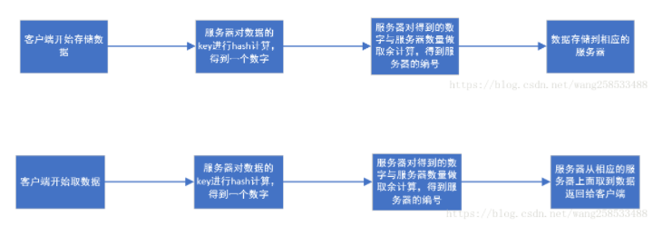
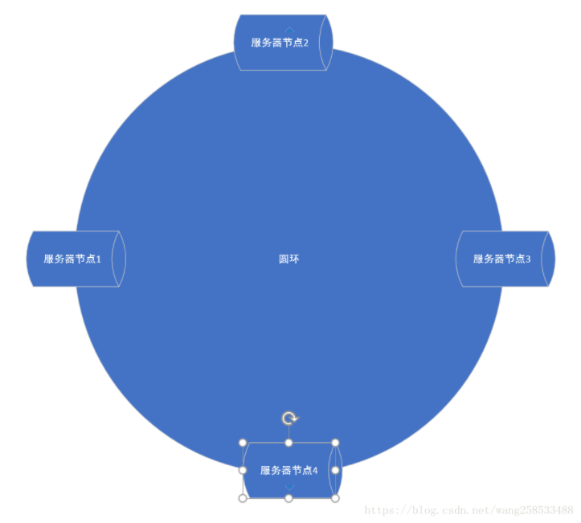
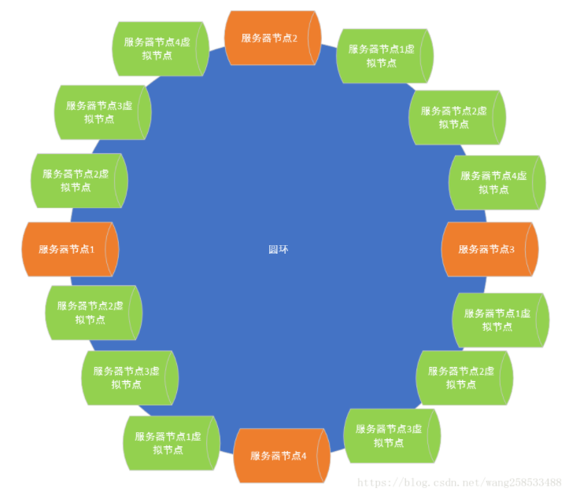

# 分布式数据存储算法

## 1 概念

分布式数据存储中，数据是分布式在不同的服务器上的，那么每条数据应该存储到哪台服务器？取的时候又应该去哪台服务器去取？分布式数据存储算法就是解决此类问题的算法

## 2 hash算法

### 2.1 过程

1. 客户端开始操作数据
2. 服务器对数据的key进行hash计算，得到一个数字
3. 服务器对得到的数字与服务器数量做取余计算，得到服务器的编号
4. 服务器在相应的服务器上进行操作

hash算法的数据存储过程图解：

### 2.2 缺点和使用现状

1. 可能出现某个服务器上的热点数据特别多，导致该服务器出现性能瓶颈
2. 如果某个服务器出现故障，会导致大部分数据的hash错乱，导致大部分数据读写失效或错误

由于hash算法的上述缺点，现在很少有分布式数据存储使用该算法

## 3 原始一致性hash算法

### 3.1 过程

1. 将服务器分布在一个圆环上
2. 客户端开始进行数据操作
3. 服务器对数据的key进行hash计算，得到一个数字
4. 用得到的hash值在圆环对应的各个点上去对比，得到数据在圆环上的落点
5. 服务器顺时针寻找距离该落点最近的一个服务器节点
6. 服务器在相应的服务器上进行操作

服务器分布样式图解：

### 3.2 一致性hash算法的优点

如果某个服务器节点出现故障，只会导致该节点对应区间的数据出现错误，其他节点的数据仍然保存完整。

### 3.3 一致性hash算法的缺点

可能出现某个服务器上的热点数据特别多，导致该服务器出现性能瓶颈

## 4 基于虚拟节点的一致性hash算法

基于虚拟节点的一致性hash算法指的是在一致性hash算法的基础上，在每个虚拟节对应的区间上增加若干个其他节点的虚拟节点，这样就能最大限度的解决热点数据导致的服务器数据分布不均的问题

基于虚拟节点的一致性hash算法图解：

## 5 redis hash slot算法

### 5.1 过程分析

redis hash slot算法是redis分布式中使用的分布式数据存储算法，他将数据存储在16384个hash槽中，然后再把这16384个hash槽平均分布在每个服务器上，这样用户进行数据操作，只需要找到数据对应的hash槽，然后再找到hash槽对应的服务器即可，整个过程如下：

1. 客户端开始操作数据
2. 服务器对数据的key进行**CRC16值**计算，得到一个数字
3. 服务器对得到的数字与16384做取余计算，得到对应的hash槽编号
4. 根据hash槽找到对应的服务器
5. 服务器在相应的服务器上进行操作

### 5.2 优缺点分析

1. 如果某个服务器节点出现故障，只会导致该服务器节点上对应的hash槽上的数据出现故障，不影响其他数据
2. 如果某个服务器节点出现故障，redis会迅速把该节点上的hash槽转移到其他服务器节点上（redis底层做了优化），保证把损失降低到最低
3. 由于存在16384个hash槽，所以很好的解决了局部数据热点问题。