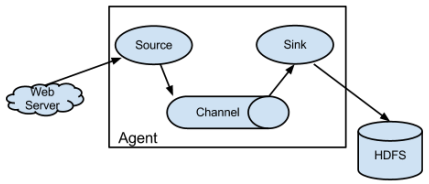

# Flume 

## Flume 介绍

### 概述

- Flume是一个分布式、可靠、和高可用的海量日志采集、聚合和传输的系统。 

- Flume可以采集文件，socket数据包、文件、文件夹、kafka等各种形式源数据，又可以将采集到的数据(下沉sink)输出到HDFS、hbase、hive、kafka等众多外部存储系统中 

- 一般的采集需求，通过对flflume的简单配置即可实现 

- Flume针对特殊场景也具备良好的自定义扩展能力，因此，flflume可以适用于大部分的日常数据采集场景 。

### 运行机制

- Flume分布式系统中最核心的角色是agent，flume 采集系统就是由一个个 agent 所连接起来形成 

- 每一个 agent 相当于一个数据传递员，内部有三个组件： 

  1. Source：采集组件，用于跟数据源对接，以获取数据
  2. Channel：传输通道组件，用于从source将数据传递到sink 

  3. Sink：下沉组件，用于往下一级agent传递数据或者往最终存储系统传递数据

  