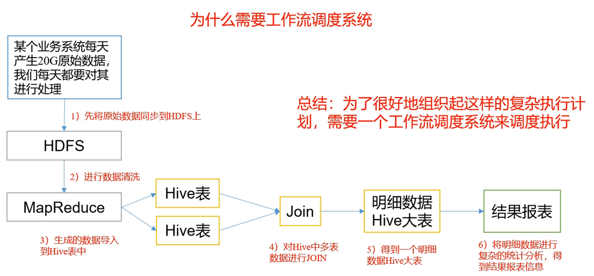
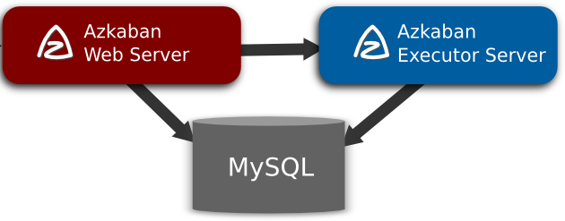

# Azkaban

## 一 概述

### 1.1 为什么需要工作流调度系统

- 一个完整的数据分析系统通常都是由大量任务单元组成：

  shell脚本程序，java程序，mapreduce程序、hive脚本等

- 各任务单元之间存在时间先后及前后依赖关系

- 为了很好地组织起这样的复杂执行计划，需要一个工作流调度系统来调度执行；

  

  例如，我们可能有这样一个需求，某个业务系统每天产生20G原始数据，我们每天都要对其进行处理，处理步骤如下所示：

  1)  通过Hadoop先将原始数据上传到HDFS上（HDFS的操作）；

  2)  使用MapReduce对原始数据进行清洗（MapReduce的操作）；

  3)  将清洗后的数据导入到hive表中（hive的导入操作）；

  4)  对Hive中多个表的数据进行JOIN处理，得到一张hive的明细表（创建中间表）；

  5)  通过对明细表的统计和分析，得到结果报表信息（hive的查询操作）；

  

### 1.2 Azkaban的适用场景

根据以上业务场景： （2）任务依赖（1）任务的结果，（3）任务依赖（2）任务的结果，（4）任务依赖（3）任务的结果，（5）任务依赖（4）任务的结果。一般的做法是，先执行完（1）再执行（2），再一次执行（3）（4）（5）。

这样的话，整个的执行过程都需要人工参加，并且得盯着各任务的进度。但是我们的很多任务都是在深更半夜执行的，通过写脚本设置crontab执行。其实，整个过程类似于一个有向无环图（DAG）。每个子任务相当于大任务中的一个节点，也就是，我们需要的就是一个工作流的调度器，而Azkaban就是能解决上述问题的一个调度器。

### 1.3 什么是 Azkaban

Azkaban 是由 Linkedin 公司推出的一个**批量工作流任务调度器**，主要用于在一个工作流内以一个特定的顺序运行一组工作和流程，它的配置是通过简单的 key:value 对的方式，通过配置中的 dependencies 来设置依赖关系。Azkaban 使用 job 配置文件建立任务之间的依赖关系，并提供一个易于使用的web用户界面维护和跟踪你的工作流。

### 1.4 Azkaban 特点

- 兼容任何版本的hadoop

- 易于使用的Web用户界面

- 简单的工作流的上传

- 方便设置任务之间的关系

- 调度工作流

- 模块化和可插拔的插件机制

- 认证/授权(权限的工作)

- 能够杀死并重新启动工作流

- 有关失败和成功的电子邮件提醒

### 1.5 常见的工作流调度系统

- 简单的任务调度：直接使用 crontab 实现；

- 复杂的任务调度：开发调度平台或使用现成的开源调度系统，比如ooize、azkaban等

### 1.6 Azkaban 的架构

Azkaban由三个关键组件构成：

1. AzkabanWebServer：AzkabanWebServer是整个Azkaban工作流系统的主要管理者，它用户登录认证、负责project管理、定时执行工作流、跟踪工作流执行进度等一系列任务。

2. AzkabanExecutorServer：负责具体的工作流的提交、执行，它们通过mysql数据库来协调任务的执行。

3. 关系型数据库（MySQL）：存储大部分执行流状态，AzkabanWebServer和AzkabanExecutorServer都需要访问数据库。

## 二 Azkaban安装部署

 下载地址：http://azkaban.github.io/downloads.html

