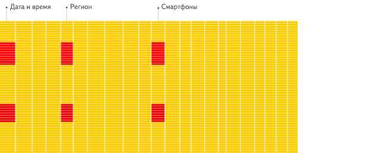

# ClickHouse

## 简介

### 什么是ClickHouse ？

ClickHouse是一个用于在线分析处理(OLAP)的**列式**数据库管理系统(DBMS)。

传统 OLTP 数据库通常采用行式存储。以下图为例， 所有的列依次排列构成一行，以行为单位存储，再配合以 B+ 树或 SS-Table 作为索引，就能快速通过主键找到相应的行数据：

| Row  | WatchID     | JavaEnable | Title              | GoodEvent | EventTime           |
| ---- | ----------- | ---------- | ------------------ | --------- | ------------------- |
| #0   | 89354350662 | 1          | Investor Relations | 1         | 2016-05-18 05:19:20 |
| #1   | 90329509958 | 0          | Contact us         | 1         | 2016-05-18 08:10:20 |
| #2   | 89953706054 | 1          | Mission            | 1         | 2016-05-18 07:38:00 |
| #N   | …           | …          | …                  | …         | …                   |

行式存储对于 OLTP 场景是很自然的：大多数操作都以实体（Entity）为单位，即大多为增删改查一整行记录，显然把一行数据存在物理上相邻的位置是个很好的选择。

常见的**行式**数据库系统有：`MySQL`、`Postgres`和`MS SQL Server`。

然而，对于 OLAP 场景，一个典型的查询需要遍历整个表，进行分组、排序、聚合等操作，这样一来按行存储的优势就不复存在了。更糟糕的是，分析型 SQL 常常不会用到所有的列，而仅仅对其中某些感兴趣的列做运算，那一行中无关的列也不得不参与扫描。

列式存储就是为这样的需求设计的。如下图所示，同一列的数据被一个接一个紧挨着存放在一起，表的每列构成一个长数组：

| Row:        | #0                  | #1                  | #2                  | #N   |
| ----------- | ------------------- | ------------------- | ------------------- | ---- |
| WatchID:    | 89354350662         | 90329509958         | 89953706054         | …    |
| JavaEnable: | 1                   | 0                   | 1                   | …    |
| Title:      | Investor Relations  | Contact us          | Mission             | …    |
| GoodEvent:  | 1                   | 1                   | 1                   | …    |
| EventTime:  | 2016-05-18 05:19:20 | 2016-05-18 08:10:20 | 2016-05-18 07:38:00 | …    |

这些示例只显示了数据的排列顺序。来自不同列的值被单独存储，来自同一列的数据被存储在一起。

显然，列式存储对于 OLTP 不友好，一行数据的写入需要同时修改多个列。

常见的列式数据库有： Vertica、 Paraccel (Actian Matrix，Amazon Redshift)、 Sybase IQ、 Exasol、 Infobright、 InfiniDB、 MonetDB (VectorWise， Actian Vector)、 LucidDB、 SAP HANA、 Google Dremel、 Google PowerDrill、 Druid、 kdb+。

不同的数据存储方式适用不同的业务场景，数据访问的场景包括：进行了何种查询、多久查询一次以及各类查询的比例；每种类型的查询(行、列和字节)读取多少数据；读取数据和更新之间的关系；使用的数据集大小以及如何使用本地的数据集；是否使用事务,以及它们是如何进行隔离的；数据的复制机制与数据的完整性要求；每种类型的查询要求的延迟与吞吐量等等。

系统负载越高，依据使用场景进行定制化就越重要，并且定制将会变的越精细。没有一个系统能够同时适用所有不同的业务场景。如果系统适用于广泛的场景，在负载高的情况下，要兼顾所有的场景，那么将不得不做出选择。是要平衡还是要效率？

### OLAP场景的关键特征

- 绝大多数是读请求
- 数据以相当大的批次(> 1000行)更新，而不是单行更新;或者根本没有更新。
- 已添加到数据库的数据不能修改。
- 对于读取，从数据库中提取相当多的行，但只提取列的一小部分。
- 宽表，即每个表包含着大量的列
- 查询相对较少(通常每台服务器每秒查询数百次或更少)
- 对于简单查询，允许延迟大约50毫秒
- 列中的数据相对较小：数字和短字符串(例如，每个URL 60个字节)
- 处理单个查询时需要高吞吐量(每台服务器每秒可达数十亿行)
- 事务不是必须的
- 对数据一致性要求低
- 每个查询有一个大表。除了他以外，其他的都很小。
- 查询结果明显小于源数据。换句话说，数据经过过滤或聚合，因此结果适合于单个服务器的RAM中

很容易可以看出，OLAP场景与其他通常业务场景(例如,OLTP或K/V)有很大的不同， 因此想要使用OLTP或Key-Value数据库去高效的处理分析查询场景，并不是非常完美的适用方案。例如，使用OLAP数据库去处理分析请求通常要优于使用MongoDB或Redis去处理分析请求。

### 列式数据库更适合OLAP场景的原因

列式数据库更适合于OLAP场景(对于大多数查询而言，处理速度至少提高了100倍)，下面详细解释了原因(通过图片更有利于直观理解)：

**行式**

**列式**

看到差别了么？下面将详细介绍为什么会发生这种情况。

#### I/O

1. 针对分析类查询，通常只需要读取表的一小部分列。在列式数据库中你可以只读取你需要的数据。例如，如果只需要读取100列中的5列，这将帮助你最少减少20倍的I/O消耗。
2. 由于数据总是打包成批量读取的，所以压缩是非常容易的。同时数据按列分别存储这也更**容易压缩**。这进一步降低了I/O的体积。
3. 由于I/O的降低，这将帮助更多的数据被系统缓存。

例如，查询«统计每个广告平台的记录数量»需要读取«广告平台ID»这一列，它在未压缩的情况下需要1个字节进行存储。如果大部分流量不是来自广告平台，那么这一列至少可以以十倍的压缩率被压缩。当采用快速压缩算法，它的解压速度最少在十亿字节(未压缩数据)每秒。换句话说，这个查询可以在单个服务器上以每秒大约几十亿行的速度进行处理。这实际上是当前实现的速度。

#### CPU

由于执行一个查询需要处理大量的行，因此在整个向量上执行所有操作将比在每一行上执行所有操作更加高效。同时这将有助于实现一个几乎没有调用成本的查询引擎。如果你不这样做，使用任何一个机械硬盘，查询引擎都不可避免的停止CPU进行等待。所以，在数据按列存储并且按列执行是很有意义的。

有两种方法可以做到这一点：

1. 向量引擎：所有的操作都是为向量而不是为单个值编写的。这意味着多个操作之间的不再需要频繁的调用，并且调用的成本基本可以忽略不计。操作代码包含一个优化的内部循环。
2. 代码生成：生成一段代码，包含查询中的所有操作。

这是不应该在一个通用数据库中实现的，因为这在运行简单查询时是没有意义的。但是也有例外，例如，MemSQL使用代码生成来减少处理SQL查询的延迟(只是为了比较，分析型数据库通常需要优化的是吞吐而不是延迟)。

请注意，为了提高CPU效率，查询语言必须是声明型的(SQL或MDX)， 或者至少一个向量(J，K)。 查询应该只包含隐式循环，允许进行优化。

