# ELK大规模日志实时处理

## 一 ELK架构介绍

### 1.1 核心组成
ELK是一个应用套件，由Elasticsearch、Logstash和Kibana三部分组件组成，简称ELK；它是一套开源免费、功能强大的日志分析管理系统。ELK可以将我们的系统日志、网站日志、应用系统日志等各种日志进行收集、过滤、清洗，然后进行集中存放并可用于实时检索、分析。

这三款软件都是开源软件，通常是配合使用，而且又先后归于Elastic.co公司名下，故又被简称为ELK Stack。下图是ELK Stack的基础组成。

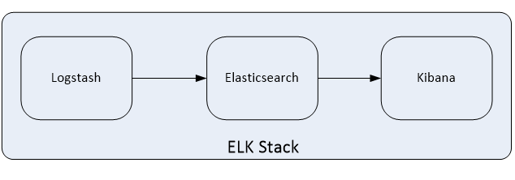

### 1.2 Elasticsearch介绍
Elasticsearch是一个实时的分布式搜索和分析引擎，它可以用于全文搜索，结构化搜索以及分析，采用Java语言编写。它的主要特点如下：

- 实时搜索，实时分析

- 分布式架构、实时文件存储，并将每一个字段都编入索引

- 文档导向，所有的对象全部是文档

- 高可用性，易扩展，支持集群（Cluster）、分片和复制（Shards和Replicas）

- 接口友好，支持JSON

Elasticsearch支持集群架构，典型的集群架构如下图所示：

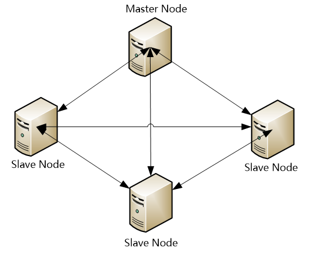

从图中可以看出，Elasticsearch集群中有Master Node和Slave Node两种角色，其实还有一种角色Client Node，这在后面会做深入介绍。

### 1.3 Logstash 介绍

Logstash是一款轻量级的、开源的日志收集处理框架，它可以方便的把分散的、多样化的日志搜集起来，并进行自定义过滤分析处理，然后传输到指定的位置，比如某个服务器或者文件。Logstash采用JRuby语言编写，它的主要特点如下：
Logstash的理念很简单，从功能上来讲，它只做三件事情：

- input：数据收集

- filter：数据加工，如过滤，改写等

- output：数据输出

别看它只做三件事，但通过组合输入和输出，可以变幻出多种架构实现多种需求。Logstash内部运行逻辑如下图所示：

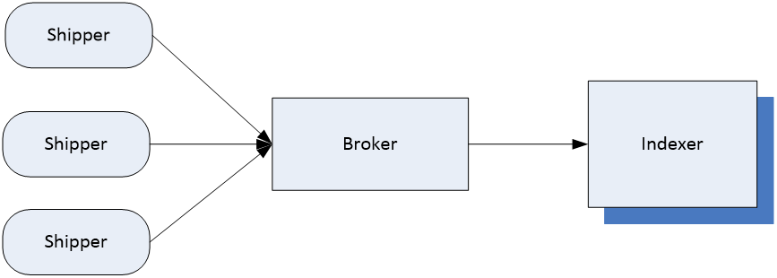

其中，每个部分含义如下：

- Shipper：主要用来收集日志数据，负责监控本地日志文件的变化，及时把日志文件的最新内容收集起来，然后经过加工、过滤，输出到Broker。

- Broker：相当于日志Hub，用来连接多个Shipper和多个Indexer。

- Indexer：从Broker读取文本，经过加工、过滤，输出到指定的介质（可以是文件、网络、elasticsearch等）中。 

Redis服务器是logstash官方推荐的broker，这个broker起数据缓存的作用，通过这个缓存器可以提高Logstash shipper发送日志到Logstash indexer的速度，同时避免由于突然断电等导致的数据丢失。可以实现broker功能的还有很多软件，例如kafka等。

这里需要说明的是，在实际应用中，LogStash自身并没有什么角色，只是根据不同的功能、不同的配置给出不同的称呼而已，无论是Shipper还是Indexer，始终只做前面提到的三件事。

这里需要重点掌握的是logstash中Shipper和Indexer的作用，因为这两个部分是logstash功能的核心，在下面的介绍中，会陆续介绍到这两个部分实现的功能细节。

### 1.4 Kibana 介绍

Kibana是一个开源的数据分析可视化平台。使用Kibana可以为Logstash和ElasticSearch提供的日志数据进行高效的搜索、可视化汇总和多维度分析，还可以与Elasticsearch搜索引擎之中的数据进行交互。它基于浏览器的界面操作可以快速创建动态仪表板，实时监控ElasticSearch的数据状态与更改。

#### ELK工作流程
一般都是在需要收集日志的所有服务上部署logstash，作为logstash shipper用于监控并收集、过滤日志，接着，将过滤后的日志发送给Broker，然后，Logstash Indexer将存放在Broker中的数据再写入Elasticsearch，Elasticsearch对这些数据创建索引，最后由Kibana对其进行各种分析并以图表的形式展示。

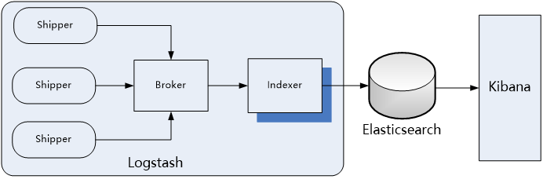

有些时候，如果收集的日志量较大，为了保证日志收集的性能和数据的完整性，logstash shipper和logstash indexer之间的缓冲器（Broker）也经常采用kafka来实现。

在这个图中，要重点掌握的是ELK架构的数据流向，以及logstash、Elasticsearch和Kibana组合实现的功能细节。	

## 二 ZooKeeper基础与入门

### 2.1 ZooKeeper概念介绍

在介绍ZooKeeper之前，先来介绍一下分布式协调技术，所谓分布式协调技术主要是用来解决分布式环境当中多个进程之间的同步控制，让他们有序的去访问某种共享资源，防止造成资源竞争（脑裂）的后果。

这里首先介绍下什么是分布式系统，所谓分布式系统就是在不同地域分布的多个服务器，共同组成的一个应用系统来为用户提供服务，在分布式系统中最重要的是进程的调度，这里假设有一个分布在三个地域的服务器组成的一个
应用系统，在第一台机器上挂载了一个资源，然后这三个地域分布的应用进程都要竞争这个资源，但我们又不希望多个进程同时进行访问，这个时候就需要一个协调器，来让它们有序的来访问这个资源。

这个协调器就是分布式系统中经常提到的那个“锁”。

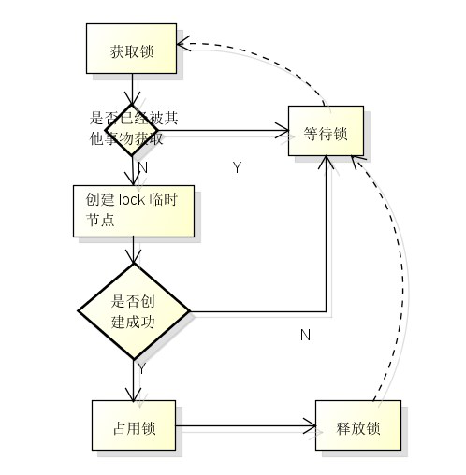

例如"进程1"在使用该资源的时候，会先去获得这把锁，"进程1"获得锁以后会对该资源保持独占，此时其它进程就无法访问该资源，"进程1"在用完该资源以后会将该锁释放掉，以便让其它进程来获得锁。由此可见，通过这个“锁”机制，就可以保证分布式系统中多个进程能够有序的访问该共享资源。这里把这个分布式环境下的这个“锁”叫作分布式锁。这个分布式锁就是分布式协调技术实现的核心内容。

综上所述，ZooKeeper是一种为分布式应用所设计的高可用、高性能的开源协调服务，它提供了一项基本服务：分布式锁服务，同时，也提供了数据的维护和管理机制，如：统一命名服务、状态同步服务、集群管理、分布式消息队列、分布式应用配置项的管理等等。

### 2.2 ZooKeeper应用举例　

这里以ZooKeeper提供的基本服务**分布式锁**为例进行介绍。在分布式锁服务中，有一种最典型应用场景，就是通过对集群进行Master角色的选举，来解决分布式系统中的单点故障问题。所谓单点故障，就是在一个主从的分布式系统中，主节点负责任务调度分发，从节点负责任务的处理，而当主节点发生故障时，整个应用系统也就瘫痪了，那么这种故障就称为单点故障。

解决单点故障，传统的方式是采用一个备用节点，这个备用节点定期向主节点发送ping包，主节点收到ping包以后向备用节点发送回复Ack信息，当备用节点收到回复的时候就会认为当前主节点运行正常，让它继续提供服务。而当主节点故障时，备用节点就无法收到回复信息了，此时，备用节点就认为主节点宕机，然后接替它成为新的主节点继续提供服务。

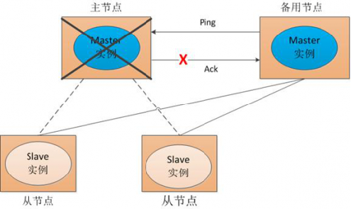

这种传统解决单点故障的方法，虽然在一定程度上解决了问题，但是有一个隐患，就是网络问题，可能会存在这样一种情况：主节点并没有出现故障，只是在回复ack响应的时候网络发生了故障，这样备用节点就无法收到回复，那么它就会认为主节点出现了故障，接着，备用节点将接管主节点的服务，并成为新的主节点，此时，分布式系统中就出现了两个主节点（双Master节点）的情况，双Master节点的出现（脑裂），会导致分布式系统的服务发生混乱。这样的话，整个分布式系统将变得不可用。为了防止出现这种情况，就需要引入ZooKeeper来解决这种问题。

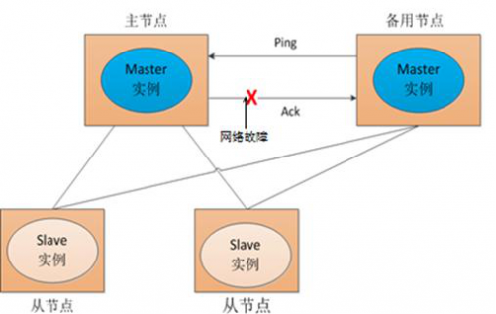


### 2.3 ZooKeeper工作原理

下面通过三种情形，介绍下Zookeeper是如何进行工作的。

（1） Master启动

在分布式系统中引入Zookeeper以后，就可以配置多个主节点，这里以配置两个主节点为例，假定它们是"主节点A"和"主节点B"，当两个主节点都启动后，它们都会向ZooKeeper中注册节点信息。我们假设"主节点A"锁注册的节点信息是"master00001"，"主节点B"注册的节点信息是"master00002"，注册完以后会进行选举，选举有多种算法，这里以编号最小作为选举算法，那么编号最小的节点将在选举中获胜并获得锁成为主节点，也就是"主节点A"将会获得锁成为主节点，然后"主节点B"将被阻塞成为一个备用节点。这样，通过这种方式Zookeeper就完成了对两个Master进程的调度。完成了主、备节点的分配和协作。

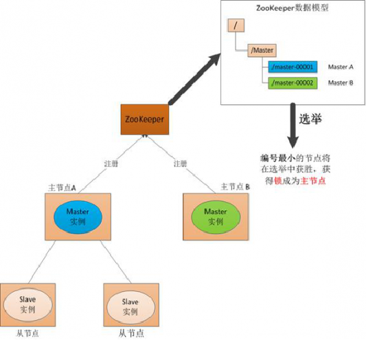

（2） Master故障

如果"主节点A"发生了故障，这时候它在ZooKeeper所注册的节点信息会被自动删除，而ZooKeeper会**自动感知节点的变化**，发现"主节点A"故障后，会再次发出选举，这时候"主节点B"将在选举中获胜，替代"主节点A"成为新的主节点，这样就完成了主、被节点的重新选举。

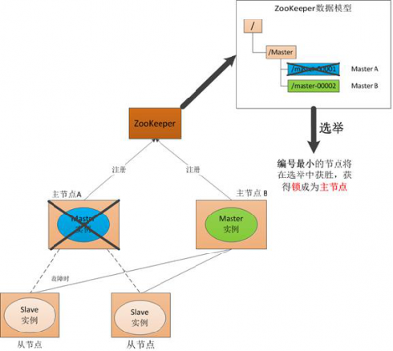

（3）Master恢复

如果主节点恢复了，它会再次向ZooKeeper注册自身的节点信息，只不过这时候它注册的节点信息将会变成"master00003"，而不是原来的信息。ZooKeeper会感知节点的变化再次发动选举，这时候"主节点B"在选举中会再次获胜继续担任"主节点"，"主节点A"会担任备用节点。

Zookeeper就是通过这样的协调、调度机制如此反复的对集群进行管理和状态同步的。

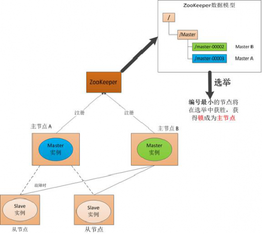


### 2.4 Zookeeper集群架构

Zookeeper一般是通过集群架构来提供服务的，下图是Zookeeper的基本架构图。

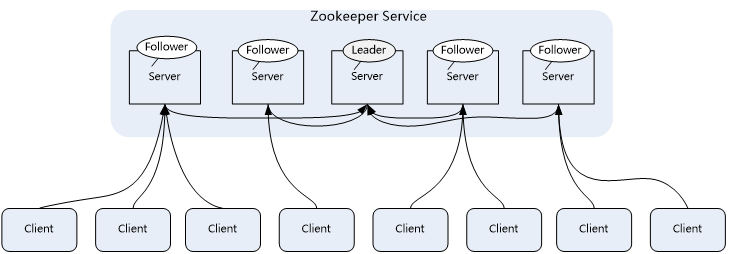

Zookeeper集群主要角色有Server和client，其中，Server又分为Leader、Follower和Observer三个角色，每个角色的含义如下：

- Leader：领导者角色，主要负责投票的发起和决议，以及更新系统状态。

- Follower：跟随者角色，用于接收客户端的请求并返回结果给客户端，在选举过程中参与投票。

- Observer：观察者角色，用户接收客户端的请求，并将写请求转发给leader，同时同步leader状态，但不参与投票。

- Observer目的是扩展系统，提高伸缩性。

- Client:客户端角色，用于向Zookeeper发起请求。

Zookeeper集群中每个Server在内存中存储了一份数据，在Zookeeper启动时，将从实例中选举一个Server作为leader，Leader负责处理数据更新等操作，当且仅当大多数Server在内存中成功修改数据，才认为数据修改成功。

Zookeeper写的流程为：客户端Client首先和一个Server或者Observe通信，发起写请求，然后Server将写请求转发给Leader，	Leader再将写请求转发给其它Server，其它Server在接收到写请求后写入数据并响应Leader，Leader在接收到大多数写成功回应后，认为数据写成功，最后响应Client，完成一次写操作过程。


## 三 kafka基础与入门

### 3.1 kafka基本概念

Kafka是一种高吞吐量的分布式发布/订阅消息系统，这是官方对kafka的定义，kafka是Apache组织下的一个开源系统，它的最大的特性就是可以实时的处理大量数据以满足各种需求场景：比如基于hadoop平台的数据分析、低时延的实时系统、storm/spark流式处理引擎等。kafka现在它已被多家大型公司作为多种类型的数据管道和消息系统使用。

### 3.2 kafka角色术语

在介绍架构之前，先了解下kafka中一些核心概念和各种角色。

- Broker：Kafka集群包含一个或多个服务器，每个服务器被称为broker。
- Topic：每条发布到Kafka集群的消息都有一个分类，这个类别被称为Topic（主题）。
- Producer：指消息的生产者，负责发布消息到Kafka broker。
- Consumer :指消息的消费者，从Kafka broker拉取数据，并消费这些已发布的消息。
- Partition：Parition是物理上的概念，每个Topic包含一个或多个Partition，每个partition都是一个有序的队列。partition 中的每条消息都会被分配一个有序的id（称为offset）。
- Consumer Group:消费者组，可以给每个Consumer指定消费者组，若不指定消费者组，则属于默认的group。
- Message：消息，通信的基本单位，每个producer可以向一个topic发布一些消息。

### 3.3 Kafka拓扑架构

一个典型的Kafka集群包含若干Producer，若干broker、若干Consumer Group，以及一个Zookeeper集群。Kafka通过Zookeeper管理集群配置，选举leader，以及在Consumer Group发生变化时进行rebalance。Producer使用push模式将消息发布到broker，Consumer使用pull模式从broker订阅并消费消息。

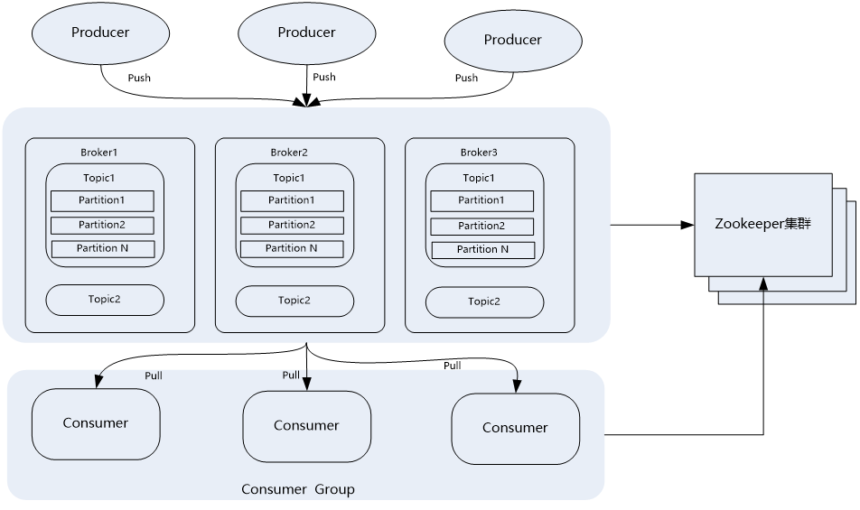

### 3.4 Topic与Partition

Kafka中的topic是以partition的形式存放的，每一个topic都可以设置它的partition数量，Partition的数量决定了组成topic的log的数量。推荐partition的数量一定要大于同时运行的consumer的数量。另外，建议partition的数量大于集群broker的数量，这样消息数据就可以均匀的分布在各个broker中。

那么，Topic为什么要设置多个Partition呢，这是因为kafka是基于文件存储的，通过配置多个partition可以将消息内容分散存储到多个broker上,这样可以避免文件尺寸达到单机磁盘的上限。同时，将一个topic切分成任意多个partitions，可以保证消息存储、消息消费的效率，因为越多的partitions可以容纳更多的consumer，可有效提升Kafka的吞吐率。因此，将Topic切分成多个partitions的好处是可以将大量的消息分成多批数据同时写到不同节点上，将写请求分担负载到各个集群节点。

### 3.5 Kafka消息发送的机制

每当用户往某个Topic发送数据时，数据会被hash到不同的partition,这些partition位于不同的集群节点上，所以每个消息都会被记录一个offset消息号，就是offset号。消费者通过这个offset号去查询读取这个消息。

**发送消息流程为：**

首先获取topic的所有Patition，如果客户端不指定Patition，也没有指定Key的话，使用自增长的数字取余数的方式实现指定的Partition。这样Kafka将平均的向Partition中生产数据。如果想要控制发送的partition，则有两种方式，一种是指定partition，另一种就是根据Key自己写算法。实现其partition方法。

每一条消息被发送到broker时，会根据paritition规则选择被存储到哪一个partition。如果partition规则设置的合理，所有消息可以均匀分布到不同的partition里，这样就实现了水平扩展。同时，每条消息被append到partition中时，是顺序写入磁盘的,因此效率非常高，经验证，顺序写磁盘效率比随机写内存还要高，这是Kafka高吞吐率的一个很重要的保证。

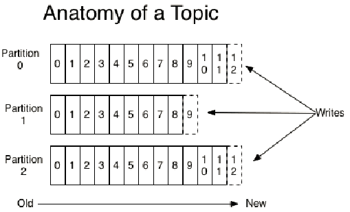

### 3.6 Kafka消息消费机制

Kafka中的Producer和consumer采用的是push（推送）、pull（拉取）的模式，即Producer只是向broker push消息，consumer只是从broker pull消息，push和pull对于消息的生产和消费是异步进行的。pull模式的一个好处是Consumer可自主控制消费消息的速率，同时Consumer还可以自己控制消费消息的方式是批量的从broker拉取数据还是逐条消费数据。

当生产者将数据发布到topic时，消费者通过pull的方式，定期从服务器拉取数据,当然在pull数据的时候，服务器会告诉consumer可消费的消息offset。

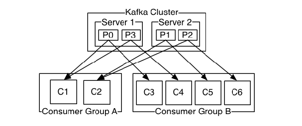

消费规则：

1. 不同 Consumer Group下的消费者可以消费partition中相同的消息，相同的Consumer  Group下的消费者只能消费partition中不同的数据。
2. topic的partition的个数和同一个消费组的消费者个数最好一致，如果消费者个数多于partition个数，则会存在有的消费者消费不到数据。
3. 服务器会记录每个consumer的在每个topic的每个partition下的消费的offset,然后每次去消费去拉取数据时，都会从上次记录的位置开始拉取数据。

### 3.7 Kafka消息存储机制

在存储结构上，每个partition在物理上对应一个文件夹，该文件夹下存储这个partition的所有消息和索引文件，每个partion(目录)相当于一个巨型文件被平均分配到多个大小相等segment(段)数据文件中。

partiton命名规则为topic名称+序号，第一个partiton序号从0开始，序号最大值为partitions数量减1。

在每个partition (文件夹)中有多个大小相等的segment(段)数据文件，每个segment的大小是相同的，但是每条消息的大小可能不相同，因此segment 数据文件中消息数量不一定相等。

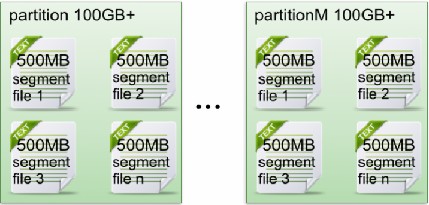

segment数据文件有两个部分组成，分别为index file和data file，此两个文件是一一对应，成对出现，后缀".index"和“.log”分别表示为segment索引文件和数据文件。

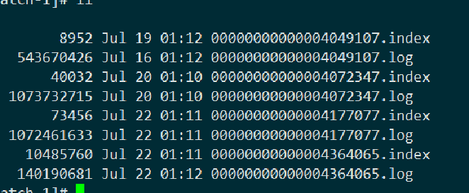

其实Kafka最核心的思想是**使用磁盘，而不是使用内存**，使用磁盘操作有以下几个好处：
1、磁盘缓存由Linux系统维护，减少了程序员的不少工作。
2、磁盘顺序读写速度超过内存随机读写。
3、JVM的GC效率低，内存占用大。使用磁盘可以避免这一问题。
4、系统冷启动后，磁盘缓存依然可用。


## 四 Filebeat基础与入门

### 4.1 什么是Filebeat

Filebeat是一个开源的文本日志收集器,它是elastic公司Beats数据采集产品的一个子产品，采用go语言开发，一般安装在业务服务器上作为代理来监测日志目录或特定的日志文件，并把它们发送到logstash、elasticsearch、redis或Kafka等。可以在官方地址https://www.elastic.co/downloads/beats下载各个版本的Filebeat。

### 4.2 Filebeat架构与运行原理

Filebeat是一个轻量级的日志监测、传输工具，它最大的特点是性能稳定、配置简单、占用系统资源很少。
这也是强烈推荐Filebeat的原因。官方给出的Filebeat架构图：

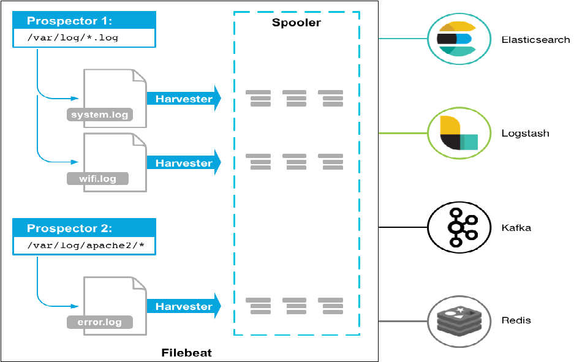


从图中可以看出，Filebeat主要由两个组件构成： prospector（探测器）和harvester（收集器）。这两类组件一起协作完成Filebeat的工作。

其中，Harvester负责进行单个文件的内容收集，在运行过程中，每一个Harvester会对一个文件逐行进行内容读取，并且把读写到的内容发送到配置的output中。当Harvester开始进行文件的读取后，将会负责这个文件的打开和关闭操作，因此，在Harvester运行过程中，文件都处于打开状态。如果在收集过程中，删除了这个文件或者是对文件进行了重命名，Filebeat依然会继续对这个文件进行读取，这时候将会一直占用着文件所对应的磁盘空间，直到Harvester关闭。

Prospector负责管理Harvster，它会找到所有需要进行读取的数据源。然后交给Harvster进行内容收集，如果input type配置的是log类型，Prospector将会去配置路径下查找所有能匹配上的文件，然后为每一个文件创建一个Harvster。

综上所述，filebeat的工作流程为：当开启filebeat程序的时候，它会启动一个或多个探测器（prospector）去检测指定的日志目录或文件，对于探测器找出的每一个日志文件，filebeat会启动收集进程（harvester），每一个收集进程读取一个日志文件的内容，然后将这些日志数据发送到后台处理程序（spooler），后台处理程序会集合这些事件，最后发送集合的数据到output指定的目的地。

## 五 ELK常见应用架构

### 5.1 简单的ELK应用架构

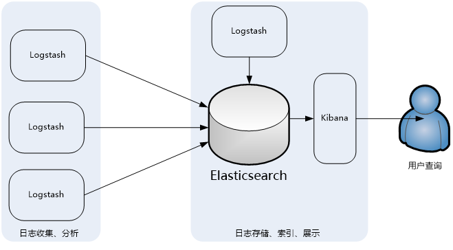

此架构主要是将Logstash部署在各个节点上搜集相关日志、数据，并经过分析、过滤后发送给远端服务器上的Elasticsearch进行存储。Elasticsearch再将数据以分片的形式压缩存储，并提供多种API供用户查询、操作。用户可以通过Kibana Web直观的对日志进行查询，并根据需求生成数据报表。

此架构的优点是搭建简单，易于上手。缺点是Logstash消耗系统资源比较大，运行时占用CPU和内存资源较高。另外，由于没有消息队列缓存，可能存在数据丢失的风险。此架构建议供初学者或数据量小的环境使用。

### 5.2 典型ELK架构

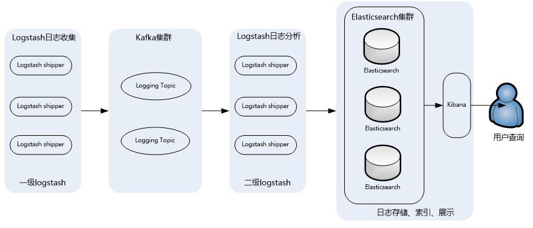

此架构主要特点是引入了消息队列机制，位于各个节点上的Logstash Agent（一级Logstash，主要用来传输数据）先将数据传递给消息队列（常见的有Kafka、Redis等），接着，Logstash server（二级Logstash，主要用来拉取消息队列数据，过滤并分析数据）将格式化的数据传递给Elasticsearch进行存储。最后，由Kibana将日志和数据呈现给用户。由于引入了Kafka（或者Redis）缓存机制，即使远端Logstash server因故障停止运行，数据也不会丢失，因为数据已经被存储下来了。

这种架构适合于较大集群、数据量一般的应用环境，但由于二级Logstash要分析处理大量数据，同时Elasticsearch也要存储和索引大量数据，因此它们的负荷会比较重，解决的方法是将它们配置为集群模式，以分担负载。

此架构的优点在于引入了消息队列机制，均衡了网络传输，从而降低了网络闭塞尤其是丢失数据的可能性，但依然存在Logstash占用系统资源过多的问题，在海量数据应用场景下，可能会出现性能瓶颈。

### 5.3 ELK集群架构


这个架构是在上面第二个架构基础上改进而来的，主要是将前端收集数据的Logstash Agent换成了filebeat，消息队列使用了kafka集群，然后将Logstash和Elasticsearch都通过集群模式进行构建，此架构适合大型集群、海量数据的业务场景，它通过将前端Logstash Agent替换成filebeat，有效降低了收集日志对业务系统资源的消耗。同时，消息队列使用kafka集群架构，有效保障了收集数据的安全性和稳定性，而后端Logstash和Elasticsearch均采用集群模式搭建，从整体上提高了ELK系统的高效性、扩展性和吞吐量。

下面我们就以此架构为主介绍如何安装、配置、构建和使用ELK大数据日志分析系统。

## 六 ELK+Filebeat+Kafka+ZooKeeper构建大数据日志分析平台

### 6.1 ELK应用架构

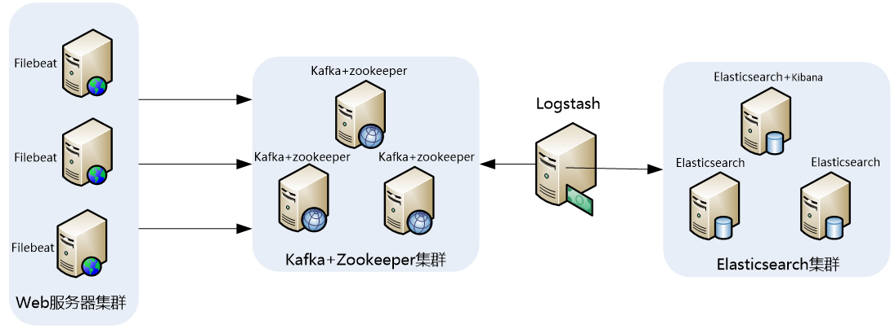

此架构稍微有些复杂，因此，这里做一下架构解读。 这个架构图从左到右，总共分为5层，每层实现的功能和含义分别介绍如下：

- 第一层、数据采集层
  数据采集层位于最左边的业务服务器集群上，在每个业务服务器上面安装了filebeat做日志收集，然后把采集到的原始日志发送到Kafka+zookeeper集群上。
- 第二层、消息队列层
  原始日志发送到Kafka+zookeeper集群上后，会进行集中存储，此时，filbeat是消息的生产者，存储的消息可以随时被消费。
- 第三层、数据分析层
  Logstash作为消费者，会去Kafka+zookeeper集群节点实时拉取原始日志，然后将获取到的原始日志根据规则进行分析、清洗、过滤，最后将清洗好的日志转发至Elasticsearch集群。
- 第四层、数据持久化存储
  Elasticsearch集群在接收到logstash发送过来的数据后，执行写磁盘，建索引库等操作，最后将结构化的数据存储到Elasticsearch集群上。
- 第五层、数据查询、展示层
  Kibana是一个可视化的数据展示平台，当有数据检索请求时，它从Elasticsearch集群上读取数据，然后进行可视化出图和多维度分析。

### 6.2 环境与角色说明

1. 服务器环境与角色
   操作系统统一采用Centos7.5版本，各个服务器角色如下表所示：

   | **IP****地址**     | **主机名**     | **角色**               | **所属集群**      |
   | ------------------ | -------------- | ---------------------- | ----------------- |
   | **172.16.213.157** | filebeatserver | 业务服务器+filebeat    | 业务服务器集群    |
   | **172.16.213.51**  | kafkazk1       | Kafka+ ZooKeeper       | Kafka Broker集群  |
   | **172.16.213.75**  | kafkazk2       | Kafka+ ZooKeeper       |                   |
   | **172.16.213.109** | kafkazk3       | Kafka+ ZooKeeper       |                   |
   | **172.16.213.120** | logstashserver | Logstash               | 数据转发          |
   | **172.16.213.37**  | server1        | ES Master、ES DataNode | Elasticsearch集群 |
   | **172.16.213.77**  | server2        | ES Master、Kibana      |                   |
   | **172.16.213.78**  | server3        | ES Master、ES DataNode |                   |

2. 软件环境与版本
   下表详细说明了本节安装软件对应的名称和版本号，其中，ELK三款软件推荐选择一样的版本，这里选择的是6.3.2版本。

   | **软件名称**      | **版本**                    | **说明**             |
   | ----------------- | --------------------------- | -------------------- |
   | **JDK**           | JDK 1.8.0_151               | Java环境解析器       |
   | **filebeat**      | filebeat-6.3.2-linux-x86_64 | 前端日志收集器       |
   | **Logstash**      | logstash-6.3.2              | 日志收集、过滤、转发 |
   | **zookeeper**     | zookeeper-3.4.11            | 资源调度、协作       |
   | **Kafka**         | kafka_2.10-0.10.0.1         | 消息通信中间件       |
   | **elasticsearch** | elasticsearch-6.3.2         | 日志存储             |
   | **kibana**        | kibana-6.3.2-linux-x86_64   | 日志展示、分析       |

### 6.3 安装JDK以及设置环境变量

1. 选择合适版本并下载JDK
   Zookeeper 、elasticsearch和Logstash都依赖于Java环境，并且elasticsearch和Logstash要求JDK版本至少在JDK1.7或者以上，因此，在安装zookeeper、Elasticsearch和Logstash的机器上，必须要安装JDK，一般推荐使用最新版本的JDK,这里我们使用JDK1.8版本，可以选择使用Oracle JDK1.8 或者Open JDK1.8。这里我们使用Oracle JDK1.8。
   从oracle官网下载linux-64版本的JDK，下载时，选择适合自己机器运行环境的版本，oracle官网提供的JDK都是二进制版本的，因此，JDK的安装非常简单，只需将下载下来的程序包解压到相应的目录即可。安装过程如下：

   ```shell
   [root@localhost ~]# mkdir /usr/java
   [root@localhost ~]# tar -zxvf jdk-8u152-linux-x64.tar.gz -C /usr/java/
   ```

   设置JDK的环境变量
   
2. 要让程序能够识别JDK路径，需要设置环境变量，这里我们将JDK环境变量设置到/etc/profile文件中。添加如下内容到/etc/profile文件最后：
   
   ```txt
   export JAVA_HOME=/usr/java/jdk1.8.0_152
   export PATH=$PATH:$JAVA_HOME/bin
   exportCLASSPATH=.:$JAVA_HOME/lib/tools.jar:$JAVA_HOME/lib/dt.jar:$CLASSPATH
   ```
   
   然后执行如下命令让设置生效：
   
   ```shell
   [root@localhost ~]# source /etc/profile
   ```

### 6.4 安装并配置Elasticsearch集群

1. Elasticsearch集群的架构与角色

   在ElasticSearch的架构中，有三类角色，分别是Client Node、Data Node和Master Node，搜索查询的请求一般是经过Client Node来向Data Node获取数据，而索引查询首先请求Master Node节点，然后Master Node将请求分配到多个Data Node节点完成一次索引查询。

   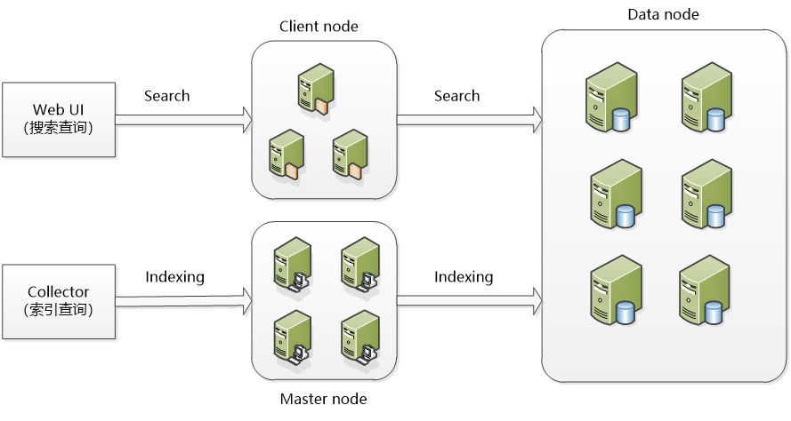

   集群中每个角色的含义介绍如下：

   - **master node：**
     可以理解为主节点，主要用于元数据(metadata)的处理，比如索引的新增、删除、分片分配等，以及管理集群各个节点的状态。elasticsearch集群中可以定义多个主节点，但是，在同一时刻，只有一个主节点起作用，其它定义的主节点，是作为主节点的候选节点存在。当一个主节点故障后，集群会从候选主节点中选举出新的主节点。
   - **data node：**
     数据节点，这些节点上保存了数据分片。它负责数据相关操作，比如分片的CRUD、搜索和整合等操作。数据节点上面执行的操作都比较消耗 CPU、内存和I/O资源，因此数据节点服务器要选择较好的硬件配置，才能获取高效的存储和分析性能。
   - **client node：**
     客户端节点，属于可选节点，是作为任务分发用的，它里面也会存元数据，但是它不会对元数据做任何修改。client node存在的好处是可以分担data node的一部分压力，因为elasticsearch的查询是两层汇聚的结果，第一层是在data node上做查询结果汇聚，然后把结果发给client node，client node接收到data node发来的结果后再做第二次的汇聚，然后把最终的查询结果返回给用户。这样，client node就替data node分担了部分压力

2. 安装Elasticsearch与授权

   Elasticsearch的安装非常简单，首先从官网https://www.elastic.co/下载页面找到适合的版本，可选择zip、tar、rpm等格式的安装包下载，这里我们下载的软件包为elasticsearch-6.3.2.tar.gz。安装过程如下：

   ```shell
   [root@localhost ~]# tar -zxvf elasticsearch-6.3.2.tar.gz -C /usr/local
   [root@localhost ~]# mv /usr/local/elasticsearch-6.3.2  /usr/local/elasticsearch
   ```


   这里我们将elasticsearch安装到了/usr/local目录下。

   由于elasticSearch可以接收用户输入的脚本并且执行，为了系统安全考虑，需要创建一个单独的用户用来运行elasticSearch，这里创建的普通用户是elasticsearch，操作如下：

   ```shell
   [root@localhost ~]# useradd elasticsearch
   ```

   然后将elasticsearch的安装目录都授权给elasticsearch用户，操作如下：

   ```shell
   [root@localhost ~]# chown -R elasticsearch:elasticsearch /usr/local/elasticsearch
   ```

3. 操作系统调优

   操作系统以及JVM调优主要是针对安装elasticsearch的机器。对于操作系统，需要调整几个内核参数，将下面内容添加到/etc/sysctl.conf文件中：

   ```
   fs.file-max=655360
   vm.max_map_count = 262144
   ```

   ```shell
   sysctl -p #使配置生效
   ```

   fs.file-max主要是配置系统最大打开文件描述符数，建议修改为655360或者更高，vm.max_map_count影响Java线程数量，用于限制一个进程可以拥有的VMA(虚拟内存区域)的大小，系统默认是65530，建议修改成262144或者更高。

   另外，还需要调整进程最大打开文件描述符（nofile）、最大用户进程数（nproc）和最大锁定内存地址空间（memlock），添加如下内容到/etc/security/limits.conf文件中：

   ```
   *	soft    nproc           20480
   *	hard    nproc           20480
   *	soft    nofile          65536
   *	hard    nofile          65536
   *	soft    memlock         unlimited
   *	hard    memlock         unlimited
   ```

   最后，还需要修改/etc/security/limits.d/20-nproc.conf文件（centos7.x系统），将：

   ```
   soft    nproc     4096
   ```

   修改为：

   ```
   soft    nproc     20480
   ```

   或者直接删除/etc/security/limits.d/20-nproc.conf文件也行。

   退出，重新登录生效

   ```shell
   ulimit -a #查看
   ```

4. JVM调优

   JVM调优主要是针对elasticsearch的JVM内存资源进行优化，elasticsearch的内存资源配置文件为jvm.options，此文件位于/usr/local/elasticsearch/config目录下，打开此文件,修改如下内容：

   ```
   -Xms2g
   -Xmx2g
   ```

   可根据服务器内存大小，修改为合适的值。一般设置为服务器物理内存的一半最佳。

5. 配置Elasticsearch

   elasticsearch的配置文件均在elasticsearch根目录下的config文件夹，这里是/usr/local/elasticsearch/config目录，主要有jvm.options、elasticsearch.yml和log4j2.properties三个主要配置文件。这里重点介绍elasticsearch.yml一些重要的配置项及其含义。这里配置的elasticsearch.yml文件内容如下：

   ```yaml
   cluster.name: elkbigdata
   node.name: server1
   node.master: true
   node.data: true
   path.data: /data1/elasticsearch,/data2/elasticsearch
   path.logs: /usr/local/elasticsearch/logs
   bootstrap.memory_lock: true
   network.host: 0.0.0.0
   http.port: 9200
   discovery.zen.minimum_master_nodes: 1
   discovery.zen.ping.unicast.hosts: ["172.16.213.37:9300","172.16.213.78:9300"]
   ```

   - **cluster.name: elkbigdata**

   配置elasticsearch集群名称，默认是elasticsearch。这里修改为elkbigdata，elasticsearch会自动发现在同一网段下的集群名为elkbigdata的主机。

   - **node.name: server1**
     节点名，任意指定一个即可，这里是server1，我们这个集群环境中有三个节点，分别是server1、server2和server3，记得根据主机的不同，要修改相应的节点名称。
   - **node.master: true**
     指定该节点是否有资格被选举成为master，默认是true，elasticsearch集群中默认第一台启动的机器为master角色，如果这台服务器宕机就会重新选举新的master。
   - **node.data: true**
     指定该节点是否存储索引数据，默认为true，表示数据存储节点，如果节点配置node.master:false并且node.data: false，则该节点就是client node。这个client node类似于一个“路由器”，负责将集群层面的请求转发到主节点，将数据相关的请求转发到数据节点。
   - **path.data:/data1/elasticsearch,/data2/elasticsearch**
     设置索引数据的存储路径，默认是elasticsearch根目录下的data文件夹，这里自定义了两个路径，可以设置多个存储路径，用逗号隔开。
   - **path.logs: /usr/local/elasticsearch/logs**
     设置日志文件的存储路径，默认是elasticsearch根目录下的logs文件夹
   - **bootstrap.memory_lock: true**
     此配置项一般设置为true用来锁住物理内存。	linux下可以通过“ulimit -l” 命令查看最大锁定内存地址空间（memlock）是不是unlimited
   - **network.host: 0.0.0.0** 
     此配置项用来设置elasticsearch提供服务的IP地址，默认值为0.0.0.0，此参数是在elasticsearch新版本中增加的，此值设置为服务器的内网IP地址即可。
   - **http.port: 9200**
     设置elasticsearch对外提供服务的http端口，默认为9200。其实，还有一个端口配置选项transport.tcp.port，此配置项用来设置节点间交互通信的TCP端口，默认是9300。
   - **discovery.zen.minimum_master_nodes: 1**
     配置当前集群中最少的master节点数，默认为1，也就是说，elasticsearch集群中master节点数不能低于此值，如果低于此值，elasticsearch集群将停止运行。在三个以上节点的集群环境中，建议配置大一点的值，推荐2至4个为好。
   - **discovery.zen.ping.unicast.hosts: ["172.16.213.37:9300","172.16.213.78:9300"]**
     设置集群中master节点的初始列表，可以通过这些节点来自动发现新加入集群的节点。这里需要注意，master节点初始列表中对应的端口是9300。即为集群交互通信端口。

6. 启动elasticsearch

   启动elasticsearch服务需要在一个普通用户下完成，如果通过root用户启动elasticsearch的话，可能会收到如下错误：

   `java.lang.RuntimeException: can not run elasticsearch as root`

   这是出于系统安全考虑，elasticsearch服务必须通过普通用户来启动，这里直接切换到elasticsearch用户下

   启动elasticsearch集群即可。分别登录到server1、server2和server3三台主机上，执行如下操作：

   ```shell
   [root@localhost ~]# su - elasticsearch
   [elasticsearch@localhost ~]$ cd /usr/local/elasticsearch/
   [elasticsearch@localhost elasticsearch]$ bin/elasticsearch -d
   ```

   其中，“-d”参数的意思是将elasticsearch放到后台运行。	

7. 验证elasticsearch集群的正确性

   验证elasticsearch集群的正确性
   将所有elasticsearch节点的服务启动后，在任意一个节点执行如下命令：

   ```shell
   [root@localhost ~]# curl http://172.16.213.77:9200
   ```

   ```
   {
     "name" : "server2",
     "cluster_name" : "elkbigdata",
     "cluster_uuid" : "UcPCn1jWTKaemOHhsCZkBw",
     "version" : {
       "number" : "6.3.2",
       "build_flavor" : "default",
       "build_type" : "zip",
       "build_hash" : "053779d",
       "build_date" : "2018-07-20T05:20:23.451332Z",
       "build_snapshot" : false,
       "lucene_version" : "7.3.1",
       "minimum_wire_compatibility_version" : "5.6.0",
       "minimum_index_compatibility_version" : "5.0.0"
     },
     "tagline" : "You Know, for Search"
   }
   ```

### 6.5 安装并配置ZooKeeper集群

对于集群模式下的ZooKeeper部署，官方建议至少要三台服务器，关于服务器的数量，推荐是奇数个（3、5、7、9等等），以实现ZooKeeper集群的高可用，这里使用三台服务器进行部署


1. 下载与安装zookeeper
   ZooKeeper是用Java编写的，需要安装Java运行环境，可以从zookeeper官网https://zookeeper.apache.org/获取zookeeper安装包，这里安装的版本是zookeeper-3.4.11.tar.gz。将下载下来的安装包直接解压到一个路径下即可完成zookeeper的安装，

   ```shell
   [root@localhost ~]# tar -zxvf zookeeper-3.4.11.tar.gz -C /usr/local
   [root@localhost ~]# mv /usr/local/zookeeper-3.4.11  /usr/local/zookeeper
   ```

2. 配置zookeeper
   	zookeeper安装到了/usr/local目录下，因此，zookeeper的配置模板文件为/usr/local/zookeeper/conf/zoo_sample.cfg，拷贝zoo_sample.cfg并重命名为zoo.cfg，重点配置如下内容：

   ```
   tickTime=2000
   initLimit=10
   syncLimit=5
   dataDir=/data/zookeeper
   clientPort=2181
   server.1=172.16.213.51:2888:3888
   server.2=172.16.213.109:2888:3888
   server.3=172.16.213.75:2888:3888	
   ```
   
   每个配置项含义如下：
   
   - **tickTime：**zookeeper使用的基本时间度量单位，以毫秒为单位，它用来控制心跳和超时。2000表示2 tickTime。更低的tickTime值可以更快地发现超时问题。
   
   - **initLimit：**这个配置项是用来配置Zookeeper集群中Follower服务器初始化连接到Leader时，最长能忍受多少个心跳时间间隔数（也就是tickTime）
   
   - **syncLimit：**这个配置项标识Leader与Follower之间发送消息，请求和应答时间长度最长不能超过多少个tickTime的时间长度
   
   - **dataDir：**必须配置项，用于配置存储快照文件的目录。需要事先创建好这个目录，如果没有配置dataLogDir，那么事务日志也会存储在此目录。
   
   - **clientPort：**zookeeper服务进程监听的TCP端口，默认情况下，服务端会监听2181端口。
   
   - **server.A=B:C:D：**其中A是一个数字，表示这是第几个服务器；B是这个服务器的IP地址；C表示的是这个服务器与集群中的Leader服务器通信的端口；D 表示如果集群中的Leader服务器宕机了，需要一个端口来重新进行选举，选出一个新的 Leader，而这个端口就是用来执行选举时服务器相互通信的端口。
   
     除了修改zoo.cfg配置文件外，集群模式下还要配置一个文件myid，这个文件需要放在dataDir配置项指定的目录下，这个文件里面只有一个数字，如果要写入1，表示第一个服务器，与zoo.cfg文本中的server.1中的1对应，以此类推，在集群的第二个服务器zoo.cfg配置文件中dataDir配置项指定的目录下创建myid文件，写入2，这个2与zoo.cfg文本中的server.2中的2对应。Zookeeper在启动时会读取这个文件，得到里面的数据与zoo.cfg里面的配置信息比较，从而判断每个zookeeper server的对应关系。 
   
     为了保证zookeeper集群配置的规范性，建议将zookeeper集群中每台服务器的安装和配置文件路径都保存一致。
   
3. 启动zookeeper集群

    在三个节点依次执行如下命令，启动Zookeeper服务：

    ```
    [root@localhost ~]# cd /usr/local/zookeeper/bin
    [root@localhost bin]# ./zkServer.sh  start
    [root@localhost kafka]# jps
    23097 QuorumPeerMain
    ```

    Zookeeper启动后，通过jps命令（jdk内置命令）可以看到有一个QuorumPeerMain标识，这个就是Zookeeper启动的进程，前面的数字是Zookeeper进程的PID。

    有时候为了启动Zookeeper方面，也可以添加zookeeper环境变量到系统的/etc/profile中，这样，在任意路径都可以执行“zkServer.sh  start”命令了，添加环境变量的内容为：

    ```
    export ZOOKEEPER_HOME=/usr/local/zookeeper
    export PATH=$PATH:$ZOOKEEPER_HOME/bin
    ```

    