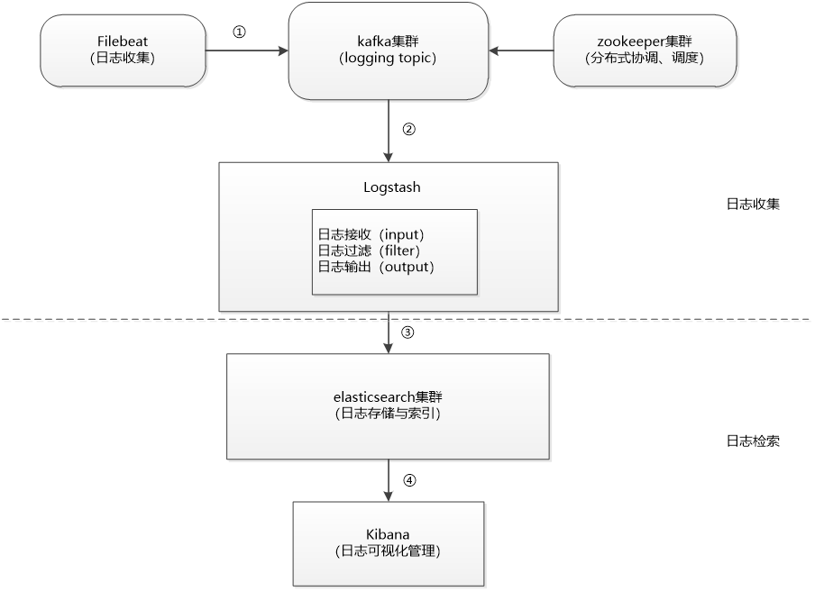
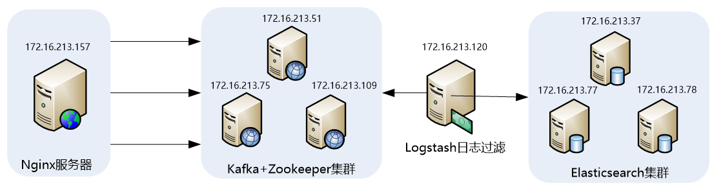
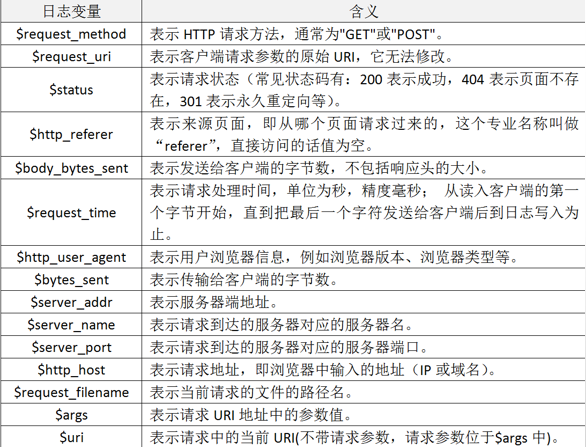

# ELK大规模日志实时处理

## 一 ELK架构介绍

### 1.1 核心组成
ELK是一个应用套件，由Elasticsearch、Logstash和Kibana三部分组件组成，简称ELK；它是一套开源免费、功能强大的日志分析管理系统。ELK可以将我们的系统日志、网站日志、应用系统日志等各种日志进行收集、过滤、清洗，然后进行集中存放并可用于实时检索、分析。

这三款软件都是开源软件，通常是配合使用，而且又先后归于Elastic.co公司名下，故又被简称为ELK Stack。下图是ELK Stack的基础组成。


### 1.2 Elasticsearch介绍
Elasticsearch是一个实时的分布式搜索和分析引擎，它可以用于全文搜索，结构化搜索以及分析，采用Java语言编写。它的主要特点如下：

- 实时搜索，实时分析

- 分布式架构、实时文件存储，并将每一个字段都编入索引

- 文档导向，所有的对象全部是文档

- 高可用性，易扩展，支持集群（Cluster）、分片和复制（Shards和Replicas）

- 接口友好，支持JSON

Elasticsearch支持集群架构，典型的集群架构如下图所示：


从图中可以看出，Elasticsearch集群中有Master Node和Slave Node两种角色，其实还有一种角色Client Node，这在后面会做深入介绍。

### 1.3 Logstash 介绍

Logstash是一款轻量级的、开源的日志收集处理框架，它可以方便的把分散的、多样化的日志搜集起来，并进行自定义过滤分析处理，然后传输到指定的位置，比如某个服务器或者文件。Logstash采用JRuby语言编写，它的主要特点如下：
Logstash的理念很简单，从功能上来讲，它只做三件事情：

- input：数据收集

- filter：数据加工，如过滤，改写等

- output：数据输出

别看它只做三件事，但通过组合输入和输出，可以变幻出多种架构实现多种需求。Logstash内部运行逻辑如下图所示：


其中，每个部分含义如下：

- Shipper：主要用来收集日志数据，负责监控本地日志文件的变化，及时把日志文件的最新内容收集起来，然后经过加工、过滤，输出到Broker。

- Broker：相当于日志Hub，用来连接多个Shipper和多个Indexer。

- Indexer：从Broker读取文本，经过加工、过滤，输出到指定的介质（可以是文件、网络、elasticsearch等）中。 

Redis服务器是logstash官方推荐的broker，这个broker起数据缓存的作用，通过这个缓存器可以提高Logstash shipper发送日志到Logstash indexer的速度，同时避免由于突然断电等导致的数据丢失。可以实现broker功能的还有很多软件，例如kafka等。

这里需要说明的是，在实际应用中，LogStash自身并没有什么角色，只是根据不同的功能、不同的配置给出不同的称呼而已，无论是Shipper还是Indexer，始终只做前面提到的三件事。

这里需要重点掌握的是logstash中Shipper和Indexer的作用，因为这两个部分是logstash功能的核心，在下面的介绍中，会陆续介绍到这两个部分实现的功能细节。

### 1.4 Kibana 介绍

Kibana是一个开源的数据分析可视化平台。使用Kibana可以为Logstash和ElasticSearch提供的日志数据进行高效的搜索、可视化汇总和多维度分析，还可以与Elasticsearch搜索引擎之中的数据进行交互。它基于浏览器的界面操作可以快速创建动态仪表板，实时监控ElasticSearch的数据状态与更改。

#### ELK工作流程
一般都是在需要收集日志的所有服务上部署logstash，作为logstash shipper用于监控并收集、过滤日志，接着，将过滤后的日志发送给Broker，然后，Logstash Indexer将存放在Broker中的数据再写入Elasticsearch，Elasticsearch对这些数据创建索引，最后由Kibana对其进行各种分析并以图表的形式展示。


有些时候，如果收集的日志量较大，为了保证日志收集的性能和数据的完整性，logstash shipper和logstash indexer之间的缓冲器（Broker）也经常采用kafka来实现。

在这个图中，要重点掌握的是ELK架构的数据流向，以及logstash、Elasticsearch和Kibana组合实现的功能细节。	

## 二 ZooKeeper基础与入门

### 2.1 ZooKeeper概念介绍

在介绍ZooKeeper之前，先来介绍一下分布式协调技术，所谓分布式协调技术主要是用来解决分布式环境当中多个进程之间的同步控制，让他们有序的去访问某种共享资源，防止造成资源竞争（脑裂）的后果。

这里首先介绍下什么是分布式系统，所谓分布式系统就是在不同地域分布的多个服务器，共同组成的一个应用系统来为用户提供服务，在分布式系统中最重要的是进程的调度，这里假设有一个分布在三个地域的服务器组成的一个
应用系统，在第一台机器上挂载了一个资源，然后这三个地域分布的应用进程都要竞争这个资源，但我们又不希望多个进程同时进行访问，这个时候就需要一个协调器，来让它们有序的来访问这个资源。

这个协调器就是分布式系统中经常提到的那个“锁”。


例如"进程1"在使用该资源的时候，会先去获得这把锁，"进程1"获得锁以后会对该资源保持独占，此时其它进程就无法访问该资源，"进程1"在用完该资源以后会将该锁释放掉，以便让其它进程来获得锁。由此可见，通过这个“锁”机制，就可以保证分布式系统中多个进程能够有序的访问该共享资源。这里把这个分布式环境下的这个“锁”叫作分布式锁。这个分布式锁就是分布式协调技术实现的核心内容。

综上所述，ZooKeeper是一种为分布式应用所设计的高可用、高性能的开源协调服务，它提供了一项基本服务：分布式锁服务，同时，也提供了数据的维护和管理机制，如：统一命名服务、状态同步服务、集群管理、分布式消息队列、分布式应用配置项的管理等等。

### 2.2 ZooKeeper应用举例　

这里以ZooKeeper提供的基本服务**分布式锁**为例进行介绍。在分布式锁服务中，有一种最典型应用场景，就是通过对集群进行Master角色的选举，来解决分布式系统中的单点故障问题。所谓单点故障，就是在一个主从的分布式系统中，主节点负责任务调度分发，从节点负责任务的处理，而当主节点发生故障时，整个应用系统也就瘫痪了，那么这种故障就称为单点故障。

解决单点故障，传统的方式是采用一个备用节点，这个备用节点定期向主节点发送ping包，主节点收到ping包以后向备用节点发送回复Ack信息，当备用节点收到回复的时候就会认为当前主节点运行正常，让它继续提供服务。而当主节点故障时，备用节点就无法收到回复信息了，此时，备用节点就认为主节点宕机，然后接替它成为新的主节点继续提供服务。


这种传统解决单点故障的方法，虽然在一定程度上解决了问题，但是有一个隐患，就是网络问题，可能会存在这样一种情况：主节点并没有出现故障，只是在回复ack响应的时候网络发生了故障，这样备用节点就无法收到回复，那么它就会认为主节点出现了故障，接着，备用节点将接管主节点的服务，并成为新的主节点，此时，分布式系统中就出现了两个主节点（双Master节点）的情况，双Master节点的出现（脑裂），会导致分布式系统的服务发生混乱。这样的话，整个分布式系统将变得不可用。为了防止出现这种情况，就需要引入ZooKeeper来解决这种问题。


### 2.3 ZooKeeper工作原理

下面通过三种情形，介绍下Zookeeper是如何进行工作的。

（1） Master启动

在分布式系统中引入Zookeeper以后，就可以配置多个主节点，这里以配置两个主节点为例，假定它们是"主节点A"和"主节点B"，当两个主节点都启动后，它们都会向ZooKeeper中注册节点信息。我们假设"主节点A"锁注册的节点信息是"master00001"，"主节点B"注册的节点信息是"master00002"，注册完以后会进行选举，选举有多种算法，这里以编号最小作为选举算法，那么编号最小的节点将在选举中获胜并获得锁成为主节点，也就是"主节点A"将会获得锁成为主节点，然后"主节点B"将被阻塞成为一个备用节点。这样，通过这种方式Zookeeper就完成了对两个Master进程的调度。完成了主、备节点的分配和协作。


（2） Master故障

如果"主节点A"发生了故障，这时候它在ZooKeeper所注册的节点信息会被自动删除，而ZooKeeper会**自动感知节点的变化**，发现"主节点A"故障后，会再次发出选举，这时候"主节点B"将在选举中获胜，替代"主节点A"成为新的主节点，这样就完成了主、被节点的重新选举。


（3）Master恢复

如果主节点恢复了，它会再次向ZooKeeper注册自身的节点信息，只不过这时候它注册的节点信息将会变成"master00003"，而不是原来的信息。ZooKeeper会感知节点的变化再次发动选举，这时候"主节点B"在选举中会再次获胜继续担任"主节点"，"主节点A"会担任备用节点。

Zookeeper就是通过这样的协调、调度机制如此反复的对集群进行管理和状态同步的。


### 2.4 Zookeeper集群架构

Zookeeper一般是通过集群架构来提供服务的，下图是Zookeeper的基本架构图。


Zookeeper集群主要角色有Server和client，其中，Server又分为Leader、Follower和Observer三个角色，每个角色的含义如下：

- Leader：领导者角色，主要负责投票的发起和决议，以及更新系统状态。

- Follower：跟随者角色，用于接收客户端的请求并返回结果给客户端，在选举过程中参与投票。

- Observer：观察者角色，用户接收客户端的请求，并将写请求转发给leader，同时同步leader状态，但不参与投票。

- Observer目的是扩展系统，提高伸缩性。

- Client:客户端角色，用于向Zookeeper发起请求。

Zookeeper集群中每个Server在内存中存储了一份数据，在Zookeeper启动时，将从实例中选举一个Server作为leader，Leader负责处理数据更新等操作，当且仅当大多数Server在内存中成功修改数据，才认为数据修改成功。

Zookeeper写的流程为：客户端Client首先和一个Server或者Observe通信，发起写请求，然后Server将写请求转发给Leader，	Leader再将写请求转发给其它Server，其它Server在接收到写请求后写入数据并响应Leader，Leader在接收到大多数写成功回应后，认为数据写成功，最后响应Client，完成一次写操作过程。


## 三 kafka基础与入门

### 3.1 kafka基本概念

Kafka是一种高吞吐量的分布式发布/订阅消息系统，这是官方对kafka的定义，kafka是Apache组织下的一个开源系统，它的最大的特性就是可以实时的处理大量数据以满足各种需求场景：比如基于hadoop平台的数据分析、低时延的实时系统、storm/spark流式处理引擎等。kafka现在它已被多家大型公司作为多种类型的数据管道和消息系统使用。

### 3.2 kafka角色术语

在介绍架构之前，先了解下kafka中一些核心概念和各种角色。

- Broker：Kafka集群包含一个或多个服务器，每个服务器被称为broker。
- Topic：每条发布到Kafka集群的消息都有一个分类，这个类别被称为Topic（主题）。
- Producer：指消息的生产者，负责发布消息到Kafka broker。
- Consumer :指消息的消费者，从Kafka broker拉取数据，并消费这些已发布的消息。
- Partition：Parition是物理上的概念，每个Topic包含一个或多个Partition，每个partition都是一个有序的队列。partition 中的每条消息都会被分配一个有序的id（称为offset）。
- Consumer Group:消费者组，可以给每个Consumer指定消费者组，若不指定消费者组，则属于默认的group。
- Message：消息，通信的基本单位，每个producer可以向一个topic发布一些消息。

### 3.3 Kafka拓扑架构

一个典型的Kafka集群包含若干Producer，若干broker、若干Consumer Group，以及一个Zookeeper集群。Kafka通过Zookeeper管理集群配置，选举leader，以及在Consumer Group发生变化时进行rebalance。Producer使用push模式将消息发布到broker，Consumer使用pull模式从broker订阅并消费消息。


### 3.4 Topic与Partition

Kafka中的topic是以partition的形式存放的，每一个topic都可以设置它的partition数量，Partition的数量决定了组成topic的log的数量。推荐partition的数量一定要大于同时运行的consumer的数量。另外，建议partition的数量大于集群broker的数量，这样消息数据就可以均匀的分布在各个broker中。

那么，Topic为什么要设置多个Partition呢，这是因为kafka是基于文件存储的，通过配置多个partition可以将消息内容分散存储到多个broker上,这样可以避免文件尺寸达到单机磁盘的上限。同时，将一个topic切分成任意多个partitions，可以保证消息存储、消息消费的效率，因为越多的partitions可以容纳更多的consumer，可有效提升Kafka的吞吐率。因此，将Topic切分成多个partitions的好处是可以将大量的消息分成多批数据同时写到不同节点上，将写请求分担负载到各个集群节点。

### 3.5 Kafka消息发送的机制

每当用户往某个Topic发送数据时，数据会被hash到不同的partition,这些partition位于不同的集群节点上，所以每个消息都会被记录一个offset消息号，就是offset号。消费者通过这个offset号去查询读取这个消息。

**发送消息流程为：**

首先获取topic的所有Patition，如果客户端不指定Patition，也没有指定Key的话，使用自增长的数字取余数的方式实现指定的Partition。这样Kafka将平均的向Partition中生产数据。如果想要控制发送的partition，则有两种方式，一种是指定partition，另一种就是根据Key自己写算法。实现其partition方法。

每一条消息被发送到broker时，会根据paritition规则选择被存储到哪一个partition。如果partition规则设置的合理，所有消息可以均匀分布到不同的partition里，这样就实现了水平扩展。同时，每条消息被append到partition中时，是顺序写入磁盘的,因此效率非常高，经验证，顺序写磁盘效率比随机写内存还要高，这是Kafka高吞吐率的一个很重要的保证。


### 3.6 Kafka消息消费机制

Kafka中的Producer和consumer采用的是push（推送）、pull（拉取）的模式，即Producer只是向broker push消息，consumer只是从broker pull消息，push和pull对于消息的生产和消费是异步进行的。pull模式的一个好处是Consumer可自主控制消费消息的速率，同时Consumer还可以自己控制消费消息的方式是批量的从broker拉取数据还是逐条消费数据。

当生产者将数据发布到topic时，消费者通过pull的方式，定期从服务器拉取数据,当然在pull数据的时候，服务器会告诉consumer可消费的消息offset。


消费规则：

1. 不同 Consumer Group下的消费者可以消费partition中相同的消息，相同的Consumer  Group下的消费者只能消费partition中不同的数据。
2. topic的partition的个数和同一个消费组的消费者个数最好一致，如果消费者个数多于partition个数，则会存在有的消费者消费不到数据。
3. 服务器会记录每个consumer的在每个topic的每个partition下的消费的offset,然后每次去消费去拉取数据时，都会从上次记录的位置开始拉取数据。

### 3.7 Kafka消息存储机制

在存储结构上，每个partition在物理上对应一个文件夹，该文件夹下存储这个partition的所有消息和索引文件，每个partion(目录)相当于一个巨型文件被平均分配到多个大小相等segment(段)数据文件中。

partiton命名规则为topic名称+序号，第一个partiton序号从0开始，序号最大值为partitions数量减1。

在每个partition (文件夹)中有多个大小相等的segment(段)数据文件，每个segment的大小是相同的，但是每条消息的大小可能不相同，因此segment 数据文件中消息数量不一定相等。


segment数据文件有两个部分组成，分别为index file和data file，此两个文件是一一对应，成对出现，后缀".index"和“.log”分别表示为segment索引文件和数据文件。


其实Kafka最核心的思想是**使用磁盘，而不是使用内存**，使用磁盘操作有以下几个好处：
1、磁盘缓存由Linux系统维护，减少了程序员的不少工作。
2、磁盘顺序读写速度超过内存随机读写。
3、JVM的GC效率低，内存占用大。使用磁盘可以避免这一问题。
4、系统冷启动后，磁盘缓存依然可用。


## 四 Filebeat基础与入门

### 4.1 什么是Filebeat

Filebeat是一个开源的文本日志收集器,它是elastic公司Beats数据采集产品的一个子产品，采用go语言开发，一般安装在业务服务器上作为代理来监测日志目录或特定的日志文件，并把它们发送到logstash、elasticsearch、redis或Kafka等。可以在官方地址https://www.elastic.co/downloads/beats下载各个版本的Filebeat。

### 4.2 Filebeat架构与运行原理

Filebeat是一个轻量级的日志监测、传输工具，它最大的特点是性能稳定、配置简单、占用系统资源很少。
这也是强烈推荐Filebeat的原因。官方给出的Filebeat架构图：


从图中可以看出，Filebeat主要由两个组件构成： prospector（探测器）和harvester（收集器）。这两类组件一起协作完成Filebeat的工作。

其中，Harvester负责进行单个文件的内容收集，在运行过程中，每一个Harvester会对一个文件逐行进行内容读取，并且把读写到的内容发送到配置的output中。当Harvester开始进行文件的读取后，将会负责这个文件的打开和关闭操作，因此，在Harvester运行过程中，文件都处于打开状态。如果在收集过程中，删除了这个文件或者是对文件进行了重命名，Filebeat依然会继续对这个文件进行读取，这时候将会一直占用着文件所对应的磁盘空间，直到Harvester关闭。

Prospector负责管理Harvster，它会找到所有需要进行读取的数据源。然后交给Harvster进行内容收集，如果input type配置的是log类型，Prospector将会去配置路径下查找所有能匹配上的文件，然后为每一个文件创建一个Harvster。

综上所述，filebeat的工作流程为：当开启filebeat程序的时候，它会启动一个或多个探测器（prospector）去检测指定的日志目录或文件，对于探测器找出的每一个日志文件，filebeat会启动收集进程（harvester），每一个收集进程读取一个日志文件的内容，然后将这些日志数据发送到后台处理程序（spooler），后台处理程序会集合这些事件，最后发送集合的数据到output指定的目的地。

## 五 ELK常见应用架构

### 5.1 简单的ELK应用架构


此架构主要是将Logstash部署在各个节点上搜集相关日志、数据，并经过分析、过滤后发送给远端服务器上的Elasticsearch进行存储。Elasticsearch再将数据以分片的形式压缩存储，并提供多种API供用户查询、操作。用户可以通过Kibana Web直观的对日志进行查询，并根据需求生成数据报表。

此架构的优点是搭建简单，易于上手。缺点是Logstash消耗系统资源比较大，运行时占用CPU和内存资源较高。另外，由于没有消息队列缓存，可能存在数据丢失的风险。此架构建议供初学者或数据量小的环境使用。

### 5.2 典型ELK架构


此架构主要特点是引入了消息队列机制，位于各个节点上的Logstash Agent（一级Logstash，主要用来传输数据）先将数据传递给消息队列（常见的有Kafka、Redis等），接着，Logstash server（二级Logstash，主要用来拉取消息队列数据，过滤并分析数据）将格式化的数据传递给Elasticsearch进行存储。最后，由Kibana将日志和数据呈现给用户。由于引入了Kafka（或者Redis）缓存机制，即使远端Logstash server因故障停止运行，数据也不会丢失，因为数据已经被存储下来了。

这种架构适合于较大集群、数据量一般的应用环境，但由于二级Logstash要分析处理大量数据，同时Elasticsearch也要存储和索引大量数据，因此它们的负荷会比较重，解决的方法是将它们配置为集群模式，以分担负载。

此架构的优点在于引入了消息队列机制，均衡了网络传输，从而降低了网络闭塞尤其是丢失数据的可能性，但依然存在Logstash占用系统资源过多的问题，在海量数据应用场景下，可能会出现性能瓶颈。

### 5.3 ELK集群架构


这个架构是在上面第二个架构基础上改进而来的，主要是将前端收集数据的Logstash Agent换成了filebeat，消息队列使用了kafka集群，然后将Logstash和Elasticsearch都通过集群模式进行构建，此架构适合大型集群、海量数据的业务场景，它通过将前端Logstash Agent替换成filebeat，有效降低了收集日志对业务系统资源的消耗。同时，消息队列使用kafka集群架构，有效保障了收集数据的安全性和稳定性，而后端Logstash和Elasticsearch均采用集群模式搭建，从整体上提高了ELK系统的高效性、扩展性和吞吐量。

下面我们就以此架构为主介绍如何安装、配置、构建和使用ELK大数据日志分析系统。

## 六 构建大数据日志分析平台

### 6.1 ELK应用架构(ELK+Filebeat+Kafka+ZooKeeper)


此架构稍微有些复杂，因此，这里做一下架构解读。 这个架构图从左到右，总共分为5层，每层实现的功能和含义分别介绍如下：

- 第一层、数据采集层
  数据采集层位于最左边的业务服务器集群上，在每个业务服务器上面安装了filebeat做日志收集，然后把采集到的原始日志发送到Kafka+zookeeper集群上。
- 第二层、消息队列层
  原始日志发送到Kafka+zookeeper集群上后，会进行集中存储，此时，filbeat是消息的生产者，存储的消息可以随时被消费。
- 第三层、数据分析层
  Logstash作为消费者，会去Kafka+zookeeper集群节点实时拉取原始日志，然后将获取到的原始日志根据规则进行分析、清洗、过滤，最后将清洗好的日志转发至Elasticsearch集群。
- 第四层、数据持久化存储
  Elasticsearch集群在接收到logstash发送过来的数据后，执行写磁盘，建索引库等操作，最后将结构化的数据存储到Elasticsearch集群上。
- 第五层、数据查询、展示层
  Kibana是一个可视化的数据展示平台，当有数据检索请求时，它从Elasticsearch集群上读取数据，然后进行可视化出图和多维度分析。

### 6.2 环境与角色说明

1. **服务器环境与角色**
   

操作系统统一采用Centos7.5版本，各个服务器角色如下表所示：

| **IP****地址**     | **主机名**     | **角色**               | **所属集群**      |
| ------------------ | -------------- | ---------------------- | ----------------- |
| **172.16.213.157** | filebeatserver | 业务服务器+filebeat    | 业务服务器集群    |
| **172.16.213.51**  | kafkazk1       | Kafka+ ZooKeeper       | Kafka Broker集群  |
| **172.16.213.75**  | kafkazk2       | Kafka+ ZooKeeper       |                   |
| **172.16.213.109** | kafkazk3       | Kafka+ ZooKeeper       |                   |
| **172.16.213.120** | logstashserver | Logstash               | 数据转发          |
| **172.16.213.37**  | server1        | ES Master、ES DataNode | Elasticsearch集群 |
| **172.16.213.77**  | server2        | ES Master、Kibana      |                   |
| **172.16.213.78**  | server3        | ES Master、ES DataNode |                   |

2. **软件环境与版本**

   下表详细说明了本节安装软件对应的名称和版本号，其中，ELK三款软件推荐选择一样的版本，这里选择的是6.3.2版本。

   | **软件名称**      | **版本**                    | **说明**             |
   | ----------------- | --------------------------- | -------------------- |
   | **JDK**           | JDK 1.8.0_151               | Java环境解析器       |
   | **filebeat**      | filebeat-6.3.2-linux-x86_64 | 前端日志收集器       |
   | **Logstash**      | logstash-6.3.2              | 日志收集、过滤、转发 |
   | **zookeeper**     | zookeeper-3.4.11            | 资源调度、协作       |
   | **Kafka**         | kafka_2.10-0.10.0.1         | 消息通信中间件       |
   | **elasticsearch** | elasticsearch-6.3.2         | 日志存储             |
   | **kibana**        | kibana-6.3.2-linux-x86_64   | 日志展示、分析       |

### 6.3 安装JDK以及设置环境变量

1. **选择合适版本并下载JDK**
   Zookeeper 、elasticsearch和Logstash都依赖于Java环境，并且elasticsearch和Logstash要求JDK版本至少在JDK1.7或者以上，因此，在安装zookeeper、Elasticsearch和Logstash的机器上，必须要安装JDK，一般推荐使用最新版本的JDK,这里我们使用JDK1.8版本，可以选择使用Oracle JDK1.8 或者Open JDK1.8。这里我们使用Oracle JDK1.8。
   从oracle官网下载linux-64版本的JDK，下载时，选择适合自己机器运行环境的版本，oracle官网提供的JDK都是二进制版本的，因此，JDK的安装非常简单，只需将下载下来的程序包解压到相应的目录即可。安装过程如下：

   ```shell
   [root@localhost ~]# mkdir /usr/java
   [root@localhost ~]# tar -zxvf jdk-8u152-linux-x64.tar.gz -C /usr/java/
   ```

   设置JDK的环境变量
   
2. **要让程序能够识别JDK路径，需要设置环境变量，这里我们将JDK环境变量设置到/etc/profile文件中。**
   
   添加如下内容到/etc/profile文件最后：
   
   ```txt
   export JAVA_HOME=/usr/java/jdk1.8.0_152
   export PATH=$PATH:$JAVA_HOME/bin
   exportCLASSPATH=.:$JAVA_HOME/lib/tools.jar:$JAVA_HOME/lib/dt.jar:$CLASSPATH
   ```
   
   然后执行如下命令让设置生效：
   
   ```shell
   [root@localhost ~]# source /etc/profile
   ```

### 6.4 安装并配置Elasticsearch集群

1. **Elasticsearch集群的架构与角色**

   在ElasticSearch的架构中，有三类角色，分别是Client Node、Data Node和Master Node，搜索查询的请求一般是经过Client Node来向Data Node获取数据，而索引查询首先请求Master Node节点，然后Master Node将请求分配到多个Data Node节点完成一次索引查询。

   

   集群中每个角色的含义介绍如下：

   - **master node：**
     可以理解为主节点，主要用于元数据(metadata)的处理，比如索引的新增、删除、分片分配等，以及管理集群各个节点的状态。elasticsearch集群中可以定义多个主节点，但是，在同一时刻，只有一个主节点起作用，其它定义的主节点，是作为主节点的候选节点存在。当一个主节点故障后，集群会从候选主节点中选举出新的主节点。
   - **data node：**
     数据节点，这些节点上保存了数据分片。它负责数据相关操作，比如分片的CRUD、搜索和整合等操作。数据节点上面执行的操作都比较消耗 CPU、内存和I/O资源，因此数据节点服务器要选择较好的硬件配置，才能获取高效的存储和分析性能。
   - **client node：**
     客户端节点，属于可选节点，是作为任务分发用的，它里面也会存元数据，但是它不会对元数据做任何修改。client node存在的好处是可以分担data node的一部分压力，因为elasticsearch的查询是两层汇聚的结果，第一层是在data node上做查询结果汇聚，然后把结果发给client node，client node接收到data node发来的结果后再做第二次的汇聚，然后把最终的查询结果返回给用户。这样，client node就替data node分担了部分压力

2. **安装Elasticsearch与授权**

   Elasticsearch的安装非常简单，首先从官网https://www.elastic.co/下载页面找到适合的版本，可选择zip、tar、rpm等格式的安装包下载，这里我们下载的软件包为elasticsearch-6.3.2.tar.gz。安装过程如下：

   ```shell
   [root@localhost ~]# tar -zxvf elasticsearch-6.3.2.tar.gz -C /usr/local
   [root@localhost ~]# mv /usr/local/elasticsearch-6.3.2  /usr/local/elasticsearch
   ```


   这里我们将elasticsearch安装到了/usr/local目录下。

   由于elasticSearch可以接收用户输入的脚本并且执行，为了系统安全考虑，需要创建一个单独的用户用来运行elasticSearch，这里创建的普通用户是elasticsearch，操作如下：

   ```shell
   [root@localhost ~]# useradd elasticsearch
   ```

   然后将elasticsearch的安装目录都授权给elasticsearch用户，操作如下：

   ```shell
   [root@localhost ~]# chown -R elasticsearch:elasticsearch /usr/local/elasticsearch
   ```

3. **操作系统调优**

   操作系统以及JVM调优主要是针对安装elasticsearch的机器。对于操作系统，需要调整几个内核参数，将下面内容添加到/etc/sysctl.conf文件中：

   ```
   fs.file-max=655360
   vm.max_map_count = 262144
   ```

   ```shell
   sysctl -p #使配置生效
   ```

   fs.file-max主要是配置系统最大打开文件描述符数，建议修改为655360或者更高，vm.max_map_count影响Java线程数量，用于限制一个进程可以拥有的VMA(虚拟内存区域)的大小，系统默认是65530，建议修改成262144或者更高。

   另外，还需要调整进程最大打开文件描述符（nofile）、最大用户进程数（nproc）和最大锁定内存地址空间（memlock），添加如下内容到/etc/security/limits.conf文件中：

   ```
   *	soft    nproc           20480
   *	hard    nproc           20480
   *	soft    nofile          65536
   *	hard    nofile          65536
   *	soft    memlock         unlimited
   *	hard    memlock         unlimited
   ```

   最后，还需要修改/etc/security/limits.d/20-nproc.conf文件（centos7.x系统），将：

   ```
   soft    nproc     4096
   ```

   修改为：

   ```
   soft    nproc     20480
   ```

   或者直接删除/etc/security/limits.d/20-nproc.conf文件也行。

   退出，重新登录生效

   ```shell
   ulimit -a #查看
   ```

4. **JVM调优**

   JVM调优主要是针对elasticsearch的JVM内存资源进行优化，elasticsearch的内存资源配置文件为jvm.options，此文件位于/usr/local/elasticsearch/config目录下，打开此文件,修改如下内容：

   ```
   -Xms2g
   -Xmx2g
   ```

   可根据服务器内存大小，修改为合适的值。一般设置为服务器物理内存的一半最佳。

5. **配置Elasticsearch**

   elasticsearch的配置文件均在elasticsearch根目录下的config文件夹，这里是/usr/local/elasticsearch/config目录，主要有jvm.options、elasticsearch.yml和log4j2.properties三个主要配置文件。这里重点介绍elasticsearch.yml一些重要的配置项及其含义。这里配置的elasticsearch.yml文件内容如下：

   ```yaml
   cluster.name: elkbigdata
   node.name: server1
   node.master: true
   node.data: true
   path.data: /data1/elasticsearch,/data2/elasticsearch
   path.logs: /usr/local/elasticsearch/logs
   bootstrap.memory_lock: true
   network.host: 0.0.0.0
   http.port: 9200
   discovery.zen.minimum_master_nodes: 1
   discovery.zen.ping.unicast.hosts: ["172.16.213.37:9300","172.16.213.78:9300"]
   ```

   - **cluster.name: elkbigdata**

   配置elasticsearch集群名称，默认是elasticsearch。这里修改为elkbigdata，elasticsearch会自动发现在同一网段下的集群名为elkbigdata的主机。

   - **node.name: server1**
     节点名，任意指定一个即可，这里是server1，我们这个集群环境中有三个节点，分别是server1、server2和server3，记得根据主机的不同，要修改相应的节点名称。
   - **node.master: true**
     指定该节点是否有资格被选举成为master，默认是true，elasticsearch集群中默认第一台启动的机器为master角色，如果这台服务器宕机就会重新选举新的master。
   - **node.data: true**
     指定该节点是否存储索引数据，默认为true，表示数据存储节点，如果节点配置node.master:false并且node.data: false，则该节点就是client node。这个client node类似于一个“路由器”，负责将集群层面的请求转发到主节点，将数据相关的请求转发到数据节点。
   - **path.data:/data1/elasticsearch,/data2/elasticsearch**
     设置索引数据的存储路径，默认是elasticsearch根目录下的data文件夹，这里自定义了两个路径，可以设置多个存储路径，用逗号隔开。
   - **path.logs: /usr/local/elasticsearch/logs**
     设置日志文件的存储路径，默认是elasticsearch根目录下的logs文件夹
   - **bootstrap.memory_lock: true**
     此配置项一般设置为true用来锁住物理内存。	linux下可以通过“ulimit -l” 命令查看最大锁定内存地址空间（memlock）是不是unlimited
   - **network.host: 0.0.0.0** 
     此配置项用来设置elasticsearch提供服务的IP地址，默认值为0.0.0.0，此参数是在elasticsearch新版本中增加的，此值设置为服务器的内网IP地址即可。
   - **http.port: 9200**
     设置elasticsearch对外提供服务的http端口，默认为9200。其实，还有一个端口配置选项transport.tcp.port，此配置项用来设置节点间交互通信的TCP端口，默认是9300。
   - **discovery.zen.minimum_master_nodes: 1**
     配置当前集群中最少的master节点数，默认为1，也就是说，elasticsearch集群中master节点数不能低于此值，如果低于此值，elasticsearch集群将停止运行。在三个以上节点的集群环境中，建议配置大一点的值，推荐2至4个为好。
   - **discovery.zen.ping.unicast.hosts: ["172.16.213.37:9300","172.16.213.78:9300"]**
     设置集群中master节点的初始列表，可以通过这些节点来自动发现新加入集群的节点。这里需要注意，master节点初始列表中对应的端口是9300。即为集群交互通信端口。

6. **启动elasticsearch**

   启动elasticsearch服务需要在一个普通用户下完成，如果通过root用户启动elasticsearch的话，可能会收到如下错误：

   `java.lang.RuntimeException: can not run elasticsearch as root`

   这是出于系统安全考虑，elasticsearch服务必须通过普通用户来启动，这里直接切换到elasticsearch用户下

   启动elasticsearch集群即可。分别登录到server1、server2和server3三台主机上，执行如下操作：

   ```shell
   [root@localhost ~]# su - elasticsearch
   [elasticsearch@localhost ~]$ cd /usr/local/elasticsearch/
   [elasticsearch@localhost elasticsearch]$ bin/elasticsearch -d
   ```

   其中，“-d”参数的意思是将elasticsearch放到后台运行。	

7. **验证elasticsearch集群的正确性**

   验证elasticsearch集群的正确性
   将所有elasticsearch节点的服务启动后，在任意一个节点执行如下命令：

   ```shell
   [root@localhost ~]# curl http://172.16.213.77:9200
   ```

   ```
   {
     "name" : "server2",
     "cluster_name" : "elkbigdata",
     "cluster_uuid" : "UcPCn1jWTKaemOHhsCZkBw",
     "version" : {
       "number" : "6.3.2",
       "build_flavor" : "default",
       "build_type" : "zip",
       "build_hash" : "053779d",
       "build_date" : "2018-07-20T05:20:23.451332Z",
       "build_snapshot" : false,
       "lucene_version" : "7.3.1",
       "minimum_wire_compatibility_version" : "5.6.0",
       "minimum_index_compatibility_version" : "5.0.0"
     },
     "tagline" : "You Know, for Search"
   }
   ```

### 6.5 安装并配置ZooKeeper集群

对于集群模式下的ZooKeeper部署，官方建议至少要三台服务器，关于服务器的数量，推荐是奇数个（3、5、7、9等等），以实现ZooKeeper集群的高可用，这里使用三台服务器进行部署


1. **下载与安装zookeeper**
   

ZooKeeper是用Java编写的，需要安装Java运行环境，可以从zookeeper官网https://zookeeper.apache.org/获取zookeeper安装包，这里安装的版本是zookeeper-3.4.11.tar.gz。将下载下来的安装包直接解压到一个路径下即可完成zookeeper的安装，

   ```shell
   [root@localhost ~]# tar -zxvf zookeeper-3.4.11.tar.gz -C /usr/local
   [root@localhost ~]# mv /usr/local/zookeeper-3.4.11  /usr/local/zookeeper
   ```

2. **配置zookeeper**

   zookeeper安装到了/usr/local目录下，因此，zookeeper的配置模板文件为/usr/local/zookeeper/conf/zoo_sample.cfg，拷贝zoo_sample.cfg并重命名为zoo.cfg，重点配置如下内容：

   ```
   tickTime=2000
   initLimit=10
   syncLimit=5
   dataDir=/data/zookeeper
   clientPort=2181
   server.1=172.16.213.51:2888:3888
   server.2=172.16.213.109:2888:3888
   server.3=172.16.213.75:2888:3888	
   ```

   每个配置项含义如下：

   - **tickTime：**zookeeper使用的基本时间度量单位，以毫秒为单位，它用来控制心跳和超时。2000表示2 tickTime。更低的tickTime值可以更快地发现超时问题。

   - **initLimit：**这个配置项是用来配置Zookeeper集群中Follower服务器初始化连接到Leader时，最长能忍受多少个心跳时间间隔数（也就是tickTime）

   - **syncLimit：**这个配置项标识Leader与Follower之间发送消息，请求和应答时间长度最长不能超过多少个tickTime的时间长度

   - **dataDir：**必须配置项，用于配置存储快照文件的目录。需要事先创建好这个目录，如果没有配置dataLogDir，那么事务日志也会存储在此目录。

   - **clientPort：**zookeeper服务进程监听的TCP端口，默认情况下，服务端会监听2181端口。

   - **server.A=B:C:D：**其中A是一个数字，表示这是第几个服务器；B是这个服务器的IP地址；C表示的是这个服务器与集群中的Leader服务器通信的端口；D 表示如果集群中的Leader服务器宕机了，需要一个端口来重新进行选举，选出一个新的 Leader，而这个端口就是用来执行选举时服务器相互通信的端口。

     除了修改zoo.cfg配置文件外，集群模式下还要配置一个文件myid，这个文件需要放在dataDir配置项指定的目录下，这个文件里面只有一个数字，如果要写入1，表示第一个服务器，与zoo.cfg文本中的server.1中的1对应，以此类推，在集群的第二个服务器zoo.cfg配置文件中dataDir配置项指定的目录下创建myid文件，写入2，这个2与zoo.cfg文本中的server.2中的2对应。Zookeeper在启动时会读取这个文件，得到里面的数据与zoo.cfg里面的配置信息比较，从而判断每个zookeeper server的对应关系。 

     为了保证zookeeper集群配置的规范性，建议将zookeeper集群中每台服务器的安装和配置文件路径都保存一致。

3. **启动zookeeper集群**

    在三个节点依次执行如下命令，启动Zookeeper服务：

    ```
    [root@localhost ~]# cd /usr/local/zookeeper/bin
    [root@localhost bin]# ./zkServer.sh  start
    [root@localhost kafka]# jps
    23097 QuorumPeerMain
    ```

    Zookeeper启动后，通过jps命令（jdk内置命令）可以看到有一个QuorumPeerMain标识，这个就是Zookeeper启动的进程，前面的数字是Zookeeper进程的PID。

    有时候为了启动Zookeeper方面，也可以添加zookeeper环境变量到系统的/etc/profile中，这样，在任意路径都可以执行“zkServer.sh  start”命令了，添加环境变量的内容为：

    ```
    export ZOOKEEPER_HOME=/usr/local/zookeeper
    export PATH=$PATH:$ZOOKEEPER_HOME/bin
    ```

    

### 6.6 安装并配置Kafka  Broker集群

这里将kafka和zookeeper部署在一起了。另外，由于是部署集群模式的kafka，因此下面的操作需要在每个集群节点都执行一遍。

1. **下载与安装Kafka**

   可以从kafka官网https://kafka.apache.org/downloads获取kafka安装包，这里推荐的版本是kafka_2.10-0.10.0.1.tgz，将下载下来的安装包直接解压到一个路径下即可完成kafka的安装，这里统一将kafka安装到/usr/local目录下，基本操作过程如下：

   ```shell
   [root@localhost ~]# tar -zxvf kafka_2.10-0.10.0.1.tgz -C /usr/local
   [root@localhost ~]# mv /usr/local/kafka_2.10-0.10.0.1  /usr/local/kafka
   ```

   这里我们将kafka安装到了/usr/local目录下。

2. **配置kafka集群**

   这里将kafka安装到/usr/local目录下，因此，kafka的主配置文件为/usr/local/kafka/config/server.properties，这里以节点kafkazk1为例，重点介绍一些常用配置项的含义：

   ```
   broker.id=1
   listeners=PLAINTEXT://172.16.213.51:9092
   log.dirs=/usr/local/kafka/logs
   num.partitions=6
   log.retention.hours=60
   log.segment.bytes=1073741824
   zookeeper.connect=172.16.213.51:2181,172.16.213.75:2181,172.16.213.109:2181
   auto.create.topics.enable=true
   delete.topic.enable=true
   ```

   每个配置项含义如下：

   - **broker.id：**每一个broker在集群中的唯一表示，要求是正数。当该服务器的IP地址发生改变时，broker.id没有变化，则不会影响consumers的消息情况。
   - **listeners：**设置kafka的监听地址与端口，可以将监听地址设置为主机名或IP地址，这里将监听地址设置为IP地址。
   - **log.dirs：**这个参数用于配置kafka保存数据的位置，kafka中所有的消息都会存在这个目录下。可以通过逗号来指定多个路径， kafka会根据最少被使用的原则选择目录分配新的parition。需要注意的是，kafka在分配parition的时候选择的规则不是按照磁盘的空间大小来定的，而是根据分配的 parition的个数多小而定。
   - **num.partitions：**这个参数用于设置新创建的topic有多少个分区，可以根据消费者实际情况配置，配置过小会影响消费性能。这里配置6个。
   - **log.retention.hours：**这个参数用于配置kafka中消息保存的时间，还支持log.retention.minutes和 log.retention.ms配置项。这三个参数都会控制删除过期数据的时间，推荐使用log.retention.ms。如果多个同时设置，那么会选择最小的那个。
   - **log.segment.bytes：**配置partition中每个segment数据文件的大小，默认是1GB，超过这个大小会自动创建一个新的segment file。
   - **zookeeper.connect：**这个参数用于指定zookeeper所在的地址，它存储了broker的元信息。 这个值可以通过逗号设置多个值，每个值的格式均为：hostname:port/path，每个部分的含义如下：
     	hostname：表示zookeeper服务器的主机名或者IP地址，这里设置为IP地址。
       	port： 表示是zookeeper服务器监听连接的端口号。
       	/path：表示kafka在zookeeper上的根目录。如果不设置，会使用根目录。
   - **auto.create.topics.enable：**这个参数用于设置是否自动创建topic，如果请求一个topic时发现还没有创建， kafka会在broker上自动创建一个topic，如果需要严格的控制topic的创建，那么可以设置auto.create.topics.enable为false，禁止自动创建topic。
   - **delete.topic.enable：**在0.8.2版本之后，Kafka提供了删除topic的功能，但是默认并不会直接将topic数据物理删除。如果要从物理上删除（即删除topic后，数据文件也会一同删除），就需要设置此配置项为true。

3. **启动kafka集群**

   在启动kafka集群前，需要确保ZooKeeper集群已经正常启动。接着，依次在kafka各个节点上执行如下命令即可：

   ```shell
   [root@localhost ~]# cd /usr/local/kafka
   [root@localhost kafka]# nohup bin/kafka-server-start.sh config/server.properties &
   [root@localhost kafka]# jps
   21840 Kafka
   15593 Jps
   15789 QuorumPeerMain
   ```

   这里将kafka放到后台运行，启动后，会在启动kafka的当前目录下生成一个nohup.out文件，可通过此文件查看kafka的启动和运行状态。通过jps指令，可以看到有个Kafka标识，这是kafka进程成功启动的标志。

4. **kafka集群基本命令操作**

   kefka提供了多个命令用于查看、创建、修改、删除topic信息，也可以通过命令测试如何生产消息、消费消息等，这些命令位于kafka安装目录的bin目录下，这里是/usr/local/kafka/bin。登录任意一台kafka集群节点，切换到此目录下，即可进行命令操作。下面列举kafka的一些常用命令的使用方法。

   （1）显示topic列表
   （2）创建一个topic，并指定topic属性（副本数、分区数等）
   （3）查看某个topic的状态
   （4）生产消息
   （5）消费消息
   （6）删除topic

### 6.7 安装并配置Filebeat

1. **为什么要使用filebeat**

   Logstash功能虽然强大，但是它依赖java、在数据量大的时候，Logstash进程会消耗过多的系统资源，这将严重影响业务系统的性能，而filebeat就是一个完美的替代者，filebeat是Beat成员之一，基于Go语言，没有任何依赖，配置文件简单，格式明了，同时，filebeat比logstash更加轻量级，所以占用系统资源极少，非常适合安装在生产机器上。

2. **下载与安装filebeat**
   
   由于filebeat基于go语言开发，无其他任何依赖，因而安装非常简单，可以从elastic官网https://www.elastic.co/downloads/beats/filebeat 获取filebeat安装包，这里下载的版本是filebeat-6.3.2-linux-x86_64.tar.gz。将下载下来的安装包直接解压到一个路径下即可完成filebeat的安装。根据前面的规划，将filebeat安装到filebeatserver主机（172.16.213.157）上，这里设定将filebeat安装到/usr/local目录下，基本操作过程如下：
   
   ```shell
   [root@filebeatserver ~]# tar -zxvf filebeat-6.3.2-linux-x86_64.tar.gz -C /usr/local
   [root@filebeatserver ~]# mv /usr/local/filebeat-6.3.2-linux-x86_64  /usr/local/filebeat
   ```
   
   这里我们将filebeat就安装到了/usr/local目录下。
   
3. **配置filebeat**
   
   filebeat的配置文件目录为/usr/local/filebeat/filebeat.yml，这里仅列出常用的配置项，内容如下：
filebeat.inputs:
   
   ```
   - type: log
     enabled: true
     paths:
      - /var/log/messages
      - /var/log/secure
     fields:
       log_topic: osmessages
   name: "172.16.213.157"
   output.kafka:
     enabled: true
     hosts: ["172.16.213.51:9092", "172.16.213.75:9092", "172.16.213.109:9092"]
     version: "0.10"
     topic: '%{[fields][log_topic]}'
     partition.round_robin:
       reachable_only: true
     worker: 2
     required_acks: 1
     compression: gzip
     max_message_bytes: 10000000
   logging.level: debug
   
   ```
```
   
配置项的含义介绍如下：
   
-  **filebeat.inp type ：** 数据的输入类型，这里是log，即日志，是默认值，还可以指定为stdin，即标准输入。
   
- **enabled: true：**启用手工配置filebeat，而不是采用模块方式配置filebeat。
   
- **paths：**用于指定要监控的日志文件，可以指定一个完整路径的文件，也可以是一个模糊匹配格式，例如：
   
     `- /data/nginx/logs/nginx_*.log`，该配置表示将获取/data/nginx/logs目录下的所有以.log结尾的文件，注意这里有个破折号“-”，要在paths配置项基础上进行缩进，不然启动filebeat会报错，另外破折号前面不能有tab缩进，建议通过空格方式缩进。
      `- /var/log/*.log`，该配置表示将获取/var/log目录的所有子目录中以”.log”结尾的文件，而不会去查找/var/log目录下以”.log”结尾的文件。
     
   - **name：** 设置filebeat收集的日志中对应主机的名字，如果配置为空，则使用该服务器的主机名。这里设置为IP，便于区分多台主机的日志信息。
   
   - **output.kafka：**filebeat支持多种输出，支持向kafka，logstash，elasticsearch输出数据，这里的设置是将数据输出到kafka。
   
   - **enabled：**表明这个模块是启动的。
   
   - **host：** 指定输出数据到kafka集群上，地址为kafka集群IP加端口号。
   
   - **topic：**指定要发送数据给kafka集群的哪个topic，若指定的topic不存在，则会自动创建此topic。注意topic的写法，在filebeat6.x之前版本是通过“%{[type]}”来自动获取document_type配置项的值。而在filebeat6.x之后版本是通过'%{[fields][log_topic]}'来获取日志分类的。
   
   - **logging.level：**定义filebeat的日志输出级别，有critical、error、warning、info、debug五种级别可选，在调试的时候可选择debug模式。
   
4. **启动filebeat收集日志**

   所有配置完成之后，就可以启动filebeat，开启收集日志进程了，启动方式如下：

```
   [root@filebeatserver ~]# cd /usr/local/filebeat
   [root@filebeatserver filebeat]# nohup  ./filebeat -e -c filebeat.yml &
   ```

   这样，就把filebeat进程放到后台运行起来了。启动后，在当前目录下会生成一个nohup.out文件，可以查看filebeat启动日志和运行状态。

5. **filebeat输出信息格式解读**

   这里以操作系统中/var/log/secure文件的日志格式为例，选取一个SSH登录系统失败的日志，内容如下：
   Jan 31 17:41:56 localhost sshd[13053]: Failed password for root from 172.16.213.37 port 49560 ssh2
   filebeat接收到/var/log/secure日志后，会将上面日志发送到kafka集群，在kafka任意一个节点上，消费输出日志内容如下：

   filebeat输出信息格式解读

   ```
   {"@timestamp":"2018-08-16T11:27:48.755Z",
   "@metadata":{"beat":"filebeat","type":"doc","version":"6.3.2","topic":"osmessages"},
   "beat":{"name":"filebeatserver","hostname":"filebeatserver","version":"6.3.2"},
   "host":{"name":"filebeatserver"},
   "source":"/var/log/secure",
   "offset":11326,
   "message":"Jan 31 17:41:56 localhost sshd[13053]: Failed password for root from 172.16.213.37 port 49560 ssh2",
   "prospector":{"type":"log"},
   "input":{"type":"log"},
   "fields":{"log_topic":"osmessages"}
   }
   ```

   从这个输出可以看到，输出日志被修改成了JSON格式，日志总共分为10个字段，分别是"@timestamp"、"@metadata"、"beat"、"host"、"source"、"offset"、"message"、"prospector"、"input"和"fields"字段，每个字段含义如下：

   - **@timestamp：**时间字段，表示读取到该行内容的时间。

   - **@metadata：**元数据字段，此字段只有是跟Logstash进行交互使用。

   - **beat：**beat属性信息，包含beat所在的主机名、beat版本等信息。

   - **host：** 主机名字段，输出主机名，如果没主机名，输出主机对应的IP。

   - **source：** 表示监控的日志文件的全路径。

   - **offset：** 表示该行日志的偏移量。

   - **message：** 表示真正的日志内容。

   - **prospector：**filebeat对应的消息类型。

   - **input：**日志输入的类型，可以有多种输入类型，例如Log、Stdin、redis、Docker、TCP/UDP等

   - **fields：**topic对应的消息字段或自定义增加的字段。
     通过filebeat接收到的内容，默认增加了不少字段，但是有些字段对数据分析来说没有太大用处，所以有时候需要删除这些没用的字段，在filebeat配置文件中添加如下配置，即可删除不需要的字段：

     ```yaml
     processors:
       - drop_fields:
        fields: ["beat", "input", "source", "offset"]
   ```


     这个设置表示删除"beat"、"input"、"source"、"offset" 四个字段，其中， @timestamp 和@metadata字段是不能删除的。做完这个设置后，再次查看kafka中的输出日志，已经不再输出这四个字段信息了。

### 6.8 安装并配置Logstash服务

1. **下载与安装Logstash**
   
   可以从elastic官网https://www.elastic.co/downloads/logstash 获取logstash安装包，这里下载的版本是logstash-6.3.2.tar.gz。将下载下来的安装包直接解压到一个路径下即可完成logstash的安装。根据前面的规划，将logstash安装到logstashserver主机（172.16.213.120）上，这里统一将logstash安装到/usr/local目录下，基本操作过程如下：
   
   ```shell
   [root@logstashserver ~]# tar -zxvf logstash-6.3.2.tar.gz -C /usr/local
   [root@logstashserver ~]# mv /usr/local/logstash-6.3.2.tar.gz  /usr/local/logstash
   ```
   
   这里我们将logstash安装到了/usr/local目录下。
   
2. **Logstash是怎么工作的**

    Logstash是一个开源的、服务端的数据处理pipeline（管道），它可以接收多个源的数据、然后对它们进行转换、最终将它们发送到指定类型的目的地。Logstash是通过插件机制实现各种功能的，可以在https://github.com/logstash-plugins 下载各种功能的插件，也可以自行编写插件。

    Logstash实现的功能主要分为**接收数据**、**解析过滤并转换数据**、**输出数据**三个部分，对应的插件依次是input插件、filter插件、output插件，其中，filter插件是可选的，其它两个是必须插件。也就是说在一个完整的Logstash配置文件中，必须有input插件和output插件。

3. **常用的input**

    input插件主要用于接收数据，Logstash支持接收多种数据源，常用的有如下几种：

    - **file:** 读取一个文件，这个读取功能有点类似于linux下面的tail命令，一行一行的实时读取。
    - **syslog:** 监听系统514端口的syslog messages，并使用RFC3164格式进行解析。
    - **redis:** Logstash可以从redis服务器读取数据，此时redis类似于一个消息缓存组件。
    - **kafka：**Logstash也可以从kafka集群中读取数据，kafka加Logstash的架构一般用在数据量较大的业务场景，kafka可用作数据的缓冲和存储。
    - **filebeat：**filebeat是一个文本日志收集器，性能稳定，并且占用系统资源很少，Logstash可以接收filebeat发送过来的数据。

4. **常用的filter**

    filter插件主要用于数据的过滤、解析和格式化，也就是将非结构化的数据解析成结构化的、可查询的标准化数据。常见的filter插件有如下几个：

    - **grok:** grok是Logstash最重要的插件，可解析并结构化任意数据，支持正则表达式，并提供了很多内置的规则和模板可供使用。此插件使用最多，但也最复杂。
    - **mutate:** 此插件提供了丰富的基础类型数据处理能力。包括类型转换，字符串处理和字段处理等。
    - **date：**此插件可以用来转换你的日志记录中的时间字符串。
    - **GeoIP：**此插件可以根据IP地址提供对应的地域信息，包括国别，省市，经纬度等，对于可视化地图和区域统计非常有用。

5. **常用的output**
    output插件用于数据的输出，一个Logstash事件可以穿过多个output，直到所有的output处理完毕，这个事件才算结束。输出插件常见的有如下几种：

    - **elasticsearch:** 发送数据到elasticsearch。
    - **file：**发送数据到文件中。
    - **redis：**发送数据到redis中，从这里可以看出，redis插件既可以用在input插件中，也可以用在output插件中。
    - **kafka：**发送数据到kafka中，与redis插件类似，此插件也可以用在Logstash的输入和输出插件中。

6. **Logstash配置文件入门**

    这里将kafka安装到/usr/local目录下，因此，kafka的配置文件目录为/usr/local/logstash/config/，其中，jvm.options是设置JVM内存资源的配置文件，logstash.yml是logstash全局属性配置文件，另外还需要自己创建一个logstash事件配置文件，这里介绍下logstash事件配置文件的编写方法和使用方式。

    在介绍Logstash配置之前，先来认识一下logstash是如何实现输入和输出的。Logstash提供了一个shell脚本/usr/local/logstash/bin/logstash,可以方便快速的启动一个logstash进程，在Linux命令行下，运行如下命令启动Logstash进程：

    ```shell
    [root@logstashserver ~]# cd /usr/local/logstash/
    [root@logstashserver logstash]# bin/logstash -e 'input{stdin{}} output{stdout{codec=>rubydebug}}'
    ```

    首先解释下这条命令的含义：

    - -e代表执行的意思。
    - input即输入的意思，input里面即是输入的方式，这里选择了stdin，就是标准输入（从终端输入）。
    - output即输出的意思，output里面是输出的方式，这里选择了stdout，就是标准输出（输出到终端）。
    - 这里的codec是个插件，表明格式。这里放在stdout中，表示输出的格式，rubydebug是专门用来做测试的格式，一般用来在终端输出JSON格式。

    在终端输入信息。这里我们输入"Hello World"，按回车，马上就会有返回结果，内容如下：

    ```json
    {
          "@version" => "1",
        "@timestamp" => 2018-08-16T11:27:48.755Z,
              "host" => "logstashserver",
           "message" => "hello"
    }
    ```

    这就是logstash的输出格式。Logstash在输出内容中会给事件添加一些额外信息。比如"@version"、"host"、"@timestamp" 都是新增的字段， 而最重要的是@timestamp ，用来标记事件的发生时间。由于这个字段涉及到Logstash内部流转，如果给一个字符串字段重命名为@timestamp的话，Logstash就会直接报错。另外，也不能删除这个字段。

    在logstash的输出中，常见的字段还有type，表示事件的唯一类型、tags，表示事件的某方面属性，我们可以随意给事件添加字段或者从事件里删除字段。

    使用-e参数在命令行中指定配置是很常用的方式，但是如果logstash需要配置更多规则的话，就必须把配置固化到文件里，这就是logstash事件配置文件，如果把上面在命令行执行的logstash命令，写到一个配置文件logstash-simple.conf中，就变成如下内容：

    ```
    input { stdin { } 
    }
    output {
       stdout { codec => rubydebug }
    }
    ```

    这就是最简单的Logstash事件配置文件。此时，可以使用logstash的-f参数来读取配置文件，然后启动logstash进程，操作如下：

    ```shell
    [root@logstashserver logstash]# bin/logstash -f logstash-simple.conf
    ```

    通过这种方式也可以启动logstash进程，不过这种方式启动的进程是在前台运行的，要放到后台运行，可通过nohup命令实现，操作如下：

    ```shell
    [root@logstashserver logstash]# nohup bin/logstash -f logstash-simple.conf &
    ```

    这样，logstash进程就放到了后台运行了，在当前目录会生成一个nohup.out文件，可通过此文件查看logstash进程的启动状态。

7. **logstash事件文件配置实例**

    下面再看另一个logstash事件配置文件，内容如下：

    ```
    input {
            file {
            path => "/var/log/messages"
        }
    }
    
    output {
         stdout {
                   codec => rubydebug
              }
    }
    ```

    如果需要监控多个文件，可以通过逗号分隔即可，例如：

    ```
    path => ["/var/log/*.log","/var/log/message","/var/log/secure"]
    ```

    对于output插件，这里仍然采用rubydebug的JSON输出格式，这对于调试logstash输出信息是否正常非常有用。

    将上面的配置文件内容保存为logstash_in_stdout.conf，然后启动一个logstash进程，执行如下命令：

    ```shell
    [root@logstashserver logstash]# nohup bin/logstash -f logstash_in_stdout.conf &
    ```

    接着开始进行输入、输出测试，这里设定/var/log/messages的输入内容为如下信息（其实就是执行“systemctl stop nginx”命令后/var/log/messages的输出内容）：

    ```
    Aug 19 16:09:12 logstashserver systemd: Stopping The nginx HTTP and reverse proxy server...
    Aug 19 16:09:12 logstashserver systemd: Stopped The nginx HTTP and reverse proxy server.
    ```

    然后查看logstash的输出信息，可以看到内容如下：

    ```
    {
          "@version" => "1",
              "host" => " logstashserver",
              "path" => "/var/log/messages",
        "@timestamp" => 2018-08-19T08:09:12.701Z,
           "message" => “Aug 19 16:09:12 logstashserver systemd: Stopping The nginx HTTP and reverse proxy server..."
    }
    {
          "@version" => "1",
              "host" => " logstashserver",
              "path" => "/var/log/messages",
        "@timestamp" => 2018-08-19T08:09:12.701Z,
           "message" => “Aug 19 16:09:12 logstashserver systemd: Stopped The nginx HTTP and reverse proxy server."
    }
    ```

    接着把logstash_in_stdout.conf文件稍加修改，变成另外一个事件配置文件logstash_in_kafka.conf，内容如下：

    ```
    input {
            file {
            path => "/var/log/messages"
        }
    }
    output {
        kafka {
        bootstrap_servers => "172.16.213.51:9092,172.16.213.75:9092,172.16.213.109:9092"
            topic_id => "osmessages"
            }
    }
    ```

    这个配置文件中，输入input仍然是file，重点看输出插件，这里定义了output的输出源为kafka，通过bootstrap_servers选项指定了kafka集群的IP地址和端口。特别注意这里IP地址的写法，每个IP地址之间通过逗号分隔。另外，output输出中的topic_id选项，是指定输出到kafka中的哪个topic下，这里是osmessages，如果无此topic，会自动重建topic。

8. **配置logstash作为转发节点**

    上面对logstash的使用做了一个基础的介绍，现在回到本节介绍的这个案例中，在这个部署架构中，logstash是作为一个二级转发节点使用的，也就是它将kafka作为数据接收源，然后将数据发送到elasticsearch集群中，按照这个需求，新建logstash事件配置文件kafka_os_into_es.conf，内容如下：

    ```
    input {
            kafka {
            bootstrap_servers => "172.16.213.51:9092,172.16.213.75:9092,172.16.213.109:9092"
            topics => ["osmessages"]
            codec => "json"
        }
            
    }
    output {
            elasticsearch {
            hosts => ["172.16.213.37:9200","172.16.213.77:9200","172.16.213.78:9200"]
            index => "osmessageslog-%{+YYYY-MM-dd}"
            }
    }
    ```
```
    
    

### 6.9 安装并配置Kibana展示日志数据

1. **下载与安装Kibana**

   kibana使用JavaScript语言编写，安装部署十分简单，即下即用，可以从elastic官网https://www.elastic.co/cn/downloads/kibana 下载所需的版本，这里需要注意的是Kibana与Elasticsearch的版本必须一致，另外，在安装Kibana时，要确保Elasticsearch、Logstash和kafka已经安装完毕。

   这里安装的版本是kibana-6.3.2-linux-x86_64.tar.gz。将下载下来的安装包直接解压到一个路径下即可完成kibana的安装，根据前面的规划，将kibana安装到server2主机（172.16.213.77）上，然后统一将kibana安装到/usr/local目录下，基本操作过程如下：

   ```shell
   [root@localhost ~]# tar -zxvf kibana-6.3.2-linux-x86_64.tar.gz -C /usr/local
   [root@localhost ~]# mv /usr/local/kibana-6.3.2-linux-x86_64  /usr/local/kibana
```

2. **配置Kibana**
   	
   由于将Kibana安装到了/usr/local目录下，因此，Kibana的配置文件为/usr/local/kibana/config/kibana.yml,Kibana配置非常简单，这里仅列出常用的配置项，内容如下：
   
   ```
   server.port: 5601
   server.host: "172.16.213.77"
   elasticsearch.url: "http://172.16.213.37:9200"
   kibana.index: ".kibana"
   ```
   
   其中，每个配置项的含义介绍如下：
   
   - **server.port：**kibana绑定的监听端口，默认是5601。
   - **server.host：**kibana绑定的IP地址，如果内网访问，设置为内网地址即可。
   - **elasticsearch.url：**kibana访问ElasticSearch的地址，如果是ElasticSearch集群，添加任一集群节点IP即可，官方推荐是设置为ElasticSearch集群中client node角色的节点IP。
   - **kibana.index：**用于存储kibana数据信息的索引，这个可以在kibanaweb界面中看到。
   
3. **启动Kibana服务与web配置**

    所有配置完成后，就可以启动kibana了，启动kibana服务的命令在/usr/local/kibana/bin目录下，执行如下命令启动kibana服务：

    ```shell
    [root@kafkazk2 ~]# cd /usr/local/kibana/
    [root@kafkazk2 kibana]# nohup bin/kibana &
    [root@kafkazk2 kibana]# ps -ef|grep node
    root      6407     1  0 Jan15 ?        00:59:11 bin/../node/bin/node --no-warnings bin/../src/cli
    root      7732 32678  0 15:13 pts/0    00:00:00 grep --color=auto node
    ```

    这样，kibana对应的node服务就启动起来了。


### 6.10 调试并验证日志数据流向

经过上面的配置过程，大数据日志分析平台已经基本构建完成，由于整个配置架构比较复杂，这里来梳理下各个功能模块的数据和业务流向。




## 七 Logstash配置语法详解

### 7.1 Logstash基本语法组成

logstash之所以功能强大和流行，还与其丰富的过滤器插件是分不开的，过滤器提供的并不单单是过滤的功能，还可以对进入过滤器的原始数据进行复杂的逻辑处理，甚至添加独特的事件到后续流程中。

Logstash配置文件有如下三部分组成，其中input、output部分是必须配置，filter部分是可选配置，而filter就是过滤器插件，可以在这部分实现各种日志过滤功能。

```
input {
    #输入插件
}
filter {
    #过滤匹配插件
}
output {
    #输出插件
}
```

### 7.2 Logstash输入插件(Input)

1. **读取文件(File)**

   logstash使用一个名为filewatch的ruby gem库来监听文件变化,并通过一个叫.sincedb的数据库文件来记录被监听的日志文件的读取进度（时间戳），这个sincedb数据文件的默认路径在 <path.data>/plugins/inputs/file下面，文件名类似于.sincedb_452905a167cf4509fd08acb964fdb20c，而<path.data>表示logstash插件存储目录，默认是LOGSTASH_HOME/data。
   看下面一个事件配置文件：

   ```
   input {
       file {
           path => ["/var/log/messages"]
           type => "system"
           start_position => "beginning"
       }
   }
   output {
       stdout{
           codec=>rubydebug    
       }
   }
   ```

   这个配置是监听并接收本机的/var/log/messages文件内容，start_position表示按时间戳记录的地方开始读取，如果没有时间戳则从头开始读取，有点类似cat命令，默认情况下，logstash会从文件的结束位置开始读取数据，也就是说logstash进程会以类似tail -f命令的形式逐行获取数据。type用来标记事件类型,通常会在输入区域通过type标记事件类型。

2.  **标准输入(Stdin)**

   stdin是从标准输入获取信息，关于stdin的使用，前面已经做过了一些简单的介绍，这里再看一个稍微复杂一点的例子，下面是一个关于stdin的事件配置文件：

   ```
   input{
       stdin{
           add_field=>{"key"=>"iivey"}
           tags=>["add1"]
           type=>"test1"
       }
   }
   output {
       stdout{
           codec=>rubydebug    
       }
   }
   ```

3. **读取 Syslog日志**
   如何将rsyslog收集到的日志信息发送到logstash中，这里以centos7.5为例，需要做如下两个步骤的操作：

   首先，在需要收集日志的服务器上找到rsyslog的配置文件/etc/rsyslog.conf,添加如下内容：

   ```
   *.*     @@172.16.213.120:5514
   ```

   其中，172.16.213.120是logstash服务器的地址。5514是logstash启动的监听端口。
   接着，重启rsyslog服务：

   ```shell
   [root@kafkazk1 logstash]# systemctl  restart rsyslog
   ```

   然后，在logstash服务器上创建一个事件配置文件，内容如下：

   ```
   input {
     syslog {
       port => "5514"
     }
   }
   
   output {
       stdout{
           codec=>rubydebug    
       }
   }
   ```

4. **读取TCP网络数据**

   下面的事件配置文件就是通过"LogStash::Inputs::TCP"和"LogStash::Filters::Grok"配合实现syslog功能的例子，这里使用了logstash的TCP/UDP插件读取网络数据：

   ```
   input {
     tcp {
       port => "5514"
     }
   }
   
   filter {
     grok {
       match => { "message" => "%{SYSLOGLINE}" }
     }
   }
   
   output {
       stdout{
           codec=>rubydebug
       }
   }
   ```

   其中，5514端口是logstash启动的tcp监听端口。注意这里用到了日志过滤"LogStash::Filters::Grok"功能，下面马上会介绍到。

### 7.3 Logstash编码插件(Codec)

其实我们就已经用过编码插件codec了，也就是这个rubydebug，它就是一种codec，虽然它一般只会用在stdout插件中，作为配置测试或者调试的工具。 

编码插件(Codec)可以在logstash输入或输出时处理不同类型的数据，因此，Logstash不只是一个input-->filter-->output的数据流，而是一个input-->decode-->filter-->encode-->output的数据流。

Codec支持的编码格式常见的有plain、json、json_lines等。下面依次介绍。

1. **codec插件之plain**

   plain是一个空的解析器，它可以让用户自己指定格式，也就是说输入是什么格式，输出就是什么格式。下面是一个包含plain编码的事件配置文件：

   ```
   input{
       stdin{
   	}
   }
   output{
       stdout{
           codec => "plain"
   	}
   }
   ```

2. **codec插件之json、json_lines**

   如果发送给logstash的数据内容为json格式,可以在input字段加入codec=>json来进行解析，这样就可以根据具体内容生成字段，方便分析和储存。如果想让logstash输出为json格式，可以在output字段加入codec=>json，下面是一个包含json编码的事件配置文件：

   ```
   input {
       stdin {}
   }
   output {
       stdout {
           codec => json
       }
   }
   ```
   
   这就是json格式的输出，可以看出，json每个字段是key:values格式，多个字段之间通过逗号分隔。有时候，如果json文件比较长，需要换行的话，那么就要用json_lines编码格式了。

### 7.4 Logstash过滤器插件(Filter)

1. **Grok 正则捕获**

   grok是一个十分强大的logstash filter插件，他可以通过正则解析任意文本，将非结构化日志数据弄成结构化和方便查询的结构。他是目前logstash 中解析非结构化日志数据最好的方式。
   Grok 的语法规则是：

   > %{语法: 语义}

   “语法”指的就是匹配的模式，例如使用NUMBER模式可以匹配出数字，IP模式则会匹配出127.0.0.1这样的IP地址：
   例如输入的内容为：

   ```
   172.16.213.132 [07/Feb/2018:16:24:19 +0800] "GET / HTTP/1.1" 403 5039
   ```

   那么，%{IP:clientip}匹配模式将获得的结果为：

   ```
   clientip: 172.16.213.132
   ```

   %{HTTPDATE:timestamp}匹配模式将获得的结果为：

   ```
   timestamp: 07/Feb/2018:16:24:19 +0800
   ```

   而%{QS:referrer}匹配模式将获得的结果为：

   ```
   referrer: "GET / HTTP/1.1"	
   ```

   下面是一个组合匹配模式，它可以获取上面输入的所有内容：

   ```
   %{IP:clientip}\ \[%{HTTPDATE:timestamp}\]\ %{QS:referrer}\ %{NUMBER:response}\ %{NUMBER:bytes}	
   ```

   通过上面这个组合匹配模式，我们将输入的内容分成了五个部分，即五个字段，将输入内容分割为不同的数据字段，这对于日后解析和查询日志数据非常有用，这正是使用grok的目的。

   Logstash默认提供了近200个匹配模式（其实就是定义好的正则表达式）让我们来使用，可以在logstash安装目录下，例如这里是/usr/local/logstash/vendor/bundle/jruby/1.9/gems/logstash-patterns-core-4.1.2/patterns目录里面查看，基本定义在grok-patterns文件中。

   从这些定义好的匹配模式中，可以查到上面使用的四个匹配模式对应的定义规则

   | 匹配模式 | 正则定义规则                                |
   | -------- | ------------------------------------------- |
   | NUMBER   | (?:%{BASE10NUM})                            |
   | HTTPDATE | %{MONTHDAY}/%{MONTH}/%{YEAR}:%{TIME} %{INT} |
   | IP       | (?:%{IPV6}                                  |
   | QS       | %{QUOTEDSTRING}                             |

   例子：

   ```
   input{
       stdin{}
   }
   filter{
       grok{
           match => ["message","%{IP:clientip}\ \[%{HTTPDATE:timestamp}\]\ %{QS:referrer}\ %{NUMBER:response}\ %{NUMBER:bytes}"]
       }
   }
   output{
       stdout{
           codec => "rubydebug"
       }
   }
   ```

   输入内容：

   ```
   172.16.213.132 [07/Feb/2018:16:24:19 +0800] "GET / HTTP/1.1" 403 5039
   ```

2. **时间处理(Date)**

   date插件是对于排序事件和回填旧数据尤其重要，它可以用来转换日志记录中的时间字段，变成LogStash::Timestamp对象，然后转存到@timestamp字段里，这在之前已经做过简单的介绍。
   下面是date插件的一个配置示例（这里仅仅列出filter部分）：

   ```
   filter {
       grok {
           match => ["message", "%{HTTPDATE:timestamp}"]
       }
       date {
           match => ["timestamp", "dd/MMM/yyyy:HH:mm:ss Z"]
       }
   }
   ```

   

3. **数据修改(Mutate)**

   1) 正则表达式替换匹配字段
   gsub可以通过正则表达式替换字段中匹配到的值，只对字符串字段有效，下面是一个关于mutate插件中gsub的示例（仅列出filter部分）：

   ```
   filter {
       mutate {
           gsub => ["filed_name_1", "/" , "_"]
       }
   }
   ```

   这个示例表示将filed_name_1字段中所有"/"字符替换为"_"。

   2) 分隔符分割字符串为数组
   split可以通过指定的分隔符分割字段中的字符串为数组，下面是一个关于mutate插件中split的示例（仅列出filter部分）：

   ```
   filter {
       mutate {
           split => ["filed_name_2", "|"]
       }
   }
   ```

   这个示例表示将filed_name_2字段以"|"为区间分隔为数组。

   3) 重命名字段
   rename可以实现重命名某个字段的功能，下面是一个关于mutate插件中rename的示例（仅列出filter部分）：

   ```
   filter {
       mutate {
           rename => { "old_field" => "new_field" }
       }
   }
   ```

   这个示例表示将字段old_field重命名为new_field。

   4) 删除字段
   remove_field可以实现删除某个字段的功能，下面是一个关于mutate插件中remove_field的示例（仅列出filter部分）：

   ```
   filter {
       mutate {
           remove_field  =>  ["timestamp"]
       }
   }
   ```

   这个示例表示将字段timestamp删除。

4. **GeoIP 地址查询归类**

   GeoIP是最常见的免费IP地址归类查询库，当然也有收费版可以使用。GeoIP库可以根据IP 地址提供对应的地域信息，包括国别，省市，经纬度等，此插件对于可视化地图和区域统计非常有用。
   下面是一个关于GeoIP插件的简单示例（仅列出filter部分）：：

   ```
   filter {
       geoip {
           source => "ip_field"
           fields => ["city_name", "region_name", "country_name", "ip", "latitude", "longitude", "timezone"]
       }
   }
   ```

   其中，ip_field字段是输出IP地址的一个字段。

   例子：

      ```
      input{
          stdin{}
      }
      filter{
          grok{
              match => ["message","%{IP:clientip}\ \[%{HTTPDATE:timestamp}\]\ %{QS:referrer}\ %{NUMBER:response}\ %{NUMBER:bytes}"]
              remove_field => ["message"]
          }
          date {
              match => ["timestamp", "dd/MMM/yyyy:HH:mm:ss Z"]
          }
          mutate {
              remove_field  =>  ["timestamp"]
          }
          geoip {
          	source => "clientip"
          }
      }
      output{
          stdout{
              codec => "rubydebug"
          }
      }
      
      ```

   输入内容：

      ```
      111.198.20.167 [07/Feb/2018:16:24:19 +0800] "GET / HTTP/1.1" 403 5039
      ```

   输出结果：

      ```ruby
      
      {
            "@version" => "1",
                "host" => "logstashserver",
            "response" => "403",
               "bytes" => "5039",
               "geoip" => {
                    "location" => {
                  "lon" => 116.3883,
                  "lat" => 39.9289
              },
              "continent_code" => "AS",
               "country_code2" => "CN",
                          "ip" => "111.198.20.167",
                   "city_name" => "Beijing",
                    "timezone" => "Asia/Shanghai",
               "country_code3" => "CN",
                "country_name" => "China",
                   "longitude" => 116.3883,
                 "region_code" => "11",
                    "latitude" => 39.9289,
                 "region_name" => "Beijing"
          },
          "@timestamp" => 2018-02-07T08:24:19.000Z,
            "referrer" => "\"GET / HTTP/1.1\"",
            "clientip" => "111.198.20.167"
      }
      ```

5. **filter插件综合应用实例**

   下面给出一个业务系统输出的日志格式，由于业务系统输出的日志格式无法更改，因此就需要我们通过logstash的filter过滤功能以及grok插件来获取需要的数据格式，此业务系统输出的日志内容以及原始格式如下：

   ```
   2018-02-09T10:57:42+08:00|~|123.87.240.97|~|Mozilla/5.0 (iPhone; CPU iPhone OS 11_2_2 like Mac OS X) AppleWebKit/604.4.7 Version/11.0 Mobile/15C202 Safari/604.1|~|http://m.sina.cn/cm/ads_ck_wap.html|~|1460709836200|~|DF0184266887D0E
   ```

   可以看出，这段日志都是以“|~|”为区间进行分隔的，那么刚好我们就以“|~|”为区间分隔符，将这段日志内容分割为6个字段。这里通过grok插件进行正则匹配组合就能完成这个功能。

   完整的grok正则匹配组合语句如下：

   ```
   %{TIMESTAMP_ISO8601:localtime}\|\~\|%{IPORHOST:clientip}\|\~\|(%{GREEDYDATA:http_user_agent})\|\~\|(%{DATA:http_referer})\|\~\|%{GREEDYDATA:mediaid}\|\~\|%{GREEDYDATA:osid}
   ```

   调试grok正则表达式工具：http://grokdebug.herokuapp.com

### 7.5 Logstash输出插件（output）

output是Logstash的最后阶段，一个事件可以经过多个输出，而一旦所有输出处理完成，整个事件就执行完成。 一些常用的输出包括：

- file：  表示将日志数据写入磁盘上的文件。
- elasticsearch：表示将日志数据发送给Elasticsearch。Elasticsearch可以高效方便和易于查询的保存数据。
- graphite：表示将日志数据发送给graphite，graphite是一种流行的开源工具，用于存储和绘制数据指标。
  此外，Logstash还支持输出到nagios、hdfs、email（发送邮件）和Exec（调用命令执行）。
1. **输出到标准输出(stdout)**
    stdout与之前介绍过的stdin插件一样，它是最基础和简单的输出插件，下面是一个配置实例：
  
       ```
    output {
    	stdout {
      		codec => rubydebug
      	}
   }
      ```
  
       stdout插件，主要的功能和用途就是用于调试，这个插件，在前面已经多次使用过。这里不再过多介绍。
   
2. **保存为文件（file）**
   file插件可以将输出保存到一个文件中，配置实例如下：
   
    ```
   output {
       file {
           path => "/data/log3/%{+yyyy-MM-dd}/%{host}_%{+HH}.log"
           codec => line {format => "%{message}"}
       }
   }
    ```
   
   上面这个配置中，使用了变量匹配，用于自动匹配时间和主机名，这在实际使用中很有帮助。
   
   codec => line {format => "%{message}"}： 文件原样输出
   
3. **输出到elasticsearch**

   Logstash将过滤、分析好的数据输出到elasticsearch中进行存储和查询，是最经常使用的方法。下面是一个配置实例：

    ```
   output {
       elasticsearch {
           host => ["172.16.213.37:9200","172.16.213.77:9200","172.16.213.78:9200"]
           index => "logstash-%{+YYYY.MM.dd}"
           manage_template => false
           template_name => "template-web_access_log"
       }
   }
    ```

   上面配置中每个配置项含义如下：

   - **host：**是一个数组类型的值，后面跟的值是elasticsearch节点的地址与端口，默认端口是9200。可添加多个地址。
   - **index：**写入elasticsearch的索引的名称，这里可以使用变量。Logstash提供了%{+YYYY.MM.dd}这种写法。在语法解析的时候，看到以+ 号开头的，就会自动认为后面是时间格式，尝试用时间格式来解析后续字符串。这种以天为单位分割的写法，可以很容易的删除老的数据或者搜索指定时间范围内的数据。此外，注意索引名中不能有大写字母。
   - **manage_template:** 用来设置是否开启logstash自动管理模板功能，如果设置为false将关闭自动管理模板功能。如果我们自定义了模板，那么应该设置为false。
   - **template_name:** 这个配置项用来设置在Elasticsearch中模板的名称。


## 八 ELK收集Nginx访问日志实战案例

### 8.1 ELK收集日志的几种方式

ELK收集日志常用的有两种方式，分别是：

（1）不修改源日志的格式，而是通过logstash的grok方式进行过滤、清洗，将原始无规则的日志转换为规则的日志。
（2）修改源日志输出格式，按照需要的日志格式输出规则日志，logstash只负责日志的收集和传输，不对日志做任何的过滤清洗。

这两种方式各有优缺点，第一种方式不用修改原始日志输出格式，直接通过logstash的grok方式进行过滤分析，好处是对线上业务系统无任何影响，缺点是logstash的grok方式在高压力情况下会成为性能瓶颈，如果要分析的日志量超大时，日志过滤分析可能阻塞正常的日志输出。因此，在使用logstash时，能不用grok的，尽量不使用grok过滤功能。

第二种方式缺点是需要事先定义好日志的输出格式，这可能有一定工作量，但优点更明显，因为已经定义好了需要的日志输出格式，logstash只负责日志的收集和传输，这样就大大减轻了logstash的负担，可以更高效的收集和传输日志。另外，目前常见的web服务器，例如apache、nginx等都支持自定义日志输出格式。因此，在企业实际应用中，第二种方式是首选方案。

### 8.2 ELK收集Nginx访问日志应用架构



### 8.3 Nginx的日志格式与日志变量

Nginx跟Apache一样，都支持自定义输出日志格式，在进行Nginx日志格式定义前，先来了解一下关于多层代理获取用户真实IP的几个概念。

- **remote_addr：**表示客户端地址，但有个条件，如果没有使用代理，这个地址就是客户端的真实IP，如果使用了代理，这个地址就是上层代理的IP。

- **X-Forwarded-For：**简称XFF，这是一个HTTP扩展头，格式为 X-Forwarded-For: client, proxy1, proxy2，如果一个HTTP请求到达服务器之前，经过了三个代理 Proxy1、Proxy2、Proxy3，IP 分别为 IP1、IP2、IP3，用户真实IP为 IP0，那么按照 XFF标准，服务端最终会收到以下信息：
  X-Forwarded-For: IP0, IP1, IP2

由此可知，IP3这个地址X-Forwarded-For并没有获取到，而remote_addr刚好获取的就是IP3的地址。
还要几个容易混淆的变量，这里也列出来做下说明：

- **$remote_addr：**此变量如果走代理访问，那么将获取上层代理的IP，如果不走代理，那么就是客户端真实IP地址。
- **$http_x_forwarded_for：**此变量获取的就是X-Forwarded-For的值。
- **$proxy_add_x_forwarded_for：**此变量是$http_x_forwarded_for和$remote_addr两个变量之和。



### 8.4 自定义Nginx日志格式

在掌握了Nginx日志变量的含义后，接着开始对它输出的日志格式进行改造，这里我们仍将Nginx日志输出设置为json格式，下面仅列出Nginx配置文件nginx.conf中日志格式和日志文件定义部分，定义好的日志格式与日志文件如下：

```

http {
	...

    map $http_x_forwarded_for $clientRealIp {
        "" $remote_addr;
        ~^(?P<firstAddr>[0-9\.]+),?.*$ $firstAddr;
    }

    log_format nginx_log_json '{"accessip_list":"$proxy_add_x_forwarded_for",'
                              '"client_ip":"$clientRealIp","http_host":"$host",' 									'"@timestamp":"$time_iso8601","method":"$request_method",'        		'"url":"$request_uri","status":"$status","http_referer":"$http_referer",'                     '"body_bytes_sent":"$body_bytes_sent","request_time":"$request_time",'    '"http_user_agent":"$http_user_agent","total_bytes_sent":"$bytes_sent","server_ip":"$server_addr"}';


    access_log  /var/log/nginx/access.log  nginx_log_json;
}
	
```


### 8.5 验证日志输出

```json
{"accessip_list":"172.16.213.132","client_ip":"172.16.213.132","http_host":"172.16.213.157","@timestamp":"2018-02-28T12:26:26+08:00","method":"GET","url":"/img/guonian.png","status":"304","http_referer":"-","body_bytes_sent":"1699956","request_time":"0.000","http_user_agent":"Mozilla/5.0 (Windows NT 6.3; Win64; x64) AppleWebKit/537.36 (KHTML, like Gecko) Chrome/64.0.3282.140 Safari/537.36","total_bytes_sent":"1700201","server_ip":"172.16.213.157"}
{"accessip_list":"172.16.213.132, 172.16.213.120","client_ip":"172.16.213.132","http_host":"172.16.213.157","@timestamp":"2018-02-28T12:26:35+08:00","method":"GET","url":"/img/guonian.png","status":"304","http_referer":"-","body_bytes_sent":"1699956","request_time":"0.000","http_user_agent":"Mozilla/5.0 (Windows NT 6.3; Win64; x64) AppleWebKit/537.36 (KHTML, like Gecko) Chrome/64.0.3282.140 Safari/537.36","total_bytes_sent":"1700201","server_ip":"172.16.213.157"}
{"accessip_list":"172.16.213.132, 172.16.213.84, 172.16.213.120","client_ip":"172.16.213.132","http_host":"172.16.213.157","@timestamp":"2018-02-28T12:26:44+08:00","method":"GET","url":"/img/guonian.png","status":"304","http_referer":"-","body_bytes_sent":"1699956","request_time":"0.000","http_user_agent":"Mozilla/5.0 (Windows NT 6.3; Win64; x64) AppleWebKit/537.36 (KHTML, like Gecko) Chrome/64.0.3282.140 Safari/537.36","total_bytes_sent":"1700201","server_ip":"172.16.213.157"}
```


在这个输出中，可以看到，client_ip和accessip_list输出的异同，client_ip字段输出的就是真实的客户端IP地址，而accessip_list输出是代理叠加而成的IP列表，第一条日志，是直接访问http://172.16.213.157/img/guonian.png不经过任何代理得到的输出日志，第二条日志，是经过一层代理访问http://172.16.213.120/img/guonian.png 而输出的日志，第三条日志，是经过二层代理访问http://172.16.213.84/img/guonian.png 得到的日志输出。

Nginx中获取客户端真实IP的方法很简单，无需做特殊处理，这也给后面编写logstash的事件配置文件减少了很多工作量。

### 8.6 配置filebeat

filebeat是安装在Nginx服务器上的，这里给出配置好的filebeat.yml文件的内容：

```yaml
filebeat.inputs:
- type: log
  enabled: true
  paths:
   - /var/log/nginx/access.log
  fields:
    log_topic: nginxlogs
filebeat.config.modules:
  path: ${path.config}/modules.d/*.yml
  reload.enabled: false
name: 172.16.213.157
output.kafka:
  enabled: true
  hosts: ["172.16.213.51:9092", "172.16.213.75:9092", "172.16.213.109:9092"]
  version: "0.10"
  topic: '%{[fields.log_topic]}' 
  partition.round_robin:
    reachable_only: true
  worker: 2
  required_acks: 1
  compression: gzip
  max_message_bytes: 10000000
logging.level: debug
```

### 8.7 配置logstash

由于在Nginx输出日志中已经定义好了日志格式，因此在logstash中就不需要对日志进行过滤和分析操作了，下面直接给出logstash事件配置文件kafka_nginx_into_es.conf的内容：

```
input {
    kafka {
        bootstrap_servers => "172.16.213.51:9092,172.16.213.75:9092,172.16.213.109:9092"
        topics => "nginxlogs"		#指定输入源中需要从哪个topic中读取数据，这里会自动新建一个名为nginxlogs的topic
        group_id => "logstash"
        codec => json {
           charset => "UTF-8"
        }
        add_field => { "[@metadata][myid]" => "nginxaccess-log" }   #增加一个字段，用于标识和判断，在output输出中会用到。
    }
}
filter {
    if [@metadata][myid] == "nginxaccess-log" {
     mutate {
        gsub => ["message", "\\x", "\\\x"]   #这里的message就是message字段，也就是日志的内容。这个插件的作用是将message字段内容中UTF-8单字节编码做替换处理，这是为了应对URL有中文出现的情况。
      }
      if ( 'method":"HEAD' in [message] ) {    #如果message字段中有HEAD请求，就删除此条信息。
           drop {}
      }
      json {
            source => "message"
            remove_field => "prospector"      
            remove_field => "beat"           
            remove_field => "source"
            remove_field => "input"
            remove_field => "offset"
            remove_field => "fields"
            remove_field => "host"
            remove_field => "@version"
            remove_field => "message"
        }
    }
}
output {
    if [@metadata][myid] == "nginxaccess-log" {
        elasticsearch {
            hosts => ["172.16.213.37:9200","172.16.213.77:9200","172.16.213.78:9200"]
            index => "logstash_nginxlogs-%{+YYYY.MM.dd}"   #指定Nginx日志在elasticsearch中索引的名称，这个名称会在Kibana中用到。索引的名称推荐以logstash开头，后面跟上索引标识和时间。
        }
    }
}
```

这个logstash事件配置文件非常简单，没对日志格式或逻辑做任何特殊处理，由于整个配置文件跟elk收集apache日志的配置文件基本相同，因此不再做过多介绍。所有配置完成后，就可以启动logstash了，执行如下命令：

```shell
[root@logstashserver ~]# cd /usr/local/logstash
[root@logstashserver logstash]# nohup bin/logstash -f kafka_nginx_into_es.conf &
```

### 8.8 配置Kibana

Filebeat从nginx上收集数据到kafka，然后logstash从kafka拉取数据，如果数据能够正确发送到elasticsearch，我们就可以在Kibana中配置索引了。