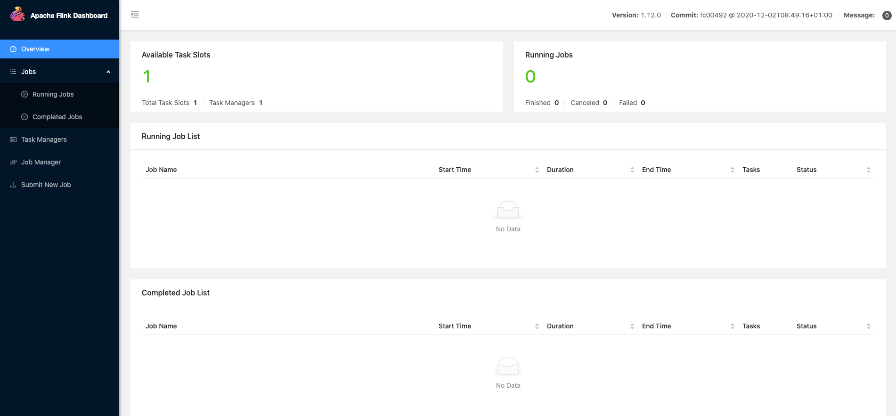

# Flink

## 一、Flink 介绍

### 1.1 Flink 起源


Flink 诞生于欧洲的一个大数据研究项目 StratoSphere。 该项目是柏林工业大学的一个研究性项目。早期，Flink 是做 Batch 计算的，但是在2014年，StratoSphere 里面的核心成员孵化出 Flink，同年将 Flink 捐献给 Apache，并在后来成为Apache 的顶级大数据项目，同时 Flink 计算的主流方向被定位为 Streaming， 即用流式计算来做所有的大数据计算，这就是 Flink 技术诞生的背景。

它不仅仅是一个高吞吐、低延时的计算引擎，同时还提供很多高级的功能，比如它提供了有状态的计算，支持状态管理，支持强一致性数据语义以及支持基于 Event Time 的WaterMark 对延迟或乱序的数据进行处理等。

2015年阿里巴巴开始使用 Flink 并持续贡献社区（阿里内部还基于 Flink 做了一套 Blink），2019年阿里巴巴以9000万欧元（7亿rmb）收购了创业公司 DataArtisans。从此 Flink 开始了新一轮的乘风破浪。

### 1.2 官方介绍


### 1.3 Flink 组件栈

Flink是一个分层架构的系统，每一层所包含的组件都提供了特定的抽象，用来服务于上层组件。Flink分层的组件栈如下图所示：


下面，我们自下而上，分别针对每一层进行解释说明：

- Deployment层

  该层主要涉及了Flink的部署模式，Flink支持多种部署模式：本地、集群（Standalone/YARN）、云（GCE/EC2）。Standalone部署模式与Spark类似，这里，我们看一下Flink on YARN的部署模式，如下图所示：
  
  了解YARN的话，对上图的原理非常熟悉，实际Flink也实现了满足在YARN集群上运行的各个组件：Flink YARN Client负责与YARN RM通信协商资源请求，Flink JobManager和Flink TaskManager分别申请到Container去运行各自的进程。通过上图可以看到，YARN AM与Flink JobManager在同一个Container中，这样AM可以知道Flink JobManager的地址，从而AM可以申请Container去启动Flink TaskManager。待Flink成功运行在YARN集群上，Flink YARN Client就可以提交Flink Job到Flink JobManager，并进行后续的映射、调度和计算处理。

- Runtime层

  Runtime层提供了支持Flink计算的全部核心实现，比如：支持分布式Stream处理、JobGraph到ExecutionGraph的映射、调度等等，为上层API层提供基础服务。

- API层

  API层主要实现了面向无界Stream的流处理和面向Batch的批处理API，其中面向流处理对应DataStream API，面向批处理对应DataSet API。

- Libraries层

  该层也可以称为Flink应用框架层，根据API层的划分，在API层之上构建的满足特定应用的实现计算框架，也分别对应于面向流处理和面向批处理两类。面向流处理支持：CEP（复杂事件处理）、基于SQL-like的操作（基于Table的关系操作）；面向批处理支持：FlinkML（机器学习库）、Gelly（图处理）。


> 注意：在1.12版本中 DataSetAPI 已经淘汰，DataStream 支持流批一体化开发。


### 1.4 应用场景

所有的流式运算

## 二、Flink 安装部署

### 2.1 Local 本地模式

#### 2.1.1 原理


原理：

1. Flink 程序有 JobClient 进行提交
2. JobClient 将作业提交给 JobManager
3. JobManager 负责协调资源分配和作业执行。资源分配完成后，任务将提交给相应的 TaskManager
4. TaskManager 启动一个线程以开始执行。TaskManager 会向JobManager 报告状态更改，如开始执行，正在执行或已完成。
5. 作业执行完成后，结果将发送会客户端（JobClient ）

#### 2.1.2 操作

1. 下载安装包

   https://archive.apache.org/dist/flink/flink-1.12.0/

   ```shell
   wget https://archive.apache.org/dist/flink/flink-1.12.0/flink-1.12.0-bin-scala_2.12.tgz
   ```

2. 解压

   ```
   tar -zxvf flink-1.12.0-bin-scala_2.12.tgz
   ```

3. 如果出现权限问题，修改权限

   ```shell
   chown -R root:root /opt/soft/flink-1.12.0
   ```

4. 改名或创建软连接

   ```shell
   # mv flink-1.12.0 flink
   
   # ln -s /opt/soft/flink-1.12.0 /opt/soft/flink
   ```

#### 2.1.3 测试

1. 准备文件 /root/words.txt

   ```shell
   # vim /root/words.txt
   
   hello me you her
   hello me you
   hello me
   hello
   ```

2. 启动 Fline  本地 "集群"

   ```shell
   # /opt/soft/flink/bin/start-cluster.sh
   ```

3. 使用 jps 命令查询是否启动成功

   ```shell
   # jps
   4994 Jps
   4858 TaskManagerRunner
   4574 StandaloneSessionClusterEntrypoint
   ```

4. 访问 Flink 的 WebUI

   http://10.x.x.x:8081/#/overview

   

5. 执行官方示例

   ```shell
   # /opt/soft/flink/bin/flink run /opt/soft/flink/examples/batch/WordCount.jar --input /root/words.txt --output /root/out
   ```

   

   ```shell
   # cat /root/out
   
   hello 4
   her 1
   me 3
   you 2
   ```

### 2.2 Standalone 独立集群模式

#### 2.2.1 原理


原理：

1. Client 客户端提交任务给 JobManager
2. JobManager 负责申请任务运行所需要的资源并管理任务和资源
3. JobManager 分发任务给TaskManager执行
4. TaskManager 定期向 JobManager 汇报状态

#### 2.2.2 操作

1. 集群规划

   | 节点  | 角色           | 服务                     |
   | ----- | -------------- | ------------------------ |
   | node1 | master + slave | JobManager + TaskManager |
   | Node2 | slave          | TaskManager              |
   | Node3 | slave          | TaskManager              |

2. 修改 flink-conf.yaml

   

#### 2.2.3 测试


### 2.3 Standalone-HA 高可用集群模式

### 2.4 Flink-On-Yarn


