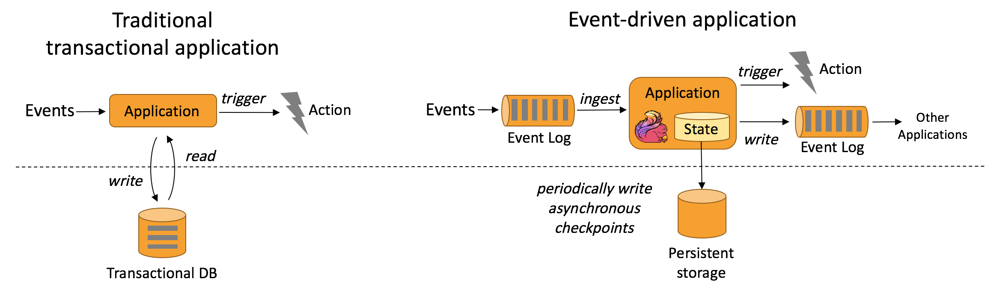

#  Flink

## 一、Flink 介绍

### 1.1 Flink 起源


Flink 诞生于欧洲的一个大数据研究项目 StratoSphere。 该项目是柏林工业大学的一个研究性项目。早期，Flink 是做 Batch 计算的，但是在2014年，StratoSphere 里面的核心成员孵化出 Flink，同年将 Flink 捐献给 Apache，并在后来成为Apache 的顶级大数据项目，同时 Flink 计算的主流方向被定位为 Streaming， 即用流式计算来做所有的大数据计算，这就是 Flink 技术诞生的背景。

它不仅仅是一个高吞吐、低延时的计算引擎，同时还提供很多高级的功能，比如它提供了有状态的计算，支持状态管理，支持强一致性数据语义以及支持基于 Event Time 的WaterMark 对延迟或乱序的数据进行处理等。

2015年阿里巴巴开始使用 Flink 并持续贡献社区（阿里内部还基于 Flink 做了一套 Blink），2019年阿里巴巴以9000万欧元（7亿rmb）收购了创业公司 DataArtisans。从此 Flink 开始了新一轮的乘风破浪。

### 1.2 为什么要学 Flink 

目前开源大数据计算引擎有很多选择，流计算如 Storm，Flink、SparkStream 等，批处理如Spark，MR，Pig，Flink等。而同时支持流计算和批处理的计算引擎，只要两种选择：Spark，Flink。

从技术，生态等各方面的综合考虑。首先，Spark 的技术理念是**基于批来模拟流**的计算。而Flink则完全相反，它采用的是基于流计算来模拟批计算。注：可将批数据看做是一个有边界的流。

Flink 最区别于其它计算引擎的，其实就是 stateful，即有状态计算。Flink 提供了内置的对状态的一致性的处理，即如果任务发生了 Failover，其状态不会丢失、不会被多算少算，同时提供了非常高的性能。

什么是状态？例如开发一套流计算的系统或者任务做数据处理，可能经常要对数据进行统计，如Sum、Count、Min、Max这些值是需要存储的。因为要不断更新，这些值或者变量就可以理解为一种状态。如果数据源是在读取 Kafka，RocketMQ，可能要记录读取到什么位置，并记录Offset，这些Offset变量都是要计算的状态。

Flink 提供了内置状态管理器，可以把这些状态存储在 Flink 内部，而不需要把它存储在外部系统。这样做的好处是，第一降低了计算引擎对外部系统的依赖以及部署，是运维更加简单；第二对性能带来了极大的提升；如果通过外部系统去访问，如Redis、HBase它一定是通过无网络以及RPC。如果通过Flink内部去访问，它只通过自身的进程去访问这些变量。同时Flink会定期将这些状态做 Checkpoint 持久化，把 Checkpoint 存储到一个分布式的持久化系统中，比如HDFS。这样的话，当Flink的任务出现任何故障时，它都会从最近的一次 Checkpoint 将整个流的状态进行恢复，然后继续运行它的流处理。对用户没有任何数据上的影响。

## 二、走进 Flink 的世界

### 2.1 官方介绍

Apache Flink 是一个框架和分布式处理引擎，用于在*无边界和有边界*数据流上进行有状态的计算。Flink 能在所有常见集群环境中运行，并能以内存速度和任意规模进行计算。


接下来，我们来介绍一下 Flink 架构中的重要方面。

#### 2.1.1 处理无界和有界数据

任何类型的数据都可以形成一种事件流。信用卡交易、传感器测量、机器日志、网站或移动应用程序上的用户交互记录，所有这些数据都形成一种流。

数据可以被作为 *无界* 或者 *有界* 流来处理。

1. **无界流** 有定义流的开始，但没有定义流的结束。它们会无休止地产生数据。无界流的数据必须持续处理，即数据被摄取后需要立刻处理。我们不能等到所有数据都到达再处理，因为输入是无限的，在任何时候输入都不会完成。处理无界数据通常要求以特定顺序摄取事件，例如事件发生的顺序，以便能够推断结果的完整性。

2. **有界流** 有定义流的开始，也有定义流的结束。有界流可以在摄取所有数据后再进行计算。有界流所有数据可以被排序，所以并不需要有序摄取。有界流处理通常被称为批处理

   

   

   **Apache Flink 擅长处理无界和有界数据集** 精确的时间控制和状态化使得 Flink 的运行时(runtime)能够运行任何处理无界流的应用。有界流则由一些专为固定大小数据集特殊设计的算法和数据结构进行内部处理，产生了出色的性能。

### 2.2 Flink 应用场景

Apache Flink 功能强大，支持开发和运行多种不同种类的应用程序。它的主要特性包括：批流一体化、精密的状态管理、事件时间支持以及精确一次的状态一致性保障等。Flink 不仅可以运行在包括 YARN、 Mesos、Kubernetes 在内的多种资源管理框架上，还支持在裸机集群上独立部署。在启用高可用选项的情况下，它不存在单点失效问题。事实证明，Flink 已经可以扩展到数千核心，其状态可以达到 TB 级别，且仍能保持高吞吐、低延迟的特性。世界各地有很多要求严苛的流处理应用都运行在 Flink 之上。

接下来我们将介绍 Flink 常见的几类应用并给出相关实例链接。

- [事件驱动型应用](https://flink.apache.org/zh/usecases.html#eventDrivenApps)
- [数据分析应用](https://flink.apache.org/zh/usecases.html#analytics)
- [数据管道应用](https://flink.apache.org/zh/usecases.html#pipelines)

#### 2.2.1 事件驱动应用

**什么是事件驱动型应用？**

事件驱动型应用是一类具有状态的应用，它从一个或多个事件流提取数据，并根据到来的事件触发计算、状态更新或其他外部动作。

事件驱动型应用是在计算存储分离的传统应用基础上进化而来。在传统架构中，应用需要读写远程事务型数据库。

相反，事件驱动型应用是基于状态化流处理来完成。在该设计中，数据和计算不会分离，应用只需访问本地（内存或磁盘）即可获取数据。系统容错性的实现依赖于定期向远程持久化存储写入 checkpoint。下图描述了传统应用和事件驱动型应用架构的区别。



**事件驱动型应用的优势？**

事件驱动型应用无须查询远程数据库，本地数据访问使得它具有更高的吞吐和更低的延迟。而由于定期向远程持久化存储的 checkpoint 工作可以异步、增量式完成，因此对于正常事件处理的影响甚微。事件驱动型应用的优势不仅限于本地数据访问。传统分层架构下，通常多个应用会共享同一个数据库，因而任何对数据库自身的更改（例如：由应用更新或服务扩容导致数据布局发生改变）都需要谨慎协调。反观事件驱动型应用，由于只需考虑自身数据，因此在更改数据表示或服务扩容时所需的协调工作将大大减少。

**Flink 如何支持事件驱动型应用？**

事件驱动型应用会受制于底层流处理系统对时间和状态的把控能力，Flink 诸多优秀特质都是围绕这些方面来设计的。它提供了一系列丰富的状态操作原语，允许以精确一次的一致性语义合并海量规模（TB 级别）的状态数据。此外，Flink 还支持事件时间和自由度极高的定制化窗口逻辑，而且它内置的 `ProcessFunction` 支持细粒度时间控制，方便实现一些高级业务逻辑。同时，Flink 还拥有一个复杂事件处理（CEP）类库，可以用来检测数据流中的模式。

Flink 中针对事件驱动应用的明星特性当属 savepoint。Savepoint 是一个一致性的状态映像，它可以用来初始化任意状态兼容的应用。在完成一次 savepoint 后，即可放心对应用升级或扩容，还可以启动多个版本的应用来完成 A/B 测试。

**典型的事件驱动型应用实例**

- [反欺诈](https://sf-2017.flink-forward.org/kb_sessions/streaming-models-how-ing-adds-models-at-runtime-to-catch-fraudsters/)
- [异常检测](https://sf-2017.flink-forward.org/kb_sessions/building-a-real-time-anomaly-detection-system-with-flink-mux/)
- [基于规则的报警](https://sf-2017.flink-forward.org/kb_sessions/dynamically-configured-stream-processing-using-flink-kafka/)
- [业务流程监控](https://jobs.zalando.com/tech/blog/complex-event-generation-for-business-process-monitoring-using-apache-flink/)
- [（社交网络）Web 应用](https://berlin-2017.flink-forward.org/kb_sessions/drivetribes-kappa-architecture-with-apache-flink/)

#### 2.1.2 数据分析应用

**什么是数据分析应用？**

数据分析任务需要从原始数据中提取有价值的信息和指标。传统的分析方式通常是利用批查询，或将事件记录下来并基于此有限数据集构建应用来完成。为了得到最新数据的分析结果，必须先将它们加入分析数据集并重新执行查询或运行应用，随后将结果写入存储系统或生成报告。

借助一些先进的流处理引擎，还可以实时地进行数据分析。和传统模式下读取有限数据集不同，流式查询或应用会接入实时事件流，并随着事件消费持续产生和更新结果。这些结果数据可能会写入外部数据库系统或以内部状态的形式维护。仪表展示应用可以相应地从外部数据库读取数据或直接查询应用的内部状态。

如下图所示，Apache Flink 同时支持流式及批量分析应用。


**流式分析应用的优势？**

和批量分析相比，由于流式分析省掉了周期性的数据导入和查询过程，因此从事件中获取指标的延迟更低。不仅如此，批量查询必须处理那些由定期导入和输入有界性导致的人工数据边界，而流式查询则无须考虑该问题。

另一方面，流式分析会简化应用抽象。批量查询的流水线通常由多个独立部件组成，需要周期性地调度提取数据和执行查询。如此复杂的流水线操作起来并不容易，一旦某个组件出错将会影响流水线的后续步骤。而流式分析应用整体运行在 Flink 之类的高端流处理系统之上，涵盖了从数据接入到连续结果计算的所有步骤，因此可以依赖底层引擎提供的故障恢复机制。

**Flink 如何支持数据分析类应用？**

Flink 为持续流式分析和批量分析都提供了良好的支持。具体而言，它内置了一个符合 ANSI 标准的 SQL 接口，将批、流查询的语义统一起来。无论是在记录事件的静态数据集上还是实时事件流上，相同 SQL 查询都会得到一致的结果。同时 Flink 还支持丰富的用户自定义函数，允许在 SQL 中执行定制化代码。如果还需进一步定制逻辑，可以利用 Flink DataStream API 和 DataSet API 进行更低层次的控制。此外，Flink 的 Gelly 库为基于批量数据集的大规模高性能图分析提供了算法和构建模块支持。

**典型的数据分析应用实例**

- [电信网络质量监控](http://2016.flink-forward.org/kb_sessions/a-brief-history-of-time-with-apache-flink-real-time-monitoring-and-analysis-with-flink-kafka-hb/)
- 移动应用中的[产品更新及实验评估分析](https://techblog.king.com/rbea-scalable-real-time-analytics-king/)
- 消费者技术中的[实时数据即席分析](https://eng.uber.com/athenax/)
- 大规模图分析

#### 2.1.3 数据管道应用

**什么是数据管道？**

提取-转换-加载（ETL）是一种在存储系统之间进行数据转换和迁移的常用方法。ETL 作业通常会周期性地触发，将数据从事务型数据库拷贝到分析型数据库或数据仓库。

数据管道和 ETL 作业的用途相似，都可以转换、丰富数据，并将其从某个存储系统移动到另一个。但数据管道是以持续流模式运行，而非周期性触发。因此它支持从一个不断生成数据的源头读取记录，并将它们以低延迟移动到终点。例如：数据管道可以用来监控文件系统目录中的新文件，并将其数据写入事件日志；另一个应用可能会将事件流物化到数据库或增量构建和优化查询索引。

下图描述了周期性 ETL 作业和持续数据管道的差异。


**数据管道的优势？**

和周期性 ETL 作业相比，持续数据管道可以明显降低将数据移动到目的端的延迟。此外，由于它能够持续消费和发送数据，因此用途更广，支持用例更多。

**Flink 如何支持数据管道应用？**

很多常见的数据转换和增强操作可以利用 Flink 的 SQL 接口（或 Table API）及用户自定义函数解决。如果数据管道有更高级的需求，可以选择更通用的 DataStream API 来实现。Flink 为多种数据存储系统（如：Kafka、Kinesis、Elasticsearch、JDBC数据库系统等）内置了连接器。同时它还提供了文件系统的连续型数据源及数据汇，可用来监控目录变化和以时间分区的方式写入文件。

**典型的数据管道应用实例**

- 电子商务中的[实时查询索引构建](https://ververica.com/blog/blink-flink-alibaba-search)
- 电子商务中的[持续 ETL](https://jobs.zalando.com/tech/blog/apache-showdown-flink-vs.-spark/)

### 2.3  Flink 组件栈

Flink是一个分层架构的系统，每一层所包含的组件都提供了特定的抽象，用来服务于上层组件。Flink分层的组件栈如下图所示：


下面，我们自下而上，分别针对每一层进行解释说明：

- Deployment层

  该层主要涉及了Flink的部署模式，Flink支持多种部署模式：本地、集群（Standalone/YARN）、云（GCE/EC2）。Standalone部署模式与Spark类似，这里，我们看一下Flink on YARN的部署模式，如下图所示：
  
  了解YARN的话，对上图的原理非常熟悉，实际Flink也实现了满足在YARN集群上运行的各个组件：Flink YARN Client负责与YARN RM通信协商资源请求，Flink JobManager和Flink TaskManager分别申请到Container去运行各自的进程。通过上图可以看到，YARN AM与Flink JobManager在同一个Container中，这样AM可以知道Flink JobManager的地址，从而AM可以申请Container去启动Flink TaskManager。待Flink成功运行在YARN集群上，Flink YARN Client就可以提交Flink Job到Flink JobManager，并进行后续的映射、调度和计算处理。

- Runtime层

  Runtime层提供了支持Flink计算的全部核心实现，比如：支持分布式Stream处理、JobGraph到ExecutionGraph的映射、调度等等，为上层API层提供基础服务。

- API层

  API层主要实现了面向无界Stream的流处理和面向Batch的批处理API，其中面向流处理对应DataStream API，面向批处理对应DataSet API。

- Libraries层

  该层也可以称为Flink应用框架层，根据API层的划分，在API层之上构建的满足特定应用的实现计算框架，也分别对应于面向流处理和面向批处理两类。面向流处理支持：CEP（复杂事件处理）、基于SQL-like的操作（基于Table的关系操作）；面向批处理支持：FlinkML（机器学习库）、Gelly（图处理）。


> 注意：在1.12版本中 DataSetAPI 已经淘汰，DataStream 支持流批一体化开发。


### 2.4 Flink 的编程模型

**抽象级别**
Flink提供了不同的抽象级别以开发流式或者批处理应用


最底层提供了有状态流，它将通过过程函数嵌入到DataStream API中，它允许用户可以自由地处理来自一个或者多个流数据的事件，并使用一致、容错的状态。除此之外，用户可以注册事件时间和处理事件回调，从而使程序可以实现复杂的计算。

DataStream / DataSet API 是 Flink 提供的核心 API ，DataSet 处理有界的数据集，DataStream 处理有界或者无界的数据流。用户可以通过各种方法（map / flatmap / window / keyby / sum / max / min / avg / join 等）将数据进行转换 / 计算。

Table API 是以 表 为中心的声明式 DSL，其中表可能会动态变化（在表达流数据时）。Table API 提供了例如 select、project、join、group-by、aggregate 等操作，使用起来却更加简洁（代码量更少）。

你可以在表与 DataStream/DataSet 之间无缝切换，也允许程序将 Table API 与 DataStream 以及 DataSet 混合使用。

- Flink 提供的最高层级的抽象是 SQL 。这一层抽象在语法与表达能力上与 Table API 类似，但是是以 SQL查询表达式的形式表现程序。SQL 抽象与 Table API 交互密切，同时 SQL 查询可以直接在 Table API 定义的表上执行。

#### 2.4.1 DataSet API

```java
public class WordCountExample {
    public static void main(String[] args) throws Exception {
        final ExecutionEnvironment env = ExecutionEnvironment.getExecutionEnvironment();

        DataSet<String> text = env.fromElements(
            "Who's there?",
            "I think I hear them. Stand, ho! Who's there?");

        DataSet<Tuple2<String, Integer>> wordCounts = text
            .flatMap(new LineSplitter())
            .groupBy(0)
            .sum(1);

        wordCounts.print();
    }

    public static class LineSplitter implements FlatMapFunction<String, Tuple2<String, Integer>> {
        @Override
        public void flatMap(String line, Collector<Tuple2<String, Integer>> out) {
            for (String word : line.split(" ")) {
                out.collect(new Tuple2<String, Integer>(word, 1));
            }
        }
    }
}
```

#### 2.4.2 DataStream API

```java
import org.apache.flink.api.common.functions.FlatMapFunction;
import org.apache.flink.api.java.tuple.Tuple2;
import org.apache.flink.streaming.api.datastream.DataStream;
import org.apache.flink.streaming.api.environment.StreamExecutionEnvironment;
import org.apache.flink.streaming.api.windowing.time.Time;
import org.apache.flink.util.Collector;

public class WindowWordCount {

    public static void main(String[] args) throws Exception {

      	// datasource 
        StreamExecutionEnvironment env = StreamExecutionEnvironment.getExecutionEnvironment();

      	// transfromations
        DataStream<Tuple2<String, Integer>> dataStream = env
                .socketTextStream("localhost", 9999)
                .flatMap(new Splitter())
                .keyBy(value -> value.f0)
                .window(TumblingProcessingTimeWindows.of(Time.seconds(5)))
                .sum(1);
				//sink
        dataStream.print();

        env.execute("Window WordCount");
    }

    public static class Splitter implements FlatMapFunction<String, Tuple2<String, Integer>> {
        @Override
        public void flatMap(String sentence, Collector<Tuple2<String, Integer>> out) throws Exception {
            for (String word: sentence.split(" ")) {
                out.collect(new Tuple2<String, Integer>(word, 1));
            }
        }
    }

}
```

简单说明一下，上面出现了 SocketTextStream 套接字字符 数据源（Source），接着是 算子（Operator）：FlatMap（一个输入源，可以输出零个或多个结果）、KeyBy（按照某字段或者 tuple 元组中某个下标进行分类） 和 sum（跟翻译一样，就是进行聚合汇总） ，最后输出。

#### 2.4.3 程序和数据流

Flink程序的基本构建时在流和转换操作上的，执行时，Flink程序映射到流数据上，由流和转换运算符组成。每个数据流都以一个或多个源开头，并以一个或多个接收器结束。数据流类似于任意有向无环图（DAG）。


Flink 应用程序结构就是如上图所示：

- Source: 数据源，Flink 在流处理和批处理上的 source 大概有 4 类：基于本地集合的 source、基于文件的 source、基于网络套接字的 source、自定义的 source。自定义的 source 常见的有 Apache kafka、Amazon Kinesis Streams、RabbitMQ、Twitter Streaming API、Apache NiFi 等，当然你也可以定义自己的 source。
- Transformation：数据转换的各种操作，有 Map / FlatMap / Filter / KeyBy / Reduce / Fold / Aggregations / Window / WindowAll / Union / Window join / Split / Select / Project 等，操作很多，可以将数据转换计算成你想要的数据。
- Sink：接收器，Flink 将转换计算后的数据发送的地点 ，你可能需要存储下来，Flink 常见的 Sink 大概有如下几类：写入文件、打印出来、写入 socket 、自定义的 sink 。自定义的 sink 常见的有 Apache kafka、RabbitMQ、MySQL、ElasticSearch、Apache Cassandra、Hadoop FileSystem 等，同理你也可以定义自己的 sink。

### 2.5 Flink 中的key

在Flink中比如某些算子（join,coGroup,keyBy,groupBy）要求在数据元上定义key。另外有些算子操作，例如reduce，groupReduce，Aggregate，Windows需要数据在处理之前根据key进行分组。

在Flink中数据模型不是基于Key,Value格式处理的，因此不需将数据处理成键值对的格式，key是“虚拟的”，可以人为的来指定，实际数据处理过程中根据指定的key来对数据进行分组，DataSet中使用groupBy来指定key,DataStream中使用keyBy来指定key。那么如何指定keys呢?

#### 2.5.1 使用 Tuples 来指定key

定义元组来指定key可以指定tuple中的第几个元素当做key，或者指定tuple中的联合元素当做key。需要使用`org.apache.flink.api.java.tuple.TupleXX`包下的tuple,最多支持25个元素且Tuple必须new创建。

如果Tuple是嵌套的格式，例如：DataStream<Tuple3<Tuple2<Integer, Float>,String,Long>> ds，如果指定keyBy(0)则会使用内部的整个Tuple2作为key。如果想要使用内部Tuple2中的Float格式当做key，可以使用`keyBy("f0.f1")`这样的形式指定。

这里需要注意，在Flink的Tuple中指定的key的下标从0开始算起，这里不像Scala中的Tuple从1开始算起，同时一般需要指定key的函数中都可以有两种写法，一种是直接写数字0，1，2等等，还有一种是写字符串的形式前面的0，1，2对应的字符串的表达形式为f0，f1，f2。

如果需要指定多个字段当做联合的Key，可以写成`keyBy(0,1)`，如果写成字符串形式在字符串中指定多个key，还可以写成`keyBy("f0","f1")`的形式。

示例：

```java
 /**
 * Flink 读取文件进行处理，模拟批处理操作
 * @author panyangyang
 * @date 2021-05-20 15:25
 */
public class FlinkWC {
    public static void main(String[] args) throws Exception {
        StreamExecutionEnvironment env = StreamExecutionEnvironment.getExecutionEnvironment();

        DataStreamSource<String> dataStreamSource = env.socketTextStream("localhost", 9999);

        DataStream<Tuple3<String, String, Integer>> map = dataStreamSource.map(new MapFunction<String, Tuple3<String, String, Integer>>() {
            @Override
            public Tuple3<String, String, Integer> map(String value) throws Exception {
                String[] split = value.split(" ");
                return new Tuple3<>(split[0], split[1], Integer.valueOf(split[2]));
            }
        });

        // 指定流中 Tuple 中的第一个元素作为key
        KeyedStream<Tuple3<String, String, Integer>, Tuple> keyedStream = map.keyBy(0);

        keyedStream.reduce(new ReduceFunction<Tuple3<String, String, Integer>>() {
            @Override
            public Tuple3<String, String, Integer> reduce(Tuple3<String, String, Integer> value1, Tuple3<String, String, Integer> value2) throws Exception {
                return new Tuple3<>(value1.f0 + "?" + value2.f0, value1.f1 + "!" + value2.f1, value2.f2 + value2.f2);
            }
        }).print();

        env.execute("Tuple--key");
    }

}

```

输入：

```shell
# nc -l -p 9999
hello shanghai 1
hello beijing 2
hi shenzhen 3
hi guangzhou 4
```

输出：

```shell
3> (hello,shanghai,1)
3> (hello?hello,shanghai!beijing,4)
3> (hi,shenzhen,3)
3> (hi?hi,shenzhen!guangzhou,8)
```


#### 2.5.2 使用Field Expression来指定key

可以使用Field Expression来指定key,一般作用的对象可以是类对象，或者嵌套的Tuple格式的数据。

对于这种形式的使用，注意点如下：

1. 对于类对象可以使用类中的字段来指定key，类对象定义需要注意：
   - 类的访问级别必须是public
   - 必须写出默认的空的构造函数
   - 类中所有的字段必须是public的或者必须有getter，setter方法。
   - Flink必须支持字段的类型。

2. 对于嵌套的Tuple类型的Tuple数据可以使用"xx.f0"表示嵌套tuple中第一个元素，也可以直接使用”xx.0”来表示第一个元素。

示例：

```java
public class StudentInfo {
    private String name;
    private String gender;
    private Integer age;
    private Tuple2<Integer, Tuple3<Integer, Integer, Integer>> gradeAndScore;

  	.....
}
```


```java
/**
 * 姓名，性别，年龄，年级，三门成绩
 * zhangsan m 20 4 99 100 100
 * lisi f 18 3 59 59 79
 * wangwu f 18 3 59 59 79
 */
public class FlinkWC {
    public static void main(String[] args) throws Exception {
        StreamExecutionEnvironment env = StreamExecutionEnvironment.getExecutionEnvironment();

        DataStreamSource<String> dataStreamSource = env.socketTextStream("localhost", 9999);

        SingleOutputStreamOperator<StudentInfo> map = dataStreamSource.map(new MapFunction<String, StudentInfo>() {
            @Override
            public StudentInfo map(String value) throws Exception {
                String[] split = value.split(" ");
                String name = split[0];
                String gender = split[1];
                Integer age = Integer.valueOf(split[2]);
                Integer grade = Integer.valueOf(split[3]);

                Tuple2<Integer, Tuple3<Integer, Integer, Integer>> gradeAndScore = new Tuple2(grade, new Tuple3<>(
                        Integer.valueOf(split[4]),
                        Integer.valueOf(split[5]),
                        Integer.valueOf(split[6])));
                return new StudentInfo(name, gender, age, gradeAndScore);
            }
        });
        // 对于对象而言，可以使用字段表达式来进行虚拟key指定
        KeyedStream<StudentInfo, Tuple> keyedStream = map.keyBy("name");
//        KeyedStream<StudentInfo, Tuple> keyedStream = map.keyBy("gender");
//        KeyedStream<StudentInfo, Tuple> keyedStream = map.keyBy("gradeAndScore.f0");
//        KeyedStream<StudentInfo, Tuple> keyedStream = map.keyBy("gradeAndScore.f1.f0");

        keyedStream.timeWindow(Time.seconds(5)).reduce(new ReduceFunction<StudentInfo>() {
            @Override
            public StudentInfo reduce(StudentInfo value1, StudentInfo value2) throws Exception {
                String name = value1.getName() + "?" + value2.getName();
                String gender = value1.getGender() + "!" + value2.getGender();
                Integer age = value1.getAge() + value2.getAge();

                Tuple2<Integer, Tuple3<Integer, Integer, Integer>> gradeAndScore1 = value1.getGradeAndScore();
                Tuple2<Integer, Tuple3<Integer, Integer, Integer>> gradeAndScore2 = value2.getGradeAndScore();

                Tuple2<Integer, Tuple3<Integer, Integer, Integer>> tuple2 = new Tuple2<>(
                        gradeAndScore1.f0 + gradeAndScore2.f0, new Tuple3<>(
                        gradeAndScore1.f1.f0 + gradeAndScore2.f1.f0,
                        gradeAndScore1.f1.f1 + gradeAndScore2.f1.f1,
                        gradeAndScore1.f1.f2 + gradeAndScore2.f1.f2
                ));
                return new StudentInfo(name, gender, age, tuple2);
            }
        }).print();

        env.execute("Tuple--express");
    }

}
```

输入：

```shell
# nc -lp 9999
zhangsan m 18 3 59 59 79
wangwu f 18 3 59 59 79
lisi f 18 3 59 59 79
```

输出1： 

```java
KeyedStream<StudentInfo, Tuple> keyedStream = map.keyBy("name");
```

```shell
5> StudentInfo{name='zhangsan', gender='m', age=18, gradeAndScore=(3,(59,59,79))}
8> StudentInfo{name='lisi', gender='f', age=18, gradeAndScore=(3,(59,59,79))}
5> StudentInfo{name='wangwu', gender='f', age=18, gradeAndScore=(3,(59,59,79))}
```

输出2：

```java
KeyedStream<StudentInfo, Tuple> keyedStream = map.keyBy("gender");
```

```java
5> StudentInfo{name='zhangsan', gender='m', age=18, gradeAndScore=(3,(59,59,79))}
2> StudentInfo{name='wangwu?lisi', gender='f!f', age=36, gradeAndScore=(6,(118,118,158))}
```

#### 2.5.3 使用Key Selector 来指定key

使用key Selector这种方式选择key，非常方便，可以从数据类型中指定想要的key.

```java
KeyedStream<String, String> keyBy = socketText.keyBy(new KeySelector<String, String>() {
            @Override
            public String getKey(String line) throws Exception {
                return line.split("\t")[2];
            }
        });
```

## 三、 DataStream Operator

### 3.1 DataStream Source

#### 3.1.1 基于文件

readTextFile(path) - 读取文件的数据

readFile(fileInputFormat, path) - 通过自定义的读取方式，来读取文件的数据

#### 3.1.2 基于socket

socketTextStream 从scoket端口中读取数据

#### 3.1.3 基于集合

fromCollection(Collection) - 从collection集合里读取数据，从而形成一个数据流，集合里的元素类型需要一致

formElements(T ...) - 从数组里读取数据，从而形成一个数据流，数组里的元素类型需要一致

generateSequence(from, to) - 创建一个数据流，数据源里的数据从from到to的数字。

#### 3.1.4 自定义 source

addSource - 自定义一个数据源，比如FlinkKafkaConsumer，从kafka里读取数据。

### 3.2 DataStream Transformations

DataStream 算子转换概览


Flink提供了大量的算子操作供用户使用，常见的算子主要包括以下几种

#### 3.2.1 Map

说明：

- DataStream → DataStream 的转换，输入一个元素，返回一个元素

- 调用用户定义的MapFunction对DataStream[T]数据进行处理，形成新的Data-Stream[T]，其中数据格式可能会发生变化，常用作对数据集内数据的清洗和转换。例如将输入数据集中的每个数值全部加 1 处理，并且将数据输出到下游数据集

样例：

```java
SingleOutputStreamOperator<String> userBehaviorMap = userBehavior.map(new RichMapFunction<UserBehavior, String>() {
            @Override
            public String map(UserBehavior value) throws Exception {
                String action = "";
                switch (value.action) {
                    case "pv":
                        action = "浏览";
                    case "cart":
                        action = "加购";
                    case "fav":
                        action = "收藏";
                    case "buy":
                        action = "购买";
                }
                return action;
            }
        });
```

示意图：


将雨滴形状转换成相对应的圆形形状的map操作

#### 3.2.2 FlatMap

说明：

- DataStream → DataStream，输入一个元素，返回零个、一个或多个元素

- 事实上，flatMap算子可以看做是filter与map的泛化，即它能够实现这两种操作。flatMap算子对应的FlatMapFunction定义了flatMap方法，可以通过向collector对象传递数据的方式返回0个，1个或者多个事件作为结果。

样例：

```java
SingleOutputStreamOperator<UserBehavior> userBehaviorflatMap = userBehavior.flatMap(new RichFlatMapFunction<UserBehavior, UserBehavior>() {
            @Override
            public void flatMap(UserBehavior value, Collector<UserBehavior> out) throws Exception {
                if (value.gender.equals("女")) {
                    out.collect(value);
                }
            }
        });
```

示意图：

将黄色的雨滴过滤掉，将蓝色雨滴转为圆形，保留绿色雨滴


#### 3.2.3 Filter

说明：

- DataStream → DataStream，过滤算子，对数据进行判断，符合条件即返回true的数据会被保留，否则被过滤。

样例：

```java
SingleOutputStreamOperator<UserBehavior> userBehaviorFilter = userBehavior.filter(new RichFilterFunction<UserBehavior>() {
            @Override
            public boolean filter(UserBehavior value) throws Exception {
                return value.action.equals("buy");//保留购买行为的数据
            }
        });
```


示意图：

将红色与绿色雨滴过滤掉，保留蓝色雨滴。


#### 3.2.4 keyBy

说明：

- DataStream→KeyedStream，从逻辑上将流划分为不相交的分区。
- 具有相同键的所有记录都分配给同一分区。在内部，keyBy（）是通过哈希分区实现的。
  定义键值有3中方式：
  (1) 使用字段位置，如keyBy(1)，此方式是针对元组数据类型，比如tuple，使用元组相应元素的位置来定义键值;
  (2) 字段表达式,用于元组、POJO以及样例类;
  (3) 键值选择器，即keySelector，可以从输入事件中提取键值

样例：

```java
SingleOutputStreamOperator<Tuple2<String, Integer>> userBehaviorkeyBy = userBehavior.map(new RichMapFunction<UserBehavior, Tuple2<String, Integer>>() {
            @Override
            public Tuple2<String, Integer> map(UserBehavior value) throws Exception {
                return Tuple2.of(value.action.toString(), 1);
            }
        }).keyBy(0) // scala元组编号从1开始，java元组编号是从0开始
           .sum(1); //滚动聚合

```

示意图：

基于形状对事件进行分区的keyBy操作


#### 3.2.5 Reduce

说明：

- KeyedStream → DataStream，对数据进行滚动聚合操作，结合当前元素和上一次Reduce返回的值进行聚合，然后返回一个新的值.
- 将一个ReduceFunction应用在一个keyedStream上,每到来一个事件都会与当前reduce的结果进行聚合，
  产生一个新的DataStream,该算子不会改变数据类型，因此输入流与输出流的类型永远保持一致。

样例：

```java
SingleOutputStreamOperator<Tuple2<String, Integer>> userBehaviorReduce = userBehavior.map(new RichMapFunction<UserBehavior, Tuple2<String, Integer>>() {
            @Override
            public Tuple2<String, Integer> map(UserBehavior value) throws Exception {
                return Tuple2.of(value.action.toString(), 1);
            }
        }).keyBy(0) // scala元组编号从1开始，java元组编号是从0开始
          .reduce(new RichReduceFunction<Tuple2<String, Integer>>() {
              @Override
              public Tuple2<String, Integer> reduce(Tuple2<String, Integer> value1, Tuple2<String, Integer> value2) throws Exception {
                  return Tuple2.of(value1.f0,value1.f1 + value2.f1);//滚动聚合,功能与sum类似
              }
          });
```

示意图：


#### 3.2.6 Aggregations(滚动聚合)

说明：

- KeyedStream → DataStream，Aggregations(滚动聚合),滚动聚合转换作用于KeyedStream流上，生成一个包含聚合结果(比如sum求和，min最小值)的DataStream
- 滚动聚合的转换会为每个流过该算子的key值保存一个聚合结果，当有新的元素流过该算子时，会根据之前的结果值和当前的元素值，更新相应的结果值
  - sum():滚动聚合流过该算子的指定字段的和；
  - min():滚动计算流过该算子的指定字段的最小值
  - max():滚动计算流过该算子的指定字段的最大值
  - minBy():滚动计算当目前为止流过该算子的最小值，返回该值对应的事件；
  - maxBy():滚动计算当目前为止流过该算子的最大值，返回该值对应的事件；

样例：

```java
import org.apache.flink.api.java.tuple.Tuple2;
import org.apache.flink.streaming.api.datastream.DataStreamSource;
import org.apache.flink.streaming.api.environment.StreamExecutionEnvironment;
import org.apache.flink.streaming.api.functions.co.CoFlatMapFunction;
import org.apache.flink.util.Collector;
 
public class TestFlinkOperator {
    public static void main(String[] args) throws Exception {
        StreamExecutionEnvironment env = StreamExecutionEnvironment.getExecutionEnvironment();
        DataStreamSource<Tuple2<Long,Long>> stream = env.fromElements(
        		Tuple2.of(1L, 3L),
        		Tuple2.of(1L, 8L),
        		Tuple2.of(1L, 5L),
        		Tuple2.of(2L, 6L),
        		Tuple2.of(2L, 7L)
        		);
        stream.keyBy(0).sum(1).print();
        stream.keyBy(0).min(1).print("min");
        stream.keyBy(0).minBy(1).print("minby");
        stream.keyBy(0).max(1).print("max");
        stream.keyBy(0).maxBy(1).print("maxby");
        env.execute();
    }
}
```

#### 3.2.7 union

说明：

- DataStream* → DataStream，将多条流合并，新的的流会包括所有流的数据，值得注意的是，两个流的数据类型必须一致，另外，来自两条流的事件会以FIFO(先进先出)的方式合并，所以并不能保证两条流的顺序，此外，union算子不会对数据去重，每个输入事件都会被发送到下游算子。

样例：

```java
import org.apache.flink.api.common.functions.ReduceFunction;
import org.apache.flink.api.common.functions.RichFlatMapFunction;
import org.apache.flink.api.java.tuple.Tuple2;
import org.apache.flink.streaming.api.datastream.DataStreamSource;
import org.apache.flink.streaming.api.environment.StreamExecutionEnvironment;
import org.apache.flink.util.Collector;
 
public class TestFlinkOperator {
    public static void main(String[] args) throws Exception {
        StreamExecutionEnvironment env = StreamExecutionEnvironment.getExecutionEnvironment();
        DataStreamSource<Tuple2<Long,Long>> stream1 = env.fromElements(
        		Tuple2.of(1L, 3L),
        		Tuple2.of(1L, 5L)
        		);
        DataStreamSource<Tuple2<Long,Long>> stream2 = env.fromElements(
        		Tuple2.of(1L, 7L), 
        		Tuple2.of(1L, 4L)
        		);
        DataStreamSource<Tuple2<Long,Long>> stream3 = env.fromElements(
        		Tuple2.of(2L, 2L)
        		);
        //合并一个或多个DataStream数据集
        stream1.union(stream2,stream3).print();
        env.execute();
    }
}
```

输出：

```java
4> (1,3)
2> (1,4)
1> (1,5)
1> (1,7)
3> (2,2)
```

示意图：


#### 3.2.8 connect

说明：

- DataStream,DataStream → ConnectedStreams，将两个流的事件进行组合，返回一个ConnectedStreams对象，两个流的数据类型可以不一致,ConnectedStreams对象提供了类似于map(),flatMap()功能的算子，如CoMapFunction与CoFlatMapFunction分别表示map()与flatMap算子，这两个算子会分别作用于两条流，注意：CoMapFunction 或CoFlatMapFunction被调用的时候并不能控制事件的顺序只要有事件流过该算子，该算子就会被调用。

样例：

```java
ConnectedStreams<UserBehavior, Tuple2<String, Integer>> behaviorConnectedStreams = userBehaviorFilter.connect(userBehaviorkeyBy);
        SingleOutputStreamOperator<Tuple3<String, String, Integer>> behaviorConnectedStreamsmap = behaviorConnectedStreams.map(new RichCoMapFunction<UserBehavior, Tuple2<String, Integer>, Tuple3<String, String, Integer>>() {
            @Override
            public Tuple3<String, String, Integer> map1(UserBehavior value1) throws Exception {
                return Tuple3.of("first", value1.action, 1);
            }
            @Override
            public Tuple3<String, String, Integer> map2(Tuple2<String, Integer> value2) throws Exception {
                return Tuple3.of("second", value2.f0, value2.f1);
            }
        });
```

#### 3.2.9 split

说明：

- DataStream → SplitStream，将流分割成两条或多条流，与union相反。分割之后的流与输入流的数据类型一致，
  对于每个到来的事件可以被路由到0个、1个或多个输出流中。可以实现过滤与复制事件的功能，DataStream.split()接收一个OutputSelector函数，用来定义分流的规则，即将满足不同条件的流分配到用户命名的一个输出。

样例：

```java
SplitStream<UserBehavior> userBehaviorSplitStream = userBehavior.split(new OutputSelector<UserBehavior>() {
            @Override
            public Iterable<String> select(UserBehavior value) {
                ArrayList<String> userBehaviors = new ArrayList<String>();
                if (value.action.equals("buy")) {
                    userBehaviors.add("buy");
                } else {
                    userBehaviors.add("other");
                }
                return userBehaviors;
            }
        });
userBehaviorSplitStream.select("buy").print();
```

示意图：


### 3.3 Sink

Flink提供了许多内置的Sink，比如writeASText，print，HDFS，Kaka等等，下面将基于MySQL实现一个自定义的Sink，可以与自定义的MysqlSource进行对比，具体如下：

