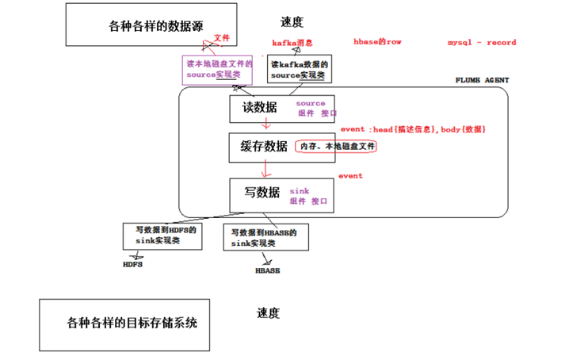
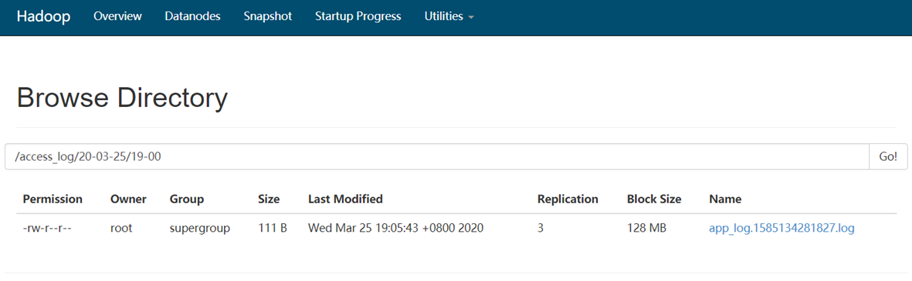
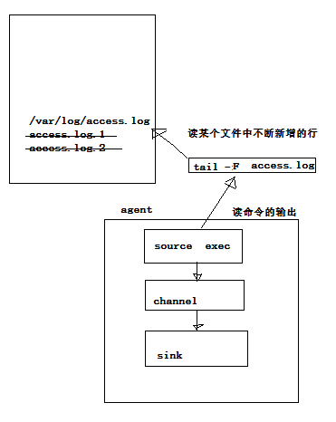
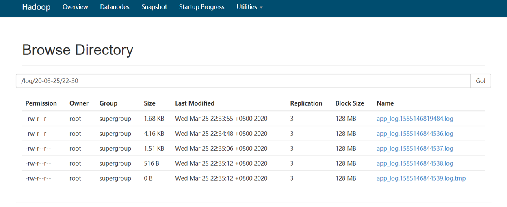
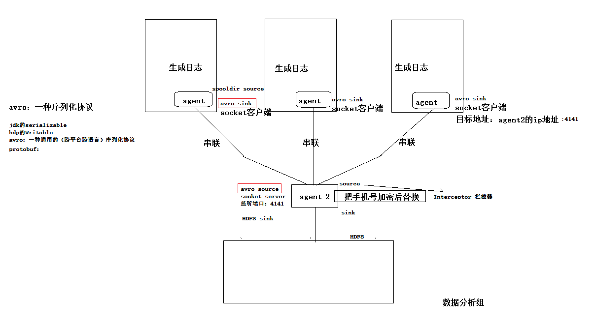

# Flume 

## Flume 介绍

官网：http://flume.apache.org


### 概述

- Flume是一个分布式、可靠、和高可用的海量日志采集、聚合和传输的系统。 

- Flume可以采集文件，socket数据包、文件、文件夹、kafka等各种形式源数据，又可以将采集到的数据(下沉sink)输出到HDFS、hbase、hive、kafka等众多外部存储系统中 

- 一般的采集需求，通过对flume的简单配置即可实现 

- Flume针对特殊场景也具备良好的自定义扩展能力，因此,flume可以适用于大部分的日常数据采集场景 。

  

### 运行机制

- Flume分布式系统中最核心的角色是agent，flume 采集系统就是由一个个 agent 所连接起来形成 

- 每一个 agent 相当于一个数据传递员，内部有三个组件： 

  1. **Source**：采集组件，用于跟数据源对接，以获取数据
  2. **Channel**：传输通道组件，用于从source将数据传递到sink （event：head、body）

  3. **Sink**：下沉组件，用于往下一级agent传递数据或者往最终存储系统传递数据

###  Flume采集系统结构图

- 简单结构：单个 agent 采集数据


- 复杂结构：多级 Agent 之间串联 采集数据

  

## **Flume** 实战案例

### 实时采集新出现的文件到HDFS中去 


#### **Step 1:** 下载解压修改配置文件 

下载地址： http://archive.apache.org/dist/flume/1.8.0/apache-flume-1.8.0-bin.tar.gz 

Flume的安装非常简单，只需要解压即可，当然，前提是已有hadoop环境 

上传安装包到数据源所在节点上，或者通过CDH安装配置Flume。

```shell
#cd /export/softwares/ 
#tar -zxvf apache-flume-1.8.0-bin.tar.gz -C ../servers/ 
#cd /export/servers/apache-flume-1.8.0-bin/conf 
#cp flume-env.sh.template flume-env.sh 
```

```shell
#vim flume-env.sh 
export JAVA_HOME=/opt/slft/jdk1.8.0_141
```

#### **Step 2:** 开发配置文件 

根据数据采集的需求配置采集方案，描述在配置文件中(文件名可任意自定义) 

配置我们的网络收集的配置文件 

在flume的conf目录下新建一个配置文件（采集方案）

```shell
#vim /export/servers/apache-flume-1.8.0-bin/conf/dir-hdfs.conf
```

```conf
# 定义三大组件名称
ag1.sources  = source1
ag1.channels = channel1
ag1.sinks  = sink1

# 配置 source 组件
ag1.sources.source1.type  = spooldir
ag1.sources.source1.spoolDir = /root/access_log/
ag1.sources.source1.fileSuffix = .FINISHED

# channel配置
ag1.channels.channel1.type   = memory
ag1.channels.channel1.capacity = 100 
ag1.channels.channel1.transactionCapacity = 600

# 配置 sink 组件
ag1.sinks.sink1.type  = hdfs
ag1.sinks.sink1.hdfs.path = hdfs://node-00:8020/access_log/%y-%m-%d/%H-%M
ag1.sinks.sink1.hdfs.filePrefix = app_log
ag1.sinks.sink1.hdfs.fileSuffix = .log
ag1.sinks.sink1.hdfs.batchSize = 100
ag1.sinks.sink1.hdfs.fileType =  DataStream
ag1.sinks.sink1.hdfs.wirteFormat = Text

## roll：滚动切换：控制写文件的切换规则
ag1.sinks.sink1.hdfs.rollSize = 102400
ag1.sinks.sink1.hdfs.rollCount = 10000
ag1.sinks.sink1.hdfs.rollInterval = 60

## 控制生成目录的规则
ag1.sinks.sink1.hdfs.round = true
ag1.sinks.sink1.hdfs.roundValue = 10
ag1.sinks.sink1.hdfs.roundUnit = minute
ag1.sinks.sink1.hdfs.useLocalTimeStamp = true


# 绑定source、channel、sink之间的联系
ag1.sources.source1.channels = channel1
ag1.sinks.sink1.channel      = channel1
```

#### **Step 3:** 启动配置文件

指定采集方案配置文件，在相应的节点上启动 flume agent 

启动agent去采集数据

测试阶段启动命令：

```shell
#bin/flume-ng agent -c conf -f conf/dir-hdfs.conf -n ag1 -Dflume.root.logger=INFO,console
```

生产阶段启动命令：

```shell
#nohup bin/flume-ng agent -c conf -f conf/dir-hdfa.conf -n ag1 > 1>/dev/null 2>&1 &
```

- -c conf 指定flume自身的配置文件所在目录 
- -f conf/netcat-logger.con 指定我们所描述的采集方案 
- -n a1 指定我们这个agent的名字 

#### **Step 4:** 查看执行结果



### 追加数据实时采集到HDFS

采集需求：业务系统使用log4j生成日志，内容不断增加，需要把追加到日志文件中的数据实时采集到HDFS



根据需求，首先定义一下3个要素：

- 采集源，即 source -- 监控文件内容更新： exec ‘tail -F file'
- 下沉目标，即 sink -- HDFS 文件系统： hdfs sink
- source 和 sink 之间的传递通道 - channel，可用 file channel 也可以用 内存channel

#### 具体配置同上

#### 在flume的conf目录下新建一个配置文件（采集方案）

```
# 定义三大组件名称
ag1.sources  = source1
ag1.channels = channel1
ag1.sinks  = sink1

# 配置 source 组件
ag1.sources.source1.type  = exec
ag1.sources.source1.command = tail -F /root/log/access.log

# channel配置
ag1.channels.channel1.type   = memory
ag1.channels.channel1.capacity = 100 
ag1.channels.channel1.transactionCapacity = 600

# 配置 sink 组件
ag1.sinks.sink1.type  = hdfs
ag1.sinks.sink1.hdfs.path = hdfs://node-00:8020/log/%y-%m-%d/%H-%M
ag1.sinks.sink1.hdfs.filePrefix = app_log
ag1.sinks.sink1.hdfs.fileSuffix = .log
ag1.sinks.sink1.hdfs.batchSize = 100
ag1.sinks.sink1.hdfs.fileType =  DataStream
ag1.sinks.sink1.hdfs.wirteFormat = Text

## roll：滚动切换：控制写文件的切换规则
ag1.sinks.sink1.hdfs.rollSize = 102400
ag1.sinks.sink1.hdfs.rollCount = 10000
ag1.sinks.sink1.hdfs.rollInterval = 60

## 控制生成目录的规则
ag1.sinks.sink1.hdfs.round = true
ag1.sinks.sink1.hdfs.roundValue = 10
ag1.sinks.sink1.hdfs.roundUnit = minute
ag1.sinks.sink1.hdfs.useLocalTimeStamp = true

# 绑定source、channel、sink之间的联系
ag1.sources.source1.channels = channel1
ag1.sinks.sink1.channel      = channel1
```

#### 执行结果



### 多级 agent 串联



#### Step 1 配置 avro sink 类型 Agent 

从tail命令获取数据发送到avro端口
另一个节点可配置一个avro源来中继数据，发送外部存储

采集配置文件，tail-avro.conf

```
##################
# Name the components on this agent
a1.sources = r1
a1.sinks = k1
a1.channels = c1

# Describe/configure the source
a1.sources.r1.type = exec
a1.sources.r1.command = tail -F /root/log/access.log


# Describe the sink
a1.sinks.k1.type = avro
a1.sinks.k1.hostname = node-02
a1.sinks.k1.port = 4141
a1.sinks.k1.batch-size = 2


# Use a channel which buffers events in memory
a1.channels.c1.type = memory
a1.channels.c1.capacity = 1000
a1.channels.c1.transactionCapacity = 100

# Bind the source and sink to the channel
a1.sources.r1.channels = c1
a1.sinks.k1.channel = c1
```

#### Step 2 从avro端口接收数据，下沉到hdfs

```shell
#bin/flume-ng agent -c conf -f conf/avro-m-log.conf -n a1 -Dflume.root.logger=INFO,console
```

采集配置文件，avro-hdfs.conf

```
# Name the components on this agent
a1.sources = r1
a1.sinks = k1
a1.channels = c1

# Describe/configure the source
##source中的avro组件是一个接收者服务
a1.sources.r1.type = avro
a1.sources.r1.bind = node-02
a1.sources.r1.port = 4141


# Describe the sink
a1.sinks.k1.type = hdfs
a1.sinks.k1.hdfs.path = /flume/taildata/%y-%m-%d/
a1.sinks.k1.hdfs.filePrefix = tail-
a1.sinks.k1.hdfs.round = true
a1.sinks.k1.hdfs.roundValue = 24
a1.sinks.k1.hdfs.roundUnit = hour
a1.sinks.k1.hdfs.rollInterval = 0
a1.sinks.k1.hdfs.rollSize = 0
a1.sinks.k1.hdfs.rollCount = 50
a1.sinks.k1.hdfs.batchSize = 10
a1.sinks.k1.hdfs.useLocalTimeStamp = true
#生成的文件类型，默认是Sequencefile，可用DataStream，则为普通文本
a1.sinks.k1.hdfs.fileType = DataStream

# Use a channel which buffers events in memory
a1.channels.c1.type = memory
a1.channels.c1.capacity = 1000
a1.channels.c1.transactionCapacity = 100

# Bind the source and sink to the channel
a1.sources.r1.channels = c1
a1.sinks.k1.channel = c1

```

#### Step 3 发送数据：

```
$ bin/flume-ng avro-client -H localhost -p 4141 -F /usr/logs/log.10
```

