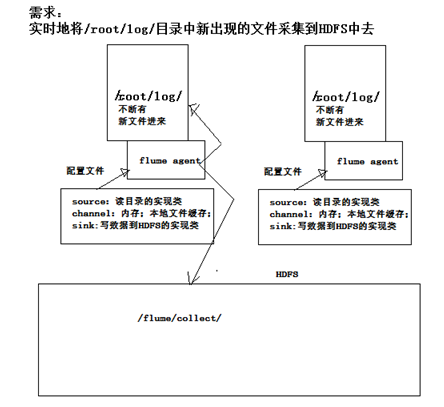

# Flume 

## Flume 介绍

官网：http://flume.apache.org


### 概述

- Flume是一个分布式、可靠、和高可用的海量日志采集、聚合和传输的系统。 

- Flume可以采集文件，socket数据包、文件、文件夹、kafka等各种形式源数据，又可以将采集到的数据(下沉sink)输出到HDFS、hbase、hive、kafka等众多外部存储系统中 

- 一般的采集需求，通过对flflume的简单配置即可实现 

- Flume针对特殊场景也具备良好的自定义扩展能力，因此,flume可以适用于大部分的日常数据采集场景 。


### 运行机制

- Flume分布式系统中最核心的角色是agent，flume 采集系统就是由一个个 agent 所连接起来形成 

- 每一个 agent 相当于一个数据传递员，内部有三个组件： 

  1. **Source**：采集组件，用于跟数据源对接，以获取数据
  2. **Channel**：传输通道组件，用于从source将数据传递到sink 

  3. **Sink**：下沉组件，用于往下一级agent传递数据或者往最终存储系统传递数据

###  Flume采集系统结构图

- 简单结构：单个 agent 采集数据


- 复杂结构：多级 Agent 之间串联 采集数据

  

## **Flume** 实战案例

> 案例：使用网络telent命令向一台机器发送一些网络数据，然后通过 flume 采集网络端口数据



### **Flume** 的安装部署 

#### **Step 1:** 下载解压修改配置文件 

下载地址： http://archive.apache.org/dist/flflume/1.8.0/apache-flflume-1.8.0-bin.tar.gz 

Flume的安装非常简单，只需要解压即可，当然，前提是已有hadoop环境 

上传安装包到数据源所在节点上 

```shell
#cd /export/softwares/ 
#tar -zxvf apache-flume-1.8.0-bin.tar.gz -C ../servers/ 
#cd /export/servers/apache-flume-1.8.0-bin/conf 
#cp flume-env.sh.template flume-env.sh 
```

```shell
#vim flume-env.sh 
export JAVA_HOME=/opt/slft/jdk1.8.0_141
```

#### **Step 2:** 开发配置文件 

根据数据采集的需求配置采集方案，描述在配置文件中(文件名可任意自定义) 

配置我们的网络收集的配置文件 

在flume的conf目录下新建一个配置文件（采集方案）

```shell
#vim /export/servers/apache-flume-1.8.0-bin/conf/netcat-logger.conf
```

```conf
# 定义这个agent中各组件的名字: a1
a1.sources = r1 
a1.sinks = k1 
a1.channels = c1 

# 描述和配置source组件：r1 
a1.sources.r1.type = netcat 
a1.sources.r1.bind = 191.x.x.x
a1.sources.r1.port = 44444 

# 描述和配置sink组件：k1 
a1.sinks.k1.type = logger 

# 描述和配置channel组件，此处使用是内存缓存的方式 
a1.channels.c1.type = memory 
a1.channels.c1.capacity = 1000 
a1.channels.c1.transactionCapacity = 100 

# 描述和配置source channel sink之间的连接关系 
a1.sources.r1.channels = c1 
a1.sinks.k1.channel = c1
```

#### **Step 3:** 启动配置文件

指定采集方案配置文件，在相应的节点上启动flflume agent 

先用一个最简单的例子来测试一下程序环境是否正常 

启动agent去采集数据

```shell
#/bin/flume-ng agent -c conf -f conf/netcat-logger.conf -n a1 -Dflume.root.logger=INFO,console
```

- -c conf 指定flflume自身的配置文件所在目录 

- -f conf/netcat-logger.con 指定我们所描述的采集方案 

- -n a1 指定我们这个agent的名字 

#### **Step 4:** 安装 **Telnet** 准备测试 

```shell
在node02机器上面安装telnet客户端，用于模拟数据的发送 
#yum -y install telnet 
#telnet node03 44444 # 使用telnet模拟数据发送
```

