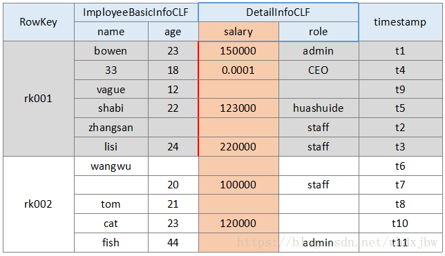

# HBase

官网：http://hbase.apache.org

HDFS：Hadoop分布式文件系统，适合非结构化数据的存储以及读取。

Apache HBase建立在HDFS之上的分布式、基于列存储的非关系型数据库；具有可靠、稳定、自动容错、多版本特性。

HBase实际上是Google BigTable项目的开源实现，它适合于海量的大规模（数十亿行、数百万列）的结构化数据存储。

当需要随机、实时读写访问大数据时,使用HBase。

## 特点

- 大：表可以有数十亿行、数百万列, 适合大规模的结构化数据存储。
- 面向列：面向列表（簇）的存储和权限控制，列（簇）独立检索。
- 结构稀疏：对于为空（null）的列，并不会占用存储空间，因此，表可以设计的非常稀疏。
- 无模式：每一行都有一个可以排序的主键和任意多的列，列可以根据需要动态的增加，同一张表中的不同的行可以有截然不同的列。
- 数据多版本：每个单元中的数据可以有多个版本，默认情况下，版本号自动分配，版本号就是单元格插入时的时间戳。
- 数据类型单一：HBase中的数据都是字符串（底层存储采用的是byte[]），没有类型。

## HBase 表结构

RDBMS：关系数据库管理系统特点

1. 固定格式
2. 容量上限（分库分表）
3. 业务需要事务（ACID）
4. 丰富的 SQL 语法

HBase 表结构

这里以一个公司员工表为案例来讲解，此表中包含员工基本信息（员工姓名、年龄），员工详细信息（工资、角色），以及时间戳。整体表结构如下：

如上，每一行有一个RowKey用于唯一地标识和定位行，各行数据按RowKey的字典序排列。其中ImployeeBasicInfoCLF和DetailInfoCLF是两个列族，列族下又有多个具体列。（员工基本信息列族：姓名、年龄。详细信息列族：薪水、角色）

> 注1：图中列族下面每一行中特定列中只画了最新版本的数据，实际上HBase最小存储单元为cell，图中每个单元格中其实有多个MVCC version版本的cell，Hbase的更新操作会带时间戳，对每个数据单元cell，可存取指定数量版本的cell，client端可以指定查询某时间点后的最新数据，也可以一次性得到cell的所有版本。）
>
> 
>
> 注2：刚刚评论里有同学提到cell的概念，这里详细说一下，cell里可得道的信息包含: row、 column family、 column qualifier(列限定符)、timestamp、type6、MVCC version、value。其中每个cell 由 row、column family、column qualifier、timestamp,、and type唯一标识。
>
> 定位 cell： rowkey + 列簇 + 列 = cell

