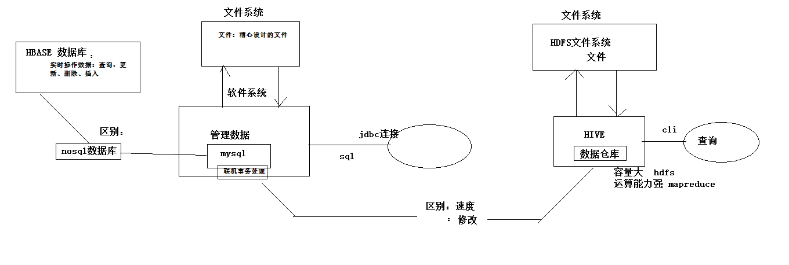
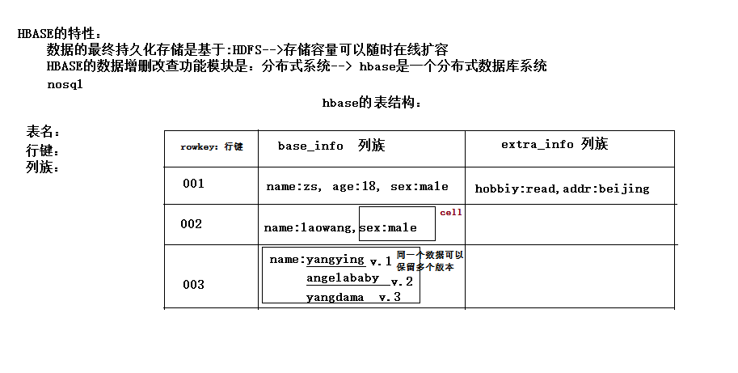

# HBase

官网：http://hbase.apache.org


HDFS：Hadoop分布式文件系统，适合非结构化数据的存储以及读取。

Apache HBase建立在HDFS之上的分布式、基于列存储的非关系型数据库；具有可靠、稳定、自动容错、多版本特性。

HBase实际上是Google BigTable项目的开源实现，它适合于海量的大规模（数十亿行、数百万列）的结构化数据存储。

当需要随机、实时读写访问大数据时,使用HBase。

## 1. 概念特性

HBASE是一个**数据库**----可以提供数据的实时**随机读写**

HBASE与mysql、oralce、db2、sqlserver等关系型数据库不同，它是一个NoSQL数据库（非关系型数据库）

Hbase的表模型与关系型数据库的表模型不同：

- Hbase的表没有固定的字段定义

- Hbase的表中每行存储的都是一些key-value对

- Hbase的表中有列族的划分，用户可以指定将哪些kv插入哪个列族

- Hbase的表在物理存储上，是按照列族来分割的，不同列族的数据一定存储在不同的文件中

- Hbase的表中的每一行都固定有一个行键，而且每一行的行键在表中不能重复

- Hbase中的数据，包含行键，包含key，包含value，HBase中的数据都是字符串（底层存储采用的是byte[]），没有类型，hbase不负责为用户维护数据类型
- HBASE对事务的支持很差

HBASE相比于其他nosql数据库(mongodb、redis、cassendra、hazelcast)的特点：

**Hbase的表数据存储在HDFS文件系统中**

从而，hbase具备如下特性：存储容量可以线性扩展； 数据存储的安全性可靠性极高！


## 2. 各种数据库之间的差别比较



### 2.1 HBase和Hive区别

#### 2.1.1 Hive 数据仓库的理解

1. 仓库就是存放历史数据存的地方，反复对历史数据进行读操作，统计分析操作，历史数据不需要修改。

2. Hive严格意义上来讲不能算是数据库。

   Hive与Hbase巨大的区别在于，Hive底层依赖的文件系统HDFS中的数据是用户提交的，没有固定的格式，可以理解成按照分隔符分割的简单文本，而不是精心设计的文件（如Mysql那样精心设计的文件加上mysql中共的软件系统，可以对数据进行随机的访问和修改操作），Hive只能对这些数据进行读取，分析，不能对修改和跟新数据。

3. mysql也当然具备做为数据仓库的功能和能力，但是数据量太大是，mysql不适合，mysql适于联机事务处理（在线实时交互）。

#### 2.1.2 HBase

1. 同msyql一样，底层的文件系统的精心设计的，Hbase的底层文件系统也是HDFS。

2. 具有联机事务处理数据库的特性（**快速** **实时**操作数据库，增删改查）。

3. Hbase本身的特性：
   - 文件系统：HDFS（表可以很大很大）
   - 分布式系统
   - nosql表结构

## 3. HBase 特性与表结构



**列族**：KV分为若干的大类：，如上表所示。

1. 每个列族中的kv数据可以随意存放，key可以不同，没有严格要求，完全有用户决定，当然一般使用情况下，数据是规整的；

　　如：下表是可以的，但是为了数据的规整，一般不建议随意为key起名字，最好保持一致。

| rowkey | base_info                |
| ------ | ------------------------ |
| 001    | name:jj, age:12, sex:mal |
| 002    | nick:ls, age:15, xb:male |

2. 同一个列祖中的kv的个数也是灵活的，可以省略某些kv

   **cell：**同一个数据可以保存多个值

   - 一个kv就是一个cell

   - 一个key可有有多个版本的值
   - 时间戳作为版本

## 4. HBase 整体工作机制

### 4.1 工作机制示意图


Hbase集群中有两个角色

　　**region server**

　　**master**

region server负责数据的逻辑处理（增删改查），**region server对数据的操作是不经过master**。某一个瞬间master挂了，regionserver还是可以正常服务的，但是一定时间之后，万一某一个regionserver挂了，该regionserver负责的任务得不到重新分配，就会出问题。

### 4.2 存储问题（分散存储）

按照region划分范围存储（region目录还细分为列族目录，列族目录下才存放具体的文件）

### 4.3 查询问题（分布式：分任务查询）

HBase底层文件系统是HDFS，HBase中的表最终也会落地HDFS，那么Hbase的一张表可以很大很大，表中的数据不断的增加增加存储也是可以的，但是怎么查询呢？

当请求特别多的时候，一台HBase服务器（region server）是不行的，HBase是一个分布式的系统，当有多个Hbase提供服务的时候，某一次客户端的请求具体由那个服务器来处理呢？

- 当某一台服务器挂了，谁来接替它的工作，如何接替？

  ​	**解决：**服务器需要分任务（分布式系统里肯定是要分任务的）

  ​	一台服务器，负责Hbase中某个表的某一个部分。

- 如何界定部分？

  ​	需要**划分范围：**按照**行健范围**

这样通过分任务之后就是一个**分布式系统。**不同的regionServer可以**并行**的去访问hdfs中的数据（表数据）**，**这样还有一个问题，若某一张表中的所有数据都存在同一个HDFS中的文件中，即使是负责同一张表的不同范围regionserver，大量的并行请求也会同时访问同一个hdfs文件，这会造成性能上的瓶颈，所以表中的数据在HDFS中是按照**region划分范围存储（region目录还细分为列族目录，列族目录下才存放具体的文件）**, 这样**同一个表的不同region范围的数据落地HDFS中不同的文件中**。否则会造成即是分了任务一个dataNode被频繁的访问。


#### 4.3.1 客户端读写数据时的路由流程

**问题描述**：客户端怎么知道他要访问的某个region在那一台regionserver上呢？

master是不会保存哪些region在哪些regionserver上的，否则就是有状态的节点了，一旦master挂了，regionserver立刻无法提供服务，而事实不是这样。

上述信息就是所谓的索引信息，master是不会保存索引信息的，索引信息是保存在系统索引表中的。

1. 索引表当然也存在于hdfs中，且只有一个region；

2. 谁来负责查询索引表

下图所示，索引表数据的查询由hdp-02机器上的regionserver负责，那么客户端怎样知道meta数据由hdp-02负责


**zookeeper上会记录元数据索引表，有哪一台regionserver负责管理。**　客户单端，每次访问数据之前，先查询zookeeper。


下图为Zookeeper节点**meta-region-server的信息**

**访问流程：**

1. 客户端去Zookeeper上查询，负责索引表数据的regionserver；

2. 找该台regionserver服务器，查询出客户端要访问的region数据由哪一台regionserver负责；

3. 客户端找具体的regionserver要数据.

**总结：**

1. Hbase表中的数据是存放在hdfs中的。

2. regionserver只负责逻辑功能，对数据进行增删改查，不存储它负责的region的数据。

3. 一个regionserver可以负责多个表的多个region。

4. region是regionServer管理数据的基本单元。

5. 客户端查找数据不经过master。

6. 客观端查找数据一定经过Zookeeper。


### 4.4 服务器宕机问题（借助Zookeeper实现HA）

**master对regionserver的监管，状态协调**

1. 所有的状态信息记录在Zookeeper里。

2. master**负责监管**region server的状态，知道每一个regionserver负责哪些表的哪些region，不负责帮用户查数据，一旦发现某个region server发生故障，会找另外的一台机器来接替该region server负责的region区域。

3. master通过Zookeeper来获取regionserver的状态。

4. master通过Zookeeper监听region server，maste是没有状态的节点，master存在单点故障的风险；通过主备容灾实现HA机制。

**master HA**

**状态信息记录在Zookeeper里。**

可以在集群中找任意一台机器启动一个备用的master，新启的这个master会处于backup状态


### 4.5 Hbase工作机制补充—regionserver数据管理

首先在hbase的表中插入一些数据，然后来观察一下hdfs中存的数据，发现hdfs下并没有数据，但是scan明明可以查到数据的，这是怎么回事呢？


scan可以查到数据。而上图hdfs中却没有数据文件。


**其实：此时此刻的数据位于内存中。**


#### 4.5.1 内存缓存热数据

1. 每个region在内存中都对应分配一块缓存空间，memstore，但是memstore毕竟有限，不会将全部的数据都存入到内存中，还是有很大的数据是存在hdfs中的。当数据量很小的时候没有必要写入到hdfs文件中，这就解释了为什么上述hdfs中没有文件数据。

   上述用户插入的数据都保存在了内存中，这样速度会比存入hdfs中快很多，但是又不能吧全部数据都存入到内存中，内存中只会保存一些**热数据【刚刚被访问过的，刚刚被插入的数据】**。

   如果有人找regionserver查数据是，regionserver内存中没有该数据，就会去hdfs中查找，找到之后作为热数据，然后缓存在内存中，超过一段时间没有人访问就不是热数据了，就不会继续保存在内存中。

2. 数据保存在内存中就有风险，万一没有来的落地hdfs，**宕机**了，内存中的数据会丢失，怎么办？

   解决方案：regionserver一方面在自己内存中写数据，一方面在hdfs中写日志，一旦宕机后，master找来替换机器后，该机器会读取日志信息，还原内存中的数据。


 **总结：**

　　**1、热数据存储**

　　**2、日志记录**

#### 4.5.2 持久化到hdfs

1. 当内存中的数据插满时候，数据会持久化到hdfs中

2. 当hbase退出时候，数据也会持久化到hdfs中


## 5. 安装 HBase

### 安装HBase

HBase是Google Bigtable的开源实现，它利用Hadoop HDFS作为其文件存储系统，利用Hadoop MapReduce来处理HBase中的海量数据，利用Zookeeper作为协同服务。所以安装HBase之前还需要安装zookeeper和hdfs。


如果是Apache hadoop就下载相应文件并修改配置文件安装。我用的是cloudera hadoop就直接在集群管理界面添加服务。


## 6. HBase 客户端

### 6.1 命令行客户端

```shell
#bin/hbase shell
#hbase(main):001:0> list     // 查看表
#hbase(main):002:0> status   // 查看集群状态
#hbase(main):003:0> version  // 查看集群版本
```

进入命令行客户端，help查看都有哪些命令【命令分为不同的组别 ddl dml tools replication...】。

#### 6.1.1 建表

```shell
create 't_user_info','base_info','extra_info'
		表名      	列族名   		列族名
```

```shell
hbase(main):004:0> create 't_user_info', 'base_info', 'extra_info'
0 row(s) in 1.4210 seconds

=> Hbase::Table - t_user_info
```

**查看HBase建表后的状态**


**HDFS中的数据**


#### 6.1.2 插入数据

**put命令**

**语法：**

```shell
put '表名','行健','列族:key','value'
```

```shell
hbase(main):004:0> put 't_user_info','001','base_info:username', 'zhangsan'
0 row(s) in 0.2250 seconds

hbase(main):005:0> put 't_user_info', '001', 'base_info:age', '18'
0 row(s) in 0.0180 seconds

hbase(main):006:0> put 't_user_info', '001', 'base_info:sex', 'female'
0 row(s) in 0.0250 seconds

hbase(main):007:0> put 't_user_info', '001', 'extra_info:career', 'it_java'
0 row(s) in 0.0150 seconds

hbase(main):008:0> put 't_user_info', '002', 'base_info:username', 'lisi'
0 row(s) in 0.0130 seconds
```

#### 6.1.3 查询数据方式一：get 单行查询

语法：

```shell
-- 返回该行全部数据
get '表名','行健'

-- 返回该行指定列族：key的值
get '表名','行健', '列族:key'
```

特性：**HBase会对 ' 列族：key ' 进行字典序排序**

　　　**timestamp：是key的版本号**　

```shell

hbase(main):001:0> get 't_user_info', '001'
COLUMN                       CELL
 base_info:age               timestamp=1585464683099, value=18
 base_info:sex               timestamp=1585464711338, value=female
 base_info:username          timestamp=1585464658247, value=zhangsan
 extra_info:career           timestamp=1585464797473, value=it_java
4 row(s) in 0.2740 seconds

hbase(main):002:0> get 't_user_info', '001', 'base_info:username'
COLUMN                       CELL
 base_info:username          timestamp=1585464658247, value=zhangsan
1 row(s) in 0.0260 seconds

```

#### 6.1.4 查询数据方式二：scan 扫描

**scan是全表扫描**

特性：

　　**1、先按照行健排序。**

　　**2、同一行健，按照key的字典序排序。**

```shell
hbase(main):012:0> scan 't_user_info'
ROW              COLUMN+CELL
 001             column=base_info:age, timestamp=1585464683099, value=18
 001             column=base_info:sex, timestamp=1585464711338, value=female
 001             column=base_info:username, timestamp=1585464658247, value=zhangsan
 001             column=extra_info:career, timestamp=1585464797473, value=it_java
 002             column=base_info:username, timestamp=1585464828257, value=lisi
2 row(s) in 0.0190 seconds
```

#### 6.1.5 delete 删除一个kv数据

```shell
hbase(main):021:0> delete 't_user_info','001','base_info:sex'
0 row(s) in 0.0390 seconds
```

#### 6.1.6 deleteall 删除整行数据

```shell
hbase(main):024:0> deleteall 't_user_info','001'
0 row(s) in 0.0090 seconds

hbase(main):025:0> get 't_user_info','001'
COLUMN                            CELL                                                                                            
0 row(s) in 0.0110 seconds
```

#### 6.1.7 删除整个表

语法：

```shell
-- 停用表
disable 表名
-- 删除表
drop 表名
```

删除表之前先要停用表。

```shell
hbase(main):028:0> disable 't_user_info'
0 row(s) in 2.3640 seconds

hbase(main):029:0> drop 't_user_info'
0 row(s) in 1.2950 seconds

hbase(main):030:0> list
TABLE                                                                                                                             
0 row(s) in 0.0130 seconds
```


### 6.2 客户端api

如何描述一个表？

如何创建一个表？

删除一个表？

修改一个表？

> 步骤：
>
> 1. 构建连接
> 2. 从连接中取到一个表DDL操作工具admin
> 3. admin.createTable(表描述对象);
> 4. admin.disableTable(表名);
> 5. admin.deleteTable(表名);
> 6. admin.modifyTable(表名，表描述对象)。

#### 6.2.1 创建连接对象

```java
import org.apache.hadoop.conf.Configuration;
import org.apache.hadoop.hbase.HBaseConfiguration;
import org.apache.hadoop.hbase.HColumnDescriptor;
import org.apache.hadoop.hbase.HTableDescriptor;
import org.apache.hadoop.hbase.TableName;
import org.apache.hadoop.hbase.client.Admin;
import org.apache.hadoop.hbase.client.Connection;
import org.apache.hadoop.hbase.client.ConnectionFactory;
import org.apache.hadoop.hbase.regionserver.BloomType;


Connection conn = null;
    
    @Before
    public void getConn() throws Exception{
        // new Configuration() 加载的是hadoop的配置文件：core-site.xml hdfs-site.xml，不会加载hbase-site.xml
　　　　 // 构建一个连接对象
　　　　 // Hbase提供了HbaseConfiguraton 用来加载hbase-site.xml
　　　　 Configuration conf = HBaseConfiguration.create(); // 会自动加载hbase-site.xml
　　　　 // 客户端查询数据的路由流程可知：客户端需要先链接 Zookeeper 获取索引表
        conf.set("hbase.zookeeper.quorum", "thtf-01:2181,thtf-02:2181,thtf-03:2181");
        
　　　　 // 创建链接对象
        conn = ConnectionFactory.createConnection(conf);
    }
```

#### 6.2.2 DDL操作

```java
// 获取一个操作指定表的table对象,进行DML操作
Table table = conn.getTable(TableName.valueOf("t_user_info"));
```

##### 增加数据

1. Table对象，进行DML操作;

2. 数据封装对象put;

3. Table.put(put) | Table.put(List<put>puts);

```java
    /**
     * 增
     * 改:put来覆盖
     * @throws Exception 
     */
    @Test
    public void testPut() throws Exception{
        
        // 获取一个操作指定表的table对象,进行DML操作
        Table table = conn.getTable(TableName.valueOf("t_user_info"));
        
        // 构造要插入的数据为一个Put类型(一个put对象只能对应一个rowkey)的对象
        Put put = new Put(Bytes.toBytes("001"));
        put.addColumn(Bytes.toBytes("base_info"), Bytes.toBytes("username"), Bytes.toBytes("张三"));
        put.addColumn(Bytes.toBytes("base_info"), Bytes.toBytes("age"), Bytes.toBytes("18"));
        put.addColumn(Bytes.toBytes("extra_info"), Bytes.toBytes("addr"), Bytes.toBytes("北京"));
        
        
        Put put2 = new Put(Bytes.toBytes("002"));
        put2.addColumn(Bytes.toBytes("base_info"), Bytes.toBytes("username"), Bytes.toBytes("李四"));
        put2.addColumn(Bytes.toBytes("base_info"), Bytes.toBytes("age"), Bytes.toBytes("28"));
        put2.addColumn(Bytes.toBytes("extra_info"), Bytes.toBytes("addr"), Bytes.toBytes("上海"));
    

        ArrayList<Put> puts = new ArrayList<>();
        puts.add(put);
        puts.add(put2);
        
        
        // 插进去
        table.put(puts);
        
        table.close();
        conn.close();    
    }
```

 

```java
   /**
     * 循环插入大量数据
     * @throws Exception 
     */
    @Test
    public void testManyPuts() throws Exception{
        
        Table table = conn.getTable(TableName.valueOf("user_info"));
        ArrayList<Put> puts = new ArrayList<>();
        
        for(int i=0;i<100000;i++){
            Put put = new Put(Bytes.toBytes(""+i));
            put.addColumn(Bytes.toBytes("base_info"), Bytes.toBytes("username"), Bytes.toBytes("张三"+i));
            put.addColumn(Bytes.toBytes("base_info"), Bytes.toBytes("age"), Bytes.toBytes((18+i)+""));
            put.addColumn(Bytes.toBytes("extra_info"), Bytes.toBytes("addr"), Bytes.toBytes("北京"));
            
            puts.add(put);
        }
        
        table.put(puts);
        
    }
```

##### 删除数据

对称结构，插入的时候需要Put对象

删除的时候，需要Delete对象

```java
    /**
     * 删
     * @throws Exception 
     */
    @Test
    public void testDelete() throws Exception{
        Table table = conn.getTable(TableName.valueOf("user_info"));
        
        // 构造一个对象封装要删除的数据信息　　　　 
        // 全部删除
        Delete delete1 = new Delete(Bytes.toBytes("001"));
        // 删除指定的key
        Delete delete2 = new Delete(Bytes.toBytes("002"));　
        // qualifier为用户意义上的key，hbase中 family+qualifier 为一个key
        delete2.addColumn(Bytes.toBytes("extra_info"), Bytes.toBytes("addr"));
        
        ArrayList<Delete> dels = new ArrayList<>();
        dels.add(delete1);
        dels.add(delete2);
        
        table.delete(dels);
        
        table.close();
        conn.close();
    }
```

##### 修改数据

使用put来覆盖

##### 查看数据

qualifier为用户意义上的key，hbase中 family+qualifier 为一个key

对称结构，插入的时候需要Put对象

删除的时候，需要Delete对象

查看单个行键数据，需要Get对象

- ##### 取出单行数据

  Table.get(Get)

  可以取出该行特定 familyName：key 的 value

  也可以遍历该行全部的value

  ```java
  	/**
       * 查
       * @throws Exception 
       */
      @Test
      public void testGet() throws Exception{
          
          Table table = conn.getTable(TableName.valueOf("user_info"));
          
          // Get对象 指定行健　
          Get get = new Get("002".getBytes());
          // 行健为002的全部数据
          Result result = table.get(get);
          
          // 从结果中取用户指定的某个key的value
          byte[] value = result.getValue("base_info".getBytes(), "age".getBytes());
          System.out.println(new String(value));
          
          System.out.println("-------------------------");
          
          // 遍历整行结果中的所有kv单元格　　　　 // 类似迭代器
          CellScanner cellScanner = result.cellScanner();
          while(cellScanner.advance()){
              Cell cell = cellScanner.current();
              
              byte[] rowArray = cell.getRowArray();  //本kv所属的行键的字节数组
              byte[] familyArray = cell.getFamilyArray();  //列族名的字节数组
              byte[] qualifierArray = cell.getQualifierArray();  //列名的字节数据
              byte[] valueArray = cell.getValueArray(); // value的字节数组
              　　　　　　　// Hbase不仅仅是存储用户数据，同时还会存储很多附加的信息，以上get方法直接将用户数据和附加数据一起返回，若想获取用户信息，需要指定其实偏移量和数据长度　
              System.out.println("行键: "+new String(rowArray,cell.getRowOffset(),cell.getRowLength()));
              System.out.println("列族名: "+new String(familyArray,cell.getFamilyOffset(),cell.getFamilyLength()));
              System.out.println("列名: "+new String(qualifierArray,cell.getQualifierOffset(),cell.getQualifierLength()));
              System.out.println("value: "+new String(valueArray,cell.getValueOffset(),cell.getValueLength()));
              
          }
          
          table.close();
          conn.close();
          
      }
  ```

- ##### 批量取出数据 

  取出多个行健范围的数据，需要Scan对象

  Table.get(Get)只能取出一个行健范围的数据；

  如何按照行健范围取出数据？

  

  table.getScanner(scan)

  拿到一个扫描器

  ```java
  	/**
       * 按行键范围查询数据
       * @throws Exception 
       */
      @Test
      public void testScan() throws Exception{
          
          Table table = conn.getTable(TableName.valueOf("user_info"));
          // Scan scan = new Scan("10".getBytes(), "10000".getBytes());
          // 包含起始行键，不包含结束行键,但是如果真的想查询出末尾的那个行键，
          // 那么，可以在末尾行键上拼接一个不可见的字节（\000）　　　　 
          Scan scan = new Scan("10".getBytes(), "10000\000".getBytes());
          
          ResultScanner scanner = table.getScanner(scan);
          
          Iterator<Result> iterator = scanner.iterator();
          
          while(iterator.hasNext()){
              // 拿到一行数据
              Result result = iterator.next();
              // 遍历整行结果中的所有kv单元格
              CellScanner cellScanner = result.cellScanner();
              while(cellScanner.advance()){
                  Cell cell = cellScanner.current();
                  
                  byte[] rowArray = cell.getRowArray();  //本kv所属的行键的字节数组
                  byte[] familyArray = cell.getFamilyArray();  //列族名的字节数组
                  byte[] qualifierArray = cell.getQualifierArray();  //列名的字节数据
                  byte[] valueArray = cell.getValueArray(); // value的字节数组
                  
                  System.out.println("行键: "+new String(rowArray,cell.getRowOffset(),cell.getRowLength()));
                  System.out.println("列族名: "+new String(familyArray,cell.getFamilyOffset(),cell.getFamilyLength()));
                  System.out.println("列名: "+new String(qualifierArray,cell.getQualifierOffset(),cell.getQualifierLength()));
                  System.out.println("value: "+new String(valueArray,cell.getValueOffset(),cell.getValueLength()));
              }
              System.out.println("----------------------");
          }
      }
      
  ```

**范围查询的细节**

道理：在真正的结尾行健后面，拼接一个数字0的字节

**\000是一个字节，全是0**

**\表示转义，此时后面的0不是数字0，不是字符0**


### 7. Hbase重要特性--排序特性（行键）

插入到hbase中去的数据，hbase会自动排序存储：

**排序规则： 首先看行键，然后看列族名，然后看列（key）名； 按字典顺序**

Hbase的这个特性跟查询效率有极大的关系

比如：一张用来存储用户信息的表，有名字，户籍，年龄，职业....等信息

然后，在业务系统中经常需要：

　　查询某个省的所有用户

　　经常需要查询某个省的指定姓的所有用户

**思路**：如果能将相同省的用户在hbase的存储文件中连续存储，并且能将相同省中相同姓的用户连续存储，那么，上述两个查询需求的效率就会提高！！！


**做法**：将查询条件拼到rowkey内