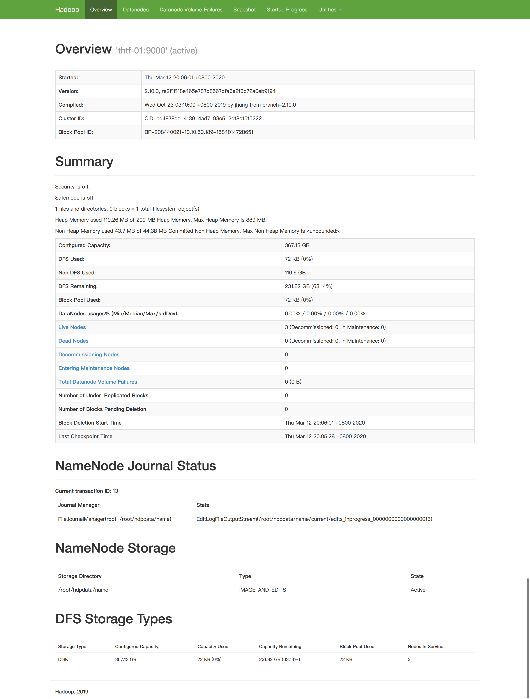
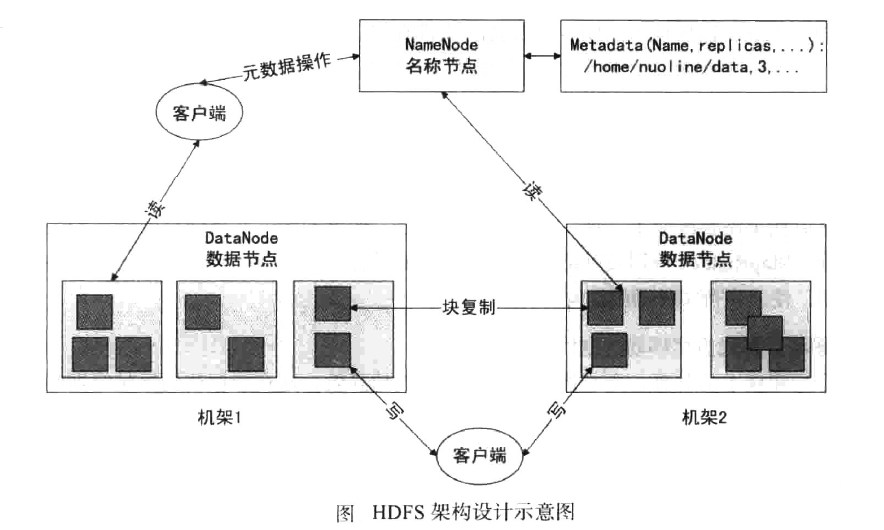

#  Hadoop 笔记


## 1. 大数据概念
### 1. 1 什么是大数据？

> **(KB - MB - GB - TB - PB - EB - ZB - YB - DB - NB)：**
>
> (bit).Byte (B).KiloByte (KB).MegaByte (MB).GigaByte (GB).TeraByte (TB).PetaByte (PB).ExaByte (EB).ZetaByte (ZB).YottaByte (YB).NonaByte (NB).DoggaByte (DB)1 Byte = 8 Bit
>
> 1 KB = 1,024 Bytes
> 1 MB = 1,024 KB = 1,048,576 Bytes
> 1 GB = 1,024 MB = 1,048,576 KB = 1,073,741,824 Bytes
> 1 TB = 1,024 GB = 1,048,576 MB = 1,073,741,824 KB = 1,099,511,627,776 Bytes
> 1 PB = 1,024 TB = 1,048,576 GB =1,125,899,906,842,624 Bytes （13107.2个80G的
> 1 EB = 1,024 PB = 1,048,576 TB = 1,152,921,504,606,846,976 Bytes
> 1 ZB = 1,024 EB = 1,180,591,620,717,411,303,424 Bytes
> 1 YB = 1,024 ZB = 1,208,925,819,614,629,174,706,176 Bytes
> 1 DB = 1,024 YB＝ 1,237,940,039,285,380,274,899,124,224 Bytes
> 1 NB = 1,024 DB＝ 1,267,650,600,228,229,401,496,703,205,376 Bytes

一般来说达到 TB ，或日增达到 GB 就属于大数据了
MySQL 单表超过 500万 条数据

### 1. 2 大数据特点？

**大数据的 5V 特性：**

- **Volume：巨大的数据量**
  集中储存/集中计算已经无法处理巨大的数据量。
  数据量呈指数增长：地震、录井 、石油钻塔的传感器一个月产生的数据量比全球所有的电影加在一起还要多。
  新浪微博用户数2.5亿+，高峰每天几亿条。

- **Variety：非结构化数据多样性**
  文本/图片/视频/文档等，如诸如微地震，电磁以及光纤分布式温度监测（DTS） 。

- **Velocity：数据增长速度快**
  用户基数庞大/设备数量众多/实时海量/数据指数级别增长。

- **Valueless：数据价值密度低**
  每个钻井平台有 40,000 传感器,但是通常只有 10% 的数据使用到。
  每个深水钻井平台的投资可达到$150M,能有效利用所有的数据非常关键,关系到安全与优化运营 。

- **Veracity：数据质量**
  数据的准确性和可信赖度，即数据的质量。

  

### 1.3 面临了哪些问题、如何解决？

- 数据如何存储 - HDFS
- 数据如何计算 - MapReduce
- 资源如何管理（CPU 内存 网络资源）- YARN

### 1.4 大数据应用场景

- **个人推荐**
  根据用户喜好，推荐相关兴趣内容
  千人一面：范围广、精度粗
  一人一面：范围小、精度高
  一人千面：兴趣内容范围大、精度高

- **风控**
  金融系统、银行、互联网金融 - 实时流处理
  
- **成本预测**
  根据近期销售和市场数据，预测成本，做出规划
  
- **气候预测**
  根据以往气象信息，预测近期气象变化，和推测之后气候异常
  
- **人工智能**
  无人汽车：百度、特斯拉、Google
  智能助手：小爱、小度
  物流机器人

## 2. Hadoop 的诞生

由 Apache 组织提供的一个开源的大数据解决方案。

###  2.1 Hadoop 的起源

- 2003-2004年，Google公布了部分GFS和MapReduce思想的细节，受此启发的Doug Cutting等人用2年的业余时间实现了DFS和MapReduce机制，使Nutch性能飙升。然后Yahoo招安Doug Gutting及其项目。
- 2005年，Hadoop作为Lucene的子项目Nutch的一部分正式引入Apache基金会。
- 2006年2月被分离出来，成为一套完整独立的软件，起名为Hadoop。Hadoop名字不是一个缩写，而是一个生造出来的词。是Hadoop之父Doug Cutting儿子毛绒玩具象命名的。
- Hadoop的成长过程
  Lucene–>Nutch—>Hadoop

- 总结起来，Hadoop起源于Google的三大论文
  - GFS：Google的分布式文件系统Google File System
  - MapReduce：Google的MapReduce开源分布式并行计算框架
  - BigTable：一个大型的分布式数据库

- 演变关系
  GFS—->HDFS
  Google MapReduce—->Hadoop MapReduce
  BigTable—->HBase

狭义上来说，hadoop就是单独指代hadoop这个软件， 
广义上来说，hadoop指代大数据的一个生态圈，包括很多其他的软件

### 2.2 Hadoop 的历史版本

- **0.x系列版本**：hadoop当中最早的一个开源版本，在此基础上演变而来的1.x以及2.x的版本
- **1.x版本系列**：hadoop版本当中的第二代开源版本，主要修复0.x版本的一些bug等
- **2.x版本系列**：架构产生重大变化，引入了yarn平台等许多新特性

### 2.3 Hadoop 生态圈

- **HDFS**：Hadoop Distribute FileSystem
- **MapReduce**：Hadoop中的分布式计算框架，实现对海量数据的并行分析和计算。
- **Hbase**：基于HDFS的列式存储的 NoSQL 数据库。
- **Hive**：简化大数据开发，可以将 SQL 语法翻译成 MR 任务。
- **Flume**：分布式的日志收集系统，用于收集海量数据，将其存储到 FS 中。
- **Kafka**：分布式的消息系统，实现分布式解耦和海量数据缓冲。
- **Zookeeper**：分布式协调服务，用于服务注册中心、配置中心、集群选举、状态监测、分布式锁等。


## 3. 大数据解决方案

- **MR**：代表基于**磁盘**的大数据离线批处理的解决方案 - 延迟较高
- **Spark**：代表基于**内存**的大数据静态批处理的解决方案 - 几乎是MR的10倍以上
- **Storm/Spark Streaming/Flink/Kafka Streaming**：实时流处理框架，达到对记录级别的数据显示和毫秒级处理

## 4. HDFS 分布式系统配置
**核心配置参数：**

- 指定 hadoop 的默认文件系统为：hdfs
- 指定 hdfs 的 namenode 节点是哪台机器
- 指定 namenode 软件存储元数据的本地目录
- 指定 datanode 软件存储文件块的本地目录  

1. 环境配置文件hadoop-env.sh

   ```shell
   # The java implementation to use.
   export JAVA_HOME=/opt/soft/jdk1.8.0_211
   export HADOOP_CONF_DIR=${HADOOP_CONF_DIR:-$PWD} #Hadoop配置文件的存放目录
   ```

2. 核心配置文件 core-site.xml

   ```xml
   <configuration>
       <!-- fs.defaultFS: 默认文件系统 hdfs  -->
       <property>
           <name>fs.defaultFS</name>
           <value>hdfs://hdp-01:9000</value>
       </property> 
   </configuration>
   ```

3. HDFS配置文件hdfs-site.xml

   ```xml
   <configuration>
       <!-- namenode 地址 -->
       <property>
           <name>dfs.namenode.http-address</name>
           <value>hdp-01:50070</value>
       </property>
       <!-- secondary namenode 地址 -->
       <property>
           <name>dfs.namenode.http-address</name>
           <value>hdp-01:50090</value>
       </property>
       
       <!-- 指定 namenode 软件存储元数据的本地目录 格式化节点时会自动生成-->
       <property>
           <name>dfs.namenode.name.dir</name>
           <value>/root/hdpdata/name</value>
       </property>
       <!-- 指定 datanode 软件存储文件块的本地目录 格式化节点时会自动生成   -->
       <property>
           <name>dfs.datanode.data.dir</name>
           <value>/root/hdpdata/data</value>
       </property> 
   
   </configuration>
   ```

4. 配置datanode集群节点文件 slaves

   ```shell
   hdp-01
   hdp-02
   hdp-03
   ```

5. 配置好以上信息后，我们就可以将hadoop的包分发给其他的节点了

   ```shell
   scp -r hadoop-2.x.x root@hdp02:(目标路径)
   ```

6. 启动集群

   在主节点上运行

   ```
   hadoop namenode -format
   ```

   运行完成后，节点会自动生成刚刚配置的工作目录

   ```
   start-dfs.sh
   ```

7. 浏览器输入http://x.x.x.x:50070查看集群运行情况

   

8. 最终服务器分布：

   | 服务器地址 | 端口             | 服务                                          |
   | ---------- | ---------------- | --------------------------------------------- |
   | hdp-01     | 50070<br />50090 | namenode<br />secondaryNamenode<br />datanode |
   | hdp-02     | 50010/50075      | datanode                                      |
   | hdp-03     | 50010/50075      | datanode                                      |

9. **问题总结**
   - 防火墙设置
     为了防止发生一些奇怪的错误，请务必关闭所有节点的防火墙，他可能会导致浏览器无法获取集群信息和文件上传集群失败
   - hosts文件配置和主机名
     因为这是完全分布式的集群，所以配置hosts文件至关重要，不然你的私钥配置和以后节点的格式化都会出错，他将会提示你无法解析主机名
   - 请在关闭所有HDFS服务后在执行`-format`格式化命令
     如果存在节点未关闭，而你运行了格式化命令，这可能导致该节点与其他节点的目录ID不一致，从而导致“网络分区”问题


## 5. HDFS 体系架构

1. **NameNode**

   是主节点，**存储文件的元数据**如`文件名、文件目录结构、文件属性(生成时间、福本数、文件权限)` ，以及每个文件的块列表和块所在的 **DateNode** 等。

2. **DataNode **

   在本地文件系统**存储文件块数据，以及块数据的校验和**

3. **Block（128M）**

   


## 6. HDFS 命令行客户端基本操作

### 6.1 客户端理解

HDFS 的客户端有多种形式：

- 网页形式
- 命令行形式

客户端在哪里运行，没有约束，只要运行客户端的机器能够跟 HDFS 集群联网。

> 注意：文件的切块大小和存储的福本数量，都是由客户端决定的！

所谓客户端决定，是通过配置参数类定的。HDFS 的客户端会读取以下两个参数，来决定切块大小和副本数量：

- 切块大小参数：dfs.blocksize
- 副本数量的参数：dfs.replication

上面两个参数在 hdfs-site.xml 中配置：

```xml
<property>
	<name>dfs.blocksize</name>
	<value>128m</value>
</property>
<property>
	<name>dfs.replication</name>
	<value>3</value>
</property>
```


### 6.2 HDFS 命令行客户端的常用操作命令

1. 查看 HDFS 目录信息

   ```shell
   hadoop fs -ls /hdfs目录
   ```

2. 在 HDFS 中创建文件夹

   ```sh
   hadoop fs -mkdir -p /aa/bb/cc
   ```

3. 移动 HDFS 中的文件（改名）

   ```sh
   hadoop fs -mv /hdfs路径	/hdfs另一个路径
   ```

4. 上传文件到 HDFS 中

   ```sh
   hadoop fs -put /本地文件 /hdfs目录
   hadoop fs -copyFromLocal/本地文件	/hdfs目录   ## copyFromLocak == put
   hadoop fs -moveFromLocal/本地文件	/hdfs目录		## 从本地移动到hdfs
   ```

5. 下载文件到客户端本地

   ```sh
   hadoop fs -get /hdfs中的文件	/本地目录
   hadoop fs -copyToLocal/hdfs中的文件	/本地目录	## copyToLocal == get
   hadoop fs -moveToLocal/hdfs中的文件 /本地目录	## 从 hdfs 中移动到本地
   ```

6. 删除 HDFS 中的文件或文件夹

   ```sh
   hadoop fs rm -r /hdfs目录或文件
   ```

7. 修改文件的权限

   ```sh
   hadoop fs -chown user:group /hdfs文件
   hadoop fs -chmod 777 /hdfs文件
   ```

8. 追加内容到已有文件

   ```sh
   hadoop fs -appendToFile /本地文件	/hdfs文件
   ```

9. 显示文本文件内容

   ```sh
   hadoop fs -cat /hdfs文件
   hadoop fs -tail /hdfs文件 
   ```


## 7. HDFS 的 JavaAPI

### 7.1 开发环境准备

1. 在本地解决Hadoop安装包
2. 在环境变量中配置：HADOOP_HOME
3. 创建 SpringBoot 工程,引入 Hadoop 依赖包

```xml
<!-- hadoop-hdfs -->
<dependency>
    <groupId>org.apache.hadoop</groupId>
    <artifactId>hadoop-hdfs</artifactId>
    <version>2.10.0</version>
</dependency>
<!-- hadoop-common -->
<dependency>
    <groupId>org.apache.hadoop</groupId>
    <artifactId>hadoop-common</artifactId>
    <version>2.10.0</version>
</dependency>
```

### 7.2 文件上传

```java
import org.apache.hadoop.conf.Configuration;
import org.apache.hadoop.fs.FSDataOutputStream;
import org.apache.hadoop.fs.FileSystem;
import org.apache.hadoop.fs.Path;
import org.apache.hadoop.io.IOUtils;
import org.junit.After;
import org.junit.Before;
import org.junit.Test;
import java.io.File;
import java.io.FileInputStream;
import java.io.FileNotFoundException;
import java.io.IOException;

public class App {
    Configuration configuration;
    FileSystem fs;
    @Before
    public void getClient() throws IOException {
        System.setProperty("HADOOP_USER_NAME", "root");

        configuration = new Configuration();
        // 手动设置连接信息
        //configuration.set("fs.defaultFS", "")
        configuration.addResource("core-site.xml");
        configuration.addResource("hdfs-site.xml ");

        fs = FileSystem.newInstance(configuration);
    }

    @After
    public void close() throws IOException {
        fs.close();
    }

    @Test
    public void upload1() throws IOException {
        fs.copyFromLocalFile(new Path("/本地文件"), new Path("/"));
    }

    @Test
    public void upload2() throws Exception {
        FileInputStream inputStream = new FileInputStream(new File("/本地文件"));
        FSDataOutputStream outputStream = fs.create(new Path("/a.txt"));
        IOUtils.copyBytes(inputStream, outputStream, 1024, true);
    }
}
```

**权限不足解决方案**

```java
org.apache.hadoop.security.AccessControlException: Permission denied: user=wolf, access=WRITE, inode="/":root:supergroup:drwxr-xr-x
...
```

- 方案一：

  ```java
  System.setProperty("HADOOP_USER_NAME", "root");
  ```

- 方案二：

  ```shell
  java -jar xxxx -DHADOOP_USER_NAME=root
  ```

- 方案三：

  > 将权限检查机制关闭：ect/hadoop/hdfs-site.xml:

  ```xml
  <property>
  	<name>dfs.permissions.enabled</name
  	<value>false</value>
  </property>
  ```

### 7.3 下载文件

```java
    @Test
    public void download1() throws IOException {
        fs.copyToLocalFile(new Path("/hdfs文件"), new Path("/本地目录"));
    }

    @Test
    public void download2() throws IOException {
        FileInputStream inputStream = new FileInputStream(new File("hdfs文件"));
        FSDataOutputStream outputStream = fs.create(new Path("/本地目录"));
        IOUtils.copyBytes(inputStream, outputStream, 1024, true);
    }
```

### 7.4 创建文件夹

```java
		@Test
    public void create() throws IOException {
        fs.mkdirs(new Path("/a/b"));
    }
```

### 7.5 删除文件

```java
		@Test
    public void delete() throws IOException {
        // 递归删除
        boolean delete = fs.delete(new Path("/a"), true);
    }
```

### 7.6 递归查询目录下所有文件列表

```java
    @Test
    public void listFile() throws IOException {
        RemoteIterator<LocatedFileStatus> remoteIterator = fs.listFiles(new Path("/"), true);
        while(remoteIterator.hasNext()) {
            LocatedFileStatus fileStatus = remoteIterator.next();
            String name = fileStatus.getPath().getName();
            System.out.println(name);
        }
    }
```

### 7.8 判断文件是否存在

```java
		@Test
    public void exist() throws IOException {
        boolean exists = fs.exists(new Path("/a.txt"));
        System.out.println(exists);
    }
```

### 7.9 回收站

```java
		@Test
    public void trash() throws IOException {
        Trash trash = new Trash(fs, configuration);
        boolean b = trash.moveToTrash(new Path("/a.txt"));
        System.out.println(b);
    }
```


·

