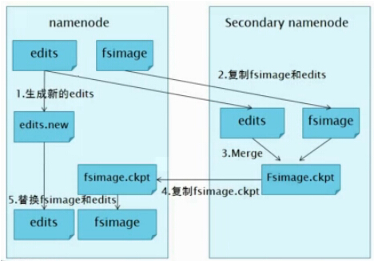
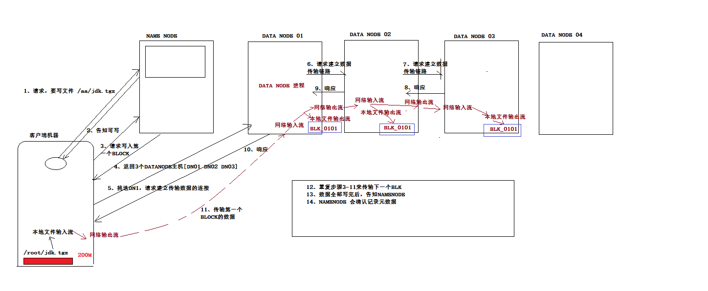
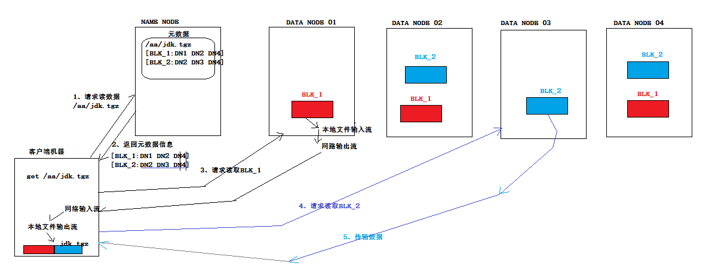
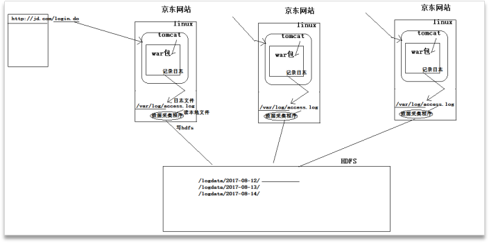
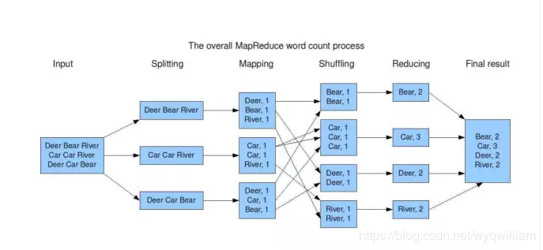
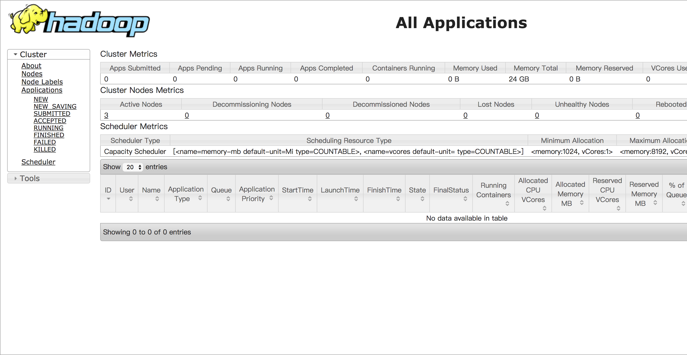
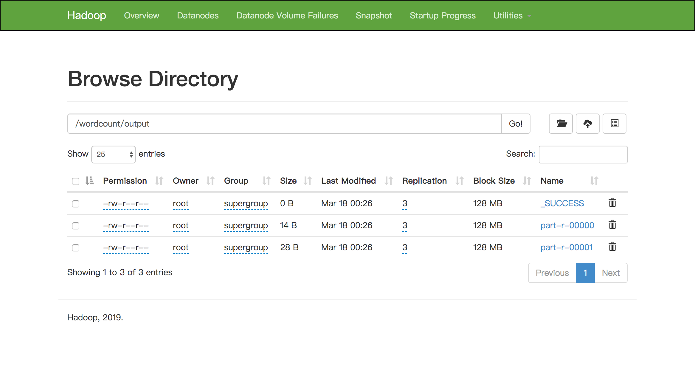

#  Hadoop


## 大数据概念
### 什么是大数据？

> KB - MB - GB - TB - PB - EB - ZB - YB - DB - NB

一般来说达到 TB ，或日增达到 GB 就属于大数据了
MySQL 单表超过 500万 条数据

### 大数据特点？

**大数据的 5V 特性：**

- **Volume：巨大的数据量**
  集中储存/集中计算已经无法处理巨大的数据量。
  数据量呈指数增长：地震、录井 、石油钻塔的传感器一个月产生的数据量比全球所有的电影加在一起还要多。
  新浪微博用户数2.5亿+，高峰每天几亿条。

- **Variety：非结构化数据多样性**
  文本/图片/视频/文档等，如诸如微地震，电磁以及光纤分布式温度监测（DTS） 。

- **Velocity：数据增长速度快**
  用户基数庞大/设备数量众多/实时海量/数据指数级别增长。

- **Valueless：数据价值密度低**
  每个钻井平台有 40,000 传感器,但是通常只有 10% 的数据使用到。
  每个深水钻井平台的投资可达到$150M,能有效利用所有的数据非常关键,关系到安全与优化运营 。

- **Veracity：数据质量**
  数据的准确性和可信赖度，即数据的质量。

  

### 面临了哪些问题,如何解决？

- 数据如何存储 - HDFS
- 数据如何计算 - MapReduce
- 资源如何管理（CPU 内存 网络资源）- YARN

### 大数据应用场景

- **个人推荐**
  根据用户喜好，推荐相关兴趣内容
  千人一面：范围广、精度粗
  一人一面：范围小、精度高
  一人千面：兴趣内容范围大、精度高

- **风控**
  金融系统、银行、互联网金融 - 实时流处理
  
- **成本预测**
  根据近期销售和市场数据，预测成本，做出规划
  
- **气候预测**
  根据以往气象信息，预测近期气象变化，和推测之后气候异常
  
- **人工智能**
  无人汽车：百度、特斯拉、Google
  智能助手：小爱、小度
  物流机器人

## Hadoop 的诞生

由 Apache 组织提供的一个开源的大数据解决方案。

###  Hadoop 的起源

- 2003-2004年，Google公布了部分GFS和MapReduce思想的细节，受此启发的Doug Cutting等人用2年的业余时间实现了DFS和MapReduce机制，使Nutch性能飙升。然后Yahoo招安Doug Gutting及其项目。
- 2005年，Hadoop作为Lucene的子项目Nutch的一部分正式引入Apache基金会。
- 2006年2月被分离出来，成为一套完整独立的软件，起名为Hadoop。Hadoop名字不是一个缩写，而是一个生造出来的词。是Hadoop之父Doug Cutting儿子毛绒玩具象命名的。
- Hadoop的成长过程
  Lucene–>Nutch—>Hadoop

- 总结起来，Hadoop起源于Google的三大论文
  - GFS：Google的分布式文件系统Google File System
  - MapReduce：Google的MapReduce开源分布式并行计算框架
  - BigTable：一个大型的分布式数据库

- 演变关系
  GFS—->HDFS
  Google MapReduce—->Hadoop MapReduce
  BigTable—->HBase

狭义上来说，hadoop就是单独指代hadoop这个软件， 
广义上来说，hadoop指代大数据的一个生态圈，包括很多其他的软件

### Hadoop 的历史版本

- **0.x系列版本**：hadoop当中最早的一个开源版本，在此基础上演变而来的1.x以及2.x的版本
- **1.x版本系列**：hadoop版本当中的第二代开源版本，主要修复0.x版本的一些bug等
- **2.x版本系列**：架构产生重大变化，引入了yarn平台等许多新特性

### Hadoop 生态圈

- **HDFS**：Hadoop Distribute FileSystem
- **MapReduce**：Hadoop中的分布式计算框架，实现对海量数据的并行分析和计算。
- **Hbase**：基于HDFS的列式存储的 NoSQL 数据库。
- **Hive**：简化大数据开发，可以将 SQL 语法翻译成 MR 任务。
- **Flume**：分布式的日志收集系统，用于收集海量数据，将其存储到 FS 中。
- **Kafka**：分布式的消息系统，实现分布式解耦和海量数据缓冲。
- **Zookeeper**：分布式协调服务，用于服务注册中心、配置中心、集群选举、状态监测、分布式锁等。


## 大数据解决方案

- **MR**：代表基于**磁盘**的大数据离线批处理的解决方案 - 延迟较高
- **Spark**：代表基于**内存**的大数据静态批处理的解决方案 - 几乎是MR的10倍以上
- **Storm/Spark Streaming/Flink/Kafka Streaming**：实时流处理框架，达到对记录级别的数据显示和毫秒级处理

## HDFS 分布式系统配置
**核心配置参数：**

- 指定 hadoop 的默认文件系统为：hdfs
- 指定 hdfs 的 namenode 节点是哪台机器
- 指定 namenode 软件存储元数据的本地目录
- 指定 datanode 软件存储文件块的本地目录  

1. 环境配置文件hadoop-env.sh

   ```shell
   # The java implementation to use.
   export JAVA_HOME=/opt/soft/jdk1.8.0_211
   export HADOOP_CONF_DIR=${HADOOP_CONF_DIR:-$PWD} #Hadoop配置文件的存放目录
   ```

2. 核心配置文件 core-site.xml

   ```xml
   <configuration>
       <!-- fs.defaultFS: 默认文件系统 hdfs  -->
       <property>
           <name>fs.defaultFS</name>
           <value>hdfs://hdp-01:9000</value>
       </property> 
   </configuration>
   ```

3. HDFS配置文件hdfs-site.xml

   ```xml
   <configuration>
       <!-- namenode 地址 -->
       <property>
           <name>dfs.namenode.http-address</name>
           <value>hdp-01:50070</value>
       </property>
       <!-- secondary namenode 地址 -->
       <property>
           <name>dfs.namenode.http-address</name>
           <value>hdp-01:50090</value>
       </property>
       
       <!-- 指定 namenode 软件存储元数据的本地目录 格式化节点时会自动生成-->
       <property>
           <name>dfs.namenode.name.dir</name>
           <value>/root/hdpdata/name</value>
       </property>
       <!-- 指定 datanode 软件存储文件块的本地目录 格式化节点时会自动生成   -->
       <property>
           <name>dfs.datanode.data.dir</name>
           <value>/root/hdpdata/data</value>
       </property> 
   
   </configuration>
   ```

4. 配置datanode集群节点文件 slaves

   ```shell
   hdp-01
   hdp-02
   hdp-03
   ```

5. 配置好以上信息后，我们就可以将hadoop的包分发给其他的节点了

   ```shell
   scp -r hadoop-2.x.x root@hdp02:(目标路径)
   ```

6. 启动集群

   在主节点上运行

   ```
   hadoop namenode -format
   ```

   运行完成后，节点会自动生成刚刚配置的工作目录

   ```
   start-dfs.sh
   ```

7. 浏览器输入http://x.x.x.x:50070查看集群运行情况

   

8. 最终服务器分布：

   | 服务器地址 | 端口             | 服务                                          |
   | ---------- | ---------------- | --------------------------------------------- |
   | hdp-01     | 50070<br />50090 | namenode<br />secondaryNamenode<br />datanode |
   | hdp-02     | 50010/50075      | datanode                                      |
   | hdp-03     | 50010/50075      | datanode                                      |

9. **问题总结**
   - 防火墙设置
     为了防止发生一些奇怪的错误，请务必关闭所有节点的防火墙，他可能会导致浏览器无法获取集群信息和文件上传集群失败
   - hosts文件配置和主机名
     因为这是完全分布式的集群，所以配置hosts文件至关重要，不然你的私钥配置和以后节点的格式化都会出错，他将会提示你无法解析主机名
   - 请在关闭所有HDFS服务后在执行`-format`格式化命令
     如果存在节点未关闭，而你运行了格式化命令，这可能导致该节点与其他节点的目录ID不一致，从而导致“网络分区”问题

## HDFS 体系架构

[官方文档](https://hadoop.apache.org/docs/stable/hadoop-project-dist/hadoop-hdfs/HdfsDesign.html)

HDFS 是一种能够运行在商业硬件上的分布式文件系统，与目前市面上文件系统有很多相似之处，但是又是不同的软件系统。在HDFS中，使用的架构主从架构（Active|Standby），针对的是**NameNode**的高可用。

1. **NameNode**
   - 存储文件的元数据如`文件名、文件目录结构、文件属性(生成时间、福本数、文件权限) ，以及每个文件的块列表和块所在的DataNode映射`
   - 负责管理 DataNode
   - 控制外界客户端对文件系统的访问。
   - NameNode会启动一个（或者说一个集群中，只有一个NameNode节点运行）

2. **DataNode **
   在本地文件系统存储文件块数据，以及块数据的校验和，负责响应客户端对块的读写请求。

3. **Block**
   数据块，是对文件拆分的最小单元（默认情况下一个块大小128MB，每个数据块有3个副本）

4. **rack**

   机架，使用机架对存储节点进行物理编排，用于优化存储和计算
   
   
   
   

### 什么是Block块

- 概述

  hadoop集群中文件的存储都是以块的形式存储在hdfs中，且一般默认都会有三个备份分别存储在集中中不同的datanode节点上。

- 默认值

  从2.7.3版本开始 block size 默认值大小为 128M，之前版本默认值为64M

- 如何修改 block 块的大小？

  可以通过修改 hdfs-site.xml中的 dfs.blocksize 对应的值

  注意: 在修改HDFS的数据块大小时，首先停掉集群hadoop的运行，修改完毕后重新启动。

- block块的大小设置规则

  在实际应用中，hdfs block块的大小设置为多少合适呢？为什么有的是64M，有个的是128M、256M、512M呢？

  首先我们先来了解几个概念：

  1. 寻址时间：HDFS 中找到目标文件block所花费的时间。
  2. 原理：文件块越大，寻址时间越短，但磁盘传输时间越长；文件块越小，寻址时间越长，但磁盘传输时间越短。

- block不能设置过大，也不能设置过小

  1. 如果设置过大，一方面从磁盘传输数据的时间会明显大于寻址时间，导致程序处理这块数据时，变得非常慢；另一方面，MapReduce 中map任务通常一次只处理一个块中的数据，如果过大运行速度也会很慢。
  2. 如果设置过小，一方面存放大小小文件会占用NameNode中大量内存来存储元数据，而NameNode的内存是有限的，不可取；另一方面块过小，寻址时间增长，导致程序一直在找block的开始位置。因此，块适当设置大一些，减少寻址时间，那么传输一个有多个块组成的文件时间**主要取决于磁盘的传输速度**。

- 设置多大合适？

  1. HDFS中平均寻址时间大概为 10ms；

  2. 经过大量的测试发现，寻址时间为传输时间的1%时，为最佳状态，所以最佳的传输时间为：

     10ms/0.01 = 1000s = 1s

  3. 目前磁盘的传输普遍为100MB/s，最佳block大小计算：

     100MB/s*1s=100MB

     所以我们设置block大小为 128MB。

  4. 实际中，磁盘的传输速率为 200MB/s时，一般设定block块大小为256MB；磁盘传输速率为400MB/s时，一般设定block大小为512MB. 

### 什么是机架感知？

- 背景

  分布式的集群通常包含非常多的机器，由于受到机架槽位和交换机网口的限制，通常大型的分布式集群都会跨好多个机架，由多个机架上的机器共同组成分布式集群。机架内的机器之间的网络速度通常都会高于跨机架机器之间的网络速度，并且机架之间机器的网络通信通常受到上层交换机网络带宽的限制。

- 存储策略

  **Hadoop在设计时考虑到数据的安全和高效，数据文件默认在HDFS上存放三份，存储策略为：**

  第一个block副本放在客户端所在的数据节点上（如果客户端不在集群范围内，则从整个集群中随机选择一个合适的数据节点来存放）。

  第二个副本放置在与第一个副本所在节点相同的机架内的其它数据节点上

  第三个副本放置在不同机架节点上

  如果副本数  >= 4时：

  前三个副本按照上面原则存放，从第四个副本开始，随机选取dataNode节点存放（每个节点只保留一份副本，每个rack不超过两个副本）

  
  
  这样如果本地数据损坏，节点可以从同一机架内的相邻节点拿到数据，速度肯定比从跨机架节点上获取数据的速度快；
  
  同时，如果整个机架的网络出现异常，也能保障可以在其它机架节点上找到数据。
  
  为了降低整体的带宽消耗和读取延时，HDFS会尽量让读取程序读取离它最近的副本。
  
  如果在读取程序的同一个机架上有一个副本，那么就读取该副本。
  
  如果在一个HDFS集群跨越多个数据中心，那么客户端也将读取本地数据中心的副本。
  
  那么Hadoop是如何确定任意两个节点为于同一个机架，还是跨机架的呢？答案就是**机架感知**。
  
  
  
  默认情况下，hadoop的机架感知是没有被开启的。所有机器hadoop都默认同一个机架下，名为“、default-rack",这种情况下，任何一台 datanode 机器，不管物理上是否属于同一个机架，都会被认为在同一个机架下，此时，就很容易出现增添机架间网络负载的情况。因为此时hadoop集群的HDFS在选机器的时候，是随机选择的，也就是说，很可能在写数据的时候，hadoop将第一块数据的block1写在 rack1上，然后随机的选择将block2写入到rack2上。
  
  此时，两个rack之间产生了数据传输的流量，再接下来，在随机的情况下，又将block3重新又写回到rack2，此时，两个rack之间又产生了一次数据流量。
  
  
  
  在job处理的数据量非常大的时候，或者hadoop推送的数据量非常大的时候，这种情况会造成rack之间的网络流量成倍的上升，成为性能的瓶颈，进而影响作业的性能甚至于整个集群的服务。

- 配置

  具体配置可参考：https://blog.csdn.net/zhongqi2513/article/details/73695229


## HDFS 核心工作原理

### 元数据管理

NameNode对数据的管理采用三种存储形式：

- 内存元数据（NameSystem）
- 磁盘元数据镜像文件
- 数据操作日志文件（可通过日志运算出元数据）

### 元数据存储机制

- 内存中有个一份完整的元数据（内存meta.data）

- 磁盘有一个”准完整“的元数据镜像（fsimage）文件（在namenode的工作目录中）

- 用于衔接内存meta.data和持久化元数据镜像fsimage之间的操作日志（edits文件）注：当客户端对hdfs中的文件进行新增或修改操作，操作记录首先被记入edits日志文件中，当客户端操作成功后，相应的元数据会被更新到内存meta.data中

### SecondaryNameNode 检查点

NameNode 职责是管理元数据信息，DataNode的职责是负责数据具体存储，那么 SecondaryNameNode 的作用是什么？它为什么会出现在 HDFS 中。从它的名字上看，它给人的感觉就像是 NameNode的备份。但实际上却不是。

**HDFS 集群运行一段时间后，可能会出现的问题：**

- edits 文件会变的很大，怎么去管理这个文件是一个挑战。
- NameNode 重启会花费很长时间，因为有很多改动要合并到 fsimage 文件上。
- 如果 NameNode 挂掉了，那就丢失了一些改动。因为此时的 fsimage 文件非常旧。

因此为了克服这个问题，我们需要一个易于管理的机制来帮助我们`减少 edits 文件的大小和得到一个最新的fsimage文件`，这样也会减少在 NameNode 上的压力。这跟windows的恢复点是非常像的，windows的恢复点机制允许我们对OS进行快照，这样当系统发生问题时，我们能够回滚到最新的一次恢复点上。

SecondaryNameNode 就是来帮助我们解决上述问题的，它的职责是合并 NameNode 的 edits 到 fsimage文件中。


**Checkpoint**

每达到触发条件，会由 SecondaryNameNode 将 NameNode 上积累的所有 edits 和一个最新的 fsimage 下载到本地，并加载到内存进行 merge，而这个过程就称为：**checkpoint**



**详细步骤**

- NameNode 管理着元数据信息，其中有两类持久化元数据文件：edits 操作日志文件和 fsImage 元数据镜像文件。新的操作日志不会立即与 fsimage 进行合并，也不会刷到 NameNode 内存中，而是会先写到 edits 中（因为合并需要消耗大量的资源）。

- 有dfs.namenode.checkpoint.period和dfs.namenode.checkpoint.txns 两个配置，只要达到这两个条件任何一个，secondarynamenode就会执行checkpoint的操作。

- 当触发 checkpoint 操作时，SecondaryNameNode 告诉 NameNode 滚动到它的 edits_inprogress 文件，这样新来的write操作就会放到一个这个新的 edits文件中。同时，Secondary 通过HTTP GET方式从 NameNode 获取到最新的 fsimage 和 edits 文件

- SecondaryNameNode 将下载下来的 fsimage 载入到内存，然后一条一条的执行 edits 文件中的各项操作，使得内存中的 fsimage 保持最新，这个过程就是 edits和fsimage文件合并，生成一个新的 fsimage文件，即上图的 fsimage.ckpt 文件。

- SecondaryNameNode 将新生成的 fsimage.ckpt文件复制到NameNode节点。

- 在 NameNode 节点的 edits.new 文件和 fsimage.ckpt文件会替换掉原来的 edits 文件 和 fsimage 文件，至此刚好是一个轮回。

- 等待下一次checkpoint触发SecondaryNameNode进行工作，一直这样循环操作。


**补充：**

NameNode 和 Secondary NameNode 的工作目录存储结构是完全相同的，所以，当NameNode故障退出需要重新恢复时，可以从Secondary NameNode的工作目录中将fsimage拷贝到NameNode的工作目录，以恢复NameNode的元数据。

  chepoint检查时间参数设置：

  （1）通常情况下，SecondaryNameNode每个一小时执行一次。

  ```xml
  # hdfs-default.xml
  <property>
    <name>dfs.namenode.checkpoint.period</name>
    <value>3600</value>
  </property>
  ```

  （2）一分钟检查一次操作次数，当操作次数达到一百万时，SecondaryNameNode执行一次。

  ```xml
  <property>
    <name>dfs.namenode.checkpoint.txns</name>
    <value>1000000</value>
  	<description>操作动作次数</description>
  </property>
  <property>
    <name>dfs.namenode.checkpoint.check.period</name>
    <value>60</value>
  	<description> 1分钟检查一次操作次数</description>
  </property>
  ```

 

从上面的描述我们可以看出，SecondaryNameNode 根本不是 NameNode 的一个热备，其只是将 fsimage 和 edits 合并。其拥有的 fsimage 不会最新的，因为它从 NameNode 下载 fsimage 和 edits 文件时候，新的更新操作已经写到 edit.new 文件中去了。而这些更新在 SecondaryNameNode 是没有同步到的。当然，如果 NameNode 中的 fsimage 真的出问题了，还是可以用 SecondaryNameNode 中的 fsimage 替换一下 NameNode 上的 fimage，虽然已经不是最新的 fsimage，但是我们可以将损失减少到最小！

### HDFS 写数据流程




### HDFS 读数据流程



### 安全模式

**安全模式的作用**

Hadoop 的安全模式即只读模式，是指当前系统中数据的副本数比较少，在该阶段要对数据块进行复制操作，不允许外界对数据库进行修改和删除等操作。处于安全模式的NameNode是不会进行数据块的复制的。

NameNode 启动时，首先将映像文件（fsimage）载入内存，并执行编辑日志（edits）中的各项操作。一旦在内中成功建立文件系统元数据的映像，则创建一个新的 fsimage 文件（这个操作不需要SecondaryNameNode）和一个空的编辑文件（edits_inprogress...）。此时，NameNode 开始监听 RPC 和 HTTP 请求。但此时，NameNode 运行在安全模式下，对于客户端来说是只读的。

处于安全模式的NameNode是不会进行数据块的复制的。

**何时进入安全模式**

- NameNode在启动的时候首先进入安全模式

- 满足最小复本数要求的数据块比例达不到dfs.safemode.threshold.pct

  如果datanode丢失的block达到一定的比例（1-dfs.safemode.threshold.pct），则系统会一直处于安全模式状态即只读状态。dfs.safemode.threshold.pct（缺省值0.999f）表示HDFS启动的时候，如果DataNode上报的block个数达到了元数据记录的block个数的0.999倍才可以离开安全模式，否则一直是这种只读模式。如果设为1则HDFS永远是处于SafeMode。

**何时退出安全模式**

- 如果满足“最小复本条件”namenode会在30秒之后退出安全模式。所谓的最小复本条件指的是文件系统中有99.9%的块满足最小复本级别（默认值是1，由dfs.replication.min属性设置）。
- 手动退出

**安全模式的配置**

https://www.iteblog.com/archives/977.html
https://www.cnblogs.com/admln/p/5821983.html

```xml
dfs.replication：设置数据块应该被复制的份数；
dfs.replication.min：所规定的数据块副本的最小份数；
dfs.replication.max：所规定的数据块副本的最大份数；
dfs.safemode.threshold.pct：指定应有多少比例的数据块满足最小副本数要求。
  (1)当小于这个比例， 那就将系统切换成安全模式，对数据块进行复制；
  (2)当大于该比例时，就离开安全模式，说明系统有足够的数据块副本数，可以对外提供服务。
  (3)小于等于0意味不进入安全模式，大于1意味一直处于安全模式。
```

副本数按dfs.replication设置，如果有失效节点导致某数据块副本数降低，当低于dfs.replication.min后，系统再在其他节点处复制新的副本。如果该数据块的副本经常丢失，导致在环境中太多的节点处复制了超过dfs.replication.max的副本数，那么就不再复制了。

**手动操作安全模式**

①查看namenode是否处于安全模式：hadoop dfsadmin –safemode get
②执行某条命令前namenode先退出安全模式：hadoop dfsadmin –safe wait
③进入安全模式：hadoop dfsadmin –safemode enter
④离开安全模式：hadoop dfsadmin –safemode leave


### 从一个 HDFS edits 文件看到的一些问题

```
-rw-r--r-- 1 root root      42 Mar 16 11:28 edits_0000000000000010479-0000000000000010480
-rw-r--r-- 1 root root      42 Mar 16 11:29 edits_0000000000000010481-0000000000000010482
-rw-r--r-- 1 root root      42 Mar 16 11:30 edits_0000000000000010483-0000000000000010484
-rw-r--r-- 1 root root      42 Mar 16 11:31 edits_0000000000000010485-0000000000000010486
-rw-r--r-- 1 root root      42 Mar 16 11:32 edits_0000000000000010487-0000000000000010488
-rw-r--r-- 1 root root      42 Mar 16 11:33 edits_0000000000000010489-0000000000000010490
-rw-r--r-- 1 root root      42 Mar 16 11:34 edits_0000000000000010491-0000000000000010492
-rw-r--r-- 1 root root      42 Mar 16 11:35 edits_0000000000000010493-0000000000000010494
-rw-r--r-- 1 root root      42 Mar 16 11:36 edits_0000000000000010495-0000000000000010496
-rw-r--r-- 1 root root      42 Mar 16 11:37 edits_0000000000000010497-0000000000000010498
-rw-r--r-- 1 root root      42 Mar 16 11:38 edits_0000000000000010499-0000000000000010500
-rw-r--r-- 1 root root      42 Mar 16 11:39 edits_0000000000000010501-0000000000000010502
-rw-r--r-- 1 root root      42 Mar 16 11:40 edits_0000000000000010503-0000000000000010504
-rw-r--r-- 1 root root      42 Mar 16 11:41 edits_0000000000000010505-0000000000000010506
-rw-r--r-- 1 root root      42 Mar 16 11:42 edits_0000000000000010507-0000000000000010508
-rw-r--r-- 1 root root      42 Mar 16 11:43 edits_0000000000000010509-0000000000000010510
-rw-r--r-- 1 root root      42 Mar 16 11:44 edits_0000000000000010511-0000000000000010512
-rw-r--r-- 1 root root      42 Mar 16 11:45 edits_0000000000000010513-0000000000000010514
-rw-r--r-- 1 root root      42 Mar 16 11:46 edits_0000000000000010515-0000000000000010516
-rw-r--r-- 1 root root      42 Mar 16 11:47 edits_0000000000000010517-0000000000000010518
-rw-r--r-- 1 root root      42 Mar 16 11:48 edits_0000000000000010519-0000000000000010520
-rw-r--r-- 1 root root      42 Mar 16 11:49 edits_0000000000000010521-0000000000000010522
-rw-r--r-- 1 root root      42 Mar 16 11:50 edits_0000000000000010523-0000000000000010524
-rw-r--r-- 1 root root      42 Mar 16 11:51 edits_0000000000000010525-0000000000000010526
-rw-r--r-- 1 root root      42 Mar 16 11:52 edits_0000000000000010527-0000000000000010528
-rw-r--r-- 1 root root      42 Mar 16 11:53 edits_0000000000000010529-0000000000000010530
-rw-r--r-- 1 root root      42 Mar 16 11:54 edits_0000000000000010531-0000000000000010532
-rw-r--r-- 1 root root      42 Mar 16 11:55 edits_0000000000000010533-0000000000000010534
-rw-r--r-- 1 root root      42 Mar 16 11:56 edits_0000000000000010535-0000000000000010536
-rw-r--r-- 1 root root 1048576 Mar 16 11:56 edits_inprogress_0000000000000010537
-rw-r--r-- 1 root root     322 Mar 12 20:05 fsimage_0000000000000000000
-rw-r--r-- 1 root root      62 Mar 12 20:05 fsimage_0000000000000000000.md5
-rw-r--r-- 1 root root       6 Mar 16 11:56 seen_txid
-rw-r--r-- 1 root root     214 Mar 12 20:05 VERSION
[root@thtf-01 current]# 
```


1. 为什么会有这么多 edits文件？

   这些edits 文件创建的时间都是间隔1个小时，这是因为每隔1小时，SecondaryNameNode 都会对 edits 和 fsimage 进行一次合并，合并之后，旧的 edits 并不会被删除，依旧被保留。

   

2. edits_inprogress… 文件作用？

   最新的一个edtis文件，用来记录用户的上传、删除操作。

   

3. 那我们看 fsimage 只保留两个文件。

   **fsimage… .md5**： 是对应文件的md5值文件，用来保证 fsimage的一致性的。

   **seen_txid**：里面保存了最新的一个 edits 文件的名字 最后的三位：107.

   NameNode 格式化后 第一次启动时，会创建一个 edits 和 fsimage 文件，后面再次启动时，直接加载 每个 edits 和最新的 fsimage 文件。

   

4. 为什么要每个 edits 都加载呢？fsimage不是已经保存之前 edits日志当中转换后的 元数据了么？

   这是为了再做一次校验的工作，确保加载到内存当中的元数据是可靠的。

   

5. Edits 文件是用来做什么的？为什么要保留这么多 edtis文件，像 fsimage一样保存一两个文件不就可以了么？

   1）edits是用来存放 用户的 上传、删除请求的日志的。当用户上传成功，这条记录会保存到 内存元数据当中。也就是说，edits是作为一个中间文件。

   2）当 secondarynamenode 对 edtis 和 fsimage 进行合并时，会创建一个新的 edits 文件，以接收在合并期间 来的新的 用户上传请求。所以，每次触发 Secondaryname 的 checkpoint（也就是对edits和 fsimage 合并），都会产生一个新的 edtis 文件。

   

6. 旧的 edtis 文件一直会保留，会不会有一天 edits把空间沾满了啊？还有 fsimage，它保留了所有 block块的信息，总有一天会很大吧？

   这个问题其实我们不用担心，因为 edtis 和 fsimage 只是保留了 每个文件的位置等的信息，这些信息经过很长时间也不会占用多少空间的。

   但也会遇到小文件太多的问题，比如下面场景：

   | 文件              | NameNode内存占用             | DataNode磁盘占用 |
   | ----------------- | ---------------------------- | ---------------- |
   | 128MB             | 一个block块的元数据信息 1KB  | 128MB            |
   | 128MB*10000个文件 | 10000block块元数据信息：10MB | 128MB            |

   HDFS最初是为流式访问大文件开发的，如果访问大量小文件，需要不断的从一个datanode跳到另一个datanode，严重影响性能。

   引申出问题：

   （1）NameNode所在的物理节点内存应该多给一点

   （2）理论上hdfs是可以无限扩充的，因此可以在横向上扩展无数个节点。但是因为NameNode实际只能有一个运行，所以hdfs的上限容量受制于NameNode的内存上限容量。

   

## HDFS 命令行客户端基本操作

### 客户端理解

HDFS 的客户端有多种形式：

- 网页形式
- 命令行形式

客户端在哪里运行，没有约束，只要运行客户端的机器能够跟 HDFS 集群联网。

> 注意：文件的切块大小和存储的福本数量，都是由客户端决定的！

所谓客户端决定，是通过配置参数类定的。HDFS 的客户端会读取以下两个参数，来决定切块大小和副本数量：

- 切块大小参数：dfs.blocksize
- 副本数量的参数：dfs.replication

上面两个参数在 hdfs-site.xml 中配置：

```xml
<property>
	<name>dfs.blocksize</name>
	<value>128m</value>
</property>
<property>
	<name>dfs.replication</name>
	<value>3</value>
</property>
```


### HDFS 命令行客户端的常用操作命令

1. 查看 HDFS 目录信息

   ```shell
   hadoop fs -ls /hdfs目录
   ```

2. 在 HDFS 中创建文件夹

   ```sh
   hadoop fs -mkdir -p /aa/bb/cc
   ```

3. 移动 HDFS 中的文件（改名）

   ```sh
   hadoop fs -mv /hdfs路径	/hdfs另一个路径
   ```

4. 上传文件到 HDFS 中

   ```sh
   hadoop fs -put /本地文件 /hdfs目录
   hadoop fs -copyFromLocal/本地文件	/hdfs目录   ## copyFromLocak == put
   hadoop fs -moveFromLocal/本地文件	/hdfs目录		## 从本地移动到hdfs
   ```

5. 下载文件到客户端本地

   ```sh
   hadoop fs -get /hdfs中的文件	/本地目录
   hadoop fs -copyToLocal/hdfs中的文件	/本地目录	## copyToLocal == get
   hadoop fs -moveToLocal/hdfs中的文件 /本地目录	## 从 hdfs 中移动到本地
   ```

6. 删除 HDFS 中的文件或文件夹

   ```sh
   hadoop fs rm -r /hdfs目录或文件
   ```

7. 修改文件的权限

   ```sh
   hadoop fs -chown user:group /hdfs文件
   hadoop fs -chmod 777 /hdfs文件
   ```

8. 追加内容到已有文件

   ```sh
   hadoop fs -appendToFile /本地文件	/hdfs文件
   ```

9. 显示文本文件内容

   ```sh
   hadoop fs -cat /hdfs文件
   hadoop fs -tail /hdfs文件 
   ```


## HDFS 的 JavaAPI

### 开发环境准备

1. 在本地解压Hadoop安装包
2. 在环境变量中配置：HADOOP_HOME
3. 创建 SpringBoot 工程,引入 Hadoop 依赖包

```xml
<!-- hadoop-hdfs -->
<dependency>
    <groupId>org.apache.hadoop</groupId>
    <artifactId>hadoop-hdfs</artifactId>
    <version>2.10.0</version>
</dependency>
<!-- hadoop-common -->
<dependency>
    <groupId>org.apache.hadoop</groupId>
    <artifactId>hadoop-common</artifactId>
    <version>2.10.0</version>
</dependency>
```

### 文件上传

```java
import org.apache.hadoop.conf.Configuration;
import org.apache.hadoop.fs.FSDataOutputStream;
import org.apache.hadoop.fs.FileSystem;
import org.apache.hadoop.fs.Path;
import org.apache.hadoop.io.IOUtils;
import org.junit.After;
import org.junit.Before;
import org.junit.Test;
import java.io.File;
import java.io.FileInputStream;
import java.io.FileNotFoundException;
import java.io.IOException;

public class App {
    Configuration configuration;
    FileSystem fs;
    @Before
    public void getClient() throws IOException {
        System.setProperty("HADOOP_USER_NAME", "root");

        configuration = new Configuration();
        // 手动设置连接信息
        //configuration.set("fs.defaultFS", "")
        configuration.addResource("core-site.xml");
        configuration.addResource("hdfs-site.xml ");

        fs = FileSystem.newInstance(configuration);
    }

    @After
    public void close() throws IOException {
        fs.close();
    }

    @Test
    public void upload1() throws IOException {
        fs.copyFromLocalFile(new Path("/本地文件"), new Path("/"));
    }

    @Test
    public void upload2() throws Exception {
        FileInputStream inputStream = new FileInputStream(new File("/本地文件"));
        FSDataOutputStream outputStream = fs.create(new Path("/a.txt"));
        IOUtils.copyBytes(inputStream, outputStream, 1024, true);
    }
}
```

**权限不足解决方案**

```java
org.apache.hadoop.security.AccessControlException: Permission denied: user=wolf, access=WRITE, inode="/":root:supergroup:drwxr-xr-x
...
```

- 方案一：

  ```java
  System.setProperty("HADOOP_USER_NAME", "root");
  ```

- 方案二：

  ```shell
  java -jar xxxx -DHADOOP_USER_NAME=root
  ```

- 方案三：

  > 将权限检查机制关闭：ect/hadoop/hdfs-site.xml:

  ```xml
  <property>
  	<name>dfs.permissions.enabled</name
  	<value>false</value>
  </property>
  ```

### 下载文件

```java
@Test
public void download1() throws IOException {
  fs.copyToLocalFile(new Path("/hdfs文件"), new Path("/本地目录"));
}

@Test
public void download2() throws IOException {
  FileInputStream inputStream = new FileInputStream(new File("hdfs文件"));
  FSDataOutputStream outputStream = fs.create(new Path("/本地目录"));
  IOUtils.copyBytes(inputStream, outputStream, 1024, true);
}
```

### 创建文件夹

```java
@Test
public void create() throws IOException {
  fs.mkdirs(new Path("/a/b"));
}
```

### 删除文件

```java
@Test
public void delete() throws IOException {
  // 递归删除
  boolean delete = fs.delete(new Path("/a"), true);
}
```

### 递归查询目录下所有文件列表

```java
@Test
public void listFile() throws IOException {
  RemoteIterator<LocatedFileStatus> remoteIterator = fs.listFiles(new Path("/"), true);
  while(remoteIterator.hasNext()) {
    LocatedFileStatus fileStatus = remoteIterator.next();
    String name = fileStatus.getPath().getName();
    System.out.println(name);
  }
}
```

### 判断文件是否存在

```java
@Test
public void exist() throws IOException {
  boolean exists = fs.exists(new Path("/a.txt"));
  System.out.println(exists);
}
```

### 回收站

```java
@Test
public void trash() throws IOException {
  Trash trash = new Trash(fs, configuration);
  boolean b = trash.moveToTrash(new Path("/a.txt"));
  System.out.println(b);
}
```


### HDFS客户端编程应用场景：数据采集



#### 需求描述

在业务系统服务器上，业务程序会不断生成业务日志（比如网站的访问日志）

业务日志是用log4j生成的，会不断的切出日志文件

需要定期（如：每小时）从业务服务器上的日志文件中，探测需要采集的日志文件（access.log)，发往HDFS

注意点：业务服务器可能有多台（hdfs上的文件名不能直接用日志服务器上的文件名）

当天采集的日志要放在hdfs的当天目录中

采集完成的日志文件，需要移动到日志服务器的一个备份目录中

定期检查（一小时检查一次）备份目录，将备份时长超过24小时的日志文件清除  


#### 数据采集设计

**1、流程**

启动一个定时任务
- 定时探测日志源目录
- 获取需要采集的文件
- 移动这些文件到一个待上传的临时目录
- 遍历待上传目录中的各个文件，逐一传输到HDFS的目标路径，同时将传输完成的文件移动到备份目录

启动一个定时任务

- 探测备份目录中的备份数据，检查是否已超出最长备份时长，如果超出，则删除

**2、规划各种路径**

日志源路径：/Users/wolf/logs/access

待上传临时目录：/Users/wolf/logs /tmp

备份目录：/Users/wolf/logs/backup/日期

HDFS存储路径：/logs/日期 

HDFS文件前缀：access_log_

HDFS文件后缀：.log


#### 代码实现

配置文件：collect.properties

```properties
LOG_SOURCE_DIR=/logs/access/
LOG_TMP_DIR=/logs/tmp/
LOG_BACKUP_BASE_DIR=/logs/backup/
LOG_BACKUP_TIMEOUT=24

HDFS_DEST_BASE_DIR=/logs
HDFS_FILE_PREFIX=access_log_
HDFS_FILE_SUFFIX=.log
```

配置常量池： Constants.java

```java
public class Constants {
    public static final String LOG_SOURCE_DIR = "LOG_SOURCE_DIR";
    public static final String LOG_TMP_DIR = "LOG_TMP_DIR";
    public static final String LOG_BACKUP_BASE_DIR = "LOG_BACKUP_BASE_DIR";
    public static final String LOG_BACKUP_TIMEOUT = "LOG_BACKUP_TIMEOUT";
    public static final String HDFS_DEST_BASE_DIR = "HDFS_DEST_BASE_DIR";
    public static final String HDFS_FILE_PREFIX = "HDFS_FILE_PREFIX";
    public static final String HDFS_FILE_SUFFIX = "HDFS_FILE_SUFFIX";
}
```

 配置文件加载类：PropertyHolder.java

```java
import java.io.IOException;
import java.util.Properties;

public class PropertyHolder {

    private static Properties prop;

    public static Properties getProps() throws IOException {
        if (prop == null) {
            synchronized (PropertyHolder.class) {
                if (prop == null) {
                    prop = new Properties();
                    prop.load(PropertyHolder.class.getClassLoader().getResourceAsStream("collect.properties"));
                }
            }
        }
        return prop;
    }
}

```

日志收集task：CollectTask.java

```java
import org.apache.commons.io.FileUtils;
import org.apache.hadoop.conf.Configuration;
import org.apache.hadoop.fs.FileSystem;
import org.apache.hadoop.fs.Path;
import org.slf4j.Logger;
import org.slf4j.LoggerFactory;
import java.io.File;
import java.text.SimpleDateFormat;
import java.util.*;

public class CollectTask extends TimerTask {
    private Logger logger = LoggerFactory.getLogger(CollectTask.class);

    @Override
    public void run() {
        // - 定时探测日志源目录
        // - 获取需要采集的文件
        // - 移动这些文件到一个待上传的临时目录
        // - 遍历待上传目录中的各个文件，逐一传输到HDFS的目标路径，同时将传输完成的文件移动到备份目录

        // 获取本地采集是的日期
        SimpleDateFormat sdf = new SimpleDateFormat("yyyy-MM-dd-HH");
        String date = sdf.format(new Date());

        // 构造一个HDFS的客户端对象
        try {
            Properties props = PropertyHolder.getProps();

            File srcDir  = new File(props.getProperty(Constants.LOG_SOURCE_DIR));
            // 列出日志源目录中需要采集的文件
            File[] listFiles = srcDir.listFiles((File dir, String name) -> {
                return name.startsWith("access.log");
            });

            if (listFiles.length == 0) {
                logger.info("探测到如下文件需要采集为空！");
                return;
            }

            logger.info("探测到如下文件需要采集：{}", Arrays.toString(listFiles));

            // 将要采集的文件移动到待上传临时目录
            File tmpDir = new File(props.getProperty(Constants.LOG_TMP_DIR));
            for (File file : listFiles) {
                FileUtils.moveFileToDirectory(file, tmpDir, true);
            }


            System.setProperty("HADOOP_USER_NAME", "root");
            Configuration configuration = new Configuration();
            // 手动设置连接信息
            //configuration.set("fs.defaultFS", "")
            configuration.addResource("core-site.xml");
            configuration.addResource("hdfs-site.xml ");
            FileSystem fs = FileSystem.newInstance(configuration);

            // 检查HDFS的日期目录是否存在，不存在就创建
            Path hdfsDatePath = new Path(props.getProperty(Constants.HDFS_DEST_BASE_DIR) + date);
            if (!fs.exists(hdfsDatePath)) {
                fs.mkdirs(hdfsDatePath);
            }

            File[] toUploadFiles = tmpDir.listFiles();
            for (File file : toUploadFiles) {
                Path destPath = new Path(hdfsDatePath + props.getProperty(Constants.HDFS_FILE_PREFIX) + UUID.randomUUID() + props.getProperty(Constants.HDFS_FILE_SUFFIX));
                // 传输文件到HDFS并修改名称
                fs.copyFromLocalFile(new Path(file.getAbsolutePath()), destPath);
                logger.info("文件上传hdfs完成：{} --> {}", file.getAbsolutePath(), destPath);

                File backupDir = new File(props.getProperty(Constants.LOG_BACKUP_BASE_DIR) + date + "/");
                FileUtils.moveFileToDirectory(file, backupDir, true);
                logger.info("文件备份完成：{} --> {}", file.getAbsolutePath(), backupDir);
             }

        } catch (Exception e) {
            e.printStackTrace();
        }
    }
}
```

日志备份清理task：BackupCleanTask.java

```java
import org.apache.commons.io.FileUtils;
import org.slf4j.Logger;
import org.slf4j.LoggerFactory;
import java.io.File;
import java.text.SimpleDateFormat;
import java.util.TimerTask;

public class BackupCleanTask extends TimerTask {
    private Logger logger = LoggerFactory.getLogger(BackupCleanTask.class);

    /**
     * The action to be performed by this timer task.
     */
    @Override
    public void run() {
        logger.info("定时清理任务开始执行");
        // 获取本地采集是的日期
        SimpleDateFormat sdf = new SimpleDateFormat("yyyy-MM-dd-HH");
        long now = System.currentTimeMillis();

        try {
            // 探测本地备份目录
            File backupBaseDir = new File("/Users/wolf/logs/backup/");
            File[] dateBackDir = backupBaseDir.listFiles();

            // 判断备份日期子目录是否已经超过24小时
            for (File dir : dateBackDir) {
                if (!dir.isHidden()) {
                    long time = sdf.parse(dir.getName()).getTime();
                    if ((now - time) > 24*60*60*1000L) {
                        FileUtils.deleteDirectory(dir);
                        logger.info("备份目录：{} 清理完毕！", dir.getName());
                    }
                }
            }
        } catch (Exception e) {
            e.printStackTrace();
        }
    }
}
```

定时任务main函数：DataCollectMain.java

```java
import java.util.Timer;

public class DataCollectMain {

    public static void main(String[] args) {
        Timer timer = new Timer();

        // 定时数据收集
        timer.schedule(new CollectTask(), 0, 60*60*1000L);

        // 定时清理历史数据备份
        timer.schedule(new BackupCleanTask(), 0, 60*60*1000L);

    }
}
```


### HDFS版的wordcount

HdfsWordCount.java

```java
import org.apache.hadoop.conf.Configuration;
import org.apache.hadoop.fs.*;
import java.io.BufferedReader;
import java.io.InputStreamReader;
import java.net.URI;
import java.util.HashMap;
import java.util.Map;
import java.util.Properties;
import java.util.Set;

public class HdfsWordCount {

    public static void main(String[] args) throws Exception {
        // 初始化
        Properties props = new Properties();
        props.load(HdfsWordCount.class.getClassLoader().getResourceAsStream("job.properties"));

        Class<?> mapper_impl_class = Class.forName(props.getProperty("MAPPER_IMPL_CLASS"));
        Mapper mapper = (Mapper) mapper_impl_class.newInstance();

        Context context = new Context();


        // 去hdfs中读取文件：一次读一行
        FileSystem fs = FileSystem.get(new URI("hdfs://10.10.50.189:9000"), new Configuration(), "root");
        RemoteIterator<LocatedFileStatus> iterator = fs.listFiles(new Path("/wordcount/input"), false);
        while (iterator.hasNext()) {
            LocatedFileStatus file = iterator.next();
            FSDataInputStream in = fs.open(file.getPath());

            BufferedReader br = new BufferedReader(new InputStreamReader(in));
            String line = null;
            while ((line = br.readLine()) != null) {
                // 调用一个方法对每一行进行业务处理
                mapper.map(line, context);
            }
            br.close();
            in.close();
        }

        HashMap<Object, Object> contextMap = context.getContextMap();
        Path outPath = new Path("/wordcount/output/");
        if (!fs.exists(outPath)) {
            fs.mkdirs(outPath);
        }

        FSDataOutputStream out = fs.create(new Path("/wordcount/output/res.dat"));

        Set<Map.Entry<Object, Object>> entrySet = contextMap.entrySet();
        for (Map.Entry<Object, Object> entry : entrySet) {
            out.write((entry.getKey().toString() + "\t" + entry.getValue() + "\n").getBytes());
        }

        out.close();
        fs.close();

        System.out.println("数据统计完成！");
    }

}
```

job.properties

```properties
MAPPER_IMPL_CLASS=com.pyy.wordcount.WordCountMapper
```

Mapper.java 

```java
public interface Mapper {
    public void map(String line, Context context);
}

```

WordCountMapper.java

```java
public class WordCountMapper implements Mapper {

    @Override
    public void map(String line, Context context) {
        String[] words = line.split(" ");
        for (String word : words) {
            Object value = context.get(word);
            if (null == value) {
                context.write(word, 1);
            } else {
                int v = (int)value;
                context.write(word, v+1);
            }
        }
    }
}
```

Context.java

```java

import java.util.HashMap;

public class Context {

    private HashMap<Object, Object> contextMap = new HashMap<>();

    public void write(Object key, Object value) {
        contextMap.put(key, value);
    }

    public Object get(Object key) {
        return contextMap.get(key);
    }

    public HashMap<Object, Object> getContextMap() {
        return contextMap;
    }
}
```

统计文件：

a.txt:

```
hello tom
hello jim
hello jeca
hello kata
hello wolf
```

b.txt

```
hello tom
hello jim
hello jeca
hello kata
hello wolf
```

c.txt

```
hello tom
hello jim
hello jeca
hello kata
hello wolf
```

d.txt

```
hello tom
hello jim
hello jeca
hello kata
hello wolf
```

统计结果：

rst.dat

```
kata    4
tom     4
wolf    4
jeca    4
hello   20
jim     4
```


## MapReduce

### MapReduce 是什么？

> MapReduce是一种编程模型，用于大规模数据集（大于1TB）的并行运算。概念"Map（映射）"和"Reduce（归约）"，是它们的主要思想，都是从函数式编程语言里借来的，还有从矢量编程语言里借来的特性。它极大地方便了编程人员在不会分布式并行编程的情况下，将自己的程序运行在[分布式系统](https://baike.baidu.com/item/分布式系统)上。 当前的软件实现是指定一个Map（映射）函数，用来把一组键值对映射成一组新的键值对，指定并发的Reduce（归约）函数，用来保证所有映射的键值对中的每一个共享相同的键组。(摘自百度百科)


### 为什么要使用MR？

上面我们写的HDFS版wordcount程序：统计hdfs的/wordcount/input/a.txt文件中的单词出现个数

明白了一点：可以在任何地方运行程序，访问HDFS上的文件并进行统计运算，并且可以把统计结果写回HDFS的结果文件中。

但是，进一步思考：如果文件又多又大，用上面的代码有什么弊端？

**慢！因为只有一台机器在进行运算处理。**

如何变的更快？

核心思路：让我们的程序并行在多台机器上执行。

### MapReduce 框架

分两个阶段：

- map阶段 -- 程序MapTask
- reduce阶段 -- 程序ReduceTask

### MapReduce具有的特点

总所周知MapReduce是一种很受欢迎的软件框架，尤其是我们国家发展到现在互联网的浪潮愈演愈烈，那么它都有什么特点呢？

- **易于编程**：MapReduce通过相应的接口，程序员只需要简单的调用就可以完成对一个复杂的分布式程序的编写。
- **易扩展性**：在计算资源不足时可以通过增加机器来增加计算能力。
- **高容错性**：要知道MapReduce的提出就是为了运行在廉价的商用pc中，而商用pc得到问题也是颇多，经常会出现pc挂掉的情况，这时候就需要可以迅速的把计算任何和资源转移到另外的一个节点上运行，从而保证任务、作业的顺利运行。
- **海量PB级数据的离线处理**：所谓离线处理即为它不具体毫秒级别的迅速反馈能力，在对反馈要求非常及时的场景下，自然是不可用的

那么MapReduce有哪些不适合的场景呢？

- **实时计算**：没有mysql等数据库的毫秒级反馈能力。
- **流式计算**：流式计算的输入数据时动态的，而 MapReduce 的输入数据集是静态的，不能动态变化。这是因为 MapReduce 自身的设计特点决定了数据源必须是静态的。
- **DAG(有向图)模式**：即每个作业或者任务之间都有很强的连接性，下一个作业的运行需要另外一个作业的运行结果的数据，这种情况下MapReduce的性能非常低，因为每个MapReduce的作业都会把计算写入到磁盘中，若如此做则会造成大量的磁盘IO,性能低下。

### MapReduce 实例

为了分析 MapReduce 的编程模型，这里我们以 WordCount 为实例。就像 Java、C++等编程语言的入门程序 hello word 一样，WordCount 是 MapReduce 最简单的入门程序。下面我们就来逐步分析。

**1. 场景**：假如有大量的文件，里面存储的都是单词。

类似应用场景：WordCount 虽然很简单，但它是很多重要应用的模型。

- 搜索引擎中，统计最流行的 K 个搜索词。
- 统计搜索词频率，帮助优化搜索词提示。

**2. 任务**：我们该如何统计每个单词出现的次数？

**3. 将问题规范为**：有一批文件（规模为 TB 级或者 PB 级），如何统计这些文件中所有单词出现的次数。

**4. 解决方案**：首先，分别统计每个文件中单词出现的次数；然后，累加不同文件中同一个单词出现次数。

### MapReduce 版 wordcount 代码实现

- 第一步：导入maven依赖

  ```xml
  <!-- hadoop-client -->
  <dependency>
      <groupId>org.apache.hadoop</groupId>
      <artifactId>hadoop-client</artifactId>
      <version>2.10.0</version>
  </dependency>
  ```

- 第二步：编写WordcountMapper.java

  ```java
  package com.pyy.mr;
  
  import org.apache.hadoop.io.IntWritable;
  import org.apache.hadoop.io.LongWritable;
  import org.apache.hadoop.io.Text;
  import org.apache.hadoop.mapreduce.Mapper;
  import java.io.IOException;
  
  /**
   * KEYIN: 是一行的起始偏移量 Long
   * VALUEIN：是一行的内容 String
   *
   * KEYOUT：用户自定义map方法要返回的结果kv数据的key的类型，在wordcount中，我们需要返回的是单词 String
   * VALUEOUT： 用户自定义map方法要返回的结果kv数据的value的类型，在wordcount中，我们需要返回的是整数 Integer
   *
   * 但是，MapReduce中，map产生的数据要传输为 reduce，需要进行序列化和反序列化，而原生jdk序列化产生的数据量比较冗余
   * 就会导致数据在MapReduce运行过程效率低，所有，hadoop专门设计了自己的序列化机制，那么，mapreduce中传输的数据类型就必须
   * 要实现hadoop自己的序列化接口
   *
   * hadoop为jdk中的常用数据类型 Long String Integer Float等数据类型封装了自己的实现Hadoop序列化接口类型：LongWritable，Text，IntWritable, FloatWritable
   */
  public class WordcountMapper extends Mapper<LongWritable, Text, Text, IntWritable> {
  
      @Override
      protected void map(LongWritable key, Text value, Context context) throws IOException, InterruptedException {
          // 切单词
          String line = value.toString();
          String[] words = line.split(" ");
          for (String word : words) {
              context.write(new Text(word), new IntWritable(1));
          }
      }
  }
  ```

- 编写 WordcountReducer.java

  ```java
  package com.pyy.mr;
  
  import org.apache.hadoop.io.IntWritable;
  import org.apache.hadoop.io.Text;
  import org.apache.hadoop.mapreduce.Reducer;
  import java.io.IOException;
  import java.util.Iterator;
  
  public class WordcountReducer extends Reducer<Text, IntWritable, Text, IntWritable> {
  
      @Override
      protected void reduce(Text key, Iterable<IntWritable> values, Context context) throws IOException, InterruptedException {
  
          int count = 0;
          Iterator<IntWritable> iterator = values.iterator();
          while(iterator.hasNext()) {
              IntWritable value = iterator.next();
              count += value.get();
          }
          context.write(key, new IntWritable(count));
      }
  }
  ```

### MapReduce 执行流程

通过上面的分析可知，它其实就是一个典型的 MapReduce 过程。下面我们通过示意图来分析 MapReduce 过程。



上图流程大致分为以下几步：

- 第一步：假设一个文件有三行英文单词作为 MapReduce 的input（输入），这里经过 Splitting 过程把文件分割为3块。分割后的3块数据就可以并行处理，每一块交给一个 maptask 处理。

- 第二步：每个 maptask 中，以每个单词为key，以1作为词频数value，然后输出。
- 第三步：每个 maptask 的输出要经过 shuffling（混洗），将相同的单词key放在同一个桶里面，然后交给 reducetask 处理。
- 第四步：reduce 接收到 shuffling 后的数据，会将相同单词进行合并，得到每个单词的词频数，最后将统计好的每个单词的词频数作为输出结果。

上述就是 MapReduce 的大致流程，前两步可以看做是 Map 阶段，后两步可以看成 Reduce阶段。

具体如何执行，我们还需要借助于 YARN。

### YARN简介

> Apache Hadoop YARN （Yet Another Resource Negotiator，另一种资源协调者）是一种新的 Hadoop 资源管理器，它是一个通用资源管理系统，可为上层应用提供统一的资源管理和调度，它的引入为集群在利用率、资源统一管理和数据共享等方面带来了巨大好处。（摘自百度百科）

 

### YARN架构


yarn是一个分布式程序的**运行调度平台**

yarn中有**两大核心角色**：

**1、Resource Manager**

接受用户提交的分布式计算程序，并为其划分资源

管理、监控各个Node Manager上的资源情况，以便于均衡负载

**2、Node Manager**

管理它所在机器的运算资源（cpu + 内存）

负责接受Resource Manager分配的任务，创建容器、回收资源

### YARN 的安装

NodeManager 在物理上应该跟 DataNode 部署在一起（方便任务执行）通过slaves文件设置

ResourceManager 最好单独部署在一台专门的机器上。

1. 修改配置文件：yarn-site.xml

   ```xml
   <configuration>
     <property>
     	<name>yarn.resourcemanager.hostname</name>
     	<value>hdp-01</value>
     </property>
     <property>
     	<name>yarn.nodemanager.aux-services</name>
     	<value>mapreduce_shuffle</value>
   	</property>
       <property>
     	<name>mapreduce.framework.name</name>
     	<value>yarn</value>
   	</property>
   </configuration>
   ```

2. 拷贝配置文件：mapred-site.xml.template mapred-site.xml 设置job提交到哪里运行

   ```
   <configuration>
     <property>
     	<name>mapreduce.framework.name</name>
     	<value>yarn</value>
   	</property>
   </configuration>
   ```

3. scp 这个 yarn-site.xml mapped-site.xml 到其它节点

4. 启动 yarn 集群：start-yarn.sh （注：该命令应该在 ResourceManager 所在的机器上执行,就会在该机器上启动 RM）

5. 用 `jps` 检查 yarn 的进程，用 web 浏览器查看 yarn 的 web 控制台。

   http://10.10.50.189:8088

   

### 运行上面的 wordcount mr程序

1. 接着上面的 wordcount 工程，编写 JobSubmitter 客户端类

   ```java
   import org.apache.hadoop.conf.Configuration;
   import org.apache.hadoop.fs.FileSystem;
   import org.apache.hadoop.fs.Path;
   import org.apache.hadoop.io.IntWritable;
   import org.apache.hadoop.io.Text;
   import org.apache.hadoop.mapreduce.Job;
   import org.apache.hadoop.mapreduce.lib.input.FileInputFormat;
   import org.apache.hadoop.mapreduce.lib.output.FileOutputFormat;
   import java.io.IOException;
   
   /**
    * 提交 mapreduce job 的客户端
    * 功能：
    *  1. 封装本次job运行时需要的必要参数
    *  2. 跟yarn进行校核，将mapreduce程序成功的启动、运行
    */
   public class JobSubmitter {
   
       public static void main(String[] args) throws Exception {
           System.setProperty("HADOOP_USER_NAME", "root");
   
           Configuration conf = new Configuration();
           conf.addResource("core-site.xml");
           conf.addResource("hdfs-site.xml");
           conf.addResource("yarn-site.xml");
           conf.addResource("mapred-site.xml");
           // 如果要从windows上运行这个job提交客户端程序，则需要加这个跨平台提交的参数
           //conf.set("mapreduce.app-submission.cross-platform", "true");
           FileSystem fs = FileSystem.newInstance(conf);
           Job job = Job.getInstance(conf);
   
           // 1.封装参数：jar包所在位置
           // job.setJar("/wc.jar")
           job.setJarByClass(JobSubmitter.class);
   
           // 2.封装参数：本地job所要调用的Mapper实现类、Reducer实现类
           job.setMapperClass(WordcountMapper.class);
           job.setReducerClass(WordcountReducer.class);
   
           // 3.封装参数：本次job的Mapper实现类、Reducer实现类产生的结果数据的key、value类型
           job.setMapOutputKeyClass(Text.class);
           job.setMapOutputValueClass(IntWritable.class);
   
           job.setOutputKeyClass(Text.class);
           job.setOutputValueClass(IntWritable.class);
   
           Path output = new Path("/wordcount/output/");
           if (fs.exists(output)) {
               fs.delete(output, true);
           }
   
           // 4.封装参数：本次job要处理的封装的输入数据集所在路径、最终结果的输出路径。
           FileInputFormat.setInputPaths(job, new Path("/wordcount/input/"));
           FileOutputFormat.setOutputPath(job, output);//注意：必须保证路径不存在
   
           // 5.封装参数：想要启动的 reducer task的数量（默认1） （map task 自己根据切片自动）
           job.setNumReduceTasks(2);
   
           // 6.提交job给yarn
           boolean res = job.waitForCompletion(true);
   
           System.exit(res ? 0 : -1);
   
       }
   }
   ```
   
2. 运行方式

   - **远程jar包部署**

     ```java
     // 设置jar类加载器，否则找不到Mapper和Reducer
     job.setJarByClass(JobSubmitter.class)
     ```

     ```shell
     打包 mvn clean package
     上传 jar 包到 linux 系统
     保证 hdfs 和 yarn 都正常启动和运行
     
     通过 hadoop jar 命令运行
     hadoop jar wc-1.0-SNAPSHOT.jar com.pyy.mr.JobSubmitter
     ```

     

   - **跨平台提交**

     ```java
     // 如果要从非linux上运行这个job提交客户端程序，则需要加这个跨平台提交的参数
     conf.set("mapreduce.app-submission.cross-platform", "true");
     ```

     或配置 mapred-site.xml

     ```xml
     <configuration>
     	<property>
       		<name>mapreduce.framework.name</name>
       		<value>yarn</value>
     	</property>
     	<property>
     		<name>mapreduce.app-submission.cross-platform</name>
     		<value>true</value>
     	</property>
     </configuration>
     ```

     设置jar包路径

     ```java
      job.setJar("/wc.jar");//系统会通过网络将jar删除到yarn
     ```

3. 去hdfs的输出目录查看结果。

   


