# Hive
## 什么是数仓

### 基本概念

数据仓库（英文：Data Warehouse，简称 DW 或 DWH），是一个用于存储、分析、报告的数据系统。

数据仓库的目的是构建**面向分析**的集成化数据环境，为企业提供决策支持（Decision Support）。


数据仓库**本身并不 "生产" 任何数据**，其数据来源于不同的外部系统。

同时数据仓库自身也**不需要 "消费" 任何数据**，其结果开放给各个外部应用系统使用。

这也是为什么叫 "仓库", 而不叫 "工厂" 的原因。

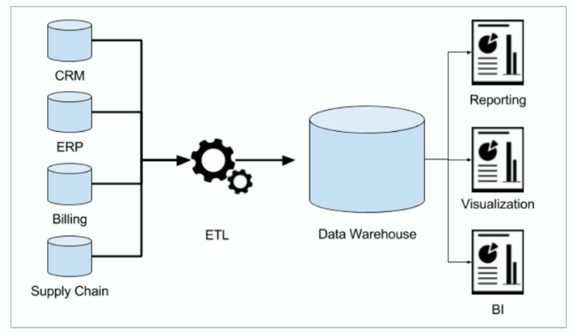

### 数仓为何而来 

先下结论：**为了分析数据而来**，分析结果为企业决策提供支撑。

企业中，信息总是用作两个目的：

1）操作型记录的保存

2）分析型决策的制定

以下一中国人寿保险公司（chinalife）发展为例，阐述数据仓库为何而来？

**操作型记录的保存**

- 中国人寿保险（集团）公司下多条业务线，包括：人寿险、财险、车险、养老险等。各个线的业务正常运营需要记录维护包括客户、保单、收付费、核保、理赔等信息。

- **联机事务处理系统（OLTP）**正好可以满足上述业务需求开展，其主要任务是执行联机事务处理。其基本特征是前台接收用户数据可以立即传送给后台进行处理，并在很短时间内给出处理结果。

  

- **关系型数据库（RDBMS）就是OLTP典型应用**，比如：Oracle、MySQL、SQL Server等。

  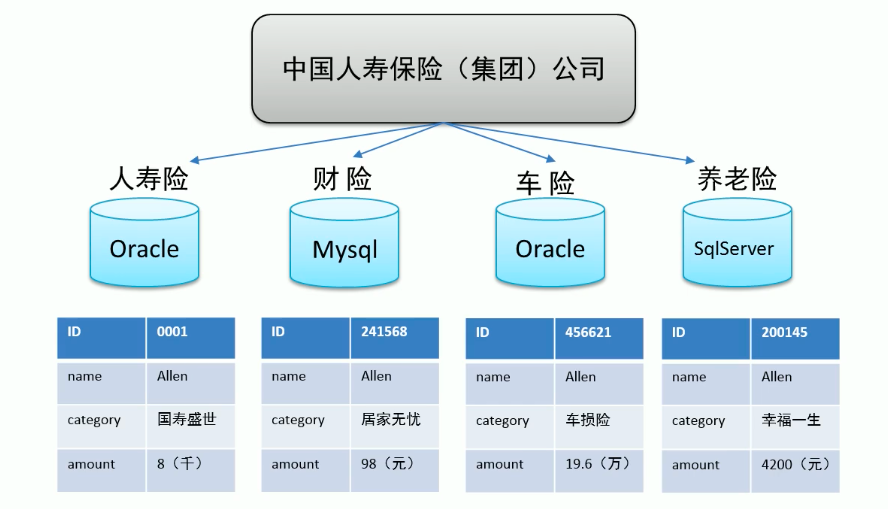

**分析型决策的制定**

- 随着集团业务的持续运营，业务数据将会越来越多。由此也产生出许多运营相关的困惑：

  - 能够确定哪些险种正在恶化或已成为不良险种？
  - 能够用有效的方式制定新增和续保的政策吗？
  - 理赔过程有欺诈的可能吗？我们是否有欺诈识别能力？
  - 现在得到的报表是否只是某业务线的？集团整体侧面数据如何？

     ...

- 为了能够正确认识这些问题，制定相关的解决措施，瞎拍桌子肯定是不行的。

- 最稳妥的办法就是：**基于业务数据开展数据分析，基于分析的结果给决策提供支撑。**也就是所谓的数据驱动决策的制定。

  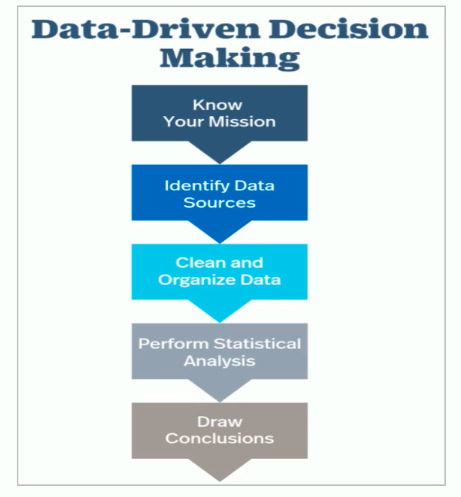

  > 问题：在哪里进行数据分析？数据库可以吗？

  **OLTP环境开展分析可行吗？**

  可以，但是没必要

  OLTP系统的核心是面向业务，支持业务，支持事务。所有的业务操作而言分为读、写两种操作，一般来说**读的压力明显大于写的压力**。如果在OLTP环境直接开展各种分析，有以下问题需要考虑：

  1）数据分析也是对数据进行读取操作，会让读取压力倍增；

  2）OLTP仅存储数周或数月的数据；

  3）数据分散存储在不同的表中，字段类型属性不统一；

  

  当分析所涉及数据规模较小的时候，在业务低峰期可以在OLTP系统上开展直接分析。但是**为了更好的进行各种规模的数据分析，同时也不影响OLTP系统运行，此时需要构建一个集成统一的数据分析平台。**

  该平台的目的很简单：**面向分析，支持分析，**并且和OLTP系统**解耦合**。

  基于这种需求，数据仓库的雏形开始在企业中出现了。

### 数仓的创建

如数仓定义所说，数仓是一个用于存储、分析、报告的数据系统，目的是构建面向分析的集成化数据环境。我们把这种**面向分析、支持分析**的系统称之为 **OLAP （联机分析处理）系统**。数据仓库就是OLAP的一种。

中国人寿保险公司就是基于分析决策的需求，构建数仓平台。

 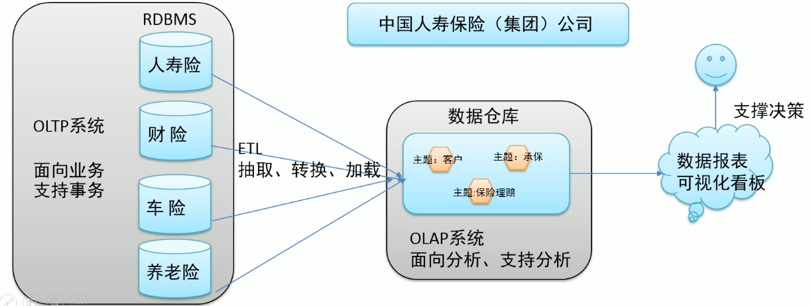


### 主要特征

 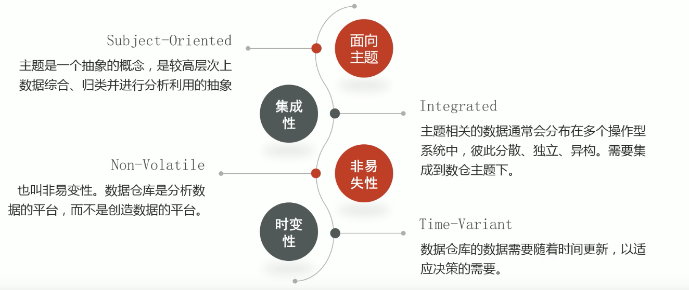

- **面向主题性（Subject-Oriented）**

  - 数据库中，最大的特点是**面向应用**进行数据的组织，各个业务系统可能是相互分离的。

  - 而**数据仓库则是面向主题的**。主题是一个抽象的概念，是较高层次上企业信息系统中的**数据综合**、**归类**并进行分析利用的抽象。在逻辑意义上，它是对企业中某一宏观分析领域所涉及的分析对象。

  - 操作行处理（传统数据）对数据的划分并不适用于决策分析。而基于主题组织的数据则不同，它们被划分为各自独立的领域，各个领域有各自的逻辑内涵但互不交叉，在**抽象层次上对数据进行完整、一致和准确的描述**。

    
  
- **集成性（Integrated）**

  - 确定主题之后，就需要获取和主题相关的数据。当下企业中主题相关的**数据通常会分布在多个操作系统中，彼此分散、独立、异构**。

  - 因此在数据进入数据仓库之前，必然要经过**统一与综合，对数据进行抽取、清洗、转换和汇总**，这一步是数据仓库建设中最关键、最复杂的一步，所要完成的工作有：

    1）要统一源数据中所有矛盾之处，如字段同名异义、异名同义、单位不统一、字长不统一，等等。

    2）进行数据综合和计算。数据仓库中的数据综合工作可以在从原有数据库抽取数据时生成，但许多是在数据仓库内部生成的，即进入数据仓库以后进行综合生成的。

    > 一句话总结来说：不论数据来源于哪里，只要它属于同一个主题，我就要把它集中到一起，且保障它们之间格式统一干净规整。
  
    下图说明了保险公司综合数据的简单处理过程，其中数据仓库中与 "承保" 主题有关的数据来自于不同操作性系统。这些系统内部数据命名可能不同，数据格式也可能不同。把不同来源的数据存储到数据仓库之前，需要去除这些不一致。

  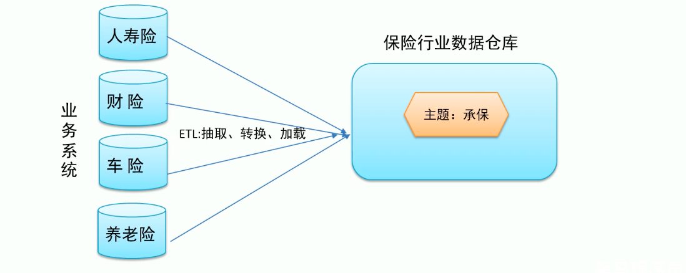

- **非易失性、非异变性（Non-Volatile）**

  - **数据仓库是分析数据的平台，而不是创造数据的平台**。我们通过数仓去分析数据中的规律，而不是去创造修改其中的规律。因此数据进入数据仓库后，它便稳定且不会改变。
  - 操作性数据库主要服务于日常的业务操作，使得数据库需要不断对数据进行实时更新，以便迅速获取当前最新数据，不至于影响业务正常的运作。在数仓中只要保存过去的业务数据，不需要每一笔业务都实时更新数据仓库，而是根据商业需要每隔一段时间把一批相对较新的数据导入到数据仓库。
  - **数据仓库的数据反映的是一段相对长时间内历史数据的内容**，而不同时间点数据库快照的集合，以及基于这些数据快照进行统计、综合和重组的导出数据。
  - 数据仓库的用户对数据的操作大多是数据查询或者比较复杂的挖掘，一旦数据进入数仓以后，一般情况下被较长时间保留。**数据仓库一般有大量的查询操作，但修改和删除操作很少。**
  
- **时变性（Time-Variant）**
  
  - 数据仓库包括各种粒度的历史数据，数据可能与某个特定日期、星期、月份、季度或年份有关。
    
  - 虽然数据仓库的用户不能修改数据，但并不是说数仓的数据就永远不变的。分析的结果只能反应过去的情况，当业务变化后，挖掘出的模式会失去时效性。因此数仓的数据**需要随着时间更新，以适应决策的需要**。从这个角度讲，数仓建设是一个项目，更是一个过程。
    
  - 数据仓库的数据随时间的变化表现在一下几个方面：
    
    1）数据仓库的数据时限一般要远远长于操作型数据的数据时限；
    
    2）操作型系统存储的是当前数据，而数据仓库存储的是历史数据；
    
    3）数据仓库中数据是按照时间顺序追加的，它们都带有时间属性。
  
  
  
### OLTP、OLAP

- 联机**事务**处理 OLTP （On-Line **Transaction** Processing）

  - 操作性处理，叫联机事务处理 OLTP （On-Line **Transaction** Processing），主要目标是做数据处理，它是针对具体业务在数据库联机的日常操作，通常对少数记录进行查询、修改。

  - 用户较为关心操作的响应时间、数据的安全性、完整性和并发支持用户数等问题。

  - 传统的**关系型数据库系统（RDBMS）作为数据管理的主要手段，主要用于操作型处理。**

    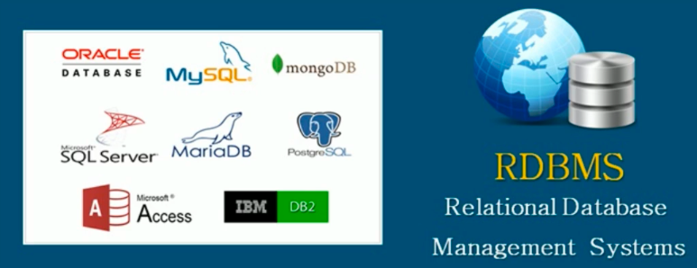


- 联机**分析**处理 OLAP（On-Line Analytical Processing)

  - 分析型处理，叫联机分析处理 OLAP（On-Line **Analytical** Processing），主要目标是做数据分析。
  - 一般针对某些主题的历史数据进行复杂的多维分析，支持管理决策。
  - **数据仓库是 OLAP 系统的一个典型示例**，主要用于数据分析。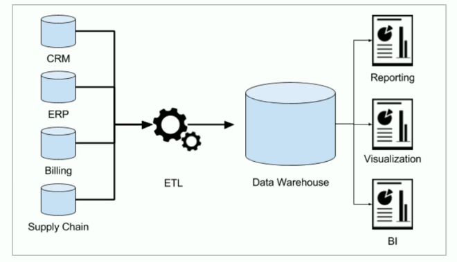

- 对比

  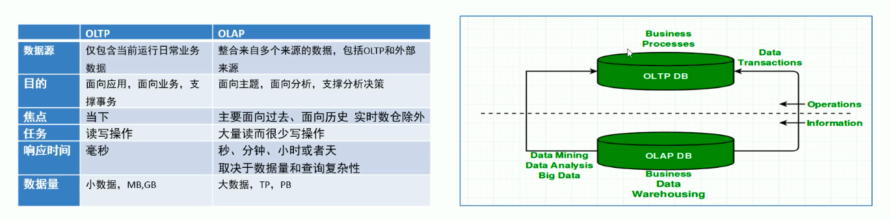

  


### 数据库与数据仓库的区别

数据库与数据仓库的区别实际讲的是 OLTP 与 OLAP 的区别。

OLTP系统的典型应用就是 RDBMS，也就是我们俗称的数据库，当然这里要特别强调此数据库表的是关系型数据库，NoSQL数据库并不在讨论范围内。

OLAP 系统的典型应用就是 DW，也就是我们俗称的数据仓库。

**结论：**

- 数据仓库不是大型的数据库，虽然数据仓库存储的数据规模很大。
- 数据仓库的出现，并不是为了取代数据库。
- 数据库是面向事务的设计，数据仓库是面向主题设计的。
- 数据库一般存储业务数据，数据仓库存储的一般是历史数据。
- 数据库是为了**捕获数据**而设计，数据仓库是为了**分析数据**而设计。


### 数据仓库、数据集市

数据仓库（Data Warehouse）是面向**整个集团**组织的数据，数据集市（Data Mart）是面向**某个部门**使用的。

可以认为数据集市是数据仓库的子集，也有人把**数据集市叫做小型数据仓库**。数据集市通常只涉及一个主题领域，例如市场营销或销售。因此它们较小且更具体，所以它们通常更容易管理和维护，并具有更灵活的结构。

下图中，各种操作型系统数据和包括文件在内的等其他数据作为数据源，经过ETL（抽取转加载）填充到数据仓库中；数据仓库中有不同主题数据，数据集市则根据部门特点面向指定主题，比如Purchasing（采购）、Sales（销售）、Inventory（库存）；

用户可以根据主题数据开展各种应用：数据分析、数据报表、数据挖掘。

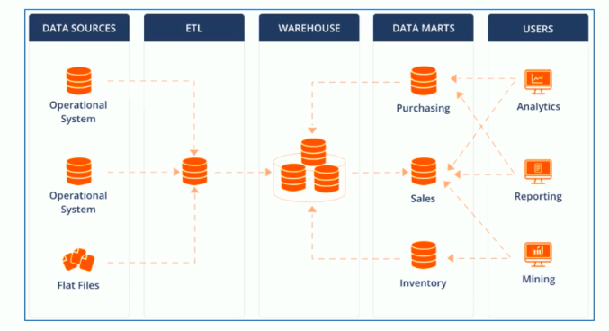


### 数仓的分层架构 

#### 分层思想和标准

数据仓库的特点是本身不生产数据，也不最终消费数据。按照数据流入流出数仓的过程进行分层就显得水到渠成。

每个企业根据自己的业务需求可以分成不同的层次。但是最基础的分层思想，理论上可分为三个层级：操作型数据层（**ODS**）、数据仓库层（**DW**）和数据应用层（**DA**）。

 企业在实际运行中可以基于这个基础分层之上添加新的层次，来满足不同的业务需求。

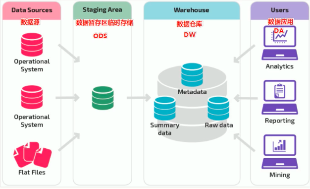

#### 阿里巴巴数仓3层架构

为了更好的理解数据仓库和分层的思想以及每层的功能意义，下面结合阿里巴巴提供出的数仓分层架构图进行分析。

阿里数仓是非常经典的3层架构，从下往上依次是：**ODS、DW、DA**。

通过元数据管理和数据质量监控来把控整个数仓中数据的流转过程、血缘依赖关系和生命周期。

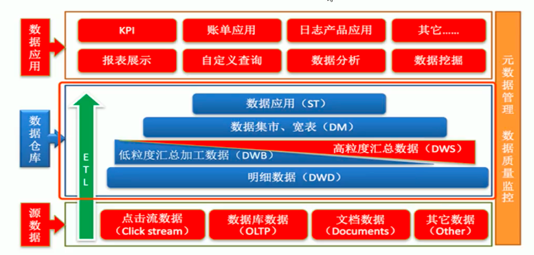


数据仓库的数据来源于不同的源数据，并提供多样的数据应用，数据自下而上流入数据仓库后向上层开放应用，而数据仓库只是中间集成化数据管理的一个平台。 

- **ODS层（Operation Data Store）操作型数据层**，也称之为源数据层、数据引入层、数据暂存层、临时缓存层

  此层数据无任何更改，直接沿用外围系统数据结构和数据，不对外开放；为临时存储层，是接口数据的临时存储区域，为后一步的数据处理做准备。 **主要完成基础数据引入到数仓的职责，和数据源系统进行解耦合，同时记录基础数据的历史变化。**

- **DW层（Data Warehouse）数据仓库层** ：也称为细节层，DW层的数据应该是一致的、准确的、干净的数据，即对源系统数据进行了清洗（去除了杂质）后的数据。 主要完成了数据的数据的**加工与整合**，建立一致性的维度，构建**可复用的面向分析和统计的明细实时表**，以及汇总公共粒度的指标。内部具体划分如下：

  - 公共维度层（DIM）：基于维度建模理念思想，建立整个企业的一致性维度。
  - 公共汇总粒度事实层（DWS、DWB）：已分析的主题对象作为建模驱动，基于上层的应用和产品的指标要求，构建公共粒度的汇总指标事实表，以宽表化手段物理化模型。
  - 明细粒度事实表（DWD）：将明细事实表的某些重要维度属性字段做适当冗余，即宽表化处理。

- DA层或ADS层，数据应用层 ，面向最终用户，面向业务定制提供为产品和数据分析使用的数据。包括前端报表、分析图标、KPI、仪表盘、OLAT专题、数据挖掘等分析。


#### 为什么要对数据仓库分层？

**好处**

分层的主要原因是在管理数据的时候，能对数据有一个更加清晰的掌控，详细来讲，主要有下面几个原因：

- **清晰数据结构**
  每一个数据分层都有它的作用域，在使用表的时候能更方便地定位和理解。
- 数据血缘追踪
  简单来说，我们最终给业务呈现的是一个能直接使用业务表，但是它的来源有很多，如果有一张来源表出问题了，我们希望能够快速准确地定位到问题，并清楚它的危害范围。
- **减少重复开发**
  规范数据分层，开发一些通用的中间层数据，能够减少极大的重复计算。
- **把复杂问题简单化**
  将一个复杂的任务分解成多个步骤来完成，每一层只处理单一的步骤，比较简单和容易理解。而且便于维护数据的准确性，当数据出现问题之后，可以不用修复所有的数据，只需要从有问题的步骤开始修复。
- **屏蔽原始数据的异常**
  屏蔽业务的影响，不必改一次业务就需要重新接入数据

#### ETL 和 ELT

数据仓库**从各数据源获取数据及在数据仓库内的数据转换和流动**都可以认为是ETL（抽取Extra, 转化Transfer, 装载Load）的过程。但是在实际操作中将数据加载到仓库却产生了两种不同做法：ETL和ELT。

- **Extract，Transform，Load，ETL**

  首先从数据源池中提取数据，这些数据源通常是事务性数据库。数据保存在临时暂存数据库中。然后执行转换操作，将数据结构化并转换为适合目标数据仓库系统的形式。然后将结构化数据加载到仓库中，以备分析。

  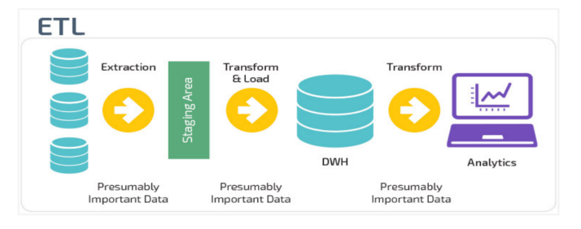

- **Extract，Load，Transform ，ELT**

  使用ELT，数据在从源数据池中提取后立即加载。没有临时数据库，这意味着数据会立即加载到单一的集中存储库中。数据在数据仓库系统中进行转换，以便与商业智能工具和分析一起使用。**大数据时代的数仓这个特点很明显。**

  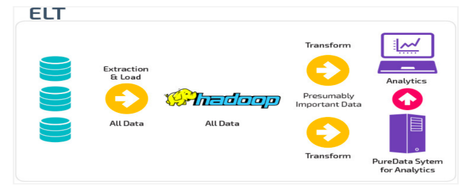

### 案例

> **场景分析**：美团点评酒旅数仓建设实践

下面通过一线互联网企业真实的数仓建设实践案例，来从宏观层面感受以下几点：

- 数仓面向主题分析的特点
- 在企业中数仓是一个不断维护的工程
- 数仓分层并不局限于经典3层，可以根据自身需求进行调整
- 没有好的架构，只有适合自己业务需求的架构
- 它山之石可以攻玉

#### 架构变迁

在美团点评酒旅事业群内，业务由**传统的团购**形式转向**预订**、**直连**等更加丰富的产品形式，业务系统也在迅速的迭代变化，这些都对数据仓库的扩展性、稳定性、易用性提出了更高要求。

基于此，美团采取了分层次、分主题的方式不断优化并调整层次结构，下图展示了技术架构的变迁。

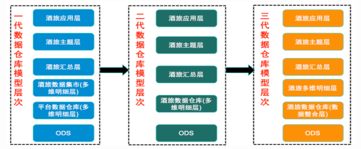

**第一代**数仓模型层次中，由于当时美团整体的业务系统所支持的产品形式比较单一（团购），业务系统中包含了所有业务品类的数据，所以由平台的角色来加工数据仓库基础层是非常合适的，平台统一建设，支持各个业务线使用，所以在本阶段中酒旅只是建立了一个相对比较简单的**数据集市**。

**第二代**数仓模型层次的建设，由建设**数据集市**的形式转变成了**直接建设酒旅数据仓库**，成为了酒旅自身业务系统数据的唯一加工者。

随着美团和点评融合，同时酒旅自身的业务系统重构的频率也相对较高，对第二代数仓模型稳定性造成了非常大的影响，原本的维度模型非常难适配这么迅速的变化。核心问题是在用业务系统和业务线关系错综复杂，业务系统之间差异性明显且变更频繁。

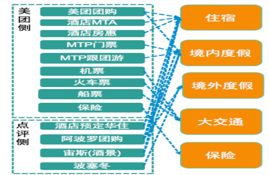

于是在**第三代**ODS与多维明细层中间加入了**数据整合层**，参照Bill Inmon所提出的企业信息工厂建设的模式，基本按照三范式的原则来进行数据整合，由业务驱动调整成了由技术驱动的方式来建设数据仓库基础层。

使用本基础层的最根本出发点还是在于美团的供应链、业务、数据它们本身的多样性，如果业务、数据相对比较单一、简单，本层次的架构方案很可能将不再适用。

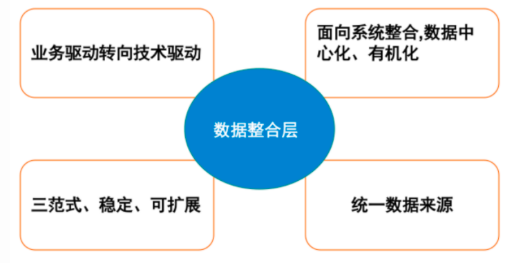

#### 主题建设

实际上在传统的一些如银行、制造业、电信、零售等行业里，都有一些比较成熟的模型，如耳熟能详的BDWM模型，它们都是经过一些具有相类似行业的企业在二三十年数据仓库建设中所积累的行业经验，不断的优化并通用化。

但美团所处的O2O行业本身就没有可借鉴的成熟的数据仓库主题以及模型，所以，在摸索建设两年的时间里，美团总结了下面比较适合现状的七大主题（后续可能还会新增）

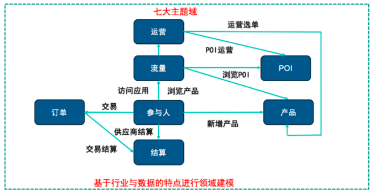

#### 整体架构

确定好技术和业务主题之后，数仓的整体架构就比较清晰了。美团酒旅数仓七个主题基本上都采用6层结构的方式来建设，划分**主题**更多是从**业务的角度**出发，而**层次**划分则是基于技术，**实质上就是基于业务与技术的结合完成了整体的数据仓库架构**。

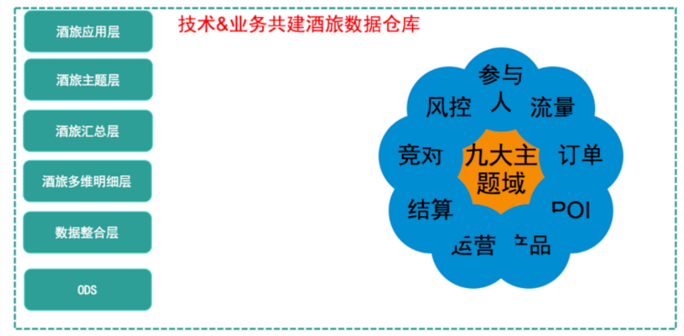

比如，以订单主题为例。在订单主题的建设过程中，美团是按照**由分到总的结构思路来进行建设**，首先分供应链建设订单相关实体（数据整合中间层3NF），然后再进行适度抽象把分供应链的相关订单实体进行合并后生成订单实体（数据整合层3NF），后续在数据整合层的订单实体基础上再扩展部分维度信息来完成后续层次的建设。

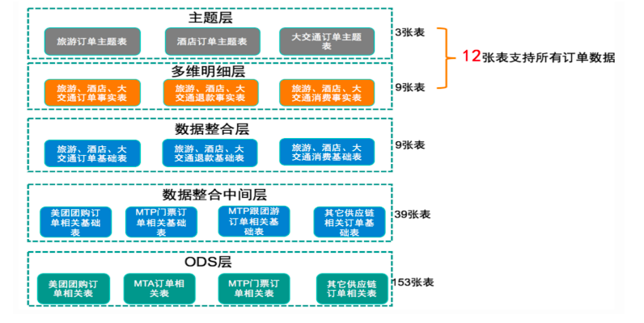

## **Hive** 的基本概念

### Hive 简介

#### 什么是 **Hive** ？

Apache Hive是一款建立在Hadoop之上的开源**数据仓库系统**，可以将存储在Hadoop文件中的结构化、半结构化数据文件**映射**为一张数据库表，基于表提供了一种类似SQL的查询模型，称为Hive查询语言（HQL），用于访问和分析存储在Hadoop文件中的大型数据集。

Hive核心是将**HQL转换为MapReduce**程序，然后将程序提交到Hadoop群集执行。Hive由Facebook实现并开源。


#### 为什么使用 Hive ？

-  使用Hadoop MapReduce直接处理数据所面临的问题
  - 人员学习成本太高 
  - 项目周期要求太短 
  - MapReduce实现复杂查询逻辑开发难度太大

- 使用Hive处理数据的好处
  - 操作接口采用类SQL语法，提供快速开发的能力（简单、容易上手）
  - 避免了去写MapReduce，减少开发人员的学习成本
  - 支持自定义函数，功能扩展很方便
  - 背靠Hadoop，擅长存储分析海量数据集

#### Hive与Hadoop的关系

从功能来说，数据仓库软件，至少需要具备下述两种能力：

- 存储数据的能力

- 分析数据的能力

Apache Hive作为一款大数据时代的数据仓库软件，当然也具备上述两种能力。只不过Hive并不是自己实现了上述两种能力，而是借助Hadoop。

**Hive利用HDFS存储数据，利用MapReduce查询分析数据。**

这样突然发现Hive没啥用，不过是套壳Hadoop罢了。其实不然，Hive的最大的魅力在于用户专注于编写HQL，Hive帮您转换成为MapReduce程序完成对数据的分析。


### 案例

#### 场景设计

> 如何模拟实现 Hive 的功能

如果让您设计Hive这款软件，要求能够实现**用户编写sql语句，Hive自动将sql转换MapReduce程序，处理位于HDFS上的结构化数据**。如何实现？

在HDFS文件系统上有一个文件，路径为/data/china_user.txt，其内容如下：

```txt
1,zhangsan,18,beijing
2,lisi,25,shanghai
3,allen,30,shanghai
4,wangwu,15,nanjing
5,james,45,hangzhou
6,tony,26,beijing
```

#### 需求

> 统计来自于上海年龄大于25岁的用户有多少个？

#### 场景目的

重点理解下面两点

- Hive能将数据文件映射成为一张表，这个**映射是指什么**？

- Hive软件本身到底承担了什么功能职责？

**映射信息记录**

**映射**在数学上称之为一种**对应关系**，比如y=x+1，对于每一个x的值都有与之对应的y的值。

在hive中能够写sql处理的前提是针对表，而不是针对文件，因此需要**将文件和表之间的对应关系**描述记录清楚。映射信息专业的叫法称之为**元数据信息**（元数据是指用来描述数据的数据 metadata）。

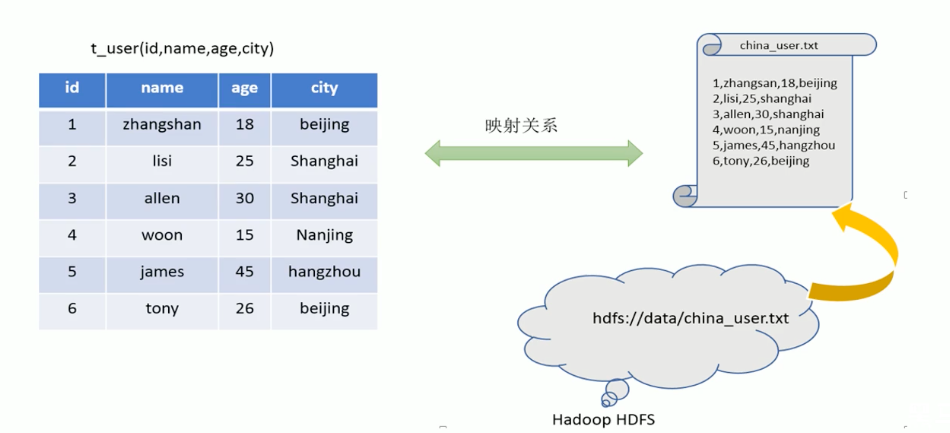

具体来看，要记录的元数据信息包括：

- 表对应着哪个文件（位置信息）
- 表的列对应着文件哪一个字段（顺序信息）
- 文件字段之间的分隔符是什么

**SQL语法解析、编译**

用户写完sql之后，hive需要针对sql进行语法校验，并且根据记录的元数据信息解读sql背后的含义，制定执行计划。并且把执行计划转换成MapReduce程序来执行，把执行的结果封装返回给用户。

> **结论：**
>
> **Hive能将数据文件映射成为一张表，这个映射是指什么?**
>
> 答：文件和表之间的对应关系
>
> **Hive软件本身到底承担了什么功能职责？**
>
> 答：SQL语法解析编译成为MapReduce


#### 最终效果

基于上述分析，最终要想模拟实现的Hive的功能，大致需要下图所示组件参与其中。

从中可以感受一下Hive承担了什么职责，当然，也可以把这个理解为Hive的架构图。

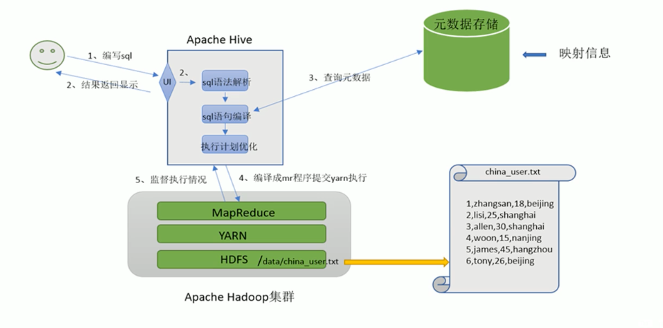


### Hive 架构

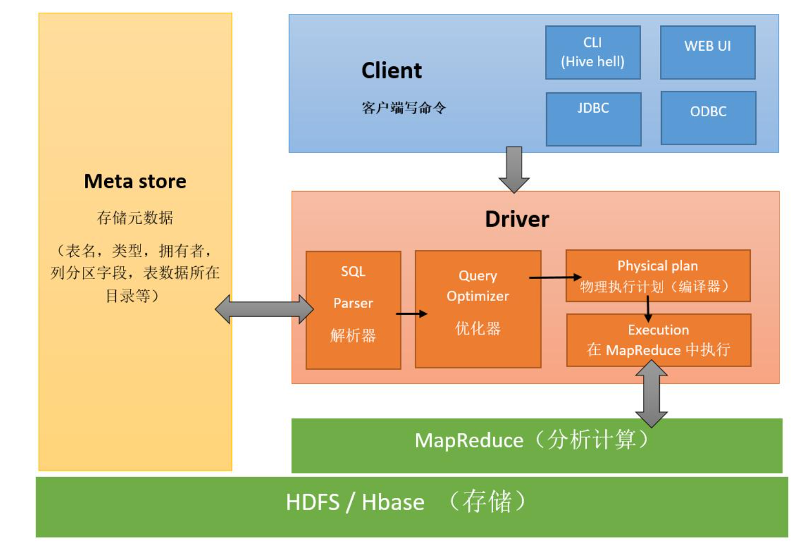

- **用户接口**： 包括CLI、JDBC/ODBC。其中，CLI(command line interface)为shell命令行；JDBC/ODBC是Hive的JAVA实现，与传统数据库JDBC类似； 
- **元数据存储**： 通常是存储在关系数据库如mysql/derby中。Hive 将元数据存储在数据库中。Hive中的元数据包括表的名字，表的列和分区及其属性，表的属性（是否为外部表等），表的数据所在目录等。 
- **Driver 驱动程序，包括解释器、编译器、优化器、执行器**：完成HQL 查询语句从词法分析、语法分析、编译、优化以及查询计划的生成。生成的查询计划存储在HDFS 中，并在随后有MapReduce 调用执行。 
- **执行引擎**：Hive本身并不直接处理数据文件。而是通过执行引擎处理。3.x Hive支持MapReduce、Tez、Spark3种执行引擎。

**工作原理**：

1.  用户创建数据库、表信息，存储在hive的元数据库中；

2.  向表中加载数据，元数据记录hdfs文件路径与表之间的映射关系；

3.  执行查询语句，首先经过解析器、编译器、优化器、执行器，将指令翻译成MapReduce，提交到Yarn上执行，最后将执行返回的结果输出到用户交互接口。

   

### Hive 数据模型

#### Data Model概念

数据模型：用来描述数据、组织数据和对数据进行操作，是对现实世界数据特征的描述。

Hive的数据模型**类似于RDBMS库表结构**，此外还有**自己特有模型**。

Hive中的数据可以在粒度级别上分为三类：

- Table 表
- Partition 分区
- Bucket 分桶

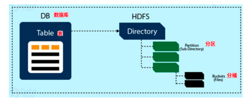

#### Databases 数据库

Hive作为一个数据仓库，在结构上积极向传统数据库看齐，也分数据库（Schema），每个数据库下面有各自的表组成。默认**数据库default**。

Hive的数据都是**存储在HDFS**上的，默认有一个根目录，在 `hive-site.xml` 中，由参数 `hive.metastore.warehouse.dir` 指定。默认值为`/user/hive/warehouse`。

因此，Hive中的数据库在HDFS上的存储路径为：

```
${hive.metastore.warehouse.dir}/databasename.db
```

比如，名为itcast的数据库存储路径为：

```
/user/hive/warehouse/itcast.db
```

#### Table 表

Hive表与关系数据库中的表相同。Hive中的表所对应的数据通常是存储在HDFS中，而表相关的元数据是存储在RDBMS中。

Hive中的表的数据在HDFS上的存储路径为：

```
${hive.metastore.warehouse.dir}/databasename.db/tablename
```

比如,itcast的数据库下t_user表存储路径为：

```
/user/hive/warehouse/itcast.db/t_user
```

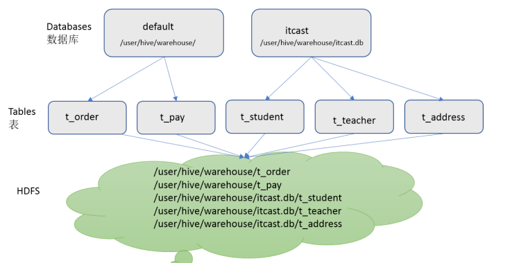

#### Partitions 分区

Partition分区是hive的一种优化手段表。分区是指**根据分区列（例如“日期day”）的值将表划分为不同分区**。这样可以更快地对指定分区数据进行查询。

分区在存储层面上的表现是:table表目录下以子文件夹形式存在。

**一个文件夹表示一个分区**。子文件命名标准：**分区列=分区值**

Hive还支持分区下继续创建分区，所谓的多重分区。关于分区表的使用和详细介绍，后面模块会单独展开。

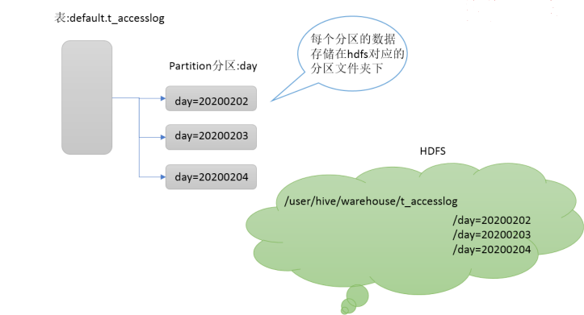

#### Buckets 分桶

Bucket分桶表是hive的一种优化手段表。**分桶是指根据表中字段（例如“编号ID”）的值,经过hash计算规则将数据文件划分成指定的若干个小文件**。

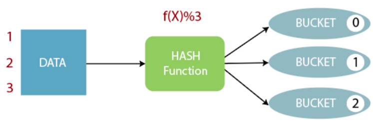

分桶规则：**hashfunc(ID) % 桶个数**，余数相同的分到同一个文件。

分桶的好处是可以优化join查询和方便抽样查询。Bucket分桶表在hdfs中表现为同一个表目录下数据根据hash散列之后变成多个文件。关于桶表以及分桶操作，后面模块会单独展开详细讲解。

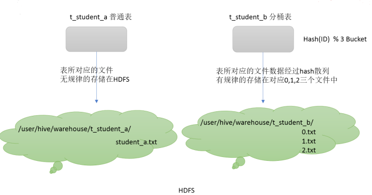


### **Hive **与传统数据库对比 

> Hive 是要取代 MySQL吗？

Hive虽然具有RDBMS数据库的外表，包括数据模型、SQL语法都十分相似，但应用场景却完全不同。Hive只适合用来做海量数据的**离线分析**。Hive的定位是**数据仓库**，面向分析的**OLAP系统**。

因此时刻告诉自己，**Hive不是大型数据库，也不是要取代Mysql承担业务数据处理**。

更直观的对比请看下面这幅图：

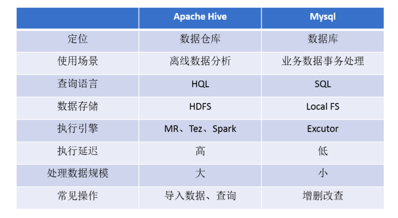


### Hive 元数据

#### 什么是元数据

元数据（Metadata），又称中介数据、中继数据，为**描述数据的数据**（data about data），主要是描述数据属性（property）的信息，用来支持如指示存储位置、历史数据、资源查找、文件记录等功能。

#### Hive Metadata

- Hive Metadata即Hive的元数据。
- 包含用Hive创建的database、table、表的位置、类型、属性，字段顺序类型等元信息。
- **元数据存储在关系型数据库中**。如hive内置的Derby、或者第三方如MySQL等。

#### Hive Metastore

- Metastore即**元数据服务**。Metastore服务的作用是**管理metadata元数据**，对外暴露服务地址，让各种客户端通过连接metastore服务，由metastore再去连接MySQL数据库来存取元数据。
- 有了metastore服务，就可以有多个客户端同时连接，而且这些客户端不需要知道MySQL数据库的用户名和密码，只需要连接metastore 服务即可。某种程度上也保证了hive元数据的安全。

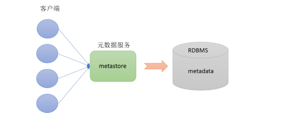

#### Metastore配置方式

metastore服务配置有3种模式：**内嵌模式、本地模式、远程模式。**

区分3种配置方式的关键是弄清楚两个问题：

- Metastore服务是否需要单独配置、单独启动？
- Metadata是存储在内置的derby中，还是第三方RDBMS,比如MySQL。

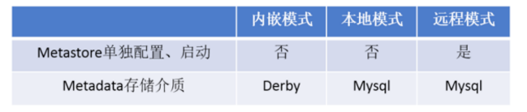

> 企业推荐模式--远程模式部署

##### 内嵌模式

内嵌模式（Embedded Metastore）是metastore**默认部署模式**。

此种模式下，元数据存储在**内置的Derby数据库**，并且Derby数据库和metastore服务都嵌入在主HiveServer进程中，当启动HiveServer进程时，Derby和metastore都会启动。不需要额外起Metastore服务。

但是一次只能支持一个活动用户，适用于**测试体验**，**不适用于生产环境**。

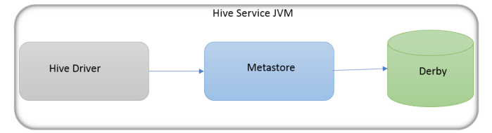

##### 本地模式

本地模式（Local Metastore）下，**Metastore服务与主HiveServer进程在同一进程**中运行，但是存储元数据的数据库在单独的进程中运行，并且可以在单独的主机上。metastore服务将通过JDBC与metastore数据库进行通信。

本地模式采用**外部数据库**来存储元数据，推荐使用MySQL。

hive根据`hive.metastore.uris` 参数值来判断，如果为空，则为本地模式。

缺点是：每启动一次hive服务，都内置启动了一个metastore。

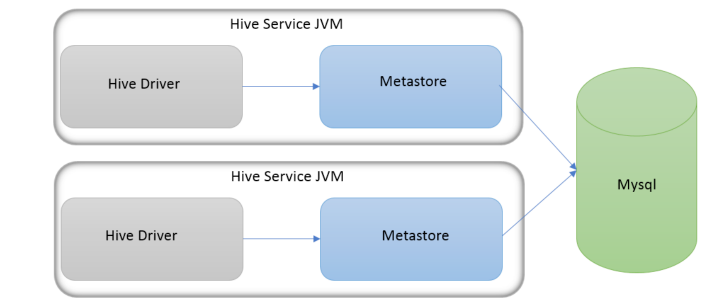

##### 远程模式

远程模式（Remote Metastore）下，**Metastore服务在其自己的单独JVM上运行**，而不在HiveServer的JVM中运行。如果其他进程希望与Metastore服务器通信，则可以使用Thrift Network API进行通信。

远程模式下，需要配置hive.metastore.uris 参数来指定metastore服务运行的机器ip和端口，并且**需要单独手动启动metastore服务**。元数据也采用外部数据库来存储元数据，推荐使用MySQL。

在生产环境中，建议用远程模式来配置Hive Metastore。在这种情况下，其他依赖hive的软件都可以通过Metastore访问hive。由于还可以完全屏蔽数据库层，因此这也带来了更好的可管理性/安全性。

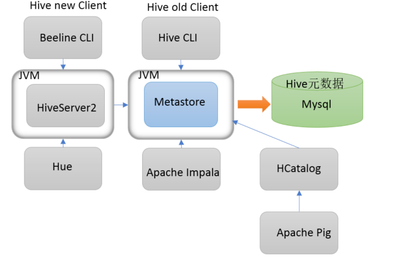


## Hive 安装和环境配置

1. 手动安装：自行Google
2. CDH安装：自行Google

### Hive 的三种连接方式

1. 第一种交互方式 **bin/hive**

   ```shell
   #/bin/hive
   ```

   通过hive shell来操作hive，但是至多只能存在一个hive shell，启动第二个会被阻塞，也就是说hive shell不支持并发操作。

2. 第二种交互方式 **HiveServer2** 

   基于JDBC等协议：启动hiveserver2，通过jdbc协议可以访问hive，hiveserver2支持高并发。

   简而言之，hiveserver2是Hive启动了一个server，客户端可以使用JDBC协议，通过IP+ Port的方式对其进行访问，达到并发访问的目的。

   ```shell
   #启动服务端（前台启动命令如下）
   #/bin/hive --service hiveserver2
   ```
   在装了相同版本Hive的其他主机(启动hiveserver2的主机也可以)上启动beeline，可以连接到Hive的server上。执行命令：

   ```shell
   #/bin/beeline -u jdbc:hive2://node-00:10000
   ```

3. 第三种交互方式：使用**sql**语句或者**sql**脚本进行交互

   不进入hive的客户端直接执行hive的hql语句 

   ```shell
   #/bin/hive -e "create database if not exists mytest;"
   ```

   或者我们可以将我们的hql语句写成一个sql脚本然后执行

   ```shell
   #vim hive.sql
   ```

   ```sql
   create database if not exists mytest; 
   use mytest; 
   create table stu(id int,name string);
   ```

   通过hive -f 来执行我们的sql脚本

   ```shell
   #/bin/hive -f hive.sql
   ```


## **Hive** 数据库操作
### 创建数据库 

```sql
create database if not exists myhive; 
use myhive;
```
hive的表存放位置模式是由hive-site.xml当中的一个属性指定的

```xml
  <property>
	<name>hive.metastore.warehouse.dir</name
    <value>/user/hive/warehouse</value>
  </property>
```

### 创建数据库并指定位置

```sql
create database myhive2 location '/myhive2'
```

### 修改数据库 

可以使用alter database 命令来修改数据库的一些属性。但是数据库的元数据信息是不可更改的，包括

数据库的名称以及数据库所在的位置 

```sql
alter database myhive2 set dbproperties('createtime'='20180611');
```

### 查看数据库详细信息 

查看数据库基本信息

```sql
desc database myhive2;
```

查看数据库更多详细信息

```sql
desc database extended myhive2;
```

### 删除数据库 

删除一个空数据库，如果数据库下面有数据表，那么就会报错

```sql
drop database myhive2;
```

强制删除数据库，包含数据库下面的表一起删除

```sql
drop database myhive cascade; # 不要执行了
```


## Hive表操作


### Hive表创建语法 

```sql
create [external] table [if not exists] table_name (
    col_name data_type [comment '字段描述信息']
    col_name data_type [comment '字段描述信息'])
    [comment '表的描述信息']
    [location '指定表的路径']
    [partitioned by (col_name data_type,...)]
    [clustered by (col_name,col_name,...)]
    [sorted by (col_name [asc|desc],...) into num_buckets buckets]
    [row format row_format]
    [location location_path]
```

说明：

1. CREATE TABLE 创建一个指定名字的表。如果相同名字的表已经存在，则抛出异常；用户可以用IF NOT EXISTS 选项来忽略这个异常。 

2. EXTERNAL 关键字可以让用户创建一个外部表，在建表的同时指定一个指向实际数据的路径 （LOCATION），Hive 创建内部表时，会将数据移动到数据仓库指向的路径；若创建外部表，仅记录数据所在的路径，不对数据的位置做任何改变。在删除表的时候，内部表的元数据和数据会被一起删除，而外部表只删除元数据，不删除数据。 

3. LIKE 允许用户复制现有的表结构，但是不复制数据。 

4. ROW FORMAT DELIMITED [FIELDS TERMINATED BY char] [COLLECTION ITEMS TERMINATED BY char] [MAP KEYS TERMINATED BY char] [LINES TERMINATED BY char] | SERDE serde_name [WITH SERDEPROPERTIES (property_name=property_value, property_name=property_value, ...)] 

   用户在建表的时候可以自定义 SerDe 或者使用自带的 SerDe。如果没有指定 ROW FORMAT 或者 ROW FORMAT DELIMITED，将会使用自带的 SerDe。在建表的时候，用户还需要为表指定列，用户在指定表的列的同时也会指定自定义的 SerDe，Hive通过 SerDe 确定表的具体的列的数据。 

   hive 默认的字段分隔符为ascii码的控制符\001,建表的时候用fields terminated by '\001',如果要测试的话，造数据在vi 打开文件里面，用ctrl+v然后再ctrl+a可以输入这个控制符\001。按顺序，\002的输入方式为ctrl+v,ctrl+b。以此类推。

5. STORED AS 

   SEQUENCEFILE|TEXTFILE|RCFILE 

   如果文件数据是纯文本，可以使用 STORED AS TEXTFILE。如果数据需要压缩，使用 STORED AS SEQUENCEFILE。 

6. PARTITIONED BY

   分区，一个表可以拥有一个或者多个分区，每个分区以文件夹的形式单独存在表文件夹的目录下。

7. CLUSTERED BY

   对于每一个表（table）或者分区， Hive可以进一步组织成桶，也就是说桶是更为细粒度的数据范 

   围划分。Hive也是 针对某一列进行桶的组织。Hive采用对列值哈希，然后除以桶的个数求余的方 

   式决定该条记录存放在哪个桶当中。 

   把表（或者分区）组织成桶（Bucket）有两个理由： 

   1. 获得更高的查询处理效率。桶为表加上了额外的结构，Hive 在处理有些查询时能利用这个结构。具体而言，连接两个在（包含连接列的）相同列上划分了桶的表，可以使用 Map 端连接 （Map-side join）高效的实现。比如JOIN操作。对于JOIN操作两个表有一个相同的列，如果对这两个表都进行了桶操作。那么将保存相同列值的桶进行JOIN操作就可以，可以大大较少JOIN的数据量。 

   2. 使取样（sampling）更高效。在处理大规模数据集时，在开发和修改查询的阶段，如果能在数据集的一小部分数据上试运行查询，会带来很多方便。 

### 管理表的操作

#### 建表初体验

```sql
use myhive; 
create table stu(id int,name string); insert into stu values (1,"zhangsan"); 
select * from stu;
```

**Hive**建表时候的字段类型

https://cwiki.apache.org/conflfluence/display/Hive/LanguageManual+Types

基本数据类型

| Hive数据类型 | Java数据类型 | 长度   | 例子         |
| ------------ | --------  | ------- |--------- |
| TINYINT      | byte         | 1byte有符号整数                                      | 20                                   |
| SMALINT      | short        | 2byte有符号整数                                      | 20                                   |
| INT          | int          | 4byte有符号整数                                      | 20                                   |
| BIGINT       | long         | 8byte有符号整数                                      | 20                                   |
| BOOLEAN      | boolean      | 布尔类型，true或者false                              | TRUE FALSE                           |
| FLOAT        | float        | 单精度浮点数                                         | 3.14159                              |
| DOUBLE       | double       | 双精度浮点数                                         | 3.14159                              |
| STRING       | string       | 字符系列。可以指定字符集。可以使用单引号或者双引号。 | ‘now is the time’ “for all good men” |
| TIMESTAMP    |              | 时间类型                                             |                                      |
| BINARY       |              | 字节数组                                             |                                      |

【注】：对于Hive的string类型就相当于数据库中的varchar类型，该类型是一个可变的字符串，但是它不能声明存储字符长度的限制，理论上它可以存储2GB的字符数。

集合数据类型

| 数据类型 | 描述                                                         | 语法示例 |
| -------- | ------------------------------------------------------------ | -------- |
| STRUCT   | 和c语言中的struct类似，都可以通过“点”符号访问元素内容。例如，如果某个列的数据类型是STRUCT{first STRING, last STRING},那么第1个元素可以通过字段.first来引用。 | struct() |
| MAP      | MAP是一组键-值对元组集合，使用数组表示法可以访问数据。例如，如果某个列的数据类型是MAP，其中键->值对是’first’->’John’和’last’->’Doe’，那么可以通过字段名[‘last’]获取最后一个元素 | map()    |
| ARRAY    | 数组是一组具有相同类型和名称的变量的集合。这些变量称为数组的元素，每个数组元素都有一个编号，编号从零开始。例如，数组值为[‘John’, ‘Doe’]，那么第2个元素可以通过数组名[1]进行引用。 | Array()  |

【注】：Array、Map和Java中的Array、Map类似；Struct和C语言中的Struct类似，它封装了一个命名字段集合，复杂数据类型允许任意层次 的嵌套。

【案例】：

假设某表有如下一行，我们用JSON格式来表示其数据结构。在Hive下访问的格式为

```json
{
    "name": "songsong",
    "friends": ["bingbing" , "lili"] ,       //列表Array,
    "children": {                      //键值Map,
        "xiao song": 18 ,
        "xiaoxiao song": 19
    }
    "address": {                      //结构Struct,
        "street": "hui long guan" ,
        "city": "beijing"
    }
}
```

#### 创建表并指定字段之间的分隔符 

```sql
create table if not exists stu2(id int ,name string) 
row format delimited fields terminated by '\t'
```

#### 根据查询结果创建表 

```sql
create table stu3 as select * from stu2; # 通过复制表结构和表内容创建新表
```

#### 根据已经存在的表结构创建表 

```sql
create table stu4 like stu2;
```

#### 查询表的类型

```sql
desc formatted stu2;
```

### 外部表的操作

#### 外部表说明

外部表因为是指定其他的hdfs路径的数据加载到表当中来，所以hive表会认为自己不完全独占这份数据，所以删除hive表的时候，数据仍然存放在hdfs当中，不会删掉

#### 管理表和外部表的使用场景 

每天将收集到的网站日志定期流入HDFS文本文件。在外部表（原始日志表）的基础上做大量的统计分析，用到的中间表、结果表使用内部表存储，数据通过SELECT+INSERT进入内部表

#### 操作案例

分别创建老师与学生表外部表，并向表中加载数据

- 创建老师表

  ```sql
  create external table teacher (t_id string,t_name string) row format delimited fields terminated by '\t'
  ```

- 创建学生表 

  ```sql
  create external table student (s_id string,s_name string,s_birth string , s_sex string ) row format delimited fields terminated by '\t'
  ```

- 加载数据(本地)

  ```sql
  load data local inpath '/export/servers/hivedatas/student.csv' into table student;
  ```

  student.csv

  ```
  01	赵雷	1990-01-01	男
  02	钱电	1990-12-21	男
  03	孙风	1990-05-20	男
  04	李云	1990-08-06	男
  05	周梅	1991-12-01	女
  06	吴兰	1992-03-01	女
  07	郑竹	1989-07-01	女
  08	王菊	1990-01-20	女
  ```

- 加载数据并覆盖已有数据

  ```sql
  load data local inpath '/export/servers/hivedatas/student.csv' overwrite into table student;
  ```

  注：执行完load 后，本地 的/hivedatas/teacher.csv文件会被复制到hive数据库目录中。

- 从**hdfs**文件系统向表中加载数据（需要提前将数据上传到**hdfs**文件系统）

  ```sql
  #cd /export/servers/hivedatas 
  #hdfs dfs -mkdir -p /hivedatas 
  #hdfs dfs -put techer.csv /hivedatas/ 
  #hive> load data inpath '/hivedatas/techer.csv' into table teacher; 
  ```

  注：执行完load 后，hdfs 的/hivedatas/teacher.csv文件会被移动（剪切）到hive数据库目录中。

  teacher.csv

  ```
  01	张三
  02	李四
  03	王五
  ```

### 分区表

在大数据中，最常用的一种思想就是分治，我们可以把大的文件切割划分成一个个的小的文件，这样每次操作一个小的文件就会很容易了，同样的道理，在hive当中也是支持这种思想的，就是我们可以把大的数据，按照每天，或者每小时进行切分成一个个的小的文件，这样去操作小的文件就会容易得多了 。

#### 创建分区表语法

```sql
create table score(s_id string,c_id string, s_score int) partitioned by (month string) row format delimited fields terminated by '\t'
```

#### 创建一个表带多个分区 

```sql
create table score2 (s_id string,c_id string, s_score int) partitioned by (year string,month string,day string) row format delimited fields terminated by '\t'
```

#### 加载数据到分区表中 

```sql
load data local inpath '/export/servers/hivedatas/score.csv' into table score partition (month='202003');
```

注：上面操作会将表文件数据加载到hive数据库目录 `month=202003`文件夹中

score.csv

```
01	01	80
01	02	90
01	03	99
02	01	70
02	02	60
02	03	80
03	01	80
03	02	80
03	03	80
04	01	50
04	02	30
04	03	20
05	01	76
05	02	87
06	01	31
06	03	34
07	02	89
07	03	98
```

#### 加载数据到多分区表中

```sql
load data local inpath '/export/servers/hivedatas/score.csv' into table score2 partition(year='2020',month='03',day='01');
```

注：上面操作会将表文件数据加载  `/year=2020/month=03/day=01 `文件夹中

多分区表联合查询(使用 union all ) 

#### 多分区表联合查询(使用 union all ) 

```sql
select * from score where month = '202002' union all select * from score where month = '202003';
```

#### 查看分区 

```sql
show partitions score;
```

#### 添加一个分区 

``` sql
alter table score add partition(month='202003'); 
```

#### 删除分区 

```sql
alter table score drop partition(month = '202003')
```


### 分桶表 

将数据按照指定的字段进行分成多个桶中去，说白了就是将数据按照字段进行划分，可以将数据按照字段划分到多个文件当中去 。

#### 开启 Hive 的分桶功能 

```shell
set hive.enforce.bucketing=true; 
```

#### 设置 Reduce 个数

```shell
set mapreduce.job.reduces=3; # 默认-1：不限制
```

#### 创建桶表 

```sql
create table course (c_id string,c_name string,t_id string) clustered by(c_id) into 3 buckets row format delimited fields terminated by '\t'
```

桶表的数据加载，由于通标的数据加载通过 hdfs dfs -put 文件或者通过 load data 均不好使，只能通过 insert overwrite 

创建普通表，并通过insert overwrite的方式将普通表的数据通过查询的方式加载到桶表当中去 

创建普通表（中间表）

```sql
create table course_common (c_id string,c_name string,t_id string) row format delimited fields terminated by '\t'
```

普通表中加载数据

```sql
load data local inpath '/export/servers/hivedatas/course.csv' into table course_common;
```

course.csv

```
01	语文	02
02	数学	01
03	英语	03
```

通过insert overwrite给桶表中加载数据

```sql
insert overwrite table course select * from course_common cluster by(c_id);
```

注：最终在hive数据库目录中文件会被分割为三份

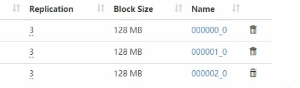

### 修改表 

#### 重命名

基本语法： 

```sql
alter table old_table_name rename to new_table_name; 
```

把表score4修改成score5 

```sql
alter table score4 rename to score5
```

#### 增加**/**修改列信息 

- 查询表结构

  ```sql
  desc score5; 
  ```

- 添加列

  ```sql
  alter table score5 add columns (mycol string, mysco string);
  ```

- 更新列 

  ```sql
  alter table score5 change column mysco mysconew int;
  ```

  

### 删除表 

```sql
drop table score5;
```


### **hive **表中加载数据

#### 直接向分区表中插入数据

```sql
create table score3 like score;
insert into table score3 partition(month ='202003') values ('001','002','100');
```

#### 通过查询插入数据

通过load方式加载数据

```sql
load data local inpath '/export/servers/hivedatas/score.csv' overwrite into table score partition(month ='202003');
```

通过查询方式加载数据

```sql
create table score4 like score; insert overwrite table score4 partition(month = '202003') select s_id,c_id,s_score from score;
```


## **Hive** 查询语法 

### **SELECT** 

```sql
SELECT [ALL | DISTINCT] select_expr, select_expr, ... 
    FROM table_reference 
    [WHERE where_condition] 
    [GROUP BY col_list [HAVING condition]] 
    [CLUSTER BY col_list | [DISTRIBUTE BY col_list] 
    [SORT BY| ORDER BY col_list] 
    LIMIT number]
```

1. order by 会对输入做**全局排序**，因此只有一个reducer，会导致当输入规模较大时，需要较长的计算时间。 

2. sort by **不是全局排序**，其在数据进入reducer前完成排序。因此，如果用sort by进行排序，并且设置 mapred.reduce.tasks>1，则sort by只保证每个reducer的输出有序，不保证全局有序。 

3. distribute by(字段)根据指定的字段将数据分到不同的reducer，且分发算法是hash散列。 

4. cluster by(字段) 除了具有distribute by的功能外，还会对该字段进行排序。 ---> distribute by + sort by 因此，如果分桶和sort字段是同一个时，此时， cluster by = distribute by + sort b


分桶表的作用：最大的作用是用来提高join操作的效率； 

思考这个问题： select a.id,a.name,b.addr from a join b on a.id = b.id; 

如果a表和b表已经是分桶表，而且分桶的字段是id字段 做这个join操作时，还需要全表做笛卡尔积吗? 


### 查询语法

#### 全表查询 

```sql
select * from score; 
```

#### 选择特定列 

```sql
select s_id ,c_id from score;
```

#### 列别名 

1）重命名一个列。 

2）便于计算。 

3）紧跟列名，也可以在列名和别名之间加入关键字‘AS

```sql
select s_id as myid ,c_id from score;
```

### 常用函数 

#### 求总行数（count）

```sql
select count(1) from score; 
```

#### 求分数的最大值（max） 

```sql
select max(s_score) from score; 
```

#### 求分数的最小值（min） 

```sql
select min(s_score) from score; 
```

#### 求分数的总和（sum） 

```sql
select sum(s_score) from score; 
```

#### 求分数的平均值（avg） 

```sql
select avg(s_score) from score; 
```


### LIMIT 语句 

典型的查询会返回多行数据。LIMIT子句用于限制返回的行数。 

```sql
select * from score limit 3;
```


### WHERE 语句 

1. 使用WHERE 子句，将不满足条件的行过滤掉。 

2. WHERE 子句紧随 FROM 子句。 

3. 案例实操 

   查询出分数大于60的数据

   ```sql
   select * from score where s_score > 60;
   ```

#### 关系运算符

| 运算符        | 操作         | 描述                                                         |
| :------------ | :----------- | :----------------------------------------------------------- |
| A = B         | 所有基本类型 | 如果表达A等于表达B，结果TRUE ，否则FALSE。                   |
| A != B        | 所有基本类型 | 如果A不等于表达式B表达返回TRUE ，否则FALSE。                 |
| A < B         | 所有基本类型 | TRUE，如果表达式A小于表达式B，否则FALSE。                    |
| A <= B        | 所有基本类型 | TRUE，如果表达式A小于或等于表达式B，否则FALSE。              |
| A > B         | 所有基本类型 | TRUE，如果表达式A大于表达式B，否则FALSE。                    |
| A >= B        | 所有基本类型 | TRUE，如果表达式A大于或等于表达式B，否则FALSE。              |
| A IS NULL     | 所有类型     | TRUE，如果表达式的计算结果为NULL，否则FALSE。                |
| A IS NOT NULL | 所有类型     | FALSE，如果表达式A的计算结果为NULL，否则TRUE。               |
| A LIKE B      | 字符串       | TRUE，如果字符串模式A匹配到B，否则FALSE。                    |
| A RLIKE B     | 字符串       | NULL，如果A或B为NULL；TRUE，如果A任何子字符串匹配Java正则表达式B；否则FALSE。 |
| A REGEXP B    | 字符串       | 等同于RLIKE.                                                 |

- 查询分数等于80的所有的数据

  ```sql
  select * from score where s_score = 80; 
  ```

- 查询分数在80到100的所有数据

  ```sql
  select * from score where s_score between 80 and 100; 
  ```

- 查询成绩为空的所有数据

  ```sql
  select * from score where s_score is null;
  ```

- 查询成绩是80和90的数据

  ```sql
  select * from score where s_score in(80,90);
  ```

#### **LIKE** 和 **RLIKE** 

- 使用LIKE运算选择类似的值 

- 选择条件可以包含字符或数字:

  % 代表零个或多个字符(任意个字符)。 

  _ 代表一个字符。 

- RLIKE 子句是Hive中这个功能的一个扩展，其可以通过Java的正则表达式这个更强大的语言来指定匹配条件。

案例实操 :

1. 查找以8开头的所有成绩 

   ```sql
   select * from score where s_score like '8%'; 
   ```

2. 查找第二个数值为9的所有成绩数据

   ```sql
   select * from score where s_score like '_9%'; 
   ```

3. 查找成绩中含9的所有成绩数据

   ```sql
   select * from score where s_score rlike '[9]'; #等价于like '%9%'
   ```

   

#### 逻辑运算符

| 运算符   | 操作    | 描述                                      |
| :------- | :------ | :---------------------------------------- |
| A AND B  | boolean | TRUE，如果A和B都是TRUE，否则FALSE。       |
| A && B   | boolean | 类似于 A AND B.                           |
| A OR B   | boolean | TRUE，如果A或B或两者都是TRUE，否则FALSE。 |
| A \|\| B | boolean | 类似于 A OR B.                            |
| NOT A    | boolean | TRUE，如果A是FALSE，否则FALSE。           |
| !A       | boolean | 类似于 NOT A.                             |

- 查询成绩大于80，并且s_id是01的数据

  ```sql
  select * from score where s_score >80 and s_id = '01'; 
  ```

- 查询成绩大于80，或者s_id 是01的数 

  ```sql
  select * from score where s_score > 80 or s_id = '01'; 
  ```

- 查询s_id 不是 01和02的学生 

  ```sql
  select * from score where s_id not in ('01','02')
  ```

### 分组 

#### **GROUP BY** 语句

GROUP BY语句通常会和聚合函数一起使用，按照一个或者多个列队结果进行分组，然后对每个组执行聚合操作。 

案例实操： 

- 计算每个学生的平均分数 

  ```sql
  select s_id ,avg(s_score) from score group by s_id; 
  ```

- 计算每个学生最高成绩 

  ```sql
  select s_id ,max(s_score) from score group by s_id; 
  ```

#### **HAVING** 语句 

- having 与 where不同点 

  1. where针对表中的列发挥作用，查询数据；having针对查询结果中的列发挥作用，筛选数据。 

  2. where后面不能写分组函数，而having后面可以使用分组函数。 

  3. having只用于group by分组统计语句。 

- 案例实操：

  - 求每个学生的平均分数 

    ```sql
    select s_id ,avg(s_score) from score group by s_id;
    ```

  - 求每个学生平均分数大于85的人 

    ```sql
    select s_id ,avg(s_score) avgscore from score group by s_id having avgscore > 85;
    ```

    

### **JOIN** 语句 

#### 等值 **JOIN** 

Hive支持通常的SQL JOIN语句，但是只支持等值连接，不支持非等值连接。 

案例操作: 查询分数对应的姓名 

```sql
SELECT s.s_id,s.s_score,stu.s_name,stu.s_birth FROM score s LEFT JOIN student stu ON s.s_id = stu.s_id;
```

#### 内连接 

内连接：只有进行连接的两个表中都存在与连接条件相匹配的数据才会被保留下来。 

```sql
select * from techer t inner join course c on t.t_id = c.t_id;
```

#### 左外连接

左外连接：JOIN操作符左边表中符合WHERE子句的所有记录将会被返回。 查询老师对应的课程 

```sql
select * from techer t left join course c on t.t_id = c.t_id;
```

#### 右外连接 

右外连接：JOIN操作符右边表中符合WHERE子句的所有记录将会被返回。 

````sql
select * from teacher t right join course c on t.t_id = c.t_id; 
````

#### 多表连接 

注意：连接 n个表，至少需要n-1个连接条件。例如：连接三个表，至少需要两个连接条件。 

多表连接查询，查询老师对应的课程，以及对应的分数，对应的学生 

```sql
select * from teacher t 
left join course c on t.t_id = c.t_id 
left join score s on s.c_id = c.c_id 
left join student stu on s.s_id = stu.s_id;
```

大多数情况下，Hive会对每对JOIN连接对象启动一个MapReduce任务。本例中会首先启动一个MapReduce job对表 techer和表course进行连接操作，然后会再启动一个MapReduce job将第一个MapReduce job的输出和score;进行连接操作。 


### 排序 

#### 全局排序 

Order By：全局排序，只能有一个reduce 

1. 使用 ORDER BY 子句排序 

   ASC（ascend）: 升序（默认） 

   DESC（descend）: 降序 

2. ORDER BY 子句在SELECT语句的结尾。 

案例实操 

1. 查询学生的成绩，并按照分数降序排列 

   ```sql
   SELECT * FROM student s LEFT JOIN score sco ON s.s_id = sco.s_id ORDER BY sco.s_score DESC; 
   ```

2. 查询学生的成绩，并按照分数升序排列 

   ```sql
   SELECT * FROM student s LEFT JOIN score sco ON s.s_id = sco.s_id ORDER BY sco.s_score asc; 
   ```

#### 按照别名排序 

按照分数的平均值排序

```sql
select s_id ,avg(s_score) avg from score group by s_id order by avg;
```

#### 多个列排序

按照学生id和平均成绩进行排序 

```sql
select s_id ,avg(s_score) avg from score group by s_id order by s_id,avg; 
```

#### 每个**MapReduce**内部排序（**Sort By**）局部排序 

Sort By：每个MapReduce内部进行排序，对全局结果集来说不是排序。 

1. 设置reduce个数 

   ```shell
   #hive> set mapreduce.job.reduces=3; 
   ```

2. 查看设置reduce个数 

   ``` shell
   #hive> set mapreduce.job.reduces;
   ```

3. 查询成绩按照成绩降序排列 

   ```sql
   select * from score sort by s_score; 
   ```

4. 将查询结果导入到文件中（按照成绩降序排列） 

   ```sql
   insert overwrite local directory '/export/servers/hivedatas/sort' select * from score sort by s_score;
   ```


#### 分区排序（**DISTRIBUTE BY**）

Distribute By：类似MR中partition，进行分区，结合sort by使用。 

注意，Hive要求DISTRIBUTE BY语句要写在SORT BY语句之前。 

对于distribute by进行测试，一定要分配多reduce进行处理，否则无法看到distribute by的效果。 

案例实操：先按照学生id进行分区，再按照学生成绩进行排序。 

1. 设置reduce的个数，将我们对应的s_id划分到对应的reduce当中去 

   ```shell
   #hive> set mapreduce.job.reduces=7; 
   ```

2. 通过distribute by 进行数据的分区 

   ```sql
   insert overwrite local directory '/export/servers/hivedatas/sort' select * from score distribute by s_id sort by s_score;
   ```

   


#### 分桶排序（**CLUSTER BY** ）

当distribute by和sort by字段相同时，可以使用cluster by方式。cluster by除了具有distribute by的功能外还兼具sort by的功能。但是排序只能是倒序排序，不能指定排序规则为ASC 或者DESC。 

以下两种写法等价 

```sql
select * from score cluster by s_id; 
select * from score distribute by s_id sort by s_id; 
```


## **Hive** 函数

### 内置函数

内容较多，见《Hive官方文档》 https://cwiki.apache.org/confluence/display/Hive/LanguageManual+UDF 

#### 查看系统自带的函数 

```shell
#hive> show functions; 
```

#### 显示自带的函数的用法 

```shell
#hive> desc function upper; 
```

#### 详细显示自带的函数的用法 

```shell
#hive> desc function extended upper; 
```

#### 常用内置函数 

- 字符串连接函数： concat 

  ```sql
  select concat('abc','def’,'gh'); 
  ```

- 带分隔符字符串连接函数： concat_ws 

  ```sql
  select concat_ws(',','abc','def','gh');
  ```

-  cast类型转换

  ```sql
  select cast(1.5 as int);
  ```

- get_json_object(json 解析函数，用来处理json，必须是json格式) 

  ```sql
  select get_json_object('{"name":"jack","age":"20"}','$.name');
  ```

-  URL解析函数 

  ```sql
  select parse_url('http://facebook.com/path1/p.php?k1=v1&k2=v2#Ref1', 'HOST'); 
  #结果：facebook.com
  ```

  ```sql
  select parse_url('http://facebook.com/path1/p.php?k1=v1&k2=v2#Ref1', 'PATH'); 
  #结果：/path1/p.php
  ```

  ```sql
  select parse_url('http://facebook.com/path1/p.php?k1=v1&k2=v2#Ref1', 'QUERY'); 
  #结果：K1=V1&K2=V2
  ```

  ```sql
  select parse_url('http://facebook.com/path1/p.php?k1=v1&k2=v2#Ref1', 'QUERY','k1'); 
  #结果：V1
  ```

  

### 自定义函数

1. Hive 自带了一些函数，比如：max/min等，但是数量有限，自己可以通过自定义UDF来方便的扩展。 

2. 当Hive提供的内置函数无法满足你的业务处理需要时，此时就可以考虑使用用户自定义函数（UDF：user-defifined function）。 

3. 根据用户自定义函数类别分为以下三种：upper -->my_upper 
   - UDF（User-Defifined-Function）
     - 一进一出 

   - UDAF（User-Defifined Aggregation Function） 

     - 聚集函数，多进一出 

     - 类似于： count / max / min 

   - UDTF（User-Defifined Table-Generating Functions） 

     - 一进多出 

     - 如 lateral view explore() 

4. 官方文档地址 https://cwiki.apache.org/confluence/display/Hive/HivePlugins 

5. 编程步骤： 
   1）继承org.apache.hadoop.hive.ql.UDF 

   2）需要实现evaluate函数；evaluate函数支持重载； 

6. 注意事项 

   1）UDF必须要有返回类型，可以返回null，但是返回类型不能为void； 

   2）UDF中常用Text/LongWritable等类型，不推荐使用java类型； 

### **UDF** 开发实例

#### **Step 1** 创建 **Maven** 工程

```xml
    <!-- https://mvnrepository.com/artifact/org.apache.hive/hive-exec --> 
    <dependency> 
        <groupId>org.apache.hive</groupId> 
        <artifactId>hive-exec</artifactId> 
        <version>3.1.1</version> 
    </dependency> 
    <!-- https://mvnrepository.com/artifact/org.apache.hadoop/hadoop-common --> 	
    <dependency> 
        <groupId>org.apache.hadoop</groupId> 
        <artifactId>hadoop-common</artifactId> 
        <version>3.1.1</version> 
        </dependency> 
    </dependencies> 
```

#### **Step 2** 开发 **Java** 类集成 **UDF** 

```java
public class MyUDF extends UDF{ 
    public Text evaluate(final Text str){ 
        String tmp_str = str.toString(); 
        if(str != null && !tmp_str.equals("")){ 
            String str_ret = tmp_str.substring(0, 1).toUpperCase()+tmp_str.substring(1); 
            return new Text(str_ret); 
        }
        return new Text(""); 
    } 
}
```

#### **Step 3** 项目打包，并上传到**hive**的**lib**目录下

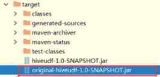

#### Step 4添加**jar**包 

重命名我们的jar包名称

```shell
#cd /export/servers/apache-hive-3.1.1-bin/lib 
#mv original-day_05_hive_udf-1.0-SNAPSHOT.jar myudf.jar 
```

hive的客户端添加我们的jar包 

```shell
#hive> add jar /export/servers/apache-hive-3.1.1-bin/lib/udf.jar;
```

#### **Step 5** 设置函数与我们的自定义函数关联 

```sql
create temporary function my_upper as 'cn.itcast.udf.ItcastUDF';
```

#### **Step 6** 使用自定义函数

```shell
select my_upper('abc');
```