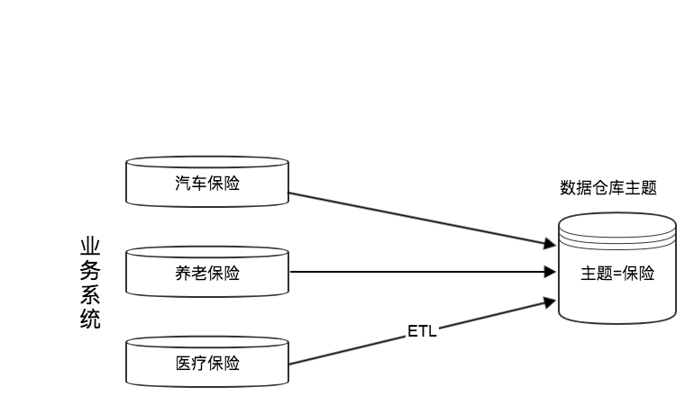

Hive

## 什么是数仓

### 基本概念

英文名称为Data Warehouse，可简写为 DW 或 DWH。数据仓库的目的是构建面向分析的集成化数据环境，为企业提供决策支持（Decision Support）。它出于分析性报告和决策支持的目的而创建。

数据仓库本身并不“生产”任何数据，同时自身也不需要“消费”任何数据，数据来源于外界，并且开放给外部应用，这也是为什么叫“仓库"，而不叫”工厂”的原因。

### 主要特征

数据仓库是面向主题的（Subject-Oriented）、集成的（Integrated）、非易失的（Non-Volatile）和时变的（Time-Variant）数据集合，用以支持管理决策。

- 面向主题

  面向主题性表示了数据仓库中数据组织的基本原则，数据仓库中的所有数据都是围绕着某一主题组织的。 

  确定主题以后，需要确定主题应该包含的数据。 

  不同的主题之间可能会出现相互重叠的信息。 

  主题在数据仓库中可以用多维数据库方式进行存储。

  主题的划分中，必须保证每一个主题的独立性。 

   

  一个主题领域的表来源于多个操作型应用（如：客户主题，来源于：定单处理；应收帐目；应付帐目；…）；

  典型的主题领域：客户；产品；交易；帐目；

  主题领域以一组相关的表来具体实现；

  相关的表通过公共的键码联系起来（如：顾客标识号Customer ID）；

  每个键码都有时间元素（从日期到日期；每月累积；单独日期…）；

  主题内数据可以存储在不同介质上（综合级，细节级，多粒度）；

- 集成性

  通过对分散、独立、异构的数据库数据进行抽取、清理、转换和汇总便得到了数据仓库的数据，这样保证了数据仓库内的数据关于整个企业的一性。 

  数据仓库中的综合数据不能从原有的数据库系统直接得到。因此在数据进入数据仓库之前，必然要经过统一与综合，这一步是数据仓库建设中最关键、最复杂的一步，所要完成的工作有： 

  1. 要统一源数据中所有矛盾之处，如字段的同名异义、异名同义、单位不统一、字长不一致，等等。 

  2. 进行数据综合和计算。数据仓库中的数据综合工作可以在从原有数据库抽取数据时生成，但许多是 在数据仓库内部生成的，即进入数据仓库以后进行综合生成的。 

  下图说明一个保险公司综合数据的简单处理过程，其中数据仓库中与“保险” 主题有关的数据来自于多个不同的操作型系统。这些系统内部数据的命名可能不同，数据格式也可能不同。把不同来源的数据存 储到数据仓库之前需要去除这些不一致。

  

  > ETL分别代表：提取extraction、转换transformation、加载load。其中提取过程表示操作型数据库搜集指定数据，转换过程表示将数据转化为指定格式并进行数据清洗保证数据质量，加载过程表示将转换过后满足指定格式的数据加载进数据仓库。数据仓库会周期不断地从源数据库提取清洗好了的数据，因此也被称为"目标系统"；

- 非易失性（不可更新性）

  操作型数据库主要服务于日常的业务操作，使得数据库需要不断地对数据实时更新，以便迅速获得当前最新数据，不至于影响正常的业务运作。在数据仓库中只要保存过去的业务数据，不需要每一笔业务都实时更新数据仓库，而是根据商业需要每隔一段时间把一批较新的数据导入数据仓库。 

  数据仓库的数据反映的是一段相当长的时间内历史数据的内容，是不同时点的数据库快照的集合，以及基于这些快照进行统计、综合和重组的导出数据。 

  数据非易失性主要是针对应用而言。数据仓库的用户对数据的操作大多是数据查询或比较复杂的挖掘，一旦数据进入数据仓库以后，一般情况下被较长时间保留。数据仓库中一般有大量的查询操作，但修改和删除操作很少。因此，数据经加工和集成进入数据仓库后是极少更新的，通常只需要定期的加载和更新。

- 时变性

  数据仓库包含各种粒度的历史数据。数据仓库中的数据可能与某个特定日期、星期、月份、季度或者年份有关。数据仓库的目的是通过分析企业过去一段时间业务的经营状况，挖掘其中隐藏的模式。虽然数据仓库的用户不能修改数据，但并不是说数据仓库的数据是永远不变的。分析的结果只能反映过去的情况，当业务变化后，挖掘出的模式会失去时效性。因此数据仓库的数据需要更新，以适应决策的需要。 

  从这个角度讲，数据仓库建设是一个项目，更是一个过程 。数据仓库的数据随时间的变化表现在以下几个方面。 

  1. 数据仓库的数据时限一般要远远长于操作型数据的数据时限。 

  2. 操作型系统存储的是当前数据，而数据仓库中的数据是历史数据。 

  3. 数据仓库中的数据是按照时间顺序追加的，它们都带有时间属性。 

### 数据库与数据仓库的区别

数据库与数据仓库的区别实际讲的是 OLTP 与 OLAP 的区别。 

操作型处理，叫联机事务处理 OLTP（On-Line Transaction Processing，），也可以称面向交易的处理系统，它是针对具体业务在数据库联机的日常操作，通常对少数记录进行查询、修改。用户较为关心操作的响应时间、数据的安全性、完整性和并发支持的用户数等问题。传统的数据库系统作为数据管理的主要手段，主要用于操作型处理。 

分析型处理，叫联机分析处理 OLAP（On-Line Analytical Processing）一般针对某些主题的历史数据进行分析，支持管理决策

首先要明白，数据仓库的出现，并不是要取代数据库。 

- 数据库是面向事务的设计，数据仓库是面向主题设计的。 
- 数据库一般存储业务数据，数据仓库存储的一般是历史数据。 
- 数据库设计是尽量避免冗余，一般针对某一业务应用进行设计，比如一张简单的User表，记录用户名、密码等简单数据即可，符合业务应用，但是不符合分析。数据仓库在设计是有意引入冗余，依照分析需求，分析维度、分析指标进行设计。 

- 数据库是为**捕获**数据而设计，数据仓库是为**分析**数据而设计。 

以银行业务为例。数据库是事务系统的数据平台，客户在银行做的每笔交易都会写入数据库，被记录下来，这里，可以简单地理解为用数据库记账。数据仓库是分析系统的数据平台，它从事务系统获取数据，并做汇总、加工，为决策者提供决策的依据。比如，某银行某分行一个月发生多少交易，该分行当前存款余额是多少。如果存款又多，消费交易又多，那么该地区就有必要设立ATM了。 

显然，银行的交易量是巨大的，通常以百万甚至千万次来计算。事务系统是实时的，这就要求时效性，客户存一笔钱需要几十秒是无法忍受的，这就要求数据库只能存储很短一段时间的数据。而分析系统是事后的，它要提供关注时间段内所有的有效数据。这些数据是海量的，汇总计算起来也要慢一些，但是，只要能够提供有效的分析数据就达到目的了。

**数据仓库，是在数据库已经大量存在的情况下，为了进一步挖掘数据资源、为了决策需要而产生的，它决不是所谓的**“**大型数据库**”。

### 数仓的分层架构 

按照数据流入流出的过程，数据仓库架构可分为三层——源数据、数据仓库、数据应用。

数据仓库的数据来源于不同的源数据，并提供多样的数据应用，数据自下而上流入数据仓库后向上层开放应用，而数据仓库只是中间集成化数据管理的一个平台。 

- 源数据层（ODS） ：此层数据无任何更改，直接沿用外围系统数据结构和数据，不对外开放；为临时存储层，是接口数据的临时存储区域，为后一步的数据处理做准备。 
- 数据仓库层（DW） ：也称为细节层，DW层的数据应该是一致的、准确的、干净的数据，即对源系统数据进行了清洗（去除了杂质）后的数据。 
- 数据应用层（DA或APP） ：前端应用直接读取的数据源；根据报表、专题分析需求而计算生成的数据。

数据仓库从各数据源获取数据及在数据仓库内的数据转换和流动都可以认为是ETL（抽取Extra, 转化 Transfer, 装载Load）的过程，ETL是数据仓库的流水线，也可以认为是数据仓库的血液，它维系着数据仓库中数据的新陈代谢，而数据仓库日常的管理和维护工作的大部分精力就是保持ETL的正常和稳定。 

#### 为什么要对数据仓库分层？

用空间换时间，通过大量的预处理来提升应用系统的用户体验（效率），因此数据仓库会存在大量冗余的数据；不分层的话，如果源业务系统的业务规则发生变化将会影响整个数据清洗过程，工作量巨大。 

通过数据分层管理可以简化数据清洗的过程，因为把原来一步的工作分到了多个步骤去完成，相当于把一个复杂的工作拆成了多个简单的工作，把一个大的黑盒变成了一个白盒，每一层的处理逻辑都相对简单和容易理解，这样我们比较容易保证每一个步骤的正确性，当数据发生错误的时候，往往我们只需要局部调整某个步骤即可。

### 数仓的元数据管理

元数据（Meta Date），主要记录数据仓库中模型的定义、各层级间的映射关系、监控数据仓库的数据状态及ETL的任务运行状态。一般会通过元数据资料库（Metadata Repository）来统一地存储和管理元数据，其主要目的是使数据仓库的设计、部署、操作和管理能达成协同和一致。 

元数据是数据仓库管理系统的重要组成部分，元数据管理是企业级数据仓库中的关键组件，贯穿数据仓库构建的整个过程，直接影响着数据仓库的构建、使用和维护。 

- 构建数据仓库的主要步骤之一是ETL。这时元数据将发挥重要的作用，它定义了源数据系统到数据仓库的映射、数据转换的规则、数据仓库的逻辑结构、数据更新的规则、数据导入历史记录以及装载周期等相关内容。数据抽取和转换的专家以及数据仓库管理员正是通过元数据高效地构建数据仓库。

- 用户在使用数据仓库时，通过元数据访问数据，明确数据项的含义以及定制报表。 
- 数据仓库的规模及其复杂性离不开正确的元数据管理，包括增加或移除外部数据源，改变数据清洗方法，控制出错的查询以及安排备份等。 

