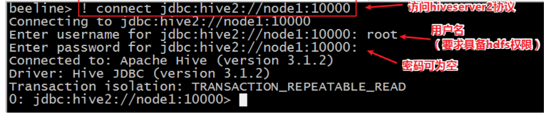
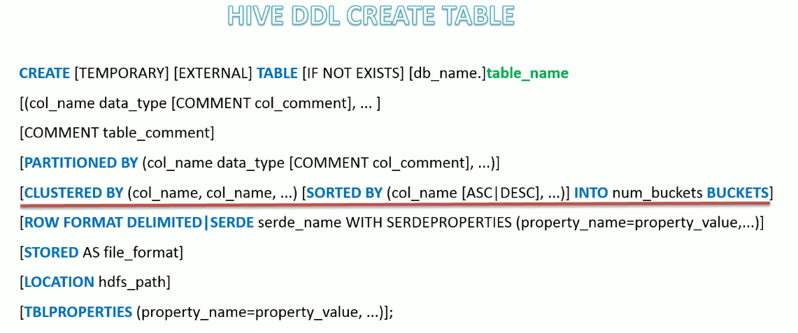
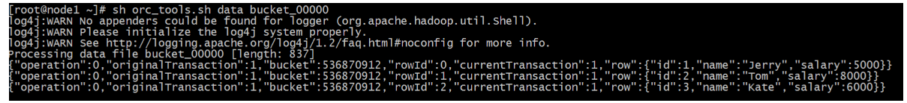
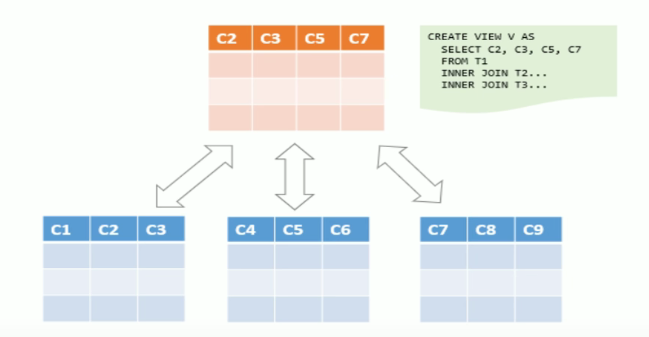
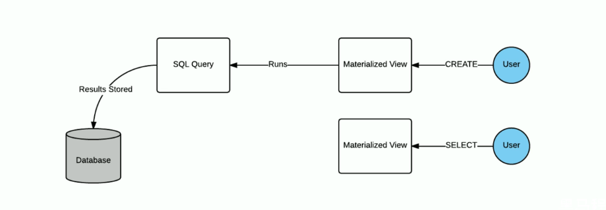
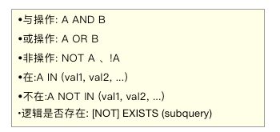

# Hive
## 什么是数仓

### 基本概念

数据仓库（英文：Data Warehouse，简称 DW 或 DWH），是一个用于存储、分析、报告的数据系统。

数据仓库的目的是构建**面向分析**的集成化数据环境，为企业提供决策支持（Decision Support）。


数据仓库**本身并不 "生产" 任何数据**，其数据来源于不同的外部系统。

同时数据仓库自身也**不需要 "消费" 任何数据**，其结果开放给各个外部应用系统使用。

这也是为什么叫 "仓库", 而不叫 "工厂" 的原因。


### 数仓为何而来 

先下结论：**为了分析数据而来**，分析结果为企业决策提供支撑。

企业中，信息总是用作两个目的：

1）操作型记录的保存

2）分析型决策的制定

以下一中国人寿保险公司（chinalife）发展为例，阐述数据仓库为何而来？

**操作型记录的保存**

- 中国人寿保险（集团）公司下多条业务线，包括：人寿险、财险、车险、养老险等。各个线的业务正常运营需要记录维护包括客户、保单、收付费、核保、理赔等信息。

- **联机事务处理系统（OLTP）**正好可以满足上述业务需求开展，其主要任务是执行联机事务处理。其基本特征是前台接收用户数据可以立即传送给后台进行处理，并在很短时间内给出处理结果。

  

- **关系型数据库（RDBMS）就是OLTP典型应用**，比如：Oracle、MySQL、SQL Server等。

  

**分析型决策的制定**

- 随着集团业务的持续运营，业务数据将会越来越多。由此也产生出许多运营相关的困惑：

  - 能够确定哪些险种正在恶化或已成为不良险种？
  - 能够用有效的方式制定新增和续保的政策吗？
  - 理赔过程有欺诈的可能吗？我们是否有欺诈识别能力？
  - 现在得到的报表是否只是某业务线的？集团整体侧面数据如何？

     ...

- 为了能够正确认识这些问题，制定相关的解决措施，瞎拍桌子肯定是不行的。

- 最稳妥的办法就是：**基于业务数据开展数据分析，基于分析的结果给决策提供支撑。**也就是所谓的数据驱动决策的制定。

  

  > 问题：在哪里进行数据分析？数据库可以吗？

  **OLTP环境开展分析可行吗？**

  可以，但是没必要

  OLTP系统的核心是面向业务，支持业务，支持事务。所有的业务操作而言分为读、写两种操作，一般来说**读的压力明显大于写的压力**。如果在OLTP环境直接开展各种分析，有以下问题需要考虑：

  1）数据分析也是对数据进行读取操作，会让读取压力倍增；

  2）OLTP仅存储数周或数月的数据；

  3）数据分散存储在不同的表中，字段类型属性不统一；

  

  当分析所涉及数据规模较小的时候，在业务低峰期可以在OLTP系统上开展直接分析。但是**为了更好的进行各种规模的数据分析，同时也不影响OLTP系统运行，此时需要构建一个集成统一的数据分析平台。**

  该平台的目的很简单：**面向分析，支持分析，**并且和OLTP系统**解耦合**。

  基于这种需求，数据仓库的雏形开始在企业中出现了。

### 数仓的创建

如数仓定义所说，数仓是一个用于存储、分析、报告的数据系统，目的是构建面向分析的集成化数据环境。我们把这种**面向分析、支持分析**的系统称之为 **OLAP （联机分析处理）系统**。数据仓库就是OLAP的一种。

中国人寿保险公司就是基于分析决策的需求，构建数仓平台。

 


### 主要特征

 

- **面向主题性（Subject-Oriented）**

  - 数据库中，最大的特点是**面向应用**进行数据的组织，各个业务系统可能是相互分离的。

  - 而**数据仓库则是面向主题的**。主题是一个抽象的概念，是较高层次上企业信息系统中的**数据综合**、**归类**并进行分析利用的抽象。在逻辑意义上，它是对企业中某一宏观分析领域所涉及的分析对象。

  - 操作行处理（传统数据）对数据的划分并不适用于决策分析。而基于主题组织的数据则不同，它们被划分为各自独立的领域，各个领域有各自的逻辑内涵但互不交叉，在**抽象层次上对数据进行完整、一致和准确的描述**。

    
  
- **集成性（Integrated）**

  - 确定主题之后，就需要获取和主题相关的数据。当下企业中主题相关的**数据通常会分布在多个操作系统中，彼此分散、独立、异构**。

  - 因此在数据进入数据仓库之前，必然要经过**统一与综合，对数据进行抽取、清洗、转换和汇总**，这一步是数据仓库建设中最关键、最复杂的一步，所要完成的工作有：

    1）要统一源数据中所有矛盾之处，如字段同名异义、异名同义、单位不统一、字长不统一，等等。

    2）进行数据综合和计算。数据仓库中的数据综合工作可以在从原有数据库抽取数据时生成，但许多是在数据仓库内部生成的，即进入数据仓库以后进行综合生成的。

    > 一句话总结来说：不论数据来源于哪里，只要它属于同一个主题，我就要把它集中到一起，且保障它们之间格式统一干净规整。
  
    下图说明了保险公司综合数据的简单处理过程，其中数据仓库中与 "承保" 主题有关的数据来自于不同操作性系统。这些系统内部数据命名可能不同，数据格式也可能不同。把不同来源的数据存储到数据仓库之前，需要去除这些不一致。

  

- **非易失性、非异变性（Non-Volatile）**

  - **数据仓库是分析数据的平台，而不是创造数据的平台**。我们通过数仓去分析数据中的规律，而不是去创造修改其中的规律。因此数据进入数据仓库后，它便稳定且不会改变。
  - 操作性数据库主要服务于日常的业务操作，使得数据库需要不断对数据进行实时更新，以便迅速获取当前最新数据，不至于影响业务正常的运作。在数仓中只要保存过去的业务数据，不需要每一笔业务都实时更新数据仓库，而是根据商业需要每隔一段时间把一批相对较新的数据导入到数据仓库。
  - **数据仓库的数据反映的是一段相对长时间内历史数据的内容**，而不同时间点数据库快照的集合，以及基于这些数据快照进行统计、综合和重组的导出数据。
  - 数据仓库的用户对数据的操作大多是数据查询或者比较复杂的挖掘，一旦数据进入数仓以后，一般情况下被较长时间保留。**数据仓库一般有大量的查询操作，但修改和删除操作很少。**
  
- **时变性（Time-Variant）**
  
  - 数据仓库包括各种粒度的历史数据，数据可能与某个特定日期、星期、月份、季度或年份有关。
    
  - 虽然数据仓库的用户不能修改数据，但并不是说数仓的数据就永远不变的。分析的结果只能反应过去的情况，当业务变化后，挖掘出的模式会失去时效性。因此数仓的数据**需要随着时间更新，以适应决策的需要**。从这个角度讲，数仓建设是一个项目，更是一个过程。
    
  - 数据仓库的数据随时间的变化表现在一下几个方面：
    
    1）数据仓库的数据时限一般要远远长于操作型数据的数据时限；
    
    2）操作型系统存储的是当前数据，而数据仓库存储的是历史数据；
    
    3）数据仓库中数据是按照时间顺序追加的，它们都带有时间属性。
  
  
  
### OLTP、OLAP

- 联机**事务**处理 OLTP （On-Line **Transaction** Processing）

  - 操作性处理，叫联机事务处理 OLTP （On-Line **Transaction** Processing），主要目标是做数据处理，它是针对具体业务在数据库联机的日常操作，通常对少数记录进行查询、修改。

  - 用户较为关心操作的响应时间、数据的安全性、完整性和并发支持用户数等问题。

  - 传统的**关系型数据库系统（RDBMS）作为数据管理的主要手段，主要用于操作型处理。**

    


- 联机**分析**处理 OLAP（On-Line Analytical Processing)

  - 分析型处理，叫联机分析处理 OLAP（On-Line **Analytical** Processing），主要目标是做数据分析。
  - 一般针对某些主题的历史数据进行复杂的多维分析，支持管理决策。
  - **数据仓库是 OLAP 系统的一个典型示例**，主要用于数据分析。

- 对比

  

  


### 数据库与数据仓库的区别

数据库与数据仓库的区别实际讲的是 OLTP 与 OLAP 的区别。

OLTP系统的典型应用就是 RDBMS，也就是我们俗称的数据库，当然这里要特别强调此数据库表的是关系型数据库，NoSQL数据库并不在讨论范围内。

OLAP 系统的典型应用就是 DW，也就是我们俗称的数据仓库。

**结论：**

- 数据仓库不是大型的数据库，虽然数据仓库存储的数据规模很大。
- 数据仓库的出现，并不是为了取代数据库。
- 数据库是面向事务的设计，数据仓库是面向主题设计的。
- 数据库一般存储业务数据，数据仓库存储的一般是历史数据。
- 数据库是为了**捕获数据**而设计，数据仓库是为了**分析数据**而设计。


### 数据仓库、数据集市

数据仓库（Data Warehouse）是面向**整个集团**组织的数据，数据集市（Data Mart）是面向**某个部门**使用的。

可以认为数据集市是数据仓库的子集，也有人把**数据集市叫做小型数据仓库**。数据集市通常只涉及一个主题领域，例如市场营销或销售。因此它们较小且更具体，所以它们通常更容易管理和维护，并具有更灵活的结构。

下图中，各种操作型系统数据和包括文件在内的等其他数据作为数据源，经过ETL（抽取转加载）填充到数据仓库中；数据仓库中有不同主题数据，数据集市则根据部门特点面向指定主题，比如Purchasing（采购）、Sales（销售）、Inventory（库存）；

用户可以根据主题数据开展各种应用：数据分析、数据报表、数据挖掘。


### 数仓的分层架构 

#### 分层思想和标准

数据仓库的特点是本身不生产数据，也不最终消费数据。按照数据流入流出数仓的过程进行分层就显得水到渠成。

每个企业根据自己的业务需求可以分成不同的层次。但是最基础的分层思想，理论上可分为三个层级：操作型数据层（**ODS**）、数据仓库层（**DW**）和数据应用层（**DA**）。

 企业在实际运行中可以基于这个基础分层之上添加新的层次，来满足不同的业务需求。


#### 阿里巴巴数仓3层架构

为了更好的理解数据仓库和分层的思想以及每层的功能意义，下面结合阿里巴巴提供出的数仓分层架构图进行分析。

阿里数仓是非常经典的3层架构，从下往上依次是：**ODS、DW、DA**。

通过元数据管理和数据质量监控来把控整个数仓中数据的流转过程、血缘依赖关系和生命周期。


数据仓库的数据来源于不同的源数据，并提供多样的数据应用，数据自下而上流入数据仓库后向上层开放应用，而数据仓库只是中间集成化数据管理的一个平台。 

- **ODS层（Operation Data Store）操作型数据层**，也称之为源数据层、数据引入层、数据暂存层、临时缓存层

  此层数据无任何更改，直接沿用外围系统数据结构和数据，不对外开放；为临时存储层，是接口数据的临时存储区域，为后一步的数据处理做准备。 **主要完成基础数据引入到数仓的职责，和数据源系统进行解耦合，同时记录基础数据的历史变化。**

- **DW层（Data Warehouse）数据仓库层** ：也称为细节层，DW层的数据应该是一致的、准确的、干净的数据，即对源系统数据进行了清洗（去除了杂质）后的数据。 主要完成了数据的数据的**加工与整合**，建立一致性的维度，构建**可复用的面向分析和统计的明细实时表**，以及汇总公共粒度的指标。内部具体划分如下：

  - 公共维度层（DIM）：基于维度建模理念思想，建立整个企业的一致性维度。
  - 公共汇总粒度事实层（DWS、DWB）：已分析的主题对象作为建模驱动，基于上层的应用和产品的指标要求，构建公共粒度的汇总指标事实表，以宽表化手段物理化模型。
  - 明细粒度事实表（DWD）：将明细事实表的某些重要维度属性字段做适当冗余，即宽表化处理。

- DA层或ADS层，数据应用层 ，面向最终用户，面向业务定制提供为产品和数据分析使用的数据。包括前端报表、分析图标、KPI、仪表盘、OLAT专题、数据挖掘等分析。


#### 为什么要对数据仓库分层？

**好处**

分层的主要原因是在管理数据的时候，能对数据有一个更加清晰的掌控，详细来讲，主要有下面几个原因：

- **清晰数据结构**
  每一个数据分层都有它的作用域，在使用表的时候能更方便地定位和理解。
- 数据血缘追踪
  简单来说，我们最终给业务呈现的是一个能直接使用业务表，但是它的来源有很多，如果有一张来源表出问题了，我们希望能够快速准确地定位到问题，并清楚它的危害范围。
- **减少重复开发**
  规范数据分层，开发一些通用的中间层数据，能够减少极大的重复计算。
- **把复杂问题简单化**
  将一个复杂的任务分解成多个步骤来完成，每一层只处理单一的步骤，比较简单和容易理解。而且便于维护数据的准确性，当数据出现问题之后，可以不用修复所有的数据，只需要从有问题的步骤开始修复。
- **屏蔽原始数据的异常**
  屏蔽业务的影响，不必改一次业务就需要重新接入数据

#### ETL 和 ELT

数据仓库**从各数据源获取数据及在数据仓库内的数据转换和流动**都可以认为是ETL（抽取Extra, 转化Transfer, 装载Load）的过程。但是在实际操作中将数据加载到仓库却产生了两种不同做法：ETL和ELT。

- **Extract，Transform，Load，ETL**

  首先从数据源池中提取数据，这些数据源通常是事务性数据库。数据保存在临时暂存数据库中。然后执行转换操作，将数据结构化并转换为适合目标数据仓库系统的形式。然后将结构化数据加载到仓库中，以备分析。

  

- **Extract，Load，Transform ，ELT**

  使用ELT，数据在从源数据池中提取后立即加载。没有临时数据库，这意味着数据会立即加载到单一的集中存储库中。数据在数据仓库系统中进行转换，以便与商业智能工具和分析一起使用。**大数据时代的数仓这个特点很明显。**

  

### 案例

> **场景分析**：美团点评酒旅数仓建设实践

下面通过一线互联网企业真实的数仓建设实践案例，来从宏观层面感受以下几点：

- 数仓面向主题分析的特点
- 在企业中数仓是一个不断维护的工程
- 数仓分层并不局限于经典3层，可以根据自身需求进行调整
- 没有好的架构，只有适合自己业务需求的架构
- 它山之石可以攻玉

#### 架构变迁

在美团点评酒旅事业群内，业务由**传统的团购**形式转向**预订**、**直连**等更加丰富的产品形式，业务系统也在迅速的迭代变化，这些都对数据仓库的扩展性、稳定性、易用性提出了更高要求。

基于此，美团采取了分层次、分主题的方式不断优化并调整层次结构，下图展示了技术架构的变迁。


**第一代**数仓模型层次中，由于当时美团整体的业务系统所支持的产品形式比较单一（团购），业务系统中包含了所有业务品类的数据，所以由平台的角色来加工数据仓库基础层是非常合适的，平台统一建设，支持各个业务线使用，所以在本阶段中酒旅只是建立了一个相对比较简单的**数据集市**。

**第二代**数仓模型层次的建设，由建设**数据集市**的形式转变成了**直接建设酒旅数据仓库**，成为了酒旅自身业务系统数据的唯一加工者。

随着美团和点评融合，同时酒旅自身的业务系统重构的频率也相对较高，对第二代数仓模型稳定性造成了非常大的影响，原本的维度模型非常难适配这么迅速的变化。核心问题是在用业务系统和业务线关系错综复杂，业务系统之间差异性明显且变更频繁。


于是在**第三代**ODS与多维明细层中间加入了**数据整合层**，参照Bill Inmon所提出的企业信息工厂建设的模式，基本按照三范式的原则来进行数据整合，由业务驱动调整成了由技术驱动的方式来建设数据仓库基础层。

使用本基础层的最根本出发点还是在于美团的供应链、业务、数据它们本身的多样性，如果业务、数据相对比较单一、简单，本层次的架构方案很可能将不再适用。


#### 主题建设

实际上在传统的一些如银行、制造业、电信、零售等行业里，都有一些比较成熟的模型，如耳熟能详的BDWM模型，它们都是经过一些具有相类似行业的企业在二三十年数据仓库建设中所积累的行业经验，不断的优化并通用化。

但美团所处的O2O行业本身就没有可借鉴的成熟的数据仓库主题以及模型，所以，在摸索建设两年的时间里，美团总结了下面比较适合现状的七大主题（后续可能还会新增）


#### 整体架构

确定好技术和业务主题之后，数仓的整体架构就比较清晰了。美团酒旅数仓七个主题基本上都采用6层结构的方式来建设，划分**主题**更多是从**业务的角度**出发，而**层次**划分则是基于技术，**实质上就是基于业务与技术的结合完成了整体的数据仓库架构**。


比如，以订单主题为例。在订单主题的建设过程中，美团是按照**由分到总的结构思路来进行建设**，首先分供应链建设订单相关实体（数据整合中间层3NF），然后再进行适度抽象把分供应链的相关订单实体进行合并后生成订单实体（数据整合层3NF），后续在数据整合层的订单实体基础上再扩展部分维度信息来完成后续层次的建设。


## **Hive** 的基本概念

### Hive 简介

#### 什么是 **Hive** ？

Apache Hive是一款建立在Hadoop之上的开源**数据仓库系统**，可以将存储在Hadoop文件中的结构化、半结构化数据文件**映射**为一张数据库表，基于表提供了一种类似SQL的查询模型，称为Hive查询语言（HQL），用于访问和分析存储在Hadoop文件中的大型数据集。

Hive核心是将**HQL转换为MapReduce**程序，然后将程序提交到Hadoop群集执行。Hive由Facebook实现并开源。


#### 为什么使用 Hive ？

-  使用Hadoop MapReduce直接处理数据所面临的问题
  - 人员学习成本太高 
  - 项目周期要求太短 
  - MapReduce实现复杂查询逻辑开发难度太大

- 使用Hive处理数据的好处
  - 操作接口采用类SQL语法，提供快速开发的能力（简单、容易上手）
  - 避免了去写MapReduce，减少开发人员的学习成本
  - 支持自定义函数，功能扩展很方便
  - 背靠Hadoop，擅长存储分析海量数据集

#### Hive与Hadoop的关系

从功能来说，数据仓库软件，至少需要具备下述两种能力：

- 存储数据的能力

- 分析数据的能力

Apache Hive作为一款大数据时代的数据仓库软件，当然也具备上述两种能力。只不过Hive并不是自己实现了上述两种能力，而是借助Hadoop。

**Hive利用HDFS存储数据，利用MapReduce查询分析数据。**

这样突然发现Hive没啥用，不过是套壳Hadoop罢了。其实不然，Hive的最大的魅力在于用户专注于编写HQL，Hive帮您转换成为MapReduce程序完成对数据的分析。


### 案例

#### 场景设计

> 如何模拟实现 Hive 的功能

如果让您设计Hive这款软件，要求能够实现**用户编写sql语句，Hive自动将sql转换MapReduce程序，处理位于HDFS上的结构化数据**。如何实现？

在HDFS文件系统上有一个文件，路径为/data/china_user.txt，其内容如下：

```txt
1,zhangsan,18,beijing
2,lisi,25,shanghai
3,allen,30,shanghai
4,wangwu,15,nanjing
5,james,45,hangzhou
6,tony,26,beijing
```

#### 需求

> 统计来自于上海年龄大于25岁的用户有多少个？

#### 场景目的

重点理解下面两点

- Hive能将数据文件映射成为一张表，这个**映射是指什么**？

- Hive软件本身到底承担了什么功能职责？

**映射信息记录**

**映射**在数学上称之为一种**对应关系**，比如y=x+1，对于每一个x的值都有与之对应的y的值。

在hive中能够写sql处理的前提是针对表，而不是针对文件，因此需要**将文件和表之间的对应关系**描述记录清楚。映射信息专业的叫法称之为**元数据信息**（元数据是指用来描述数据的数据 metadata）。


具体来看，要记录的元数据信息包括：

- 表对应着哪个文件（位置信息）
- 表的列对应着文件哪一个字段（顺序信息）
- 文件字段之间的分隔符是什么

**SQL语法解析、编译**

用户写完sql之后，hive需要针对sql进行语法校验，并且根据记录的元数据信息解读sql背后的含义，制定执行计划。并且把执行计划转换成MapReduce程序来执行，把执行的结果封装返回给用户。

> **结论：**
>
> **Hive能将数据文件映射成为一张表，这个映射是指什么?**
>
> 答：文件和表之间的对应关系
>
> **Hive软件本身到底承担了什么功能职责？**
>
> 答：SQL语法解析编译成为MapReduce


#### 最终效果

基于上述分析，最终要想模拟实现的Hive的功能，大致需要下图所示组件参与其中。

从中可以感受一下Hive承担了什么职责，当然，也可以把这个理解为Hive的架构图。


### Hive 架构


- **用户接口**： 包括CLI、JDBC/ODBC。其中，CLI(command line interface)为shell命令行；JDBC/ODBC是Hive的JAVA实现，与传统数据库JDBC类似； 
- **元数据存储**： 通常是存储在关系数据库如mysql/derby中。Hive 将元数据存储在数据库中。Hive中的元数据包括表的名字，表的列和分区及其属性，表的属性（是否为外部表等），表的数据所在目录等。 
- **Driver 驱动程序，包括解释器、编译器、优化器、执行器**：完成HQL 查询语句从词法分析、语法分析、编译、优化以及查询计划的生成。生成的查询计划存储在HDFS 中，并在随后有MapReduce 调用执行。 
- **执行引擎**：Hive本身并不直接处理数据文件。而是通过执行引擎处理。3.x Hive支持MapReduce、Tez、Spark3种执行引擎。

**工作原理**：

1.  用户创建数据库、表信息，存储在hive的元数据库中；

2.  向表中加载数据，元数据记录hdfs文件路径与表之间的映射关系；

3.  执行查询语句，首先经过解析器、编译器、优化器、执行器，将指令翻译成MapReduce，提交到Yarn上执行，最后将执行返回的结果输出到用户交互接口。

   

### Hive 数据模型

#### Data Model概念

数据模型：用来描述数据、组织数据和对数据进行操作，是对现实世界数据特征的描述。

Hive的数据模型**类似于RDBMS库表结构**，此外还有**自己特有模型**。

Hive中的数据可以在粒度级别上分为三类：

- Table 表
- Partition 分区
- Bucket 分桶


#### Databases 数据库

Hive作为一个数据仓库，在结构上积极向传统数据库看齐，也分数据库（Schema），每个数据库下面有各自的表组成。默认**数据库default**。

Hive的数据都是**存储在HDFS**上的，默认有一个根目录，在 `hive-site.xml` 中，由参数 `hive.metastore.warehouse.dir` 指定。默认值为`/user/hive/warehouse`。

因此，Hive中的数据库在HDFS上的存储路径为：

```
${hive.metastore.warehouse.dir}/databasename.db
```

比如，名为test的数据库存储路径为：

```
/user/hive/warehouse/test.db
```

#### Table 表

Hive表与关系数据库中的表相同。Hive中的表所对应的数据通常是存储在HDFS中，而表相关的元数据是存储在RDBMS中。

Hive中的表的数据在HDFS上的存储路径为：

```
${hive.metastore.warehouse.dir}/databasename.db/tablename
```

比如,test的数据库下t_user表存储路径为：

```
/user/hive/warehouse/test.db/t_user
```


#### Partitions 分区

Partition分区是hive的一种优化手段表。分区是指**根据分区列（例如“日期day”）的值将表划分为不同分区**。这样可以更快地对指定分区数据进行查询。

分区在存储层面上的表现是:table表目录下以子文件夹形式存在。

**一个文件夹表示一个分区**。子文件命名标准：**分区列=分区值**

Hive还支持分区下继续创建分区，所谓的多重分区。关于分区表的使用和详细介绍，后面模块会单独展开。


#### Buckets 分桶

Bucket分桶表是hive的一种优化手段表。**分桶是指根据表中字段（例如“编号ID”）的值,经过hash计算规则将数据文件划分成指定的若干个小文件**。


分桶规则：**hashfunc(ID) % 桶个数**，余数相同的分到同一个文件。

分桶的好处是可以优化join查询和方便抽样查询。Bucket分桶表在hdfs中表现为同一个表目录下数据根据hash散列之后变成多个文件。关于桶表以及分桶操作，后面模块会单独展开详细讲解。


### **Hive **与传统数据库对比 

> Hive 是要取代 MySQL吗？

Hive虽然具有RDBMS数据库的外表，包括数据模型、SQL语法都十分相似，但应用场景却完全不同。Hive只适合用来做海量数据的**离线分析**。Hive的定位是**数据仓库**，面向分析的**OLAP系统**。

因此时刻告诉自己，**Hive不是大型数据库，也不是要取代Mysql承担业务数据处理**。

更直观的对比请看下面这幅图：


### Hive 元数据

#### 什么是元数据

元数据（Metadata），又称中介数据、中继数据，为**描述数据的数据**（data about data），主要是描述数据属性（property）的信息，用来支持如指示存储位置、历史数据、资源查找、文件记录等功能。

#### Hive Metadata

- Hive Metadata即Hive的元数据。
- 包含用Hive创建的database、table、表的位置、类型、属性，字段顺序类型等元信息。
- **元数据存储在关系型数据库中**。如hive内置的Derby、或者第三方如MySQL等。

#### Hive Metastore

- Metastore即**元数据服务**。Metastore服务的作用是**管理metadata元数据**，对外暴露服务地址，让各种客户端通过连接metastore服务，由metastore再去连接MySQL数据库来存取元数据。
- 有了metastore服务，就可以有多个客户端同时连接，而且这些客户端不需要知道MySQL数据库的用户名和密码，只需要连接metastore 服务即可。某种程度上也保证了hive元数据的安全。


#### Metastore配置方式

metastore服务配置有3种模式：**内嵌模式、本地模式、远程模式。**

区分3种配置方式的关键是弄清楚两个问题：

- Metastore服务是否需要单独配置、单独启动？
- Metadata是存储在内置的derby中，还是第三方RDBMS,比如MySQL。


> 企业推荐模式--远程模式部署

##### 内嵌模式

内嵌模式（Embedded Metastore）是metastore**默认部署模式**。

此种模式下，元数据存储在**内置的Derby数据库**，并且Derby数据库和metastore服务都嵌入在主HiveServer进程中，当启动HiveServer进程时，Derby和metastore都会启动。不需要额外起Metastore服务。

但是一次只能支持一个活动用户，适用于**测试体验**，**不适用于生产环境**。


##### 本地模式

本地模式（Local Metastore）下，**Metastore服务与主HiveServer进程在同一进程**中运行，但是存储元数据的数据库在单独的进程中运行，并且可以在单独的主机上。metastore服务将通过JDBC与metastore数据库进行通信。

本地模式采用**外部数据库**来存储元数据，推荐使用MySQL。

hive根据`hive.metastore.uris` 参数值来判断，如果为空，则为本地模式。

缺点是：每启动一次hive服务，都内置启动了一个metastore。


##### 远程模式

远程模式（Remote Metastore）下，**Metastore服务在其自己的单独JVM上运行**，而不在HiveServer的JVM中运行。如果其他进程希望与Metastore服务器通信，则可以使用Thrift Network API进行通信。

远程模式下，需要配置hive.metastore.uris 参数来指定metastore服务运行的机器ip和端口，并且**需要单独手动启动metastore服务**。元数据也采用外部数据库来存储元数据，推荐使用MySQL。

在生产环境中，建议用远程模式来配置Hive Metastore。在这种情况下，其他依赖hive的软件都可以通过Metastore访问hive。由于还可以完全屏蔽数据库层，因此这也带来了更好的可管理性/安全性。


## Hive 安装和环境配置

### 安装前准备

由于Apache Hive是一款基于Hadoop的数据仓库软件，通常部署运行在Linux系统之上。因此不管使用何种方式配置Hive Metastore，必须要先保证服务器的基础环境正常，Hadoop集群健康可用。

#### 服务器基础环境

集群时间同步、防火墙关闭、主机Host映射、免密登录、JDK安装

#### Hadoop集群健康可用

启动Hive之前必须先启动Hadoop集群。特别要注意，需**等待HDFS安全模式关闭之后再启动运行Hive**。
Hive不是分布式安装运行的软件，其分布式的特性主要**借由Hadoop**完成。包括**分布式存储、分布式计算**。

### Hadoop与Hive整合

因为Hive需要把数据**存储在HDFS**上，并且通过MapReduce作为执行引擎处理数据；

因此需要在Hadoop中添加相关配置属性，以满足Hive在Hadoop上运行。

修改Hadoop中core-site.xml，并且Hadoop集群同步配置文件，重启生效。

```xml
<!-- 整合hive 代理用户配置 -->
<property>
	<name>hadoop.proxyuser.root.hosts</name>
	<value>*</value>
</property>
<property>
	<name>hadoop.proxyuser.root.groups</name>
	<value>*</value>
</property>
```


### 远程模式安装

远程模式最大的特点有两个：

- 需要安装MySQL来存储Hive元数据；
- 需要手动单独配置启动Metastore服务。


#### MySQL的安装

```shell
#卸载Centos7自带mariadb
rpm -qa|grep mariadb
mariadb-libs-5.5.64-1.el7.x86_64
rpm -e mariadb-libs-5.5.64-1.el7.x86_64 --nodeps

#创建mysql安装包存放点
mkdir /export/software/mysql
#上传mysql-5.7.29安装包到上述文件夹下、解压
tar xvf mysql-5.7.29-1.el7.x86_64.rpm-bundle.tar

#执行安装
yum -y install libaio
rpm -ivh mysql-community-common-5.7.29-1.el7.x86_64.rpm mysql-community-libs-5.7.29-1.el7.x86_64.rpm mysql-community-client-5.7.29-1.el7.x86_64.rpm mysql-community-server-5.7.29-1.el7.x86_64.rpm

#初始化mysql
mysqld --initialize
#更改所属组
chown mysql:mysql /var/lib/mysql -R

#启动mysql
systemctl start mysqld.service
#查看生成的临时root密码
grep 'temporary password' /var/log/mysqld.log
#这行日志的最后就是随机生成的临时密码
[Note] A temporary password is generated for root@localhost: o+TU+KDOm004

#修改mysql root密码、授权远程访问
mysql -u root -p
Enter password:     #这里输入在日志中生成的临时密码

#更新root密码  设置为hadoop
mysql> alter user user() identified by "hadoop";
Query OK, 0 rows affected (0.00 sec)
#授权
mysql> use mysql;
mysql> GRANT ALL PRIVILEGES ON *.* TO 'root'@'%' IDENTIFIED BY 'hadoop' WITH GRANT OPTION;
mysql> FLUSH PRIVILEGES;

#mysql的启动和关闭 状态查看
systemctl stop mysqld
systemctl status mysqld
systemctl start mysqld

#建议设置为开机自启动服务
systemctl enable  mysqld

#查看是否已经设置自启动成功
systemctl list-unit-files | grep mysqld
```

#### Hive 安装

```shell
# 上传解压安装包
cd /export/server/
tar zxvf apache-hive-3.1.2-bin.tar.gz
mv apache-hive-3.1.2-bin hive

#解决hadoop、hive之间guava版本差异
cd /export/server/hive
rm -rf lib/guava-19.0.jar
cp /export/server/hadoop-3.1.4/share/hadoop/common/lib/guava-27.0-jre.jar ./lib/

#添加mysql jdbc驱动到hive安装包lib/文件下
mysql-connector-java-5.1.32.jar

#修改hive环境变量文件 添加Hadoop_HOME
cd /export/server/hive/conf/
mv hive-env.sh.template hive-env.sh
vim hive-env.sh
export HADOOP_HOME=/export/server/hadoop-3.1.4
export HIVE_CONF_DIR=/export/server/hive/conf
export HIVE_AUX_JARS_PATH=/export/server/hive/lib

```


#### Hive-site.xml

```shell
#新增hive-site.xml 配置mysql等相关信息
vim hive-site.xml
```

```xml
<configuration>
    <!-- 存储元数据mysql相关配置 -->
    <property>
        <name>javax.jdo.option.ConnectionURL</name>
        <value> jdbc:mysql://master:3306/hive?createDatabaseIfNotExist=true&amp;useSSL=false&amp;useUnicode=true&amp;characterEncoding=UTF-8</value>
    </property>

    <property>
        <name>javax.jdo.option.ConnectionDriverName</name>
        <value>com.mysql.jdbc.Driver</value>
    </property>

    <property>
        <name>javax.jdo.option.ConnectionUserName</name>
        <value>root</value>
    </property>

    <property>
        <name>javax.jdo.option.ConnectionPassword</name>
        <value>hadoop</value>
    </property>

    <!-- H2S运行绑定host -->
    <property>
        <name>hive.server2.thrift.bind.host</name>
        <value>node1</value>
    </property>

    <!-- 远程模式部署metastore 服务地址 -->
    <property>
        <name>hive.metastore.uris</name>
        <value>thrift://master:9083</value>
    </property>

    <!-- 关闭元数据存储授权  -->
    <property>
        <name>hive.metastore.event.db.notification.api.auth</name>
        <value>false</value>
    </property>
    <!-- 关闭元数据存储版本的验证 -->
    <property>
        <name>hive.metastore.schema.verification</name>
        <value>false</value>
    </property>
</configuration>
```

```shell
# 初始化metadata
cd /export/server/hive
bin/schematool -initSchema -dbType mysql -verbos
# 初始化成功会在mysql中创建74张表
```


如果在远程模式下，直接运行hive服务，在执行操作的时候会报错，错误信息如下：


> 注意：
>
> 在远程模式下，必须首先启动Hive metastore服务才可以使用hive。
>
> 因为metastore服务和hive server是两个单独的进程了。


#### 手动启动 Metastore

后台启动的输出日志信息，在/root目录下，nohup.out。

```shell
#前台启动  关闭ctrl+c
/export/server/hive/bin/hive --service metastore

#前台启动开启debug日志
/export/server/hive/bin/hive --service metastore --hiveconf hive.root.logger=DEBUG,console

#后台启动 进程挂起  关闭使用jps + kill
#输入命令回车执行 再次回车 进程将挂起后台
nohup /export/server/hive/bin/hive --service metastore --hiveconf hive.root.logger=DEBUG,console &
```


## Hive 客户端使用


Hive发展至今，总共历经了两代客户端工具。

- 第一代客户端（deprecated不推荐使用）：**$HIVE_HOME/bin/hive,** 是一个 shellUtil。主要功能：
  - 一是可用于以交互或批处理模式运行Hive查询；
  - 二是用于Hive相关服务的启动，比如metastore服务。
- 第二代客户端（recommended 推荐使用）：**$HIVE_HOME/bin/beeline**，是一个JDBC客户端，是**官方强烈推荐**使用的Hive命令行工具，和第一代客户端相比，性能加强安全性提高。


### Hive Beeline Client

Beeline在嵌入式模式和远程模式下均可工作。

在嵌入式模式下，它运行嵌入式 Hive(类似于Hive Client)；而**远程模式下beeline通过 Thrift 连接到单独的 HiveServer2服务**上，这也是官方推荐在生产环境中使用的模式。

那么问题来了，HiveServer2是什么？HiveServer1哪里去了？

### HiveServer、HiveServer2服务

HiveServer、HiveServer2都是Hive自带的两种服务，允许客户端在不启动CLI（命令行）的情况下对Hive中的数据进行操作，且两个都允许远程客户端使用多种编程语言如java，python等向hive提交请求，取回结果。

但是，HiveServer不能处理多于一个客户端的并发请求。因此在Hive-0.11.0版本中重写了HiveServer代码得到了HiveServer2，进而解决了该问题。HiveServer已经被废弃。

HiveServer2支持**多客户端**的**并发**和**身份认证**，旨在为开放API客户端如JDBC、ODBC提供更好的支持。

### 关系梳理

HiveServer2通过Metastore服务读写元数据。所以在远程模式下，启动HiveServer2之前必须先**首先启动metastore服务**。

特别注意：远程模式下，Beeline客户端只能通过HiveServer2服务访问Hive。而bin/hive是通过Metastore服务访问的。具体关系如下：


### 具体使用

#### bin/hive 客户端

在hive安装包的bin目录下，有hive提供的第一代客户端 bin/hive。该客户端可以访问hive的metastore服务，从而达到操作hive的目的。

友情提示：**如果您是远程模式部署，请手动启动运行metastore服务**。如果是内嵌模式和本地模式，直接运行bin/hive，metastore服务会内嵌一起启动。

可以直接在启动Hive metastore服务的机器上使用bin/hive客户端操作，此时不需要进行任何配置。

```shell
#远程模式 首先启动metastore服务
/export/server/hive/bin/hive --service metastore

#克隆CRT会话窗口 使用hive client连接
/export/server/hive/bin/hive
```

如果需要在其他机器上通过bin/hive访问hive metastore服务，只需要在该机器的hive-site.xml配置中添加metastore服务地址即可。

```shell
#上传hive安装包到另一个机器上，比如node3：
cd /export/server/
tar zxvf apache-hive-3.1.2-bin.tar.gz
mv apache-hive-3.1.2-bin hive

#解决hadoop、hive之间guava版本差异
cd /export/server/hive/
rm -rf lib/guava-19.0.jar
cp /export/server/hadoop-3.1.4/share/hadoop/common/lib/guava-27.0-jre.jar ./lib/

#修改hive环境变量文件 添加Hadoop_HOME
cd /export/server/hive/conf
mv hive-env.sh.template hive-env.sh
vim hive-env.sh
export HADOOP_HOME=/export/server/hadoop-3.1.4

#添加metastore服务地址
cd /export/server/hive/conf/
vim  hive-site.xml
```

```xml
<configuration>
	<property>
    <name>hive.metastore.uris</name>
    <value>thrift://node1:9083</value>
	</property>
</configuration>
```

可以通过运行 "hive -H" 或者 "hive --help" 来查看命令行选项。


##### 功能一：Batch Mode 批处理模式

当使用-e或-f选项运行bin/hive时，它将以批处理模式执行SQL命令。

所谓的批处理可以理解为**一次性执行，执行完毕退出**。

```sql
#-e
$HIVE_HOME/bin/hive -e 'show databases'

#-f
cd ~
#编辑一个sql文件 里面写上合法正确的sql语句
vim hive.sql
show databases;
#执行 从客户端所在机器的本地磁盘加载文件
$HIVE_HOME/bin/hive -f /root/hive.sql
#也可以从其他文件系统加载sql文件执行
$HIVE_HOME/bin/hive -f hdfs://<namenode>:<port>/hive-script.sql
$HIVE_HOME/bin/hive -f s3://mys3bucket/s3-script.sql
#使用静默模式将数据从查询中转储到文件中
$HIVE_HOME/bin/hive -S -e 'select * from itheima.student' > a.txt
```

##### 功能二：Interactive Shell 交互式模式

所谓交互式模式可以理解为**客户端和hive服务一直保持连接**，除非手动退出客户端。

```sql
/export/server/hive/bin/hive

hive> show databases;
OK
default
test
itheima
Time taken: 0.028 seconds, Fetched: 3 row(s)

hive> use test;
OK
Time taken: 0.027 seconds

hive> exit;
```

##### 功能三：启动Hive服务

比如metastore服务和hiveserver2服务的启动。

```sql
#--service
$HIVE_HOME/bin/hive --service metastore
$HIVE_HOME/bin/hive --service hiveserver2

#--hiveconf
$HIVE_HOME/bin/hive --hiveconf hive.root.logger=DEBUG,console
```


#### bin/beeline 客户端

hive经过发展，推出了第二代客户端beeline，但是beeline客户端不是直接访问metastore服务的，而是需要单独启动hiveserver2服务。

在hive安装的服务器上，**首先启动metastore服务，然后启动hiveserver2服务**。

```shell
#先启动metastore服务 然后启动hiveserver2服务
nohup /export/server/hive/bin/hive --service metastore &
nohup /export/server/hive/bin/hive --service hiveserver2 &
```

Beeline是JDBC的客户端，通过JDBC协议和Hiveserver2服务进行通信，协议的地址是：`jdbc:hive2://node1:10000`

```shell
[root@node3 ~]# /export/server/hive/bin/beeline 
Beeline version 3.1.2 by Apache Hive
beeline> ! connect jdbc:hive2://node1:10000
Connecting to jdbc:hive2://node1:10000
Enter username for jdbc:hive2://node1:10000: root
Enter password for jdbc:hive2://node1:10000: 
Connected to: Apache Hive (version 3.1.2)
Driver: Hive JDBC (version 3.1.2)
Transaction isolation: TRANSACTION_REPEATABLE_READ
0: jdbc:hive2://node1:10000> 
```




## Hive 使用体验

### Hive使用起来和MySQL差不多吗？

对于初次接触Apache Hive的人来说，最大的疑惑就是：Hive 从数据模型看起来和关系型数据库MySQL等好像。包括Hive SQL也是一种类SQL语言。那么实际使用起来如何？ 

#### 过程

按照MySQL的思维，在hive中创建、切换数据库，创建表并执行插入数据操作，最后查询是否插入成功。

```sql
--创建数据库
create database test;
--列出所有数据库
show databases;
--切换数据库
use test;
--建表
create table t_student(id int,name varchar(255));
--插入一条数据
insert into table t_student values(1,"allen1");
--查询表数据
select * from t_student;
```

在执行插入数据的时候，发现**插入速度极慢，sql执行时间很长**，为什么？


最终插入一条数据，历史30秒的时间。查询表数据，显示数据插入成功


#### 验证

首先登陆Hadoop YARN上观察是否有MapReduce任务执行痕迹。

```http
YARN Web UI: http://resourcemanager_host:8088/
```


然后登陆Hadoop HDFS浏览文件系统，根据Hive的数据模型，表的数据最终是存储在HDFS和表对应的文件夹下的。

```http
HDFS Web UI: http://namenode_host:9870/
```


#### 结论

- Hive SQL语法show和标准SQL很类似,使得学习成本降低不少。
- Hive底层是通过MapReduce执行的数据插入动作,所以速度慢。
- 如果大数据集这么一条一条插入的话是非常不现实的，成本极高。
- Hive应该具有自己特有的数据插入表方式，结构化文件映射成为表。


### Hive如何才能将结构化数据映射成为表？

在Hive中，使用insert+values语句插入数据，底层是通过MapReduce执行的，效率十分低下。此时回到Hive的本质上：可以将结构化的数据文件映射成为一张表，并提供基于表的SQL查询分析。

假如，现在有一份结构化的数据文件，如何才能映射成功呢？在映射成功的过程中需要注意哪些问题？

文件存储路径？字段类型？字段顺序？字段之间分隔符？

#### 过程

在HDFS根目录下创建一个结构化数据文件user.txt，里面内容如下：

```txt
1,zhangsan,18,beijing
2,lisi,25,shanghai
3,allen,30,shanghai
4,woon,15,nanjing
5,james,45,hangzhou
6,tony,26,beijing
```


在hive中创建一张表t_user。注意：**字段的类型顺序要和文件中字段保持一致。**

```sql
create table t_user(id int,name varchar(255),age int,city varchar(255));
```

#### 验证

执行数据查询操作，发现表中并没有数据。

猜想：**难道数据文件要放置在表对应的HDFS路径下才可以成功？**


再次执行查询操作，显示如下，都是null：


表感知到结构化文件的存在，但是并没有正确识别文件中的数据。猜想：还**需要指定文件中字段之间的分隔符**？重建张新表，指定分隔符。

```sql
-建表语句 增加分隔符指定语句
create table t_user_1(id int,name varchar(255),age int,city varchar(255))
row format delimited
fields terminated by ',';
--关于分隔符语法 后续学习展开

#把user.txt文件从本地文件系统上传到hdfs
hadoop fs -put user.txt /user/hive/warehouse/test.db/t_user_1/

--执行查询操作
select * from t_user_1;
```


此时再创建一张表，保存分隔符语法，但是故意使得字段类型和文件中不一致。

```sql
-建表语句 增加分隔符指定语句（这里将name转换为 int类型）
create table t_user_2(id int,name int,age varchar(255),city varchar(255))
row format delimited
fields terminated by ',';
#把user.txt文件从本地文件系统上传到hdfs
hadoop fs -put user.txt /user/hive/warehouse/test.db/t_user_2/

--执行查询操作
select * from t_user_2;
```


此时发现，有的列显示null，有的列显示正常。

name字段本身是字符串，但是建表的时候指定int，类型转换不成功；age是数值类型，建表指定字符串类型，可以转换成功。说明**hive中具有自带的类型转换功能，但是不一定保证转换成功**。

#### 结论

要想在hive中创建表跟结构化文件映射成功，需要注意以下几个方面问题：

- **创建表时，字段顺序、字段类型要和文件中保持一致。**
- 如果类型不一致，hive会尝试转换，但是不保证转换成功。不成功显示null。
- 文件好像要放置在Hive表对应的HDFS目录下，其他路径可以吗？
- 建表的时候好像要根据文件内容指定分隔符，不指定可以吗？

### 使用Hive进行小数据分析如何？

因为Hive是基于HDFS进行文件的存储，所以理论上能够支持的数据存储规模很大，天生适合大数据分析。假如Hive中的数据是小数据，再使用Hive开展分析效率如何呢？

#### 过程

之前我们创建好了一张表t_user_1,现在通过Hive SQL找出当中年龄大于20岁的有几个。

#### 验证

发现又是通过MapReduce程序执行的数据查询功能。

```sql
-- 执行查询操作
select count(*) from t_user_1 where age > 20;
```


#### 结论

- Hive底层的确是通过MapReduce执行引擎来处理数据的
- 执行完一个MapReduce程序需要的时间不短
- 如果是小数据集，使用hive进行分析将得不偿失，延迟很高
- 如果是大数据集，使用hive进行分析，底层MapReduce分布式计算，很爽


## Hive DDL 概述

### DDL 语法的作用

**数据定义语言 (Data Definition Language, DDL)**，是SQL语言集中对数据库内部的对象结构进行创建，删除，修改等的操作语言，这些数据库对象包括database（schema）、table、view、index等。

核心语法由**CREATE、ALTER与DROP**三个所组成。**DDL并不涉及表内部数据的操作。**

在某些上下文中，该术语也称为数据描述语言，因为它描述了数据库表中的字段和记录。

### Hive 中的 DDL 使用

Hive SQL（HQL）与SQL的语法大同小异，基本上是相通的，学过SQL的使用者可以无痛使用Hive SQL。只不过在学习HQL语法的时候，特别要注意Hive自己特有的语法知识点，比如partition相关的DDL操作。

基于Hive的设计、使用特点，**HQL中create语法（尤其create table ）**将是学习掌握DDL语法的重中之重。可以说建表是否成功直接影响数据文件是否映射成功，进而影响后续是否可以基于SQL分析数据。通俗点说，没有表，表没有数据，你分析什么呢？

选择正确的方向,往往比盲目努力重要。

## Hive DDL 建表基础

### 完整的建表语法树


- **蓝色**字体是建表语法的关键字，用于指定某些功能。

- **[]**中括号的语法表示可选。

- **|** 表示使用的时候，左右语法二选一。

- 建表语句中的语法顺序要和上述语法规则保持一致。

### Hive 数据类型详解

#### 整体概述

Hive数据类型指的是表中列的字段类型；

整体分为两类：**原生数据类型**（primitive data type）和**复杂数据类型**（complex data type）。

原生数据类型包括：数值类型、时间日期类型、字符串类型、杂项数据类型；

复杂数据类型包括：array数组、map映射、struct结构、union联合体。


关于Hive的数据类型，需要注意：

- 英文字母**大小写不敏感**；
- 除SQL数据类型外，还**支持Java数据类型**，比如：string；
- **int和string是使用最多的**，大多数函数都支持；
- 复杂数据类型的使用通常需要和分隔符指定语法配合使用。
- 如果定义的数据类型和文件不一致，hive会尝试隐式转换，但是不保证成功。

#### 原生数据类型

Hive支持的原生数据类型如下图所示：


其中标注的数据类型是使用较多的，详细的描述请查询语法手册：

https://cwiki.apache.org/confluence/display/Hive/LanguageManual+Types

#### 复杂数据类型

Hive支持的复杂数据类型如下图所示：


#### 数据类型隐式、显示转换

##### 隐式转换

与SQL类似，HQL支持隐式和显式类型转换。 

原生类型从窄类型到宽类型的转换称为隐式转换，反之，则不允许。 

下表描述了类型之间允许的隐式转换：


##### 显示转换

显式类型转换使用**CAST函数**。
例如，CAST（'100'as INT）会将100字符串转换为100整数值。 
如果强制转换失败，例如CAST（‘Allen'as INT），该函数返回NULL。


### Hive 读写文件机制

#### SerDe是什么

SerDe是Serializer、Deserializer的简称，目的是用于序列化和反序列化。

**序列化是对象转化为字节码的过程**；而**反序列化是字节码转换为对象的过程**。

Hive使用SerDe（包括FileFormat）读取和写入表**行对象**。需要注意的是，“key”部分在读取时会被忽略，而在写入时key始终是常数。基本上行对象存储在“value”中。


可以通过 `desc formatted tablename`查看表的相关SerDe信息。默认如下：


#### Hive 读写文件流程

- **Hive读取文件机制**：

  首先调用InputFormat（默认TextInputFormat），返回一条一条kv键值对记录（默认是一行对应一条键值对）。然后调用SerDe（默认LazySimpleSerDe）的Deserializer，将一条记录中的value根据分隔符切分为各个字段。

- **Hive写文件机制**：

  将Row写入文件时，首先调用SerDe（默认LazySimpleSerDe）的Serializer将对象转换成字节序列，然后调用OutputFormat将数据写入HDFS文件中。

#### SerDe相关语法

**ROW FORMAT**这一行所代表的是跟读写文件、序列化SerDe相关的语法，功能有二：

- 使用哪个SerDe类进行序列化；

- 如何指定分隔符。


其中ROW FORMAT是语法关键字，**DELIMITED**和**SERDE**二选其一。

如果使用**delimited**, 表示使用**默认的LazySimpleSerDe**类来处理数据。

如果数据文件格式比较特殊可以使用**ROW FORMAT SERDE serde_name**指定其他的Serde类来处理数据,甚至支持用户自定义SerDe类。


#### LazySimpleSerDe分隔符指定

LazySimpleSerDe是Hive默认的序列化类，包含4种子语法， 分别用于指定字段之间、集合元素之间、map映射 kv之间、换行的分隔符号。

在建表的时候可以根据数据的特点灵活搭配使用。


#### Hive默认分隔符

Hive建表时如果没有row format语法指定分隔符，则采用默认分隔符；

**默认的分割符是'\001'**，是一种特殊的字符，使用的是ASCII编码的值，键盘是打不出来的。


在vim编辑器中，连续按下Ctrl+v/Ctrl+a即可输入'\001' ，显示^A


在一些文本编辑器中将以SOH的形式显示：


### Hive数据存储路径

#### 默认存储路径

- Hive表默认存储路径是由 `${HIVE_HOME}/conf/hive-site.xml`配置文件的`hive.metastore.warehouse.dir`属性指定，默认值是：`/user/hive/warehouse`。


- 在该路径下，文件将根据所属的库、表，有规律的存储在对应的文件夹下。


#### 指定存储路径

- 在Hive建表的时候，可以**通过 location 语法来更改数据在HDFS上的存储路径**，使得建表加载数据更加灵活方便。

- 语法：LOCATION '<hdfs_location>'。

- 对于已经生成好的数据文件，使用location指定路径将会很方便。


### 案例-数据Hive建表映射

#### 原生数据类型案例

文件archer.txt中记录了手游《王者荣耀》射手的相关信息，内容如下所示，其中**字段之间分隔符为制表符\t**,要求在Hive中建表映射成功该文件。

```txt
1	后羿	5986	1784	396	336	remotely	archer
2	马可波罗	5584	200	362	344	remotely	archer
3	鲁班七号	5989	1756	400	323	remotely	archer
4	李元芳	5725	1770	396	340	remotely	archer
5	孙尚香	6014	1756	411	346	remotely	archer
6	黄忠	5898	1784	403	319	remotely	archer
7	狄仁杰	5710	1770	376	338	remotely	archer
8	虞姬	5669	1770	407	329	remotely	archer
9	成吉思汗	5799	1742	394	329	remotely	archer
10	百里守约	5611	1784	410	329	remotely	archer	assassin
```

字段含义：id、name（英雄名称）、hp_max（最大生命）、mp_max（最大法力）、attack_max（最高物攻）、defense_max（最大物防）、attack_range（攻击范围）、role_main（主要定位）、role_assist（次要定位）。

分析一下：字段都是基本类型，字段的顺序需要注意一下。字段之间的分隔符是制表符，需要使用row format语法进行指定。

**建表语句：**

```sql
-- 创建数据库并切换使用
create database honor_of_kings;
use honor_of_kings;

-- ddl create table
create table t_archer(
    id int comment "ID",
    name string comment "英雄名称",
    hp_max int comment "最大生命",
    mp_max int comment "最大法力",
    attack_max int comment "最高物攻",
    defense_max int comment "最大物防",
    attack_range string comment "攻击范围",
    role_main string comment "主要定位",
    role_assist string comment "次要定位"
) comment "王者荣耀射手信息"
row format delimited fields terminated by "\t";

show tables;
```

建表成功之后，在Hive的默认存储路径下就生成了表对应的文件夹，把archer.txt文件上传到对应的表文件夹下。

```shell
hadoop fs -put archer.txt  /user/hive/warehouse/honor_of_kings.db/t_archer
```

执行查询操作，可以看出数据已经映射成功。

```sql
select * from t_archer;
```


**总结：**

核心语法：row format delimited fields terminated by 指定字段之间的分隔符

> 想一想：Hive这种直接映射文件的能力是不是比mysql一条一条insert插入数据方便多了？

#### 复杂数据类型案例

文件hot_hero_skin_price.txt中记录了手游《王者荣耀》热门英雄的相关皮肤价格信息，内容如下,要求在Hive中建表映射成功该文件。

```txt
1,孙悟空,53,西部大镖客:288-大圣娶亲:888-全息碎片:0-至尊宝:888-地狱火:1688
2,鲁班七号,54,木偶奇遇记:288-福禄兄弟:288-黑桃队长:60-电玩小子:2288-星空梦想:0
3,后裔,53,精灵王:288-阿尔法小队:588-辉光之辰:888-黄金射手座:1688-如梦令:1314
4,铠,52,龙域领主:288-曙光守护者:1776
5,韩信,52,飞衡:1788-逐梦之影:888-白龙吟:1188-教廷特使:0-街头霸王:888
```

字段：id、name（英雄名称）、win_rate（胜率）、skin_price（皮肤及价格）

分析一下：前3个字段原生数据类型、最后一个字段复杂类型map。需要指定**字段之间分隔符**、**集合元素之间分隔符**、**map kv之间分隔符**。

**建表语句：**

```sql
create table t_hot_hero_skin_price(
    id int,
    name string,
    win_rate int,
    skin_price map<string,int>
)
row format delimited
fields terminated by ',' -- 字段之间分隔符
collection items terminated by '-' -- 集合元素之间分隔符
map keys terminated by ':' ; -- 集合元素kv之间分隔符
```

建表成功后，把hot_hero_skin_price.txt文件上传到对应的表文件夹下。

```shell
hadoop fs -put hot_hero_skin_price.txt /user/hive/warehouse/honor_of_kings.db/t_hot_hero_skin_price
```

执行查询操作，可以看出数据已经映射成功。

```sql
select * from t_hot_hero_skin_price;
```


> 想一想：如果最后一个字段以String类型来定义，后续使用方便吗？

#### 默认分隔符案例

文件team_ace_player.txt中记录了手游《王者荣耀》主要战队内最受欢迎的王牌选手信息，内容如下,要求在Hive中建表映射成功该文件。


字段：id、team_name（战队名称）、ace_player_name（王牌选手名字）

分析一下：数据都是原生数据类型，且字段之间分隔符是\001，因此在建表的时候可以省去row format语句，因为hive默认的分隔符就是\001。

**建表语句：**

```sql
create table t_team_ace_player(
    id int,
    team_name string,
    ace_player_name string
);
```

建表成功后，把team_ace_player.txt文件上传到对应的表文件夹下。

```shell
hadoop fs -put team_ace_player.txt /user/hive/warehouse/honor_of_kings.db/t_team_ace_player
```

执行查询操作，可以看出数据已经映射成功。


> 想一想：字段以\001分隔建表时很方便，那么采集、清洗数据时对数据格式追求有什么启发？你青睐于什么分隔符？
>
> 优先考虑\001分隔符

#### 指定数据存储路径

文件team_ace_player.txt中记录了手游《王者荣耀》主要战队内最受欢迎的王牌选手信息，字段之间使用的是\001作为分隔符。


要求把文件上传到**HDFS任意路径**下，不能移动复制，并在Hive中建表映射成功该文件。

```shell
hadoop fs -put team_ace_player.txt /data
```


**建表语句：**

```sql
create table t_team_ace_player_location(
    id int,
    team_name string,
    ace_player_name string
)
location '/data';
```


## Hive DDL 建表高级

### Hive 内、外部表


#### 什么是内部表

**内部表（Internal table）**也称为被Hive拥有和管理的**托管表（Managed table）**。

默认情况下创建的表就是内部表，Hive拥有该表的结构和文件。换句话说，Hive完全管理表（元数据和数据）的生命周期，类似于RDBMS中的表。

当您**删除内部表**时，它**会删除数据以及表的元数据**。

```sql
-- 默认情况下 创建的表就是内部表
create table student(
    num int,
    name string,
    sex string,
    age int,
    dept string) 
row format delimited 
fields terminated by ',';
```

可以使用 DESCRIBE FORMATTED tablename 来获取表的描述信息，从中可以看出表的类型。


#### 什么是外部表

**外部表（External table）**中的数据**不是Hive拥有或管理**的，**只管理**表**元数据**的生命周期。

要创建一个外部表，需要使用**EXTERNAL**语法关键字。

删除外部表**只会删除元数据**，而**不会删除实际数据**。在Hive外部仍然可以访问实际数据。

实际场景中，外部表**搭配location语法指定数据**的路径，可以让数据更安全。

```sql
-- 创建外部表 需要关键字 external
-- 外部表数据存储路径不指定 默认规则和内部表一直
-- 也可以使用 location 关键字指定 HDFS 任意路径
create external table student_ext(   
    num int,   
    name string,   
    sex string,   
    age int,   
    dept string)
    row format delimited
        fields terminated by ','
    location '/stu';
```

可以使用DESCRIBE FORMATTED tablename,来获取表的元数据描述信息，从中可以看出表的类型。


#### 内、外部表差异

无论内部表还是外部表，Hive都在Hive Metastore中管理表定义、字段类型等元数据信息。

删除内部表时，除了会从Metastore中删除表元数据，还会从HDFS中删除其所有数据文件。

删除外部表时，只会从Metastore中删除表的元数据，并保持HDFS位置中的实际数据不变。


#### 如何选择内部表、外部表

当需要通过Hive完全管理控制表的整个生命周期时，请使用内部表。

当数据来之不易，防止误删，请使用外部表，因为即使删除表，文件也会被保留。

### Hive 分区表

#### 分区表产生的背景

现有6份结构化数据文件，分别记录了《王者荣耀》中6种位置的英雄相关信息。

现要求通过建立一张表t_all_hero，把6份文件同时映射加载。

```sql
create table t_all_hero(
    id int,
    name string,
    hp_max int,
    mp_max int,
    attack_max int,
    defense_max int,
    attack_range string,
    role_main string,
    role_assist string
)
row format delimited
fields terminated by "\t";
```

建表并且加载数据文件到HDFS指定路径下


查看表数据


现要求查询role_main主要定位是射手并且hp_max最大生命大于6000的有几个，sql语句如下：

```sql
select count(*) from t_all_hero where role_main="archer" and hp_max >6000;
```

**思考一下：**

where语句的背后需要进行**全表扫描**才能过滤出结果，对于hive来说需要扫描表下面的每一个文件。如果数据文件特别多的话，效率很慢也没必要。

本需求中，只需要扫描archer.txt文件即可，**如何优化可以加快查询，减少全表扫描呢**？

指定文件扫描和全表扫描，效率还是存在差异的。

#### 分区表的概念和创建

**概念**

当Hive表对应的数据量大、文件个数多时，为了避免查询时全表扫描数据，Hive支持**根据指定的字段对表进行分区**，分区的字段可以是日期、地域、种类等具有标识意义的字段。

比如把一整年的数据根据月份划分12个月（12个分区），后续就可以查询指定月份分区的数据，尽可能避免了全表扫描查询。


**创建**


**示例：**

针对《王者荣耀》英雄数据，重新创建一张分区表t_all_hero_part，以role角色作为分区字段。

```sql
create table t_all_hero_part(
       id int,
       name string,
       hp_max int,
       mp_max int,
       attack_max int,
       defense_max int,
       attack_range string,
       role_main string,
       role_assist string
) partitioned by (role string)
row format delimited
fields terminated by "\t";
```

需要注意：**分区字段不能是表中已经存在的字段**，因为分区字段最终也会以虚拟字段的形式显示在表结构上。


#### 分区表数据加载 - 静态分区

所谓**静态分区**指的是**分区的属性值**是由用户在**加载数据的时候手动指定**的。

语法如下：

```sql
load data [local] inpath 'filepath ' into table tablename partition(分区字段='分区值'...);
```

- **local**参数用于指定**待加载的数据是位于本地文件系统还是HDFS文件系统**。关于load语句后续详细展开讲解。

静态加载数据操作如下，文件都位于Hive服务器所在机器本地文件系统上。


```sql
load data local inpath '/opt/t_all_hero/archer.txt' into table t_all_hero_part partition(role='sheshou');
load data local inpath '/opt/t_all_hero/assassin.txt' into table t_all_hero_part partition(role='cike');
load data local inpath '/opt/t_all_hero/mage.txt' into table t_all_hero_part partition(role='fashi');
load data local inpath '/opt/t_all_hero/support.txt' into table t_all_hero_part partition(role='fuzhu');
load data local inpath '/opt/t_all_hero/tank.txt' into table t_all_hero_part partition(role='tanke');
load data local inpath '/opt/t_all_hero/warrior.txt' into table t_all_hero_part partition(role='zhanshi');
```

执行load命令后，查询表数据


**思考**

1. 在向Hive分区表加载数据的时候，我们把使用load命令手动指定分区值的方式叫做静态加载，那么有没有动态加载？
2. 如果创建的分区很多，是否意味着复制粘贴修改很多load命令去执行，效率低。有没有高效的方法？

#### 分区表数据加载 - 动态分区

所谓**动态分区**指的是**分区的字段值是基于查询结果**（参数位置）自动推断出来的。核心语法就是**insert+select**。

启用hive动态分区，需要在hive会话中设置两个参数：

- set hive.exec.dynamic.partition=true; 
- set hive.exec.dynamic.partition.mode=nonstrict;

第一个参数表示**开启动态分区功能**，第二个参数**指定动态分区的模式**。分为nonstick非严格模式和strict严格模式。**strict严格模式要求至少有一个分区为静态分区**。

创建一张新的分区表，执行动态分区插入。

```sql
create table t_all_hero_part_dynamic(
         id int,
         name string,
         hp_max int,
         mp_max int,
         attack_max int,
         defense_max int,
         attack_range string,
         role_main string,
         role_assist string
) partitioned by (role string)
row format delimited
fields terminated by "\t";
```

执行动态分区插入

```sql
insert into table t_all_hero_part_dynamic partition(role) select tmp.*,tmp.role_main from t_all_hero tmp;
```

动态分区插入时，分区值是根据查询返回字段位置自动推断的，同时会把数据存放在不同分区HDFS文件夹下面

#### 分区表的本质

外表上看起来分区表好像没多大变化，只不过多了一个分区字段。实际上分区表在底层管理数据的方式发生了改变。这里直接去HDFS查看区别。


- 分区的概念提供了一种将Hive表数据分离为多个文件/目录的方法。

- 不同分区对应着不同的文件夹，同一分区的数据存储在同一个文件夹下。
- 查询过滤的时候只需要根据分区值找到对应的文件夹，扫描本文件夹下本分区下的文件即可，避免全表数据扫描。
- 这种指定分区查询的方式叫做**分区裁剪**。


#### 分区表的使用

分区表的使用重点在于

- 建表时根据业务场景**设置合适的分区字段**。比如日期、地域、类别等；
- 查询的时候**尽量先使用where进行分区过滤**，查询指定分区的数据，避免全表扫描。

比如：查询英雄主要定位是射手并且最大生命大于6000的个数。使用分区表查询和使用非分区表进行查询，SQL如下，想一想：底层执行性能来说，分区表的优势在哪里？

```sql
-- 非分区表 全表扫描过滤查询
select count(*) from t_all_hero where role_main="archer" and hp_max >6000;
-- 分区表 先基于分区过滤 再查询
select count(*) from t_all_hero_part where role="sheshou" and hp_max >6000;
```

#### 多重分区表

通过建表语句中关于分区的相关语法可以发现，Hive支持多个分区字段：
PARTITIONED BY (partition1 data_type, partition2 data_type,….)。

**多重分区**下，分区之间是一种**递进关系**，可以理解为在前一个分区的基础上继续分区。从HDFS的角度来看就是文件夹下继续划分子文件夹。


比如：把全国人口数据首先根据省进行分区，然后根据市进行划分，如果你需要甚至可以继续根据区县再划分，此时就是3分区表。

```sql
-- 单分区表，按省份分区
create table t_user_province (id int, name string,age int) partitioned by (province string);

-- 双分区表，按省份和市分区
create table t_user_province_city (id int, name string,age int) partitioned by (province string, city string);

-- 三分区表，按省份、市、县分区
create table t_user_province_city_county (id int, name string,age int) partitioned by (province string, city string,county string);
```

多分区表的数据插入和查询使用

```sql
-- 插入数据
load data local inpath '文件路径' into table t_user_province partition(province='shanghai');
load data local inpath '文件路径' into table t_user_province_city_county partition(province='zhejiang',city='hangzhou',county='xiaoshan');

-- 查询数据
select * from t_user_province_city_county where province='zhejiang' and city='hangzhou';
```

#### 分区表的注意事项

- 分区表不是建表的必要语法规则，是一种**优化手段表**，可选；
- 分区字段**不能是表中已有的字段**，不能重复；
- 分区字段是**虚拟字段**，其数据并**不存储在底层的文件中**；
- 分区字段值的确定来自于用户价值数据手动指定（**静态分区**）或者根据查询结果位置自动推断（**动态分区**）；
- Hive**支持多重分区**，也就是说在分区的基础上继续分区，划分更加细粒度

### Hive 分桶表

#### 分桶概念

分桶表也叫做桶表，叫法源自建表语法中bucket单词，是一种用于**优化查询**而设计的表类型。

分桶表对应的**数据文件**在底层会被**分解为若干个部分**，通俗来说就是被拆**分成若干个独立的小文件**。

在分桶时，要指定根据哪个字段将数据分为几桶（几个部分）。


#### 分桶规则

分桶规则如下：**桶编号相同的数据会被分到同一个桶当中**。


hash_function取决于分桶字段bucketing_column的类型：

- 如果是int类型，hash_function(int) == int;
- 如果是其他比如bigint,string或者复杂数据类型，hash_function比较棘手，将是从该类型派生的某个数字，比如hashcode值。


#### 分桶语法



- CLUSTERED BY (col_name)表示根据哪个字段进行分；
- INTO num BUCKETS表示分为几桶（也就是几个部分）
- 需要注意的是，**分桶的字段**必须是表中**已经存在的字段**。

#### 分桶表的创建

现有美国2021-1-28号，各个县county的新冠疫情累计案例信息，包括确诊病例和死亡病例，数据格式如下所示：

```txt
2021-01-28,Juneau City and Borough,Alaska,02110,1108,3
2021-01-28,Kenai Peninsula Borough,Alaska,02122,3866,18
2021-01-28,Ketchikan Gateway Borough,Alaska,02130,272,1
2021-01-28,Kodiak Island Borough,Alaska,02150,1021,5
2021-01-28,Kusilvak Census Area,Alaska,02158,1099,3
2021-01-28,Lake and Peninsula Borough,Alaska,02164,5,0
2021-01-28,Matanuska-Susitna Borough,Alaska,02170,7406,27
2021-01-28,Nome Census Area,Alaska,02180,307,0
2021-01-28,North Slope Borough,Alaska,02185,973,3
2021-01-28,Northwest Arctic Borough,Alaska,02188,567,1
2021-01-28,Petersburg Borough,Alaska,02195,43,0
```

字段含义如下：count_date（统计日期）,county（县）,state（州）,fips（县编码code）,cases（累计确诊病例）,deaths（累计死亡病例）。

根据state州把数据分为5桶，建表语句如下：

```sql
-- 根据state州分为5桶
CREATE TABLE testdb.t_usa_covid19_bucket(
    count_date string,
    county string,
    state string,
    fips int,
    cases int,
    deaths int)
CLUSTERED BY(state) INTO 5 BUCKETS;
```

在创建分桶表时，还可以指定分桶内的数据排序规则

```sql
-- 根据state州分为5桶 每个桶内根据cases确诊病例数倒序排序
CREATE TABLE testdb.t_usa_covid19_bucket_sort(
      count_date string,
      county string,
      state string,
      fips int,
      cases int,
      deaths int)
CLUSTERED BY(state) sorted by (cases desc) INTO 5 BUCKETS;
```

#### 分桶数据的加载

```sql
-- step1:开启分桶的功能 从Hive2.0开始不再需要设置
set hive.enforce.bucketing=true;

-- step2:把源数据加载到普通hive表中
CREATE TABLE testdb.t_usa_covid19(
       count_date string,
       county string,
       state string,
       fips int,
       cases int,
       deaths int)
row format delimited fields terminated by ",";
-- 将源数据上传到HDFS，普通表t_usa_covid19表对应的路径下
hadoop fs -put us-covid19-counties.dat /user/hive/warehouse/testdb.db/t_usa_covid19

-- step3:使用insert+select语法将数据加载到分桶表中
insert into t_usa_covid19_bucket select * from t_usa_covid19;
```

到HDFS上查看t_usa_covid19_bucket底层数据结构可以发现，数据被分为了5个部分。

并且从结果可以发现，分桶字段一样的数据就一定被分到同一个桶中。


#### 分桶表好处

- 基于分桶字段查询时，**减少全表扫描**

  ```sql
  -- 基于分桶字段state查询来自于New York州的数据
  -- 不再需要进行全表扫描过滤
  -- 根据分桶的规则hash_function(New York) mod 5计算出分桶编号
  -- 查询指定分桶里面的数据 就可以找出结果  此时是分桶扫描而不是全表扫描
  select * from t_usa_covid19_bucket where state="New York";
  ```

- JOIN时可以提高MR程序效率，**减少笛卡尔积数量**

  对于JOIN操作两个表有一个相同的列，如果对这两个表都进行了分桶操作。那么将保存相同列值的桶进行JOIN操作就可以，可以大大较少JOIN的数据量。（比如下图中id是join的字段）

  

- 分桶表数据进行高效抽样

  当数据量特别大时，对全体数据进行处理存在困难时，抽样就显得尤其重要了。**抽样可以从被抽取的数据中估计和推断出整体的特性**，是科学实验、质量检验、社会调查普遍采用的一种经济有效的工作和研究方法。

### Hive 事务表

#### Hive 事务背景知识

Hive设计之初时，是**不支持事务**的，原因：

- Hive的**核心目标**是将已经存在的**结构化数据**文件**映射**成为表，然后提供基于表的SQL分析处理，是一款面向历史、面向分析的工具；
- Hive作为数据仓库，是分析数据规律的，而不是创造数据规律的；
- Hive中表的数据存储于HDFS上，而HDFS是**不支持随机修改文件**数据的，其常见的模型是**一次写入，多次读取**。

这个定位就意味着在早期的Hive的SQL语法中是没有update，delete操作的，也就没有所谓事务支持了，因为都是select查询分析操作。

从Hive0.14版本开始，具有ACID语义的事务已添加到Hive中，以解决以下场景下遇到的问题：

- 流式传输数据

  使用如Apache Flume、Apache Kafka之类的工具将数据流式传输到Hadoop集群中。虽然这些工具可以每秒数百行或更多行的速度写入数据，但是Hive只能每隔15分钟到一个小时添加一次分区。如果每分甚至每秒频繁添加分区会很快导致表中大量的分区,并将许多小文件留在目录中，这将给NameNode带来压力。

  因此通常使用这些工具将数据流式传输到已有分区中，但这有**可能会造成脏读**（数据传输一半失败，回滚了）。
  需要通过事务功能，允许用户获得一致的数据视图并避免过多的小文件产生。

- 尺寸变化缓慢

  星型模式数据仓库中，维度表随时间缓慢变化。例如，零售商将开设新商店，需要将其添加到商店表中，或者现有商店可能会更改其平方英尺或某些其他跟踪的特征。这些更改导致**需要插入单个记录或更新单条记录**（取决于所选策略）。

- 数据重述

  有时发现收集的**数据不正确**，**需要更正**。

#### Hive 事务表局限性

虽然Hive支持了具有ACID语义的事务，但是在使用起来，并没有像在MySQL中使用那样方便，有很多局限性。原因很简单，毕竟Hive的设计目标不是为了支持事务操作，而是支持分析操作，且最终基于HDFS的底层存储机制使得文件的增加删除修改操作需要动一些小心思。

- 尚**不支持BEGIN，COMMIT和ROLLBACK**。所有语言操作都是自动提交的。
- 仅支持ORC文件格式（STORED AS ORC）。
- **默认**情况下事务配置为**关闭**。需要配置参数开启使用。
- **表必须是分桶表**（Bucketed）才可以使用事务功能。
- 表参数transactional必须为true；
- 外部表不能成为ACID表，不允许从非ACID会话读取/写入ACID表。

#### 案例 - 创建和使用 Hive 事务表

如果不做任何配置修改，直接针对Hive中已有的表进行Update、Delete、Insert操作，可以发现，只有insert语句可以执行，Update和Delete操作会报错。


Insert插入操作能够成功的原因在于，底层是直接把数据写在一个新的文件中的。

下面看一下如何在Hive中配置开启事务表，并且进行操作

```sql
-- Hive中事务表的创建使用
-- 1、开启事务配置（可以使用set设置当前session生效 也可以配置在hive-site.xml中）
set hive.support.concurrency = true; --Hive是否支持并发
set hive.enforce.bucketing = true; --从Hive2.0开始不再需要  是否开启分桶功能
set hive.exec.dynamic.partition.mode = nonstrict; --动态分区模式  非严格
set hive.txn.manager = org.apache.hadoop.hive.ql.lockmgr.DbTxnManager; --
set hive.compactor.initiator.on = true; --是否在Metastore实例上运行启动线程和清理线程
set hive.compactor.worker.threads = 1; --在此metastore实例上运行多少个压缩程序工作线程。

-- 2、创建Hive事务表
create table trans_student(
    id int,
    name String,
    age int
)clustered by (id) into 2 buckets stored as orc TBLPROPERTIES('transactional'='true');

-- 3、针对事务表进行insert update delete操作
insert into trans_student (id, name, age) values (1,"allen",18);

update trans_student set age = 20 where id = 1;

delete from trans_student where id =1;

select * from trans_student;
```

#### Hive 事务表实现原理

Hive的文件是存储在HDFS上的，而**HDFS上又不支持对文件的任意修改**，只能是采取另外的手段来完成。

- 用HDFS文件作为原始数据（基础数据），用delta保存事务操作的记录增量数据；
- 正在执行中的事务，是以一个staging开头的文件夹维护的，执行结束就是delta文件夹。每次执行一次事务操作都会有这样的一个delta增量文件夹;
- 当访问Hive数据时，根据**HDFS原始文件和delta增量文件做合并**，查询最新的数据。


- INSERT语句会直接创建delta目录；

- DELETE目录的前缀是delete_delta；

- UPDATE语句采用了split-update特性，即先删除、后插入；


**delta文件夹命名格式**

- **delta_minWID_maxWID_stmtID**，即delta前缀、写事务的ID范围、以及语句ID；删除时前缀是delete_delta，里面包含了要删除的文件；
- Hive会为写事务（INSERT、DELETE等）创建一个**写事务ID**（Write ID），该ID在表范围内唯一；
- **语句ID**（Statement ID）则是当一个事务中有多条写入语句时使用的，用作唯一标识。


每个事务的delta文件夹下，都有两个文件：每个事务的delta文件夹下，都有两个文件：

- _orc_acid_version的内容是2,即当前ACID版本号是2。和版本1的主要区别是UPDATE语句采用了split-update特性，即先删除、后插入。这个文件不是ORC文件，可以下载下来直接查看。


- bucket_00000文件则是写入的数据内容。如果事务表没有分区和分桶，就只有一个这样的文件。文件都以ORC格式存储，底层二级制，需要使用ORC TOOLS查看。

  

  - operation：0 表示插入，1 表示更新，2 表示删除。由于使用了split-update，UPDATE是不会出现的，所以delta文件中的operation是0 ， delete_delta 文件中的operation是2。
  - originalTransaction、currentTransaction：该条记录的原始写事务ID，当前的写事务ID。
  - rowId：一个自增的唯一ID，在写事务和分桶的组合中唯一。
  - row：具体数据。对于DELETE语句，则为null，对于INSERT就是插入的数据，对于UPDATE就是更新后的数据。

**合并器(Compactor)**

- 随着表的修改操作，创建了越来越多的delta增量文件，就需要合并以保持足够的性能。
- 合并器Compactor是一套在Hive Metastore内运行，支持ACID系统的后台进程。所有合并都是在后台完成的，不会阻止数据的并发读、写。合并后，系统将等待所有旧文件的读操作完成后，删除旧文件。
- 合并操作分为两种，minor compaction（小合并）、major compaction（大合并）：
  - 小合并会将一组delta增量文件重写为单个增量文件，默认触发条件为10个delta文件；
  - 大合并将一个或多个增量文件和基础文件重写为新的基础文件，默认触发条件为delta文件相应于基础文件占比，10%


### Hive View 视图

#### 视图概念

Hive中的视图（view）是一种虚拟表，只保存定义，不实际存储数据。通常从真实的物理表查询中创建生成视图，也可以从已经存在的视图上创建新视图。

创建视图时，将冻结视图的架构，如果删除或更改基础表，则视图将失败，并且视图不能存储数据，操作数据，只能查询。

**视图是用来简化操作的，它其实是一张虚表，在视图中不缓冲记录，也没有提高查询性能。**

 

#### 相关语法

```sql
-- hive中有一张真实的基础表t_usa_covid19
select * from test.t_usa_covid19;

-- 1、创建视图
create view v_usa_covid19 as select count_date, county,state,deaths from t_usa_covid19 limit 5;

-- 能否从已有的视图中创建视图呢  可以的
create view v_usa_covid19_from_view as select * from v_usa_covid19 limit 2;

-- 2、显示当前已有的视图 
show tables;
show views;-- hive v2.2.0之后支持

-- 3、视图的查询使用
select * from v_usa_covid19;

-- 能否插入数据到视图中呢？
-- 不行 报错  SemanticException:A view cannot be used as target table for LOAD or INSERT
insert into v_usa_covid19 select count_date,county,state,deaths from t_usa_covid19;

-- 4、查看视图定义
show create table v_usa_covid19;

-- 5、删除视图
drop view v_usa_covid19_from_view;

-- 6、更改视图属性
alter view v_usa_covid19 set TBLPROPERTIES ('comment' = 'This is a view');

-- 7、更改视图定义
alter view v_usa_covid19 as  select county,deaths from t_usa_covid19 limit 2;
```

#### 视图好处

-  将真实表中特定的列数据提供给用户，保护数据隐式

  ```sql
  -- 通过视图来限制数据访问可以用来保护信息不被随意查询:
  create table userinfo(firstname string, lastname string, ssn string, password string);
  create view safer_user_info as select firstname, lastname from userinfo;
  
  -- 可以通过where子句限制数据访问，比如，提供一个员工表视图，只暴露来自特定部门的员工信息:
  create table employee(firstname string, lastname string, ssn string, password string, department string);
  create view techops_employee as select firstname, lastname, ssn from userinfo where department = 'java';
  ```

- 降低查询的复杂度，优化查询语句

  ```sql
  -- 使用视图优化嵌套查询
  from (
     select * from people join cart
     on(cart.pepople_id = people.id) where firstname = 'join'
       )a select a.lastname where a.id = 3;
  
  -- 把嵌套子查询变成一个视图
  create view shorter_join as
  	select * from people join cart on (cart.pepople_id = people.id) where firstname = 'join';
  	
  -- 基于视图查询
  select lastname from shorter_join where id = 3;
  ```

### Hive3.0 新特性 - 物化视图

#### 物化视图概念

**物化视图**（Materialized View）是一个**包括查询结果**的数据库对像，可以用于**预先计算**并保存表连接或聚集等耗时较多的操作的结果。在执行查询时，就可以避免进行这些耗时的操作，而从快速的得到结果。

使用物化视图的目的就是**通过预计算，提高查询性能**，**当然需要占用一定的存储空间。**



Hive3.0开始尝试引入物化视图，并提供对于**物化视图的查询自动重写机制**（基于Apache Calcite实现）。

Hive的物化视图还提供了**物化视图存储选择机制**，可以本地存储在Hive，也可以通过用户自定义storage handlers存储在其他系统（如Druid）。

Hive引入物化视图的目的就是为了**优化数据查询访问的效率,相当于从数据预处理的角度优化数据访问**。

Hive从3.0丢弃了index索引的语法支持，推荐使用物化视图和列式存储文件格式来加快查询的速度。

#### 物化视图、视图区别

- **视图是虚拟**的，逻辑存在的，只有定义没有存储数据。

- **物化视图是真实**的，物理存在的，**里面存储着预计算的数据**。

  物化视图能够缓存数据，在创建物化视图的时候就把数据缓存起来了，Hive把物化视图当成一张“表”，将数据缓存。而视图只是创建一个虚表，只有表结构，没有数据，实际查询的时候再去改写SQL去访问实际的数据表。

- **视图的目的**是**简化**降低查询的**复杂度**，而**物化视图**的**目的**是**提高查询性能**。

#### 物化视图语法


- 物化视图创建后，select查询执行数据自动落地，“自动”也即在query的执行期间，任何用户对该物化视图是不可见的,执行完毕之后物化视图可用；

- 默认情况下，创建好的物化视图可被用于查询优化器optimizer查询重写，在物化视图创建期间可以通过 DISABLE REWRITE 参数设置禁止使用。

- 默认SerDe和storage format为hive.materializedview.serde、 hive.materializedview.fileformat；

- 物化视图支持将数据存储在外部系统（如druid），如下述语法所示：

  

- 目前支持物化视图的drop和show操作，后续会增加其他操作

  

- 当数据源变更（新数据插入inserted、数据修改modified），物化视图也需要更新以保持数据一致性，目前需要用户主动触发rebuild重构。

  

#### 基于物化视图的查询重写

物化视图创建后即可用于相关查询的加速，即：用户提交查询query，若该query经过重写后可以命中已经存在的物化视图，则直接通过物化视图查询数据返回结果，以实现查询加速。

是否重写查询使用物化视图可以通过全局参数控制，默认为true： hive.materializedview.rewriting=true;

用户可选择性的控制指定的物化视图查询重写机制，语法如下：


#### 案例 - 基于物化视图的重写查询

1. 用户提交查询query
2. 若该query经过重写后可以命中已经存在的物化视图
3. 则直接通过物化视图查询数据返回结果，以实现查询加速

```sql
-- 1、新建一张事务表 student_trans
set hive.support.concurrency = true; --Hive是否支持并发
set hive.enforce.bucketing = true; --从Hive2.0开始不再需要  是否开启分桶功能
set hive.exec.dynamic.partition.mode = nonstrict; --动态分区模式  非严格
set hive.txn.manager = org.apache.hadoop.hive.ql.lockmgr.DbTxnManager; --
set hive.compactor.initiator.on = true; --是否在Metastore实例上运行启动线程和清理线程
set hive.compactor.worker.threads = 1; --在此metastore实例上运行多少个压缩程序工作线程。

CREATE TABLE student_trans (
      sno int,
      sname string,
      sdept string)
clustered by (sno) into 2 buckets stored as orc TBLPROPERTIES('transactional'='true');


-- 2、导入数据到student_trans中
insert overwrite table student_trans
select sno,sname,sdept
from student;

select * from student_trans;

-- 3、对student_trans建立聚合物化视图
CREATE MATERIALIZED VIEW student_trans_agg
AS SELECT sdept, count(*) as sdept_cnt from student_trans group by sdept;

-- 注意 这里当执行CREATE MATERIALIZED VIEW，会启动一个MR对物化视图进行构建
-- 可以发现当下的数据库中有了一个物化视图
show tables;
show materialized views;

-- 4、对原始表student_trans查询
-- 由于会命中物化视图，重写query查询物化视图，查询速度会加快（没有启动MR，只是普通的table scan）
SELECT sdept, count(*) as sdept_cnt from student_trans group by sdept;

-- 5、查询执行计划可以发现 查询被自动重写为TableScan alias: test.student_trans_agg
-- 转换成了对物化视图的查询  提高了查询效率
explain SELECT sdept, count(*) as sdept_cnt from student_trans group by sdept;
```


## Hive DDL 其它语法

### Database|Schema （数据库）DDL操作

#### 整体概述

在Hive中，DATABASE的概念和RDBMS中类似，我们称之为数据库，DATABASE和SCHEMA是可互换的，都可以使用。

默认的数据库叫做default，存储数据位置位于/user/hive/warehouse下。

用户自己创建的数据库存储位置是/user/hive/warehouse/database_name.db下。

#### create database

create database用于创建新的数据库

```sql
CREATE (DATABASE|SCHEMA) [IF NOT EXISTS] database_name
[COMMENT database_comment]
[LOCATION hdfs_path]
[WITH DBPROPERTIES (property_name=property_value, ...)];
```

- COMMENT：数据库的注释说明语句
- LOCATION：指定数据库在HDFS存储位置，默认/user/hive/warehouse/dbname.db
- WITH DBPROPERTIES：用于指定一些数据库的属性配置。

例子：创建数据库testdb

```sql
create database if not exists firstdb
comment "this is my first db"
with dbproperties ('createdBy'='AllenWoon');
```


**注意：**如果需要使用location指定路径的时候，最好指向的是一个新创建的空文件夹。

#### describe database

显示Hive中数据库的名称，注释（如果已设置）及其在文件系统上的位置等信息。

```sql
DESCRIBE DATABASE/SCHEMA [EXTENDED] db_name;
```

- EXTENDED：用于显示更多信息。可以将关键字describe简写成desc使用。


#### use database

选择特定的数据库，切换当前会话使用哪一个数据库进行操作

```sql
USE database_name;
```

#### drop database

删除数据库

- 默认行为是RESTRICT，这意味着仅在数据库为空时才删除它。**要删除带有表的数据库（不为空的数据库），我们可以使用CASCADE**。

```sql
DROP (DATABASE|SCHEMA) [IF EXISTS] database_name [RESTRICT|CASCADE];
```

#### alter database

更改与Hive中的数据库关联的元数据

```sql
-- 更改数据库属性
ALTER (DATABASE|SCHEMA) database_name SET DBPROPERTIES (property_name=property_value, ...);

-- 更改数据库所有者
ALTER (DATABASE|SCHEMA) database_name SET OWNER [USER|ROLE] user_or_role;

-- 更改数据库位置
ALTER (DATABASE|SCHEMA) database_name SET LOCATION hdfs_path;
```


### Table（表）DDL操作

#### 整体概述

Hive中针对表的DDL操作可以说是DDL中的核心操作，包括建表、修改表、删除表、描述表元数据信息。

其中以建表语句为核心中的核心，详见Hive DDL建表语句。

可以说表的定义是否成功直接影响着数据能够成功映射，进而影响是否可以顺利的使用Hive开展数据分析。

由于Hive建表之后加载映射数据很快，实际中如果建表有问题，可以不用修改，直接删除重建。

#### describe table

显示Hive中表的元数据信息

- 如果指定了EXTENDED关键字，则它将以Thrift序列化形式显示表的所有元数据。
- 如果指定了FORMATTED关键字，则它将以表格格式显示元数据。


#### drop table

删除该表的元数据和数据

- 如果已配置垃圾桶且未指定PURGE，则该表对应的数据实际上将移动到HDFS垃圾桶，而元数据完全丢失。
- 删除EXTERNAL表时，该表中的数据不会从文件系统中删除，只删除元数据。
- 如果指定了PURGE，则表数据跳过HDFS垃圾桶直接被删除。因此如果DROP失败，则无法挽回该表数据。

```sql
DROP TABLE [IF EXISTS] table_name [PURGE];    -- (Note: PURGE available in Hive 0.14.0 and later)
```

#### truncate table

从表中删除所有行。

- 可以简单理解为**清空表的所有数据**但是**保留表的元数据结构**。
- 如果HDFS启用了垃圾桶，数据将被丢进垃圾桶，否则将被删除。

```sql
TRUNCATE [TABLE] table_name;
```

#### alter table

```sql
-- 1、更改表名
ALTER TABLE table_name RENAME TO new_table_name;

-- 2、更改表属性
ALTER TABLE table_name SET TBLPROPERTIES (property_name = property_value, ... );
-- 更改表注释
ALTER TABLE student SET TBLPROPERTIES ('comment' = "new comment for student table");

-- 3、更改SerDe属性
ALTER TABLE table_name SET SERDE serde_class_name [WITH SERDEPROPERTIES (property_name = property_value, ... )];
ALTER TABLE table_name [PARTITION partition_spec] SET SERDEPROPERTIES serde_properties;
ALTER TABLE table_name SET SERDEPROPERTIES ('field.delim' = ',');
-- 移除SerDe属性
ALTER TABLE table_name [PARTITION partition_spec] UNSET SERDEPROPERTIES (property_name, ... );

-- 4、更改表的文件存储格式 该操作仅更改表元数据。现有数据的任何转换都必须在Hive之外进行。
ALTER TABLE table_name  SET FILEFORMAT file_format;

-- 5、更改表的存储位置路径
ALTER TABLE table_name SET LOCATION "new location";

-- 6、更改列名称/类型/位置/注释
CREATE TABLE test_change (a int, b int, c int);
// First change column a's name to a1.
ALTER TABLE test_change CHANGE a a1 INT;
// Next change column a1's name to a2, its data type to string, and put it after column b.
ALTER TABLE test_change CHANGE a1 a2 STRING AFTER b;
// The new table's structure is:  b int, a2 string, c int.
// Then change column c's name to c1, and put it as the first column.
ALTER TABLE test_change CHANGE c c1 INT FIRST;
// The new table's structure is:  c1 int, b int, a2 string.
// Add a comment to column a1
ALTER TABLE test_change CHANGE a1 a1 INT COMMENT 'this is column a1';

-- 7、添加/替换列
-- 使用ADD COLUMNS，您可以将新列添加到现有列的末尾但在分区列之前。
-- REPLACE COLUMNS 将删除所有现有列，并添加新的列集。
ALTER TABLE table_name ADD|REPLACE COLUMNS (col_name data_type,...);
```

### Partition（分区）DDL操作

#### 整体概述

Hive中针对分区Partition的操作主要包括：增加分区、删除分区、重命名分区、修复分区、修改分区。

#### add partition

分区值仅在为字符串时才应加引号。位置必须是数据文件所在的目录。

ADD PARTITION会更改表元数据，但不会加载数据。如果分区位置中不存在数据，查询时将不会返回结果。因此需要保证增加的分区位置路径下，数据已经存在，或者增加完分区之后导入分区数据。

```sql
-- 1、增加分区
ALTER TABLE table_name ADD PARTITION (dt='20170101') location '/user/hadoop/warehouse/table_name/dt=20170101'; 
-- 一次添加一个分区

ALTER TABLE table_name ADD PARTITION (dt='2008-08-08', country='us') location '/path/to/us/part080808'
                       PARTITION (dt='2008-08-09', country='us') location '/path/to/us/part080809';  
-- 一次添加多个分区
```

#### rename partition

```sql
-- 2、重命名分区
ALTER TABLE table_name PARTITION partition_spec RENAME TO PARTITION partition_spec;
ALTER TABLE table_name PARTITION (dt='2008-08-09') RENAME TO PARTITION (dt='20080809');
```

#### delete partition

可以使用ALTER TABLE DROP PARTITION删除表的分区。这将删除该分区的数据和元数据。

```sql
-- 3、删除分区
ALTER TABLE table_name DROP [IF EXISTS] PARTITION (dt='2008-08-08', country='us');
ALTER TABLE table_name DROP [IF EXISTS] PARTITION (dt='2008-08-08', country='us') PURGE; -- 直接删除数据 不进垃圾桶
```

#### alter partition

```sql
-- 4、修改分区
-- 更改分区文件存储格式
ALTER TABLE table_name PARTITION (dt='2008-08-09') SET FILEFORMAT file_format;
-- 更改分区位置
ALTER TABLE table_name PARTITION (dt='2008-08-09') SET LOCATION "new location";
```

#### mack partition

Hive将每个表的分区列表信息存储在其metastore中。但是，如果将新分区直接添加到HDFS（例如通过使用hadoop fs -put命令）或从HDFS中直接删除分区文件夹，则除非用户ALTER TABLE table_name ADD/DROP PARTITION在每个新添加的分区上运行命令，否则metastore（也就是Hive）将不会意识到分区信息的这些更改。

**MSCK是metastore check**的缩写，表示**元数据检查操作**，可用于元数据的修复。

```sql
-- 5、修复分区
MSCK [REPAIR] TABLE table_name [ADD/DROP/SYNC PARTITIONS];
```

- MSCK默认行为ADD PARTITIONS，使用此选项，它将把HDFS上存在但元存储中不存在的所有分区添加到metastore。

- DROP PARTITIONS选项将从已经从HDFS中删除的metastore中删除分区信息。

- SYNC PARTITIONS选项等效于调用ADD和DROP PARTITIONS。

- 如果存在大量未跟踪的分区，则可以批量运行MSCK REPAIR TABLE，以避免OOME（内存不足错误）。

#### 案例 - MSCK 修复parttion

1. 创建一张分区表，直接使用HDFS命令在表文件夹下创建分区文件夹并上传数据，此时在Hive中查询是无法显示表数据的，因为metastore中没有记录，使用**MSCK ADD PARTITIONS**进行修复。

   ```sql
   --Step1：创建分区表
   create table t_all_hero_part_msck(       
       id int,       
       name string,       
       hp_max int,       
       mp_max int,       
       attack_max int,       
       defense_max int,       
       attack_range string,       
       role_main string,       
       role_assist string) 
   partitioned by (role string) 
   row format delimited 
   fields terminated by "\t";
   
   -- Step2：在linux上，使用HDFS命令创建分区文件夹
   # hadoop fs -mkdir -p /user/hive/warehouse/t_all_hero.db/t_all_hero_part_msck/role=sheshou
   # hadoop fs -mkdir -p /user/hive/warehouse/t_all_hero.db/t_all_hero_part_msck/role=tanke
   -- Step3：把数据文件上传到对应的分区文件夹下
   # hadoop fs -put archer.txt /user/hive/warehouse/t_all_hero.db/t_all_hero_part_msck/role=sheshou
   # hadoop fs -put tank.txt /user/hive/warehouse/itheima.db/t_all_hero_part_msck/role=tanke
   -- Step4：查询表 可以发现没有数据
   select * from t_all_hero_part_msck;
   
   --Step5：使用MSCK命令进行修复--add partitions可以不写 因为默认就是增加分区
   MSCK repair table t_all_hero_part_msck add partitions;
   ```

2. 针对分区表，直接使用HDFS命令删除分区文件夹，此时在Hive中查询显示分区还在，因为metastore中还没有被删除，使用**MSCK DROP PARTITIONS**进行修复。

   ```sql
   -- Step1：直接使用HDFS命令删除分区表的某一个分区文件夹
   # hadoop fs -rm -r /user/hive/warehouse/t_all_hero.db/t_all_hero_part_msck/role=sheshou
   
   -- Step2：查询发现还有分区信息
   -- 因为元数据信息没有删除
   show partitions t_all_hero_part_msck;
   
   -- Step3：使用MSCK命令进行修复
   MSCK repair table t_all_hero_part_msck drop partitions;
   ```


## Hive Show 显示语法

### 整体概述

Show相关的语句提供了一种查询Hive metastore的方法。可以帮助用户查询相关信息。

比如我们最常使用的查询当前数据库下有哪些表 show tables.

### 常用语句

```sql
-- 1、显示所有数据库 SCHEMAS和DATABASES的用法 功能一样
show databases;
show schemas;

-- 2、显示当前数据库所有表/视图/物化视图/分区/索引
show tables;
SHOW TABLES [IN database_name]; --指定某个数据库

-- 3、显示当前数据库下所有视图
Show Views;
SHOW VIEWS 'test_*'; -- show all views that start with "test_"
SHOW VIEWS FROM test1; -- show views from database test1
SHOW VIEWS [IN/FROM database_name];

-- 4、显示当前数据库下所有物化视图
SHOW MATERIALIZED VIEWS [IN/FROM database_name];

-- 5、显示表分区信息，分区按字母顺序列出，不是分区表执行该语句会报错
show partitions table_name;

-- 6、显示表/分区的扩展信息
SHOW TABLE EXTENDED [IN|FROM database_name] LIKE table_name;
show table extended like student;

-- 7、显示表的属性信息
SHOW TBLPROPERTIES table_name;
show tblproperties student;

-- 8、显示表、视图的创建语句
SHOW CREATE TABLE ([db_name.]table_name|view_name);
show create table student;

-- 9、显示表中的所有列，包括分区列。
SHOW COLUMNS (FROM|IN) table_name [(FROM|IN) db_name];
show columns  in student;

-- 10、显示当前支持的所有自定义和内置的函数
show functions;

-- 11、Describe desc
-- 查看表信息
desc extended table_name;
-- 查看表信息（格式化美观）
desc formatted table_name;
-- 查看数据库相关信息
describe database database_name;
```


## Hive DML Load 加载数据

### 背景

在Hive中建表成功之后，就会在HDFS上创建一个与之对应的文件夹，且**文件夹名字就是表名**；

文件夹父路径是由参数hive.metastore.warehouse.dir控制，默认值是/user/hive/warehouse；

也可以在建表的时候使用location语句指定任意路径。


不管路径在哪里，只有把数据文件移动到对应的表文件夹下面，Hive才能映射解析成功;

最原始暴力的方式就是使用**hadoop fs –put|-mv**等方式直接将数据移动到表文件夹下；

但是，Hive官方**推荐使用Load命令**将数据加载到表中。


### Load 语法

Load英文单词的含义为：**加载、装载**；

所谓加载是指：将数据文件移动到与Hive表对应的位置，移动时是**纯复制、移动**操作。

**纯复制、移动**指在数据load加载到表中时，Hive不会对表中的数据内容进行任何转换，任何操作。

#### 语法规则


#### filepath

filepath表示**待移动数据的路径**。可以指向**文件**（在这种情况下，Hive将文件移动到表中），也可以指向**目录**（在这种情况下，Hive将把该目录中的所有文件移动到表中）。

filepath文件路径支持下面三种形式，要结合LOCAL关键字一起考虑：

- 相对路径，例如：project/data1 
- 绝对路径，例如：/user/hive/project/data1 
- 具有schema的完整URI，例如：hdfs://namenode:9000/user/hive/project/data1

#### LOCAL

指定LOCAL， 将在本地文件系统中查找文件路径。

- 若指定相对路径，将相对于用户的当前工作目录进行解释；
- 用户也可以为本地文件指定完整的URI-例如：file:///user/hive/project/data1。

没有指定LOCAL关键字。

- 如果filepath指向的是一个完整的URI，会直接使用这个URI；
- 如果没有指定schema，Hive会使用在hadoop配置文件中参数fs.default.name指定的（不出意外，都是HDFS）。 

**LOCAL本地是哪里？**

如果对HiveServer2服务运行此命令

**本地文件系统**指的是Hiveserver2服务所在机器的本地Linux文件系统，不是Hive客户端所在的本地文件系统。


#### OVERWRITE

如果使用了OVERWRITE关键字，则目标表（或者分区）中的已经存在的数据会被删除，然后再将filepath指向的文件/目录中的内容添加到表/分区中。 

### 案例 - Load Data From Local FS or HDFS

1. 练习Load Data From Local FS
2. 练习Load Data From HDFS
3. 理解Local关键字的含义 
4. 练习Load Dada To Partition Table

案例数据：students.txt

```txt
95001,李勇,男,20,CS
95002,刘晨,女,19,IS
95003,王敏,女,22,MA
95004,张立,男,19,IS
95005,刘刚,男,18,MA
95006,孙庆,男,23,CS
95007,易思玲,女,19,MA
95008,李娜,女,18,CS
95009,梦圆圆,女,18,MA
95010,孔小涛,男,19,CS
95011,包小柏,男,18,MA
95012,孙花,女,20,CS
95013,冯伟,男,21,CS
95014,王小丽,\N,19,CS
95015,王君,男,18,MA
95016,钱国,男,21,MA
95017,王风娟,女,18,IS
95018,王一,女,19,IS
95019,邢小丽,女,19,IS
95020,赵钱,男,21,IS
95021,周二,男,17,MA
95022,郑明,男,20,MA
```

```sql
-------- 练习:Load Data From Local FS or HDFS------
-- step1:建表
-- 建表student_local 用于演示从本地加载数据
create table student_local(
  num int,
  name string,
  sex string,
  age int,
  dept string) 
  row format delimited fields terminated by ',';
  
-- 建表student_HDFS  用于演示从HDFS加载数据
create external table student_HDFS(
  num int,
  name string,
  sex string,
  age int,
  dept string) 
  row format delimited fields terminated by ',';
  
-- 建表student_HDFS_p 用于演示从HDFS加载数据到分区表
create table student_HDFS_p(
  num int,
  name string,
  sex string,
  age int,
  dept string) 
  partitioned by(country string) 
  row format delimited fields terminated by ',';
```

```shell
-- 建议使用beeline客户端 可以显示出加载过程日志信息
-- 从本地加载数据  数据位于HS2（node1）本地文件系统  本质是hadoop fs -put上传操作
LOAD DATA LOCAL INPATH '/opt/hivedata/students.txt' INTO TABLE student_local;
```


```shell
 -- 从HDFS加载数据  数据位于HDFS文件系统根目录下  本质是hadoop fs -mv 移动操作
-- 先把数据上传到HDFS上  
hadoop fs -put /opt/hivedata/students.txt /
LOAD DATA INPATH '/students.txt' INTO TABLE student_HDFS;
```


```shell
---- 从HDFS加载数据到分区表中并制定分区  数据位于HDFS文件系统根目录下
-- 先把数据上传到HDFS上 
hadoop fs -put /opt/hivedata/students.txt /
LOAD DATA INPATH '/students.txt' INTO TABLE student_HDFS_p partition(country ="CHina");
```


### Hive3.0 Load新特性

- Hive3.0+，load加载数据时除了移动、复制操作之外，在**某些场合下还会将加载重写为INSERT AS SELECT**。

- Hive3.0+，还支持使用inputformat、SerDe指定输入格式，例如Text，ORC等。

比如，如果表具有分区，则load命令没有指定分区，则将load转换为INSERT AS SELECT，并假定最后一组列为分区列，如果文件不符合预期，则报错。

#### 案例

本来加载的时候没有指定分区，语句是报错的，但是文件的格式符合表的结构，前两个是col1,col2,最后一个是分区字段col3，则此时会将load语句转换成为insert as select语句。

```sql
------hive 3.0 load命令新特性------------------
CREATE TABLE if not exists tab1 (
  col1 int, 
  col2 int)
PARTITIONED BY (col3 int)
row format delimited fields terminated by ',';

LOAD DATA LOCAL INPATH '/opt/hivedata/tab1.txt' INTO TABLE tab1;
-- tab1.txt内容如下
11,22,1
33,44,2
```

本来加载的时候没有指定分区，语句是报错的，但是文件的格式符合表的结构，前两个是col1,col2,最后一个是分区字段col3，则此时会将load语句转换成为insert as select语句。

在Hive3.0中，还支持使用inputformat、SerDe指定任何Hive输入格式，例如文本，ORC等。

## Hive DML Insert 插入数据

### 背景

在MySQL这样的RDBMS中，通常使用insert+values的方式来向表插入数据，并且执行速度很快。

这也是RDBMS中表插入数据的核心方式。


假如说对Hive的定位不清，把Hive当成RDBMS来使用，也使用insert+values的方式插入数据，会如何呢？

```sql
-- hive中insert+values
create table t_test_insert(id int,name string,age int);
insert into table t_test_insert values(1,"allen",18);
```

你会发现执行过程非常非常慢，底层是使用MapReduce把数据写入HDFS的。


试想一下，如何在Hive中这样玩，对于大数据分析，海量数据一条条插入是不是非常刺激。因此在Hive中我们通过将数据清洗成为结构化文件，再Load加载到表中。

但是并不意味着insert语法在Hive中没有使用地位了，通常在Hive中我们使用insert+select语句。即插入表的数据来自于后续select查询语句返回的结果。

### insert + select

insert+select表示：将后面**查询**返回的**结果**作为内容**插入**到**指定表**中，注意**OVERWRITE**将覆盖已有数据。

- 需要保证查询结果列的数目和需要插入数据表格的列数目一致。
- 如果查询出来的**数据类型**和插入表格对应的列数据类型**不一致**，将会进行转换，但是不能保证转换一定成功，转换失败的数据将会为NULL。


```sql
-- step1:创建一张源表student
drop table if exists student;
create table student(
  num int,
  name string,
  sex string,
  age int,
  dept string)
row format delimited
fields terminated by ',';
-- 加载数据
load data local inpath '/root/hivedata/students.txt' into table student;

-- step2：创建一张目标表  只有两个字段
create table student_from_insert(
  sno int,
  sname string);
-- 使用insert+select插入数据到新表中
insert into table student_from_insert select num,name from student;

select *from student_insert1;
```

### multiple inserts 多重插入

翻译为多次插入，多重插入，其核心功能是：**一次扫描，多次插入**。

语法目的就是**减少扫描的次数**，在一次扫描中。完成多次insert操作。

```sql
------------multiple inserts----------------------
-- 当前库下已有一张表student
select * from student;
-- 创建两张新表
create table student_insert1(sno int);
create table student_insert2(sname string);

-- 多重插入
from student
insert overwrite table student_insert1
select num
insert overwrite table student_insert2
select name;
```

### dynamic partition insert 动态分区插入

对于分区表的数据导入加载，最基础的是通过load命令加载数据。

在load过程中，分区值是手动指定写死的，叫做**静态分区**。

```sql
create table student_HDFS_p(
  Sno int,
  Sname string,
  Sex string,
  Sage int,
  Sdept string) 
  partitioned by(country string) 
  row format delimited fields terminated by ',';
-- 注意 分区字段country的值是在导入数据的时候手动指定的 China
LOAD DATA INPATH '/students.txt' INTO TABLE student_HDFS_p partition(country ="China");
```

接下来我们考虑一下性能问题：

假如说现在有全球224个国家的人员名单（每个国家名单单独一个文件），让你导入数据到分区表中，不同国家不同分区，如何高效实现？使用load语法导入224次？

再假如，现在有一份名单students.txt，内容如下：

```txt
95001,李勇,男,20,CS
95002,刘晨,女,19,IS
95003,王敏,女,22,MA
95004,张立,男,19,IS
95005,刘刚,男,18,MA
95006,孙庆,男,23,CS
95007,易思玲,女,19,MA
95008,李娜,女,18,CS
95009,梦圆圆,女,18,MA
95010,孔小涛,男,19,CS
95011,包小柏,男,18,MA
95012,孙花,女,20,CS
95013,冯伟,男,21,CS
95014,王小丽,女,19,CS
95015,王君,男,18,MA
95016,钱国,男,21,MA
95017,王风娟,女,18,IS
95018,王一,女,19,IS
95019,邢小丽,女,19,IS
95020,赵钱,男,21,IS
95021,周二,男,17,MA
95022,郑明,男,20,MA
```

让你创建一张分区表，根据最后一个字段（选修专业）进行分区，同一个专业的同学分到同一个分区中，如何实现？如果还是load加载手动指定，即使最终可以成功，效率也是极慢的。

为此，Hive提供了**动态分区插入**的语法。

所谓动态分区插入指的是：**分区的值是由后续的select查询语句的结果来动态确定的**。**根据查询结果自动分区**。

**配置参数**

| hive.exec.dynamic.partition      | true   | 需要设置true为启用动态分区插入                               |
| -------------------------------- | ------ | ------------------------------------------------------------ |
| hive.exec.dynamic.partition.mode | strict | 在strict模式下，用户必须至少指定一个静态分区，以防用户意外覆盖所有分区；在nonstrict模式下，允许所有分区都是动态的 |

关于严格模式、非严格模式，演示如下：

```sql
FROM page_view_stg pvs
INSERT OVERWRITE TABLE page_view PARTITION(dt='2008-06-08', country)
SELECT pvs.viewTime, pvs.userid, pvs.page_url, pvs.referrer_url, null, null, pvs.ip, pvs.cnt

--在这里，country分区将由SELECT子句（即pvs.cnt）的最后一列动态创建。
--而dt分区是手动指定写死的。
--如果是nonstrict模式下，dt分区也可以动态创建。
```

**案例 - 动态分区插入**

```sql
-- 动态分区插入
-- 1、首先设置动态分区模式为非严格模式 默认已经开启了动态分区功能
set hive.exec.dynamic.partition = true;
set hive.exec.dynamic.partition.mode = nonstrict;

-- 2、当前库下已有一张表student
select * from student;

-- 3、创建分区表 以sdept作为分区字段
-- 注意：分区字段名不能和表中的字段名重复。
create table student_partition(Sno int,Sname string,Sex string,Sage int) partitioned by(Sdept string);

-- 4、执行动态分区插入操作
insert into table student_partition partition(Sdept)
select Sno,Sname,Sex,Sage,Sdept from student;
-- 其中，Sno,Sname,Sex,Sage作为表的字段内容插入表中
-- Sdept作为分区字段值
```

最终执行结果如下，可以发现实现了自动分区：


### insert + directory 导出数据

**语法格式**：

- Hive支持将select查询的结果导出成文件存放在文件系统中。语法格式如下；


**注意：**导出操作是一个OVERWRITE覆盖操作，慎重。

目录可以是完整的URI。如果未指定scheme，则Hive将使用hadoop配置变量fs.default.name来决定导出位置；

如果使用LOCAL关键字，则Hive会将数据写入本地文件系统上的目录；

**写入文件系统的数据被序列化为文本，列之间用\001隔开，行之间用换行符隔开**。如果列都不是原始数据类型，那么这些列将序列化为JSON格式。也可以在导出的时候指定分隔符换行符和文件格式。

**演示：**

```sql
-- 当前库下已有一张表student
select * from student;

-- 1、导出查询结果到HDFS指定目录下
insert overwrite directory '/tmp/hive_export/e1' select * from student;

-- 2、导出时指定分隔符和文件存储格式
insert overwrite directory '/tmp/hive_export/e2' row format delimited fields terminated by ','
stored as orc
select * from student;

-- 3、导出数据到本地文件系统指定目录下
insert overwrite local directory '/root/hive_export/e1' select * from student;
```


## Hive DML Update、Delete 更新删除数据

首先，必须明确，你理解的Hive这款软件，定位是什么？是面向事务支持事务的RDBMS?还是面向分析，支持分析的数据仓库。这很重要。

Hive是基于Hadoop的数据仓库，面向分析支持分析工具。因此在Hive中常见的操作的就是分析查询select操作。将已有的结构化数据文件映射成为表，然后提供SQL分析数据的能力。

因此Hive刚出现的时候是不支持update和delete语法支持的，因为Hive所处理的数据都是已经存在的结构化文件，加载到hive表中即可。

后续Hive支持了相关的update和delete操作，不过有很多约束。详见Hive事务的支持。

### update 操作

```sql
-- 1、开启事务配置（可以使用set设置当前session生效 也可以配置在hive-site.xml中）
set hive.support.concurrency = true; --Hive是否支持并发
set hive.enforce.bucketing = true; --从Hive2.0开始不再需要  是否开启分桶功能
set hive.exec.dynamic.partition.mode = nonstrict; --动态分区模式  非严格
set hive.txn.manager = org.apache.hadoop.hive.ql.lockmgr.DbTxnManager; --
set hive.compactor.initiator.on = true; --是否在Metastore实例上运行启动压缩合并
set hive.compactor.worker.threads = 1; --在此metastore实例上运行多少个压缩程序工作线程。

--2、创建Hive事务表
create table trans_student(
    id int,
    name String,
    age int
)clustered by (id) into 2 buckets stored as orc TBLPROPERTIES('transactional'='true');

-- 3、针对事务表进行insert update delete操作
insert into trans_student (id, name, age)
values (1,"allen",18);

select * from trans_student;

update trans_student
set age = 20
where id = 1;
```

### delete 操作

```sql
--1、开启事务配置（可以使用set设置当前session生效 也可以配置在hive-site.xml中）
set hive.support.concurrency = true; --Hive是否支持并发
set hive.enforce.bucketing = true; --从Hive2.0开始不再需要  是否开启分桶功能
set hive.exec.dynamic.partition.mode = nonstrict; --动态分区模式  非严格
set hive.txn.manager = org.apache.hadoop.hive.ql.lockmgr.DbTxnManager; --
set hive.compactor.initiator.on = true; --是否在Metastore实例上运行启动压缩合并
set hive.compactor.worker.threads = 1; --在此metastore实例上运行多少个压缩程序工作线程。

--2、创建Hive事务表
create table trans_student(
   id int,
   name String,
   age int
)clustered by (id) into 2 buckets stored as orc TBLPROPERTIES('transactional'='true');

--3、针对事务表进行insert update delete操作
insert into trans_student (id, name, age)
values (1,"allen",18);

select * from trans_student;

delete from trans_student where id =1;
```


## Hive DQL Select 查询数据

### 数据环境准备

准备一下select语法测试环境，在附件资料中有一份数据文件《us-covid19-counties.dat》，里面记录了2021-01-28美国各个县累计新冠确诊病例数和累计死亡病例数。

 [us-covid19-counties.dat](img/us-covid19-counties.dat) 

在Hive中创建表，加载该文件到表中：

```sql
-- step1:创建普通表t_usa_covid19
drop table t_usa_covid19;
CREATE TABLE t_usa_covid19(
       count_date string,
       county string,
       state string,
       fips int,
       cases int,
       deaths int)
row format delimited fields terminated by ",";
-- 将源数据load加载到t_usa_covid19表对应的路径下
load data local inpath '/root/hivedata/us-covid19-counties.dat' into table t_usa_covid19;

-- step2:创建一张分区表 基于count_date日期,state州进行分区
CREATE TABLE t_usa_covid19_p(
     county string,
     fips int,
     cases int,
     deaths int)
partitioned by(count_date string,state string)
row format delimited fields terminated by ",";

-- step3:使用动态分区插入将数据导入t_usa_covid19_p中
set hive.exec.dynamic.partition.mode = nonstrict;

insert into table t_usa_covid19_p partition (count_date,state)
select county,fips,cases,deaths,count_date,state from t_usa_covid19;
```


### 语法树


- 从哪里查询取决于FROM关键字后面的table_reference。可以是普通物理表、视图、join结果或子查询结果。
- 表名和列名**不区分大小写**。

### 基础查询

#### select_expr

select_expr表示检索查询返回的列，必须至少有一个select_expr。

```sql
-- select_expr
-- 查询所有字段或者指定字段
select * from t_usa_covid19_p;
select county, cases, deaths from t_usa_covid19_p;

-- 查询匹配正则表达式的所有字段
SET hive.support.quoted.identifiers = none; -- 带反引号的名称被解释为正则表达式
select `^c.*` from t_usa_covid19_p;

-- 查询当前数据库
select current_database(); --省去from关键字

-- 查询使用函数
select count(county) from t_usa_covid19_p;
```

#### All、DISTINCT

用于指定查询返回结果中重复的行如何处理。

如果没有给出这些选项，则**默认值为ALL**（返回所有匹配的行）。

DISTINCT指定从结果集中删除重复的行。

```SQL
-- ALL DISTINCT
-- 返回所有匹配的行
select state from t_usa_covid19_p;
-- 相当于
select all state from t_usa_covid19_p;
-- 返回所有匹配的行 去除重复的结果
select distinct state from t_usa_covid19_p;
-- 多个字段distinct 整体去重
select distinct county, state from t_usa_covid19_p;
```

#### WHERE

WHERE后面是一个布尔表达式，用于**查询过滤。**

在WHERE表达式中，可以使用Hive支持的任何函数和运算符，但**聚合函数除外**。

从Hive 0.13开始，WHERE子句支持某些类型的子查询。

```sql
select * from t_usa_covid19_p where state ="California" and deaths > 1000;
select * from t_usa_covid19_p where 1 > 2;  -- 1 > 2 返回false
select * from t_usa_covid19_p where 1 = 1;  -- 1 = 1 返回true

-- where条件中使用函数 找出州名字母超过10个
select * from t_usa_covid19_p where length(state) >10 ;

-- WHERE子句支持子查询
SELECT *
FROM A
WHERE A.a IN (SELECT foo FROM B);

-- where条件中不能使用聚合函数
-- 报错 SemanticException:Not yet supported place for UDAF 'sum'
select state,sum(deaths)
from t_usa_covid19_p 
where sum(deaths) >100 group by state;
```

> **那么为什么不能在where子句中使用聚合函数呢？**

> 因为聚合函数要使用它的前提是结果集已经确定。而where子句还处于“确定”结果集的过程中，因而不能使用聚合函数。

#### 分区查询（分区裁剪）

针对Hive分区表，在查询时可以**指定分区查询**，**减少全表扫描**，也叫做**分区裁剪**。

所谓**分区裁剪**指：对分区表进行查询时，会检查WHERE子句或JOIN中的ON子句中是否存在对分区字段的过滤，如果存在，则仅**访问查询符合条件的分区**，即**裁剪掉没必要访问的分区**。

```sql
-- 找出来自加州，累计死亡人数大于1000的县 state字段就是分区字段 进行分区裁剪 避免全表扫描
select * from t_usa_covid19_p 
where state ="California" and deaths > 1000;

-- 多分区裁剪
select * from t_usa_covid19_p 
where count_date = "2021-01-28" and state ="California" and deaths > 1000;
```

#### GROUP BY

GROUP BY语句用于结合聚合函数，根据一个或多个列对结果集进行分组。

注意：出现在GROUP BY中select_expr的字段：**要么是GROUP BY分组的字段**；**要么是被聚合函数应用的字段**。

原因：**避免出现一个字段多个值的歧义。**

- 分组字段出现select_expr中，一定没有歧义，因为就是基于该字段分组的，同一组中必相同；
- 被聚合函数应用的字段，也没歧义，因为聚合函数的本质就是多进一出，最终返回一个结果。


```SQL
-- 根据state州进行分组

-- SemanticException:Expression not in GROUP BY key 'deaths'
-- deaths不是分组字段 报错
-- state是分组字段 可以直接出现在select_expr中
select state,deaths
from t_usa_covid19_p 
where count_date = "2021-01-28" 
group by state;

-- 被聚合函数应用
select state,count(deaths)
from t_usa_covid19_p 
where count_date = "2021-01-28" 
group by state;
```

#### HAVING

在SQL中增加HAVING子句原因是，**WHERE关键字无法与聚合函数一起使用**。

HAVING子句可以让我们筛选分组后的各组数据,并且可以在Having中使用聚合函数，因为此时where，group by已经执行结束，**结果集已经确定**。

```SQL
-- having
-- 统计死亡病例数大于10000的州
-- where语句中不能使用聚合函数 语法报错
select state,sum(deaths)
from t_usa_covid19_p
where count_date = "2021-01-28" and sum(deaths) >10000 group by state;

-- 先where分组前过滤（此处是分区裁剪），再进行group by分组（含聚合）， 
-- 分组后每个分组结果集确定 再使用having过滤
select state,sum(deaths)
from t_usa_covid19_p
where count_date = "2021-01-28"
group by state
having sum(deaths) > 10000;

-- 这样写更好 即在group by的时候聚合函数已经作用得出结果 having直接引用结果过滤 不需要再单独计算一次了
select state,sum(deaths) as cnts
from t_usa_covid19_p
where count_date = "2021-01-28"
group by state
having cnts> 10000;
```

#### HAVING与WHERE区别

- having是在**分组后**对数据进行**过滤**
- where是在**分组前**对数据进行过滤
- having后面**可以使用聚合函数**
- where后面不可以使用聚合函数

#### LIMIT

LIMIT用于**限制SELECT语句返回的行数**。

LIMIT接受一个或两个数字参数，这两个参数都必须是**非负整数常量**。

第一个参数指定要返回的**第一行的偏移量**（从 Hive 2.0.0开始），第二个参数指定要返回的**最大行数**。当给出**单个参数**时，它代表**最大行数**，并且**偏移量默认为0**。

```SQL
-- limit
-- 没有限制返回2021.1.28 加州的所有记录
select * from t_usa_covid19_p
where count_date = "2021-01-28"
and state ="California";

-- 返回结果集的前5条
select * from t_usa_covid19_p
where count_date = "2021-01-28"
and state ="California"
limit 5;

-- 返回结果集从第1行开始 共3行
select * from t_usa_covid19_p
where count_date = "2021-01-28"
and state ="California"
limit 2,3; -- 注意 第一个参数偏移量是从0开始的
```

#### Hive SQL 查询执行顺序

在查询过程中执行顺序：**from > where > group（含聚合）> having >order > select；**

- 聚合语句(sum,min,max,avg,count)要比having子句优先执行
- where子句在查询过程中执行优先级别优先于聚合语句(sum,min,max,avg,count)

结合下面SQL感受一下：

```sql
select state,sum(deaths) as cnts
from t_usa_covid19_p
where count_date = "2021-01-28"
group by state
having cnts> 10000;
```

### 高阶查询

#### ORDER BY 

Hive SQL中的ORDER BY语法类似于标准SQL语言中的ORDER BY语法，会对**输出的结果进行全局排序**。

因此当底层使用MapReduce引擎执行的时候，只会有一个reducetask执行。如果输出的行数太大，会导致需要很长的时间才能完成全局排序。

**默认**排序为**升序（ASC）**，也可以指定为DESC降序。

在Hive 2.1.0和更高版本中，支持在ORDER BY子句中为每个列指定null类型结果排序顺序。

- ASC顺序的默认空排序顺序为**NULLS FIRST**，而DESC顺序的默认空排序顺序为**NULLS LAST**。

```SQL
--- order by
-- 根据字段进行排序
select * from t_usa_covid19_p
where count_date = "2021-01-28"
and state ="California"
order by deaths; -- 默认asc null first

select * from t_usa_covid19_p
where count_date = "2021-01-28"
and state ="California"
order by deaths desc; -- 指定desc null last

-- 强烈建议将LIMIT与ORDER BY一起使用。避免数据集行数过大
-- 当hive.mapred.mode设置为strict严格模式时，使用不带LIMIT的ORDER BY时会引发异常。
select * from t_usa_covid19_p
where count_date = "2021-01-28"
  and state ="California"
order by deaths desc
limit 3;
```

#### CLUSTER BY

根据指定字段将数据分组，每组内再根据该字段正序排序（只能正序, 不允许指定排序规则）。

概况起来就是：根据同一个字段，**分且排序**。

分组规则hash散列（分桶表规则一样）：Hash_Func(col_name) % reducetask个数

分为几组取决于reducetask的个数


```SQL
-- cluster by
select * from student;
-- 不指定reduce task个数
-- 日志显示：Number of reduce tasks not specified. Estimated from input data size: 1
select * from student cluster by sno;

-- 手动设置reduce task个数
set mapreduce.job.reduces =2;
select * from student cluster by sno;
```


​	  默认情况下，reduce task的个数由Hive在编译期间自己决定。


​	  设置set mapreduce.job.reduces =2;


​	  执行结果如下：分为两个部分，每个部分内正序排序。


**CLUSTER BY 局限性**

假如说，现在想法如下：把学生表数据根据性别分为两个部分，每个分组内根据年龄的倒序排序。你会发现CLUSTER BY无法完成了。而order by更不能在这里使用，因为它是全局排序，一旦使用order by，编译期间就会强制把reduce task个数设置为1。无法满足分组的需求。

#### DISTRIBUTE BY + SORT BY

DISTRIBUTE BY + SORT BY就相当于把CLUSTER BY的功能一分为二：

- DISTRIBUTE BY负责根据指定字段分组；
- SORT BY负责分组内排序规则。

分组和排序的字段可以不同。如果DISTRIBUTE BY +SORT BY的字段一样，可以得出下列结论：

​								**CLUSTER BY=DISTRIBUTE BY +SORT BY**

案例：把学生表数据根据性别分为两个部分，每个分组内根据年龄的倒序排序。

```sql
select * from student distribute by sex sort by sage desc;
```


```sql
-- 下面两个语句执行结果一样
select * from student distribute by sno sort by sno;
select * from student cluster by sno;
```

#### 排序总结

- **order by全局排序**，因此**只有一个reducer，结果输出在一个文件中**，当输入规模大时，需要较长的计算时间。
- distribute by根据指定字段将数据分组，算法是hash散列。sort by是在分组之后，每个组内局部排序。
- cluster by既有分组，又有排序，但是两个字段只能是同一个字段。
- 如果distribute和sort的字段是同一个时，此时，cluster by = distribute by + sort by

#### Union 联合查询

UNION用于将来自于**多个SELECT语句的结果合并为一个结果集**。


- 使用DISTINCT关键字与只使用UNION默认值效果一样，都会删除重复行。1.2.0之前的Hive版本仅支持UNION ALL，在这种情况下不会消除重复的行。
- 使用ALL关键字，不会删除重复行，结果集包括所有SELECT语句的匹配行（包括重复行）。
- 每个select_statement返回的列的数量和名称必须相同。

```sql
-- union
-- 使用DISTINCT关键字与使用UNION默认值效果一样，都会删除重复行。
select num,name from student_local
UNION
select num,name from student_hdfs;
-- 和上面一样
select num,name from student_local
UNION DISTINCT
select num,name from student_hdfs;

-- 使用ALL关键字会保留重复行。
select num,name from student_local
UNION ALL
select num,name from student_hdfs;

-- 如果要将ORDER BY，SORT BY，CLUSTER BY，DISTRIBUTE BY或LIMIT应用于单个SELECT
-- 请将子句放在括住SELECT的括号内
SELECT sno,sname FROM (select sno,sname from student_local LIMIT 2) subq1
UNION
SELECT sno,sname FROM (select sno,sname from student_hdfs LIMIT 3) subq2

-- 如果要将ORDER BY，SORT BY，CLUSTER BY，DISTRIBUTE BY或LIMIT子句应用于整个UNION结果
-- 请将ORDER BY，SORT BY，CLUSTER BY，DISTRIBUTE BY或LIMIT放在最后一个之后。
select sno,sname from student_local
UNION
select sno,sname from student_hdfs
order by sno desc;
```

#### 子查询

##### from 子句中子查询

在Hive0.12版本，仅在FROM子句中支持子查询。

- 必须要给子查询一个名称，因为FROM子句中的每个表都必须有一个名称。子查询返回结果中的列必须具有唯一的名称。子查询返回结果中的列在外部查询中可用，就像真实表的列一样。子查询也可以是带有UNION的查询表达式。

Hive支持任意级别的子查询，也就是所谓的**嵌套子查询**。

Hive 0.13.0和更高版本中的子查询名称之前可以包含可选关键字AS。

```sql
-- from子句中子查询（Subqueries）
-- 子查询
SELECT num
FROM (
         select num,name from student_local
     ) tmp;

-- 包含UNION ALL的子查询的示例
SELECT t3.name
FROM (
         select num,name from student_local
         UNION distinct
         select num,name from student_hdfs
     ) t3;
```

##### where 子句中子查询

从Hive 0.13开始，WHERE子句支持下述类型的子查询：

- 不相关子查询：该子查询不引用父查询中的列，可以将查询结果视为IN和NOT IN语句的常量；
- 相关子查询：子查询引用父查询中的列；

```sql
-- where子句中子查询（Subqueries）
-- 不相关子查询，相当于IN、NOT IN,子查询只能选择一个列。
--（1）执行子查询，其结果不被显示，而是传递给外部查询，作为外部查询的条件使用。
--（2）执行外部查询，并显示整个结果。　　
SELECT *
FROM student_hdfs
WHERE student_hdfs.num IN (select num from student_local limit 2);

-- 相关子查询，指EXISTS和NOT EXISTS子查询
-- 子查询的WHERE子句中支持对父查询的引用
SELECT A
FROM T1
WHERE EXISTS (SELECT B FROM T2 WHERE T1.X = T2.Y);
```


#### Common Table Expressions（CTE）

**公用表表达式（CTE）**是一个临时结果集：该结果集是从WITH子句中指定的简单查询派生而来的，紧接在SELECT或INSERT关键字之前。

CTE仅在**单个语句的执行范围内**定义。

CTE可以在 SELECT，INSERT， CREATE TABLE AS SELECT或CREATE VIEW AS SELECT语句中使用。


```sql
-- 选择语句中的CTE
with q1 as (select sno,sname,sage from student where sno = 95002)
select *
from q1;

-- from风格
with q1 as (select sno,sname,sage from student where sno = 95002)
from q1
select *;

-- chaining CTEs 链式
with q1 as ( select * from student where sno = 95002),
     q2 as ( select sno,sname,sage from q1)
select * from (select sno from q2) a;


-- union案例
with q1 as (select * from student where sno = 95002),
     q2 as (select * from student where sno = 95004)
select * from q1 union all select * from q2;

--视图，CTAS和插入语句中的CTE
-- insert
create table s1 like student;

with q1 as ( select * from student where sno = 95002)
from q1
insert overwrite table s1
select *;

select * from s1;

-- ctas
create table s2 as
with q1 as ( select * from student where sno = 95002)
select * from q1;

-- view
create view v1 as
with q1 as ( select * from student where sno = 95002)
select * from q1;

select * from v1;
```

### join 连接查询

#### join概念回顾

根据数据库的**三范式设计**要求和日常工作习惯来说，我们通常不会设计一张大表把所有类型的数据都放在一起，而是**不同类型的数据设计不同的表**存储。

比如在设计一个订单数据表的时候，可以将客户编号作为一个外键和订单表建立相应的关系。而不可以在订单表中添加关于客户其它信息（比如姓名、所属公司等）的字段。


在这种情况下，有时需要基于多张表查询才能得到最终完整的结果；

join语法的出现是**用于根据两个或多个表中的列之间的关系，从这些表中共同组合查询数据**。

#### join语法规则

在Hive中，当下版本3.1.2总共支持6种join语法。分别是：

- **inner join（内连接）**

- **left join（左连接）**

- right join（右连接）

- full outer join（全外连接）
- left semi join（左半开连接）
- cross join（交叉连接，也叫做笛卡尔乘积）

#### 语法树


- **table_reference：**是join查询中使用的表名，也可以是子查询别名（查询结果当成表参与join）。
- **table_factor：**与table_reference相同,是联接查询中使用的表名,也可以是子查询别名。
- **join_condition：**join查询关联的条件，如果在两个以上的表上需要连接，则使用AND关键字。

#### join语法丰富化

Hive中join语法从面世开始其实并不丰富，不像在RDBMS中那么灵活。

从Hive 0.13.0开始，**支持隐式联接表示法**（请参阅HIVE-5558）。允许FROM子句连接以逗号分隔的表列表，而省略JOIN关键字。例如：

```sql
SELECT *
FROM table1 t1, table2 t2, table3 t3
WHERE t1.id = t2.id AND t2.id = t3.id AND t1.zipcode = '02535';
```

从Hive 2.2.0开始，支持ON子句中的复杂表达式，支持不相等连接（请参阅HIVE-15211和HIVE-15251）。在此之前，Hive不支持不是相等条件的联接条件。例如：

```sql
SELECT a.* FROM a JOIN b ON (a.id = b.id)
SELECT a.* FROM a JOIN b ON (a.id = b.id AND a.department = b.department)
SELECT a.* FROM a LEFT OUTER JOIN b ON (a.id <> b.id)
```

#### join查询数据环境准备

为了更好的练习、学习掌握Hive中的join语法，下面我们去创建3张表并且加载数据到表中。

表1：employee 员工表；
表2：employee_address 员工住址信息表；
表3：employee_connection 员工联系方式表；

```sql
-- table1: 员工表
CREATE TABLE employee(
   id int,
   name string,
   deg string,
   salary int,
   dept string
 ) row format delimited
fields terminated by ',';

-- table2:员工住址信息表
CREATE TABLE employee_address (
    id int,
    hno string,
    street string,
    city string
) row format delimited
fields terminated by ',';

-- table3:员工联系方式表
CREATE TABLE employee_connection (
    id int,
    phno string,
    email string
) row format delimited
fields terminated by ',';

-- 加载数据到表中
load data local inpath '/root/hivedata/employee.txt' into table employee;

load data local inpath '/root/hivedata/employee_address.txt' into table employee_address;

load data local inpath '/root/hivedata/employee_connection.txt' into table employee_connection;
```


#### inner join 内连接

**内连接**是最常见的一种连接，它也被称为普通连接，其中inner可以省略：inner join == join ；

只有进行连接的两个表中都存在与连接条件相匹配的数据才会被留下来。


#### left join 左连接

left join中文叫做是**左外连接**(Left Outer Join)或者左连接，其中outer可以省略，left outer join是早期的写法。

left join的核心就在于left左。左指的是join关键字左边的表，简称左表。

通俗解释：join时以左表的全部数据为准，右边与之关联；左表数据全部返回，右表关联上的显示返回，关联不上的显示null返回。


#### right join 右连接

right join中文叫做是右外连接(Right Outer Jion)或者右连接，其中outer可以省略。

right join的核心就在于Right右。右指的是join关键字右边的表，简称右表。

通俗解释：**join时以右表的全部数据为准，左边与之关联；右表数据全部返回，左表关联上的显示返回，关联不上的显示null返回。**

很明显，right join和left join之间很相似，重点在于以哪边为准，也就是一个方向的问题。


#### full outer join 全外连接

**full outer join 等价 full join**  ,中文叫做**全外连接**或者外连接。

包含左、右两个表的全部行，不管另外一边的表中是否存在与它们匹配的行；

在功能上：等价于对这两个数据集合分别进行左外连接和右外连接，然后再使用**消去重复行**的操作将上述两个结果集合并为一个结果集。


#### left semi join 左半开连接

左半开连接（LEFT SEMI JOIN）会**返回左边表的记录**，前提是其记录对于右边的表**满足ON**语句中的**判定条件**。

从效果上来看有点像inner join之后只返回左表的结果。


#### cross join 交叉连接

**交叉连接**cross join，将会返回被连接的两个表的笛卡尔积，返回结果的行数等于两个表行数的乘积。对于大表来说，cross join慎用。

在SQL标准中定义的cross join就是无条件的inner join。返回两个表的笛卡尔积,无需指定关联键。

在HiveSQL语法中，cross join 后面可以跟where子句进行过滤，或者on条件过滤。


#### join 连接主要事项

- join在WHERE条件之前进行

- 允许使用复杂的联接表达式,支持非等值连接

  

- 同一查询中可以连接2个以上的表

  

- 如果每个表在联接子句中使用相同的列，则Hive将多个表上的联接转换为单个MR作业

  

- 在join的时候，可以通过语法STREAMTABLE提示指定要流式传输的表。如果省略STREAMTABLE提示，则Hive将流式传输最右边的表

  

- 如果除一个要连接的表之外的所有表都很小，则可以将其作为仅map作业执行（mapjoin）

  

- join时的最后一个表会通过reducer流式传输，并在其中缓冲之前的其他表，因此，将大表放置在最后有助于减少reducer阶段缓存数据所需要的内存

  

## Hive 内置运算符

### 概述

整体上，Hive支持的运算符可以分为三大类：**关系运算**、**算术运算**、**逻辑运算**。

官方参考文档：https://cwiki.apache.org/confluence/display/Hive/LanguageManual+UDF

也可以使用下述方式查看运算符的使用方式：

```sql
-- 显示所有的函数和运算符
show functions;
-- 查看运算符或者函数的使用说明
describe function +;
-- 使用extended 可以查看更加详细的使用说明
describe function extended +;
```

### 关系运算符

**关系运算符**是二元运算符，执行的是两个操作数的比较运算。每个关系运算符都返回boolean类型结果（TRUE或FALSE）。


```sql
-- is null空值判断
select 1 from dual where '123456' is null;

--is not null 非空值判断
select 1 from dual where '123456' is not null;

--like比较： _表示任意单个字符 %表示任意数量字符
--否定比较： NOT A like B
select 1 from dual where 'it_123456' like 'it_';
select 1 from dual where 'it_123456' like 'it%';
select 1 from dual where not 'hadoop_123456' like 'hadoo_';

--rlike：确定字符串是否匹配正则表达式，是REGEXP_LIKE()的同义词。
select 1 from dual where 'i1245t' rlike '^i.*t$';
select 1 from dual where '123456' rlike '^\\d+$';  --判断是否全为数字
select 1 from dual where '123456aa' rlike '^\\d+$';

--regexp：功能与rlike相同 用于判断字符串是否匹配正则表达式
select 1 from dual where 'i1245t' regexp '^i.*t$';
```

### 算术运算符

**算术运算符**操作数必须是数值类型。 分为一元运算符和二元运算符：

- 一元运算符,只有一个操作数; 

- 二元运算符有两个操作数,运算符在两个操作数之间。


```sql
-- 取整操作: div  给出将A除以B所得的整数部分。例如17 div 3得出5。
select 17 div 3;

-- 取余操作: %  也叫做取模  A除以B所得的余数部分
select 17 % 3;

-- 位与操作: &  A和B按位进行与操作的结果。 与表示两个都为1则结果为1
select 4 & 8 from dual;  --4转换二进制：0100 8转换二进制：1000
select 6 & 4 from dual;  --4转换二进制：0100 6转换二进制：0110

-- 位或操作: |  A和B按位进行或操作的结果  或表示有一个为1则结果为1
select 4 | 8 from dual;
select 6 | 4 from dual;

-- 位异或操作: ^ A和B按位进行异或操作的结果 异或表示两个不同则结果为1
select 4 ^ 8 from dual;
select 6 ^ 4 from dual;
```

### 逻辑运算符

语法：SELECT … FROM table WHERE [NOT] EXISTS (subquery)


功能：将主查询的数据，放到子查询中做条件验证，根据验证结果（TRUE 或 FALSE）来决定主查询的数据结果是否得以保留。



```sql
-- 与操作: A AND B   如果A和B均为TRUE，则为TRUE，否则为FALSE。如果A或B为NULL，则为NULL。
select 1 from dual where 3>1 and 2>1;
-- 或操作: A OR B   如果A或B或两者均为TRUE，则为TRUE，否则为FALSE。
select 1 from dual where 3>1 or 2!=2;
-- 非操作: NOT A 、!A   如果A为FALSE，则为TRUE；如果A为NULL，则为NULL。否则为FALSE。
select 1 from dual where not 2>1;
select 1 from dual where !2=1;
-- 在:A IN (val1, val2, ...)  如果A等于任何值，则为TRUE。
select 1 from dual where 11 in(11,22,33);
-- 不在:A NOT IN (val1, val2, ...) 如果A不等于任何值，则为TRUE
select 1 from dual where 11 not in(22,33,44);
-- 逻辑是否存在: [NOT] EXISTS (subquery) 如果子查询返回至少一行，则为TRUE。
select A.* from A
where exists (select B.id from B where A.id = B.id)
```

## Hive 函数入门

### 概述

如同RDBMS中标准SQL语法一样，Hive SQL也内建了不少函数，满足于用户在不同场合下的数据分析需求，提高开发SQL数据分析的效率。

使用`show functions`查看当下可用的所有函数；通过 `describe function extended funcname`来查看函数的使用方式。

### 分类标准

Hive的函数分为两大类：**内置函数**（Built-in Functions）、**用户定义函数UDF**（User-Defined Functions）：

- 内置函数可分为：**数值类型函数**、**日期类型函数**、**字符串类型函数**、**集合函数**、**条件函数**等；
- 用户定义函数根据输入输出的行数可分为3类：UDF、UDAF、UDTF。


### 内置函数分类

**内置函数（build-in）**指的是Hive开发实现好，直接可以使用的函数,也叫做内建函数。

官方文档地址：https://cwiki.apache.org/confluence/display/Hive/LanguageManual+UDF

内置函数根据应用归类整体可以分为8大种类型，我们将对其中重要的，使用频率高的函数使用进行详细讲解。

> 查询函数使用说明：**describe function extended 函数名**;

#### String Functions 字符串函数

主要针对字符串数据类型进行操作，比如下面这些：


```sql
------------String Functions 字符串函数------------

-- 字符串长度函数：length(str | binary)
select length("angelababy");

-- 字符串反转函数：reverse
select reverse("angelababy");

-- 字符串连接函数：concat(str1, str2, ... strN)
select concat("angela","baby");

-- 带分隔符字符串连接函数：concat_ws(separator, [string | array(string)]+)
select concat_ws('.', 'www', array('test', 'cn'));

-- 字符串截取函数：substr(str, pos[, len]) 或者  substring(str, pos[, len])
select substr("angelababy",-2); --pos是从1开始的索引，如果为负数则倒着数
select substr("angelababy",2,2);

-- 字符串转大写函数：upper,ucase
select upper("angelababy");
select ucase("angelababy");

-- 字符串转小写函数：lower,lcase
select lower("ANGELABABY");
select lcase("ANGELABABY");

-- 去空格函数：trim 去除左右两边的空格
select trim(" angelababy ");

-- 左边去空格函数：ltrim
select ltrim(" angelababy ");

-- 右边去空格函数：rtrim
select rtrim(" angelababy ");

-- 正则表达式替换函数：regexp_replace(str, regexp, rep)
select regexp_replace('100-200', '(\\d+)', 'num');

-- 正则表达式解析函数：regexp_extract(str, regexp[, idx]) 提取正则匹配到的指定组内容
select regexp_extract('100-200', '(\\d+)-(\\d+)', 2);

-- URL解析函数：parse_url 注意要想一次解析出多个 可以使用parse_url_tuple这个UDTF函数
select parse_url('http://www.test.cn/path/p1.php?query=1', 'HOST');

-- json解析函数：get_json_object
-- 空格字符串函数：space(n) 返回指定个数空格
select space(4);

-- 重复字符串函数：repeat(str, n) 重复str字符串n次
select repeat("angela",2);

-- 首字符ascii函数：ascii
select ascii("angela");  --a对应ASCII 97

-- 左补足函数：lpad
select lpad('hi', 5, '??');  --???hi
select lpad('hi', 1, '??');  --h

-- 右补足函数：rpad
select rpad('hi', 5, '??');

-- 分割字符串函数: split(str, regex)
select split('apache hive', '\\s+');

-- 集合查找函数: find_in_set(str,str_array)
select find_in_set('a','abc,b,ab,c,def');
```

#### Date Functions 日期函数

主要针对时间、日期数据类型进行操作，比如下面这些：


```sql
-- 获取当前日期: current_date
select current_date();

-- 获取当前时间戳: current_timestamp
-- 同一查询中对current_timestamp的所有调用均返回相同的值。
select current_timestamp();

-- 获取当前UNIX时间戳函数: unix_timestamp
select unix_timestamp();

-- UNIX时间戳转日期函数: from_unixtime
select from_unixtime(1618238391);
select from_unixtime(0, 'yyyy-MM-dd HH:mm:ss');

-- 日期转UNIX时间戳函数: unix_timestamp
select unix_timestamp("2011-12-07 13:01:03");

-- 指定格式日期转UNIX时间戳函数: unix_timestamp
select unix_timestamp('20111207 13:01:03','yyyyMMdd HH:mm:ss');

-- 抽取日期函数: to_date
select to_date('2009-07-30 04:17:52');

-- 日期转年函数: year
select year('2009-07-30 04:17:52');

-- 日期转月函数: month
select month('2009-07-30 04:17:52');

-- 日期转天函数: day
select day('2009-07-30 04:17:52');

-- 日期转小时函数: hour
select hour('2009-07-30 04:17:52');

-- 日期转分钟函数: minute
select minute('2009-07-30 04:17:52');

-- 日期转秒函数: second
select second('2009-07-30 04:17:52');

-- 日期转周函数: weekofyear 返回指定日期所示年份第几周
select weekofyear('2009-07-30 04:17:52');

-- 日期比较函数: datediff  日期格式要求'yyyy-MM-dd HH:mm:ss' or 'yyyy-MM-dd'
select datediff('2012-12-08','2012-05-09');

-- 日期增加函数: date_add
select date_add('2012-02-28',10);

-- 日期减少函数: date_sub
select date_sub('2012-01-1',10);
```

#### Mathematical Functions 数学函数

主要针对数值类型的数据进行数学计算，比如下面这些：


```sql
-- 取整函数: round  返回double类型的整数值部分 （遵循四舍五入）
select round(3.1415926);

-- 指定精度取整函数: round(double a, int d) 返回指定精度d的double类型
select round(3.1415926,4);

-- 向下取整函数: floor
select floor(3.1415926); -- 3
select floor(-3.1415926);-- -4

-- 向上取整函数: ceil
select ceil(3.1415926); -- 4
select ceil(-3.1415926); -- -3

-- 取随机数函数: rand 每次执行都不一样 返回一个0到1范围内的随机数
select rand();

-- 指定种子取随机数函数: rand(int seed) 得到一个稳定的随机数序列(种子一样，每次都是同一个随机数)
select rand(2);

-- 二进制函数:  bin(BIGINT a)
select bin(18);

-- 进制转换函数: conv(BIGINT num, int from_base, int to_base)
select conv(17,10,16);

-- 绝对值函数: abs
select abs(-3.9);
```

#### Collection Functions 集合函数

主要针对集合这样的复杂数据类型进行操作，比如下面这些：


```sql
-- 集合元素size函数: size(Map<K.V>) size(Array<T>)
select size(`array`(11,22,33));
select size(`map`("id",10086,"name","zhangsan","age",18));

-- 取map集合keys函数: map_keys(Map<K.V>)
select map_keys(`map`("id",10086,"name","zhangsan","age",18));

-- 取map集合values函数: map_values(Map<K.V>)
select map_values(`map`("id",10086,"name","zhangsan","age",18));

-- 判断数组是否包含指定元素: array_contains(Array<T>, value)
select array_contains(`array`(11,22,33),11);
select array_contains(`array`(11,22,33),66);

-- 数组排序函数:sort_array(Array<T>)
select sort_array(`array`(12,2,32));
```

#### Conditional Functions 条件函数

主要用于条件判断、逻辑判断转换这样的场合


```sql
-- 使用之前课程创建好的student表数据
select * from student limit 3;

-- if条件判断: if(boolean testCondition, T valueTrue, T valueFalseOrNull)
select if(1=2,100,200);
select if(sex ='男','M','W') from student limit 3;

-- 空判断函数: isnull( a )
select isnull("allen");
select isnull(null);

-- 非空判断函数: isnotnull ( a )
select isnotnull("allen");
select isnotnull(null);

-- 空值转换函数: nvl(T value, T default_value)
select nvl("allen","test");
select nvl(null,"test");

-- 非空查找函数: COALESCE(T v1, T v2, ...)
-- 返回参数中的第一个非空值；如果所有值都为NULL，那么返回NULL
select COALESCE(null,11,22,33);
select COALESCE(null,null,null,33);
select COALESCE(null,null,null);

-- 条件转换函数: CASE a WHEN b THEN c [WHEN d THEN e]* [ELSE f] END
select case 100 when 50 then 'tom' when 100 then 'mary' else 'tim' end;
select case sex when '男' then 'man' else 'women' end from student limit 3;

-- nullif( a, b ):
-- 果a = b，则返回NULL；否则返回一个
select nullif(11,11);
select nullif(11,12);

-- assert_true(condition)
-- 如果'condition'不为真，则引发异常，否则返回null
SELECT assert_true(11 >= 0);
SELECT assert_true(-1 >= 0);
```

#### Type Conversion Functions 类型转换函数

主要用于显式的数据类型转换：

```sql
--任意数据类型之间转换:cast
select cast(12.14 as bigint);
select cast(12.14 as string);
```

#### Data Masking Functions 数据脱敏函数

主要完成对数据脱敏转换功能，屏蔽原始数据，主要如下：


```sql
-- mask
-- 将查询回的数据，默认转换规则：大写字母转换为X，小写字母转换为x，数字转换为n。
select mask("abc123DEF");
select mask("abc123DEF",'-','.','^'); --自定义替换的字母

-- mask_first_n(string str[, int n]
-- 对前n个进行脱敏替换
select mask_first_n("abc123DEF",4);

-- mask_last_n(string str[, int n])
select mask_last_n("abc123DEF",4);

-- mask_show_first_n(string str[, int n])
-- 除了前n个字符，其余进行掩码处理
select mask_show_first_n("abc123DEF",4);

-- mask_show_last_n(string str[, int n])
select mask_show_last_n("abc123DEF",4);

-- mask_hash(string|char|varchar str)
-- 返回字符串的hash编码。
select mask_hash("abc123DEF");
```

#### Misc. Functions 其他杂项函数


```sql
-- hive调用java方法: java_method(class, method[, arg1[, arg2..]])
select java_method("java.lang.Math","max",11,22);

-- 反射函数: reflect(class, method[, arg1[, arg2..]])
select reflect("java.lang.Math","max",11,22);

-- 取哈希值函数:hash
select hash("allen");

-- current_user()、logged_in_user()、current_database()、version()

-- SHA-1加密: sha1(string/binary)
select sha1("allen");

-- SHA-2家族算法加密：sha2(string/binary, int)  (SHA-224, SHA-256, SHA-384, SHA-512)
select sha2("allen",224);
select sha2("allen",512);

-- crc32加密:
select crc32("allen");

-- MD5加密: md5(string/binary)
select md5("allen");
```


### 用户自定义函数分类

**用户自定义函数简称UDF**，源自于英文user-defined function。

根据**函数输入输出的行数**可以分为3类，分别是：

- UDF（User-Defined-Function）普通函数，一进一出
- UDAF（User-Defined Aggregation Function）聚合函数，多进一出
- UDTF（User-Defined Table-Generating Functions）表生成函数，一进多出


#### UDF 普通函数

UDF（User-Defined-Function）普通函数

特点：是**一进一出**，也就是输入一行输出一行。

比如round这样的取整函数，接收一行数据，输出的还是一行数据。


#### UDAF 聚合函数

**UDAF 聚合函数**，A所代表的单词就是Aggregation聚合的意思。

特点：**多进一出**，也就是输入多行输出一行。

比如count、sum这样的函数。


#### UDTF 表生成函数

**UDTF 表生成函数**，T所代表的单词是Table-Generating表生成的意思。

特点：是**一进多出**，也就是输入一行输出多行。

这类型的函数作用**返回的结果类似于表**，同时，UDTF函数也是我们接触比较少的函数。
比如explode函数。


#### 案例：用户自定义UDF

##### 需求

> 开发Hive UDF实现手机号加密

在企业中处理数据的时候，对于敏感数据往往需要进行脱敏处理。比如手机号。我们常见的处理方式是将手机号中间4位进行处理。

Hive中没有这样的函数可以直接实现功能，虽然可以通过各种函数的嵌套调用最终也能实现，但是效率不高，现要求自定义开发实现Hive函数，满足上述需求。

- 能够对输入数据进行非空判断、手机号位数判断
- 能够实现校验手机号格式，把满足规则的进行处理
- 对于不符合手机号规则的数据直接返回，不处理

##### 实现步骤

1. 写一个java类，继承UDF，并重载evaluate方法，方法中实现函数的业务逻辑；
2. 重载意味着可以在一个java类中实现多个函数功能；
3. 程序打成jar包，上传HS2服务器本地或者HDFS;
4. 客户端命令行中添加jar包到Hive的classpath： `hive>add JAR /xxxx/udf.jar;`
5. 注册成为临时函数（给UDF命名）：`create temporary function` 函数名 as 'UDF类全路径';
6. HQL中使用函数。

##### 代码实现

**开发环境准备**

IDEA中创建Maven工程，添加下述pom依赖，用于开发Hive UDF；

完整pom.xml请参考课程附件资料

pom.xml依赖：

```xml
<dependencies>
    <dependency>
        <groupId>org.apache.hive</groupId>
        <artifactId>hive-exec</artifactId>
        <version>3.1.2</version>
    </dependency>
    <dependency>
        <groupId>org.apache.hadoop</groupId>
        <artifactId>hadoop-common</artifactId>
        <version>3.1.4</version>
    </dependency>
</dependencies>
<build>
    <plugins>
        <plugin>
            <groupId>org.apache.maven.plugins</groupId>
            <artifactId>maven-shade-plugin</artifactId>
            <version>2.2</version>
            <executions>
                <execution>
                    <phase>package</phase>
                    <goals>
                        <goal>shade</goal>
                    </goals>
                    <configuration>
                        <filters>
                            <filter>
                                <artifact>*:*</artifact>
                                <excludes>
                                    <exclude>META-INF/*.SF</exclude>
                                    <exclude>META-INF/*.DSA</exclude>
                                    <exclude>META-INF/*.RSA</exclude>
                                </excludes>
                            </filter>
                        </filters>
                    </configuration>
                </execution>
            </executions>
        </plugin>
    </plugins>
</build>
```

**业务代码：**

```java
package cn.test.hive.udf;

import org.apache.commons.lang.StringUtils;
import org.apache.hadoop.hive.ql.exec.UDF;

import java.util.regex.Matcher;
import java.util.regex.Pattern;

/**
 * @description: hive自定义函数UDF 实现对手机号中间4位进行****加密
 * @author: Itcast
 */
public class EncryptPhoneNumber extends UDF {
    /**
     * 重载evaluate方法 实现函数的业务逻辑
     * @param phoNum  入参：未加密手机号
     * @return 返回：加密后的手机号字符串
     */
    public String evaluate(String phoNum){
        String encryptPhoNum = null;
        //手机号不为空 并且为11位
        if (StringUtils.isNotEmpty(phoNum) && phoNum.trim().length() == 11 ) {
            //判断数据是否满足中国大陆手机号码规范
            String regex = "^(1[3-9]\\d{9}$)";
            Pattern p = Pattern.compile(regex);
            Matcher m = p.matcher(phoNum);
            if (m.matches()) {//进入这里都是符合手机号规则的
                //使用正则替换 返回加密后数据
                encryptPhoNum = phoNum.trim().replaceAll("()\\d{4}(\\d{4})","$1****$2");
            }else{
                //不符合手机号规则 数据直接原封不动返回
                encryptPhoNum = phoNum;
            }
        }else{
            //不符合11位 数据直接原封不动返回
            encryptPhoNum = phoNum;
        }
        return encryptPhoNum;
    }
}
```

##### 部署实例

**打jar包上传服务器**


把jar包上传到Hiveserver2服务运行所在机器的linux系统，或者HDFS文件系统。

**添加到 Hive Classpath**

在客户端使用命令把jar添加到classpath

```sql
0：jdbc:hive2://master:10000> add jar /root/hive-udf-1.0-SNAPSHOT.jar;
```

**注册临时函数**

```sql
0：jdbc:hive2://master:10000> create temporary function encrypt_phonum as 'cn.test.hive.udf.EncryptPhoneNumber';
```

**功能效果演示**


## Hive 高阶函数

### UDTF之explode函数

对于UDTF表生成函数，很多人难以理解什么叫做输入一行，输出多行。

为什么叫做表生成？能够产生表吗？下面我们就来学习Hive当做内置的一个非常著名的UDTF函数，名字叫做explode函数，中文戏称之为“**爆炸函数**”，可以炸开数据。

#### 功能介绍

- explode接收**map、array类型**的数据作为**输入**，然后把输入数据中的每个元素拆开变成一行数据，一个元素一行。
- explode执行效果正好满足于**输入一行输出多行**，所有叫做UDTF函数。


#### explode 函数使用

一般情况下，explode函数可以直接单独使用即可；也可以根据业务需要结合lateral view侧视图一起使用。

- explode(array) 将array里的每个元素生成一行；

- explode(map)   将map里的每一对元素作为一行，其中key为一列，value为一列；


#### 案例: NBA总冠军球队名单分析

1. 练习explode函数的使用
2. 感悟什么叫做UDTF表生成函数
3. 发现UDTF函数使用限制

##### 业务需求

有一份数据《The_NBA_Championship.txt》，关于部分年份的NBA总冠军球队名单；

第一个字段表示球队名称，第二个字段是获取总冠军的年份；

字段之间以，分割；总冠军年份之间以|进行分割。

**需求：**使用Hive建表映射成功数据，对数据拆分，要求拆分之后数据如下所示：


##### 建表加载数据


##### 	SQL 实现业务需求


##### 执行报错

1. 在select条件中，如果只有explode函数表达式，程序执行是没有任何问题的；
2. 但是如果在select条件中，包含explode和其他字段，就会报错；
3. 如何理解这个错误？为什么在select的时候，explode的旁边不支持其他字段的同时出现？

> UDTF's are not supported outside the SELECT clause, nor nested in expressions


##### UDTF 语法限制

1. explode函数属于UDTF表生成函数，explode执行返回结果可以理解为一张虚拟表，其数据来源于源表；

2. 在select中只查询源表数据没有问题，只查询explode生成的虚拟表数据也没问题，但是**不能在只查询源表的时候，既想返回源表字段又想返回explode生成的虚拟表字段**；通俗点讲，有两张表，不能只查询一张表但是又想返回分别属于两张表的字段；


##### UDTF 语法限制解决

1. 从SQL层面上来说上述问题的解决方案是：对两张表进行join关联查询;
2. Hive专门提供了语法**lateral View侧视图**，专门用于搭配explode这样的UDTF函数，以满足上述需要。


### Lateral View 侧视图

#### 概念

Lateral View是一种特殊的语法，主要搭配UDTF类型函数一起使用，用于解决UDTF函数的一些查询限制的问题。一般只要使用UDTF，就会固定搭配lateral view使用。

官方链接：https://cwiki.apache.org/confluence/display/Hive/LanguageManual+LateralView

#### 原理

将UDTF的结果构建成一个类似于视图的表，然后将原表中的每一行和UDTF函数输出的每一行进行连接，生成一张新的虚拟表。这样就避免了UDTF的使用限制问题。

使用lateral view时也可以对UDTF产生的记录设置字段名称，产生的字段可以用于group by、order by 、limit等语句中，不需要再单独嵌套一层子查询。


#### Lateral View + UDTF 使用

针对explode案例中NBA冠军球队年份排名案例，使用explode函数+lateral view侧视图，可以完美解决：


### Aggregation 聚合函数

#### 概述

聚合函数的功能是：**对一组值执行计算并返回单一的值**。

聚合函数是典型的**输入多行输出一行**，使用Hive的分类标准，属于UDAF类型函数。

通常搭配Group By语法一起使用，分组后进行聚合操作。


#### 基础聚合

HQL提供了几种内置的UDAF聚合函数，例如**max（...），min（...）和avg**（...）**。这些我们把它称之为基础的聚合函数。

通常情况下聚合函数会与GROUP BY子句一起使用。如果未指定GROUP BY子句，默认情况下，它会汇总所有行数据。

```sql
--------------基础聚合函数-------------------
-- 1、测试数据准备
drop table if exists student;
create table student(
    num int,
    name string,
    sex string,
    age int,
    dept string)
row format delimited
fields terminated by ',';
-- 加载数据
load data local inpath '/root/hivedata/students.txt' into table student;
-- 验证
select * from student;


-- 场景1：没有group by子句的聚合操作
--    count(*) 所有行进行统计，包括 NULL 行
--    count(1) 所有行进行统计，包括 NULL 行 
--    count(column) 对 column 中非NULL进行统计
select count(*) as cnt1, count(1) as cnt2, count(sex) cnt3 from student; 

-- 场景2：带有group by子句的聚合操作 注意group by语法限制
select sex,count(*) as cnt from student group by sex;

-- 场景3：select时多个聚合函数一起使用
select count(*) as cnt1,avg(age) as cnt2 from student;

-- 场景4：聚合函数和case when条件转换函数、coalesce函数、if函数使用
select
    sum(CASE WHEN sex = '男'THEN 1 ELSE 0 END)
from student;

select
    sum(if(sex = '男',1,0))
from student;

-- 场景5：聚合参数不支持嵌套聚合函数
select avg(count(*))  from student;

-- 聚合参数针对null的处理方式
-- null null 0
select max(null), min(null), count(null);
-- 下面这两个不支持null
select sum(null), avg(null);

-- 场景5：聚合操作时针对null的处理
CREATE TABLE tmp_1 (val1 int, val2 int);
INSERT INTO TABLE tmp_1 VALUES (1, 2),(null,2),(2,3);

select * from tmp_1;

-- 第二行数据(NULL, 2) 在进行sum(val1 + val2)的时候会被忽略
select sum(val1), sum(val1 + val2) from tmp_1;
-- 可以使用coalesce函数解决
select
    sum(coalesce(val1,0)),
    sum(coalesce(val1,0) + val2)
from tmp_1;

-- 场景6：配合distinct关键字去重聚合
-- 此场景下，会编译期间会自动设置只启动一个reduce task处理数据  性能可能会不会 造成数据拥堵
select count(distinct sex) as cnt1 from student;
-- 可以先去重 在聚合 通过子查询完成
-- 因为先执行distinct的时候 可以使用多个reducetask来跑数据
select count(*) as gender_uni_cnt
from (select distinct sex from student) a;

-- 案例需求：找出student中男女学生年龄最大的及其名字
-- 这里使用了struct来构造数据 然后针对struct应用max找出最大元素 然后取值
select sex,
max(struct(age, name)).col1 as age,
max(struct(age, name)).col2 as name
from student
group by sex;

select struct(age, name) from student;
select struct(age, name).col1 from student;
select max(struct(age, name)) from student;
```

#### 增强聚合

增强聚合包括**grouping_sets、cube、rollup**这几个函数；主要适用于OLAP多维数据分析模式中，多维分析中的维指的分析问题时看待问题的维度、角度。

下面通过案例更好的理解函数的功能含义。数据中字段含义：月份、天、用户标识cookieid。


##### grouping sets

**grouping sets**是一种将多个group by逻辑写在一个sql语句中的便利写法。

等价于将不同维度的GROUP BY结果集进行UNION ALL。

GROUPING__ID表示结果属于哪一个分组集合。


##### cube

cube表示根据GROUP BY的维度的所有组合进行聚合。

对于cube来说,如果有n个维度,则所有组合的总个数是：2^n

比如cube有a,b,c 3个维度，则所有组合情况是： (a,b,c),(a,b),(b,c),(a,c),(a),(b),(c),()


##### rollup

cube的语法功能指的是：根据GROUP BY的维度的所有组合进行聚合。

rollup是cube的子集，以最左侧的维度为主，从该维度进行层级聚合。

比如ROLLUP有a,b,c3个维度，则所有组合情况是：(a,b,c),(a,b),(a),()


### Window functions 窗口函数

#### 概述

**窗口函数**（Window functions）也叫做开窗函数、OLAP函数，其最大特点是：**输入值是从SELECT语句的结果集中的一行或多行的“窗口”中获取的**。

如果函数具有OVER子句，则它是窗口函数。

窗口函数可以简单地解释为类似于**聚合函数的计算函数**，但是通过GROUP BY子句组合的常规聚合会隐藏正在聚合的各个行，最终输出一行，窗口函数聚合后还可以访问当中的各个行，并且可以将这些行中的某些属性添加到结果集中。


通过sum聚合函数进行普通常规聚合和窗口聚合，来直观感受窗口函数的特点。


#### 语法规则


#### 案例：网站用户页面浏览次数分析

在网站访问中，经常使用cookie来标识不同的用户身份，通过cookie可以追踪不同用户的页面访问情况。

通过用户在网站的访问数据学习Hive中窗口函数的相关语法知识。

有下面两份数据：


在Hive中创建两张表表，把数据加载进去用于窗口分析。

```sql
--- 建表并且加载数据
create table website_pv_info(
   cookieid string,
   createtime string,   --day
   pv int
) row format delimited
fields terminated by ',';

create table website_url_info (
    cookieid string,
    createtime string,  --访问时间
    url string       --访问页面
) row format delimited
fields terminated by ',';


load data local inpath '/root/hivedata/website_pv_info.txt' into table website_pv_info;
load data local inpath '/root/hivedata/website_url_info.txt' into table website_url_info;

select * from website_pv_info;
select * from website_url_info;
```

##### 窗口聚合函数

所谓窗口聚合函数指的是sum、max、min、avg这样的聚合函数在窗口中的使用；

从Hive v2.2.0开始，支持DISTINCT与窗口函数中的聚合函数一起使用。

这里以sum()函数为例，其他聚合函数使用类似。


#### 窗口表达式

在sum(...) over( partition by... order by ... )语法完整的情况下，进行累积聚合操作，默认累积聚合行为是：**从第一行聚合到当前行**。

Window expression窗口表达式给我们提供了一种控制行范围的能力，比如向前2行，向后3行。

语法如下：


示例：


#### 窗口排序函数 - row_number家族

用于给每个分组内的数据打上排序的标号，注意窗口排序函数不支持窗口表达式

- row_number：在每个分组中，为每行分配一个从1开始的唯一序列号，递增，不考虑重复；
- rank: 在每个分组中，为每行分配一个从1开始的序列号，考虑重复，挤占后续位置；
- dense_rank: 在每个分组中，为每行分配一个从1开始的序列号，考虑重复，不挤占后续位置；


**上述这三个函数用于分组TopN的场景非常适合。**


#### 窗口排序函数--ntile

**将每个分组内的数据分为指定的若干个桶里**（分为若干个部分），并且为每一个桶分配一个桶编号。

如果不能平均分配，则优先分配较小编号的桶，并且各个桶中能放的行数最多相差1。

**有时会有这样的需求:**

如果数据排序后分为三部分，业务人员只关心其中的一部分，如何将这中间的三分之一数据拿出来呢? NTILE函数即可以满足。


#### 窗口分析函数

- **LAG**(col,n,DEFAULT) 用于统计窗口内往上第n行值

  第一个参数为列名，第二个参数为往上第n行（可选，默认为1），第三个参数为默认值（当往上第n行为NULL时候，取默认值，如不指定，则为NULL）；

- **LEAD**(col,n,DEFAULT) 用于统计窗口内往下第n行值

  第一个参数为列名，第二个参数为往下第n行（可选，默认为1），第三个参数为默认值（当往下第n行为NULL时候，取默认值，如不指定，则为NULL）；

- **FIRST_VALUE** 取分组内排序后，截止到当前行，第一个值

- **LAST_VALUE** 取分组内排序后，截止到当前行，最后一个值

 


### Sampling 抽样函数

#### 概述

当数据量过大时，我们可能需要查找数据子集以加快数据处理速度分析。

这就是**抽样、采样**，一种用于识别和分析数据中的子集的技术，以发现整个数据集中的模式和趋势。

在HQL中，可以通过三种方式采样数据：**随机采样**，**存储桶表采样**和块采样。


#### Random 随机抽样

随机抽样使用**rand（）**函数来确保随机获取数据，LIMIT来限制抽取的数据个数。 

**优点是随机，缺点是速度不快**，尤其表数据多的时候。

- 推荐**DISTRIBUTE+SORT**，可以确保数据也随机分布在mapper和reducer之间，使得底层执行有效率。
- **ORDER BY**语句也可以达到相同的目的，但是表现不好，因为ORDER BY是全局排序，只会启动运行一个reducer 。

示例：


#### Block 基于数据块抽样

Block块采样允许**随机获取n行数据、百分比数据或指定大小的数据。**

采样粒度是**HDFS块大小**。

优点是速度快，缺点是不随机。


#### Bucket table 基于分桶表抽样

这是一种特殊的采样方法，针对分桶表进行了优化。

**优点是既随机速度也很快。**

语法如下：


示例：


