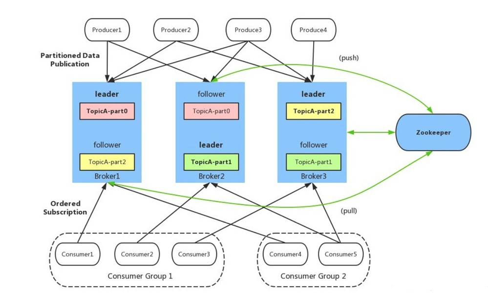
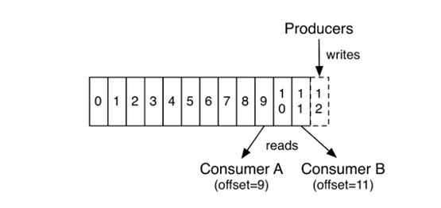
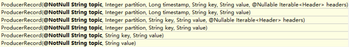
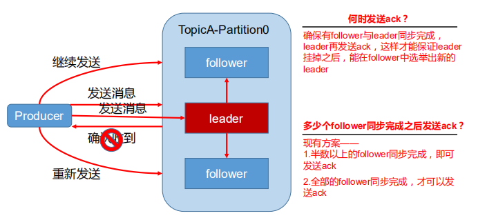
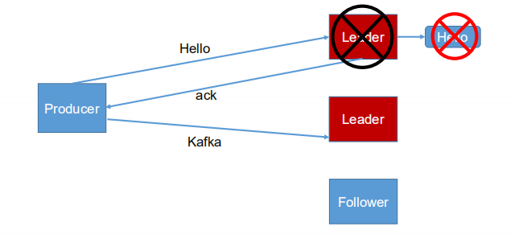
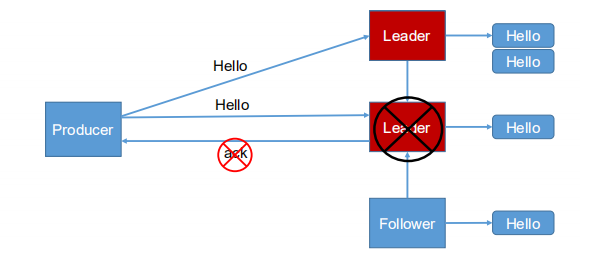
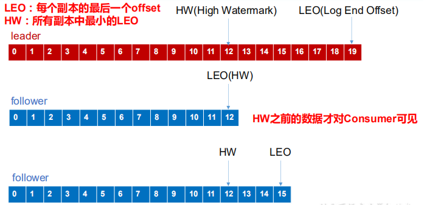
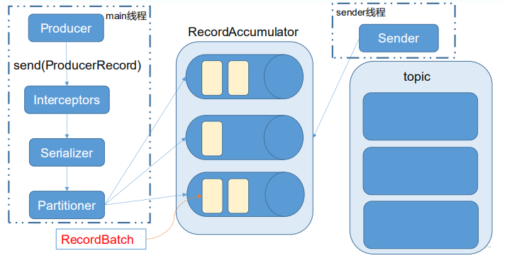
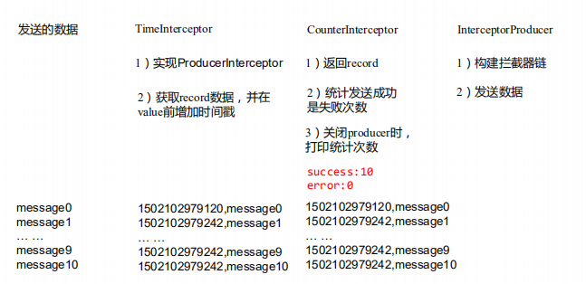

# Kafka

## 第 1 章 初识 Kafka

### 1.1 简介

官网：http://kafka.apache.org/


Apache Kafka 是一个分布式的流数据平台，三层含义：

- 消息系统（MQ）：发布和订阅流数据。
- 流数据处理（Streaming）：可以基于Kafka开发流数据处理的应用，用以实时处理流数据。
- 流数据存储（Store）：以一种安全分布式、冗余、容错的方式，存放数据。

Apache Kafka 典型的应用场景：

- 构建实时的流数据管道，用以在应用和应用之间进行可靠的数据传输
- 构建实时的流数据处理应用，用以传输或者处理流数据
- 作为流数据处理框架（Storm、Spark、Flink等）的数据源


### 1.2 Kafka的特性

- 高吞吐量、低延迟：kafka每秒可以处理几十万条消息，它的延迟最低只有几毫秒，每个topic可以分多个partition, consumer group 对partition进行consume操作。
- 可扩展性：kafka集群支持热扩展，无需停机。
- 持久性、可靠性：消息被持久化到本地磁盘，并且支持数据备份防止数据丢失。通过O(1)的磁盘数据结构提供消息的持久化，这种结构对于即使数以TB的消息存储也能够保持长时间的稳定性能。
- 容错性：允许集群中节点失败（若副本数量为n,则允许n-1个节点失败）。
- 高并发：支持数千个客户端同时读写。

### 1.3 Kafka的具体使用场景

- 日志收集：一个公司可以用Kafka可以收集各种服务的log，通过kafka以统一接口服务的方式开放给各种consumer，例如hadoop、Hbase、Solr等。
- 消息系统：解耦和生产者和消费者、缓存消息等。
- 用户活动跟踪：Kafka经常被用来记录web用户或者app用户的各种活动，如浏览网页、搜索、点击等活动，这些活动信息被各个服务器发布到kafka的topic中，然后订阅者通过订阅这些topic来做实时的监控分析，或者装载到hadoop、数据仓库中做离线分析和挖掘。
- 运营指标：Kafka也经常用来记录运营监控数据。包括收集各种分布式应用的数据，生产各种操作的集中反馈，比如报警和报告。
- 流式处理：流行的框架(如Storm和Spark Streaming)从主题中读取数据，对其进行处理，并将处理后的数据写入新主题，供用户和应用程序使用。 Kafka的强耐久性在流处理的上下文中也非常有用。

## 第 2 章 核心概念

### 2.1 Kafka架构

Kafka架构是一种生产者生产消息、kafka集群、消费者获取消息的架构，如下图：


工作图:



- Kafka Cluster（Kafka集群）

  Kafka有多个代理服务器broker被称为Kafka集群。可以扩展Kafka集群，无需停机。 这些集群用于管理消息数据的持久性和复制。

- Topic

  一个topic为一类消息，每条消息必须指定一个topic。物理上，一个topic分成一个或多个partition，每个partition有多个副本分布在不同的broker中。

  一个主题类似新闻中的体育、娱乐、教育等分类概念，在实际工程中通常一个业务一个主题。

  Topic分配partition和partition replica的算法：

  1. 将Broker（size=n）和待分配的Partition排序。

  2. 将第i个Partition分配到第（i%n）个Broker上。

  3. 将第i个Partition的第j个Replica分配到第（(i + j) % n）个Broker上

- 分区（Partition）

  一个Topic中的消息数据由多个分区构成，分区是kafka消息队列组织的最小单位，一个分区可以看作是一个FIFO（ First Input First Output的缩写，先入先出队列）的队列。每个分区消息具有称为 offset 的唯一序列标识。一个分区只存放Topic的部分数据。

  kafka分区是提高kafka性能的关键所在，当你发现你的集群性能不高时，常用手段就是增加Topic的分区，分区里面的消息是按照从新到老的顺序进行组织，消费者从队列头订阅消息，生产者从队列尾添加消息。

  kafka集群中的消息，是通过Topic（主题）来进行组织的，每个partition在存储层面是一个append log文件，发布到此partition的消息会追加到log文件的尾部，为顺序写人磁盘（顺序写磁盘比随机写内存的效率还要高）。每条消息在log文件中的位置成为offset（偏移量），offset为一个long型数字，唯一标记一条消息。

  Kafka集群使用可配置的保留期限持久保留所有已发布的记录（无论是否已使用它们）。例如，如果将保留策略设置为两天，则在发布记录后的两天内，该记录可供使用，之后将被丢弃以释放空间。Kafka的性能相对于数据大小实际上是恒定的，因此长时间存储数据不是问题。

  

  每个消费者唯一保存的元数据是offset值，这个位置完全为消费者控制，因此消费者可以采用任何顺序来消费记录，kafka中只能保证partition中记录是有序的，而不保证topic中不同partition的顺序。

  

  Kafka的消费者消费消息时，只保证在一个分区内的消息的完全有序性，并不保证同一个主题汇中多个分区的消息顺序。而且，消费者读取一个分区消息的顺序和生产者写入到这个分区的顺序是一致的。比如，生产者写入“hello”和“Kafka”两条消息到分区P1，则消费者读取到的顺序也一定是“hello”和“Kafka”。如果业务上需要保证所有消息完全一致，只能通过设置一个分区完成，但这种做法的缺点是最多只能有一个消费者进行消费。一般来说，只需要保证每个分区的有序性，再对消息假设键来保证相同键的所有消息落入同一分区，就可以满足绝大多数的应用。

- 备份（Replication）

  为了保证分布式可靠性，kafka0.8开始对每个分区的数据进行备份（不同的Broker上），防止其中一个Broker宕机造成分区上的数据不可用。副本从不读取或写入数据。 它们用于防止数据丢失，是对主分区数据的冗余备份，起到容错作用。

- Broker（代理/经纪人）

  Kafka服务实例，每一个Broker都有一个唯一标识。

  Kafka集群通常由多个代理组成以保持负载平衡。 Kafka代理是无状态的，所以他们使用ZooKeeper来维护它们的集群状态。 一个Kafka代理实例可以每秒处理数十万次读取和写入，每个Broker可以处理TB的消息，而没有性能影响。 Kafka经纪人领导选举可以由ZooKeeper完成。

- Leader（领导者）

  Leader 是负责给定分区的所有读取和写入的节点。每个分区都有一个服务器充当Leader。

  kafka会为partition选出一个leader，之后所有该partition的请求，实际操作的都是leader，然后再同步到其他的follower。当一个broker歇菜后，所有leader在该broker上的partition都会重新选举，选出一个leader。

- Follower（追随者）

  跟随领导者指令的节点被称为Follower。 如果领导失败，一个追随者将自动成为新的领导者。 跟随者作为正常消费者，拉取消息并更新其自己的数据存储。

- Producers（生产者）

  生产者是发送给broker一个或多个Kafka主题的消息的发布者。 每当生产者将消息发布给代理时，代理只需将消息附加到最后一个段文件。 实际上，该消息将被附加到分区。 生产者还可以向他们选择的分区发送消息。当新代理启动时，所有生产者搜索它并自动向该新代理发送消息。 Kafka生产者不等待来自代理的确认，并且发送消息的速度与代理可以处理的一样快。

- Consumers（消费者）

  Consumers从代理broker处读取数据。消费者订阅一个或多个主题，并通过从代理中提取数据来使用已发布的消息。

  每个Consumer属于一个特定的Consumer Group（可为每个Consumer指定group name，若不指定group name则属于默认的group）。

  一个partition，只能被消费组里的一个消费者消费，但是可以同时被多个消费组消费。

  因为Kafka代理是无状态的，这意味着消费者必须通过使用分区偏移来维护已经消耗了多少消息。 如果消费者确认特定的消息偏移，则意味着消费者已经消费了所有先前的消息。 消费者向代理发出异步拉取请求，以具有准备好消耗的字节缓冲区。 消费者可以简单地通过提供偏移值来快退或跳到分区中的任何点。 消费者偏移值由ZooKeeper通知。
  
  

### 2.2 Zookeeper在kafka的作用

Zookeeper是一种在分布式系统中被广泛用来作为**分布式状态管理**、**分布式协调管理**、**分布式配置管理**、和**分布式锁**服务的集群。kafka增加和减少服务器都会在Zookeeper节点上触发相应的事件，kafka系统会捕获这些事件，进行新一轮的负载均衡，客户端也会捕获这些事件来进行新一轮的处理。

Zookeeper是Kafka代理和消费者之间的协调接口。 Kafka服务器通过Zookeeper集群共享信息。 Kafka在Zookeeper中存储基本元数据，例如关于主题，代理，消费者偏移(队列读取器)等的信息。

由于所有关键信息存储在Zookeeper中，并且它通常在其整体上复制此数据，因此Kafka代理/ Zookeeper的故障不会影响Kafka集群的状态。 一旦Zookeeper重新启动，Kafka将恢复状态。 这为Kafka带来了零停机时间。 Kafka代理之间的领导者选举也通过使用Zookeeper在领导者失败的情况下完成。

ZooKeeper用于管理和协调Kafka代理。 ZooKeeper服务主要用于通知生产者和消费者Kafka系统中存在任何新代理或Kafka系统中代理失败。 根据Zookeeper接收到关于代理的存在或失败的通知，然后产品和消费者采取决定并开始与某些其他代理协调他们的任务。

## 第 3 章 快速入门

### 3.1 环境搭建


参考链接：https://blog.csdn.net/weizhonggui/article/details/87897129

### 3.2 命令行操作

#### 3.1.1 查看当前服务器中的所有topic

```shell
[root@thtf-01 ~]# kafka-topics --list --bootstrap-server thtf-01:9092 thtf-02:9092 thtf-03:9092
```

#### 3.1.2 创建topic

```shell
[root@thtf-01 ~]# kafka-topics --create --bootstrap-server thtf-01:9092 thtf-02:9092 thtf-03:9092 --topic t1 --partitions 3 --replication-factor 3
```

表示创建 t1 名称的topic，由3个leader主分区构成，每一个分区初本身之外有两个冗余备份。

#### 3.1.3 修改topic

```sh
[root@thtf-01 ~]# kafka-topics --alter --bootstrap-server thtf-01:9092 thtf-02:9092 thtf-03:9092 --topic t1 --partitions 5
```

修改主分区数量和复制因子（不能大于borker数）

#### 3.1.4 查看 topic 状态

```sh
[root@thtf-01 ~]# kafka-topics --describe --bootstrap-server thtf-01:9092 thtf-02:9092 thtf-03:9092 --topic t1
```

#### 3.1.4 删除topic

```sh
[root@thtf-01 ~]# kafka-topics --delete --bootstrap-server thtf-01:9092 thtf-02:9092 thtf-03:9092 --topic t1
```

#### 3.1.5 发布消息

```sh
[root@thtf-01 ~]# kafka-console-producer --broker-list thtf-01:9092 thtf-02:9092 thtf-03:9092 --topic t1
```

输入完后, 就可以不断输入消息了. 每一行一条消息. 最后按 `Ctrl-C` 退出。

#### 3.1.6 消费消息

```sh
[root@thtf-01 ~]# kafka-console-consumer --bootstrap-server thtf-01:9092 thtf-02:9092 thtf-03:9092 --topic t1 --from-beginning --property print.timestamp=true print.key=true
```

结果: CreateTime:1585833255895        hello

这里会输出上面产生的消息内容了。

注意：基于控制台的生产者：record key = null


## 第 4 章 Kafka 架构深入

### 4.1 Kafka 生产者

#### 4.1.1 分区策略

- **分区的原因**

  （1）方便在集群中扩展，每个 Partition 可以通过调整以适应它所在的机器，而一个 topic 又可以有多个 Partition 组成，因此整个集群就可以适应任意大小的数据了；

  （2）可以提高并发，因为可以以 Partition 为单位读写了。

- **分区的原则**

  我们需要将 producer 发送的数据封装成一个 **ProducerRecord** 对象。

  

  （1）指明 partition 的情况下，直接将指明的值直接作为 partiton 值；

  （2）没有指明 partition 值但有 key 的情况下，将 key 的 hash 值与 topic 的 partition 数进行取余得到 partition 值；

  （3）既没有 partition 值又没有 key 值的情况下，消息随机发送到各个分区（各个版本会有不同，有的是采用轮询的方式，有的是随机，有的是一定时间内只发送给固定partition,隔一段时间后随机换一个）

#### 4.1.2 数据可靠性保障

为保证 producer 发送的数据，能可靠的发送到指定的 topic，topic 的每个 partition 收到 producer 发送的数据后，都需要向 producer 发送 ack（acknowledgement 确认收到），如果 producer 收到 ack，就会进行下一轮的发送，否则重新发送数据。



- **副本数据同步策略**

| 方案                         | 优点   | 缺点                                                      |
| ---------------------------- | ------ | --------------------------------------------------------- |
| 半数以上完成同步，就发送 ack | 延迟低 | 选举新的 leader 时，容忍 n 台节点的故障，需要 2n+1 个副本 |
| 全部完成同步，才发送 ack     | 延迟高 | 选举新的 leader 时，容忍 n 台节点的故障，需要 n+1 个副本  |

​	Kafka 选择了第二种方案，原因如下：

1. 同样为了容忍 n 台节点的故障，第一种方案需要 2n+1 个副本，而第二种方案只需要 n+1个副本，而 Kafka 的每个分区都有大量的数据，第一种方案会造成大量数据的冗余。

2. 虽然第二种方案的网络延迟会比较高，但网络延迟对 Kafka 的影响较小

   

- **ISR**

  采用第二种方案之后，设想以下情景：leader 收到数据，所有 follower 都开始同步数据，但有一个 follower，因为某种故障，迟迟不能与 leader 进行同步，那 leader 就要一直等下去，直到它完成同步，才能发送 ack。这个问题怎么解决呢？

  Leader 维护了一个动态的 in-sync replica set (ISR)，意为和 leader 保持同步的 follower 集合。当 ISR 中的 follower 完成数据的同步之后，leader 就会给 follower 发送 ack。如果 follower长时间未向 leader 同步数 据 ， 则 该 follower 将被踢出 ISR ， 该时间阈值由**replica.lag.time.max.ms** 参数设定。Leader 发生故障之后，就会从 ISR 中选举新的 leader。


- **ack** **应答机制**

  对于某些不太重要的数据，对数据的可靠性要求不是很高，能够容忍数据的少量丢失，所以没必要等 ISR 中的 follower 全部接收成功。

  所以 Kafka 为用户提供了三种可靠性级别，用户根据对可靠性和延迟的要求进行权衡，选择以下的配置。

  - **acks** **参数配置：acks**

    0：producer 不等待 broker 的 ack，这一操作提供了一个最低的延迟，broker 一接收到还没有写入磁盘	就已经返回，当 broker 故障时有可能**丢失数据**； 

    1：producer 等待 broker 的 ack，partition 的 leader 落盘成功后返回 ack，如果在 follower 同步成功之前 leader 故障，那么将会**丢失数据**；

    

    -1（all）：producer 等待 broker 的 ack，partition 的 leader 和 follower 全部落盘成功后才返回 ack。但是如果在 follower 同步完成后，broker 发送 ack 之前，leader 发生故障，那么会造成**数据重复**。

- **故障处理细节**

  Log文件中的HW和LEO

  

  **LEO**：指的是每个副本最大的**offset**

  **HW**：指的是消费者能见到的最大的 **offset**，**ISR **队列中最小的 **LEO**。

  **(1) follower 故障**

  follower 发生故障后会被临时踢出 ISR，待该 follower 恢复后，follower 会读取本地磁盘记录的上次的 HW，并将 log 文件高于 HW 的部分截取掉，从 HW 开始向 leader 进行同步。等该 **follower** **的** **LEO** **大于等于该** **Partition** **的** **HW**，即 follower 追上 leader 之后，就可以重新加入 ISR 了。

  **(2) leader 故障**

  leader 发生故障之后，会从 ISR 中选出一个新的 leader，之后，为保证多个副本之间的数据一致性，其余的 follower 会先将各自的 log 文件高于 HW 的部分截掉，然后从新的 leader同步数据。

  **注意：这只能保证副本之间的数据一致性，并不能保证数据不丢失或者不重复。**

  

#### 4.1.3 **Exactly Once** 语义（精准一次）

将服务器的 ACK 级别设置为-1，可以保证 Producer 到 Server 之间不会丢失数据，即 AtLeast Once 语义。相对的，将服务器 ACK 级别设置为 0，可以保证生产者每条消息只会被发送一次，即 At Most Once 语义。

At Least Once 可以保证数据不丢失，但是不能保证数据不重复；相对的，At Most Once可以保证数据不重复，但是不能保证数据不丢失。但是，对于一些非常重要的信息，比如说交易数据，下游数据消费者要求数据既不重复也不丢失，即 Exactly Once 语义。在 0.11 版本以前的 Kafka，对此是无能为力的，只能保证数据不丢失，再在下游消费者对数据做全局去重。对于多个下游应用的情况，每个都需要单独做全局去重，这就对性能造成了很大影响。

0.11 版本的 Kafka，引入了一项重大特性：幂等性。所谓的幂等性就是指 Producer 不论向 Server 发送多少次重复数据，Server 端都只会持久化一条。幂等性结合 At Least Once 语义，就构成了 Kafka 的 Exactly Once 语义。即：At Least Once + **幂等性** = Exactly Once

要启用幂等性，只需要将 Producer 的参数中 **enable.idompotence** 设置为 true 即可。Kafka的幂等性实现其实就是将原来下游需要做的去重放在了数据上游。开启幂等性的 Producer 在初始化的时候会被分配一个 PID（producer id），发往同一 Partition 的消息会附带 Sequence Number。而Broker 端会对<PID, Partition, SeqNumber>做缓存，当具有相同主键的消息提交时，Broker 只会持久化一条。

但是 PID 重启就会变化，同时不同的 Partition 也具有不同主键，所以幂等性无法保证跨分区跨会话的 Exactly Once。


### 4.2 Kafka 消费者

#### 4.2.1 消费方式

- consumer 采用 **pull（拉）**模式从 broker 中读取数据。

- push（推）模式很难适应消费速率不同的消费者，因为消息发送速率是由 broker 决定的。它的目标是尽可能以最快速度传递消息，但是这样很容易造成 consumer 来不及处理消息，典型的表现就是拒绝服务以及网络拥塞。而 pull 模式则可以根据 consumer 的消费能力以适当的速率消费消息。

pull 模式不足之处是，如果 kafka 没有数据，消费者可能会陷入循环中，一直返回空数据。针对这一点，Kafka 的消费者在消费数据时会传入一个时长参数 **timeout**，如果当前没有数据可供消费，consumer 会等待一段时间之后再返回，这段时长即为 timeout。


#### 4.2.2 分区分配策略

一个 consumer group 中有多个 consumer，一个 topic 有多个 partition，所以必然会涉及到 partition 的分配问题，即确定那个 partition 由哪个 consumer 来消费。

Kafka 有两种分配策略，一是 **RoundRobin **，一是  **Range **。 

- **Range 范围分区(默认的)**

  假如有10个分区，3个消费者，把分区按照序号排列0，1，2，3，4，5，6，7，8，9；消费者为C1,C2,C3，那么用分区数除以消费者数来决定每个Consumer消费几个Partition，除不尽的前面几个消费者将会多消费一个, 最后分配结果如下:

  ```
  C1：0，1，2，3
  C2：4，5，6
  C3：7，8，9
  ```

  如果有11个分区将会是：

  ```
  C1：0，1，2，3
  C2：4，5，6，7
  C3：8，9，10
  ```

  假如我们有两个主题T1,T2，分别有10个分区，最后的分配结果将会是这样：

  ```
  C1：T1（0，1，2，3） T2（0，1，2，3）
  C2：T1（4，5，6） T2（4，5，6）
  C3：T1（7，8，9） T2（7，8，9）
  ```

  这就是消费的策略！ 就是用**总的分区数/消费者线程总数=每个消费者线程应该消费的分区数**。当还有余数的时候就将余数分别分发到另外的消费组线程中。 

  在这里我们不难看出来。C1消费者线程比其他消费者线程多消费了两个分区，这就是Range Strategy的一个明显的弊端：分配并不均匀，如果将类似的情形扩大，有可能会出现部分消费者过载的情况。

- **RoundRobin 轮询分区**

  RoundRobinAssignor策略的原理是将消费组内所有消费者以及消费者所订阅的所有topic的partition按照字典序排序，然后通过轮询方式逐个将分区以此分配给每个消费者。RoundRobinAssignor策略对应的partition.assignment.strategy参数值为：org.apache.kafka.clients.consumer.RoundRobinAssignor。

  如果同一个消费组内所有的消费者的订阅信息都是相同的，那么RoundRobinAssignor策略的分区分配会是均匀的。举例，假设消费组中有2个消费者C0和C1，都订阅了主题t0和t1，并且每个主题都有3个分区，那么所订阅的所有分区可以标识为：t0p0、t0p1、t0p2、t1p0、t1p1、t1p2。最终的分配结果为：
  
  ```
  C0：t0p0、t0p2、t1p1 
  C1：t0p1、t1p0、t1p2
  ```
  
  如果同一个消费组内的消费者所订阅的信息是不相同的，那么在执行分区分配的时候就不是完全的轮询分配，有可能会导致分区分配的不均匀。如果某个消费者没有订阅消费组内的某个topic，那么在分配分区的时候此消费者将分配不到这个topic的任何分区。
  
  举例，假设消费组内有3个消费者C0、C1和C2，它们共订阅了3个主题：t0、t1、t2，这3个主题分别有1、2、3个分区，即整个消费组订阅了t0p0、t1p0、t1p1、t2p0、t2p1、t2p2这6个分区。具体而言，消费者C0订阅的是主题t0，消费者C1订阅的是主题t0和t1，消费者C2订阅的是主题t0、t1和t2，那么最终的分配结果为：
  
  ```
  C0：t0p0
  C1：t1p0 
  C2：t1p1、t2p0、t2p1、t2p2
  ```
  
  可以看到RoundRobinAssignor策略也不是十分完美，这样分配其实并不是最优解，因为完全可以将分区t1p1分配给消费者C1。
  
- **StickyAssignor分配策略**

  我们再来看一下StickyAssignor策略，“sticky”这个单词可以翻译为“粘性的”，Kafka从0.11.x版本开始引入这种分配策略，它主要有两个目的：

  1. 分区的分配要尽可能的均匀；
  2. 分区的分配尽可能的与上次分配的保持相同。
     当两者发生冲突时，第一个目标优先于第二个目标。鉴于这两个目标，StickyAssignor策略的具体实现要比RangeAssignor和RoundRobinAssignor这两种分配策略要复杂很多。我们举例来看一StickyAssignor策略的实际效果。

  假设消费组内有3个消费者：C0、C1和C2，它们都订阅了4个主题：t0、t1、t2、t3，并且每个主题有2个分区，也就是说整个消费组订阅了t0p0、t0p1、t1p0、t1p1、t2p0、t2p1、t3p0、t3p1这8个分区。最终的分配结果如下：

  ```
  C0：t0p0、t1p1、t3p0
  C1：t0p1、t2p0、t3p1
  C2：t1p0、t2p1
  ```

  这样初看上去似乎与采用RoundRobinAssignor策略所分配的结果相同，但事实是否真的如此呢？再假设此时消费者C1脱离了消费组，那么消费组就会执行再平衡操作，进而消费分区会重新分配。如果采用RoundRobinAssignor策略，那么此时的分配结果如下：

  ```
  C0：t0p0、t1p0、t2p0、t3p0
  C2：t0p1、t1p1、t2p1、t3p1
  ```

  如分配结果所示，RoundRobinAssignor策略会按照消费者C0和C2进行重新轮询分配。而如果此时使用的是StickyAssignor策略，那么分配结果为：

  ```
  C0：t0p0、t1p1、t3p0、t2p0
  C2：t1p0、t2p1、t0p1、t3p1
  ```

  可以看到分配结果中保留了上一次分配中对于消费者C0和C2的所有分配结果，并将原来消费者C1的“负担”分配给了剩余的两个消费者C0和C2，最终C0和C2的分配还保持了均衡。

  如果发生分区重分配，那么对于同一个分区而言有可能之前的消费者和新指派的消费者不是同一个，对于之前消费者进行到一半的处理还要在新指派的消费者中再次复现一遍，这显然很浪费系统资源。StickyAssignor策略如同其名称中的“sticky”一样，让分配策略具备一定的“粘性”，尽可能地让前后两次分配相同，进而减少系统资源的损耗以及其它异常情况的发生。

  到目前为止所分析的都是消费者的订阅信息都是相同的情况，我们来看一下订阅信息不同的情况下的处理。

  举例，同样消费组内有3个消费者：C0、C1和C2，集群中有3个主题：t0、t1和t2，这3个主题分别有1、2、3个分区，也就是说集群中有t0p0、t1p0、t1p1、t2p0、t2p1、t2p2这6个分区。消费者C0订阅了主题t0，消费者C1订阅了主题t0和t1，消费者C2订阅了主题t0、t1和t2。

  如果此时采用RoundRobinAssignor策略，那么最终的分配结果如下所示（和讲述RoundRobinAssignor策略时的一样，这样不妨赘述一下）：

  ```
  【分配结果集1】
   C0：t0p0
   C1：t1p0
   C2：t1p1、t2p0、t2p1、t2p2
  ```

  如果此时采用的是StickyAssignor策略，那么最终的分配结果为：

  ```
  【分配结果集2】
   C0：t0p0
   C1：t1p0、t1p1
   C2：t2p0、t2p1、t2p2
  ```

  可以看到这是一个最优解（消费者C0没有订阅主题t1和t2，所以不能分配主题t1和t2中的任何分区给它，对于消费者C1也可同理推断）。
  假如此时消费者C0脱离了消费组，那么RoundRobinAssignor策略的分配结果为：

  ```
  C1：t0p0、t1p1
  C2：t1p0、t2p0、t2p1、t2p2
  ```

  可以看到RoundRobinAssignor策略保留了消费者C1和C2中原有的3个分区的分配：t2p0、t2p1和t2p2（针对结果集1）。而如果采用的是StickyAssignor策略，那么分配结果为：

  ```
  C1：t1p0、t1p1、t0p0
  C2：t2p0、t2p1、t2p2
  ```

  可以看到StickyAssignor策略保留了消费者C1和C2中原有的5个分区的分配：t1p0、t1p1、t2p0、t2p1、t2p2。

  从结果上看StickyAssignor策略比另外两者分配策略而言显得更加的优异，这个策略的代码实现也是异常复杂，如果读者没有接触过这种分配策略，不妨使用一下来尝尝鲜。

  **什么时候触发分区分配策略：**

  1. 同一个Consumer Group内新增或减少Consumer
  2. Topic分区发生变化

#### 4.2.3 offset 的维护

由于 consumer 在消费过程中可能会出现断电宕机等故障，consumer 恢复后，需要从故障前的位置的继续消费，所以 consumer 需要实时记录自己消费到了哪个 offset，以便故障恢复后继续消费。

Kafka 0.9 版本之前，consumer 默认将 offset 保存在 Zookeeper 中，从 0.9 版本开始，consumer 默认将 offset 保存在 Kafka 一个内置的 topic 中，该 topic 为**__consumer_offsets**。

1）修改配置文件 consumer.properties

```properties
exclude.internal.topics=false
```


#### 4.2.4 消费者组

同一个消费者组中的消费者，同一时刻只能有一个消费者消费。


### 4.3 Kafka 高效读写数据

#### 4.3.1 顺序写磁盘

Kafka 的 producer 生产数据，要写入到 log 文件中，写的过程是一直追加到文件末端，为顺序写。官网有数据表明，同样的磁盘，顺序写能到 600M/s，而随机写只有 100K/s。这与磁盘的机械机构有关，顺序写之所以快，是因为其省去了大量磁头寻址的时间。 

#### 4.3.2 零复制技术

https://blog.csdn.net/my_momo_csdn/article/details/89492890


### 4.4 Kafka 事务

Kafka 从 0.11 版本开始引入了事务支持。事务可以保证 Kafka 在 Exactly Once 语义的基础上，生产和消费可以跨分区和会话，要么全部成功，要么全部失败。

#### 4.4.1 Producer 事务

为了实现跨分区跨会话的事务，需要引入一个全局唯一的 Transaction ID（客户端提供），并将 Producer获得的PID 和Transaction ID 绑定。这样当Producer 重启后就可以通过正在进行的 Transaction ID 获得原来的 PID。

为了管理 Transaction，Kafka 引入了一个新的组件 Transaction Coordinator。Producer 就是通过和 Transaction Coordinator 交互获得 Transaction ID 对应的任务状态。TransactionCoordinator 还负责将事务所有写入 Kafka 的一个内部 Topic，这样即使整个服务重启，由于事务状态得到保存，进行中的事务状态可以得到恢复，从而继续进行。

#### 4.4.2 Consumer 事务

上述事务机制主要是从 Producer 方面考虑，对于 Consumer 而言，事务的保证就会相对较弱，尤其时无法保证 Commit 的信息被精确消费。这是由于 Consumer 可以通过 offset 访问任意信息，而且不同的 Segment File 生命周期不同，同一事务的消息可能会出现重启后被删除的情况。


## 第 5 章 Kafka API

### 5.1 Producer API

#### 5.1.1 消息发送流程

Kafka 的 Producer 发送消息采用的是**异步发送**的方式。在消息发送的过程中，涉及到了**两个线程——main 线程和 Sender 线程**，以及**一个线程共享变量——RecordAccumulator**。main 线程将消息发送给 RecordAccumulator，Sender 线程不断从 RecordAccumulator 中拉取消息发送到 Kafka broker。



**相关参数：**

- **batch.size**：只有数据积累到 batch.size 之后，sender 才会发送数据。

- **linger.ms**：如果数据迟迟未达到 batch.size，sender 等待 linger.time 之后就会发送数据。

#### 5.1.2 异步发送 API

1. 导入依赖

   ```xml
   <!-- https://mvnrepository.com/artifact/org.apache.kafka/kafka-clients -->
   <dependency>
   	<groupId>org.apache.kafka</groupId>
   	<artifactId>kafka-clients</artifactId>
   	<version>2.3.0</version>
   </dependency>
   ```

2. 编写代码

   需要用到的类：

   **KafkaProducer**：需要创建一个生产者对象，用来发送数据

   **ProducerConfig**：获取所需的一系列配置参数

   **ProducerRecord**：每条数据都要封装成一个 ProducerRecord 对象

   **a. 不带回调函数的** **API**：

   ```java
   package com.pyy.kafka.basic;
   
   import org.apache.kafka.clients.producer.KafkaProducer;
   import org.apache.kafka.clients.producer.Partitioner;
   import org.apache.kafka.clients.producer.ProducerConfig;
   import org.apache.kafka.clients.producer.ProducerRecord;
   import org.apache.kafka.common.Cluster;
   import org.apache.kafka.common.serialization.StringSerializer;
   
   import java.awt.datatransfer.StringSelection;
   import java.util.Map;
   import java.util.Properties;
   
   /**
    * ---------------------------
    * 生成者
    * ---------------------------
    * 作者：  pyy
    * 时间：  2020-04-03 18:02
    * 版本：  v1.0
    * ---------------------------
    */
   public class ProducerDemo {
       public static void main(String[] args) {
           // 生产者配置信息
           Properties prop = new Properties();
           // 指定Kafka集群
           prop.put(ProducerConfig.BOOTSTRAP_SERVERS_CONFIG, "thtf-01:9092, thtf-02:9092, thtf-03:9092");
           // ACK应答级别
           prop.put(ProducerConfig.ACKS_CONFIG, "all");
           // 重试次数
           prop.put(ProducerConfig.RETRIES_CONFIG, 3);
           // 批次大小 16K
           prop.put(ProducerConfig.BATCH_SIZE_CONFIG, 16384);
           // 批次大小 默认值16KB
           prop.put(ProducerConfig.BATCH_SIZE_CONFIG, 16384);
           // 缓冲区大小 默认值32MB
           prop.put(ProducerConfig.BUFFER_MEMORY_CONFIG, 33554432);
           // 等待时间 单位ms
           prop.put(ProducerConfig.LINGER_MS_CONFIG, 1);
   
           // Key,Value 的序列化类
           prop.put(ProducerConfig.KEY_SERIALIZER_CLASS_CONFIG, StringSerializer.class);
           prop.put(ProducerConfig.VALUE_SERIALIZER_CLASS_CONFIG, StringSerializer.class);
   
           // 创建生产者对象
           KafkaProducer<String, String> producer = new KafkaProducer<String, String>(prop);
   
           // 通过生产者发布消息
           for(int i = 0; i < 10; i++) {
               producer.send(new ProducerRecord<>("t1", i + "", "hello " + i));
               System.out.println("消息" + i);
           }
   
           // 释放资源：此时发送条件没达到，这里也会强制将缓存中的消息发送出去
           producer.flush();
           producer.close();
       }
   }
   ```

   **b. 带回调函数的 API  **

   回调函数会在 producer 收到 ack 时调用，为异步调用，该方法有两个参数，分别是 RecordMetadata 和 Exception，如果 Exception 为 null，说明消息发送成功，如果 Exception 不为 null，说明消息发送失败。

   > 注意：消息发送失败会自动重试，不需要我们在回调函数中手动重试。

   ```java
   package com.pyy.kafka.basic;
   
   import org.apache.kafka.clients.producer.KafkaProducer;
   import org.apache.kafka.clients.producer.Partitioner;
   import org.apache.kafka.clients.producer.ProducerConfig;
   import org.apache.kafka.clients.producer.ProducerRecord;
   import org.apache.kafka.common.Cluster;
   import org.apache.kafka.common.serialization.StringSerializer;
   
   import java.awt.datatransfer.StringSelection;
   import java.util.Map;
   import java.util.Properties;
   
   /**
    * ---------------------------
    * 生成者
    * ---------------------------
    * 作者：  pyy
    * 时间：  2020-04-03 18:02
    * 版本：  v1.0
    * ---------------------------
    */
   public class ProducerDemo {
       public static void main(String[] args) {
           // 生产者配置信息
           Properties prop = new Properties();
           // 指定Kafka集群
           prop.put(ProducerConfig.BOOTSTRAP_SERVERS_CONFIG, "thtf-01:9092, thtf-02:9092, thtf-03:9092");
           // ACK应答级别
           prop.put(ProducerConfig.ACKS_CONFIG, "all");
           // 重试次数
           prop.put(ProducerConfig.RETRIES_CONFIG, 1);
           // 批次大小 默认值16KB
           prop.put(ProducerConfig.BATCH_SIZE_CONFIG, 16384);
           // 缓冲区大小 默认值32MB
           prop.put(ProducerConfig.BUFFER_MEMORY_CONFIG, 33554432);
           // 等待时间 单位ms
           prop.put(ProducerConfig.LINGER_MS_CONFIG, 1);
   
           // Key,Value 的序列化类
           prop.put(ProducerConfig.KEY_SERIALIZER_CLASS_CONFIG, StringSerializer.class);
           prop.put(ProducerConfig.VALUE_SERIALIZER_CLASS_CONFIG, StringSerializer.class);
   
           // 创建生产者对象
           KafkaProducer<String, String> producer = new KafkaProducer<>(prop);
   
           // 通过生产者发布消息
           for(int i = 0; i < 10; i++) {
               producer.send(new ProducerRecord<>("t1", i + "", "hello " + i),
                   (metadata, exception) -> {
                       if (exception == null) {
                           System.out.println("success ->" + metadata.partition() + "--" +metadata.offset());
                       } else {
                           exception.printStackTrace();
                       }
                   }
               );
           }
   
           // 释放资源
           producer.flush();
           producer.close();
       }
   }
   ```

   

   #### 5.1.3 **同步发送** API

   同步发送的意思就是，一条消息发送之后，会阻塞当前线程，直至返回 ack。

   由于 send 方法返回的是一个 Future 对象，根据 Futrue 对象的特点，我们也可以实现同步发送的效果，只需在调用 Future 对象的 get 方发即可。

   ```java
   package com.pyy.kafka.basic;
   
   import org.apache.kafka.clients.producer.*;
   import org.apache.kafka.common.Cluster;
   import org.apache.kafka.common.serialization.StringSerializer;
   
   import java.awt.datatransfer.StringSelection;
   import java.util.Map;
   import java.util.Properties;
   import java.util.concurrent.ExecutionException;
   import java.util.concurrent.Future;
   
   /**
    * ---------------------------
    * 生成者
    * ---------------------------
    * 作者：  pyy
    * 时间：  2020-04-03 18:02
    * 版本：  v1.0
    * ---------------------------
    */
   public class ProducerDemo {
       public static void main(String[] args) throws ExecutionException, InterruptedException {
           // 生产者配置信息
           Properties prop = new Properties();
           // 指定Kafka集群
           prop.put(ProducerConfig.BOOTSTRAP_SERVERS_CONFIG, "thtf-01:9092, thtf-02:9092, thtf-03:9092");
           // ACK应答级别
           prop.put(ProducerConfig.ACKS_CONFIG, "all");
           // 重试次数
           prop.put(ProducerConfig.RETRIES_CONFIG, 1);
           // 批次大小 默认值16KB
           prop.put(ProducerConfig.BATCH_SIZE_CONFIG, 16384);
           // 缓冲区大小 默认值32MB
           prop.put(ProducerConfig.BUFFER_MEMORY_CONFIG, 33554432);
           // 等待时间 单位ms
           prop.put(ProducerConfig.LINGER_MS_CONFIG, 1);
   
           // Key,Value 的序列化类
           prop.put(ProducerConfig.KEY_SERIALIZER_CLASS_CONFIG, StringSerializer.class);
           prop.put(ProducerConfig.VALUE_SERIALIZER_CLASS_CONFIG, StringSerializer.class);
   
           // 创建生产者对象
           KafkaProducer<String, String> producer = new KafkaProducer<>(prop);
   
           // 通过生产者发布消息
           for(int i = 0; i < 10; i++) {
               Future<RecordMetadata> future = producer.send(new ProducerRecord<>("t1", i + "", "hello " + i));
               // 手动阻塞线程
               RecordMetadata recordMetadata = future.get();
           }
   
           // 释放资源
           producer.flush();
           producer.close();
       }
   }
   ```

   使用此种方式加一个分区可以实现全局消息同步问题。

   

   

### 5.2 Consumer API

Consumer 消费数据时的可靠性是很容易保证的，因为数据在 Kafka 中是持久化的，故不用担心数据丢失问题。

由于 consumer 在消费过程中可能会出现断电宕机等故障，consumer 恢复后，需要从故障前的位置的继续消费，所以 consumer 需要实时记录自己消费到了哪个 offset，以便故障恢复后继续消费。

所以 offset 的维护是 Consumer 消费数据是必须考虑的问题。

#### 5.2.1 自动提交 offset

需要用到的类：

**KafkaConsumer**：需要创建一个消费者对象，用来消费数据

**ConsumerConfig**：获取所需的一系列配置参数

**ConsuemrRecord**：每条数据都要封装成一个 ConsumerRecord 对象

为了使我们能够专注于自己的业务逻辑，Kafka 提供了自动提交 offset 的功能。

自动提交 offset 的相关参数：

**enable.auto.commit**：是否开启自动提交 offset 功能

**auto.commit.interval.ms**：自动提交 offset 的时间间隔

以下为自动提交 offset 的代码：

```java
package com.pyy.kafka.basic;

import org.apache.kafka.clients.consumer.ConsumerConfig;
import org.apache.kafka.clients.consumer.ConsumerRecords;
import org.apache.kafka.clients.consumer.KafkaConsumer;
import org.apache.kafka.clients.producer.ProducerConfig;
import org.apache.kafka.common.serialization.StringDeserializer;
import org.apache.kafka.common.serialization.StringSerializer;

import java.time.Duration;
import java.util.Arrays;
import java.util.Properties;

/**
 * ---------------------------
 * 消费者
 * ---------------------------
 * 作者：  pyy
 * 时间：  2020-04-03 19:14
 * 版本：  v1.0
 * ---------------------------
 */
public class ConsumerDemo {

    public static void main(String[] args) {
        // 消费者配置信息
        Properties prop = new Properties();
        prop.put(ConsumerConfig.BOOTSTRAP_SERVERS_CONFIG, "thtf-01:9092, thtf-02:9092, thtf-03:9092");

        // 消费组编号 不同组广播 同组负载均衡
        prop.put(ConsumerConfig.GROUP_ID_CONFIG, "group_1");
        // 开启自动提交
        prop.put("enable.auto.commit", true);
        // 自动提交 offset 延迟，默认1000ms
        prop.put("auto.commit.interval.ms", 1000);

        // Key，Value反序列化
        prop.put(ConsumerConfig.KEY_DESERIALIZER_CLASS_CONFIG, StringDeserializer.class);
        prop.put(ConsumerConfig.VALUE_DESERIALIZER_CLASS_CONFIG, StringDeserializer.class);

        // 消费者对象
        KafkaConsumer<String, String> consumer = new KafkaConsumer<String, String>(prop);
        // 订阅主题
        consumer.subscribe(Arrays.asList("t1"));

        // 循环拉取 t1 中新增的数据
        while(true) {
            ConsumerRecords<String, String> records = consumer.poll(Duration.ofSeconds(5));
            records.forEach(record -> {
                System.out.println(
                        "key:" + record.key()
                        + "\t value:" + record.value()
                        + "\t timestamp:" + record.timestamp()
                        + "\t offset:" + record.offset()
                        + "\t partition:" + record.partition()
                        + "\t topic:" + record.topic());
            });
        }
    }
}

```

#### 5.2.2 重置 offset

通过源码我们得知默认，offset 默认为 latest

```java
public static final String AUTO_OFFSET_RESET_CONFIG = "auto.offset.reset";
public static final String AUTO_OFFSET_RESET_DOC = "What to do when there is no initial offset in Kafka or if the current offset does not exist any more on the server (e.g. because that data has been deleted): <ul><li>earliest: automatically reset the offset to the earliest offset<li>latest: automatically reset the offset to the latest offset</li><li>none: throw exception to the consumer if no previous offset is found for the consumer's group</li><li>anything else: throw exception to the consumer.</li></ul>";
```

```java
prop.put(ConsumerConfig.AUTO_OFFSET_RESET_CONFIG, "earliest");
```

**如何重新消费?**

1. 更换组
2. 设置 `auto.offset.reset=earliest`

#### 5.2.3 **手动提交** offset

虽然自动提交 offset 十分简介便利，但由于其是基于时间提交的，开发人员难以把握offset 提交的时机。因此 Kafka 还提供了手动提交 offset 的 API。

手动提交 offset 的方法有两种：分别是 commitSync（同步提交）和 commitAsync（异步提交）。两者的相同点是，都会将**本次** **poll** **的一批数据最高的偏移量提交**；不同点是，commitSync 阻塞当前线程，一直到提交成功，并且会自动失败重试（由不可控因素导致，也会出现提交失败）；而 commitAsync 则没有失败重试机制，故有可能提交失败。

1. **同步提交 offset**

   由于同步提交 offset 有失败重试机制，故更加可靠，以下为同步提交 offset 的示例:

   ```java
   package com.pyy.kafka.basic;
   
   import org.apache.kafka.clients.consumer.ConsumerConfig;
   import org.apache.kafka.clients.consumer.ConsumerRecords;
   import org.apache.kafka.clients.consumer.KafkaConsumer;
   import org.apache.kafka.clients.producer.ProducerConfig;
   import org.apache.kafka.common.serialization.StringDeserializer;
   import org.apache.kafka.common.serialization.StringSerializer;
   
   import java.time.Duration;
   import java.util.Arrays;
   import java.util.Properties;
   
   /**
    * ---------------------------
    * 消费者
    * ---------------------------
    * 作者：  pyy
    * 时间：  2020-04-03 19:14
    * 版本：  v1.0
    * ---------------------------
    */
   public class ConsumerDemo {
   
       public static void main(String[] args) {
           // 消费者配置信息
           Properties prop = new Properties();
           prop.put(ConsumerConfig.BOOTSTRAP_SERVERS_CONFIG, "thtf-01:9092, thtf-02:9092, thtf-03:9092");
   
           // 消费组编号 不同组广播 同组负载均衡
           prop.put(ConsumerConfig.GROUP_ID_CONFIG, "group_1");
           prop.put("enable.auto.commit", false);//关闭自动提交 offset
   
           // Key，Value反序列化
           prop.put(ConsumerConfig.KEY_DESERIALIZER_CLASS_CONFIG, StringDeserializer.class);
           prop.put(ConsumerConfig.VALUE_DESERIALIZER_CLASS_CONFIG, StringDeserializer.class);
   
           // 消费者对象
           KafkaConsumer<String, String> consumer = new KafkaConsumer<String, String>(prop);
           // 订阅主题
           consumer.subscribe(Arrays.asList("t1"));
   
           // 循环拉取 t1 中新增的数据
           while(true) {
               ConsumerRecords<String, String> records = consumer.poll(Duration.ofSeconds(5));
               records.forEach(record -> {
                   System.out.println(
                           "key:" + record.key()
                           + "\t value:" + record.value()
                           + "\t timestamp:" + record.timestamp()
                           + "\t offset:" + record.offset()
                           + "\t partition:" + record.partition()
                           + "\t topic:" + record.topic());
               });
               //同步提交，当前线程会阻塞直到 offset 提交成功
               consumer.commitSync();
           }
       }
   }
   ```
   

   
2. **异步提交 offset**

   虽然同步提交 offset 更可靠一些，但是由于其会阻塞当前线程，直到提交成功。因此吞吐量会收到很大影响。因此更多的情况下，会选用异步提交 offset 的方式。以下为异步提交 offset 的示例：

   ```java
   package com.pyy.kafka.basic;
   
   import org.apache.kafka.clients.consumer.ConsumerConfig;
   import org.apache.kafka.clients.consumer.ConsumerRecords;
   import org.apache.kafka.clients.consumer.KafkaConsumer;
   import org.apache.kafka.clients.producer.ProducerConfig;
   import org.apache.kafka.common.serialization.StringDeserializer;
   import org.apache.kafka.common.serialization.StringSerializer;
   
   import java.time.Duration;
   import java.util.Arrays;
   import java.util.Properties;
   
   /**
    * ---------------------------
    * 消费者
    * ---------------------------
    * 作者：  pyy
    * 时间：  2020-04-03 19:14
    * 版本：  v1.0
    * ---------------------------
    */
   public class ConsumerDemo {
   
       public static void main(String[] args) {
           // 消费者配置信息
           Properties prop = new Properties();
           prop.put(ConsumerConfig.BOOTSTRAP_SERVERS_CONFIG, "thtf-01:9092, thtf-02:9092, thtf-03:9092");
   
           // 消费组编号 不同组广播 同组负载均衡
           prop.put(ConsumerConfig.GROUP_ID_CONFIG, "group_1");
           prop.put("enable.auto.commit", false);//关闭自动提交 offset
   
           // Key，Value反序列化
           prop.put(ConsumerConfig.KEY_DESERIALIZER_CLASS_CONFIG, StringDeserializer.class);
           prop.put(ConsumerConfig.VALUE_DESERIALIZER_CLASS_CONFIG, StringDeserializer.class);
   
           // 消费者对象
           KafkaConsumer<String, String> consumer = new KafkaConsumer<String, String>(prop);
           // 订阅主题
           consumer.subscribe(Arrays.asList("t1"));
   
           // 循环拉取 t1 中新增的数据
           while(true) {
               ConsumerRecords<String, String> records = consumer.poll(Duration.ofSeconds(5));
               records.forEach(record -> {
                   System.out.println(
                           "key:" + record.key()
                           + "\t value:" + record.value()
                           + "\t timestamp:" + record.timestamp()
                           + "\t offset:" + record.offset()
                           + "\t partition:" + record.partition()
                           + "\t topic:" + record.topic());
               });
               //异步提交
               consumer.commitAsync((offsets, exception) -> {
                   if (exception != null) {
                       System.err.println("Commit failed for" + offsets);
                   }
               });
           }
       }
   }
   ```

#### 5.2.4 数据漏消费和重复消费分析

无论是同步提交还是异步提交 offset，都有可能会造成数据的漏消费或者重复消费。先提交 offset 后消费，有可能造成数据的漏消费；而先消费后提交 offset，有可能会造成数据的重复消费。

​    

#### 5.2.5 自定义存储 offset

Kafka 0.9 版本之前，offset 存储在 zookeeper，0.9 版本及之后，默认将 offset 存储在 Kafka的一个内置的 topic 中。除此之外，Kafka 还可以选择自定义存储 offset。 

offset 的维护是相当繁琐的，因为需要考虑到消费者的 Rebalace。

当有新的消费者加入消费者组、已有的消费者推出消费者组或者所订阅的主题的分区发生变化，就会触发到分区的重新分配，重新分配的过程叫做 Rebalance。

消费者发生 Rebalance 之后，每个消费者消费的分区就会发生变化。因此消费者要首先获取到自己被重新分配到的分区，并且定位到每个分区最近提交的 offset 位置继续消费。

要实现自定义存储 offset，需要借助 **ConsumerRebalanceListener**，以下为示例代码，其中提交和获取 offset 的方法，需要根据所选的 offset 存储系统自行实现。


### 5.3 自定义拦截器

#### 5.3.1 拦截器原理

Producer 拦截器(interceptor)是在 Kafka 0.10 版本被引入的，主要用于实现 clients 端的定制化控制逻辑。

对于 producer 而言，interceptor 使得用户在消息发送前以及 producer 回调逻辑前有机会对消息做一些定制化需求，比如修改消息等。同时，producer 允许用户指定多个 interceptor按序作用于同一条消息从而形成一个拦截链(interceptor chain)。Intercetpor 的实现接口org.apache.kafka.clients.producer.ProducerInterceptor，其定义的方法包括：

**（1）configure(configs)**

获取配置信息和初始化数据时调用。 

**（2）onSend(ProducerRecord)：**

该方法封装进 KafkaProducer.send 方法中，即它运行在用户主线程中。Producer 确保在消息被序列化以及计算分区前调用该方法。用户可以在该方法中对消息做任何操作，但最好保证不要修改消息所属的 topic 和分区，否则会影响目标分区的计算。 

**（3）onAcknowledgement(RecordMetadata, Exception)：**

该方法会在消息从 RecordAccumulator 成功发送到 Kafka Broker 之后，或者在发送过程中失败时调用。并且通常都是在 producer 回调逻辑触发之前。onAcknowledgement 运行在producer 的 IO 线程中，因此不要在该方法中放入很重的逻辑，否则会拖慢 producer 的消息发送效率。 

**（4）close：**

关闭 interceptor，主要用于执行一些资源清理工作如前所述，interceptor 可能被运行在多个线程中，因此在具体实现时用户需要自行确保线程安全。另外倘若指定了多个 interceptor，则 producer 将按照指定顺序调用它们，并仅仅是捕获每个 interceptor 可能抛出的异常记录到错误日志中而非在向上传递。这在使用过程中要特别留意。


#### 5.3.2 拦截器案例

**1）需求：**

实现一个简单的双 interceptor 组成的拦截链。第一个 interceptor 会在消息发送前将时间戳信息加到消息 value 的最前部；第二个 interceptor 会在消息发送后更新成功发送消息数或失败发送消息数。



**2）案例实操**

1. 增加时间戳拦截器 

   ```java
package com.pyy.kafka.basic;

import org.apache.kafka.clients.producer.ProducerInterceptor;
import org.apache.kafka.clients.producer.ProducerRecord;
import org.apache.kafka.clients.producer.RecordMetadata;

import java.util.Map;

/**
 * ---------------------------
 * 时间拦截器
 * ---------------------------
 * 作者：  pyy
 * 时间：  2020-04-06 22:33
 * 版本：  v1.0
 * ---------------------------
 */
public class TimeInterceptor implements ProducerInterceptor<String, String> {
    @Override
    public void configure(Map<String, ?> configs) {

    }

    @Override
    public ProducerRecord onSend(ProducerRecord<String, String> record) {
        String value = record.value();
        value += System.currentTimeMillis() + ",";
        return new ProducerRecord<>(record.topic(), record.partition(), record.key(), value);
    }

    @Override
    public void onAcknowledgement(RecordMetadata metadata, Exception exception) {

    }

    @Override
    public void close() {

    }

}
   ```

（2）统计发送消息成功和发送失败消息数，并在 producer 关闭时打印这两个计数器

```java
package com.pyy.kafka.basic;

import org.apache.kafka.clients.producer.ProducerInterceptor;
import org.apache.kafka.clients.producer.ProducerRecord;
import org.apache.kafka.clients.producer.RecordMetadata;

import java.util.Map;

/**
 * ---------------------------
 * 统计条数
 * ---------------------------
 * 作者：  pyy
 * 时间：  2020-04-06 22:39
 * 版本：  v1.0
 * ---------------------------
 */
public class CounterInterceptor implements ProducerInterceptor<String, String> {
    private int successCount;
    private int errorCount;

    @Override
    public ProducerRecord<String, String> onSend(ProducerRecord<String, String> record) {
        return record;
    }

    @Override
    public void onAcknowledgement(RecordMetadata metadata, Exception exception) {
        if (metadata != null) {
            successCount ++;
        } else {
            errorCount ++;
        }
    }

    @Override
    public void close() {
        System.out.println("success:" + successCount);
        System.out.println("error:" + errorCount);
    }

    @Override
    public void configure(Map<String, ?> configs) {

    }
}
```

（3）producer 主程序

   ```java
package com.pyy.kafka.basic;

import org.apache.kafka.clients.producer.KafkaProducer;
import org.apache.kafka.clients.producer.ProducerConfig;
import org.apache.kafka.clients.producer.ProducerRecord;
import org.apache.kafka.clients.producer.RecordMetadata;
import org.apache.kafka.common.serialization.StringSerializer;

import java.util.ArrayList;
import java.util.Properties;
import java.util.concurrent.ExecutionException;
import java.util.concurrent.Future;

/**
 * ---------------------------
 * 拦截器对应消费者
 * ---------------------------
 * 作者：  pyy
 * 时间：  2020-04-06 22:42
 * 版本：  v1.0
 * ---------------------------
 */
public class InterceptorProducer {
    public static void main(String[] args) throws ExecutionException, InterruptedException {
        // 生产者配置信息
        Properties prop = new Properties();
        // 指定Kafka集群
        prop.put(ProducerConfig.BOOTSTRAP_SERVERS_CONFIG, "thtf-01:9092, thtf-02:9092, thtf-03:9092");
        // ACK应答级别
        prop.put(ProducerConfig.ACKS_CONFIG, "all");
        // 重试次数
        prop.put(ProducerConfig.RETRIES_CONFIG, 1);
        // 批次大小 默认值16KB
        prop.put(ProducerConfig.BATCH_SIZE_CONFIG, 16384);
        // 缓冲区大小 默认值32MB
        prop.put(ProducerConfig.BUFFER_MEMORY_CONFIG, 33554432);
        // 等待时间 单位ms
        prop.put(ProducerConfig.LINGER_MS_CONFIG, 1);

        // Key,Value 的序列化类
        prop.put(ProducerConfig.KEY_SERIALIZER_CLASS_CONFIG, StringSerializer.class);
        prop.put(ProducerConfig.VALUE_SERIALIZER_CLASS_CONFIG, StringSerializer.class);

        // 添加拦截器
        ArrayList<String> interceptors = new ArrayList<>();
        interceptors.add("com.pyy.kafka.basic.TimeInterceptor");
        interceptors.add("com.pyy.kafka.basic.CounterInterceptor");

        prop.put(ProducerConfig.INTERCEPTOR_CLASSES_CONFIG, interceptors);

        // 创建生产者对象
        KafkaProducer<String, String> producer = new KafkaProducer<>(prop);

        // 通过生产者发布消息
        for(int i = 0; i < 10; i++) {
            Future<RecordMetadata> future = producer.send(new ProducerRecord<>("t1", i + "", "hello " + i));
            // 手动阻塞线程
            RecordMetadata recordMetadata = future.get();
        }

        // 释放资源
        producer.flush();
        producer.close();
    }
}
   ```

**3）测试**

（1）在 kafka 上启动消费者，然后运行客户端 java 程序

```shell
[root@thtf-01 ~]# kafka-console-consumer --bootstrap-server thtf-01:9092 thtf-02:9092 thtf-03:9092 --topic t1
```

结果：

```
1586184765280,hello--0
1586184765654,hello--1
1586184766049,hello--2
1586184766069,hello--3
1586184766083,hello--4
1586184766122,hello--5
1586184766179,hello--6
1586184766232,hello--7
1586184766283,hello--8
1586184766380,hello--9
```

控制台：

```
success:10
error:0
```


## 第 6 章 Kafka 监控

