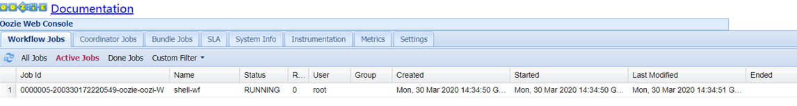
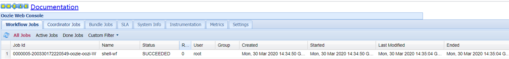
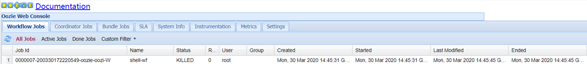

# Oozie

## 第 1 章 Oozie简介


官网：http://oozie.apache.org/

Oozie英文翻译为：驯象人。一个基于工作流引擎的开源框架，由Cloudera公司贡献给Apache。

Oozie是一个工作流调度程序系统，用于管理Apache Hadoop作业。

Oozie Workflow作业是操作的有向无环图（DAG）。

Oozie Coordinator作业是由时间（频率）和数据可用性触发的Oozie Workflow周期性作业。

Oozie与其余Hadoop堆栈集成在一起，支持开箱即用的几种类型的Hadoop作业（例如Java map-reduce，Streaming map-reduce，Pig，Hive，Sqoop和Distcp）以及系统特定的作业（例如Java程序和Shell脚本）。

Oozie是一个可扩展，可靠且可扩展的系统。

Oozie需要部署到Java Servlet容器中运行。

功能相似的任务调度框架还有Azkaban和Zeus。

## 第 2 章 Oozie 的功能模块介绍

### 2.1 模块


- **Workflow（工作流)**

  顺序执行流程节点，定义job任务执行，支持fork（分支多个节点），join（合并多个节点为一个）

- **Coordinator**

  定时触发workflow, 周期性执行workflow

- **Bundle**

  绑定多个Coordinator , 一起提交或触发所有coordinator

### 2.2 Workflow 常用节点

- **控制流节点（Control Flow Nodes）** 

  控制流节点一般都是定义在工作流开始或者结束的位置，比如start,end,kill等。以及提供工作流的执行路径机制，如decision，fork，join等。

- **动作节点（Action  Nodes）**

  负责执行具体动作的节点，比如：拷贝文件，执行某个Shell脚本等等。

## 第 3 章 Oozie 安装

采用CDH安装

CDH 安装Oozie时显示错误如下：


解决方案：
下载 ext-2.2.zip 内容到本机，上传到Oozie服务器上对应目录下：

```shell
cd /opt/cloudera/parcels/CDH/lib/oozie/libext
unzip ext-2.2.zip
chown oozie:oozie -R ext-2.2
```

再次访问web，正常了。

## 第 4 章 Oozie的使用

**大体步骤**：

1. 定义工作流程：编写workflow.xml
2. 将配置文件上传至HDFS指定路径
3. oozie job 执行工作流程

### 4.1 案例一：Oozie调度shell脚本

目标：使用Oozie调度Shell脚本

分步实现：

1）创建工作目录

```shell
mkdir -p oozie-apps/shell
```

2）在oozie-apps/shell目录随意编写一个脚本test.sh

```shell
#!/bin/bash

function hello(){
   echo "hello oozie" >> /opt/oozie-apps/data/access.log
}
hello
```

3）在oozie-apps/shell目录下创建两个文件——job.properties和workflow.xml文件

```shell
touch job.properties
touch workflow.xml
```

**修改job.properties**

```properties
#HDFS地址
nameNode=hdfs://thtf-01:8020
#ResourceManager地址
jobTracker=thtf-01:8032
#队列名称
queueName=default
examplesRoot=oozie-apps
#指定workflow.xml的路径
oozie.wf.application.path=${nameNode}/user/${user.name}/${examplesRoot}/shell
#指定执行的脚本名称
EXEC_SHELL_NAME=test.sh
```

**修改workflow.xml**

```xml
<workflow-app xmlns="uri:oozie:workflow:0.4" name="shell-wf">
<!--开始节点-->
<start to="shell-node"/>
<!--动作节点-->
<action name="shell-node">
    <!--shell动作-->
    <shell xmlns="uri:oozie:shell-action:0.2">
        <!-- 注意，这里的“${jobTracker}”是调用的job.properties中的变量，下面同理。-->
        <job-tracker>${jobTracker}</job-tracker>
        <name-node>${nameNode}</name-node>
        <configuration>
            <!--指定队列的名称-->
            <property>
                <name>mapred.job.queue.name</name>
                <value>${queueName}</value>
            </property>
        </configuration>
        <!--要执行的脚本-->
        <exec>${EXEC_SHELL_NAME}</exec>
        <!-- 注意，argument是传参数，我们可以传递多个参数，这里就不是必须-->
        <!-- <argument>name=zhangsn</argument> -->
        <!-- 指定hdfs执行脚本的路径-->
        <file>/user/root/oozie-apps/shell/${EXEC_SHELL_NAME}</file>
        <capture-output/>
    </shell>
    <!-- 当执行成功时会执行的标签，即会执行下面的“end标签”-->
    <ok to="end"/>
    <!-- 当执行出错时会执行的标签,即会执行下面的“fail标签”-->
    <error to="fail"/>
</action>
<!--kill节点-->
<kill name="fail">
    <message>Shell action failed, error message[${wf:errorMessage(wf:lastErrorNode())}]</message>
</kill>
<!--结束节点-->
<end name="end"/>
</workflow-app>
```

4）上传任务配置

```shell
hadoop fs -put /opt/soft/oozie-apps/shell/ /user/root/
```

5）执行任务

```shell
#oozie job --oozie http://thtf-02:11000/oozie -config oozie-apps/shell/job.properties -run
job: 0000004-200330172220549-oozie-oozi-W

```





6）杀死job任务

```shell
#oozie job --oozie http://thtf-02:11000/oozie -kill 0000004-200330172220549-oozie-oozi-W
```



7）检查作业状态

```shell
[root@thtf-02 shell]# oozie job --oozie http://thtf-02:11000/oozie -info 0000004-200330172220549-oozie-oozi-W
Job ID : 0000004-200330172220549-oozie-oozi-W
------------------------------------------------------------------------------------------------------------------------------------
Workflow Name : shell-wf
App Path      : hdfs://thtf-01:8020/user/root/pyy-oozie-apps/shell
Status        : SUCCEEDED
Run           : 0
User          : root
Group         : -
Created       : 2020-03-30 11:22 GMT
Started       : 2020-03-30 11:22 GMT
Last Modified : 2020-03-30 11:22 GMT
Ended         : 2020-03-30 11:22 GMT
CoordAction ID: -

Actions
-----------------------------------------------------------------------------------------
ID                                                                            Status    Ext ID                 Ext Status Err Code  
----------------------------------------------------------------------------------------
0000004-200330172220549-oozie-oozi-W@:start:                                  OK        -                      OK         -         
------------------------------------------------------------------------------------------------------------------------------------
0000004-200330172220549-oozie-oozi-W@shell-node                               OK        job_1585296023361_0006 SUCCEEDED  -         
------------------------------------------------------------------------------------------------------------------------------------
0000004-200330172220549-oozie-oozi-W@end                                      OK        -                      OK         -         
------------------------------------------------------------------------------------------------------------------------------------

```

8）查看日志

```shell
#oozie job --oozie http://thtf-02:11000/oozie -log 0000004-200330172220549-oozie-oozi-W
```

### 4.2 案例二：Oozie逻辑调度执行多个Job

https://blog.csdn.net/sdut406/article/details/100333849

### 4.3 案例三：Oozie调度MapReduce任务

https://blog.csdn.net/sdut406/article/details/100404713

### 4.4 案例四：Oozie定时任务/循环任务

https://blog.csdn.net/sdut406/article/details/100527075