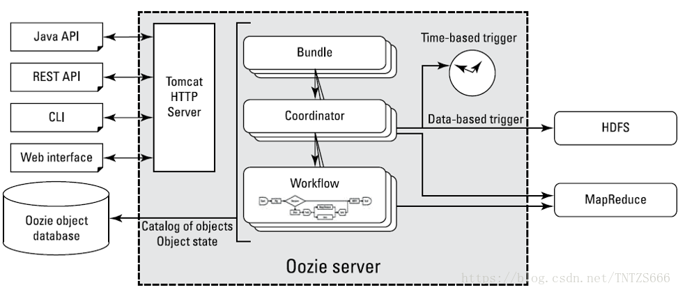
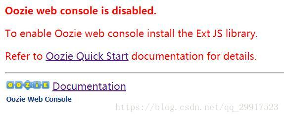

# Oozie

## 第 1 章 Oozie简介


官网：http://oozie.apache.org/

Oozie英文翻译为：驯象人。一个基于工作流引擎的开源框架，由Cloudera公司贡献给Apache。

Oozie是一个工作流调度程序系统，用于管理Apache Hadoop作业。

Oozie Workflow作业是操作的有向无环图（DAG）。

Oozie Coordinator作业是由时间（频率）和数据可用性触发的Oozie Workflow周期性作业。

Oozie与其余Hadoop堆栈集成在一起，支持开箱即用的几种类型的Hadoop作业（例如Java map-reduce，Streaming map-reduce，Pig，Hive，Sqoop和Distcp）以及系统特定的作业（例如Java程序和Shell脚本）。

Oozie是一个可扩展，可靠且可扩展的系统。

Oozie需要部署到Java Servlet容器中运行。

功能相似的任务调度框架还有Azkaban和Zeus。

## 第 2 章 Oozie 的功能模块介绍

### 2.1 模块



- **Workflow（工作流)**

  顺序执行流程节点，定义job任务执行，支持fork（分支多个节点），join（合并多个节点为一个）

- **Coordinator**

  定时触发workflow, 周期性执行workflow

- **Bundle**

  绑定多个Coordinator , 一起提交或触发所有coordinator

### 2.2 Workflow 常用节点

- **控制流节点（Control Flow Nodes）** 

  控制流节点一般都是定义在工作流开始或者结束的位置，比如start,end,kill等。以及提供工作流的执行路径机制，如decision，fork，join等。

- **动作节点（Action  Nodes）**

  负责执行具体动作的节点，比如：拷贝文件，执行某个Shell脚本等等。

## 第 3 章 Oozie 安装

采用CDH安装

CDH 安装Oozie时显示错误如下：



解决方案：
下载 ext-2.2.zip 内容到本机，上传到Oozie服务器上对应目录下：

```shell
cd /opt/cloudera/parcels/CDH/lib/oozie/libext
unzip ext-2.2.zip
chown oozie:oozie -R ext-2.2
```

再次访问web，正常了。

## 第 4 章 Oozie的使用

### 4.1 案例一：Oozie调度shell脚本


