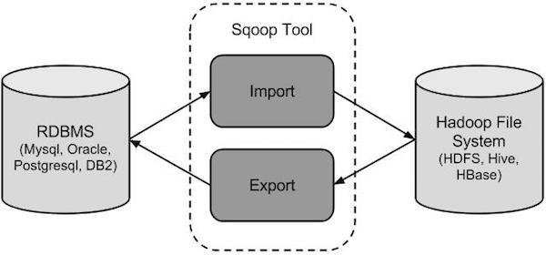

# Sqoop

官网地址： [http://sqoop.apache.org/](https://links.jianshu.com/go?to=http%3A%2F%2Fsqoop.apache.org%2F)


## 1. 概述 

sqoop是apache旗下一款“Hadoop和关系数据库服务器之间传送数据”的工具。 

导入数据：MySQL，Oracle导入数据到Hadoop的HDFS、HIVE、HBASE等数据存储系统；

导出数据：从Hadoop的文件系统中导出数据到关系数据库mysql等 。

Sqoop 的本质还是一个命令行工具，和 HDFS，Hive 相比，并没有什么高深的理论。

- sqoop：

  工具，本质就是迁移数据， 迁移的方式：就是把sqoop的迁移命令转换成MR程序

- hive

  工具，本质就是执行计算，依赖于HDFS存储数据，把SQL转换成MR程序

  

## 2. Sqoop1 与 Sqoop2 架构对比 

- **版本号对比**

  两代之间是两个完全不同的版本，不兼容 
  sqoop1：1.4.x 

  sqoop2：1.99.x

- **sqoop2比sqoop1的改进**

  (1) 引入sqoop server，集中化管理connector等 
  (2) 多种访问方式：CLI,Web UI，REST API 
  (3) 引入基于角色 的安全机制

- **sqoop2和sqoop1的功能性对比**

  | 功能                              | Sqoop 1                                                      | Sqoop 2                                                      |
  | --------------------------------- | ------------------------------------------------------------ | ------------------------------------------------------------ |
  | 用于所有主要 RDBMS 的连接器       | 支持                                                         | 不支持<br/>解决办法： 使用已在以下数据库上执行测试的通用 JDBC 连接器： Microsoft SQL Server 、 PostgreSQL 、 MySQL 和 Oracle 。 <br/>此连接器应在任何其它符合 JDBC 要求的数据库上运行。但是，性能可能无法与 Sqoop 中的专用连接器相比 |
  | Kerberos 安全集成                 | 支持                                                         | 不支持                                                       |
  | 数据从 RDBMS 传输至 Hive 或 HBase | 支持                                                         | 不支持<br/>解决办法： 按照此两步方法操作。 将数据从 RDBMS 导入 HDFS 在 Hive 中使用相应的工具和命令（例如 LOAD DATA 语句），手动将数据载入 Hive 或 HBase |
  | 数据从 Hive 或 HBase 传输至 RDBMS | 不支持<br/>解决办法： 按照此两步方法操作。 从 Hive 或 HBase 将数据提取至 HDFS （作为文本或 Avro 文件） 使用 Sqoop 将上一步的输出导出至 RDBMS | 不支持<br/>按照与 Sqoop 1 相同的解决方法操作                 |

- **sqoop1和sqoop2的架构对比**

  sqoop1的架构图

  

  版本号为1.4.x为sqoop1 
  在架构上：sqoop1使用sqoop客户端直接提交的方式 
  访问方式：CLI控制台方式进行访问 
  安全性：命令或脚本中指定用户数据库名及密码

  sqoop2的架构图 

  

  版本号为1.99x为sqoop2 
  在架构上：sqoop2引入了sqoop server，对connector实现了集中的管理 
  访问方式：REST API、 JAVA API、 WEB UI以及CLI控制台方式进行访问 

  CLI方式访问，会通过交互过程界面，输入的密码信息丌被看到，同时Sqoop2引入基亍角色的安全机制，Sqoop2比Sqoop多了一个Server端。

- **sqoop1与sqoop2优缺点比较**

  - sqoop1优点架构部署简单 
    sqoop1的缺点命令行方式容易出错，格式紧耦合，无法支持所有数据类型，安全机制不够完善，例如密码暴漏，安装需要root权限，connector必须符合JDBC模型

  - sqoop2的优点多种交互方式，命令行，web UI，rest API，conncetor集中化管理，所有的链接安装在sqoop server上，完善权限管理机制，connector规范化，仅仅负责数据的读写。 
  - sqoop2的缺点，架构稍复杂，配置部署更繁琐。

## 3. 工作机制 

将导入或导出命令翻译成mapreduce程序来实现 

在翻译出的mapreduce中主要是对inputformat和outputformat进行定制 

## 4. Sqoop 实战及原理 

### 4.1 **sqoop**安装 

安装sqoop的前提是已经具备java和hadoop的环境 

具体安装不是和安装方式可以自行选择，我们这里采用CDH安装。


验证启动 

```shell
[root@thtf-02 java]# sqoop version
Warning: /opt/cloudera/parcels/CDH-5.16.1-1.cdh5.16.1.p0.3/bin/../lib/sqoop/../accumulo does not exist! Accumulo imports will fail.
Please set $ACCUMULO_HOME to the root of your Accumulo installation.
20/03/29 18:17:46 INFO sqoop.Sqoop: Running Sqoop version: 1.4.6-cdh5.16.1
Sqoop 1.4.6-cdh5.16.1
git commit id 
Compiled by jenkins on Wed Nov 21 21:32:45 PST 2018
```

## 5.  Sqoop 的数据导入 

“导入工具”导入单个表从RDBMS到HDFS。表中的每一行被视为HDFS的记录。所有记录都存储为文本文件的文本数据（或者Avro、sequence文件等二进制数据） 

### 5.1 列举出所有的数据库 

命令行查看帮助 

```shell
#sqoop list‐databases ‐‐help 
```

列出指定主机所有的数据库 

```shell
#sqoop list‐databases ‐‐connect jdbc:mysql://192.168.1.7:3306/ ‐‐ username root ‐‐password 123456
```

### 5.2 查看某一个数据库下面的所有数据表 

```shell
#sqoop list‐tables ‐‐connect jdbc:mysql://192.168.1.7:3306/userdb ‐‐ username root ‐‐password 123456
```

如果出现连接拒绝，则在目标的mysql的数据库中执行以下命令: 

开启windows的远程连接权限 

```sql
mysql> GRANT ALL PRIVILEGES ON . TO 'root'@'%' IDENTIFIED BY 'yourpassword' WITH GRANT OPTION; 
mysql> FLUSH PRIVILEGES;
```

### 5.3 导入数据库表数据到 HDFS

下面的命令用于从MySQL数据库服务器中的emp表导入HDFS

```shell
#sqoop import ‐‐connect jdbc:mysql://192.168.1.7:3306/userdb ‐‐username root ‐‐ password 123456 ‐‐table emp ‐‐m 1
```

> 注：--m :  指定maptask个数

### 5.4 导入到 HDFS 指定目录 

在导入表数据到HDFS使用Sqoop导入工具，我们可以指定目标目录。 

使用参数 --target-dir来指定导出目的地， 

使用参数—delete-target-dir来判断导出目录是否存在，如果存在就删掉 

```shell
# sqoop import ‐‐connect jdbc:mysql://192.168.1.7:3306/userdb ‐‐ username root ‐‐password 123456 ‐‐delete‐target‐dir ‐‐table emp ‐‐target‐dir /sqoop/emp ‐‐m 1
```

默认，它会用逗号（，）分隔emp_add表的数据和字段。 

```
1201,gopal,manager,50000,TP 
1202,manisha,Proof reader,50000,TP 
1203,khalil,php dev,30000,AC 
1204,prasanth,php dev,30000,AC 
1205,kranthi,admin,20000,TP
```

### 5.5 导入到 HDFS 指定目录并指定字段之间的分隔符 

```shell
#sqoop import ‐‐connect jdbc:mysql://192.168.1.7:3306/userdb ‐‐ username root ‐‐password 123456 ‐‐delete‐target‐dir ‐‐table emp ‐‐target‐dir /sqoop/emp2 ‐‐m 1 ‐‐fields‐terminated‐by '\t'
```

### 5.6 导入关系表到 HIVE

- 第一步：拷贝**jar**包（如果是使用CDH安装则不需要此步骤）

  将我们mysql表当中的数据直接导入到hive表中的话，我们需要将hive的一个叫做hive-exec-3.1.1.jar 的jar包拷贝到sqoop的lib目录下

  ```shell
  #cp /export/servers/apache‐hive‐3.1.1‐bin/lib/hive‐exec‐3.1.1.jar /export/servers/sqoop‐1.4.7.bin__hadoop‐2.6.0/lib
  ```

- 第二步：准备**hive**数据库与表 

  ```sql
  hive (default)> create database sqooptohive; hive (default)> use sqooptohive; hive (sqooptohive)> create external table emp_hive(id int,name string,deg string,salary int ,dept string) row format delimited fields terminated by '\001';
  ```

- 第三步：开始导入 

  ```shell
  #sqoop import ‐‐connect jdbc:mysql://192.168.1.7:3306/userdb ‐‐ username root ‐‐password 123456 ‐‐table emp ‐‐fields‐terminated‐by '\001' ‐ ‐hive‐import ‐‐hive‐table sqooptohive.emp_hive ‐‐hive‐overwrite ‐‐delete‐ target‐dir ‐‐m 1
  ```

- 第四步：**hive**表数据查看

  ```sql
  hive> select * from emp_hive;
  OK
  1201    gopal   manager 50,000  tp
  1202    manisha Proof reader    50,000  tp
  1203    khalil  java dev        30,000  tp
  1204    prasanth        java dev        50,000  tp
  1205    kranthi java dev        50,000  tp
  Time taken: 0.711 seconds, Fetched: 5 row(s)
  ```

### 5.7 导入关系表到 Hive 并自动创建 Hive 表

我们也可以通过命令来将我们的mysql的表直接导入到hive表当中去 

```shell
#sqoop import ‐‐connect jdbc:mysql://192.168.1.7:3306/userdb ‐‐ username root ‐‐password 123456 ‐‐table emp_conn ‐‐hive‐import ‐m 1 ‐‐hive‐database sqooptohive
```

通过这个命令，我们可以直接将我们mysql表当中的数据以及表结构一起倒入到hive当中去

### 5.8 导入表数据子集 

我们可以导入表的使用Sqoop导入工具，"where"子句的一个子集。它执行在各自的数据 

库服务器相应的SQL查询，并将结果存储在HDFS的目标目录。 


where子句的语法如下：

​	按照条件进行查找，通过—where参数来查找表emp_add当中city字段的值为sec-bad的所有数据导入到hdfs上	面去 

```shell
#sqoop import \ 
‐‐connect jdbc:mysql://192.168.1.7:3306/userdb \ 
‐‐username root ‐‐password 123456 ‐‐table emp_add \ 
‐‐target‐dir /sqoop/emp_add ‐m 1 ‐‐delete‐target‐dir \ 
‐‐where "city = 'sec‐bad'"
```

### 5.9 SQL 语句查找导入 HDFS

我们还可以通过 –query参数来指定我们的sql语句，通过sql语句来过滤我们的数据进行导入

```shell
#sqoop import \ 
‐‐connect jdbc:mysql://192.168.1.7:3306/userdb \
‐‐username root ‐‐password 123456\ 
‐‐delete‐target‐dir ‐m 1 \ 
‐‐query 'select email from emp_conn where 1=1 and $CONDITIONS' \ 
‐‐target‐dir /sqoop/emp_conn
```


### 5.10 增量导入 

在实际工作当中，数据的导入，很多时候都是只需要导入增量数据即可，并不需要将表中的数据全部导入到hive或者hdfs当中去，肯定会出现重复的数据的状况，所以我们一般都是选用一些字段进行增量的导入，为了支持增量的导入，sqoop也给我们考虑到了这种情况并且支持增量的导入数据

增量导入是仅导入新添加的表中的行的技术。 

它需要添加‘incremental’, ‘check-column’, 和 ‘last-value’选项来执行增量导入。 

下面的语法用于Sqoop导入命令增量选项。 

**第一种增量导入使用上面的选项来实现 **

导入emp表当中id大于1202的所有数据 

> 注意：增量导入的时候，一定不能加参数--delete-target-dir否则会报错 

```shell
#sqoop import \ 
‐‐connect jdbc:mysql://192.168.1.7:3306/userdb \ 
‐‐username root \ 
‐‐password 123456 \ 
‐‐table emp \ 
‐‐incremental append \ 
‐‐check‐column id \ 
‐‐last‐value 1202 \ 
‐m 1 \ 
‐‐target‐dir /sqoop/increment
```

**第二种增量导入通过**--where**条件来实现 **

或者我们使用--where来进行控制数据的选取会更加精准 

```
#sqoop import \ 
‐‐connect jdbc:mysql://192.168.1.7:3306/userdb \ 
‐‐username root \ 
‐‐password 123456 \ 
‐‐table emp \ 
‐‐incremental append \ 
‐‐where "create_time > '2018‐06‐17 00:00:00' and create_time < '2018‐06‐ 17 23:59:59'" \
‐‐target‐dir /sqoop/incement2 \ 
‐‐check‐column id \ 
‐‐m 1
```


## 6. Sqoop 的数据导出

1. 将数据从HDFS把文件导出到RDBMS数据库 

   导出前，目标表必须存在于目标数据库中。 

   - 默认操作是从将文件中的数据使用INSERT语句插入到表中 

   - 更新模式下，是生成UPDATE语句更新表数据 

### 6.1 HDFS 导出到 MySQL

数据是在HDFS当中的如下目录/sqoop/emp，数据内容如下

```
1201,gopal,manager,50000,TP,2018-06-17 18:54:32.0,2018-06-17 18:54:32.0,1 1202,manisha,Proof reader,50000,TP,2018-06-15 18:54:32.0,2018-06-17 20:26:08.0,1 1203,khalil,php dev,30000,AC,2018-06-17 18:54:32.0,2018-06-17 18:54:32.0,1 1204,prasanth,php dev,30000,AC,2018-06-17 18:54:32.0,2018-06-17 21:05:52.0,0 1205,kranthi,admin,20000,TP,2018-06-17 18:54:32.0,2018-06-17 18:54:32.0,1
```

第一步：创建**mysql**表

```sql
CREATE TABLE emp_out ( 
    id INT(11) DEFAULT NULL, 
    name VARCHAR(100) DEFAULT NULL, 
    deg VARCHAR(100) DEFAULT NULL, 
    salary INT(11) DEFAULT NULL, 
    dept VARCHAR(10) DEFAULT NULL, 
    create_time TIMESTAMP NOT NULL DEFAULT CURRENT_TIMESTAMP, 
    update_time TIMESTAMP NOT NULL DEFAULT CURRENT_TIMESTAMP ON UPDATE CURRENT_TIMESTAMP,
    is_delete BIGINT(20) DEFAULT '1' ) ENGINE=INNODB DEFAULT CHARSET=utf8;
```

第二步：执行导出命令 

通过export来实现数据的导出，将hdfs的数据导出到mysql当中去 

```shell
#sqoop export \ 
‐‐connect jdbc:mysql://192.168.1.7:3306/userdb \ 
‐‐username root ‐‐password 123456 \ 
‐‐table emp_out \ 
‐‐export‐dir /sqoop/emp \ 
‐‐input‐fields‐terminated‐by ","
```

