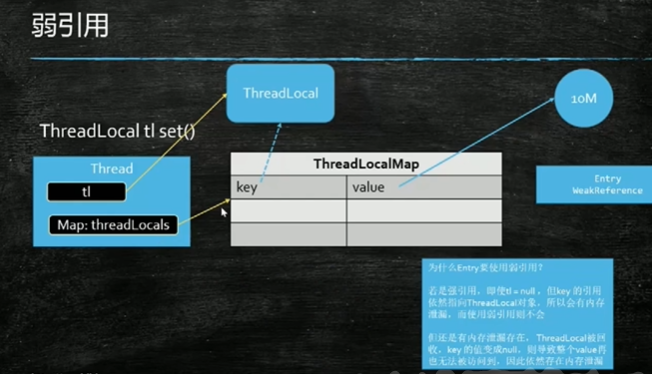
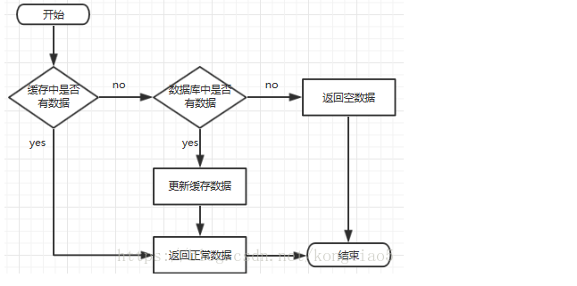
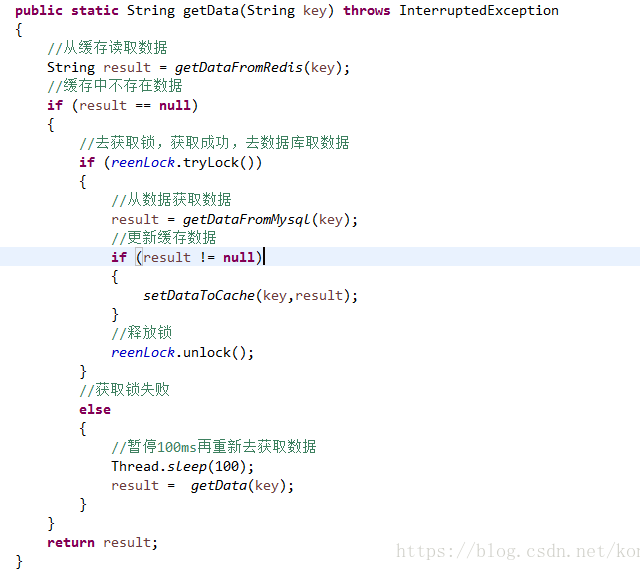
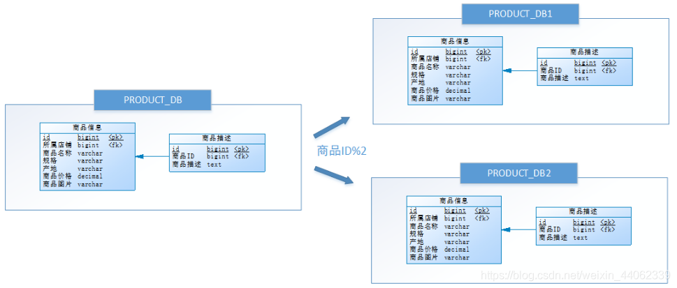
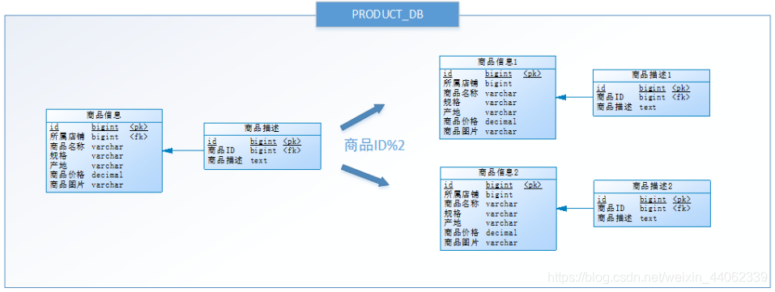

# 知识点总结

## 对象 强、软、弱、虚引用

强引用是使用最普遍的引用。如果一个对象具有强引用，那垃圾回收器绝不会回收它。

软引用 SoftReference 内存空间不足，才会回收 缓存。

弱引用 WeakReference 一旦发现了只具有弱引用的对象，不管内存是否足都会回收

虚引用 PhantomReference 用来监控垃圾回收器，和ReferenceQueue结合使用

当GC一但发现了虚引用对象，将会将PhantomReference对象插入ReferenceQueue队列. * 而此时PhantomReference所指向的对象并没有被GC回收，而是要等到ReferenceQueue被你真正的处理后才会被回收. * *

这里特别需要注意：当JVM将虚引用插入到引用队列的时候，虚引用执行的对象内存还是存在的。但是PhantomReference并没有暴露API返回对象。所以如果我想做清理工作，需要继承PhantomReference类，以便访问它指向的对象。如堆外直接内存的自动回收，就使用到了sun.misc.Cleaner

## ThreadLocal 内存泄漏



解决方案

解决办法是每次使用完ThreadLocal都调用它的remove()方法清除数据，或者按照JDK建议将ThreadLocal变量定义成private static，这样就一直存在ThreadLocal的强引用，也就能保证任何时候都能通过ThreadLocal的弱引用访问到Entry的value值，进而清除掉。

## HashMap

1. 初始化大小是16，如果事先知道数据量的大小，建议修改默认初始化大小。 减少扩容次数，提高性能 ，这是我一直会强调的点
2. 最大的装载因子默认是0.75，当HashMap中元素个数达到容量的0.75时，就会扩容。 容量是原先的两倍
3. HashMap底层采用链表法来解决冲突。 但是存在一个问题，就是链表也可能会过长，影响性能
   于是JDK1.8,对HashMap做了进一步的优化，引入了红黑树。
   当链表长度超过8，且数组容量大于64时，链表就会转换为红黑树
   当红黑树的节点数量小于6时，会将红黑树转换为链表。
   因为在数据量较小的情况下，红黑树要维护自身平衡，比链表性能没有优势。


## HashMap长度为什么要是2的n次幂

HashMap为了**存取高效**，要**尽量较少碰撞**，就是要**尽量把数据分配均匀**，**让每个链表长度大致相同**，这个实现就在把数据存到哪个链表中的算法；
indexFor() 这个算法实际就是取余，hash%length，计算机中直接求余效率不如位移运算，源码中做了优化hash&(length-1)，
hash%length==hash&(length-1)的前提是length是2的n次方；

为什么这样能均匀分布减少碰撞呢？

2的n次方实际就是1后面n个0，2的n次方-1 实际就是n个1；
例如长度为9时候，3&(9-1)=0 2&(9-1)=0 ，都在0上，碰撞了；
例如长度为8时候，3&(8-1)=3 2&(8-1)=2 ，不同位置上，不碰撞；

其实就是按位“与”的时候，每一位都能 &1 ，也就是和1111……1111111进行与运算

*0000 0011   3*

*& 0000 1000    8*

*= 0000 0000    0*


*0000 0010   2*

*& 0000 1000  8*

*= 0000 0000    0*

 *-------------------------------------------------------------*

*0000 0011   3*

*& 0000 0111   7*

*= 0000 0011    3*


*0000 0010    2*

*& 0000 0111    7*

*= 0000 0010    2*

当然如果不考虑效率直接求余即可（就不需要要求长度必须是2的n次方了）；

## 2. LinkedHashMap 和 HashMap 区别

LinkedHashMap继承于HashMap，是基于HashMap和双向链表来实现的。

HashMap 无序，LinkedHashMap 有序（插入顺序（默认：false），访问属性）

如果 初始化构造是选择是访问顺序 new LinkedHashMap(10, true) , 那put和get操作已存在的Entry时，都会把Entry移动到双向链表的表尾(其实是先删除再插入)。

LinkedHashMap存取数据，还是跟HashMap一样使用的Entry[]的方式，双向链表只是为了保证顺序。

LinkedHashMap是线程不安全的

## 3. LinkedHashMap 是如何实现 LRU的

其实很简单，就因为LinkedHashMap 本身有一个特性：初始化时可以指定 排序方式（插入排序，访问排序）

我们可以设置为访问排序（当访问某一个已存在的Entry后就会将移动到链表的尾部）

利用这个特性我们可以初始化一个LinkedHashMap 对象 指定初始化容量，和访问顺序模式），重写 removeEldestEntry 方法（这个方法返回true，就会移除就链表头的旧元素）减少哈希碰撞

```java
@Test
    public void testLinkedHashMap() {
        LinkedHashMap<String, String> map = new LinkedHashMap<String, String>(5, 0.75F, true) {
            @Override
            protected boolean removeEldestEntry(Map.Entry<String, String> eldest) {
                //当LinkHashMap的容量大于等于5的时候,再插入就移除旧的元素
                return this.size() >= 5;
            }
        };
        map.put("aa", "bb");
        map.put("cc", "dd");
        map.put("ee", "ff");
        map.put("gg", "hh");
        print(map);
        map.get("cc");
        System.out.println("===================================");
        print(map);

        map.get("ee");
        map.get("aa");
        System.out.println("====================================");
        map.put("ss","oo");
        print(map);
    }
```


### 4. HashMap 链表法解决hash冲突

从HashMap的实现来看，我们总结拉链发的实现步骤如下：

1. 计算 key 的 hashValue
2. 根据 hashValue 值定位到 table[hashIndex] 。( table[hashIndex] 是一条链表Node)
3. 若 table[hashValue] 为空则直接插入，不然则添加到链表末尾

```
这个方法执行对操作是，先通过hash计算要添加的key准备插入的槽位，如果key是一样的，则根据设置的参数是否执行覆盖，如果相应的槽位是空的话直接插入，如果对应的槽位有值则判断是红黑树结构还是链表结构，
链表的话则顺着链表寻找，如果找到一样的key，则根据参数选择覆盖，没有找到则链接到链表最后面，链表项的数目大于8则对其进行树化，如果是红黑树结构则按照树的添加方式进行添加操作
```

## 5. HashMap 的扩容时机

首先 我们在构造 HashMap 的时候可以指定 初始化容量 capicity 默认 16 ，负载因子默认0.75，

当使用put方法添加元素时，会判断当前hashmap的++size 和 threshold 比较 如果大于 阈值 就执行resize操作

- 扩容：创建一个新的Entry数组 容量是原数组的2倍
- rehash：遍历原数组，把所有的原始重新hash

## 6. 缓存穿透、缓存击穿、缓存雪崩区别和解决方案

**一、缓存处理流程**

   前台请求，后台先从缓存中取数据，取到直接返回结果，取不到时从数据库中取，数据库取到更新缓存，并返回结果，数据库也没取到，那直接返回空结果。



 

**二、缓存穿透**

​    **描述：**

​    缓存穿透是指缓存和数据库中都没有的数据，而用户不断发起请求，如发起为id为“-1”的数据或id为特别大不存在的数据。这时的用户很可能是攻击者，攻击会导致数据库压力过大。

   **解决方案：**

1. 接口层增加校验，如用户鉴权校验，id做基础校验，id<=0的直接拦截；
2. 从缓存取不到的数据，在数据库中也没有取到，这时也可以将key-value对写为key-null，缓存有效时间可以设置短点，如30秒（设置太长会导致正常情况也没法使用）。这样可以防止攻击用户反复用同一个id暴力攻击

 

**三、缓存击穿**

   **描述：**

   缓存击穿是指缓存中没有但数据库中有的数据（一般是缓存时间到期），这时由于并发用户特别多，同时读缓存没读到数据，又同时去数据库去取数据，引起数据库压力瞬间增大，造成过大压力

   **解决方案：**

1. 设置热点数据永远不过期。
2. 加互斥锁，互斥锁参考代码如下：



​     说明：

​     1）缓存中有数据，直接走上述代码13行后就返回结果了

​     2）缓存中没有数据，第1个进入的线程，获取锁并从数据库去取数据，没释放锁之前，其他并行进入的线程会等待100ms，再重新去缓存取数据。这样就防止都去数据库重复取数据，重复往缓存中更新数据情况出现。

​     3）当然这是简化处理，理论上如果能根据key值加锁就更好了，就是线程A从数据库取key1的数据并不妨碍线程B取key2的数据，上面代码明显做不到这点。

 

**四、缓存雪崩**

   **描述：**

   缓存雪崩是指缓存中数据大批量到过期时间，而查询数据量巨大，引起数据库压力过大甚至down机。和缓存击穿不同的是，    缓存击穿指并发查同一条数据，缓存雪崩是不同数据都过期了，很多数据都查不到从而查数据库。

   **解决方案**：

1. 缓存数据的过期时间设置随机，防止同一时间大量数据过期现象发生。
2. 如果缓存数据库是分布式部署，将热点数据均匀分布在不同搞得缓存数据库中。
3. 设置热点数据永远不过期。

## 7. Spring Bean生命周期

系统启动时 spring 加载需要被spring管理的Bean对象，调用 实例化

然后完成属性的注入，接下来会调用 BeanNameAware.setBeanName方法初始化方法名称

接下来调用BeanFactoryAware.setBeanFactory 完毕bean工程注入

调用ApplicationContextAware.setApplicationContext()  applicationContext注入

BeanPostProcessor.postProcessBeforeInitialization()

然后调用init-method配置方法完成自定义初始化工作

BeanPostProcessor.postProcessAfterInitialization()

Bean 就可以使用了，

当系统关闭时会调用 用户配置的 destory-method  和 destory() 完成对象销毁

## 8. 分库分表

分库分表的目的就是为了解决数据量过大而导致的数据库性能下降问题，将原来独立的数据库拆分为若干个数据库组成，将数据库大表拆分成若干个数据表组成，使得单一数据库、单一数据表的数据量变小，从而达到提升数据库性能的目的。

### 垂直切分

**1、垂直分库**

就是根据**业务耦合性**，将**关联度低**的不同表分到在**不同的数据库**。做法类似于微服务的思想，将一个大的系统根据业务或功能拆分成多个独立的微服务，每个微服务使用自己独立的数据库。

**2、垂直分表**

 把一个表的**多个字段**分别拆成多个表，一般在数据库设计的时候就要考虑好这块的设计

-  一般按字段的冷热拆分，热字段一个表，冷字段一个表 
- 把 text、blob 大字段拆分为一张表
- 经常组合查询的列放在一张表

**总结**

```
优点
- 解决业务系统层面的耦合，业务清晰
- 高并发场景下，垂直切分一定程度的提升IO、数据库连接数、单机硬件资源的瓶颈
缺点
- 分库后无法Join，只能通过接口聚合方式解决，提升了开发的复杂度
- 分库后分布式事务处理复杂
- 依然存在单表数据量过大的问题（需要水平切分）
```


### 水平切分

垂直拆分是无法解决单表数据量过大的问题（需要水平切分）

水平切分也可以分为：`水平分库`和`水平分表`。

**1、水平分库**

每个数据库中的表结构都是一样的，只是把一张表中的数据按照一定的规则拆分到不同数据库的相同表中,  它是对数据行的拆分，不影响表结构 

> 每次添加的时候根据 店铺ID 如果为奇数就写到 DB1 如果为 偶数就写到 DB2

  

```
优点
- 解决了单库大数据，高并发的性能瓶颈。
- 提高了系统的稳定性及可用性。(IO冲突和锁减少)
缺点
- 分库后分布式事务处理复杂
- 分库后无法Join，只能通过接口聚合方式解决，提升了开发的复杂度
- 数据库实例增加，增加维护成功
```

**2、水平分表**

与水平分库的思路类似，不过这次操作的目标是表，商品信息及商品描述被分成了两套表。如果商品ID为双数，将此操作映射至商品信息1表；如果商品ID为单数，将操作映射至商品信息2表。此操作要访问表名称的表达式为商品信息[商品ID%2 + 1] 。

**水平分表是在同一个数据库内，把同一个表的数据按一定规则拆到多个表中。**

  

```
优点
- 解决了单库大数据，高并发的性能瓶颈。
- 数据库实例没有增加 
- 提高了系统的稳定性及可用性。(IO冲突和锁减少)
```

**总结**

一般来说，在系统**设计阶段**就应该根据业务耦合松紧来确定**垂直分库**，**垂直分表**方案，在数据量及访问压力不是特别大的情况，首先考虑缓存、读写分离、索引技术等方案。若**数据量极大**，且持续增长，再考虑水平分库水平分表方案。

**带来问题**

- 分布式事务问题
- 分库后无法Join，只能通过接口聚合方式解决，提升了开发的复杂度
- 分库后分页、排序问题（分别 分页排序查询，然后在汇总 分页排序）
- 主键冲突
- 公共表（不同数据库需要相同表数据）


