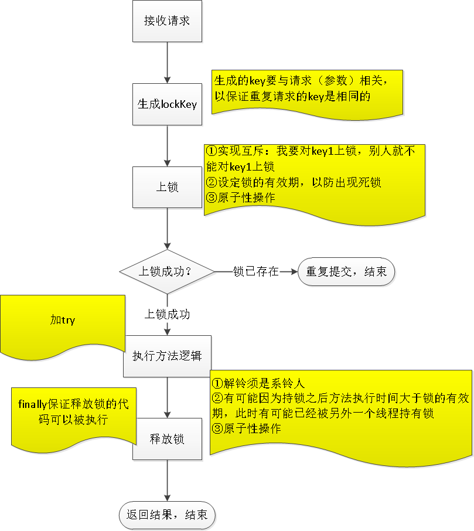
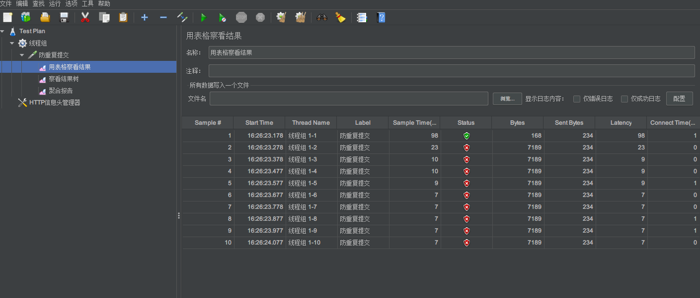

# API接口防止重复提交

## 背景

当前很多网站是前后分离的，前端（android,iso,h5）通过restful API 调用 后端服务器，这就存在一个问题，对于创建操作，比如购买某个商品，如果由于某种原因，手抖，控件bug,网络错误，可能导致一次操作实际上购买了多次同一个产品。所以，我们要考虑防止重复提交。这个重复提交我们只限定于创建操作，对于修改和删除操作，原则上是幂等的，不用担心，查询操作更不用担心重复操作。

## 目标

通过在指定的接口处添加注解，实现根据指定的接口参数来防重复点击

>这里的重复点击是指在指定的时间段内多次点击按钮

## 技术方案

无论是http接口，还是rpc接口，防重复提交（接口防重）都是绕不过的话题。

重复提交与幂等，既有区别，又有联系。幂等的意思是，对资源的一次请求与多次请求，作用是相同的。HTTP的POST方法是非幂等的。如果程序处理不好，重复提交会导致非幂等，引起系统数据故障。防重复提交，要通过技术手段来实现。保证幂等性既要通过技术手段来实现，又要有对业务数据的验证。


常见的B/S场景的重复提交，用户手抖或因为网络问题，服务端在极短时间内收到同样的http请求。

rpc接口的重复提交，一种是不恰当的程序调用，即程序漏洞导致重复提交。在一种，比如拿dubbo来说，因为网络传输问题，会导致重试调用。

防重提交的方案，常见的是加锁。java单体应用可以用语言本身的synchronized锁机制。分布式系统，一般是借助redis或zk等分布式锁。



## 案例

springboot + redission分布式锁 + 注解

### 导入依赖包

redisson客户端

```xml
<dependency>
    <groupId>org.redisson</groupId>
    <artifactId>redisson-spring-boot-starter</artifactId>
    <version>3.13.6</version>
</dependency>
```

aop

```xml
<dependency>
     <groupId>org.springframework.boot</groupId>
     <artifactId>spring-boot-starter-aop</artifactId>
</dependency>
```

### redis 配置

```properties
spring.redis.host=10.10.50.230
spring.redis.port=6379
spring.redis.password=123456
spring.redis.database=3
spring.redis.jedis.pool.max-active=500
spring.redis.jedis.pool.max-idle=1000
spring.redis.jedis.pool.max-wait=6000ms
spring.redis.jedis.pool.min-idle=4
```

### 自定义防重提交注解类

```java
//标识该注解用于方法上
@Target({ElementType.METHOD})
//申明该注解为运行时注解，编译后改注解不会被遗弃
@Retention(RetentionPolicy.RUNTIME)
//javadoc工具记录
@Documented
public @interface NoRepeatSubmit {
}
```

### 自定义aop解析注解

```java
import io.micrometer.core.instrument.util.StringUtils;
import lombok.extern.slf4j.Slf4j;
import org.aspectj.lang.ProceedingJoinPoint;
import org.aspectj.lang.annotation.Around;
import org.aspectj.lang.annotation.Aspect;
import org.redisson.api.RLock;
import org.redisson.api.RedissonClient;
import org.springframework.beans.factory.annotation.Autowired;
import org.springframework.data.redis.core.StringRedisTemplate;
import org.springframework.stereotype.Component;
import org.springframework.util.DigestUtils;
import org.springframework.web.context.request.RequestAttributes;
import org.springframework.web.context.request.RequestContextHolder;

import javax.servlet.http.HttpServletRequest;
import java.util.Arrays;
import java.util.concurrent.TimeUnit;

@Component
@Aspect
@Slf4j
public class NoRepeatSubmitAspect {
    /**
     * 防重redis前缀
     */
    private static String API_PREVENT_SUBMIT = "api:noRepeatSubmit:";

    /**
     * 防重分布式锁前缀
     */
    private static String API_LOCK_PREVENT_SUBMIT = "api:noRepeatSubmit:lock:";

    /**
     * 失效时间
     */
    private static Integer INVALID_NUMBER = 3;

    /**
     * redis
     */
    @Autowired
    private StringRedisTemplate stringRedisTemplate;

    /**
     * 分布式锁
     */
    @Autowired
    private RedissonClient redissonClient;


    /**
     * 防重
     * @return
     */
    @Around("@annotation(com.example.demo.annotation.NoRepeatSubmit)")
    public Object preventSubmitAspect(ProceedingJoinPoint joinPoint) throws Throwable {

        RLock lock = null;

        try {

            //获取目标方法的参数
            Object[] args = joinPoint.getArgs();

            //获取当前request请求
            RequestAttributes requestAttributes = RequestContextHolder.getRequestAttributes();
            HttpServletRequest request = (HttpServletRequest) requestAttributes.resolveReference(RequestAttributes.REFERENCE_REQUEST);

            //获取请求地址
            String requestUri = request.getRequestURI();

            //获取用户ID
            String userId = null;
            try {
                userId = TokenUtil.getUserId(request);
            }catch (Exception e){}

            // uriPath:userId:MD5(JsonString(所有参数)) 作为key
            String md5Args = DigestUtils.md5DigestAsHex(Arrays.asList(args).toString().getBytes());
            StringBuilder temp = new StringBuilder();
            temp.append(requestUri).append(":")
                .append(userId).append(":")
                .append(md5Args);

            // 拼接rediskey
            String lockPrefix = API_LOCK_PREVENT_SUBMIT.concat(temp.toString());
            String redisPrefix = API_PREVENT_SUBMIT.concat(temp.toString());

            /**
             * 对同一方法 同一用户 同一参数加锁,即使获取不到用户ID,每个用户请求数据也会不一致，不会造成接口堵塞
             */
            lock = this.redissonClient.getLock(lockPrefix);
            lock.lock();

            String flag = this.stringRedisTemplate.opsForValue().get(redisPrefix);
            if(StringUtils.isNotEmpty(flag)){
                throw new RuntimeException("您当前的操作太频繁了,请稍后再试!");
            }

            // 存入redis,设置失效时间
            this.stringRedisTemplate.opsForValue().set(redisPrefix, redisPrefix, INVALID_NUMBER, TimeUnit.SECONDS);

            // 执行目标方法
            Object result = joinPoint.proceed(args);
            return result;

        }finally {
            if(lock != null){
                lock.unlock();
            }
        }
    }
}

```

### 测试Controller

```java

@RestController
public class UserController {

    @PostMapping("/user")
    @NoRepeatSubmit
    public String addUser(@RequestBody User user) {
        System.out.println("添加用户" + user);
        return "success";
    }
}
```


### Jmeter测试

模拟1s发送10次相同请求



