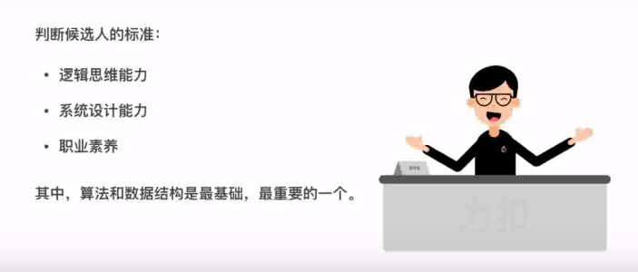
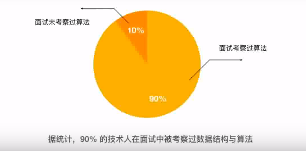
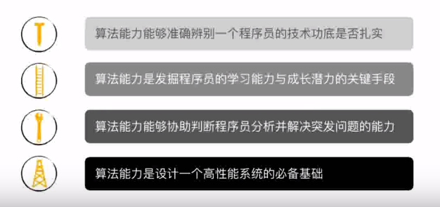
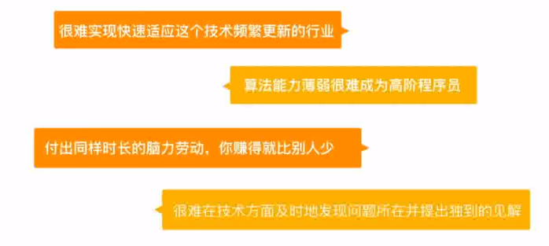

# 开篇寄语

>  算法功底决定 Offer 质量

我发现，不论在国内还是国外，很多人不知道算法，数据结构早已成为技术面试的必考环节，尤其是重视技术、品牌的互联网一线大厂，算法是否合格，直接决定了候选人能否获得 Offer。常常在其他方面表现不错的程序员由于算法不过关而错失了心仪的 Offer，自从开始寻找工作，我就意识到了算法的重要性。当时身边的朋友都说，力扣是算法能力提升的首选平台，我便针对上面的题目，按公司题目热门程度以及难度进行分类后制定出学习计划，坚持做题。如愿拿到了工作的offer，入职后发现，扎实的算法功底让我的工作能力和效率有了质的提升，可以说算法让我脱胎换骨。题海战术需要花费大量的时间，也需要很大的兴趣和毅力，在学习算法的过程中，我走了很多弯路。所以希望在这里，将我的刷题笔记和多年修炼的经验分享给你，帮你学会如何去思考和分析算法问题以及提升自己的算法水平，为算法面试做好最充分的准备。

## 为什么大厂喜欢考算法

为什么面试官都喜欢问算法和数据结构呢？因为算法和数据结构最能体现，一个人的基本功基本功是否扎实，这样的人无论是做工程还是去做算法都不会差到哪里去。

招人的时候就一个标准。招进来的这个人，至少要排到团队里面的前50%，只有这样招进的人才能够让团队更加强大。怎么判别这个人能够在团队里面排到前50%呢？其实是有很多标准的，包括逻辑思维能力，系统设计能力，职业经验和职业素养，而算法和数据结构是里面最基础，最重要的。我自己也非常看重候选人的解题思路，能将思路迅速的变成代码的能力。比如我喜欢问一些二叉树相关的题目，这些题目体现了答题者对基本数据结构的熟练程度，分析算法复杂度的能力。

拉勾对一千多名技术求职者进行调研，90%以上的人表示面试时都被考察过数据结构与算法。这门在大学计算机中的基础学科，再也不是60分万岁！平时忽略数据结构和算法的程序员，在公司只能做一些底层开发，如此恶性循环，难有出头之日。

如果你问不会数据结构和算法对工作有什么影响吗？我觉得肯定是有的，首先要知道，程序员这个群体也是有金字塔结构的，如果连基本的算法和数据结构都不会，你基本上就属于比较底层的程序员底层，也就意味着低薪酬，付出同样时长的脑力劳动，你赚得就比减少。其次，作为团队里的一员，很多时候你不光要做好自己的本职工作，也要和其他团队进行技术问题上的沟通。如果你没有扎实的算法和数据结构知识，很难在技术方面及时的发现问题所在，并提出独到的见解。另外，技术栈本身每天都在变化，同时也会随着不同行业，不同公司在变化，在这种情况下，能否快速的适应新技术和环境就显得尤为重要，这点要求你学好以不变应万变的算法思想以及逻辑思维能力。那么如何能够快速提升数据结构的算法能力，获得大厂的青睐呢？

