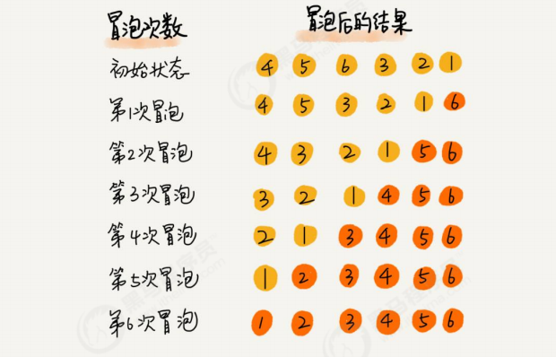
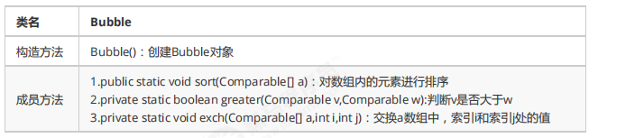
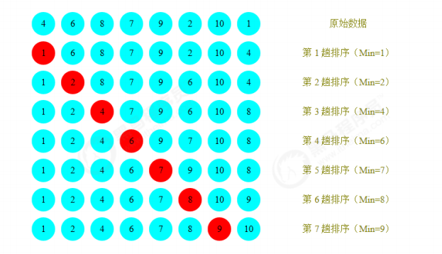
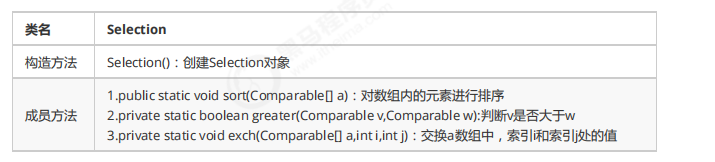
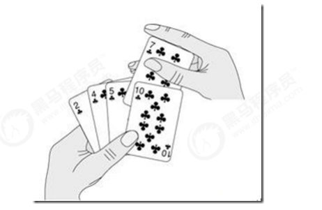
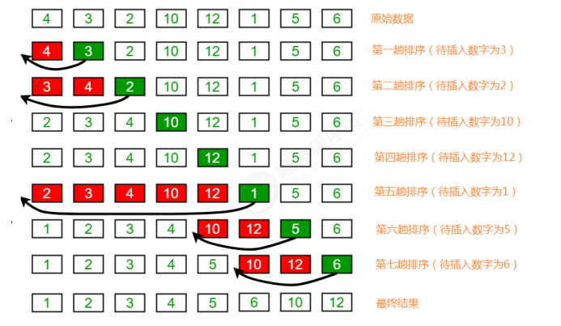
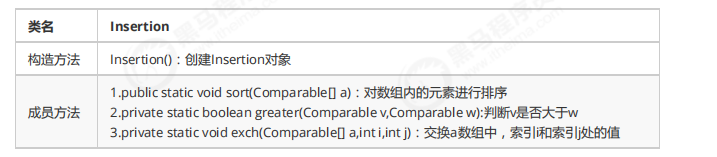

# 排序

## 一、简单排序

### 1.1 冒泡排序

冒泡排序（Bubble Sort），是一种计算机科学领域的较简单的排序算法。

**需求：**

排序前：{4,5,6,3,2,1}

排序后：{1,2,3,4,5,6}

**排序原理：**

把第一个元素与第二个元素比较，如果第一个比第二个大，则交换他们的位置。接着继续比较第二个与第三个元素，如果第二个比第三个大，则交换他们的位置….

我们对每一对相邻元素作同样的工作，从开始第一对到结尾的最后一对，这样一趟比较交换下来之后，排在最右的元素就会是最大的数。

除去最右的元素，我们对剩余的元素做同样的工作，如此重复下去，直到排序完成。




**冒泡排序API设计：**



**冒泡排序的代码实现：**

```java
/**
 * 冒泡排序
 */
public class Bubble {

    /**
     * 对数组a中的元素进行排序
     * @param a
     */
    public static void sort(Comparable[] a) {
        for (int i = a.length - 1; i > 0; i-- ) {
            for (int j = 0; j < i; j++) {
                // 比较索引j和索引j的值
                if (greater(a[j], a[j+1])) {
                    exch(a, j, j+1);
                }
            }
        }
    }

    /**
     * 比较v元素是否大于w元素
     */
    private static boolean greater(Comparable v, Comparable w) {
        return v.compareTo(w) > 0;
    }

    /**
     * 数组元素i和j交互位置
     */
    private static void exch(Comparable[] a, int i, int j) {
        Comparable temp;
        temp = a[i];
        a[i] = a[j];
        a[j] = temp;
    }

    public static void main(String[] args) {
        Integer[] arr = {4,5,6,3,2,1};

        Bubble.sort(arr);
        System.out.println(Arrays.toString(arr));

    }
}
```

**冒泡排序的时间复杂度分析**: 

冒泡排序使用了双层for循环，其中内层循环的循环体是真正完成排序的代码，所以，我们分析冒泡排序的时间复杂度，主要分析一下内层循环体的执行次数即可。在最坏情况下，也就是假如要排序的元素为{6,5,4,3,2,1}逆序，那么：

元素比较的次数为：

 (N-1)+(N-2)+(N-3)+...+2+1=((N-1)+1)*(N-1)/2=N^2/2-N/2;

元素交换的次数为：

 (N-1)+(N-2)+(N-3)+...+2+1=((N-1)+1)*(N-1)/2=N^2/2-N/2;

总执行次数为：

 (N^2/2-N/2)+(N^2/2-N/2)=N^2-N;

按照大O推导法则，保留函数中的最高阶项那么最终冒泡排序的时间复杂度为O(N^2).

### 1.2 选择排序

选择排序是一种更加简单直观的排序方法。

**需求：**

排序前：{4,6,8,7,9,2,10,1}

排序后：{1,2,4,5,7,8,9,10}

**排序原理：**

首先，找到数组中最小的那个元素，其次，将它和数组的第一个元素交换位置(如果第一个元素就是最小元素那么它就和自己交换)。其次，在剩下的元素中找到最小的元素，将它与数组的第二个元素交换位置。如此往复，直到将整个数组排序。这种方法我们称之为**选择排序**。



**选择排序API设计：** 



**选择排序的代码实现：**

```java
/**
 * 选择排序
 */
public class Selection {

    /**
     * 对数组元素进行排序
     */
    public static void sort(Comparable[] a) {
        for (int i = 0; i < a.length - 1; i++) {
            // 定义一个变量，记录最小元素所在索引（默认选择第一个元素所在位置）
            int minIndex = i;
            for (int j = i + 1; j < a.length; j ++) {
                if (greater(a[minIndex], a[j])) {
                    minIndex = j;
                }
            }
            // 交互最小元素所在索引minIndex的值和索引i处的值
            exch(a, minIndex, i);
        }
    }

    /**
     * 比较v元素是否大于w元素
     */
    private static boolean greater(Comparable v, Comparable w) {
        return v.compareTo(w) > 0;
    }

    /**
     * 交互数据i和j的值
     */
    private static void exch(Comparable[] a, int i, int j) {
        Comparable temp;
        temp = a[i];
        a[i] = a[j];
        a[j] = temp;
    }

    public static void main(String[] args) {
        Integer[] a = {4,6,8,7,9,2,10,1};
        Selection.sort(a);
        System.out.println(Arrays.toString(a));
    }
}
```

**选择排序的时间复杂度分析：**

选择排序使用了双层for循环，其中外层循环完成了数据交换，内层循环完成了数据比较，所以我们分别统计数据交换次数和数据比较次数：

数据比较次数：

 (N-1)+(N-2)+(N-3)+...+2+1=((N-1)+1)*(N-1)/2=N^2/2-N/2;

数据交换次数：

 N-1

时间复杂度：N^2/2-N/2+（N-1）=N^2/2+N/2-1;

根据大O推导法则，保留最高阶项，去除常数因子，时间复杂度为O(N^2);


### 1.3 插入排序

插入排序（Insertion sort）是一种简单直观且稳定的排序算法。

插入排序的工作方式非常像人们排序一手扑克牌一样。开始时，我们的左手为空并且桌子上的牌面朝下。然后，我们每次从桌子上拿走一张牌并将它插入左手中正确的位置。为了找到一张牌的正确位置，我们从右到左将它与已在手中的每张牌进行比较，如下图所示：



**需求：**

排序前：{4,3,2,10,12,1,5,6}

排序后：{1,2,3,4,5,6,10,12}

**排序原理：**

1. 把所有的元素分为两组，已经排序的和未排序的；

2. 找到未排序的组中的第一个元素，向已经排序的组中进行插入；

3. 倒叙遍历已经排序的元素，依次和待插入的元素进行比较，直到找到一个元素小于等于待插入元素，那么就把待插入元素放到这个位置，其他的元素向后移动一位；



**插入排序API设计：**



**插入排序代码实现：**

```java
/**
 * 插入排序
 */
public class Insertion {
    /**
     * 对数组a中的元素进行排序
     */
    public static void sort(Comparable[] a) {
        for (int i = 1; i < a.length; i++) {
            // 当前元素为a[i],依次和i前面的元素比较，找到一个小于等于a[i]的元素
            for (int j = i; j > 0; j--) {
                if (greater(a[j-1], a[j])) {
                    exch(a, j, j-1);
                } else {
                    // 找到该元素，结束
                    break;
                }
            }
        }
    }

    /**
     * 比较元素v是否大于元素w
     */
    private static boolean greater(Comparable v, Comparable w) {
        return v.compareTo(w) > 0;
    }

    /**
     * 数组元素i和j交换位置
     */
    private static void exch(Comparable[] a, int i, int j) {
        Comparable temp;
        temp = a[i];
        a[i] = a[j];
        a[j] = temp;
    }

    public static void main(String[] args) {
        Integer[] arr = {4,3,2,10,12,1,5,6};
        Insertion.sort(arr);
        System.out.println(Arrays.toString(arr));
    }
}
```

**插入排序的时间复杂度分析**

插入排序使用了双层for循环，其中内层循环的循环体是真正完成排序的代码，所以，我们分析插入排序的时间复杂度，主要分析一下内层循环体的执行次数即可。最坏情况，也就是待排序的数组元素为{12,10,6,5,4,3,2,1}，那么：

比较的次数为：

(N-1)+(N-2)+(N-3)+...+2+1=((N-1)+1)*(N-1)/2=N^2/2-N/2;

交换的次数为：

(N-1)+(N-2)+(N-3)+...+2+1=((N-1)+1)*(N-1)/2=N^2/2-N/2;

总执行次数为：

(N^2/2-N/2)+(N^2/2-N/2)=N^2-N;

按照大O推导法则，保留函数中的最高阶项那么最终插入排序的时间复杂度为O(N^2).


## 二、高级排序

之前我们学习过基础排序，包括冒泡排序，选择排序还有插入排序，并且对他们在最坏情况下的时间复杂度做了分析，发现都是O(N^2)，而平方阶通过我们之前学习算法分析我们知道，随着输入规模的增大，时间成本将急剧上升，所以这些基本排序方法不能处理更大规模的问题，接下来我们学习一些高级的排序算法，争取降低算法的时间复杂度最高阶次幂。

### 2.1 希尔排序

希尔排序是插入排序的一种，又称“缩小增量排序”，是插入排序算法的一种更高效的改进版本。

前面学习插入排序的时候，我们会发现一个很不友好的事儿，如果已排序的分组元素为{2,5,7,9,10}，未排序的分组元素为{1,8}，那么下一个待插入元素为1，我们需要拿着1从后往前，依次和10,9,7,5,2进行交换位置，才能完成真正的插入，每次交换只能和相邻的元素交换位置。那如果我们要提高效率，直观的想法就是一次交换，能把1放到更前面的位置，比如一次交换就能把1插到2和5之间，这样一次交换1就向前走了5个位置，可以减少交换的次数，这样的需求如何实现呢？接下来我们来看看希尔排序的原理。

**需求：**

排序前：{9,1,2,5,7,4,8,6,3,5}   

排序后：{1,2,3,4,5,5,6,7,8,9}

**排序原理：**

1. 选定一个增长量h，按照增长量h作为数据分组的依据，对数据进行分组；

2. 对分好组的每一组数据完成插入排序；

3. 减小增长量，最小减为1，重复第二步操作