# 算法通关

### 一、 掌握实用的数据结构

### 1.1 常用数据结构和技巧

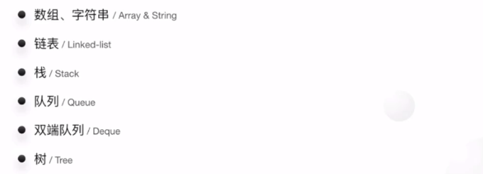

### 1.2 数组、字符串/ Array & String

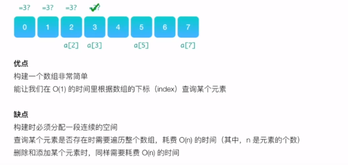

> 力扣试题：（字母异位词：两个字符串中的相同字符的数量要对应相等）

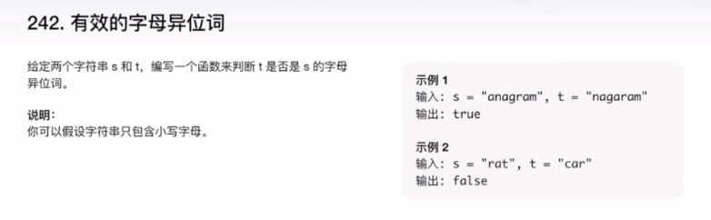

这是一道经典的考题，怎么分析和处理呢？题目里有一个重要的前提（跟面试官约定好）

> 思路：
>
> 1. 暴力方法：sort ， sorted_str 相等？O(nlogn)
> 2. hash，map --> 统计每个字符出现的频次 O(n)

**暴力方法：** 

先把字符串转化为字符数组，然后对字符数组进行排序，最后比较。 

```java
public boolean isAnagram(String s, String t) {
    if (s.length()!=t.length()){
        return false;
    }
    char a[] = s.toCharArray();
    char b[] = t.toCharArray();

    Arrays.sort(a);
    Arrays.sort(b);

    if (Arrays.equals(a, b)){
        return true;
    }

    return false;
}
```

**哈希映射：**

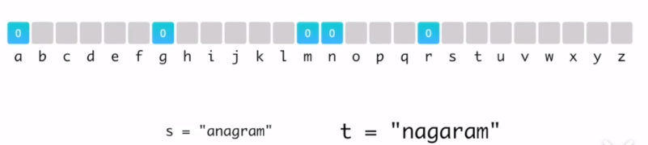

首先判断两个字符串长度是否相等，不等返回false

若相等，则初始化一个哈希表(指定一个长度为26的int数组)，遍历字符串s和t

s负责在对应位置增加，t负责在对应位置减少

如果哈希表的值都为0，则二者是字母异位词

```java
class Solution {
    public boolean isAnagram(String s, String t) {
        if(s == null || t == null || s.length() != t.length()) {
            return false;
        }
           
        int[] map = new int[26];
        for(char c : s.toCharArray()){
            map[c-'a']++;
        }
        for(char c : t.toCharArray()){
            map[c-'a']--;
        }

        for(int i = 0;i<26;i++){
            if(map[i]!= 0)
                return false;
        }
        return true;
    }
}
```

### 1.3 链表 / Linked List

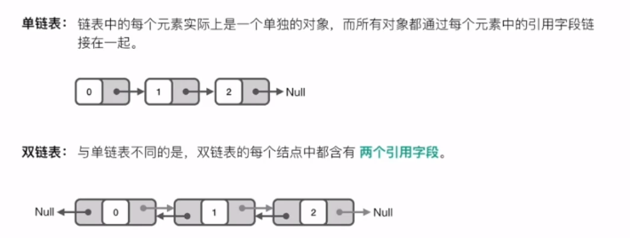

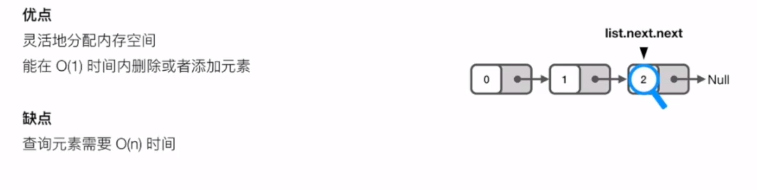

链表的出现某种程度上是为了避免数组的一大缺陷（分配数组的时候，需要开辟一段连续的内存空间）但鱼和熊掌不可兼得，链表也牺牲了数组的一些优点，链表不能通过下标快速查询，所以在考虑是否需要使用链表时，务必要想清楚你的算法是否需要经常查询和遍历。 

总之，链表的优点是能够灵活的分配内存空间，能在O(1)时间内删除和添加元素。前提确定了该元素的前一个元素。链表的缺点是不能像数组那样通过下标迅速的读取元素，每次都要从链表的头开始一个一个对比。所以，如果你想解决额问题需要很多快速的查询，可能就不合适了。

一般而言，如果你遇到的问题中数据的元素个数不确定，而且需要经常进行数据的添加和删除，那么链表会比较合适；而如果数据元素个数确定，添加和删除操作并不多就要考虑数组会更合适。

**解题技巧**

- 利用快慢指针（有时候需要用到三个指针）
- 构建一个虚拟的链表头

**例如**

两个排序链表，进行整合排序 

将链表的奇偶数按原定顺序分离，生成前半部分为奇数，后半部分为偶数的链表

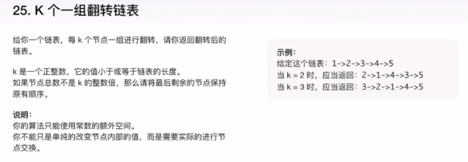


### 1.4 栈 / Stack

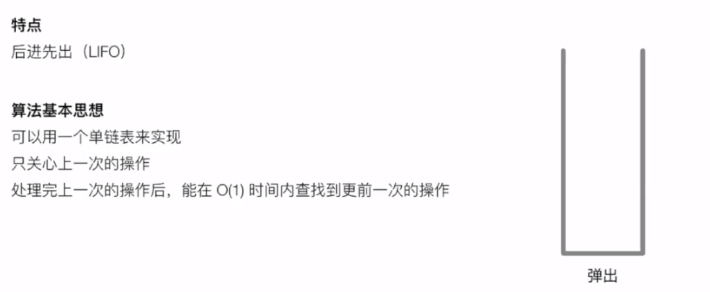

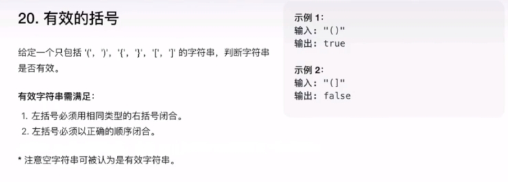

> 思路：方法就是利用一个栈，不断额往里面压左括号，一旦遇到一个右括号，就把栈顶的左括号弹出来，并将弹出的左括号和当前右括号是否为同一组合，依次类推，直到最后判断栈里没有左括号。

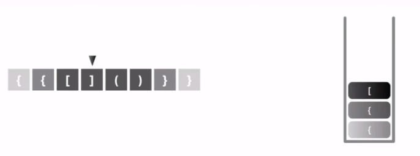

```java
public boolean isValid(String s) {
 
        Stack<Character> stack = new Stack<>();
 
        for (int i = 0; i < s.length(); i++){
            char ch = s.charAt(i);
            if(ch == '(' || ch == '[' || ch == '{'){
                stack.push(ch);
            }else{
                if(stack.isEmpty()){
                    return false;
                }
 
                char topChar = stack.pop();
                if(ch == ')' && topChar != '('){
                    return false;
                }else if(ch == ']' && topChar != '['){
                    return false;
                }else if(ch == '}' && topChar != '{'){
                    return false;
                }
            }
        }
 
        return stack.isEmpty();
    }
```

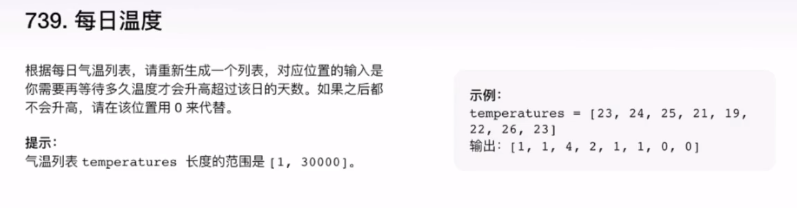

> 思路：有一种方式就是利用栈的方式，将脚标入栈，如果下一个数字T[i] 大于 栈顶 脚标对应的数字，则在结果集中 填写结果 result[栈顶脚标]=i-栈顶脚标。如果栈不空的话继续比较。
>
> 如果小于的话，则 i 入栈。 最后结束的时候判断栈是否为空，如果不空则说明栈内所有脚标对应的结果都是0；
>
> 这样只执行了一趟查询。时间快了很多。

```java
public int[] dailyTemperatures(int[] T) {
        Stack<Integer> stack=new Stack<>();
        stack.push(0);
        for(int i=1;i<T.length;i++){

            while (!stack.isEmpty()&&T[i]>T[stack.peek()]){
                T[stack.peek()]=i-stack.peek();
                stack.pop();

            }
            stack.push(i);

        }

        while (!stack.isEmpty()){
            int top=stack.peek();
            T[top]=0;
            stack.pop();
        }

        return T;
}
```

最终算法复杂度为: O(n)


### 1.5 队列 / Queue

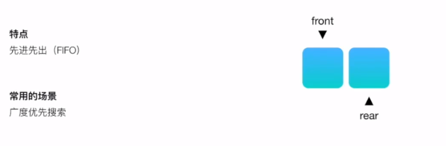

### 1.6 双端队列 / Deque

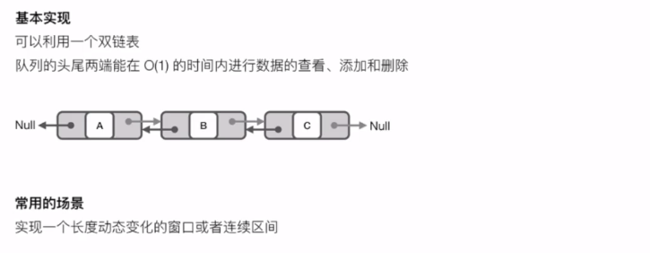

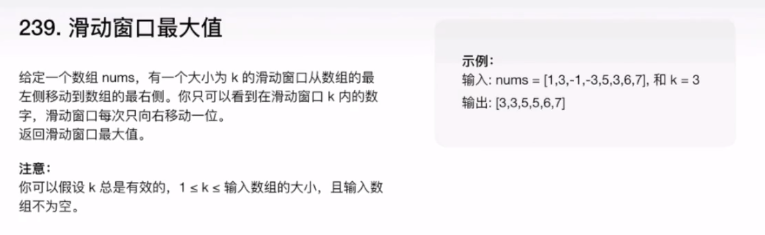

>  思路： 双端队列保存滑动窗口的最大值(保存在头部)，次大值数据窗口滑动，从右侧遍历，比当前值小的移出队列，队首元素过期 移出队列，当前元素的索引加入队列 

```java
public ArrayList<Integer> maxInWindowsII(int [] num, int size) {
        ArrayList<Integer> res = new ArrayList<>();
        if (num == null || size <= 0 || num.length < size) {
        	return res;
        }
        
        // 使用双端队列 缓存滑动窗口，最大值保存在头部
        ArrayDeque<Integer> queue = new ArrayDeque<>();
        int len = num.length;
        
        for (int i=0; i<len; i++){
        	// 从后面依次弹出队列中比当前num值小的元素，同时也能保证队列首元素为当前窗口最大值下标
            while(!queue.isEmpty() && num[queue.peekLast()]<=num[i]) {
            	queue.pollLast();
            }
            // 当队首元素坐标对应的num不在窗口中，需要弹出
            if(!queue.isEmpty() && i-queue.peekFirst()+1>size) {
                queue.pollFirst();
            }
            // 把每次滑动的num下标加入队列
            queue.offerLast(i);
            // 当滑动窗口首地址i大于等于size时才开始写入窗口最大值
            if(i+1 >= size) {
                res.add(num[queue.peekFirst()]);
            }
        }
        
        return res;
    }
```

最终算法复杂度为: O(n)

### 1.7 树 / Tree

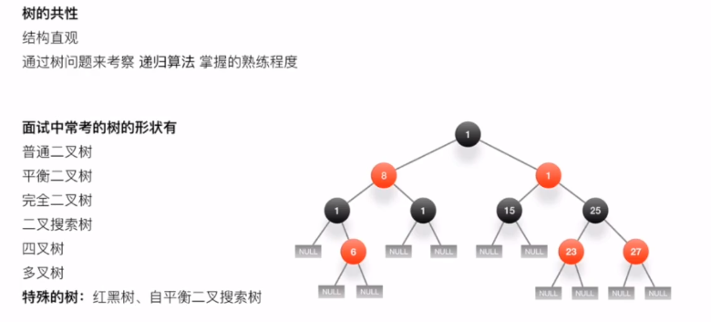

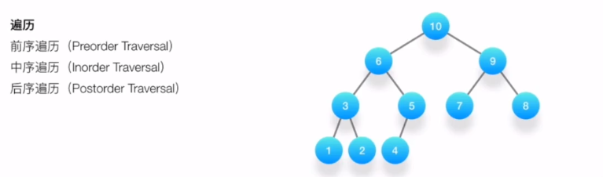


## 二、高级数据结构

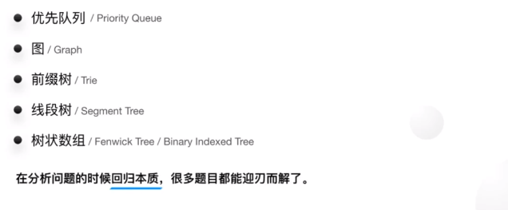

### 2.1 优先队列 / Priority Queue

优先队列也是一种队列，只不过不同的是，优先队列的出队顺序是按照优先级来的；在有些情况下，可能需要找到元素集合中的最小或者最大元素，可以利用优先队列ADT来完成操作，优先队列ADT是一种数据结构，它支持插入和删除最小值操作（返回并删除最小元素）或删除最大值操作（返回并删除最大元素）；

这些操作等价于队列的`enQueue`和`deQueue`操作，区别在于，对于优先队列，元素进入队列的顺序可能与其被操作的顺序不同，作业调度是优先队列的一个应用实例，它根据优先级的高低而不是先到先服务的方式来进行调度；


如果最小键值元素拥有最高的优先级，那么这种优先队列叫作**升序优先队列**（即总是先删除最小的元素），类似的，如果最大键值元素拥有最高的优先级，那么这种优先队列叫作**降序优先队列**（即总是先删除最大的元素）；由于这两种类型时对称的，所以只需要关注其中一种，如升序优先队列；

