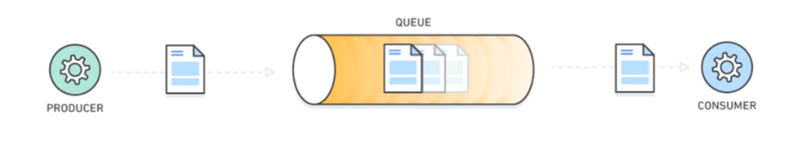
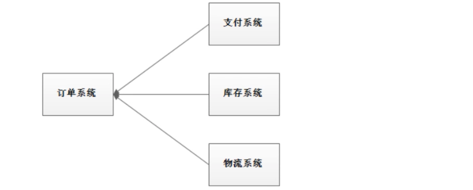
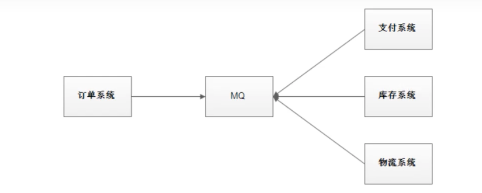
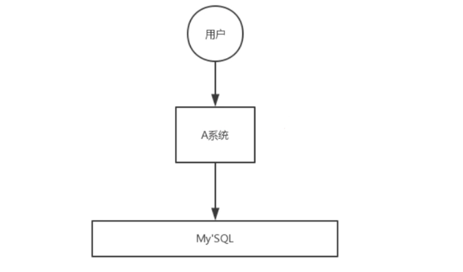
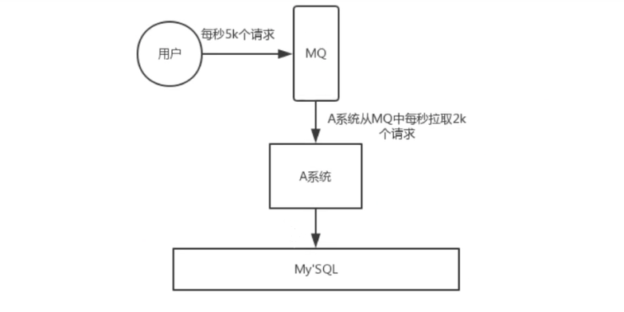
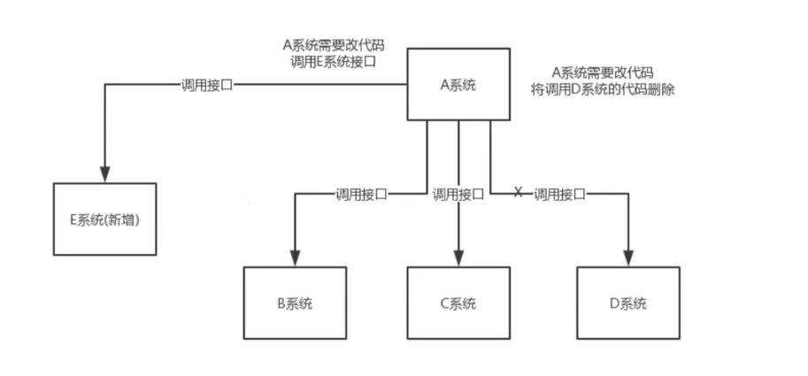
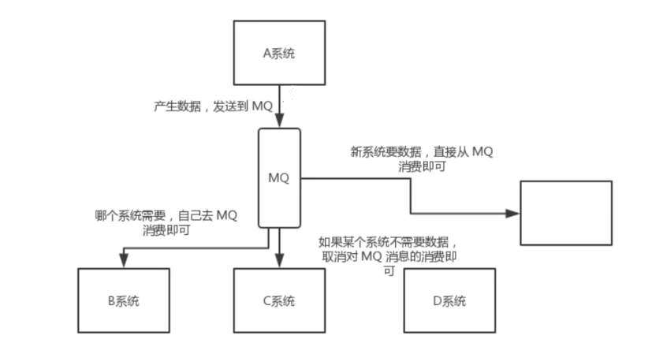
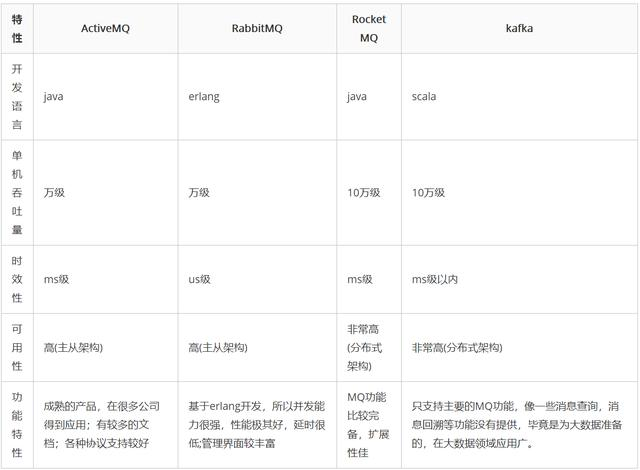

# 介绍

## 为什么要用 MQ

消息队列是一种"先进先出"的数据结构

其应用场景包含以下3个方面

- 应用解耦 

  系统的耦合性越高，容错性就越低。以电商应用为例，用户创建订单后，如果耦合调用库存系统、物流系统、支付系统，任何一个子系统出故障或者因为升级等原因暂时不可用，都会造成下单操作异常，影响用户使用体验。

  

  使用消息队列解耦，系统的容错性就提高了。比如物流系统发生故障，需要几分钟才能修复，在这段时间内，物流系统要处理的数据就会被缓存到消息队列中，用户的下单操作正常完成。当物流系统恢复后，补充处理消息队列中的消息即可，终端系统感知不到物流系统发生过几分钟的故障。

  

- 流量削峰

  

  应用系统如果遇到系统请求量的瞬间猛增，有可能会将系统压垮。有了消息队列就可以将大量的请求缓存起来，分散到很长一段时间处理，这样就可以大大提高系统的稳定性和用户体验。

  

  一般情况下，为了保证系统的稳定性，如果系统负载超过阈值，就会阻止用户请求，但是这样会影响用户体验，而如果使用消息队列将请求缓存起来，等待系统处理完毕后通知用户下单完毕，这样总比不能下单体验要好。 

  处于成本考虑：业务系统正常时段1000 qps，流量峰值10000qps，为了应对峰值流量而配置高性能服务器显然不划算，这时可以使用消息队列对流量削峰。

- 数据分发

  

  通过消息队列可以让数据在多个系统之间进行数据流通。数据的产生不需要关心谁会使用数据，只需要将数据发送到消息队列，数据使用方直接在消息队列中获取数据即可
  
  
  
## MQ的优缺点

优点：解耦、削峰、数据分发

缺点包含以下几点：

- 系统可用性降低

  系统引入了外部依赖越多，系统稳定性就越差。一旦MQ宕机，就会对业务造成影响。

  问题：如果保证MQ的高可用

- 系统复杂度提高

  MQ的引入大大提高的系统的复杂度，以前系统间同步的远程调用，现在要通过MQ进行异步调用。
  问题：如果保证消息没有被重复消费？怎么处理消息丢失问题？如果保证消息传递的顺序性？

- 一致性问题

  A系统处理完业务，通过MQ给B、C、D三个系统发送数据，如果B系统、C系统处理成功，D系统处理失败，如何保证数据处理的一致性？

## 各种MQ产品比较

常见的MQ产品包括：Kafka、ActiveMQ、RabbitMQ、RocketMQ。

  
