# RocketMQ

存在疑问：

1. RocketMQ生产者组topic和消费组的关系
2. RocketMQ 多线程下如何线程安全问题？


## 一、 简介

RocketMQ一个纯java、分布式、队列模型的开源消息中间件，前身是MetaQ，是阿里研发的一个队列模型的消息中间件，后开源给apache基金会成为了apache的顶级开源项目，具有高性能、高可靠、高实时、分布式特点。

## 二、RocketMQ 专业术语

先讲专业术语的含义，后面会画流程图来更好的去理解它们。

- Producer

  消息生产者，位于用户的进程内，`Producer通过NameServer获取所有Broker的路由信息`，根据负载均衡策略选择将消息发到哪个Broker，然后调用Broker接口提交消息。

- Producer Group

  生产者组，简单来说就是多个发送同一类消息的生产者称之为一个生产者组。

- Consumer

  消息消费者，位于用户进程内。Consumer通过NameServer获取所有broker的路由信息后，向Broker发送请求来获取消息数据。Consumer可以以两种模式启动，**广播（Broadcast）和集群（Cluster）**，**广播模式下，一条消息会发送给所有Consumer，集群模式下消息只会发送给一个Consumer**。

- Consumer Group

  消费者组，和生产者类似，消费同一类消息的多个 Consumer 实例组成一个消费者组。

- Topic

  Topic用于将消息按主题做划分，**Producer将消息发往指定的Topic，Consumer订阅该Topic就可以收到这条消息**。Topic跟发送方和消费方都没有强关联关系，发送方可以同时往多个Topic投放消息，消费方也可以订阅多个Topic的消息。在RocketMQ中，**Topic是一个上逻辑概念。消息存储不会按Topic分开**。

- Message

  代表一条消息，使用`MessageId`唯一识别，用户在发送时可以设置messageKey，便于之后查询和跟踪。一个 Message 必须指定 Topic，相当于寄信的地址。Message 还有一个可选的 Tag 设置，以便消费端可以基于 Tag 进行过滤消息。也可以添加额外的键值对，例如你需要一个业务 key 来查找 Broker 上的消息，方便在开发过程中诊断问题。

- Tag

  标签可以被认为是对 Topic 进一步细化。一般在相同业务模块中通过引入标签来标记不同用途的消息。

- Broker

  Broker是RocketMQ的核心模块，`负责接收并存储消息`，同时提供Push/Pull接口来将消息发送给Consumer。Consumer可选择从Master或者Slave读取数据。多个主/从组成Broker集群，集群内的Master节点之间不做数据交互。Broker同时提供消息查询的功能，可以通过MessageID和MessageKey来查询消息。Borker会将自己的Topic配置信息实时同步到NameServer。

- Queue

  **Topic和Queue是1对多的关系**，**一个Topic下可以包含多个Queue**，主要用于负载均衡。发送消息时，用户只指定Topic，Producer会根据Topic的路由信息选择具体发到哪个Queue上。Consumer订阅消息时，会根据负载均衡策略决定订阅哪些Queue的消息。

- Offset

  RocketMQ在存储消息时会为每个Topic下的每个Queue生成一个消息的索引文件，每个Queue都对应一个Offset**记录当前Queue中消息条数**。

- NameServer

  NameServer可以看作是RocketMQ的注册中心，它管理两部分数据：集群的Topic-Queue的路由配置；Broker的实时配置信息。其它模块通过Nameserv提供的接口获取最新的Topic配置和路由信息。

  - `Producer/Consumer` ：通过查询接口获取Topic对应的Broker的地址信息
  - `Broker` ： 注册配置信息到NameServer， 实时更新Topic信息到NameServer

## 三、流程图

我们由简单到复杂的来理解，它的一些核心概念

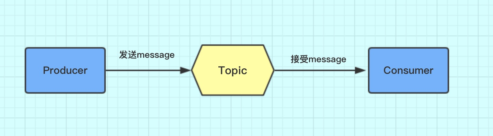

这个图很好理解，消息先发到Topic，然后消费者去Topic拿消息。只是Topic在这里只是个概念，那它到底是怎么存储消息数据的呢，这里就要引入Broker概念。

### 3.1 Topic的存储

Topic是一个逻辑上的概念，实际上Message是在每个Broker上以Queue的形式记录。


从上面的图片可以总结下几条结论。

> 1. 消费者发送的Message会在Broker中的Queue队列中记录。 
>
> 2. 一个Topic的数据可能会存在多个Broker中。
>
> 3. 一个Broker存在多个Queue。 
>
> 4. 单个的Queue也可能存储多个Topic的消息。

也就是说每个Topic在Broker上会划分成几个逻辑队列，每个逻辑队列保存一部分消息数据，但是保存的消息数据实际上不是真正的消息数据，而是指向commit log的消息索引。

`Queue不是真正存储Message的地方，真正存储Message的地方是在CommitLog`。


左边的是CommitLog。这个是真正存储消息的地方。RocketMQ所有生产者的消息都是往这一个地方存的。

右边是ConsumeQueue。这是一个逻辑队列。和上文中Topic下的Queue是一一对应的。消费者是直接和ConsumeQueue打交道。ConsumeQueue记录了消费位点，这个消费位点关联了commitlog的位置。所以即使ConsumeQueue出问题，只要commitlog还在，消息就没丢，可以恢复出来。还可以通过修改消费位点来重放或跳过一些消息。

### 3.2 部署模型

在部署RocketMQ时，会部署两种角色。NameServer和Broker。如图（盗图）


针对这张图做个说明

```
1、Product和consumer集群部署，是你开发的项目进行集群部署。
2、Broker 集群部署是为了高可用，因为Broker是真正存储Message的地方，集群部署是为了避免一台挂掉，导致整个项目KO.
```

那Name SerVer是做什么用呢，它和Product、Consumer、Broker之前存在怎样的关系呢？

先简单概括Name Server的特点

```
1、Name Server是一个几乎无状态节点，可集群部署，节点之间无任何信息同步。
2、每个Broker与Name Server集群中的所有节点建立长连接，定时注册Topic信息到所有Name Server。
3、Producer与Name Server集群中的其中一个节点（随机选择）建立长连接，定期从Name Server取Topic路由信息。
4、Consumer与Name Server集群中的其中一个节点（随机选择）建立长连接，定期从Name Server取Topic路由信息。
```

这里面最核心的是`每个Broker与Name Server集群中的所有节点建立长连接`这样做好处多多。

```
1、这样可以使Name Server之间可以没有任何关联，因为它们绑定的Broker是一致的。
2、作为Producer或者Consumer可以绑定任何一个Name Server 因为它们都是一样的。
```


## 四、详解Broker

- **Broker与Name Server关系**

  **1）连接** 单个Broker和所有Name Server保持长连接。

  **2）心跳**

  **心跳间隔**：每隔**30秒**向所有NameServer发送心跳，心跳包含了自身的Topic配置信息。

  **心跳超时**：NameServer每隔**10秒**，扫描所有还存活的Broker连接，若某个连接2分钟内没有发送心跳数据，则断开连接。

  **3）断开**：当Broker挂掉；NameServer会根据心跳超时主动关闭连接,一旦连接断开，会更新Topic与队列的对应关系，但不会通知生产者和消费者。

- **负载均衡**

  一个Topic分布在多个Broker上，一个Broker可以配置多个Topic，它们是多对多的关系。
  如果某个Topic消息量很大，应该给它多配置几个Queue，并且尽量多分布在不同Broker上，减轻某个Broker的压力。

- **可用性**

  由于消息分布在各个Broker上，一旦某个Broker宕机，则该Broker上的消息读写都会受到影响。

  所以RocketMQ提供了Master/Slave的结构，Salve定时从Master同步数据，如果Master宕机，则Slave提供消费服务，但是不能写入消息，此过程对应用透明，由RocketMQ内部解决。
  有两个关键点：
  `思考1`一旦某个broker master宕机，生产者和消费者多久才能发现？

  受限于Rocketmq的网络连接机制，默认情况下最多需要**30秒**，因为消费者每隔30秒从nameserver获取所有topic的最新队列情况，这意味着某个broker如果宕机，客户端最多要30秒才能感知。

  `思考2` master恢复恢复后，消息能否恢复。
  消费者得到Master宕机通知后，转向Slave消费，但是Slave不能保证Master的消息100%都同步过来了，因此会有少量的消息丢失。但是消息最终不会丢的，一旦Master恢复，未同步过去的消息会被消费掉。

## 五、Consumer (消费者)

- Consumer与Name Server关系
  - **连接** : 单个Consumer和一台NameServer保持长连接，如果该NameServer挂掉，消费者会自动连接下一个NameServer，直到有可用连接为止，并能自动重连。
  - **心跳**: 与NameServer没有心跳
  - **轮询时间** : 默认情况下，消费者每隔**30秒**从NameServer获取所有Topic的最新队列情况，这意味着某个Broker如果宕机，客户端最多要30秒才能感知。

- Consumer与Broker关系
  连接 : 单个消费者和该消费者关联的所有broker保持长连接。

- 负载均衡

  集群消费模式下，一个消费者集群多台机器共同消费一个Topic的多个队列，一个队列只会被一个消费者消费。如果某个消费者挂掉，分组内其它消费者会接替挂掉的消费者继续消费。

## 六、Producer(生产者)

- Producer与Name Server关系
  - **连接** 单个Producer和一台NameServer保持长连接，如果该NameServer挂掉，生产者会自动连接下一个NameServer，直到有可用连接为止，并能自动重连。
  - **轮询时间** 默认情况下，生产者每隔30秒从NameServer获取所有Topic的最新队列情况，这意味着某个Broker如果宕机，生产者最多要30秒才能感知，在此期间，
    发往该broker的消息发送失败。
  - **心跳** 与nameserver没有心跳

- 与broker关系

  连接 单个生产者和该生产者关联的所有broker保持长连接。


## 七、集群部署方式

### 7.1 单 Master 模式

只有一个 Master节点

- 优点：配置简单，方便部署

- 缺点：这种方式风险较大，一旦Broker重启或者宕机时，会导致整个服务不可用，不建议线上环境使用

### 7.2 多Master模式

多个 master 节点组成集群，单个 master 节点宕机或者重启对应用没有影响。

- 优点：所有模式中性能最高

-  缺点：单个 master 节点宕机期间，未被消费的消息在节点恢复之前不可用，消息的实时性就受到影响。

> 注意：使用同步刷盘可以保证消息不丢失，同时 Topic 相对应的 queue 应该分布在集群中各个节点，而不是只在某各节点上，否则，该节点宕机会对订阅该 topic 的应用造成影响。

### 7.3 多 master 多 slave 异步复制模式

在多 master 模式的基础上，每个 master 节点都有至少一个对应的 slave。master节点可读可写，但是 slave 只能读不能写，类似于 mysql 的主备模式。

- 优点： 在 master 宕机时，消费者可以从 slave 读取消息，消息的实时性不会受影响，性能几乎和多 master 一样。
- 缺点：使用异步复制的同步方式有可能会有消息丢失的问题。

### 7.4 多Master 多 Slave 同步双写模式

同多 master 多 slave 异步复制模式类似，区别在于 master 和 slave 之间的数据同步方式。

- 优点：同步双写的同步模式能保证数据不丢失。

- 缺点：发送单个消息 RT 会略长，性能相比异步复制低10%左右。发送单个消息的`RT`会略高，且目前版本在主节点宕机后，备机不能自动切换为主机。


## 八、双主双从集群搭建

### 8.1 总体架构

消息高可用采用2`master`-2`slave`（同步双写）方式


### 8.2 集群工作流程

1. 启动`NameServer`，`NameServer`起来后监听端口，等待`Broker`、`Producer`、`Consumer`连上来，相当于一个路由控制中心。
2. `Broker`启动，跟所有的`NameServer`保持长连接，定时发送心跳包。心跳包中包含当前`Broker`信息(`IP`+端口等)以及存储所有`Topic`信息。注册成功后，`NameServer`集群中就有`Topic`跟`Broker`的映射关系。
3. 收发消息前，先创建`Topic`，创建`Topic`时需要指定该`Topic`要存储在哪些`Broker`上，也可以在发送消息时自动创建`Topic`。
4. `Producer`发送消息，启动时先跟`NameServer`集群中的其中一台建立长连接，并从`NameServer`中获取当前发送的`Topic`存在哪些`Broker`上，轮询从队列列表中选择一个队列，然后与队列所在的`Broker`建立长连接从而向`Broker`发消息。
5. `Consumer`跟`Producer`类似，跟其中一台`NameServer`建立长连接，获取当前订阅`Topic`存在哪些`Broker`上，然后直接跟`Broker`建立连接通道，开始消费消息。

### 8.3 服务器环境

选择两个或四个服务器（根据实际情况选择）

| **序号** | **IP**       | **角色**                 | **架构模式**    |
| -------- | ------------ | ------------------------ | --------------- |
| 1        | 192.168.2.12 | nameserver、brokerserver | Master1、Slave2 |
| 2        | 192.168.2.13 | nameserver、brokerserver | Master2、Slave1 |

### 3.4 `Host`添加信息

```
vim /etc/hosts
```

配置如下:

```
# nameserver
192.168.2.12 rocketmq-nameserver1
192.168.2.13 rocketmq-nameserver2
# broker
192.168.2.12 rocketmq-master1
192.168.2.12 rocketmq-slave2
192.168.2.13 rocketmq-master2
192.168.2.13 rocketmq-slave1
```

配置完成后, 重启网卡

```
systemctl restart network
```

### 8.4 防火墙配置

宿主机需要远程访问虚拟机的`rocketmq`服务和`web`服务，需要开放相关的端口号，简单粗暴的方式是直接关闭防火墙

```bash
# 关闭防火墙
systemctl stop firewalld.service 
# 查看防火墙的状态
firewall-cmd --state 
# 禁止firewall开机启动
systemctl disable firewalld.service
```

[](https://img2020.cnblogs.com/blog/1580998/202006/1580998-20200609184046749-1812798366.png)

或者为了安全，只开放特定的端口号，`RocketMQ`默认使用3个端口：9876 、10911 、11011 。如果防火墙没有关闭的话，那么防火墙就必须开放这些端口：

- `nameserver` 默认使用 9876 端口
- `master` 默认使用 10911 端口
- `slave` 默认使用11011 端口

执行以下命令：

```
# 开放name server默认端口
firewall-cmd --remove-port=9876/tcp --permanent
# 开放master默认端口
firewall-cmd --remove-port=10911/tcp --permanent
# 开放slave默认端口 (当前集群模式可不开启)
firewall-cmd --remove-port=11011/tcp --permanent 
# 重启防火墙
firewall-cmd --reload
```

### 8.5 环境变量配置

```
vim /etc/profile
```

在`profile`文件的末尾加入如下命令

```
#set rocketmq 该目录为rocketmq二进制包解压目录
ROCKETMQ_HOME=/usr/local/rocketmq
PATH=$PATH:$ROCKETMQ_HOME/bin
export ROCKETMQ_HOME PATH
```

输入:wq! 保存并退出， 并使得配置立刻生效：

```bash
source /etc/profile
```

### 8.6 创建消息存储路径

```
mkdir /usr/local/rocketmq/store
mkdir /usr/local/rocketmq/store/commitlog
mkdir /usr/local/rocketmq/store/consumequeue
mkdir /usr/local/rocketmq/store/index
```

```
mkdir /usr/local/rocketmq/store-s
mkdir /usr/local/rocketmq/store-s/commitlog
mkdir /usr/local/rocketmq/store-s/consumequeue
mkdir /usr/local/rocketmq/store-s/index
```

注意：master 和 slave 的store 必须分开，不然会报错

```
java.lang.RuntimeException: Lock failed,MQ already started
	at org.apache.rocketmq.store.DefaultMessageStore.start(DefaultMessageStore.java:214)
	at org.apache.rocketmq.broker.BrokerController.start(BrokerController.java:827)
	at org.apache.rocketmq.broker.BrokerStartup.start(BrokerStartup.java:64)
	at org.apache.rocketmq.broker.BrokerStartup.main(BrokerStartup.java:58)
```


### 8.7 `broker`配置文件

#### 1）`master1`

服务器：`192.168.2.12`

```
vim /usr/local/rocketmq/conf/2m-2s-sync/new-broker-a.properties
```

修改配置如下：

```
#所属集群名字
brokerClusterName=rocketmq-cluster
#broker名字，注意此处不同的配置文件填写的不一样
brokerName=broker-a
#0 表示 Master，>0 表示 Slave
brokerId=0
#nameServer地址，分号分割
namesrvAddr=rocketmq-nameserver1:9876;rocketmq-nameserver2:9876
#在发送消息时，自动创建服务器不存在的topic，默认创建的队列数
defaultTopicQueueNums=4
#是否允许 Broker 自动创建Topic，建议线下开启，线上关闭
autoCreateTopicEnable=true
#是否允许 Broker 自动创建订阅组，建议线下开启，线上关闭
autoCreateSubscriptionGroup=true
#Broker 对外服务的监听端口
listenPort=10911
#删除文件时间点，默认凌晨 4点
deleteWhen=04
#文件保留时间，默认 48 小时
fileReservedTime=120
#commitLog每个文件的大小默认1G
mapedFileSizeCommitLog=1073741824
#ConsumeQueue每个文件默认存30W条，根据业务情况调整
mapedFileSizeConsumeQueue=300000
#destroyMapedFileIntervalForcibly=120000
#redeleteHangedFileInterval=120000
#检测物理文件磁盘空间
diskMaxUsedSpaceRatio=88
#存储路径
storePathRootDir=/usr/local/rocketmq/store
#commitLog 存储路径
storePathCommitLog=/usr/local/rocketmq/store/commitlog
#消费队列存储路径存储路径
storePathConsumeQueue=/usr/local/rocketmq/store/consumequeue
#消息索引存储路径
storePathIndex=/usr/local/rocketmq/store/index
#checkpoint 文件存储路径
storeCheckpoint=/usr/local/rocketmq/store/checkpoint
#abort 文件存储路径
abortFile=/usr/local/rocketmq/store/abort
#限制的消息大小
maxMessageSize=65536
#flushCommitLogLeastPages=4
#flushConsumeQueueLeastPages=2
#flushCommitLogThoroughInterval=10000
#flushConsumeQueueThoroughInterval=60000
#Broker 的角色
#- ASYNC_MASTER 异步复制Master
#- SYNC_MASTER 同步双写Master
#- SLAVE
brokerRole=SYNC_MASTER
#刷盘方式
#- ASYNC_FLUSH 异步刷盘
#- SYNC_FLUSH 同步刷盘
flushDiskType=SYNC_FLUSH
#checkTransactionMessageEnable=false
#发消息线程池数量
#sendMessageThreadPoolNums=128
#拉消息线程池数量
#pullMessageThreadPoolNums=128
```

#### 2）`slave2`

服务器：`192.168.2.12`

```
vim /usr/local/rocketmq/conf/2m-2s-sync/new-broker-b-s.properties
```

修改配置如下：

```
#所属集群名字
brokerClusterName=rocketmq-cluster
#broker名字，注意此处不同的配置文件填写的不一样
brokerName=broker-b
#0 表示 Master，>0 表示 Slave
brokerId=1
#nameServer地址，分号分割
namesrvAddr=rocketmq-nameserver1:9876;rocketmq-nameserver2:9876
#在发送消息时，自动创建服务器不存在的topic，默认创建的队列数
defaultTopicQueueNums=4
#是否允许 Broker 自动创建Topic，建议线下开启，线上关闭
autoCreateTopicEnable=true
#是否允许 Broker 自动创建订阅组，建议线下开启，线上关闭
autoCreateSubscriptionGroup=true
#Broker 对外服务的监听端口
listenPort=11011
#删除文件时间点，默认凌晨 4点
deleteWhen=04
#文件保留时间，默认 48 小时
fileReservedTime=120
#commitLog每个文件的大小默认1G
mapedFileSizeCommitLog=1073741824
#ConsumeQueue每个文件默认存30W条，根据业务情况调整
mapedFileSizeConsumeQueue=300000
#destroyMapedFileIntervalForcibly=120000
#redeleteHangedFileInterval=120000
#检测物理文件磁盘空间
diskMaxUsedSpaceRatio=88
#存储路径
storePathRootDir=/usr/local/rocketmq/store-s
#commitLog 存储路径
storePathCommitLog=/usr/local/rocketmq/store-s/commitlog
#消费队列存储路径存储路径
storePathConsumeQueue=/usr/local/rocketmq/store-s/consumequeue
#消息索引存储路径
storePathIndex=/usr/local/rocketmq/store-s/index
#checkpoint 文件存储路径
storeCheckpoint=/usr/local/rocketmq/store-s/checkpoint
#abort 文件存储路径
abortFile=/usr/local/rocketmq/store-s/abort
#限制的消息大小
maxMessageSize=65536
#flushCommitLogLeastPages=4
#flushConsumeQueueLeastPages=2
#flushCommitLogThoroughInterval=10000
#flushConsumeQueueThoroughInterval=60000
#Broker 的角色
#- ASYNC_MASTER 异步复制Master
#- SYNC_MASTER 同步双写Master
#- SLAVE
brokerRole=SLAVE
#刷盘方式
#- ASYNC_FLUSH 异步刷盘
#- SYNC_FLUSH 同步刷盘
flushDiskType=ASYNC_FLUSH
#checkTransactionMessageEnable=false
#发消息线程池数量
#sendMessageThreadPoolNums=128
#拉消息线程池数量
#pullMessageThreadPoolNums=128
```

#### 3）`master2`

服务器：`192.168.2.13`

```
vim /usr/local/rocketmq/conf/2m-2s-sync/new-broker-b.properties
```

修改配置如下：

```
#所属集群名字
brokerClusterName=rocketmq-cluster
#broker名字，注意此处不同的配置文件填写的不一样
brokerName=broker-b
#0 表示 Master，>0 表示 Slave
brokerId=0
#nameServer地址，分号分割
namesrvAddr=rocketmq-nameserver1:9876;rocketmq-nameserver2:9876
#在发送消息时，自动创建服务器不存在的topic，默认创建的队列数
defaultTopicQueueNums=4
#是否允许 Broker 自动创建Topic，建议线下开启，线上关闭
autoCreateTopicEnable=true
#是否允许 Broker 自动创建订阅组，建议线下开启，线上关闭
autoCreateSubscriptionGroup=true
#Broker 对外服务的监听端口
listenPort=10911
#删除文件时间点，默认凌晨 4点
deleteWhen=04
#文件保留时间，默认 48 小时
fileReservedTime=120
#commitLog每个文件的大小默认1G
mapedFileSizeCommitLog=1073741824
#ConsumeQueue每个文件默认存30W条，根据业务情况调整
mapedFileSizeConsumeQueue=300000
#destroyMapedFileIntervalForcibly=120000
#redeleteHangedFileInterval=120000
#检测物理文件磁盘空间
diskMaxUsedSpaceRatio=88
#存储路径
storePathRootDir=/usr/local/rocketmq/store
#commitLog 存储路径
storePathCommitLog=/usr/local/rocketmq/store/commitlog
#消费队列存储路径存储路径
storePathConsumeQueue=/usr/local/rocketmq/store/consumequeue
#消息索引存储路径
storePathIndex=/usr/local/rocketmq/store/index
#checkpoint 文件存储路径
storeCheckpoint=/usr/local/rocketmq/store/checkpoint
#abort 文件存储路径
abortFile=/usr/local/rocketmq/store/abort
#限制的消息大小
maxMessageSize=65536
#flushCommitLogLeastPages=4
#flushConsumeQueueLeastPages=2
#flushCommitLogThoroughInterval=10000
#flushConsumeQueueThoroughInterval=60000
#Broker 的角色
#- ASYNC_MASTER 异步复制Master
#- SYNC_MASTER 同步双写Master
#- SLAVE
brokerRole=SYNC_MASTER
#刷盘方式
#- ASYNC_FLUSH 异步刷盘
#- SYNC_FLUSH 同步刷盘
flushDiskType=SYNC_FLUSH
#checkTransactionMessageEnable=false
#发消息线程池数量
#sendMessageThreadPoolNums=128
#拉消息线程池数量
#pullMessageThreadPoolNums=128
```

#### 4）`slave1`

服务器：`192.168.2.13`

```
vim /usr/local/rocketmq/conf/2m-2s-sync/new-broker-a-s.properties
```

修改配置如下：

```
#所属集群名字
brokerClusterName=rocketmq-cluster
#broker名字，注意此处不同的配置文件填写的不一样
brokerName=broker-a
#0 表示 Master，>0 表示 Slave
brokerId=1
#nameServer地址，分号分割
namesrvAddr=rocketmq-nameserver1:9876;rocketmq-nameserver2:9876
#在发送消息时，自动创建服务器不存在的topic，默认创建的队列数
defaultTopicQueueNums=4
#是否允许 Broker 自动创建Topic，建议线下开启，线上关闭
autoCreateTopicEnable=true
#是否允许 Broker 自动创建订阅组，建议线下开启，线上关闭
autoCreateSubscriptionGroup=true
#Broker 对外服务的监听端口
listenPort=11011
#删除文件时间点，默认凌晨 4点
deleteWhen=04
#文件保留时间，默认 48 小时
fileReservedTime=120
#commitLog每个文件的大小默认1G
mapedFileSizeCommitLog=1073741824
#ConsumeQueue每个文件默认存30W条，根据业务情况调整
mapedFileSizeConsumeQueue=300000
#destroyMapedFileIntervalForcibly=120000
#redeleteHangedFileInterval=120000
#检测物理文件磁盘空间
diskMaxUsedSpaceRatio=88
#存储路径
storePathRootDir=/usr/local/rocketmq/store-s
#commitLog 存储路径
storePathCommitLog=/usr/local/rocketmq/store-s/commitlog
#消费队列存储路径存储路径
storePathConsumeQueue=/usr/local/rocketmq/store-s/consumequeue
#消息索引存储路径
storePathIndex=/usr/local/rocketmq/store-s/index
#checkpoint 文件存储路径
storeCheckpoint=/usr/local/rocketmq/store-s/checkpoint
#abort 文件存储路径
abortFile=/usr/local/rocketmq/store-s/abort
#限制的消息大小
maxMessageSize=65536
#flushCommitLogLeastPages=4
#flushConsumeQueueLeastPages=2
#flushCommitLogThoroughInterval=10000
#flushConsumeQueueThoroughInterval=60000
#Broker 的角色
#- ASYNC_MASTER 异步复制Master
#- SYNC_MASTER 同步双写Master
#- SLAVE
brokerRole=SLAVE
#刷盘方式
#- ASYNC_FLUSH 异步刷盘
#- SYNC_FLUSH 同步刷盘
flushDiskType=ASYNC_FLUSH
#checkTransactionMessageEnable=false
#发消息线程池数量
#sendMessageThreadPoolNums=128
#拉消息线程池数量
#pullMessageThreadPoolNums=128
```

### 8.8 修改启动脚本文件

#### 1）`runbroker.sh`

```sh
vi /usr/local/rocketmq/bin/runbroker.sh
```

需要根据内存大小进行适当的对JVM参数进行调整：

```bash
#===================================================
# 开发环境配置 JVM Configuration
JAVA_OPT="${JAVA_OPT} -server -Xms256m -Xmx256m -Xmn128m"
```

#### 2）`runserver.sh`

```shell
vim /usr/local/rocketmq/bin/runserver.sh
JAVA_OPT="${JAVA_OPT} -server -Xms256m -Xmx256m -Xmn128m -XX:MetaspaceSize=128m -XX:MaxMetaspaceSize=320m"
```

### 8.9 服务启动

#### 1）启动`NameServer`集群

分别在`192.168.2.12`和`192.168.2.13`启动`NameServer`

```bash
cd /usr/local/rocketmq/bin
nohup sh mqnamesrv &
```

#### 2）启动`Broker`集群

- 在`192.168.2.12`上启动`master1`和`slave2`

`master1`：

```shell
cd /usr/local/rocketmq/bin
nohup sh mqbroker -c /usr/local/rocketmq/conf/2m-2s-sync/new-broker-a.properties &
```

`slave2`：

```shell
cd /usr/local/rocketmq/bin
nohup sh mqbroker -c /usr/local/rocketmq/conf/2m-2s-sync/new-broker-b-s.properties &
```

- 在`192.168.2.13`上启动`master2`和`slave2`

`master2`

```shell
cd /usr/local/rocketmq/bin
nohup sh mqbroker -c /usr/local/rocketmq/conf/2m-2s-sync/new-broker-b.properties &
```
`slave1`

```shell
cd /usr/local/rocketmq/bin
nohup sh mqbroker -c /usr/local/rocketmq/conf/2m-2s-sync/new-broker-a-s.properties &
```

### 8.10 查看进程状态

启动后通过`JPS`查看启动进程

### 8.11 查看日志

```shell
# 查看nameServer日志
tail -500f ~/logs/rocketmqlogs/namesrv.log
# 查看broker日志
tail -500f ~/logs/rocketmqlogs/broker.log
```


## 九、RocketMQ集群监控平台搭建

### 9.1 概述

`RocketMQ`有一个对其扩展的开源项目[incubator-rocketmq-externals](https://github.com/apache/rocketmq-externals)，这个项目中有一个子模块叫`rocketmq-console`，这个便是管理控制台项目了，先将[incubator-rocketmq-externals](https://github.com/apache/rocketmq-externals)拉到本地，因为我们需要自己对`rocketmq-console`进行编译打包运行。

### 9.2 下载并编译打包

```shell
git clone https://github.com/apache/rocketmq-externals
cd rocketmq-console
mvn clean package -Dmaven.test.skip=true
```

> 注意：打包前在`rocketmq-console`中配置`namesrv`集群地址：src/ application.properties

```
# 这里注意修改
rocketmq.config.namesrvAddr=192.168.2.12:9876;192.168.2.13:9876
```

启动`rocketmq-console`：

```shell
java -jar rocketmq-console-ng-1.0.0.jar
```

启动成功后，我们就可以通过浏览器访问`http://x.x.x.x:8080`进入控制台界面了，如下图：

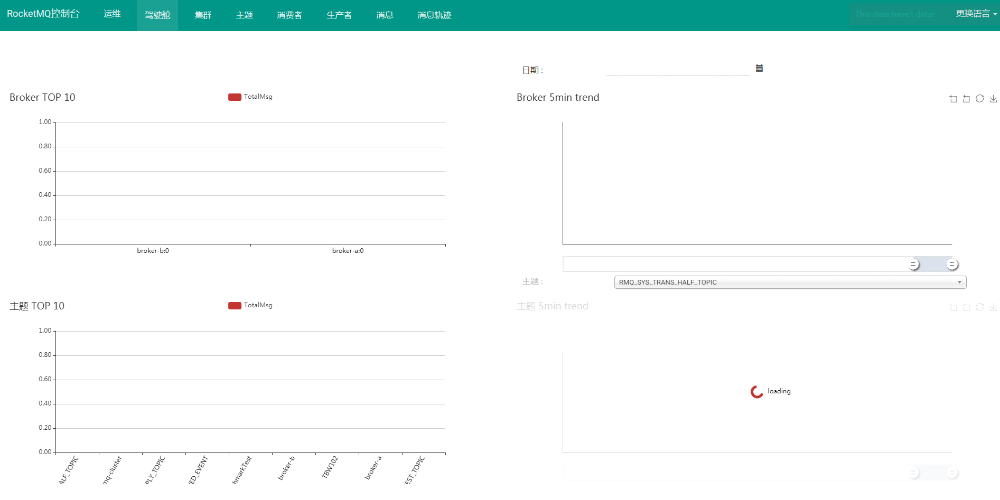


## 十、消息类型

### 10.1 普通消息

普通消息也叫做无序消息，简单来说就是没有顺序的消息，producer 只管发送消息，consumer 只管接收消息，至于消息和消息之间的顺序并没有保证，可能先发送的消息先消费，也可能先发送的消息后消费。

举个简单例子，producer 依次发送 order id 为 1、2、3 的消息到 broker，consumer 接到的消息顺序有可能是 1、2、3，也有可能是 2、1、3 等情况，这就是普通消息。

因为不需要保证消息的顺序，所以消息可以大规模并发地发送和消费，吞吐量很高，适合大部分场景。

代码实例：

- 生产者

  ```java
  public class Producer {
      public static void main(String[] args) throws MQClientException, InterruptedException {
   
          //声明并初始化一个producer
          //需要一个producer group名字作为构造方法的参数，这里为concurrent_producer
          DefaultMQProducer producer = new DefaultMQProducer("concurrent_producer");
   
          //设置NameServer地址,此处应改为实际NameServer地址，多个地址之间用；分隔
          //NameServer的地址必须有，但是也可以通过环境变量的方式设置，不一定非得写死在代码里
          producer.setNamesrvAddr("10.1.54.121:9876;10.1.54.122:9876");
   
          //调用start()方法启动一个producer实例
          producer.start();
   
          //发送10条消息到Topic为TopicTest，tag为TagA，消息内容为“Hello RocketMQ”拼接上i的值
          for (int i = 0; i < 10; i++) {
              try {
                  Message msg = new Message("TopicTestConcurrent",// topic
                          "TagA",// tag
                          ("Hello RocketMQ " + i).getBytes(RemotingHelper.DEFAULT_CHARSET)// body
                  );
   
                  //调用producer的send()方法发送消息
                  //这里调用的是同步的方式，所以会有返回结果，同时默认发送的也是普通消息
                  SendResult sendResult = producer.send(msg);
   
                  //打印返回结果，可以看到消息发送的状态以及一些相关信息
                  System.out.println(sendResult);
              } catch (Exception e) {
                  e.printStackTrace();
                  Thread.sleep(1000);
              }
          }
   
          //发送完消息之后，调用shutdown()方法关闭producer
          producer.shutdown();
      }
  }
  ```

- 消费者

  ```java
  public class Consumer {
   
      public static void main(String[] args) throws InterruptedException, MQClientException {
   
          //声明并初始化一个consumer
          //需要一个consumer group名字作为构造方法的参数，这里为concurrent_consumer
          DefaultMQPushConsumer consumer = new DefaultMQPushConsumer("concurrent_consumer");
   
          //同样也要设置NameServer地址
          consumer.setNamesrvAddr("10.1.54.121:9876;10.1.54.122:9876");
   
          //这里设置的是一个consumer的消费策略
          //CONSUME_FROM_LAST_OFFSET 默认策略，从该队列最尾开始消费，即跳过历史消息
          //CONSUME_FROM_FIRST_OFFSET 从队列最开始开始消费，即历史消息（还储存在broker的）全部消费一遍
          //CONSUME_FROM_TIMESTAMP 从某个时间点开始消费，和setConsumeTimestamp()配合使用，默认是半个小时以前
          consumer.setConsumeFromWhere(ConsumeFromWhere.CONSUME_FROM_FIRST_OFFSET);
   
          //设置consumer所订阅的Topic和Tag，*代表全部的Tag
          consumer.subscribe("TopicTestConcurrent", "*");
   
          //设置一个Listener，主要进行消息的逻辑处理
          //注意这里使用的是MessageListenerConcurrently这个接口
          consumer.registerMessageListener(new MessageListenerConcurrently() {
   
              @Override
              public ConsumeConcurrentlyStatus consumeMessage(List<MessageExt> msgs,
                                                              ConsumeConcurrentlyContext context) {
   
                  System.out.println(Thread.currentThread().getName() + " Receive New Messages: " + msgs);
   
                  //返回消费状态
                  //CONSUME_SUCCESS 消费成功
                  //RECONSUME_LATER 消费失败，需要稍后重新消费
                  return ConsumeConcurrentlyStatus.CONSUME_SUCCESS;
              }
          });
   
          //调用start()方法启动consumer
          consumer.start();
   
          System.out.println("Consumer Started.");
      }
  }
  ```

### 10.2 有序消息

有序消息就是按照一定的先后顺序的消息类型。

举个例子来说，producer 依次发送 order id 为 1、2、3 的消息到 broker，consumer 接到的消息顺序也就是 1、2、3 ，而不会出现普通消息那样的 2、1、3 等情况。

那么有序消息是如何保证的呢？我们都知道消息首先由 producer 到 broker，再从 broker 到 consumer，分这两步走。那么要保证消息的有序，势必这两步都是要保证有序的，即要保证消息是按有序发送到 broker，broker 也是有序将消息投递给 consumer，两个条件必须同时满足，缺一不可。
进一步还可以将有序消息分成

- 全局有序消息
- 局部有序消息

之前我们讲过，topic 只是消息的逻辑分类，内部实现其实是由 queue 队列 组成。当 producer 把消息发送到某个 topic 时，默认是会消息发送到具体的 queue 队列 上。

#### 1）全局有序

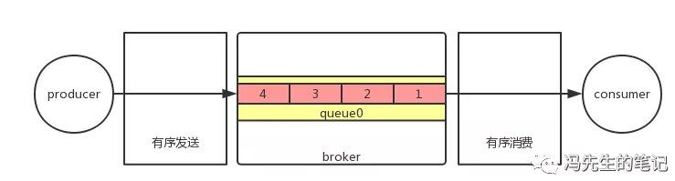

举个例子，producer 发送 order id 为 1、2、3、4 的四条消息到 topicA 上，假设 topicA 的 queue 数为 3 个（queue0、queue1、queue2），那么消息的分布可能就是这种情况，id 为 1 的在 queue0，id 为 2 的在 queue1，id 为 3 的在 queue2，id 为 4 的在 queue0。同样的，consumer 消费时也是按 queue 去消费，这时候就可能出现先消费 1、4，再消费 2、3，和我们的预期不符。那么我们如何实现 1、2、3、4 的消费顺序呢？道理其实很简单，只需要把订单 topic 的 queue 数改为 1，如此一来，只要 producer 按照 1、2、3、4 的顺序去发送消息，那么 consumer 自然也就按照 1、2、3、4 的顺序去消费，这就是全局有序消息。

由于一个 topic 只有一个 queue ，即使我们有多个 producer 实例和 consumer 实例也很难提高消息吞吐量。就好比过独木桥，大家只能一个挨着一个过去，效率低下。

那么有没有吞吐量和有序之间折中的方案呢？其实是有的，就是局部有序消息。

#### 2）局部有序

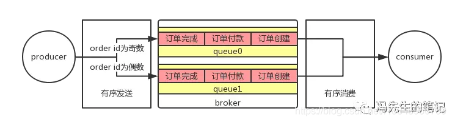

我们知道订单消息可以再细分为订单创建、订单付款、订单完成等消息，这些消息都有相同的 order id。同时，也只有按照订单创建、订单付款、订单完成的顺序去消费才符合业务逻辑。但是不同 order id 的消息是可以并行的，不会影响到业务。这时候就常见做法就是将 order id 进行处理，将 order id 相同的消息发送到 topicB 的同一个 queue，假设我们 topicB 有 2 个 queue，那么我们可以简单的对 order id对队列集合大小求余来返回所对应的队列，消费者按照 queue 去消费时，就能保证 queue0 里面的消息有序消费，queue1 里面的消息有序消费。

由于一个 topic 可以有多个 queue，所以在性能比全局有序高得多。假设 queue 数是 n，理论上性能就是全局有序的 n 倍，当然 consumer 也要跟着增加才行。在实际情况中，这种局部有序消息是会比全局有序消息用的更多。

示例代码：

- 生产者

  

  ```java
  public class Producer {
      public static void main(String[] args) throws UnsupportedEncodingException {
          try {
              // 声明并初始化一个producer
              // 需要一个producer group名字作为构造方法的参数，这里为ordered_producer
              DefaultMQProducer orderedProducer = new DefaultMQProducer("ordered_producer");
   
              // 设置NameServer地址,此处应改为实际NameServer地址，多个地址之间用；分隔
              //NameServer的地址必须有，但是也可以通过环境变量的方式设置，不一定非得写死在代码里
              orderedProducer.setNamesrvAddr("10.1.54.121:9876;10.1.54.122:9876");
   
              // 调用start()方法启动一个producer实例
              orderedProducer.start();
   
              // 自定义一个tag数组
              String[] tags = new String[]{"TagA", "TagB", "TagC", "TagD", "TagE"};
   
              // 发送10条消息到Topic为TopicTestOrdered，tag为tags数组按顺序取值，
              // key值为“KEY”拼接上i的值，消息内容为“Hello RocketMQ”拼接上i的值
              for (int i = 0; i < 10; i++) {
   
                  int orderId = i % 10;
                  Message msg =
                          new Message("TopicTestOrdered", tags[i % tags.length], "KEY" + i,
                                  ("Hello RocketMQ " + i).getBytes(RemotingHelper.DEFAULT_CHARSET));
   
                  SendResult sendResult = orderedProducer.send(msg, new MessageQueueSelector() {
   
                      // 选择发送消息的队列
                      @Override
                      public MessageQueue select(List<MessageQueue> mqs, Message msg, Object arg) {
   
                          // arg的值其实就是orderId
                          Integer id = (Integer) arg;
   
                          // mqs是队列集合，也就是topic所对应的所有队列
                          int index = id % mqs.size();
   
                          // 这里根据前面的id对队列集合大小求余来返回所对应的队列
                          return mqs.get(index);
                      }
                  }, orderId);
   
                  System.out.println(sendResult);
              }
   
              orderedProducer.shutdown();
          } catch (MQClientException e) {
              e.printStackTrace();
          } catch (RemotingException e) {
              e.printStackTrace();
          } catch (MQBrokerException e) {
              e.printStackTrace();
          } catch (InterruptedException e) {
              e.printStackTrace();
          }
      }
  }
  ```

  至于是要实现全局有序，还是局部有序，在此示例代码中，就取决于 TopicTestOrdered 这个 Topic 的队列数了。

- 消费者

  ```java
  public class Consumer {
   
      public static void main(String[] args) throws MQClientException {
   
          //声明并初始化一个consumer
          //需要一个consumer group名字作为构造方法的参数，这里为concurrent_consumer
          DefaultMQPushConsumer consumer = new DefaultMQPushConsumer("ordered_consumer");
   
          //同样也要设置NameServer地址
          consumer.setNamesrvAddr("10.1.54.121:9876;10.1.54.122:9876");
   
          //这里设置的是一个consumer的消费策略
          //CONSUME_FROM_LAST_OFFSET 默认策略，从该队列最尾开始消费，即跳过历史消息
          //CONSUME_FROM_FIRST_OFFSET 从队列最开始开始消费，即历史消息（还储存在broker的）全部消费一遍
          //CONSUME_FROM_TIMESTAMP 从某个时间点开始消费，和setConsumeTimestamp()配合使用，默认是半个小时以前
          consumer.setConsumeFromWhere(ConsumeFromWhere.CONSUME_FROM_FIRST_OFFSET);
   
          //设置consumer所订阅的Topic和Tag
          consumer.subscribe("TopicTestOrdered", "TagA || TagC || TagD");
   
          //设置一个Listener，主要进行消息的逻辑处理
          //注意这里使用的是MessageListenerOrderly这个接口
          consumer.registerMessageListener(new MessageListenerOrderly() {
   
              @Override
              public ConsumeOrderlyStatus consumeMessage(List<MessageExt> msgs, ConsumeOrderlyContext context) {
   
                  System.out.println(Thread.currentThread().getName() + " Receive New Messages: " + msgs);
   
                  //返回消费状态
                  //SUCCESS 消费成功
                  //SUSPEND_CURRENT_QUEUE_A_MOMENT 消费失败，暂停当前队列的消费
                  return ConsumeOrderlyStatus.SUCCESS;
              }
          });
   
          //调用start()方法启动consumer
          consumer.start();
   
          System.out.println("Consumer Started.");
      }
  }
  ```

  

  #### 3）顺序消息常见问题

1. 同一条消息是否可以既是顺序消息，又是定时消息和事务消息？

   不可以。顺序消息、定时消息、事务消息是不同的消息类型，三者是互斥关系，不能叠加在一起使用。

2. 顺序消息支持哪些地域？

   支持消息队列 RocketMQ 版所有公共云地域和金融云地域。

3. 为什么全局顺序消息性能一般？

   全局顺序消息是严格按照 FIFO 的消息阻塞原则，即上一条消息没有被成功消费，那么下一条消息会一直被存储到 Topic 队列中。如果想提高全局顺序消息的 TPS，可以升级实例配置，同时消息客户端应用尽量减少处理本地业务逻辑的耗时。

4. 顺序消息支持哪种消息发送方式？

   顺序消息只支持可靠同步发送方式，不支持异步发送方式，否则将无法严格保证顺序。

5. 顺序消息是否支持集群消费和广播消费？

   顺序消息暂时仅支持集群消费模式，不支持广播消费模式。

### 10.4 延时消息

延时消息，简单来说就是当 producer 将消息发送到 broker 后，会延时一定时间后才投递给 consumer 进行消费。

RcoketMQ的延时等级为：1s，5s，10s，30s，1m，2m，3m，4m，5m，6m，7m，8m，9m，10m，20m，30m，1h，2h。level=0，表示不延时。level=1，表示 1 级延时，对应延时 1s。level=2 表示 2 级延时，对应5s，以此类推。

这种消息一般适用于消息生产和消费之间有时间窗口要求的场景。比如说我们网购时，下单之后是有一个支付时间，超过这个时间未支付，系统就应该自动关闭该笔订单。那么在订单创建的时候就会就需要发送一条延时消息（延时15分钟）后投递给 consumer，consumer 接收消息后再对订单的支付状态进行判断是否关闭订单。

设置延时非常简单，只需要在Message设置对应的延时级别即可：

```java
Message msg = new Message("TopicTest",// topic
                        "TagA",// tag
                        ("Hello RocketMQ " + i).getBytes(RemotingHelper.DEFAULT_CHARSET)// body
                );
                // 这里设置需要延时的等级即可
                msg.setDelayTimeLevel(3);
                SendResult sendResult = producer.send(msg);
```


### 10.5 批量消息

> 批量发送消息能显著提高传递小消息的性能。限制是这些批量消息应该有相同的topic，相同的waitStoreMsgOk，而且不能是延时消息。此外，这一批消息的总大小不应超过4MB, 如果超过4MB，这时候最好把消息进行分割。

#### 1） 发送批量消息

如果你每次只发送不超过 4MB 的消息, 则可以使用批量处理，样例如下：

```java
public class Producer {
 
    public static void main(String[] args) throws MQClientException, RemotingException, InterruptedException, MQBrokerException {
        // 1.创建消息生产者producer，并制定生产者组名
        DefaultMQProducer producer = new DefaultMQProducer("group1");
        // 2.指定NameServer地址
        producer.setNamesrvAddr("localhost:9876");
        // 3.启动producer
        producer.start();
 
        List<Message> msgs = new ArrayList<Message>();
        // 4.创建消息对象，指定主题Topic、Tag和消息体
        /*
        参数1：消息主题Topic
        参数2：消息Tag
        参数3：消息内容
         */
        Message msg1 = new Message("batchTopic","tag1",("hello world"+1).getBytes());
        Message msg2 = new Message("batchTopic","tag1",("hello world"+2).getBytes());
        Message msg3 = new Message("batchTopic","tag1",("hello world"+2).getBytes());
        msgs.add(msg1);
        msgs.add(msg2);
        msgs.add(msg3);
        // 5.发送消息结果包含  发送状态  消息id 消息接收队列id等
        SendResult result = producer.send(msgs);
        System.out.println("发送结果"+result);
 
        // 线程睡眠1秒
        TimeUnit.SECONDS.sleep(1);
        // 6.关闭生产者producer
        producer.shutdown();
    }
}
```

#### 2) 消费者消费消息

```java
public class Consumer {
    public static void main(String[] args) throws MQClientException {
        // 1.创建消费者Consumer，制定消费者组名
        DefaultMQPushConsumer consumer = new DefaultMQPushConsumer("group1");
        // 2.指定Nameserver地址
        consumer.setNamesrvAddr("localhost:9876");
        // 3.订阅主题Topic和Tag
        consumer.subscribe("batchTopic","*");
        // 消费模式：默认是负载均衡模式，还有一种是广播模式
//        consumer.setMessageModel(MessageModel.BROADCASTING);
        // 4.设置回调函数，处理消息
        consumer.registerMessageListener(new MessageListenerConcurrently() {
            //接收消息内容
            public ConsumeConcurrentlyStatus consumeMessage(List<MessageExt> list, ConsumeConcurrentlyContext consumeConcurrentlyContext) {
                for (MessageExt messageExt : list) {
                    System.out.println(new String(messageExt.getBody()));
                }
                return ConsumeConcurrentlyStatus.CONSUME_SUCCESS;
            }
        });
        // 5.启动消费者consumer
        consumer.start();
        System.out.println("消费者启动");
    }
}
```

### 10.5 事务消息

#### 1）背景

MQ组件是系统架构里必不可少的一门利器，设计层面可以降低系统耦合度，高并发场景又可以起到削峰填谷的作用，从单体应用到集群部署方案，再到现在的微服务架构，MQ凭借其优秀的性能和高可靠性，得到了广泛认可。

随着数据量增多，系统压力变大，开始出现这种现象：数据库已经更新了，但消息没发出来，或者消息先发了，但后来数据库更新失败了，结果研发童鞋各种数据修复，这种生产问题出现的概率不大，但让人很郁闷。这个其实就是数据库事务与MQ消息的一致性问题，简单来讲，数据库的事务跟普通MQ消息发送无法和数据库事务绑定在一起，例如上面提及的两种问题场景：

1. 数据库事务提交后发送MQ消息；
2. MQ消息先发，然后再提交数据库事务。

场景1的问题是数据库事务可能刚刚提交，服务器就宕机了，MQ消息没发出去，场景2的问题就是MQ消息发送出去了，但数据库事务提交失败，又没办法追加已经发出去的MQ消息，结果导致数据没更新，下游已经收到消息，最终事务出现不一致的情况。

#### 2）事务的引出

我们以微服务架构的购物场景为例，参照一下RocketMQ官方的例子，用户A发起订单，支付100块钱操作完成后，能得到100积分，账户服务和会员服务是两个独立的微服务模块，有各自的数据库，按照上文提及的问题可能性，将会出现这些情况：

- 如果先扣款，再发消息，可能钱刚扣完，宕机了，消息没发出去，结果积分没增加。
- 如果先发消息，再扣款，可能积分增加了，但钱没扣掉，白送了100积分给人家。
- 钱正常扣了，消息也发送成功了，但会员服务实例消费消息出现问题，结果积分没增加。

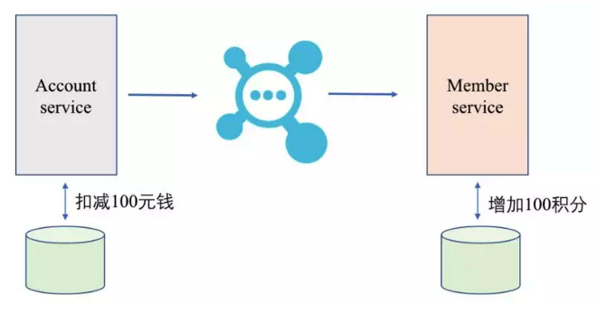

由此引出的是数据库事务与MQ消息的事务一致性问题，rocketmq事务消息解决的问题：解决本地事务执行与消息发送的原子性问题。这里界限一定要明白，是确保MQ生产端正确无误地将消息发送出来，没有多发，也不会漏发。但至于发送后消费端有没有正常的消费掉（如上面提及的第三种情况，钱正常扣了，消息也发了，但下游消费出问题导致积分不对），这种异常场景将由MQ消息消费失败重试机制来保证，不在此次的讨论范围内。

#### 3）RocketMQ事务消息设计思路

根据CAP理论，RocketMQ事务消息通过异步确保方式，保证事务的最终一致性。设计流程上借鉴两阶段提交理论，流程图如下：


1. 应用模块遇到要发送事务消息的场景时，先发送 half消息 给MQ。
2. Half消息发送成功后，应用模块执行数据库事务（本地事务）,如果写入失败，此时Half消息对业务不可见，本地逻辑不执行）
3. 根据数据库事务执行的结果，再返回Commit或Rollback给MQ。
4. 如果是Commit，MQ把消息下发给Consumer端，如果是Rollback，直接删掉prepare消息。
5. 第3步的执行结果如果没响应，或是超时的，启动定时任务回查事务状态（最多重试15次，超过了默认丢弃此消息），处理结果同第4步。
6. MQ消费的成功机制由MQ自己保证。

#### 4）事务消息状态

事务消息共有三种状态：提交状态、回滚状态、中间状态

- TransactionStatus.CommitTransaction: 提交状态，它允许消费者消费此消息
- TransactionStatus.RollbackTransaction: 回滚状态，它代表该消息被删除，不允许被消费
- TransactionStatus.Unknown：中间状态，它代表需要检查消息队列来确定状态

示例代码：

- 生产者

  ```java
  public class SyncProducer {
      public static void main(String[] args) throws Exception {
  
          // 创建事务消息生产者对象 producer, 并指定生产者组
          TransactionMQProducer producer = new TransactionMQProducer("transaction_group");
          // 指定 NameServer 地址
          producer.setNamesrvAddr("192.168.44.139:9876; 192.168.44.140:9876");
  
          // 添加事务监听器
          producer.setTransactionListener(new TransactionListener() {
              /**
               * 在该方法中执行本地事务
               * @param msg
               * @param arg
               * @return
               */
              public LocalTransactionState executeLocalTransaction(Message msg, Object arg) {
                  if (StringUtils.equals("TAGA", msg.getTags())) {
                      return LocalTransactionState.COMMIT_MESSAGE;
                  } else if (StringUtils.equals("TAGB", msg.getTags())){
                      return LocalTransactionState.ROLLBACK_MESSAGE;
                  } else {
                      return LocalTransactionState.UNKNOW;
                  }
              }
  
              /**
               * 该方法是 MQ 进行事务消息状态的回查
               * @param msg
               * @return
               */
              public LocalTransactionState checkLocalTransaction(MessageExt msg) {
                  System.out.println("消息的TAG：" + msg.getTags());
                  return LocalTransactionState.COMMIT_MESSAGE;
              }
          });
  
          // 启动 producer
          producer.start();
  
          // 发送消息
          String[] tags = {"TAGA", "TAGB", "TABC"};
          for (int i = 0; i < 3; i++) {
              Message message = new Message("TransactionTopic", tags[i], ("hello world" + i).getBytes());
  
              SendResult send = producer.sendMessageInTransaction(message, null);
              System.out.println("发送结果："+send);
          }
  
          // 关闭生产者 producer
          //producer.shutdown();
          System.out.println("发送完毕");
      }
  }
  ```

- 消费者

  ```java
  public class Consumer {
      public static void main(String[] args) throws Exception {
          // 1.创建消费者Consumer，制定消费者组名
          DefaultMQPushConsumer consumer = new DefaultMQPushConsumer("sync_group5");
          // 2.指定Nameserver地址
          consumer.setNamesrvAddr("192.168.44.139:9876; 192.168.44.140:9876");
          // 3.订阅主题Topic和Tag
          consumer.subscribe("TransactionTopic","*");
          // 消费模式：默认是负载均衡模式，还有一种是广播模式
          consumer.setMessageModel(MessageModel.CLUSTERING);
          // 4.设置回调函数，处理消息
          consumer.registerMessageListener(new MessageListenerConcurrently() {
              //接收消息内容
              public ConsumeConcurrentlyStatus consumeMessage(List<MessageExt> list, ConsumeConcurrentlyContext consumeConcurrentlyContext) {
                  for (MessageExt messageExt : list) {
                      System.out.println(new String(messageExt.getBody()));
                  }
                  return ConsumeConcurrentlyStatus.CONSUME_SUCCESS;
              }
          });
          // 5.启动消费者consumer
          consumer.start();
          System.out.println("生产者启动");
      }
  }
  ```

  最终 TAGA 和 TAGC TAGC 消费成功。


## 十一、消息发送方式

#### 1）同步发送

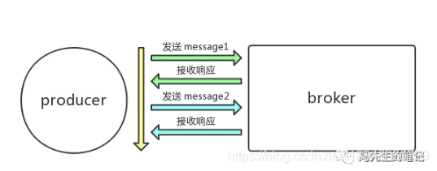

简单来说，同步发送就是指 producer 发送消息后，会在接收到 broker 响应后才继续发下一条消息的通信方式。

由于这种同步发送的方式确保了消息的可靠性，同时也能及时得到消息发送的结果，故而适合一些发送比较重要的消息场景，比如说重要通知邮件、报名短信通知、营销短信等等。在实际应用中，这种同步发送的方式还是用得比较多的。


```java
import org.apache.rocketmq.client.producer.DefaultMQProducer;
import org.apache.rocketmq.client.producer.SendResult;
import org.apache.rocketmq.common.message.Message;
 
import java.util.concurrent.TimeUnit;
 
public class SyncProducer {
 
    public static void main(String[] args) throws Exception {
        // 1.创建消息生产者producer，并制定生产者组名
        DefaultMQProducer producer = new DefaultMQProducer("group1");
        // 2.指定NameServer地址,多个地址用 ; 隔开
        producer.setNamesrvAddr("localhost:9876");
        // 3.启动producer
        producer.start();
 
        for (int i = 0; i < 10; i++) {
            // 4.创建消息对象，指定主题Topic、Tag和消息体
            /*
            参数1：消息主题Topic
            参数2：消息Tag
            参数3：消息内容
             */
            Message msg = new Message("base","tag1",("hello world"+i).getBytes());
            // 5.发送消息结果包含  发送状态  消息id 消息接收队列id等
            SendResult result = producer.send(msg);
            System.out.println("发送结果"+result);
 
            // 线程睡眠1秒
            TimeUnit.SECONDS.sleep(1);
        }
        // 6关闭生产者producer
        producer.shutdown();
    }
}
```

#### 2）异步发送

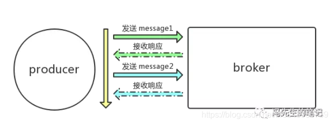

异步发送是指 producer 发出一条消息后，不需要等待 broker 响应，就接着发送下一条消息的通信方式。需要注意的是，不等待 broker 响应，并不意味着 broker 不响应，而是通过回调接口来接收 broker 的响应。所以要记住一点，异步发送同样可以对消息的响应结果进行处理。

由于异步发送不需要等待 broker 的响应，故在一些比较注重 RT（响应时间）的场景就会比较适用。比如，在一些视频上传的场景，我们知道视频上传之后需要进行转码，如果使用同步发送的方式来通知启动转码服务，那么就需要等待转码完成才能发回转码结果的响应，由于转码时间往往较长，很容易造成响应超时。此时，如果使用的是异步发送通知转码服务，那么就可以等转码完成后，再通过回调接口来接收转码结果的响应了。


```java
import org.apache.rocketmq.client.producer.DefaultMQProducer;
import org.apache.rocketmq.client.producer.SendCallback;
import org.apache.rocketmq.client.producer.SendResult;
import org.apache.rocketmq.common.message.Message;
 
import java.util.concurrent.TimeUnit;
 
public class AsyncProducer {
 
    public static void main(String[] args) throws Exception {
        // 1.创建消息生产者producer，并制定生产者组名
        DefaultMQProducer producer = new DefaultMQProducer("group1");
        // 2.指定NameServer地址
        producer.setNamesrvAddr("localhost:9876");
        // 3.启动producer
        producer.start();
 
        for (int i = 0; i < 10; i++) {
            // 4.创建消息对象，指定主题Topic、Tag和消息体
            /*
            参数1：消息主题Topic
            参数2：消息Tag
            参数3：消息内容
             */
            Message msg = new Message("base","tag2",("hello world"+i).getBytes());
            // 5.发送消息结果包含  发送状态  消息id 消息接收队列id等
            producer.send(msg, new SendCallback() {
                // 发送成功回调函数
                public void onSuccess(SendResult sendResult) {
                    System.out.println("发送结果："+sendResult);
                }
                // 发送失败回调函数
                public void onException(Throwable e) {
                    System.out.println("发送异常"+e);
                }
            });
 
            // 线程睡眠1秒
            TimeUnit.SECONDS.sleep(1);
        }
        // 6关闭生产者producer
        producer.shutdown();
        System.out.println("发送完成");
    }
}
```

#### 3）单向发送

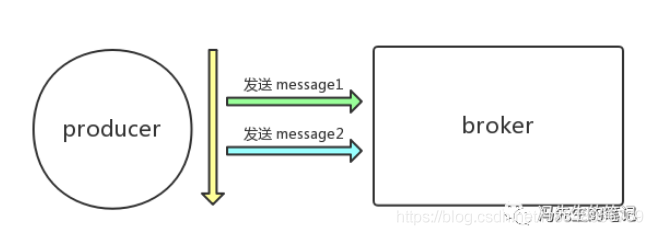

单向发送，见名知意，就是一种单方向通信方式，也就是说 producer 只负责发送消息，不等待 broker 发回响应结果，而且也没有回调函数触发，这也就意味着 producer 只发送请求不等待响应结果。

由于单向发送只是简单地发送消息，不需要等待响应，也没有回调接口触发，故发送消息所耗费的时间非常短，同时也意味着消息不可靠。所以这种单向发送比较适用于那些耗时要求非常短，但对可靠性要求并不高的场景，比如说日志收集。

```java
import org.apache.rocketmq.client.exception.MQBrokerException;
import org.apache.rocketmq.client.exception.MQClientException;
import org.apache.rocketmq.client.producer.DefaultMQProducer;
import org.apache.rocketmq.common.message.Message;
import org.apache.rocketmq.remoting.exception.RemotingException;
 
import java.util.concurrent.TimeUnit;
 
public class OnewayProducer {
 
    public static void main(String[] args) throws Exception {
        // 1.创建消息生产者producer，并制定生产者组名
        DefaultMQProducer producer = new DefaultMQProducer("group1");
        // 2.指定NameServer地址
        producer.setNamesrvAddr("localhost:9876");
        // 3.启动producer
        producer.start();
 
        for (int i = 0; i < 10; i++) {
            // 4.创建消息对象，指定主题Topic、Tag和消息体
            /*
            参数1：消息主题Topic
            参数2：消息Tag
            参数3：消息内容
             */
            Message msg = new Message("base","tag3",("hello world,单向消息"+i).getBytes());
            // 5.发送单向消息
            producer.sendOneway(msg);
            System.out.println("发送单向消息");
 
            // 线程睡眠1秒
            TimeUnit.SECONDS.sleep(1);
        }
        // 6关闭生产者producer
        producer.shutdown();
    }
}
```

#### 4）总结

下表概括了三者的特点和主要区别。

| 发送方式 | 发送 TPS | 发送结果反馈 | 可靠性   |
| :------- | :------- | :----------- | :------- |
| 同步发送 | 快       | 有           | 不丢失   |
| 异步发送 | 快       | 有           | 不丢失   |
| 单向发送 | 最快     | 无           | 可能丢失 |

> 可以看到，从发送 TPS 来看，由于单向发送不需要等待响应也没有回调接口触发，发送速度非常快，一般都是微秒级的，在消息体大小一样的情况下，其发送 TPS 最大。而同步发送，需要等待响应结果的返回，受网络状况的影响较大，故发送 TPS 就比较小。异步发送不等待响应结果，发送消息时几乎不受网络的影响，故相比同步发送来说，其发送 TPS 要大得多。
>
> 关于可靠性，大家需要牢记前面提过的，异步发送并不意味着消息不可靠，异步发送也是会接收到响应结果，也能对响应结果进行处理。即使发送失败，也可以通过一些补偿手段进行消息重发。和同步发送比起来，异步发送的发送 TPS 更大，更适合那些调用链路较长的一些场景。在实际使用中，同步发送和异步发送都是较为常用的两种方式，大家要视具体业务场景进行合理地选择。


## 十二、消费模式

### 11.1 集群消费（负载均衡模式）

首先明确一点，RocketMQ 是基于发布订阅模型的消息中间件。所谓的发布订阅就是说，consumer 订阅了 broker 上的某个 topic，当 producer 发布消息到 broker 上的该 topic 时，consumer 就能收到该条消息。

之前我们讲过 consumer group 的概念，即消费同一类消息的多个 consumer 实例组成一个消费者组，也可以称为一个 consumer 集群，这些 consumer 实例使用同一个 group name。

需要注意一点，除了使用同一个 group name，订阅的 tag 也必须是一样的，只有符合这两个条件的 consumer 实例才能组成 consumer 集群。

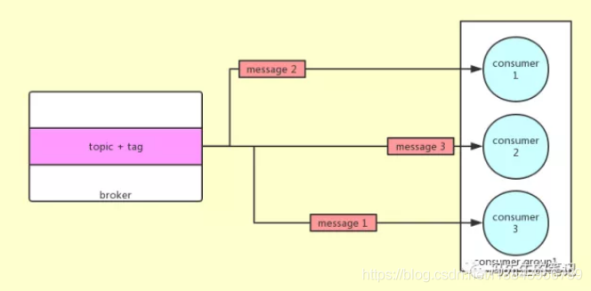

当 consumer 使用集群消费时，每条消息只会被 consumer 集群内的任意一个 consumer 实例消费一次。举个例子，当一个 consumer 集群内有 3 个consumer 实例（假设为consumer 1、consumer 2、consumer 3）时，一条消息投递过来，只会被consumer 1、consumer 2、consumer 3中的一个消费。

同时记住一点，使用集群消费的时候，consumer 的消费进度是存储在 broker 上，consumer 自身是不存储消费进度的。消息进度存储在 broker 上的好处在于，当你 consumer 集群是扩大或者缩小时，由于消费进度统一在broker上，消息重复的概率会被大大降低了。

注意：在集群消费模式下，并不能保证每一次消息失败重投都投递到同一个 consumer 实例。

```java
import org.apache.rocketmq.client.consumer.DefaultMQPushConsumer;
import org.apache.rocketmq.client.consumer.listener.ConsumeConcurrentlyContext;
import org.apache.rocketmq.client.consumer.listener.ConsumeConcurrentlyStatus;
import org.apache.rocketmq.client.consumer.listener.MessageListenerConcurrently;
import org.apache.rocketmq.client.exception.MQClientException;
import org.apache.rocketmq.common.message.MessageExt;
import org.apache.rocketmq.common.protocol.heartbeat.MessageModel;
 
import java.util.List;
 
public class Consumer {
 
    public static void main(String[] args) throws Exception {
        // 1.创建消费者Consumer，制定消费者组名
        DefaultMQPushConsumer consumer = new DefaultMQPushConsumer("group1");
        // 2.指定Nameserver地址
        consumer.setNamesrvAddr("localhost:9876");
        // 3.订阅主题Topic和Tag
        consumer.subscribe("base","tag1");
        // 消费模式：默认是负载均衡模式
        consumer.setMessageModel(MessageModel.CLUSTERING);
        // 4.设置回调函数，处理消息
        consumer.registerMessageListener(new MessageListenerConcurrently() {
            //接收消息内容
            public ConsumeConcurrentlyStatus consumeMessage(List<MessageExt> list, ConsumeConcurrentlyContext consumeConcurrentlyContext) {
                for (MessageExt messageExt : list) {
                    System.out.println(new String(messageExt.getBody()));
                }
                return ConsumeConcurrentlyStatus.CONSUME_SUCCESS;
            }
        });
        // 5.启动消费者consumer
        consumer.start();
    }
}
```

分别启动多个 consumer 实例，会发现如果只有一条消息，只会被某一个 consumer 消费

### 11.2 广播消费

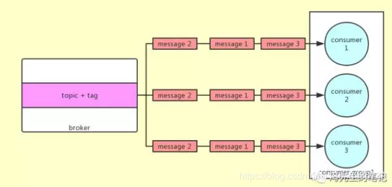

当 consumer 使用广播消费时，每条消息都会被 consumer 集群内所有的 consumer 实例消费一次，也就是说每条消息至少被每一个 consumer 实例消费一次。举个例子，当一个 consumer 集群内有 3 个 consumer 实例（假设为 consumer 1、consumer 2、consumer 3）时，一条消息投递过来，会被 consumer 1、consumer 2、consumer 3都消费一次。

与集群消费不同的是，consumer 的消费进度是存储在各个 consumer 实例上，这就容易造成消息重复。还有很重要的一点，对于广播消费来说，是不会进行消费失败重投的，所以在 consumer 端消费逻辑处理时，需要额外关注消费失败的情况。

虽然广播消费能保证集群内每个 consumer 实例都能消费消息，但是消费进度的维护、不具备消息重投的机制大大影响了实际的使用。因此，在实际使用中，更推荐使用集群消费，因为集群消费不仅拥有消费进度存储的可靠性，还具有消息重投的机制。而且，我们通过集群消费也可以达到广播消费的效果。

```java
import org.apache.rocketmq.client.consumer.DefaultMQPushConsumer;
import org.apache.rocketmq.client.consumer.listener.ConsumeConcurrentlyContext;
import org.apache.rocketmq.client.consumer.listener.ConsumeConcurrentlyStatus;
import org.apache.rocketmq.client.consumer.listener.MessageListenerConcurrently;
import org.apache.rocketmq.client.exception.MQClientException;
import org.apache.rocketmq.common.message.MessageExt;
import org.apache.rocketmq.common.protocol.heartbeat.MessageModel;
 
import java.util.List;
 
public class Consumer {
 
    public static void main(String[] args) throws MQClientException {
        // 1.创建消费者Consumer，制定消费者组名
        DefaultMQPushConsumer consumer = new DefaultMQPushConsumer("group1");
        // 2.指定Nameserver地址
        consumer.setNamesrvAddr("localhost:9876");
        // 3.订阅主题Topic和Tag
        consumer.subscribe("base","tag1");
        // 消费模式：广播模式
        consumer.setMessageModel(MessageModel.BROADCASTING);
        // 4.设置回调函数，处理消息（并发）
        consumer.registerMessageListener(new MessageListenerConcurrently() {
            //接收消息内容
            public ConsumeConcurrentlyStatus consumeMessage(List<MessageExt> list, ConsumeConcurrentlyContext consumeConcurrentlyContext) {
                for (MessageExt messageExt : list) {
                    System.out.println(new String(messageExt.getBody()));
                }
                return ConsumeConcurrentlyStatus.CONSUME_SUCCESS;
            }
        });
        // 5.启动消费者consumer
        consumer.start();
    }
}
```

### 11.3 使用集群消费模拟广播消费

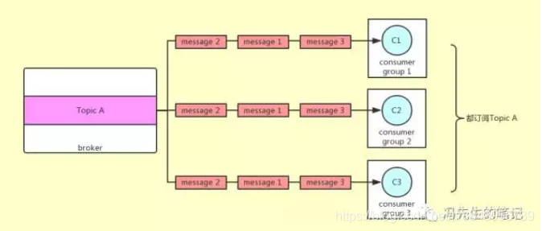

如果业务上确实需要使用广播消费，那么我们可以通过创建多个 consumer 实例，每个 consumer 实例属于不同的 consumer group，但是它们都订阅同一个 topic。

举个例子，我们创建 3 个 consumer 实例，consumer 1（属于consumer group 1）、consumer 2（属于 consumer group 2）、consumer 3（属于consumer group 3），它们都订阅了 topic A ，那么当 producer 发送一条消息到 topic A 上时，由于 3 个consumer 属于不同的 consumer group，所以 3 个consumer都能收到消息，也就达到了广播消费的效果了。 除此之外，每个 consumer 实例的消费逻辑可以一样也可以不一样，每个consumer group还可以根据需要增加 consumer 实例，比起广播消费来说更加灵活。


## 十三、高级特性

### 13.1 消息过滤

说到消息过滤，就不得不说到 tag。没错，就是我们之前在专业术语中提到过的 tag。也称为消息标签，用来标记 Topic 下的不同用途的消息。

在 RocketMQ 中消费者是可以按照 Tag 对消息进行过滤。举个电商交易场景的例子，用户下完订单之后，在后台会产生一系列的消息，比如说订单消息、支付消息和物流消息。

假设这些消息都发送到 Topic 为 Trade 中，同时用 tag 为 order 来标记订单消息，用 tag 为 pay 来标记支付消息，用 tag 为 logistics 来标记物流消息。需要支付消息的支付系统（相当于一个 consumer）订阅 Trade 中 tag 为 pay 的消息，此时，broker 则只会把 tag 为 pay 的消息投递给支付系统。

而如果是一个实时计算系统，它可能需要接收所有和交易相关的消息，那么只要它订阅 Trade 中 tag 为 order、pay、logistics 的消息，broker 就会把带有这些 tag 的消息投递给实时计算系统。

对于消息分类，我们可以选择创建多个 Topic 来区分，也可以选择在同一个 Topic 下创建多个 tag 来区分。这两种方式都是可行的，但是一般情况下，不同的 Topic 之间的消息是没有什么必然联系的，使用 tag 来区分同一个 Topic 下相互关联的消息则更加合适一些。

#### 1）Tag过滤

> 发送消息时，每条消息必须指明 Tag

- 订阅所有 Tag

  消费者如需订阅某 Topic 下所有类型的消息，Tag 用符号 * 表示：

  ```java
      consumer.subscribe("MQ_TOPIC", "*", new MessageListener() {
          public Action consume(Message message, ConsumeContext context) {
              System.out.println(message.getMsgID());
              return Action.CommitMessage;
          }
      });                
  ```

- 订阅单个 Tag

  消费者如需订阅某 Topic 下某一种类型的消息，请明确标明 Tag：

  ```java
      consumer.subscribe("MQ_TOPIC", "TagA", new MessageListener() {
          public Action consume(Message message, ConsumeContext context) {
              System.out.println(message.getMsgID());
              return Action.CommitMessage;
          }
      });                
  ```

- 订阅多个 Tag

  消费者如需订阅某 Topic 下多种类型的消息，请在多个 Tag 之间用 || 分隔：

  ```java
      consumer.subscribe("MQ_TOPIC", "TagA||TagB", new MessageListener() {
          public Action consume(Message message, ConsumeContext context) {
              System.out.println(message.getMsgID());
              return Action.CommitMessage;
          }
      });                
  ```

- 错误示例

  同一个消费者多次订阅某个 Topic 下的 Tag，以最后一次订阅的 Tag 为准：

  ```java
      //如下错误代码中，Consumer 只能订阅到 MQ_TOPIC 下 TagB 的消息，而不能订阅 TagA 的消息。
      consumer.subscribe("MQ_TOPIC", "TagA", new MessageListener() {
          public Action consume(Message message, ConsumeContext context) {
              System.out.println(message.getMsgID());
              return Action.CommitMessage;
          }
      });
      consumer.subscribe("MQ_TOPIC", "TagB", new MessageListener() {
          public Action consume(Message message, ConsumeContext context) {
              System.out.println(message.getMsgID());
              return Action.CommitMessage;
          }
      });    
  ```

#### 2）SQL 过滤

要实现SQL过滤，需要先修改消息队列的配置文件

在broker的配置文件 添加enablePropertyFilter=true

- 生产者

```java
ublic static void main(String[] args) throws Exception {

        DefaultMQProducer producer = new DefaultMQProducer("SQLFilter_test_group");

        producer.setNamesrvAddr("172.16.17.20:9876");

        producer.start();

        String[] tags = new String[] {"TagA", "TagB", "TagC"};

        for (int i = 0; i < 10; i++) {
            Message msg = new Message("SqlFilterTest",
                tags[i % tags.length],
                ("Hello RocketMQ " + i).getBytes(RemotingHelper.DEFAULT_CHARSET)
            );
            msg.putUserProperty("a", String.valueOf(i));

            SendResult sendResult = producer.send(msg);
            System.out.printf("%s%n", sendResult);
        }

        producer.shutdown();
    }
```

> 生成消息的时候，使用`msg.putUserProperty("a", String.valueOf(i));`设置一个属性，这个属性在消费的时候会拿来写SQL语句，详情见下方消费示例，其他和普通消息的发送没有区别。

- 消费者

```java
public static void main(String[] args) throws Exception {

        DefaultMQPushConsumer consumer = new DefaultMQPushConsumer("sql92_consumer_test_"+System.nanoTime());

        consumer.setNamesrvAddr("172.16.17.20:9876");

        // Don't forget to set enablePropertyFilter=true in broker
        consumer.subscribe("SqlFilterTest",
            MessageSelector.bySql("(TAGS is not null and TAGS in ('TagA', 'TagB'))" +
                "and (a is not null and a between 0 and 3)"));

        consumer.registerMessageListener((MessageListenerConcurrently) (msgs, context) -> {
            System.out.printf("%s Receive New Messages: %s %n", Thread.currentThread().getName(), msgs);
            return ConsumeConcurrentlyStatus.CONSUME_SUCCESS;
        });

        consumer.start();
        System.out.printf("Consumer Started.%n");
    }
```

>消息订阅的时候使用了`MessageSelector.bySql();`表明使用SQL92的过滤模式，然后传入的字符串是符合SQL92语法的语句。
>
>共2个条件组成SQL表达式进行消息的过滤:
>
>1. `TAGS !=null`,且`TAGS =='TagA' || TAGS=='TagB'`。
>
>2. a!=null`，且`a≥0 && a≤3`。`
>
>为了兼容tag过滤，在SQL92过滤中，使用TAGS替代tag,然后a是消息生产时`msg.putUserProperty("a", String.valueOf(i));`设置的属性。

#### 3）总结

在实际使用中，消息过滤可以帮助我们只消费我们所需要的消息，这是在broker端就帮我们处理好的，大大减少了在 consumer 端的消息过滤处理，一方面减少了代码量，另一方面更减少了不必要消息的网络传输消耗。

### 13.2 订阅关系一致性

讲完了消息过滤，我们接着讲讲什么是订阅关系一致性呢？其实在讲 RocketMQ 消费模式的时候提到过，除了使用同一个 group name，订阅的 tag 也必须是一样的，只有符合这两个条件的 consumer 实例才能组成 consumer 集群。这里所说的其实就是订阅关系一致性。在 RocketMQ 中，订阅关系由 Topic和 Tag 组成，因此要保证订阅关系一致性，就必须同时保证这两点：

1. **订阅的 Topic 必须一致**
2. **订阅的 Topic 中的 tag 必须一致**

保证订阅关系一致性是非常重要的，一旦订阅关系不一致，消息消费的逻辑就会混乱，甚至导致消息丢失，这对于大部分业务场景来说都是不允许的，甚至是致命的。在实际使用中，切记同一个消费者集群内的所有消费者实例务必要保证订阅关系的一致性。

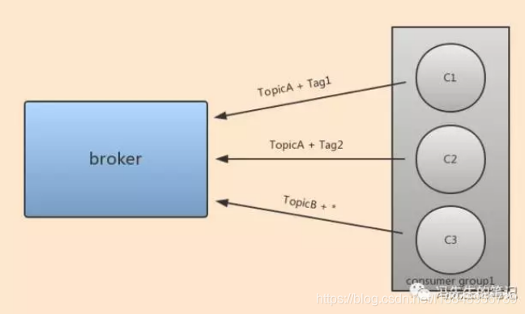

我们用具体的例子来解释一下，如图 1 所示，消费者集群中有 3 个 consumer 实例，分别为 C1、C2、C3，各自订阅的 topic 和 tag 各不相同。首先 C1 和 C2 都订阅 TopicA，满足了订阅关系一致性的第一点，但是 C1 订阅的是 TopicA 的 Tag1，而 C2 订阅的是 TopicA 的 Tag2，不满足订阅关系一致性的第二点，所以 C1、C2 不满足订阅关系一致性。而 C3 订阅的 Topic 和 Tag 都与 C1 和 C2不一样，同样也不满足订阅关系一致性。

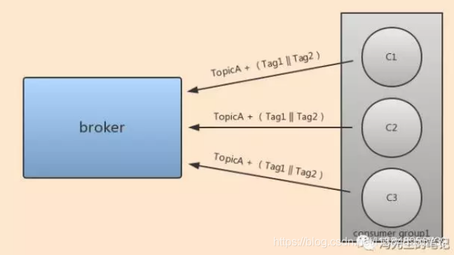

在图 2 中，消费者集群中有 3 个 consumer 实例，分别为 C1、C2、C3，都是订阅 TopicA 下的 Tag1 和 Tag2，满足了订阅关系一致性的两点要求，所以满足了订阅关系一致性。

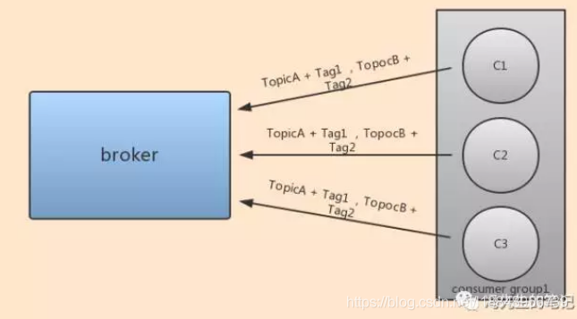

如图 3 所示，一个 consumer 也可以订阅多个 Topic，同时也必须保证该 consumer 集群里的多个消费者实例的订阅关系一致性，才不会造成不必要的麻烦。

总结：

订阅消息一致性则保证了同一个消费者集群中 consumer 实例的正常运行，避免消息逻辑的混乱和消息的丢失。所以在实际使用中，在 producer 端要做好消息的分类，便于 consumer 可以使用 tag 进行消息的准确订阅，而在 consumer 端，则要保证订阅关系一致性。


### 13.3 消息重试

首先明确之前说过的，消息重试只针对集群消费模式，广播消费没有消息重试的特性，消费失败之后，只会继续消费下一条消息。这也是为什么我们一再强调，推荐大家使用集群消费模式，其消息重试的特性能给开发者带来极大的方便。

那么什么是消息重试呢？简单来说，就是当消费者消费消息失败后，broker 会重新投递该消息，直到消费成功。在 RocketMQ 中，当消费者使用集群消费模式时，消费者接收到消息并进行相应的逻辑处理之后，最后都要返回一个状态值给 broker。这样 broker 才知道是否消费成功，需不需要重新投递消息。也就是说，我们可以通过设置返回的状态值来告诉 broker 是否重新投递消息。

到这里，可能大家会有一个疑问，那如果这条消息本身就是一条脏数据，就算你消费 100 次也不会消费成功，难道还是一直去重试嘛？其实 RocketMQ 并不会无限制地重试下去，默认每条消息最多重试 16 次，而每次重试的间隔时间如下表所示：

| 第几次重试 | 每次重试间隔时间 |
| :--------- | :--------------- |
| 1          | 10 秒            |
| 2          | 30 秒            |
| 3          | 1 分钟           |
| 4          | 2 分钟           |
| 5          | 3 分钟           |
| 6          | 4 分钟           |
| 7          | 5 分钟           |
| 8          | 6 分钟           |
| 9          | 7 分钟           |
| 10         | 8 分钟           |
| 11         | 9 分钟           |
| 12         | 10 分钟          |
| 13         | 20 分钟          |
| 14         | 30 分钟          |
| 15         | 1 小时           |
| 16         | 2 小时           |

那么如果消息重试 16 次之后还是消费失败怎么办呢？那么消息就不会再投递给消费者，而是将消息放到相对应的死信队列中。这时候我们就需要对死信队列的消息做一些人工补偿处理，因为这些消息可能本身就有问题，也有可能和消费逻辑调用的服务有关等，所以需要人工判断之后再进行处理。

到这里不知道大家有没有一个疑问，那就是什么样的情况才叫消费失败呢？可以分为 3 种情况：

1. **返回 ConsumeConcurrentlyStatus.RECONSUME_LATER**
2. **返回 null**
3. **抛出异常**

前两种情况都比较好理解，就是前面说过的设置状态值，也就是说，只需要消费者返回 ConsumeConcurrentlyStatus.RECONSUME_LATER 或者 null，就相当于告诉 broker 说，这条消息我消费失败了，你给我重新投递一次。而对于抛出异常这种情况，只要在你处理消费逻辑的地方抛出了异常,那么 broker 也重新投递这条消息。注意一点，如果是被捕获的异常，则不会进行消息重试。

### 13.4 消息幂等

首先什么是消费幂等呢？简单来说就是对于一条消息的处理结果，不管这条消息被处理多少次，最终的结果都一样。比如说，你收到一条消息是要更新一个商品的价格为 6.8 元，那么当这条消息执行 1 次，还是执行 100 次，最终在数据库里的该商品价格就是 6.8 元，这就是所谓的幂等。 那么为什么消费需要幂等呢？因为在实际使用中，尤其在网络不稳定的情况下，RocketMQ 的消息有可能会出现重复，包括两种情况：

1. **发送时消息重复**
2. **投递时消息重复**

第一种情况是生产者发送消息的场景，消息已成功发送到 broker ，但是此时可能发生网络闪断或者生产者宕机了，导致 broker 发回的响应失败。这时候生产者由于没有收到响应，认为消息发送失败，于是尝试再次发送消息给 broker。这样一来，broker 就会再收到一条一摸一样内容的消息，最终造成了消费者也收到两条内容一摸一样的消息。

第二种情况是消费者消费消息的场景，消息已投递到消费者并完成消费逻辑处理，当消费者给 broker 反馈消费状态时可能发生网络闪断。broker 收不到消费者的消费状态，为了保证至少消费一次的语义，broker 将在网络恢复后再次尝试投递之前已经被处理过的消息，最终造成消费者收到两条内容一摸一样的消息。

当然对于一些允许消息重复的场景，大可以不必关心消费幂等。但是对于那些不允许消息重复的业务场景来说，处理建议就是通过业务上的唯一标识来作为幂等处理的依据。

**总结：**

消息重试，保证了消费消息的容错性，即使消费失败，也不需要开发者自己去编写代码来做补偿，大大提高了开发效率，同时也是 RocketMQ 相较于其他 MQ 的一个非常好的特性。而消费幂等主要是针对那些不允许消息重复的场景，应该说大部分 MQ 都需要幂等处理，这属于代码逻辑或者说业务上的需要，最好的处理方式就是前面所说的根据业务上唯一标识来作为幂等处理的依据。


