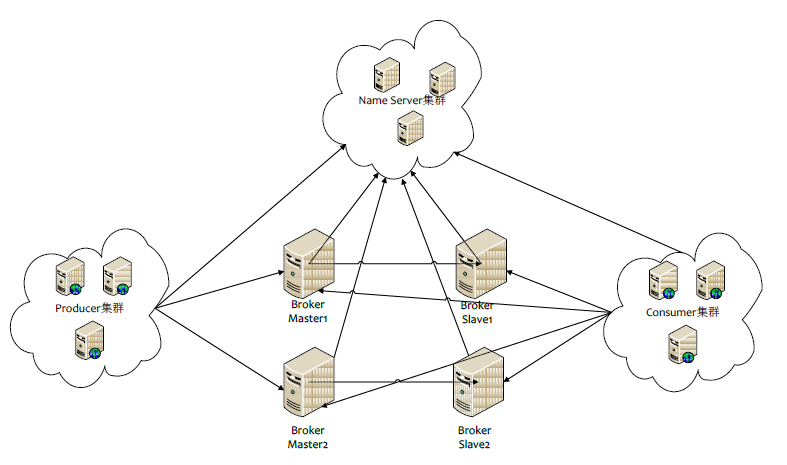

# RocketMQ

## 一、 简介

RocketMQ一个纯java、分布式、队列模型的开源消息中间件，前身是MetaQ，是阿里研发的一个队列模型的消息中间件，后开源给apache基金会成为了apache的顶级开源项目，具有高性能、高可靠、高实时、分布式特点。

## 二、RocketMQ 专业术语

先讲专业术语的含义，后面会画流程图来更好的去理解它们。

- Producer

  消息生产者，位于用户的进程内，`Producer通过NameServer获取所有Broker的路由信息`，根据负载均衡策略选择将消息发到哪个Broker，然后调用Broker接口提交消息。

- Producer Group

  生产者组，简单来说就是多个发送同一类消息的生产者称之为一个生产者组。

- Consumer

  消息消费者，位于用户进程内。Consumer通过NameServer获取所有broker的路由信息后，向Broker发送Pull请求来获取消息数据。Consumer可以以两种模式启动，**广播（Broadcast）和集群（Cluster）**，**广播模式下，一条消息会发送给所有Consumer，集群模式下消息只会发送给一个Consumer**。

- Consumer Group

  消费者组，和生产者类似，消费同一类消息的多个 Consumer 实例组成一个消费者组。

- Topic

  Topic用于将消息按主题做划分，**Producer将消息发往指定的Topic，Consumer订阅该Topic就可以收到这条消息**。Topic跟发送方和消费方都没有强关联关系，发送方可以同时往多个Topic投放消息，消费方也可以订阅多个Topic的消息。在RocketMQ中，**Topic是一个上逻辑概念。消息存储不会按Topic分开**。

- Message

  代表一条消息，使用`MessageId`唯一识别，用户在发送时可以设置messageKey，便于之后查询和跟踪。一个 Message 必须指定 Topic，相当于寄信的地址。Message 还有一个可选的 Tag 设置，以便消费端可以基于 Tag 进行过滤消息。也可以添加额外的键值对，例如你需要一个业务 key 来查找 Broker 上的消息，方便在开发过程中诊断问题。

- Tag

  标签可以被认为是对 Topic 进一步细化。一般在相同业务模块中通过引入标签来标记不同用途的消息。

- Broker

  Broker是RocketMQ的核心模块，`负责接收并存储消息`，同时提供Push/Pull接口来将消息发送给Consumer。Consumer可选择从Master或者Slave读取数据。多个主/从组成Broker集群，集群内的Master节点之间不做数据交互。Broker同时提供消息查询的功能，可以通过MessageID和MessageKey来查询消息。Borker会将自己的Topic配置信息实时同步到NameServer。

- Queue

  **Topic和Queue是1对多的关系**，**一个Topic下可以包含多个Queue**，主要用于负载均衡。发送消息时，用户只指定Topic，Producer会根据Topic的路由信息选择具体发到哪个Queue上。Consumer订阅消息时，会根据负载均衡策略决定订阅哪些Queue的消息。

- Offset

  RocketMQ在存储消息时会为每个Topic下的每个Queue生成一个消息的索引文件，每个Queue都对应一个Offset**记录当前Queue中消息条数**。

- NameServer

  NameServer可以看作是RocketMQ的注册中心，它管理两部分数据：集群的Topic-Queue的路由配置；Broker的实时配置信息。其它模块通过Nameserv提供的接口获取最新的Topic配置和路由信息。

  - `Producer/Consumer` ：通过查询接口获取Topic对应的Broker的地址信息
  - `Broker` ： 注册配置信息到NameServer， 实时更新Topic信息到NameServer

## 三、流程图

我们由简单到复杂的来理解，它的一些核心概念


这个图很好理解，消息先发到Topic，然后消费者去Topic拿消息。只是Topic在这里只是个概念，那它到底是怎么存储消息数据的呢，这里就要引入Broker概念。

### 3.1 Topic的存储

Topic是一个逻辑上的概念，实际上Message是在每个Broker上以Queue的形式记录。


从上面的图片可以总结下几条结论。

> 1. 消费者发送的Message会在Broker中的Queue队列中记录。 
>
> 2. 一个Topic的数据可能会存在多个Broker中。
>
> 3. 一个Broker存在多个Queue。 
>
> 4. 单个的Queue也可能存储多个Topic的消息。

也就是说每个Topic在Broker上会划分成几个逻辑队列，每个逻辑队列保存一部分消息数据，但是保存的消息数据实际上不是真正的消息数据，而是指向commit log的消息索引。

`Queue不是真正存储Message的地方，真正存储Message的地方是在CommitLog`。


左边的是CommitLog。这个是真正存储消息的地方。RocketMQ所有生产者的消息都是往这一个地方存的。

右边是ConsumeQueue。这是一个逻辑队列。和上文中Topic下的Queue是一一对应的。消费者是直接和ConsumeQueue打交道。ConsumeQueue记录了消费位点，这个消费位点关联了commitlog的位置。所以即使ConsumeQueue出问题，只要commitlog还在，消息就没丢，可以恢复出来。还可以通过修改消费位点来重放或跳过一些消息。

### 3.2 部署模型

在部署RocketMQ时，会部署两种角色。NameServer和Broker。如图（盗图）




针对这张图做个说明

```
1、Product和consumer集群部署，是你开发的项目进行集群部署。
2、Broker 集群部署是为了高可用，因为Broker是真正存储Message的地方，集群部署是为了避免一台挂掉，导致整个项目KO.
```

那Name SerVer是做什么用呢，它和Product、Consumer、Broker之前存在怎样的关系呢？

先简单概括Name Server的特点

```
1、Name Server是一个几乎无状态节点，可集群部署，节点之间无任何信息同步。
2、每个Broker与Name Server集群中的所有节点建立长连接，定时注册Topic信息到所有Name Server。
3、Producer与Name Server集群中的其中一个节点（随机选择）建立长连接，定期从Name Server取Topic路由信息。
4、Consumer与Name Server集群中的其中一个节点（随机选择）建立长连接，定期从Name Server取Topic路由信息。
```

这里面最核心的是`每个Broker与Name Server集群中的所有节点建立长连接`这样做好处多多。

```
1、这样可以使Name Server之间可以没有任何关联，因为它们绑定的Broker是一致的。
2、作为Producer或者Consumer可以绑定任何一个Name Server 因为它们都是一样的。
```


## 四、详解Broker

- **Broker与Name Server关系**

  **1）连接** 单个Broker和所有Name Server保持长连接。

  **2）心跳**

  **心跳间隔**：每隔**30秒**向所有NameServer发送心跳，心跳包含了自身的Topic配置信息。

  **心跳超时**：NameServer每隔**10秒**，扫描所有还存活的Broker连接，若某个连接2分钟内没有发送心跳数据，则断开连接。

  **3）断开**：当Broker挂掉；NameServer会根据心跳超时主动关闭连接,一旦连接断开，会更新Topic与队列的对应关系，但不会通知生产者和消费者。

- **负载均衡**

  一个Topic分布在多个Broker上，一个Broker可以配置多个Topic，它们是多对多的关系。
  如果某个Topic消息量很大，应该给它多配置几个Queue，并且尽量多分布在不同Broker上，减轻某个Broker的压力。

- **可用性**

  由于消息分布在各个Broker上，一旦某个Broker宕机，则该Broker上的消息读写都会受到影响。

  所以RocketMQ提供了Master/Slave的结构，Salve定时从Master同步数据，如果Master宕机，则Slave提供消费服务，但是不能写入消息，此过程对应用透明，由RocketMQ内部解决。
  有两个关键点：
  `思考1`一旦某个broker master宕机，生产者和消费者多久才能发现？

  受限于Rocketmq的网络连接机制，默认情况下最多需要**30秒**，因为消费者每隔30秒从nameserver获取所有topic的最新队列情况，这意味着某个broker如果宕机，客户端最多要30秒才能感知。

  `思考2` master恢复恢复后，消息能否恢复。
  消费者得到Master宕机通知后，转向Slave消费，但是Slave不能保证Master的消息100%都同步过来了，因此会有少量的消息丢失。但是消息最终不会丢的，一旦Master恢复，未同步过去的消息会被消费掉。

## 五、Consumer (消费者)

- Consumer与Name Server关系
  - **连接** : 单个Consumer和一台NameServer保持长连接，如果该NameServer挂掉，消费者会自动连接下一个NameServer，直到有可用连接为止，并能自动重连。
  - **心跳**: 与NameServer没有心跳
  - **轮询时间** : 默认情况下，消费者每隔**30秒**从NameServer获取所有Topic的最新队列情况，这意味着某个Broker如果宕机，客户端最多要30秒才能感知。

- Consumer与Broker关系
  连接 : 单个消费者和该消费者关联的所有broker保持长连接。

- 负载均衡

  集群消费模式下，一个消费者集群多台机器共同消费一个Topic的多个队列，一个队列只会被一个消费者消费。如果某个消费者挂掉，分组内其它消费者会接替挂掉的消费者继续消费。

## 六、Producer(生产者)

- Producer与Name Server关系
  - **连接** 单个Producer和一台NameServer保持长连接，如果该NameServer挂掉，生产者会自动连接下一个NameServer，直到有可用连接为止，并能自动重连。
  - **轮询时间** 默认情况下，生产者每隔30秒从NameServer获取所有Topic的最新队列情况，这意味着某个Broker如果宕机，生产者最多要30秒才能感知，在此期间，
    发往该broker的消息发送失败。
  - **心跳** 与nameserver没有心跳

- 与broker关系

  连接 单个生产者和该生产者关联的所有broker保持长连接。


## 七、集群部署方式

### 7.1 单 Master 模式

只有一个 Master节点

- 优点：配置简单，方便部署

- 缺点：这种方式风险较大，一旦Broker重启或者宕机时，会导致整个服务不可用，不建议线上环境使用

### 7.2 多Master模式

多个 master 节点组成集群，单个 master 节点宕机或者重启对应用没有影响。

- 优点：所有模式中性能最高

-  缺点：单个 master 节点宕机期间，未被消费的消息在节点恢复之前不可用，消息的实时性就受到影响。

> 注意：使用同步刷盘可以保证消息不丢失，同时 Topic 相对应的 queue 应该分布在集群中各个节点，而不是只在某各节点上，否则，该节点宕机会对订阅该 topic 的应用造成影响。

### 7.3 多 master 多 slave 异步复制模式

在多 master 模式的基础上，每个 master 节点都有至少一个对应的 slave。master节点可读可写，但是 slave 只能读不能写，类似于 mysql 的主备模式。

- 优点： 在 master 宕机时，消费者可以从 slave 读取消息，消息的实时性不会受影响，性能几乎和多 master 一样。
- 缺点：使用异步复制的同步方式有可能会有消息丢失的问题。

### 7.4 多Master 多 Slave 同步双写模式

同多 master 多 slave 异步复制模式类似，区别在于 master 和 slave 之间的数据同步方式。

- 优点：同步双写的同步模式能保证数据不丢失。

- 缺点：发送单个消息 RT 会略长，性能相比异步复制低10%左右。发送单个消息的`RT`会略高，且目前版本在主节点宕机后，备机不能自动切换为主机。


## 八、双主双从集群搭建

### 8.1 总体架构

消息高可用采用2`master`-2`slave`（同步双写）方式


### 8.2 集群工作流程

1. 启动`NameServer`，`NameServer`起来后监听端口，等待`Broker`、`Producer`、`Consumer`连上来，相当于一个路由控制中心。
2. `Broker`启动，跟所有的`NameServer`保持长连接，定时发送心跳包。心跳包中包含当前`Broker`信息(`IP`+端口等)以及存储所有`Topic`信息。注册成功后，`NameServer`集群中就有`Topic`跟`Broker`的映射关系。
3. 收发消息前，先创建`Topic`，创建`Topic`时需要指定该`Topic`要存储在哪些`Broker`上，也可以在发送消息时自动创建`Topic`。
4. `Producer`发送消息，启动时先跟`NameServer`集群中的其中一台建立长连接，并从`NameServer`中获取当前发送的`Topic`存在哪些`Broker`上，轮询从队列列表中选择一个队列，然后与队列所在的`Broker`建立长连接从而向`Broker`发消息。
5. `Consumer`跟`Producer`类似，跟其中一台`NameServer`建立长连接，获取当前订阅`Topic`存在哪些`Broker`上，然后直接跟`Broker`建立连接通道，开始消费消息。

### 8.3 服务器环境

选择两个或四个服务器（根据实际情况选择）

| **序号** | **IP**       | **角色**                 | **架构模式**    |
| -------- | ------------ | ------------------------ | --------------- |
| 1        | 192.168.2.12 | nameserver、brokerserver | Master1、Slave2 |
| 2        | 192.168.2.13 | nameserver、brokerserver | Master2、Slave1 |

### 3.4 `Host`添加信息

```
vim /etc/hosts
```

配置如下:

```
# nameserver
192.168.2.12 rocketmq-nameserver1
192.168.2.13 rocketmq-nameserver2
# broker
192.168.2.12 rocketmq-master1
192.168.2.12 rocketmq-slave2
192.168.2.13 rocketmq-master2
192.168.2.13 rocketmq-slave1
```

配置完成后, 重启网卡

```
systemctl restart network
```

### 8.4 防火墙配置

宿主机需要远程访问虚拟机的`rocketmq`服务和`web`服务，需要开放相关的端口号，简单粗暴的方式是直接关闭防火墙

```bash
# 关闭防火墙
systemctl stop firewalld.service 
# 查看防火墙的状态
firewall-cmd --state 
# 禁止firewall开机启动
systemctl disable firewalld.service
```

[](https://img2020.cnblogs.com/blog/1580998/202006/1580998-20200609184046749-1812798366.png)

或者为了安全，只开放特定的端口号，`RocketMQ`默认使用3个端口：9876 、10911 、11011 。如果防火墙没有关闭的话，那么防火墙就必须开放这些端口：

- `nameserver` 默认使用 9876 端口
- `master` 默认使用 10911 端口
- `slave` 默认使用11011 端口

执行以下命令：

```
# 开放name server默认端口
firewall-cmd --remove-port=9876/tcp --permanent
# 开放master默认端口
firewall-cmd --remove-port=10911/tcp --permanent
# 开放slave默认端口 (当前集群模式可不开启)
firewall-cmd --remove-port=11011/tcp --permanent 
# 重启防火墙
firewall-cmd --reload
```

### 8.5 环境变量配置

```
vim /etc/profile
```

在`profile`文件的末尾加入如下命令

```
#set rocketmq 该目录为rocketmq二进制包解压目录
ROCKETMQ_HOME=/usr/local/rocketmq
PATH=$PATH:$ROCKETMQ_HOME/bin
export ROCKETMQ_HOME PATH
```

输入:wq! 保存并退出， 并使得配置立刻生效：

```bash
source /etc/profile
```

### 8.6 创建消息存储路径

```
mkdir /usr/local/rocketmq/store
mkdir /usr/local/rocketmq/store/commitlog
mkdir /usr/local/rocketmq/store/consumequeue
mkdir /usr/local/rocketmq/store/index
```

```
mkdir /usr/local/rocketmq/store-s
mkdir /usr/local/rocketmq/store-s/commitlog
mkdir /usr/local/rocketmq/store-s/consumequeue
mkdir /usr/local/rocketmq/store-s/index
```

注意：master 和 slave 的store 必须分开，不然会报错

```
java.lang.RuntimeException: Lock failed,MQ already started
	at org.apache.rocketmq.store.DefaultMessageStore.start(DefaultMessageStore.java:214)
	at org.apache.rocketmq.broker.BrokerController.start(BrokerController.java:827)
	at org.apache.rocketmq.broker.BrokerStartup.start(BrokerStartup.java:64)
	at org.apache.rocketmq.broker.BrokerStartup.main(BrokerStartup.java:58)
```


### 8.7 `broker`配置文件

#### 1）`master1`

服务器：`192.168.2.12`

```
vim /usr/local/rocketmq/conf/2m-2s-sync/new-broker-a.properties
```

修改配置如下：

```
#所属集群名字
brokerClusterName=rocketmq-cluster
#broker名字，注意此处不同的配置文件填写的不一样
brokerName=broker-a
#0 表示 Master，>0 表示 Slave
brokerId=0
#nameServer地址，分号分割
namesrvAddr=rocketmq-nameserver1:9876;rocketmq-nameserver2:9876
#在发送消息时，自动创建服务器不存在的topic，默认创建的队列数
defaultTopicQueueNums=4
#是否允许 Broker 自动创建Topic，建议线下开启，线上关闭
autoCreateTopicEnable=true
#是否允许 Broker 自动创建订阅组，建议线下开启，线上关闭
autoCreateSubscriptionGroup=true
#Broker 对外服务的监听端口
listenPort=10911
#删除文件时间点，默认凌晨 4点
deleteWhen=04
#文件保留时间，默认 48 小时
fileReservedTime=120
#commitLog每个文件的大小默认1G
mapedFileSizeCommitLog=1073741824
#ConsumeQueue每个文件默认存30W条，根据业务情况调整
mapedFileSizeConsumeQueue=300000
#destroyMapedFileIntervalForcibly=120000
#redeleteHangedFileInterval=120000
#检测物理文件磁盘空间
diskMaxUsedSpaceRatio=88
#存储路径
storePathRootDir=/usr/local/rocketmq/store
#commitLog 存储路径
storePathCommitLog=/usr/local/rocketmq/store/commitlog
#消费队列存储路径存储路径
storePathConsumeQueue=/usr/local/rocketmq/store/consumequeue
#消息索引存储路径
storePathIndex=/usr/local/rocketmq/store/index
#checkpoint 文件存储路径
storeCheckpoint=/usr/local/rocketmq/store/checkpoint
#abort 文件存储路径
abortFile=/usr/local/rocketmq/store/abort
#限制的消息大小
maxMessageSize=65536
#flushCommitLogLeastPages=4
#flushConsumeQueueLeastPages=2
#flushCommitLogThoroughInterval=10000
#flushConsumeQueueThoroughInterval=60000
#Broker 的角色
#- ASYNC_MASTER 异步复制Master
#- SYNC_MASTER 同步双写Master
#- SLAVE
brokerRole=SYNC_MASTER
#刷盘方式
#- ASYNC_FLUSH 异步刷盘
#- SYNC_FLUSH 同步刷盘
flushDiskType=SYNC_FLUSH
#checkTransactionMessageEnable=false
#发消息线程池数量
#sendMessageThreadPoolNums=128
#拉消息线程池数量
#pullMessageThreadPoolNums=128
```

#### 2）`slave2`

服务器：`192.168.2.12`

```
vim /usr/local/rocketmq/conf/2m-2s-sync/new-broker-b-s.properties
```

修改配置如下：

```
#所属集群名字
brokerClusterName=rocketmq-cluster
#broker名字，注意此处不同的配置文件填写的不一样
brokerName=broker-b
#0 表示 Master，>0 表示 Slave
brokerId=1
#nameServer地址，分号分割
namesrvAddr=rocketmq-nameserver1:9876;rocketmq-nameserver2:9876
#在发送消息时，自动创建服务器不存在的topic，默认创建的队列数
defaultTopicQueueNums=4
#是否允许 Broker 自动创建Topic，建议线下开启，线上关闭
autoCreateTopicEnable=true
#是否允许 Broker 自动创建订阅组，建议线下开启，线上关闭
autoCreateSubscriptionGroup=true
#Broker 对外服务的监听端口
listenPort=11011
#删除文件时间点，默认凌晨 4点
deleteWhen=04
#文件保留时间，默认 48 小时
fileReservedTime=120
#commitLog每个文件的大小默认1G
mapedFileSizeCommitLog=1073741824
#ConsumeQueue每个文件默认存30W条，根据业务情况调整
mapedFileSizeConsumeQueue=300000
#destroyMapedFileIntervalForcibly=120000
#redeleteHangedFileInterval=120000
#检测物理文件磁盘空间
diskMaxUsedSpaceRatio=88
#存储路径
storePathRootDir=/usr/local/rocketmq/store-s
#commitLog 存储路径
storePathCommitLog=/usr/local/rocketmq/store-s/commitlog
#消费队列存储路径存储路径
storePathConsumeQueue=/usr/local/rocketmq/store-s/consumequeue
#消息索引存储路径
storePathIndex=/usr/local/rocketmq/store-s/index
#checkpoint 文件存储路径
storeCheckpoint=/usr/local/rocketmq/store-s/checkpoint
#abort 文件存储路径
abortFile=/usr/local/rocketmq/store-s/abort
#限制的消息大小
maxMessageSize=65536
#flushCommitLogLeastPages=4
#flushConsumeQueueLeastPages=2
#flushCommitLogThoroughInterval=10000
#flushConsumeQueueThoroughInterval=60000
#Broker 的角色
#- ASYNC_MASTER 异步复制Master
#- SYNC_MASTER 同步双写Master
#- SLAVE
brokerRole=SLAVE
#刷盘方式
#- ASYNC_FLUSH 异步刷盘
#- SYNC_FLUSH 同步刷盘
flushDiskType=ASYNC_FLUSH
#checkTransactionMessageEnable=false
#发消息线程池数量
#sendMessageThreadPoolNums=128
#拉消息线程池数量
#pullMessageThreadPoolNums=128
```

#### 3）`master2`

服务器：`192.168.2.13`

```
vim /usr/local/rocketmq/conf/2m-2s-sync/new-broker-b.properties
```

修改配置如下：

```
#所属集群名字
brokerClusterName=rocketmq-cluster
#broker名字，注意此处不同的配置文件填写的不一样
brokerName=broker-b
#0 表示 Master，>0 表示 Slave
brokerId=0
#nameServer地址，分号分割
namesrvAddr=rocketmq-nameserver1:9876;rocketmq-nameserver2:9876
#在发送消息时，自动创建服务器不存在的topic，默认创建的队列数
defaultTopicQueueNums=4
#是否允许 Broker 自动创建Topic，建议线下开启，线上关闭
autoCreateTopicEnable=true
#是否允许 Broker 自动创建订阅组，建议线下开启，线上关闭
autoCreateSubscriptionGroup=true
#Broker 对外服务的监听端口
listenPort=10911
#删除文件时间点，默认凌晨 4点
deleteWhen=04
#文件保留时间，默认 48 小时
fileReservedTime=120
#commitLog每个文件的大小默认1G
mapedFileSizeCommitLog=1073741824
#ConsumeQueue每个文件默认存30W条，根据业务情况调整
mapedFileSizeConsumeQueue=300000
#destroyMapedFileIntervalForcibly=120000
#redeleteHangedFileInterval=120000
#检测物理文件磁盘空间
diskMaxUsedSpaceRatio=88
#存储路径
storePathRootDir=/usr/local/rocketmq/store
#commitLog 存储路径
storePathCommitLog=/usr/local/rocketmq/store/commitlog
#消费队列存储路径存储路径
storePathConsumeQueue=/usr/local/rocketmq/store/consumequeue
#消息索引存储路径
storePathIndex=/usr/local/rocketmq/store/index
#checkpoint 文件存储路径
storeCheckpoint=/usr/local/rocketmq/store/checkpoint
#abort 文件存储路径
abortFile=/usr/local/rocketmq/store/abort
#限制的消息大小
maxMessageSize=65536
#flushCommitLogLeastPages=4
#flushConsumeQueueLeastPages=2
#flushCommitLogThoroughInterval=10000
#flushConsumeQueueThoroughInterval=60000
#Broker 的角色
#- ASYNC_MASTER 异步复制Master
#- SYNC_MASTER 同步双写Master
#- SLAVE
brokerRole=SYNC_MASTER
#刷盘方式
#- ASYNC_FLUSH 异步刷盘
#- SYNC_FLUSH 同步刷盘
flushDiskType=SYNC_FLUSH
#checkTransactionMessageEnable=false
#发消息线程池数量
#sendMessageThreadPoolNums=128
#拉消息线程池数量
#pullMessageThreadPoolNums=128
```

#### 4）`slave1`

服务器：`192.168.2.13`

```
vim /usr/local/rocketmq/conf/2m-2s-sync/new-broker-a-s.properties
```

修改配置如下：

```
#所属集群名字
brokerClusterName=rocketmq-cluster
#broker名字，注意此处不同的配置文件填写的不一样
brokerName=broker-a
#0 表示 Master，>0 表示 Slave
brokerId=1
#nameServer地址，分号分割
namesrvAddr=rocketmq-nameserver1:9876;rocketmq-nameserver2:9876
#在发送消息时，自动创建服务器不存在的topic，默认创建的队列数
defaultTopicQueueNums=4
#是否允许 Broker 自动创建Topic，建议线下开启，线上关闭
autoCreateTopicEnable=true
#是否允许 Broker 自动创建订阅组，建议线下开启，线上关闭
autoCreateSubscriptionGroup=true
#Broker 对外服务的监听端口
listenPort=11011
#删除文件时间点，默认凌晨 4点
deleteWhen=04
#文件保留时间，默认 48 小时
fileReservedTime=120
#commitLog每个文件的大小默认1G
mapedFileSizeCommitLog=1073741824
#ConsumeQueue每个文件默认存30W条，根据业务情况调整
mapedFileSizeConsumeQueue=300000
#destroyMapedFileIntervalForcibly=120000
#redeleteHangedFileInterval=120000
#检测物理文件磁盘空间
diskMaxUsedSpaceRatio=88
#存储路径
storePathRootDir=/usr/local/rocketmq/store-s
#commitLog 存储路径
storePathCommitLog=/usr/local/rocketmq/store-s/commitlog
#消费队列存储路径存储路径
storePathConsumeQueue=/usr/local/rocketmq/store-s/consumequeue
#消息索引存储路径
storePathIndex=/usr/local/rocketmq/store-s/index
#checkpoint 文件存储路径
storeCheckpoint=/usr/local/rocketmq/store-s/checkpoint
#abort 文件存储路径
abortFile=/usr/local/rocketmq/store-s/abort
#限制的消息大小
maxMessageSize=65536
#flushCommitLogLeastPages=4
#flushConsumeQueueLeastPages=2
#flushCommitLogThoroughInterval=10000
#flushConsumeQueueThoroughInterval=60000
#Broker 的角色
#- ASYNC_MASTER 异步复制Master
#- SYNC_MASTER 同步双写Master
#- SLAVE
brokerRole=SLAVE
#刷盘方式
#- ASYNC_FLUSH 异步刷盘
#- SYNC_FLUSH 同步刷盘
flushDiskType=ASYNC_FLUSH
#checkTransactionMessageEnable=false
#发消息线程池数量
#sendMessageThreadPoolNums=128
#拉消息线程池数量
#pullMessageThreadPoolNums=128
```

### 8.8 修改启动脚本文件

#### 1）`runbroker.sh`

```sh
vi /usr/local/rocketmq/bin/runbroker.sh
```

需要根据内存大小进行适当的对JVM参数进行调整：

```bash
#===================================================
# 开发环境配置 JVM Configuration
JAVA_OPT="${JAVA_OPT} -server -Xms256m -Xmx256m -Xmn128m"
```

#### 2）`runserver.sh`

```shell
vim /usr/local/rocketmq/bin/runserver.sh
JAVA_OPT="${JAVA_OPT} -server -Xms256m -Xmx256m -Xmn128m -XX:MetaspaceSize=128m -XX:MaxMetaspaceSize=320m"
```

### 8.9 服务启动

#### 1）启动`NameServer`集群

分别在`192.168.2.12`和`192.168.2.13`启动`NameServer`

```bash
cd /usr/local/rocketmq/bin
nohup sh mqnamesrv &
```

#### 2）启动`Broker`集群

- 在`192.168.2.12`上启动`master1`和`slave2`

`master1`：

```shell
cd /usr/local/rocketmq/bin
nohup sh mqbroker -c /usr/local/rocketmq/conf/2m-2s-sync/new-broker-a.properties &
```

`slave2`：

```shell
cd /usr/local/rocketmq/bin
nohup sh mqbroker -c /usr/local/rocketmq/conf/2m-2s-sync/new-broker-b-s.properties &
```

- 在`192.168.2.13`上启动`master2`和`slave2`

`master2`

```shell
cd /usr/local/rocketmq/bin
nohup sh mqbroker -c /usr/local/rocketmq/conf/2m-2s-sync/new-broker-b.properties &
```
`slave1`

```shell
cd /usr/local/rocketmq/bin
nohup sh mqbroker -c /usr/local/rocketmq/conf/2m-2s-sync/new-broker-a-s.properties &
```

### 8.10 查看进程状态

启动后通过`JPS`查看启动进程

### 8.11 查看日志

```shell
# 查看nameServer日志
tail -500f ~/logs/rocketmqlogs/namesrv.log
# 查看broker日志
tail -500f ~/logs/rocketmqlogs/broker.log
```


## 九、RocketMQ集群监控平台搭建

### 9.1 概述

`RocketMQ`有一个对其扩展的开源项目[incubator-rocketmq-externals](https://github.com/apache/rocketmq-externals)，这个项目中有一个子模块叫`rocketmq-console`，这个便是管理控制台项目了，先将[incubator-rocketmq-externals](https://github.com/apache/rocketmq-externals)拉到本地，因为我们需要自己对`rocketmq-console`进行编译打包运行。

### 9.2 下载并编译打包

```shell
git clone https://github.com/apache/rocketmq-externals
cd rocketmq-console
mvn clean package -Dmaven.test.skip=true
```

> 注意：打包前在`rocketmq-console`中配置`namesrv`集群地址：src/ application.properties

```
# 这里注意修改
rocketmq.config.namesrvAddr=192.168.2.12:9876;192.168.2.13:9876
```

启动`rocketmq-console`：

```shell
java -jar rocketmq-console-ng-1.0.0.jar
```

启动成功后，我们就可以通过浏览器访问`http://x.x.x.x:8080`进入控制台界面了，如下图：

