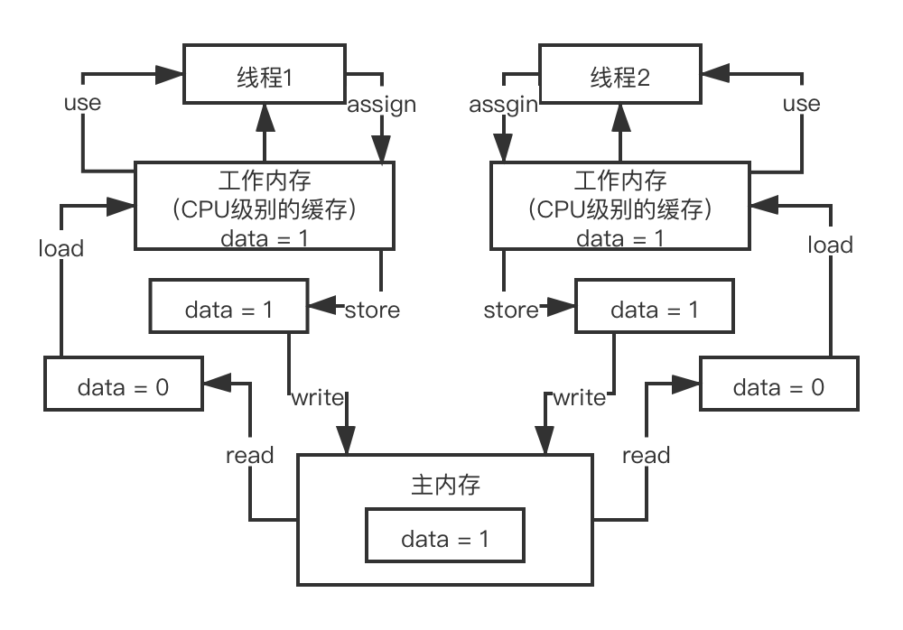
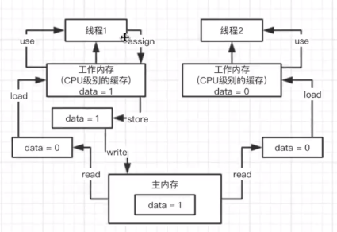
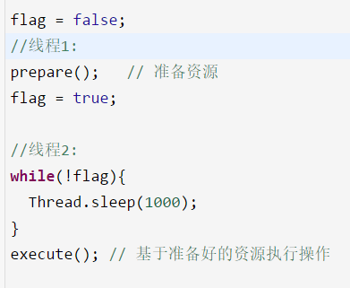
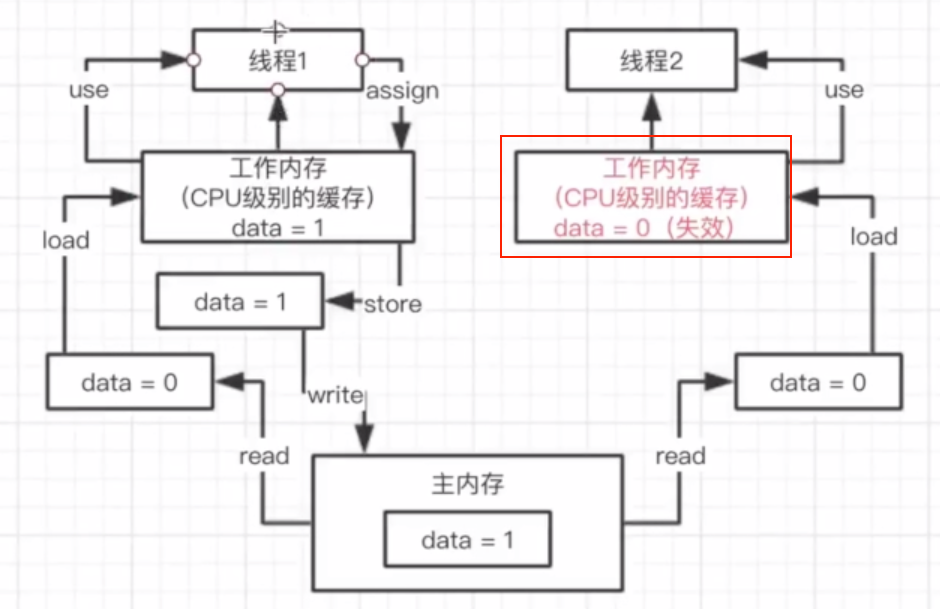
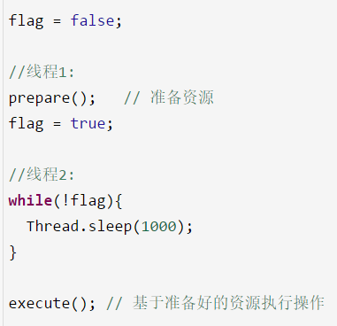
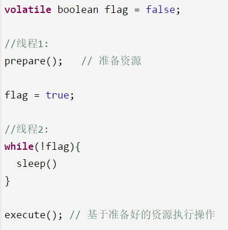

# JAVA 内存模型

## 1.  **谈谈你对JMM内存模型的理解可以吗？**

JMM 内存模型的主要目标是**定义程序中各个变量的访问规则**，即在虚拟机中将变量存储到内存和从内存中取出变量这样底层细节 

Java 内存模型中规定了**所有的变量都存储在主内存**中，每个线程还有自己的**工作内存**（类比缓存理解），线程的工作内存中保存了该线程使用到主内存中的变量拷贝，线程对变量的所有操作（读取、赋值）都必须在工作内存中进行，而不能直接读写主内存中的变量。不同线程之间无法直接访问对方工作内存中的变量，线程间变量值的传递（通信）均需要在主内存来完成，线程、主内存和工作内存的交互关系如下图所示 

并发执行原理

  

## 2.  **你知道Java内存模型中的原子性、有序性、可见性是什么吗？** 

 也就是并发编程过程中，可能会产生的三类问题 

- 可见性

  之前一直给大家代码演示，画图演示，其实说的就是并发编程中可见性问题

    

  **没有可见性**

   一开始主内存的数据为0，线程1负责写数据，线程2复制读数据，当线程1将数据改成1的时候，对线程2而言并不是可见的，线程2并不知道主内存中的数据发生了更新，这就是不具备可见性 

  **有可见性**

  一个线程对变量值进行修改，另一个线程能立马感知。让线程2直接读取主内存数据 ，使用volatile来实现

- 原子性

  **有原子性** 

  原子性：data++，必须是独立执行的，没有人影响我的，一定是我自己执行成功之后，别人才能来进行下一次data++的执行

  执行++的时候，其他线程都不能加入，其中一个线程必须执行完read、load、use、assign、store、write，下个线程才能进入处理

  **没有原子性**

  read、load、use、assign、store、write没有执行完，其他线程就进来处理

-  有序性

  对于代码，同时还有一个问题是指令重排序，编译器和指令器，有的时候为了提高代码执行效率，会将指令重排序，就是说比如下面的代码

    

  重排序之后，让flag = true先执行了，会导致线程2直接跳过while等待，执行某段代码，结果prepare()方法还没执行，资源还没准备好呢，此时就会导致代码逻辑出现异常。 

  具备有序性：不会发生指令重排导致我们的代码异常；

  不具备有序性：可能会发生一些指令重排，导致代码可能会出现一些问题

## 3.  **能聊聊volatile关键字的原理吗？**

讲清楚volatile关键字，直接问你volatile关键字的理解，对前面的一些问题，这个时候你就应该自己去主动从内存模型开始讲起，原子性、可见性、有序性的理解，volatile关键字的原理

 内存模型 -> 原子性、可见性、有序性 -> volatile 

 

线程1更新了数据之后，会让线程2当中的data失效，失效后线程2就去强制从主内存当中拿新的数据  

 volatile关键字是用来解决**可见性和有序性**，在有些罕见的条件之下，可以有限的保证原子性，他主要不是用来保证原子性的 

 volatile关键字是用来解决**可见性和有序性** 

AtomicInteger

## 4.  **你知道指令重排以及happens-before原则是什么吗？** 

 使用happens-before去决定是否指令重拍 

 volatile关键字和有序性的关系，`volatlie`是如何保证有序性的，如何避免发生指令重排的 

  

 java中有一个happens-before原则： 

 编译器、指令器可能对代码重排序，乱排，要守一定的规则，happens-before原则，只要符合happens-before的原则，那么就不能胡乱重排，如果不符合这些规则的话，那就可以自己排序 

1. **程序次序规则**：一个线程内，按照代码顺序，书写在前面的操作先行发生于书写在后面的操作

2. **锁定规则**：一个unLock操作先行发生于后面对同一个锁的lock操作，比如说在代码里有先对一个lock.lock()，lock.unlock()，lock.lock()
3.  **volatile变量规则**：对一个volatile变量的写操作先行发生于后面对这个volatile变量的读操作，volatile变量写，再是读，必须保证是先写，再读 
4.  **传递规则**：如果操作A先行发生于操作B，而操作B又先行发生于操作C，则可以得出操作A先行发生于操作C 
5.  **线程启动规则**：Thread对象的start()方法先行发生于此线程的每个一个动作，thread.start()，thread.interrupt() 
6.   **线程中断规则**：对线程interrupt()方法的调用先行发生于被中断线程的代码检测到中断事件的发生 
7.  **线程终结规则**：线程中所有的操作都先行发生于线程的终止检测，我们可以通过Thread.join()方法结束、Thread.isAlive()的返回值手段检测到线程已经终止执行 
8.  **对象终结规则**：一个对象的初始化完成先行发生于他的finalize()方法的开始 

上面这8条原则的意思很显而易见，就是程序中的代码如果**满足这个条件**，就**一定会按照这个规则来保证指令的顺序**。 

**总结一句话：** 规则制定了在一些特殊情况下，不允许编译器、指令器对你写的代码进行指令重排，必须保证你的代码的有序性 

 这8条原则是避免说出现乱七八糟扰乱秩序的指令重排，要求是这几个重要的场景下，比如是按照顺序来，但是8条规则之外，可以随意重排指令。 

  

比如这个例子，如果用volatile来修饰flag变量，一定可以让prepare()指令在flag = true之前先执行，这就禁止了指令重排 

指令重排 -> happens-before -> volatile起到避免指令重排

编译器的优化，实际执行的顺序和书写的顺序不一致

happens-before：指令不重排的条件

volatile起到避免指令重排：写操作一定要在读操作前面

