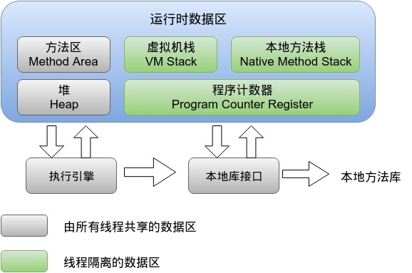

# JVM

## 1. JVM 类加载机制

**双亲委派模型**

模型如下图：


双亲委派模型中除了**启动类加载器**之外其余都需要有自己的父类加载器

当一个类收到了类加载请求时: 自己不会首先加载，而是委派给父加载器进行加载，每个层次的加载器都是这样。

所以最终每个加载请求都会经过启动类加载器。只有当**父类加载返回不能加载**时**子加载器才会进行加载**。

双亲委派的好处 : 由于每个类加载都会经过最顶层的启动类加载器，比如 java.lang.Object这样的类在各个类加载器下都是同一个类(只有当两个类是由同一个类加载器加载的才有意义，这两个类才相等。)

如果没有双亲委派模型，由各个类加载器自行加载的话。当用户自己编写了一个 java.lang.Object类，那样系统中就会出现多个 Object，这样 Java 程序中最基本的行为都无法保证，程序会变的非常混乱。

## 2.  **JVM中有哪几块内存区域？Java 8之后对内存分代做了什么改进？**





**程序计数器**

记录当前线程所执行的字节码行号，用于获取下一条执行的字节码。

当多线程运行时，每个线程切换后需要知道上一次所运行的状态、位置。由此也可以看出程序计数器是每个线程私有的。

**虚拟机栈**

虚拟机栈由一个一个的**栈帧组成**，栈帧是在每一个方法调用时产生的。

每一个栈帧由**局部变量区**、对象引用等组成。每创建一个栈帧压栈，当一个方法执行完毕之后则出栈。

- 如果出现方法递归调用出现死循环的话就会造成栈帧过多，最终会抛出 StackOverflowError。
- 若线程执行过程中栈帧大小超出虚拟机栈限制，则会抛出 StackOverflowError。
- 若虚拟机栈允许动态扩展，但在尝试扩展时内存不足，或者在为一个新线程初始化新的虚拟机栈时申请不到足够的内存，则会抛出 OutOfMemoryError。

这块内存区域也是线程私有的。

**Java 堆**

Java堆是整个虚拟机所管理的最大内存区域，所有的**对象创建**都是在这个区域进行内存分配。

可利用参数**-Xms -Xmx**进行堆内存控制。

这块区域也是**垃圾回收器**重点管理的区域，由于大多数垃圾回收器都采用**分代回收算法**，所有堆内存也分为新生代、老年代，可以方便垃圾的准确回收。

这块内存属于线程共享区域。


**方法区(JDK1.7)**

方法区主要用于存放已经被虚拟机**加载的类信息**，如常量，静态变量。 这块区域也被称为**永久代**。

可利用参数 -XX:PermSize -XX:MaxPermSize 控制初始化方法区和最大方法区大小。


**元数据区(JDK1.8)**

在 JDK1.8 中已经移除了方法区（永久代），并使用了一个元数据区域进行代替（Metaspace）。

默认情况下元数据区域会根据使用情况动态调整，避免了在 1.7 中由于加载类过多从而出现 java.lang.OutOfMemoryError: PermGen。

但也不能无限扩展，因此可以使用 -XX:MaxMetaspaceSize来控制最大内存。


## 3. Java 堆内存溢出分析

OOM 分析

Java 堆内存溢出

在 Java 堆中只要不断的创建对象，并且 GC-Roots 到对象之间存在引用链，这样 JVM 就不会回收对象。

只要将-Xms(最小堆),-Xmx(最大堆) 设置为一样 禁止自动扩展堆内存。

当使用一个 while(true) 循环来不断创建对象就会发生 OutOfMemory，还可以使用 -XX:+HeapDumpOnOutOfMemoryError 当发生 OOM 时会自动 dump 堆栈到文件中。

伪代码:

```java
public static void main(String[] args) {

	List<String> list =new ArrayList(10) ;

    while (true){

        list.add("1") ;

    }

}
```

当出现 OOM 时可以通过工具来分析 GC-Roots[引用链](https://github.com/crossoverJie/Java-Interview/blob/master/MD/GarbageCollection.md#可达性分析算法)  ，查看对象和 GC-Roots 是如何进行关联的，是否存在对象的生命周期过长，或者是这些对象确实改存在的，那就要考虑将堆内存调大了。

```java
Exception in thread "main" java.lang.OutOfMemoryError: Java heap space

  at java.util.Arrays.copyOf(Arrays.java:3210)

  at java.util.Arrays.copyOf(Arrays.java:3181)

  at java.util.ArrayList.grow(ArrayList.java:261)

  at java.util.ArrayList.ensureExplicitCapacity(ArrayList.java:235)

  at java.util.ArrayList.ensureCapacityInternal(ArrayList.java:227)

  at java.util.ArrayList.add(ArrayList.java:458)

  at com.crossoverjie.oom.HeapOOM.main(HeapOOM.java:18)

  at sun.reflect.NativeMethodAccessorImpl.invoke0(Native Method)

  at sun.reflect.NativeMethodAccessorImpl.invoke(NativeMethodAccessorImpl.java:62)

  at sun.reflect.DelegatingMethodAccessorImpl.invoke(DelegatingMethodAccessorImpl.java:43)

  at java.lang.reflect.Method.invoke(Method.java:498)

  at com.intellij.rt.execution.application.AppMain.main(AppMain.java:147)
```

Process finished with exit code 1

java.lang.OutOfMemoryError: Java heap space表示堆内存溢出。

更多内存溢出相关实战请看这里：[强如 Disruptor 也发生内存溢出？](https://crossoverjie.top/2018/08/29/java-senior/OOM-Disruptor/)


**MetaSpace (元数据)内存溢出**

JDK8中将永久代（方法区）移除，使用MetaSpace来保存类加载之后的类信息，字符串常量池也被移动到 Java 堆。

PermSize和MaxPermSize已经不能使用了，在 JDK8 中配置这两个参数将会发出警告。

JDK 8 中将类信息移到到了本地堆内存(Native Heap)中，将原有的永久代移动到了本地堆中成为MetaSpace ,如果不指定该区域的大小，JVM 将会动态的调整。

可以使用-XX:MaxMetaspaceSize=10M来限制最大元数据。这样当不停的创建类时将会占满该区域并出现OOM。

```java
public staticvoid main(String[] args) {

    while (true){

        Enhancer enhancer =new Enhancer() ;

        enhancer.setSuperclass(HeapOOM.class);

        enhancer.setUseCache(false) ;

        enhancer.setCallback(new MethodInterceptor() {

        @Override

        public Object intercept(Object o, Method method, Object[] objects, MethodProxy methodProxy) throws Throwable {

        return methodProxy.invoke(o,objects) ;

        }

    });

    enhancer.create() ;


    }

}
```


使用cglib不停的创建新类，最终会抛出:

Caused by: java.lang.reflect.InvocationTargetException

  at sun.reflect.GeneratedMethodAccessor1.invoke(Unknown Source)

  at sun.reflect.DelegatingMethodAccessorImpl.invoke(DelegatingMethodAccessorImpl.java:43)

  at java.lang.reflect.Method.invoke(Method.java:498)

  at net.sf.cglib.core.ReflectUtils.defineClass(ReflectUtils.java:459)

  at net.sf.cglib.core.AbstractClassGenerator.generate(AbstractClassGenerator.java:336)

  ... 11 more

Caused by: java.lang.OutOfMemoryError: Metaspace

  at java.lang.ClassLoader.defineClass1(Native Method)

  at java.lang.ClassLoader.defineClass(ClassLoader.java:763)

  ... 16 more

注意：这里的 OOM 伴随的是java.lang.OutOfMemoryError: Metaspace也就是元数据溢出。


## 4. 垃圾回收 GC

垃圾回收

垃圾回收主要思考三件事情:

- 哪种内存需要回收？
- 什么时候回收？
- 怎么回收？


对象是否存活

**引用计数法**

这是一种非常简单易理解的回收算法。每当有一个地方引用一个对象的时候则在引用计数器上 +1，当失效的时候就 -1，无论什么时候计数器为 0 的时候则认为该对象死亡可以回收了。

这种算法虽然简单高效，但是却**无法解决循环引用**的问题，因此 Java 虚拟机并没有采用这种算法。

**可达性分析算法**

主流的语言其实都是采用可达性分析算法:

可达性算法是通过一个称为 GC Roots 的对象向下搜索，整个搜索路径就称为引用链，当一个对象到 GC Roots 没有任何引用链， JVM 就认为该对象是可以被回收的。

[](https://camo.githubusercontent.com/966d7591ca8a7345b3399089ff95861078632f5d/68747470733a2f2f7773332e73696e61696d672e636e2f6c617267652f303036744e633739677931666d777169356d76316a6a3330653430376b6d786d2e6a7067)

如图:Object1、2、3、4 都是存活的对象，而 Object5、6、7都是可回收对象。

可以用作 GC-Roots 的对象有:

- 方法区中静态变量所引用的对象。
- 虚拟机栈中所引用的对象。


垃圾回收算法

**标记-清除算法**

标记清除算法分为两个步骤，标记和清除。 首先将不需要回收的对象标记起来，然后再清除其余可回收对象。但是存在两个主要的问题:

- 标记和清除的效率都不高。
- 清除之后容易出现不连续内存，当需要分配一个较大内存时就不得不需要进行一次垃圾回收。

标记清除过程如下:

[](https://camo.githubusercontent.com/32a4b80cd9fecf90c86f40d4a744b1100e4abbcc/68747470733a2f2f7773332e73696e61696d672e636e2f6c617267652f303036744e633739677931666d7a39396169316e336a3330666a3038716467632e6a7067)


**复制算法**

复制算法是将内存划分为两块大小相等的区域，每次使用时都只用其中一块区域，当发生垃圾回收时会将存活的对象全部复制到未使用的区域，然后对之前的区域进行全部回收。

这样简单高效，而且还不存在标记清除算法中的内存碎片问题，但就是有点浪费内存。

**在新生代会使用该算法。**

新生代中分为一个 Eden 区和两个 Survivor 区。通常两个区域的比例是 8:1:1 ，使用时会用到 Eden 区和其中一个 Survivor 区。当发生回收时则会将还存活的对象从 Eden ，Survivor 区拷贝到另一个 Survivor 区，当该区域内存也不足时则会使用**分配担保**利用老年代来存放内存。

复制算法过程：

[](https://camo.githubusercontent.com/5e81c43033f50479d65aacfde7962b0b00bb186c/68747470733a2f2f7773332e73696e61696d672e636e2f6c617267652f303036744e633739677931666d7a61766c6634656e6a3330666a3038717439622e6a7067)


**标记整理算法**

复制算法如果在存活对象较多时效率明显会降低，特别是在老年代中并没有多余的内存区域可以提供内存担保。

所以老年代中使用的时候标记整理算法，它的原理和标记清除算法类似，只是最后一步的清除改为了将存活对象全部移动到一端，然后再将边界之外的内存全部回收。

[](https://camo.githubusercontent.com/3c4f77bbdc9318126c8c2dc121ea60fb5242e66c/68747470733a2f2f7773332e73696e61696d672e636e2f6c617267652f303036744e633739677931666d7a627135357066646a333066653038733379782e6a7067)


**分代回收算法**

现代多数的商用 JVM 的垃圾收集器都是采用的分代回收算法，和之前所提到的算法并没有新的内容。

只是将 Java 堆分为了新生代和老年代。由于新生代中存活对象较少，所以采用复制算法，简单高效。

而老年代中对象较多，并且没有可以担保的内存区域，所以一般采用标记清除或者是标记整理算法。


## 5. 对象的创建与内存分配

对象的创建与内存分配

创建对象

当 JVM 收到一个 new 指令时，会检查指令中的参数在常量池是否有这个符号的引用，还会检查该类是否已经被[加载](https://github.com/crossoverJie/Java-Interview/blob/master/MD/ClassLoad.md) 过了，如果没有的话则要进行一次类加载。


当前对象的会被分配到堆内存，而在当前方法的栈针中会存储，对象的引用地址

**内存分配**

**Eden 区分配**

简单的来说对象都是在堆内存中分配的，往细一点看则是优先在 Eden 区分配。

这里就涉及到堆内存的划分了，为了方便垃圾回收，JVM 将堆内存分为新生代和老年代。

而新生代中又会划分为 Eden 区，from Survivor、to Survivor 区。

其中 Eden 和 Survivor 区的比例默认是 8:1:1，当然也支持参数调整 -XX:SurvivorRatio=8。

当在 Eden 区分配内存不足时，则会发生 minorGC ，由于 Java 对象多数是朝生夕灭的特性，所以 minorGC 通常会比较频繁，效率也比较高。

当发生 minorGC 时，JVM 会根据[复制算法](https://github.com/crossoverJie/Java-Interview/blob/master/MD/GarbageCollection.md#复制算法) 将存活的对象拷贝到另一个未使用的 Survivor 区，如果 Survivor 区内存不足时，则会使用分配担保策略将对象移动到老年代中。

谈到 minorGC 时，就不得不提到 fullGC(majorGC) ，这是指发生在老年代的 GC ，不论是效率还是速度都比 minorGC 慢的多，回收时还会发生 stop the world 使程序发生停顿，所以应当尽量避免发生 fullGC 。


**老年代分配**

也有一些情况会导致对象直接在老年代分配，比如当分配一个大对象时(大的数组，很长的字符串)，由于 Eden 区没有足够大的连续空间来分配时，会导致提前触发一次 GC，所以尽量别频繁的创建大对象。

因此 JVM 会根据一个阈值来判断大于该阈值对象直接分配到老年代，这样可以避免在新生代频繁的发生 GC。

对于一些在新生代的老对象 JVM 也会根据某种机制移动到老年代中。

JVM 是根据记录对象年龄的方式来判断该对象是否应该移动到老年代，根据新生代的复制算法，当一个对象被移动到 Survivor 区之后 JVM 就给该对象的年龄记为1，每当熬过一次 minorGC 后对象的年龄就 +1 ，直到达到阈值(默认为15)就移动到老年代中。

可以使用 -XX:MaxTenuringThreshold=15 来配置这个阈值。


**总结**

虽说这些内容略显枯燥，但当应用发生不正常的 GC 时，可以方便更快的定位问题。


## 6.  你们生产环境中的是如何设置JVM参数的？如何检查JVM运行情况？

进行压测，在压测的时候，其实就需要去观察jvm运行的情况，jstat工具去分析jvm运行的情况，他的年轻代里的eden区域的对象增长的情况，**ygc的频率**，每次ygc过后有多少对象存活，survivor能否放的下，老年代**对象增长速率**，老年代多久会触发一次fgc


就可以根据压测的情况去进行一定的jvm参数的调优，一个系统的QPS，一个是系统的接口的性能，压测到一定程度的时候 ，机器的cpu、内存、io、磁盘的一些负载情况，jvm的表现


可能需要对一些代码进行优化，比如优化性能，或者减轻一点cpu负担，减轻io和磁盘负担，发现jvm的gc过于频繁，内存泄漏，此时就需要对jvm的各个内存区域的大小以及一些参数进行调优

 

跑到线上实际生产环境里去，运行的过程中，也需要基于一些监控工具，或者是jstat，除了观察系统的QPS和性能，接口可用性，调用成功率，机器的负载，jvm的表现，gc的频率，gc耗时，内存的消耗


## 7. 一次内存溢出排查优化实战

