# JVM

## 1. JVM 类加载机制

**双亲委派模型**

模型如下图：

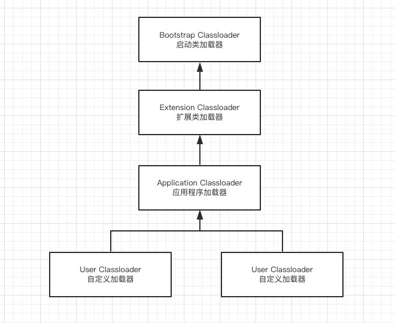

双亲委派模型中除了**启动类加载器**之外其余都需要有自己的父类加载器

当一个类收到了类加载请求时: 自己不会首先加载，而是委派给父加载器进行加载，每个层次的加载器都是这样。

所以最终每个加载请求都会经过启动类加载器。只有当**父类加载返回不能加载**时**子加载器才会进行加载**。

双亲委派的好处 : 由于每个类加载都会经过最顶层的启动类加载器，比如 java.lang.Object这样的类在各个类加载器下都是同一个类(只有当两个类是由同一个类加载器加载的才有意义，这两个类才相等。)

如果没有双亲委派模型，由各个类加载器自行加载的话。当用户自己编写了一个 java.lang.Object类，那样系统中就会出现多个 Object，这样 Java 程序中最基本的行为都无法保证，程序会变的非常混乱。

## 2.  JVM虚拟机

 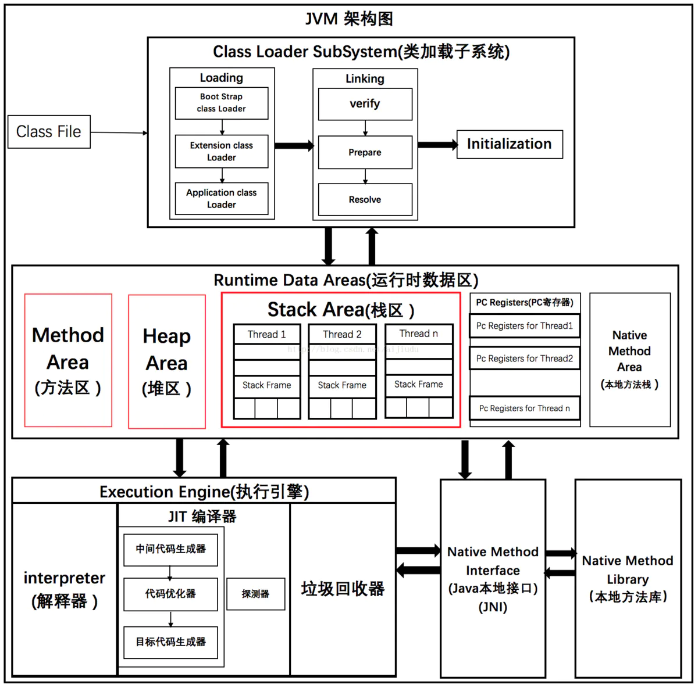 

运行时数据区（JVM 内存模型）


**程序计数器**

记录当前线程所执行的字节码行号，用于获取下一条执行的字节码。

当多线程运行时，每个线程切换后需要知道上一次所运行的状态、位置。由此也可以看出程序计数器是每个线程私有的。

**虚拟机栈**

虚拟机栈由一个一个的**栈帧组成**，栈帧是在每一个方法调用时产生的。

每一个栈帧由**局部变量表（普通变量、引用变量）**、**操作数栈**（局部变量对应值的临时存储空间）、**动态链接**（栈针对应方法在方法区的位置信息）、**方法出口**（方法返回地址 ）等组成。每创建一个栈帧压栈，当一个方法执行完毕之后则出栈。

- 如果出现方法递归调用出现**死循环**的话就会造成栈帧过多，最终会抛出 StackOverflowError。
- 若线程执行过程中**栈帧大小超出**虚拟机栈限制，则会抛出 StackOverflowError。
- 若虚拟机栈允许动态扩展，但在尝试扩展时内存不足，或者在为一个新线程初始化新的虚拟机栈时申请不到足够的内存，则会抛出 OutOfMemoryError。

这块内存区域也是线程私有的。FILO

**Java 堆**

  

Java堆是整个虚拟机所管理的最大内存区域，所有的**对象创建**都是在这个区域进行内存分配。

可利用参数**-Xms -Xmx**进行堆内存控制。

这块区域也是**垃圾回收器**重点管理的区域，由于大多数垃圾回收器都采用**分代回收算法**，所有堆内存也分为新生代、老年代（Bean 初始化对象、线程池对象、缓存对象） ，可以方便垃圾的准确回收。

 **JDK 1.7 和 1.8 将字符串常量由永久代转移到堆中** 

这块内存属于线程共享区域。

**方法区(JDK1.7)**

方法区主要用于存放已经被虚拟机加载的类信息，如**常量，静态变量，类元信息**。 这块区域也被称为永久代。

 JDK1.7中，存储在永久代的部分数据就已经转移到了Java Heap或者是 Native Heap。但永久代仍存在于JDK1.7中，并没完全移除，譬如符号引用(Symbols)转移到了native heap；字面量(interned strings)转移到了java heap；类的静态变量(class statics)转移到了java heap。 

可利用参数 -XX:PermSize -XX:MaxPermSize 控制初始化方法区和最大方法区大小。

**元数据区(JDK1.8)**

取消永久代后，使用元空间来实现方法区。 

在 JDK1.8 中已经移除了方法区（永久代）， 这样永久内存就**不再占用堆内存** ，并使用了一个元数据区域进行代替（Metaspace）。

默认情况下元数据区域会根据使用情况动态调整，避免了在 1.7 中由于加载类过多从而出现 java.lang.OutOfMemoryError: PermGen。

在JDK1.8中，使用元空间代替永久代来实现方法区，但是方法区并没有改变，所谓"Your father will always be your father"，变动的只是方法区中内容的物理存放位置。正如上面所说，类型信息（元数据信息）等其他信息被移动到了元空间中；但是**运行时常量池和字符串常量池被移动到了堆**中。但是不论它们物理上如何存放，逻辑上还是属于方法区的。 

 **-XX:MetaspaceSize**，初始空间大小，达到该值就会触发垃圾收集进行类型卸载，同时GC会对该值进行调整：如果释放了大量的空间，就适当降低该值；如果释放了很少的空间，那么在不超过MaxMetaspaceSize时，适当提高该值。 

 **-XX:MaxMetaspaceSize**，最大空间，默认是没有限制的。 


**为什么要从堆中移除永久代？**

- 字符串存在永久代中，容易出现性能问题和内存溢出。

- 类及方法的信息等比较难确定其大小，因此对于永久代的大小指定比较困难，太小容易出现永久代溢出，太大则容易导致老年代溢出。

- 永久代会为 GC 带来不必要的复杂度，并且回收效率偏低。

  

## 3. Java 堆内存OOM溢出分析

## 4. 垃圾回收 GC 垃圾回收算法 和 垃圾回收器的关系

垃圾回收

垃圾回收主要思考三件事情:

- 哪种内存需要回收？
- 什么时候回收？
- 怎么回收？

### 4.1 **判定对象是否存活算法**

- **引用计数法**

这是一种非常简单易理解的回收算法。每当有一个地方引用一个对象的时候则在引用计数器上 +1，当失效的时候就 -1，无论什么时候计数器为 0 的时候则认为该对象死亡可以回收了。

这种算法虽然简单高效，但是却**无法解决循环引用**的问题，因此 Java 虚拟机并没有采用这种算法。

- **可达性分析算法**

主流的语言其实都是采用可达性分析算法:

可达性算法是通过一个称为 GC Roots 的对象向下搜索，整个搜索路径就称为引用链，当一个对象到 GC Roots 没有任何引用链， JVM 就认为该对象是可以被回收的。


如图:Object1、2、3、4 都是存活的对象，而 Object5、6、7都是可回收对象。

可以用作 GC-Roots 的对象有:

- 虚拟机栈中所引用的对象。
- 方法区中的静态变量所引用的对象。

### 4.2 **常见垃圾回收算法**

- **标记-清除算法**

  标记清除算法分为两个步骤，标记和清除。 首先将不需要回收的对象标记起来，然后再清除其余可回收对象。但是存在两个主要的问题:

  - 标记和清除的效率都不高。
  - 清除之后容易出现不连续内存，当需要分配一个较大内存时就不得不需要进行一次垃圾回收。

  标记清除过程如下:

  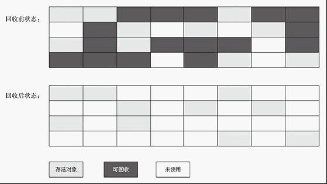


- **复制算法**

  复制算法是将内存划分为两块大小相等的区域，每次使用时都只用其中一块区域，当发生垃圾回收时会将存活的对象全部复制到未使用的区域，然后对之前的区域进行全部回收。

  这样简单高效，而且还不存在标记清除算法中的内存碎片问题，但就是有点浪费内存。

  在**新生代**会使用该算法。

  新生代中分为一个 Eden 区和两个 Survivor 区。通常两个区域的比例是 8:1:1 ，使用时会用到 Eden 区和其中一个 Survivor 区。当发生回收时则会将还存活的对象从 Eden ，Survivor 区拷贝到另一个 Survivor 区，当该区域内存也不足时则会使用**分配担保**利用老年代来存放内存。

  复制算法过程：

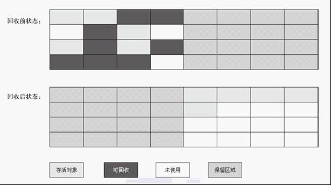


- **标记整理算法**

  复制算法如果在存活对象较多时效率明显会降低，特别是在老年代中并没有多余的内存区域可以提供内存担保。

  所以老年代中使用的时候标记整理算法，它的原理和标记清除算法类似，只是最后一步的清除改为了将存活对象全部移动到一端，然后再将边界之外的内存全部回收。

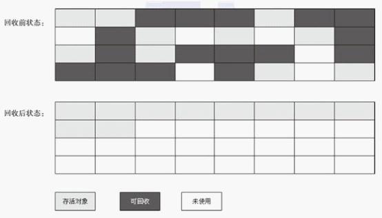


- **分代回收算法**

  现代多数的商用 JVM 的垃圾收集器都是采用的分代回收算法，和之前所提到的算法并没有新的内容。

  只是将 Java 堆分为了新生代和老年代。由于**新生代**中存活对象较少，所以采用**复制算法**，简单高效。

  而**老年代**中对象较多，并且没有可以担保的内存区域，所以一般采用**标记清除或者是标记整理算法**。


### 4.3 **垃圾回收器**

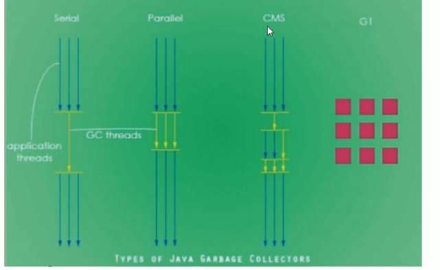

- 串行垃圾回收器（Serial）

  它为单线程环境设计并且只使用**一个线程**进行垃圾回收，会**暂停**所有的用户线程。所以不适合服务器环境

- 并行垃圾回收器（Parallel）

  **多个**垃圾回收**线程**并行工作，此时用户线程是**暂停**的，适用于科学计算/大数据处理等弱交互场景

- 并发垃圾回收器（CMS）

  用户线程和垃圾收集线程同时执行（不一定是并行，可能交替执行），**不需要停顿**用户线程

  互联网公司多用它，适用于对响应时间有要求的场景

- G1垃圾回收器

  G1垃圾回收器将堆内存分割成不同的区域然后并发的对其进行垃圾回收


## 5. 查看服务器默认垃圾回收器？

### 查看服务器默认垃圾回收器

并行垃圾回收器


### 默认垃圾回收器

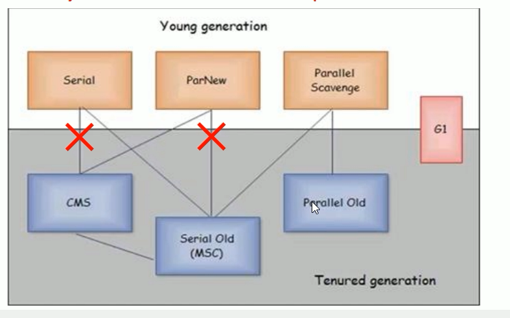

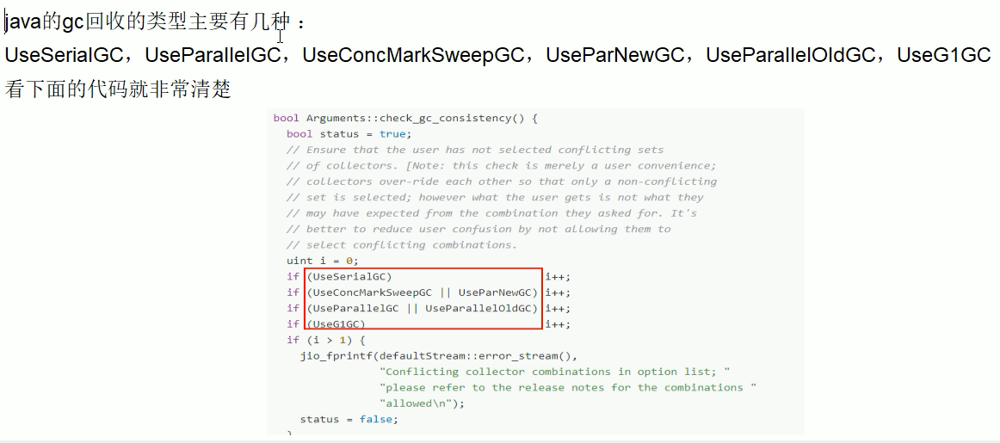

### 生产环境如何配置垃圾回收器

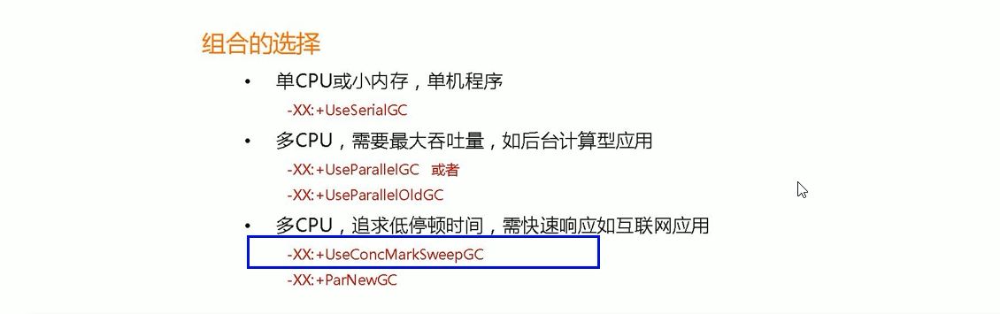

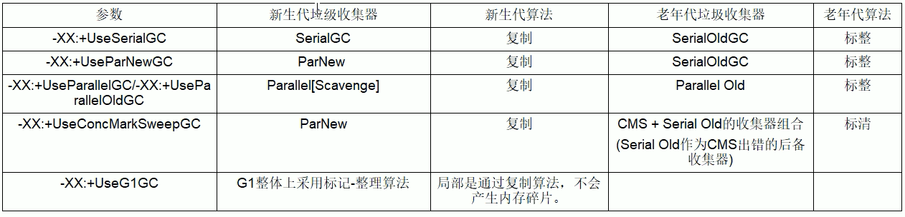


## 6. 对象的创建与内存分配

对象的创建与内存分配

创建对象

当 JVM 收到一个 new 指令时，会检查指令中的参数在常量池是否有这个符号的引用，还会检查该类是否已经被[加载](https://github.com/crossoverJie/Java-Interview/blob/master/MD/ClassLoad.md) 过了，如果没有的话则要进行一次类加载。


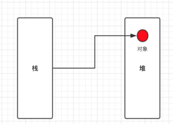


当前对象的会被分配到堆内存，而在当前方法的栈针中会存储，对象的引用地址

**内存分配**

**Eden 区分配**

简单的来说对象都是在堆内存中分配的，往细一点看则是优先在 Eden 区分配。

这里就涉及到堆内存的划分了，为了方便垃圾回收，JVM 将堆内存分为新生代和老年代。

而新生代中又会划分为 Eden 区，from Survivor、to Survivor 区。

其中 Eden 和 Survivor 区的比例默认是 8:1:1，当然也支持参数调整 -XX:SurvivorRatio=8。

当在 Eden 区分配内存不足时，则会发生 minorGC ，由于 Java 对象多数是朝生夕灭的特性，所以 minorGC 通常会比较频繁，效率也比较高。

当发生 minorGC 时，JVM 会根据[复制算法](https://github.com/crossoverJie/Java-Interview/blob/master/MD/GarbageCollection.md#复制算法) 将存活的对象拷贝到另一个未使用的 Survivor 区，如果 Survivor 区内存不足时，则会使用分配担保策略将对象移动到老年代中。

谈到 minorGC 时，就不得不提到 fullGC(majorGC) ，这是指发生在老年代的 GC ，不论是效率还是速度都比 minorGC 慢的多，回收时还会发生 stop the world 使程序发生停顿，所以应当尽量避免发生 fullGC 。


**老年代分配**

也有一些情况会导致对象直接在老年代分配，比如当分配一个大对象时(大的数组，很长的字符串)，由于 Eden 区没有足够大的连续空间来分配时，会导致提前触发一次 GC，所以尽量别频繁的创建大对象。

因此 JVM 会根据一个阈值来判断大于该阈值对象直接分配到老年代，这样可以避免在新生代频繁的发生 GC。

对于一些在新生代的老对象 JVM 也会根据某种机制移动到老年代中。

JVM 是根据记录对象年龄的方式来判断该对象是否应该移动到老年代，根据新生代的复制算法，当一个对象被移动到 Survivor 区之后 JVM 就给该对象的年龄记为1，每当熬过一次 minorGC 后对象的年龄就 +1 ，直到达到阈值(默认为15)就移动到老年代中。

可以使用 -XX:MaxTenuringThreshold=15 来配置这个阈值。


**总结**

虽说这些内容略显枯燥，但当应用发生不正常的 GC 时，可以方便更快的定位问题。


## 7.  你们生产环境中的是如何设置JVM参数的？如何检查JVM运行情况？

评估客服并发量 对系统进行压测，在压测的时候，其实就需要去观察jvm运行的情况，jstat工具去分析jvm运行的情况，他的年轻代里的eden区域的对象增长的情况，**ygc的频率**，每次ygc过后有多少对象存活，survivor能否放的下，老年代**对象增长速率**，老年代多久会触发一次fgc


就可以根据压测的情况去进行一定的jvm参数的调优，一个系统的QPS，一个是系统的接口的性能，压测到一定程度的时候 ，机器的cpu、内存、io、磁盘的一些负载情况，jvm的表现


可能需要对一些代码进行优化，比如优化性能，或者减轻一点cpu负担，减轻io和磁盘负担，发现jvm的gc过于频繁，内存泄漏，此时就需要对jvm的各个内存区域的大小以及一些参数进行调优

 

跑到线上实际生产环境里去，运行的过程中，也需要基于一些监控工具，或者是jstat，除了观察系统的QPS和性能，接口可用性，调用成功率，机器的负载，jvm的表现，gc的频率，gc耗时，内存的消耗

## 8. 你做过 JVM 调优和参数设置，请问你如果查看 JVM 系统默认值？

**JVM参数类型：**

- 标配参数：-version 、-help

- X参数：

  - -Xint：解释执行

  - -Xcomp：第一次使用就编译成本地代码

  - -Xmixed：混合模式

     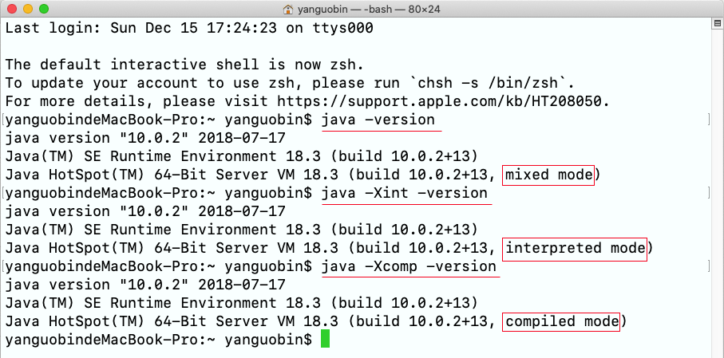 

- XX参数（重要）：

  - Boolean 类型

    格式：-XX:[+-]<name>  其中+-表示启用或者禁用name属性 

    比如：-XX:+UseConcMarkSweepGC表示启用CMS垃圾收集器，-XX:+UseG1GC表示启用G1垃圾收集器 

  - 非Boolean类型 （K=V）

    格式：-XX:<name>=<value>表示name属性的值是value 

    比如：-XX:MaxGCPauseMillis=500表示GC的最大停顿时间是500毫秒

    ​		    -XX:MetaspaceSize=128M 表示设置 元空间大小为128M

  > **注意：**-Xmx和-Xms表示设置JVM的最大内存和**初始化**内存，它们不是X参数，而是XX参数，
  >
  > -Xmx等价于-XX:MaxHeapSize，   默认为物理内存的1/4或者1G，最小为2M；单位与-Xms一致。 
  >
  > -Xms等价于-XX:InitialHeapSize； 默认为物理内存的1/64，最小为1M；可以指定单位，比如k/K、m/M，g/G 若不指定，则默认为字节 
  >
  > -Xss设置堆栈，也是XX参数，等价于-XX:ThreadStackSize 
  >
  > -Xms512m == -XX:MaxHeapSize=512m
  
  

**查看 JVM 配置信息**

- jps -l：查看正在执行的 java 进程信息

- jinfo:  查看正在运行Java进程的配置信息：包括jvm参数，系统属性 

  - -flags：查询所有配置参数
  - -flag：查看某一个配置参数

  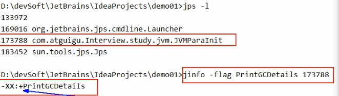

  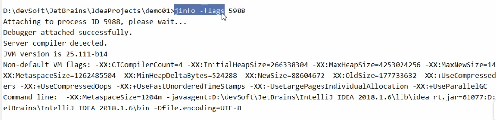

**查看JVM配置默认值**

- -XX:+PrintFlagsInitial  打印 JVM 默认初始化参数

	> := 格式参数是被人为修改过的
	
- -XX:+PrintFlagsFinal  打印JVM最终参数

- -XX:+PrintCommandLineFlags  打印程序使用的 JVM 参数

  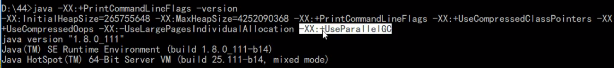

  


## 9. 工作中常用的 JVM 配置参数有哪些？

- **-Xms**

  初始化堆内存，默认物理内存的 1/64，等价于 -XX:InitialHeapSize

  > 此值可以设置与-Xmx相同,以避免每次垃圾回收完成后JVM重新分配内存 ,  内存抖动 

- **-Xmx**

  最大堆内存，默认物理内存 1/4， 等价于 -XX:MaxHeapSize

- **-Xss**

  设置单个线程栈的大小，一般根据系统不同默认为 512 ~ 1024K， 等价于 -XX:ThreadStackSize

  在相同物理内存下，减小这个值能生成更多的线程。但是操作系统对一个进程内的线程数还是有限制的，不能无限生成，根据系统具体情况，如果程序并发多，就相应设置小点。经验值在3000~5000左右。 

- **-Xmn**

  设置年轻代大小 ，整个堆大小=年轻代大小 + 年老代大小 ，增大年轻代后,将会减小年老代大小. 此值对系统性能影响较大,Sun官方推荐配置为整个堆的3/8 

- **-XX:MetaspaceSize**

  从JDK8开始，永久代(PermGen)的概念被废弃掉了，取而代之的是一个称为Metaspace的存储空间。Metaspace使用的是**本地内存**，而不是堆内存，也就是说在默认情况下Metaspace的大小只与本地内存大小有关。 这个值大小根据不同的平台在12M到20M浮动  

- **-XX:MaxMetaspaceSize**

   这个参数用于限制Metaspace增长的上限，防止因为某些情况导致Metaspace无限的使用本地内存，影响到其他程序。在本机上该参数的默认值为4294967295B（大约4096MB） 

- **-XX:+PrintGCDetails**

  打印 GC 的详细日志信息（但系统发生 GC 时，就会打印下面信息）

  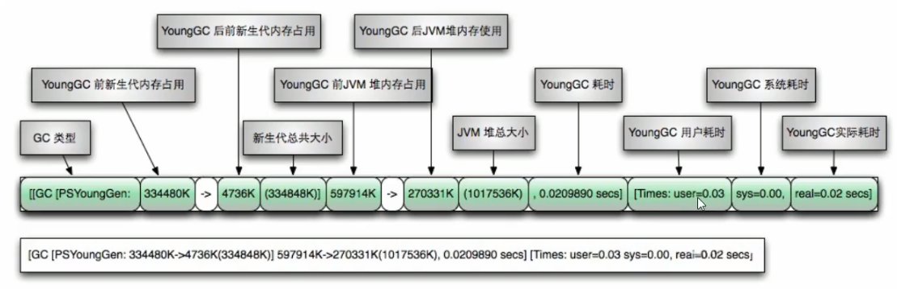

  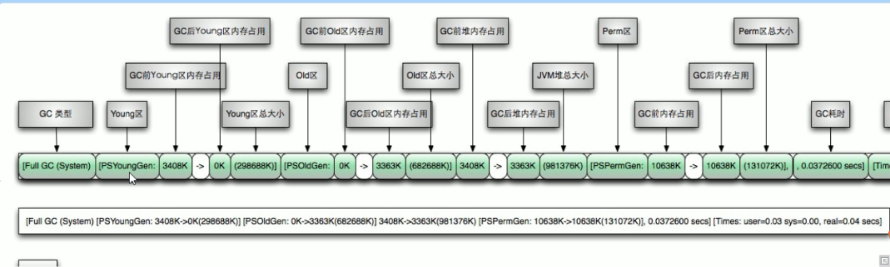

- **-XX:SurvivorRatio**

  设置新生代 eden 和 SO/S1 空间的比例，默认：8:1:1 

  假如：-XX:SurvivorRatio=4，eden:S0:S1 = 4:1:1

  SurvivorRatio **设置的是 eden 区占比例**多少，S0/S1相同

- **-XX:NewRatio**

  设置 新生代和老年代 空间比列，默认 -XX:NewRatio=2 新生代占 1，老年代 2

  假如：-XX:NewRatio=4 新生代占1，老年代占4

  NewRatio 的值是设置老年代的占比，剩下的 1 给新生代

- **-XX:MaxTenuringThreshold**

   当新手代对象经过指定的次数就能进入老年代,默认为15. JDK8 限制范围 [0, 15]， 一般不用动

## 10. 常用 Linux 查询运行信息命令

- top

  top命令是Linux下常用的性能分析工具，能够实时显示系统中各个进程的资源占用状况，类似于Windows的任务管理器

  **top参数详解**

  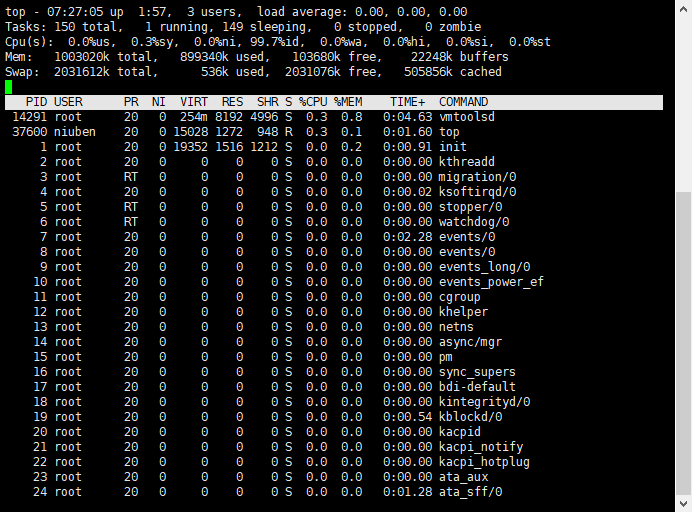

  **第一行，任务队列信息，同 uptime 命令的执行结果**

  > 系统时间：07:27:05
  >
  > 运行时间：up 1:57 min,
  >
  > 当前登录用户： 3 user
  >
  > 负载均衡(uptime) load average: 0.00, 0.00, 0.00
  >
  >    average后面的三个数分别是1分钟、5分钟、15分钟的负载情况。
  >
  > load average数据是每隔5秒钟检查一次活跃的进程数，然后按特定算法计算出的数值。如果这个数除以逻辑CPU的数量，结果高于5的时候就表明系统在超负荷运转了

  **第二行，Tasks — 任务（进程）**

  > 总进程:150 total, 运行:1 running, 休眠:149 sleeping, 停止: 0 stopped, 僵尸进程: 0 zombie

  **第三行，cpu状态信息**

  > 0.0%us【user space】— 用户空间占用CPU的百分比。
  >
  > 0.3%sy【sysctl】— 内核空间占用CPU的百分比。
  >
  > 0.0%ni【】— 改变过优先级的进程占用CPU的百分比
  >
  > 99.7%id【idolt】— 空闲CPU百分比
  >
  > 0.0%wa【wait】— IO等待占用CPU的百分比
  >
  > 0.0%hi【Hardware IRQ】— 硬中断占用CPU的百分比
  >
  > 0.0%si【Software Interrupts】— 软中断占用CPU的百分比

  **第四行,内存状态**

  >  1003020k total,  234464k used,  777824k free,  24084k buffers【缓存的内存量】

  **第五行，swap交换分区信息**

  > 2031612k total,   536k used, 2031076k free,  505864k cached【缓冲的交换区总量】

  > 备注：
  >
  > 可用内存=free + buffer + cached
  >
  > 对于内存监控，在top里我们要时刻监控第五行swap交换分区的used，如果这个数值在不断的变化，说明内核在不断进行内存和swap的数据交换，这是真正的内存不够用了。
  >
  > 第四行中使用中的内存总量（used）指的是现在系统内核控制的内存数，
  >
  > 第四行中空闲内存总量（free）是内核还未纳入其管控范围的数量。
  >
  > 纳入内核管理的内存不见得都在使用中，还包括过去使用过的现在可以被重复利用的内存，内核并不把这些可被重新使用的内存交还到free中去，因此在linux上free内存会越来越少，但不用为此担心。

  **第六行，空行**

  **第七行以下：各进程（任务）的状态监控**

  > PID — 进程id
  > USER — 进程所有者
  > PR — 进程优先级
  > NI — nice值。负值表示高优先级，正值表示低优先级
  > VIRT — 进程使用的虚拟内存总量，单位kb。VIRT=SWAP+RES
  > RES — 进程使用的、未被换出的物理内存大小，单位kb。RES=CODE+DATA
  > SHR — 共享内存大小，单位kb
  > S —进程状态。D=不可中断的睡眠状态 R=运行 S=睡眠 T=跟踪/停止 Z=僵尸进程
  > %CPU — 上次更新到现在的CPU时间占用百分比
  > %MEM — 进程使用的物理内存百分比
  > TIME+ — 进程使用的CPU时间总计，单位1/100秒
  > COMMAND — 进程名称（命令名/命令行）

- free

   系统内存的使用情况，包括物理内存、交换内存(swap)和内核缓冲区内存。 

  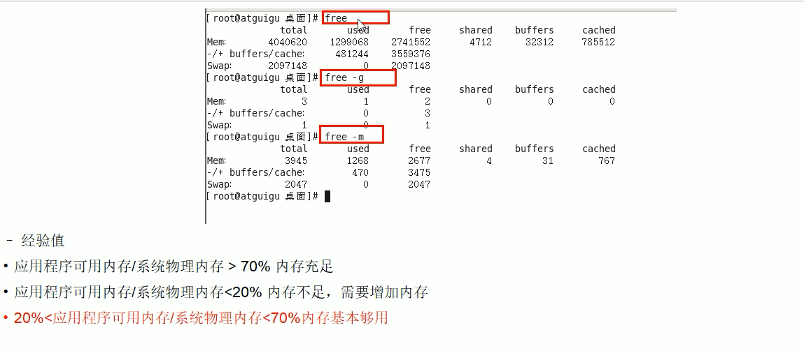

- df

  查看磁盘剩余信息

  

  

  
```

```