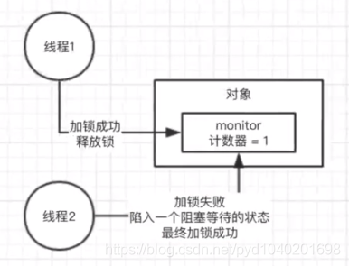
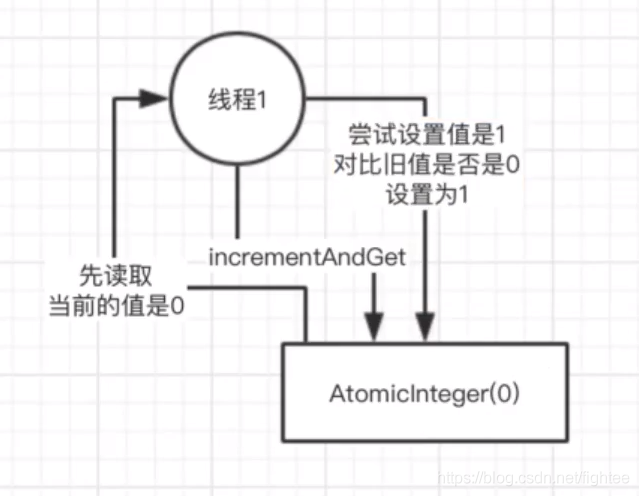
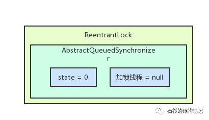
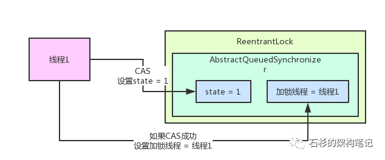
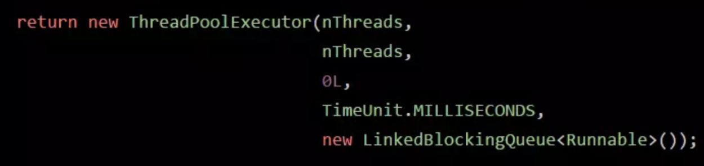
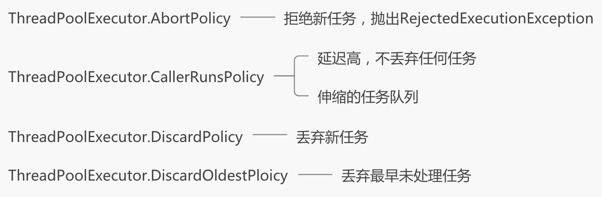
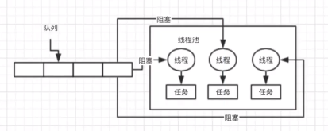

# 并发编程

## 1. 说说 synchronized 关键字的底层原理是什么？

我这个synchronized是用来加锁的，我可以对一个对象去加锁，我也可以对一个类去加锁，锁之间会有互斥，有一个人加了锁，另外一个人就必需得在外面等着，
得让加了锁的把synchronized里面的代码都执行完，执行出去了之后，才会把锁释放，锁释放了之后，排在后面的线程才能够过来去获取锁，然后再执行synchronized里面的代码



synchronized 底层原理是什么？
首先 synchronized 加锁，他会执行一个 monitorenter 指令，释放锁的时候，会执行一个 monitorexit 指令 

每个对象都有一个关联的monitor，比如一个对象实例就有一个monitor，一个类的Class对象也有一个monitor，如果要对这个对象加锁，那么必须获取这个对象关联的monitor的lock锁

总结
如果一个线程第一次运行到 synchronized 代码那里话，获取到了 myObject 对象的monitor的锁，然后计数器就会加1，
然后第二次运行到 synchronized 代码那里话，会再次获取 myObject 对象的monitor的锁，这个就是重入加锁了，然后计数器会再次加1，变成2，

那么这个时候，其他的线程运行到第一次 synchronized 代码那里的话，会发现说 myObject 对象的 monitor 锁的计数器是大于0的，就意味着被别人
给加锁了，然后此时线程就会进入 block 阻塞状态，什么都干不了，就是等待获取锁

那么如果第一个线程出了 synchronized 修饰的代码段的范围的话，就会有一个 moninorexit 的指令，此时，在底层获取锁的线程就会对那个对象
的 monitor 的计数器减1，如果有多次重入加锁，就会对应多次减1，直到最后，计数器是0

然后，后面block阻塞的线程，会再次尝试获取锁，但是只有一个线程可以获取锁，这就是 synchronized 底层实现的原理了

## 2. 聊聊你对 CAS 的理解以及其底层实现原理？

首先 CAS 是为了解决多线程并发安全问题。

假设有这样一个场景：多线程访问同一个数据，例如

```java
public class MyObject{
	
	int i = 0;

	public void increment(){
		i++;
	}
}
```

```java
MyObject myObject = new MyObject();
```

假设有多个线程同时基于myObject 对象来执行increment方法，则可能出现线程安全问题，i的值可能是错误的；
我们可能会用到Java并发包下的很多技术，如sychronized，保证同一时间只有一个线程对该数据进行读写。 

**解决方法1：**

使用 synchronized 关键字 

```java
public class MyObject{
	
	int i = 0;

	public synchronized  void increment(){
		i++;
	}
}
```

在一个实例方法上加上synchronized，意思是针对执行这个方法的myObject对象进行加锁，同一时间只有一个线程可以进入这个方法。 

存在问题：
多线程**串行执行**方法中的代码，效率是不高的，因为多个线程需要排队去执行。 

**解决方法2：**

使用Java并发包中的AtomicInteger原子类代替Int； 

```java
public class MyObject{
	
	AtomicInteger i = new AtomicInteger(0);
	
	public void increment(){
		i.incrementAndGet();
	}
}
```

 此时不需要加锁，也是线程安全的，AtomicInteger底层就是基于CAS机制来实现的。 

**CAS实现原理**

> CAS：compare and swap 
>
>  compareAndSwapInt是借助C来调用CPU底层指令实现的 
>
> 在底层对应一些硬件级别给你保证本身原子性，同一时间只有一个线程可以去执行 CAS 

 （1）当有一个线程执行操作时： 

 

当有一个线程1去执行incrementAndGet，基于CAS机制，会进行这样的操作：
首先读取i的当前值为0；
根据CAS机制，先对比读取到的值与i的实际值是否相等，是的话则将i设置为1；
体现了compare（对比）和swap（替换）的过程。  

（2）当有多个线程操作时： 

 

**原则：CAS的操作只能被一个线程执行，即线程1执行CAS时，线程2无法执行CAS**
在此过程中，线程1和线程2都先读取到来i的初始值为0；

线程1首先执行CAS操作，先对比i的值是否等于读到的0；
相等，把i累加为1，完成CAS操作。

线程2再去执行CAS操作，由于i的值已经是1来，与之前读到的0不相等，所以CAS操作失败；
线程2重新读取i的值，为1；
线程2再次执行CAS操作，i的值与读取到的值进行比较；
相等，则将i累加为2，完成CAS操作。 

```java
/**
  * Object o 指定类型
  * long offset 被加数的内存偏移值
  * int delta 加数
  */
public final int getAndAddInt(Object o, long offset, int delta) {
    int v;
    do {
        //*保证缓存一致性同时从给定偏移量处的对象o
        v = getIntVolatile(o, offset);
    } while (!compareAndSwapInt(o, offset, v, v + delta));
    //*不断地重新获取内存中的值，直至成功CAS
    return v;
}
    
```


## 3. ConcurrentHashMap 实现线程安全的底层原理是什么？

jdk 1.8 之前是将一个完整的数组拆分为多个数组，分段加锁，每个小数组都加了锁；

jdk 1.8 之后，改回成了大数组，对数组中的每个元素进行了加锁，采取CAS 策略

如果是对数组中同一个位置的元素进行操作，才会加锁串行化处理；如果是对数组中不同位置的元素进行操作，是可以并发执行的。


## 4. 谈谈你对 JDK 的 AQS 理解？AQS 实现原理是什么？

https://blog.csdn.net/qq_42046105/article/details/102384342

**AbstractQueuedSynchronizer，抽象队列同步器**

很简单，这个AQS对象内部有一个核心的变量叫做**state**，是int类型的，代表了**加锁的状态**。

初始状态下，这个state的值是0。

  

另外，这个AQS内部还有一个**关键变量**，用来记录**当前加锁的是哪个线程**，初始化状态下，这个变量是null。

接着线程1跑过来进行加锁，这个加锁的过程，直接就是用CAS操作将state值从0变为1。

如果之前没人加过锁，那么state的值肯定是0，此时线程1就可以加锁成功。

一旦线程1加锁成功了之后，就可以设置当前加锁线程是自己。所以大家看下面的图，就是线程1跑过来加锁的一个过程。

  

其实一句话总结：AQS就是一个并发包的基础组件，用来实现各种锁，各种同步组件的。

它包含了state变量、加锁线程、等待队列等并发中的核心组件。

常见基于AQS 实现的

## 5.  说说线程池的底层工作原理？

首先线程池使用来解决线程频繁创建、销毁问题。

系统是不可能说让他无限制的创建很多很多的线程的，会构建一个线程池，里面有一定数量的线程，让他们执行各种各样的任务，线程执行完任务之后，不要销毁掉自己，继续去等待执行下一个任务 。

而初始化线程池的方式有很多种，我们可以通过java 的 Executors 工具类：newFixedThreadPool(n)/newCacheedThreadPoo()/newScheduleThreadPool

```java
public static ExecutorService newCachedThreadPool() {
    return new ThreadPoolExecutor(0, Integer.MAX_VALUE,
                                  60L, TimeUnit.SECONDS,
                                  //使用同步队列，将任务直接提交给线程
                                  new SynchronousQueue<Runnable>());
}
```

```java

public static ExecutorService newFixedThreadPool(int nThreads) {
    return new ThreadPoolExecutor(nThreads, nThreads,
                                  0L, TimeUnit.MILLISECONDS,
                                  //使用一个基于FIFO排序的阻塞队列，在所有corePoolSize线程都忙时新任务将在队列中等待
                                  new LinkedBlockingQueue<Runnable>());
}
```


或者 直接 new ThreadPoolExcecutor 的方式来初始化线程池。

常见的配置参数：

```
/ 核心线程数，线程池当中有多少个线程处理任务
corePoolSize：3
// 核心线程满了，可以创建而外的线程创建任务，创建而外的线程不能超过maximumPoolSize
// 无限制创建线程
maximumPoolSize：Integer.MAX_VALUE
// 处理完成之后，而外的线程会空闲一段时间，空闲60s之后会回收
keepAliveTime：60s
// 
new ArrayBlockingQueue<Runnable>(200)

// 所有线程都满了，而且队列也满的时候，启用的拒绝策略，拒绝新的任务入队  
RejectedExecutionHandler
```

当你 commit 提交任务时， 先看一下线程池里的线程数量是否小于corePoolSize，也就是3，如果小于，直接创建一个线程出来执行你的任务 

 如果执行完你的任务之后，这个线程是不会死掉的，他会尝试从一个无界的LinkedBlockingQueue里获取新的任务，如果没有新的任务，此时就会阻塞住，等待新的任务到来 

你持续提交任务，上述流程反复执行，只要线程池的线程数量小于corePoolSize，都会直接创建新线程来执行这个任务，执行完了就尝试从无界队列里获取任务，直到线程池里有corePoolSize个线程 

接着再次提交任务，会发现线程数量已经跟corePoolSize一样大了，此时就直接把任务放入队列中就可以了，线程会争抢获取任务执行的，如果所有的线程此时都在执行任务，那么无界队列里的任务就可能会越来越多 

```
// 所有线程都满了，而且队列也满的时候，启用的拒绝策略，拒绝新的任务入队  
RejectedExecutionHandler
```


## 6. 那你再说说线程池的核心配置参数都是干什么的？平时我们应该怎么用？

  代表线程池的类是ThreadPoolExecutor  

创建一个线程池就是这样子的，corePoolSize，maximumPoolSize，keepAliveTime，queue，这几个东西，如果你不用fixed之类的线程池，自己完全可以通过这个构造函数就创建自己的线程池，阿里规范手册建议手动创建

```
// 核心线程数，线程池当中有多少个线程处理任务
corePoolSize：3
// 核心线程满了，可以创建而外的线程创建任务，创建而外的线程不能超过maximumPoolSize
// 无限制创建线程
maximumPoolSize：Integer.MAX_VALUE
// 处理完成之后，**额外**的线程会空闲一段时间，空闲60s之后会回收
keepAliveTime：60s
// 
new ArrayBlockingQueue<Runnable>(200)

// 所有线程都满了，而且队列也满的时候，启用的拒绝策略，拒绝新的任务入队  
RejectedExecutionHandler
```

  

如果说你把queue做成有界队列，比如说new ArrayBlockingQueue<Runnable>(200)，那么假设corePoolSize个线程都在繁忙的工作，大量任务进入有界队列，队列满了，此时怎么办？

这个时候假设你的maximumPoolSize是比corePoolSize大的，此时会继续创建额外的线程放入线程池里，来处理这些任务，然后超过corePoolSize数量的线程如果处理完了一个任务也会尝试从队列里去获取任务来执行




## 7.  **如果在线程池中使用无界阻塞队列会发生什么问题？** 

内存溢出，是否了解线程池的工作原理，能够自己分析出来会溢出，队列的任务越来越多，必然会造成内存溢出的情况

在远程服务异常的情况下，使用无界阻塞队列，是否会导致内存异常飙升？

调用超时，队列变得越来越大，此时会导致内存飙升起来，而且还可能会导致你会OOM，内存溢出

## 8.  **你知道如果线程池的队列满了之后，会发生什么事情吗？** 

本质：考察是否了解线程池的原理


无限队列：内存溢出

有界队列+无线线程：cpu load飙高，宕机

主要要看业务的负载

有界列，可以避免内存溢出

```java
corePoolSize: 10

maximumPoolSize : 200

ArrayBlockingQueue(200)
```

自定义一个reject策略，如果线程池无法执行更多的任务了，此时建议你可以把这个任务信息持久化写入磁盘里去，后台专门启动一个线程，后续等待你的线程池的工作负载降低了，他可以慢慢的从磁盘里读取之前持久化的任务，重新提交到线程池里去执行


你可以无限制的不停的创建额外的线程出来，一台机器上，有几千个线程，甚至是几万个线程，每个线程都有自己的栈内存，占用一定的内存资源，会导致内存资源耗尽，系统也会崩溃掉，即使没有崩溃，会导致系统cpu load飙高，也会找出系统宕机

## 9.  **如果线上机器突然宕机，线程池的阻塞队列中的请求怎么办？** 

任务落盘

必然会导致线程池里的积压的任务实际上来说都是会丢失的

如果说你要提交一个任务到线程池里去，在提交之前，麻烦你先在**数据库里插入这个任务的信息**，更新他的状态：未提交、已提交、已完成。提交成功之后，更新他的状态是已提交状态

系统重启，后台线程去扫描数据库里的未提交和已提交状态的任务，可以把任务的信息读取出来，重新提交到线程池里去，继续进行执行

