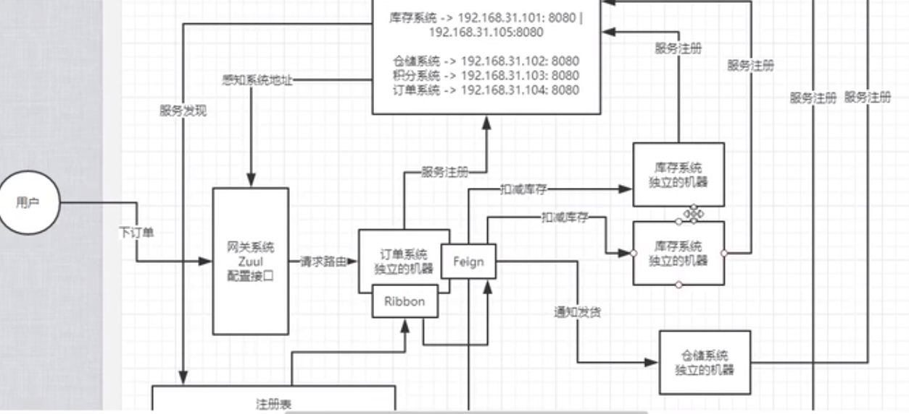
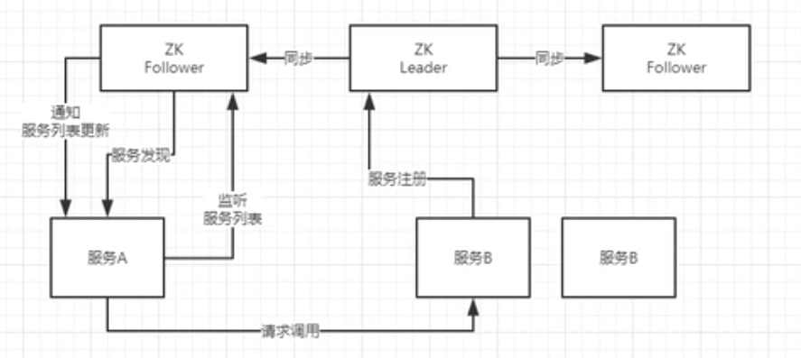
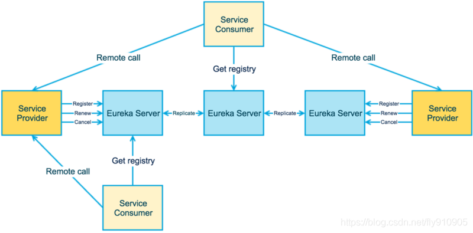
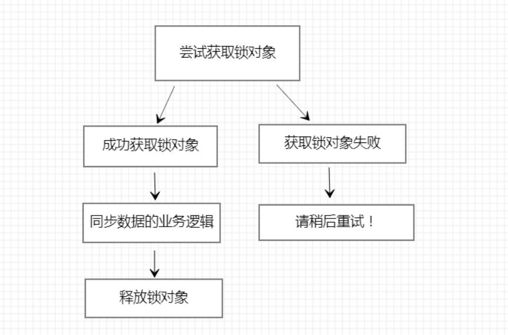
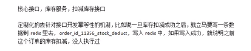
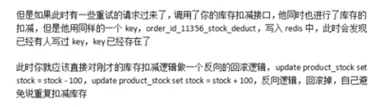
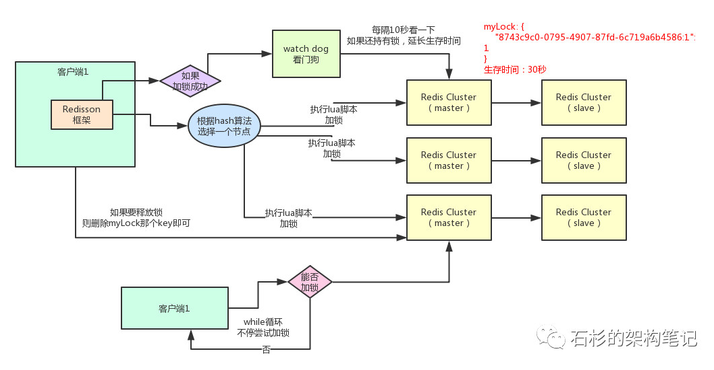
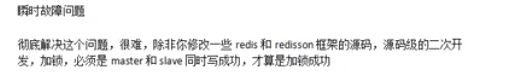

# 微服务

## 1. 微服务架构原理

## 2. 服务注册中心框架选型

## **Apache Zookeeper -> CP**

与 Eureka 有所不同，Apache Zookeeper 在设计时就紧遵CP原则，即任何时候对 Zookeeper 的访问请求能得到一致的数据结果，同时系统对网络分割具备容错性，但是 Zookeeper 不能保证每次服务请求都是可达的。

从 Zookeeper 的实际应用情况来看，在使用 Zookeeper 获取服务列表时，如果此时的 Zookeeper 集群中的 Leader 宕机了，该集群就要进行 Leader 的选举，又或者 Zookeeper 集群中半数以上服务器节点不可用（例如有三个节点，如果节点一检测到节点三挂了 ，节点二也检测到节点三挂了，那这个节点才算是真的挂了），那么将无法处理该请求。所以说，Zookeeper 不能保证服务可用性。

当然，在大多数分布式环境中，尤其是涉及到**数据存储**的场景，**数据一致性**应该是**首先被保证**的，这也是 Zookeeper 设计紧遵CP原则的另一个原因。

但是对于服务发现来说，情况就不太一样了，针对同一个服务，即使注册中心的不同节点保存的服务提供者信息不尽相同，也并不会造成灾难性的后果。

因为对于服务消费者来说，能消费才是最重要的，消费者虽然拿到可能不正确的服务实例信息后尝试消费一下，也要胜过因为无法获取实例信息而不去消费，导致系统异常要好（淘宝的双十一，京东的618就是紧遵AP的最好参照）。

当master节点因为网络故障与其他节点失去联系时，剩余节点会重新进行leader选举。问题在于，选举leader的时间太长，30~120s，而且选举期间整个zk集群都是不可用的，这就导致在选举期间注册服务瘫痪。(牺牲可用性)

在云部署环境下， 因为网络问题使得zk集群失去master节点是大概率事件，虽然服务能最终恢复，但是漫长的选举事件导致注册长期不可用是不能容忍的。

**总结：**

Zookeeperr是有一个Leader节点会接收数据，然后同步给其它节点，一旦leader挂了，要重新选举leader，这个过程为了保证 C（数据一致性），就会不可用一段时间（牺牲了A 可用性），但是一旦leader选举好后，那么就可以继续写数据了，保证一致性。

 

## **Spring Cloud Eureka -> AP**

Spring Cloud Netflix 在设计 Eureka 时就紧遵AP原则（尽管现在2.0发布了，但是由于其闭源的原因 ，但是目前 Ereka 1.x 任然是比较活跃的）。

Eureka Server 也可以运行多个实例来构建集群，解决单点问题，但不同于 ZooKeeper 的选举 leader 的过程，Eureka Server 采用的是Peer to Peer 对等通信。这是一种去中心化的架构，无 master/slave 之分，每一个 Peer 都是对等的。在这种架构风格中，**节点通过彼此互相注册来提高可用性**，每个节点需要添加一个或多个有效的 serviceUrl 指向其他节点。每个节点都可被视为其他节点的副本。

在集群环境中如果某台 Eureka Server **宕机**，Eureka Client 的请求会**自动切换到新的 Eureka Server** 节点上，保证服务可用性，当宕机的服务器重新恢复后，Eureka 会再次将其纳入到服务器集群管理之中。当节点开始接受客户端请求时，所有的操作都会在节点间进行复制（replicate To Peer）操作，将请求复制到该 Eureka Server 当前所知的其它所有节点中。

当一个新的 Eureka Server 节点启动后，会首先尝试从邻近节点获取所有注册列表信息，并完成初始化。Eureka Server 通过 getEurekaServiceUrls() 方法获取所有的节点，并且会通过心跳契约的方式定期更新。

如果是Eureka Client刚注册完，Eureka Server 就宕机了，还没来得及同步数据到集群其它节点，此时就会出现暂时的数据不一致情况

但默认情况下，如果 Eureka Server 在一定时间内没有接收到某个服务实例的心跳（默认周期为30秒），Eureka Server 将会注销该实例（默认为90秒， eureka.instance.lease-expiration-duration-in-seconds 进行自定义配置）。最终保证各个Server之间**数据最终一致性**

**总结**

首先对Eureka注册中心需要了解的是Eureka各个节点都是平等的，没有ZK中 leader follower的概念， 即使N-1个节点挂掉也不会影响其他节点的正常运行。 

服务注册相对要快，因为不需要等注册信息replicate到其他节点，也不保证注册信息是否replicate成功 当数据出现不一致时，虽然A, B上的注册信息不完全相同，但每个Eureka节点依然能够正常对外提供服务，这会出现查询服务信息时如果请求A查不到，但请求B就能查到。如此保证了可用性但牺牲了一致性。 

## 4. 接口幂等性

- 唯一索引，防止新增脏数据  

  添加操作，根据业务创建对相应的唯一索引，根据同一个order_id只能插入一次

- 具有Redis 实现一套防重框架

  对应一些更新操作，就很难通过唯一索引来保证

  > 思想：
  >
  >     
  >
  > 使用springmvc 拦截器 开发一个自定义方法注解，在需要添加防重校验的接口方法上添加注解
  >
  > 

  

## 5. 基于 Redisson 实现分布式锁原理

https://www.cnblogs.com/AnXinliang/p/10019389.html

  

如果集群故障了，分布式锁还有效吗? --> 无效

