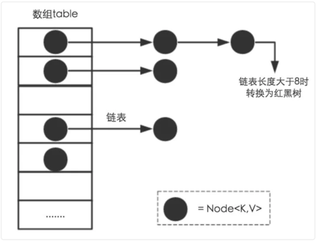
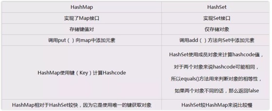
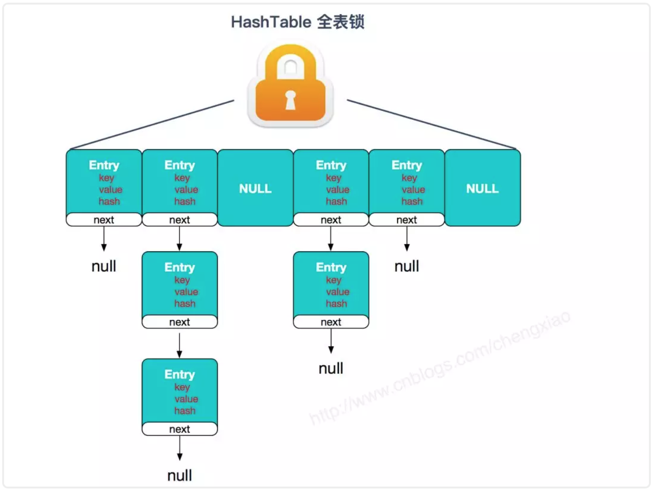
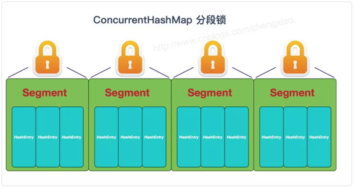
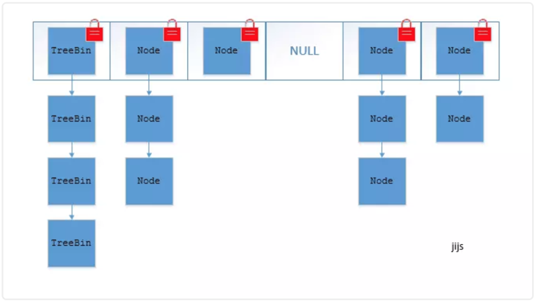

# 集合

## 1. ArrayList 和 LinkedList 异同？

Arraylist 与 LinkedList 异同
1. 线程安全： ArrayList 和 LinkedList 都是不同步的，也就是不保证线程安全；
2. 底层数据结构： Arraylist 底层使用的是Object数组；LinkedList 底层使用的是双向循环链表数据结构；
3. 插入和删除是否受元素位置的影响： ① ArrayList 采用数组存储，所以插入和删除元素的时间复杂度受元素位置的影响。 比如：执行 add(E e)方法的时候， ArrayList 会默认在将指定的元素追加到此列表的末尾，这种情况时间复杂度就是O(1)。但是如果要在指定位置 i 插入和删除元素的话（ add(intindex,E element)）时间复杂度就为 O(n-i)。因为在进行上述操作的时候集合中第 i 和第 i 个元素之后的(n-i)个元素都要执行向后位/向前移一位的操作。 ②LinkedList 采用链表存储，所以插入，删除元素时间复杂度不受元素位置的影响，都是近似 O（1）而数组为近似 O（n）。
4. 是否支持快速随机访问： LinkedList 不支持高效的随机元素访问，而ArrayList 实现了RandmoAccess 接口，所以有随机访问功能。快速随机访问就是通过元素的序号快速获取元素对象(对应于 get(intindex)方法)。
5. 内存空间占用： ArrayList的空 间浪费主要体现在在list列表的结尾会预留一定的容量空间，而LinkedList的空间花费则体现在它的每一个元素都需要消耗比ArrayList更多的空间（因为要存放直接后继和直接前驱以及数据）。
补充：数据结构基础之双向链表䶕双向链表也叫双链表，是链表的一种，它的每个数据结点中都有两个指针，分别指向直接后继和直接前驱。所以，从双向链表中的任意一个结点开始，都可以很方便地访问它的前驱结点和后继结点。一般我们都构造双向循环链表，如下图所示，同时下图也是LinkedList 底层使用的是双向循环链表数据结构。

## 2. ArrayList 和 Vector 的区别

ArrayList/Vector 的底层分析

**ArrayList**

ArrayList 实现于 List、RandomAccess 接口。可以插入空数据，也支持随机访问。
构造方法默认初始容量被设置为10。当ArrayList中的元素超过10个以后，会重新分配内存空间，使数组的大小增长到16。
可以通过调试看到动态增长的数量变化：10->16->25->38->58->88->...
扩容规则：((旧容量 * 3) / 2) + 1

ArrayList 相当于动态数据，其中最重要的两个属性分别是: elementData 数组，以及 size 大小。 在调用 add() 方法的时候：

```java
    public boolean add(E e) {
        ensureCapacityInternal(size + 1);  // Increments modCount!!
        elementData[size++] = e;
        return true;
    }
    
```

首先进行扩容校验。
将插入的值放到尾部，并将 size + 1 。
如果是调用 add(index,e) 在指定位置添加的话：

```java
public void add(int index, E element) {
    rangeCheckForAdd(index);
   	ensureCapacityInternal(size + 1);  // Increments modCount!!
    //复制，向后移动
    System.arraycopy(elementData, index, elementData, index + 1,
                     size - index);
    elementData[index] = element;
    size++;
}
```

也是首先扩容校验。
接着对数据进行复制，目的是把 index 位置空出来放本次插入的数据，并将后面的数据向后移动一个位置。
其实扩容最终调用的代码:

```java
private void grow(int minCapacity) {
    // overflow-conscious code
    int oldCapacity = elementData.length;
    int newCapacity = oldCapacity + (oldCapacity >> 1);
    if (newCapacity - minCapacity < 0)
        newCapacity = minCapacity;
    if (newCapacity - MAX_ARRAY_SIZE > 0)
        newCapacity = hugeCapacity(minCapacity);
    // minCapacity is usually close to size, so this is a win:
    elementData = Arrays.copyOf(elementData, newCapacity);
}
```

也是一个数组复制的过程。
由此可见 ArrayList 的主要消耗是数组扩容以及在指定位置添加数据，在日常使用时最好是指定大小，尽量减少扩容。更要减少在指定位置插入数据的操作。

序列化
由于 ArrayList 是基于动态数组实现的，所以并不是所有的空间都被使用。因此使用了 transient 修饰，可以防止被自动序列化。
transient Object[] elementData;
因此 ArrayList 自定义了序列化与反序列化：

```java
private void writeObject(java.io.ObjectOutputStream s)
	throws java.io.IOException{
	// Write out element count, and any hidden stuff
	int expectedModCount = modCount;
	s.defaultWriteObject();
	// Write out size as capacity for behavioural compatibility with clone()
    s.writeInt(size);
 
    // Write out all elements in the proper order.
    //只序列化了被使用的数据
    for (int i=0; i<size; i++) {
        s.writeObject(elementData[i]);
    }
 
    if (modCount != expectedModCount) {
        throw new ConcurrentModificationException();
    }
}
 
private void readObject(java.io.ObjectInputStream s)
    throws java.io.IOException, ClassNotFoundException {
    elementData = EMPTY_ELEMENTDATA;
 
    // Read in size, and any hidden stuff
    s.defaultReadObject();
 
    // Read in capacity
    s.readInt(); // ignored
 
    if (size > 0) {
        // be like clone(), allocate array based upon size not capacity
        ensureCapacityInternal(size);
 
        Object[] a = elementData;
        // Read in all elements in the proper order.
        for (int i=0; i<size; i++) {
            a[i] = s.readObject();
        }
    }
}
```
当对象中自定义了 writeObject 和 readObject 方法时，JVM 会调用这两个自定义方法来实现序列化与反序列化。
从实现中可以看出 ArrayList 只序列化了被使用的数据。

**Vector**

Vector 也是实现于 List 接口，底层数据结构和 ArrayList 类似,也是一个动态数组存放数据。不过是在 add() 方法的时候使用 synchronized 进行同步写数据，但是开销较大，所以 Vector 是一个**同步容器**并不是一个**并发容器**。
以下是 add() 方法：

 ```java
 public synchronized boolean add(E e) {
        modCount++;
        ensureCapacityHelper(elementCount + 1);
        elementData[elementCount++] = e;
        return true;
    }
 ```

以及指定位置插入数据:

 ```java
public void add(int index, E element) {
        insertElementAt(element, index);
}
public synchronized void insertElementAt(E obj, int index) {
    modCount++;
    if (index > elementCount) {
        throw new ArrayIndexOutOfBoundsException(index  + " > " + elementCount);

        ensureCapacityHelper(elementCount + 1);
        System.arraycopy(elementData, index, elementData, index + 1, elementCount - 	index);
	elementData[index] = obj;
	elementCount++;
}
 ```


## 3. HashMap 的底层实现？

HashMap的主干是一个Entry数组。Entry是HashMap的基本组成单元，每一个Entry包含一个key-value键值对。

```java
//HashMap的主干数组，可以看到就是一个Entry数组，初始值为空数组{}，主干数组的长度一定是2的次幂，至于为什么这么做，后面会有详细分析。
transient Entry<K,V>[] table = (Entry<K,V>[]) EMPTY_TABLE;
```

Entry是HashMap中的一个静态内部类。代码如下

```java
static class Entry<K,V> implements Map.Entry<K,V> {
        final K key;
        V value;
        Entry<K,V> next;//存储指向下一个Entry的引用，单链表结构
        int hash;//对key的hashcode值进行hash运算后得到的值，存储在Entry，避免重复计算

        /**
         * Creates new entry.
         */
        Entry(int h, K k, V v, Entry<K,V> n) {
            value = v;
            next = n;
            key = k;
            hash = h;
        }
    ...
}
```

所以，HashMap的整体结构如下


简单来说，JDK1.8 之前 JDK1.8 之前 HashMap由数组+链表组成的，数组是HashMap的主体，链表则是主要为了解决哈希冲突而存在的，如果定位到的数组位置不含链表（当前entry的next指向null）,那么对于查找，添加等操作很快，仅需一次寻址即可；如果定位到的数组包含链表，对于添加操作，其时间复杂度为O(n)，首先遍历链表，存在即覆盖，否则新增；对于查找操作来讲，仍需遍历链表，然后通过key对象的equals方法逐一比对查找。所以，性能考虑，HashMap中的链表出现越少，性能才会越好。

其他几个重要字段：

```java
//实际存储的key-value键值对的个数
transient int size;
//阈值，当table == {}时，该值为初始容量（初始容量默认为16）；当table被填充了，也就是为table分配内存空间后，threshold一般为 capacity*loadFactory。HashMap在进行扩容时需要参考threshold，后面会详细谈到
int threshold;
//负载因子，代表了table的填充度有多少，默认是0.75
final float loadFactor;
//用于快速失败，由于HashMap非线程安全，在对HashMap进行迭代时，如果期间其他线程的参与导致HashMap的结构发生变化了（比如put，remove等操作），需要抛出异常ConcurrentModificationException
transient int modCount;
```

HashMap有4个构造器，其他构造器如果用户没有传入initialCapacity 和loadFactor这两个参数，会使用默认值，initialCapacity默认为16，loadFactory默认为0.75。下面给出一个构造函数示例：

```java
public HashMap(int initialCapacity, float loadFactor) {
　　　　　//此处对传入的初始容量进行校验，最大不能超过MAXIMUM_CAPACITY = 1<<30(230)
        if (initialCapacity < 0)
            throw new IllegalArgumentException("Illegal initial capacity: " +
                                               initialCapacity);
        if (initialCapacity > MAXIMUM_CAPACITY)
            initialCapacity = MAXIMUM_CAPACITY;
        if (loadFactor <= 0 || Float.isNaN(loadFactor))
            throw new IllegalArgumentException("Illegal load factor: " +
                                               loadFactor);

        this.loadFactor = loadFactor;
        threshold = initialCapacity;
　　　　　
        init();//init方法在HashMap中没有实际实现，不过在其子类如 linkedHashMap中就会有对应实现
    }
```

从上面这段代码我们可以看出，在常规构造器中，没有为数组table分配内存空间（有一个入参为指定Map的构造器例外），而是在执行put操作的时候才真正构建table数组

**HashMap-put方法**(能独立说出大致流程)

```java
public V put(K key, V value) {
    //如果table数组为空数组{}，进行数组填充（为table分配实际内存空间），入参为threshold，此时threshold为initialCapacity 默认是1<<4(24=16)
    if (table == EMPTY_TABLE) {
        inflateTable(threshold);
    }
    //如果key为null，存储位置为table[0]或table[0]的冲突链上
    if (key == null)
        return putForNullKey(value);
    int hash = hash(key);//对key的hashcode进一步计算，确保散列均匀
    int i = indexFor(hash, table.length);//获取在table中的实际位置
    for (Entry<K,V> e = table[i]; e != null; e = e.next) {
        //如果该对应数据已存在，执行覆盖操作。用新value替换旧value，并返回旧value
        Object k;
        if (e.hash == hash && ((k = e.key) == key || key.equals(k))) {
            V oldValue = e.value;
            e.value = value;
            e.recordAccess(this);
            return oldValue;
        }
    }
    modCount++;//保证并发访问时，若HashMap内部结构发生变化，快速响应失败
    addEntry(hash, key, value, i);//新增一个entry
    return null;
}
```
**key为null，存到哪去了** 

在put方法里头，其实第一行就处理了key=null的情况。 

可以看到，前面那个for循环，是在talbe[0]链表中查找key为null的元素，如果找到，则将value重新赋值给这个元素的value，并返回原来的value。
如果上面for循环没找到。则将这个元素添加到talbe[0]链表的表头。 

```java
private void inflateTable(int toSize) {
    int capacity = roundUpToPowerOf2(toSize);//capacity一定是2的次幂
    threshold = (int) Math.min(capacity * loadFactor, MAXIMUM_CAPACITY + 1);//此处为threshold赋值，取capacity*loadFactor和MAXIMUM_CAPACITY+1的最小值，capaticy一定不会超过MAXIMUM_CAPACITY，除非loadFactor大于1
    table = new Entry[capacity];
    initHashSeedAsNeeded(capacity);
}
```

inflateTable这个方法用于为主干数组table在内存中分配存储空间，通过roundUpToPowerOf2(toSize)可以确保capacity为大于或等于toSize的最接近toSize的二次幂，比如toSize=13,则capacity=16;to_size=16,capacity=16;to_size=17,capacity=32。

```java
private static int roundUpToPowerOf2(int number) {
    // assert number >= 0 : "number must be non-negative";
    return number >= MAXIMUM_CAPACITY
        ? MAXIMUM_CAPACITY
        : (number > 1) ? Integer.highestOneBit((number - 1) << 1) : 1;
}
```

roundUpToPowerOf2中的这段处理使得数组长度一定为2的次幂，Integer.highestOneBit是用来获取最左边的bit（其他bit位为0）所代表的数值。

**hash函数**

```java
//这是一个神奇的函数，用了很多的异或，移位等运算，对key的hashcode进一步进行计算以及二进制位的调整等来保证最终获取的存储位置尽量分布均匀
final int hash(Object k) {
    int h = hashSeed;
    if (0 != h && k instanceof String) {
        return sun.misc.Hashing.stringHash32((String) k);
    }

    h ^= k.hashCode();

    h ^= (h >>> 20) ^ (h >>> 12);
    return h ^ (h >>> 7) ^ (h >>> 4);
}
```

以上hash函数计算出的值，通过indexFor进一步处理来获取实际的存储位置

```java
/**
 * 返回数组下标
 */
static int indexFor(int h, int length) {
    return h & (length-1);
}
```

h&（length-1）保证获取的index一定在数组范围内，举个例子，默认容量16，length-1=15，h=18,转换成二进制计算为

```
1 0 0 1 0
& 0 1 1 1 1
__________________
0 0 0 1 0 = 2
```

最终计算出的index=2。有些版本的对于此处的计算会使用 取模运算，也能保证index一定在数组范围内，不过位运算对计算机来说，性能更高一些（HashMap中有大量位运算），所以最终存储位置的确定流程是这样的：


**添加entry**

```java
void addEntry(int hash, K key, V value, int bucketIndex) {
    if ((size >= threshold) && (null != table[bucketIndex])) {
        resize(2 * table.length);//当size超过临界阈值threshold，并且即将发生哈希冲突时进行扩容
        hash = (null != key) ? hash(key) : 0;
        bucketIndex = indexFor(hash, table.length);
    }

    createEntry(hash, key, value, bucketIndex);
}
```

通过以上代码能够得知，当发生**哈希冲突**并且**size大于阈值**的时候，需要进行数组扩容，扩容时，需要新建一个长度为之前数组2倍的新的数组，然后将当前的Entry数组中的元素全部传输过去，扩容后的新数组长度为之前的2倍，所以扩容相对来说是个耗资源的操作。

**为何HashMap的数组长度一定是2的次幂？**

HashMap扩容方法resize：

```java
void resize(int newCapacity) {
    Entry[] oldTable = table;
    int oldCapacity = oldTable.length;
    if (oldCapacity == MAXIMUM_CAPACITY) {
        threshold = Integer.MAX_VALUE;
        return;
    }

    Entry[] newTable = new Entry[newCapacity];
    transfer(newTable, initHashSeedAsNeeded(newCapacity));
    table = newTable;
    threshold = (int)Math.min(newCapacity * loadFactor, MAXIMUM_CAPACITY + 1);
}
```

如果数组进行扩容，数组长度发生变化，而存储位置 index = h&(length-1), index也可能会发生变化，需要重新计算index，我们先来看看transfer这个方法

```java
void transfer(Entry[] newTable, boolean rehash) {
    int newCapacity = newTable.length;
    //for循环中的代码，逐个遍历链表，重新计算索引位置，将老数组数据复制到新数组中去（数组不存储实际数据，所以仅仅是拷贝引用而已）
    for (Entry<K,V> e : table) {
        while(null != e) {
            Entry<K,V> next = e.next;
            if (rehash) {
                e.hash = null == e.key ? 0 : hash(e.key);
            }
            int i = indexFor(e.hash, newCapacity);
            //将当前entry的next链指向新的索引位置,newTable[i]有可能为空，有可能也是个entry链，如果是entry链，直接在链表头部插入。
            e.next = newTable[i];
            newTable[i] = e;
            e = next;
        }
    }
}
```

这个方法将老数组中的数据逐个链表地遍历，扔到新的扩容后的数组中，我们的数组索引位置的计算是通过 对key值的hashcode进行hash扰乱运算后，再通过和 length-1进行位运算得到最终数组索引位置。

hashMap的数组长度一定保持2的次幂，比如16的二进制表示为 10000，那么length-1就是15，二进制为01111，同理扩容后的数组长度为32，二进制表示为100000，length-1为31，二进制表示为011111。从下图可以我们也能看到这样会保证低位全为1，而扩容后只有一位差异，也就是多出了最左位的1，这样在通过 h&(length-1)的时候，只要h对应的最左边的那一个差异位为0，就能**保证得到的新的数组索引和老数组索引一致**(大大减少了之前已经散列良好的老数组的数据位置重新调换)，个人理解。


还有，数组长度保持2的次幂，length-1的低位都为1，会使得获得的数组索引index更加均匀，比如：


我们看到，上面的&运算，高位是不会对结果产生影响的（hash函数采用各种位运算可能也是为了使得低位更加散列），我们只关注低位bit，如果低位全部为1，那么对于h低位部分来说，任何一位的变化都会对结果产生影响，也就是说，要得到index=21这个存储位置，h的低位只有这一种组合。这也是数组长度设计为必须为2的次幂的原因。

为了能让 HashMap 存取高效，尽量较少碰撞，也就是要尽量把**数据分配均匀**，每个链表/红黑树长度大致相同。这个实现就是把数据存到哪个链表/红黑树中的算法。
这个算法应该如何设计呢？
我们首先可能会想到采用%取余的操作来实现。但是，重点来了：“取余(%)操作中如果除数是2的幂次则等价于与其除数减一的与(&)操作（也就是说 hash%length==hash&(length-1)的前提是 length 是2的 n 次方；）。” 并且 采用二进制位操作 &，相对于%能够提高运算效率，这就解释了 HashMap 的长度为什么是2的幂次方。

**HashMap-get**

```java
public V get(Object key) {
　　　　 //如果key为null,则直接去table[0]处去检索即可。
        if (key == null)
            return getForNullKey();
        Entry<K,V> entry = getEntry(key);
        return null == entry ? null : entry.getValue();
 }
```

get方法通过key值返回对应value，如果key为null，直接去table[0]处检索。我们再看一下getEntry这个方法

```java
final Entry<K,V> getEntry(Object key) {
            
    if (size == 0) {
        return null;
    }
    //通过key的hashcode值计算hash值
    int hash = (key == null) ? 0 : hash(key);
    //indexFor (hash&length-1) 获取最终数组索引，然后遍历链表，通过equals方法比对找出对应记录
    for (Entry<K,V> e = table[indexFor(hash, table.length)];
         e != null;
         e = e.next) {
        Object k;
        if (e.hash == hash && 
            ((k = e.key) == key || (key != null && key.equals(k))))
            return e;
    }
    return null;
}
```

可以看出，get方法的实现相对简单，key(hashcode)–>hash–>indexFor–>最终索引位置，找到对应位置table[i]，再查看是否有链表，遍历链表，通过key的equals方法比对查找对应的记录。要注意的是，有人觉得上面在定位到数组位置之后然后遍历链表的时候，e.hash == hash这个判断没必要，仅通过equals判断就可以。其实不然，试想一下，如果传入的key对象重写了equals方法却没有重写hashCode，而恰巧此对象定位到这个数组位置，如果仅仅用equals判断可能是相等的，但其hashCode和当前对象不一致，这种情况，根据Object的hashCode的约定，不能返回当前对象，而应该返回null，后面的例子会做出进一步解释。


JDK1.8 之后 
相比于之前的版本， JDK1.8 之后在解决哈希冲突时有了较大的变化，当链表长度大于阈值（默认为 8 ）时，将链表转化为红黑树，以减少搜索时间。 




TreeMap 、 TreeSet 以及 JDK1.8 之后的 HashMap 底层都用到了红黑树。红黑树就是为了解决二叉查找树的缺陷，因为二叉查找树在某些情况下会退化成一个线性结构。 


## 4. 重写equals方法需同时重写hashCode方法

“重写equals时也要同时覆盖hashcode”，我们举个小例子来看看，如果重写了equals而不重写hashcode会发生什么样的问题

```java
/**
 * Created by chengxiao on 2016/11/15.
 */
public class MyTest {
    private static class Person{
        int idCard;
        String name;

        public Person(int idCard, String name) {
            this.idCard = idCard;
            this.name = name;
        }
        @Override
        public boolean equals(Object o) {
            if (this == o) {
                return true;
            }
            if (o == null || getClass() != o.getClass()){
                return false;
            }
            Person person = (Person) o;
            //两个对象是否等值，通过idCard来确定
            return this.idCard == person.idCard;
        }

    }
    public static void main(String []args){
        HashMap<Person,String> map = new HashMap<Person, String>();
        Person person = new Person(1234,"乔峰");
        //put到hashmap中去
        map.put(person,"天龙八部");
        //get取出，从逻辑上讲应该能输出“天龙八部”
        System.out.println("结果:"+map.get(new Person(1234,"萧峰")));
    }
}
```

实际输出结果：null

如果我们已经对HashMap的原理有了一定了解，这个结果就不难理解了。尽管我们在进行get和put操作的时候，使用的key从逻辑上讲是等值的（通过equals比较是相等的），但由于没有重写hashCode方法，所以put操作时，key(hashcode1)–>hash–>indexFor–>最终索引位置 ，而通过key取出value的时候 key(hashcode1)–>hash–>indexFor–>最终索引位置，由于hashcode1不等于hashcode2，导致没有定位到一个数组位置而返回逻辑上错误的值null（也有可能碰巧定位到一个数组位置，但是也会判断其entry的hash值是否相等，上面get方法中有提到。）

所以，在重写equals的方法的时候，必须注意重写hashCode方法，同时还要保证通过equals判断相等的两个对象，调用hashCode方法要返回同样的整数值。而如果equals判断不相等的两个对象，其hashCode可以相同（只不过会发生哈希冲突，应尽量避免）。


## 5. HashMap 和 Hashtable 的区别

**线程是否安全：** HashMap 是非线程安全的，HashTable 是线程安全的；HashTable 内部的方法基本都经过 synchronized 修饰。（如果你要保证线程安全的话就使用 ConcurrentHashMap 吧！）；
效率： 因为线程安全的问题，HashMap 要比 HashTable 效率高一点。另外，HashTable 基本被淘汰，不要在代码中使用它；

**对Null key 和Null value的支持：** HashMap 中，null 可以作为键，这样的键只有一个，可以有一个或多个键所对应的值为 null。。但是在 HashTable 中 put 进的键值只要有一个 null，直接抛出 NullPointerException。
**初始容量大小和每次扩充容量大小的不同 ：** ①创建时如果不指定容量初始值，Hashtable 默认的初始大小为11，之后每次扩充，容量变为原来的2n+1。HashMap 默认的初始化大小为16。之后每次扩充，容量变为原来的2倍。②创建时如果给定了容量初始值，那么 Hashtable 会直接使用你给定的大小，而 HashMap 会将其扩充为2的幂次方大小。也就是说 HashMap 总是使用2的幂次方作为哈希表的大小,后面会介绍到为什么是2的幂次方。
**底层数据结构：** JDK1.8 以后的 HashMap 在解决哈希冲突时有了较大的变化，当链表长度大于阈值（默认为8）时，将链表转化为红黑树，以减少搜索时间。Hashtable 没有这样的机制。

## 6. HashMap 和 HashSet 区别

HashSet
HashSet 是一个不允许存储重复元素的集合，它的实现比较简单，只要理解了 HashMap，HashSet 就水到渠成了。

成员变量
首先了解下 HashSet 的成员变量:

```java
private transient HashMap<E,Object> map;
// Dummy value to associate with an Object in the backing Map
private static final Object PRESENT = new Object();
```

发现主要就两个变量:

- map ：用于存放最终数据的。
- PRESENT ：是所有写入 map 的 value 值。

**构造函数**

 ```java
public HashSet() {
    map = new HashMap<>();
}
public HashSet(int initialCapacity, float loadFactor) {
    map = new HashMap<>(initialCapacity, loadFactor);
}  
 ```

构造函数很简单，利用了 HashMap 初始化了 map 。

**add**

```java
public boolean add(E e) {
    return map.put(e, PRESENT)==null;
}
```

比较关键的就是这个 add() 方法。 可以看出它是将存放的对象当做了 HashMap 的健，value 都是相同的 PRESENT 。由于 HashMap 的 key 是不能重复的，所以每当有重复的值写入到 HashSet 时，value 会被覆盖，但 key 不会受到影响，这样就保证了 **HashSet 中只能存放不重复的元素**。

**总结**
HashSet 的原理比较简单，几乎全部借助于 HashMap 来实现的。
所以 HashMap 会出现的问题 HashSet 依然不能避免。

**HashSet 和 HashMap 区别** 



## 7. ConcurrentHashMap 和 Hashtable 的区别

ConcurrentHashMap 和 Hashtable 的区别
ConcurrentHashMap 和 Hashtable 的区别主要体现在实现线程安全的方式上不同。

**底层数据结构：** JDK1.7的 ConcurrentHashMap 底层采用 **分段的数组+链表** 实现，JDK1.8 采用的数据结构跟HashMap1.8的结构类似，**数组+链表/红黑二叉树**。Hashtable 和 JDK1.8 之前的 HashMap 的底层数据结构类似都是采用 数组+链表 的形式，数组是 HashMap 的主体，链表则是主要为了解决哈希冲突而存在的；

**线程安全：** 

① 在JDK1.7的时候，ConcurrentHashMap（分段锁） 对整个桶数组进行了分割分段(Segment)，每一把锁只锁容器其中一部分数据，多线程访问容器里不同数据段的数据，就不会存在锁竞争，提高并发访问率。（默认分配16个Segment，比Hashtable效率提高16倍。） 到了 JDK1.8 的时候已经摒弃了Segment的概念，而是直接用 数组+链表/红黑树的数据结构来实现，并发控制使用 **synchronized 和 CAS** 来操作。（JDK1.6以后 对 synchronized锁做了很多优化） 整个看起来就像是优化过且线程安全的 HashMap，虽然在JDK1.8中还能看到 Segment 的数据结构，但是已经简化了属性，只是为了兼容旧版本；

② Hashtable(同一把锁) :使用 synchronized 来保证线程安全，效率非常低下。当一个线程访问同步方法时，其他线程也访问同步方法，可能会进入阻塞或轮询状态，如使用 put 添加元素，另一个线程不能使用 put 添加元素，也不能使用 get，竞争越激烈效率越低。
两者的对比图：
HashTable:



JDK1.7的ConcurrentHashMap：



JDK1.8的ConcurrentHashMap（TreeBin: 红黑二叉树节点；Node: 链表节点）：

